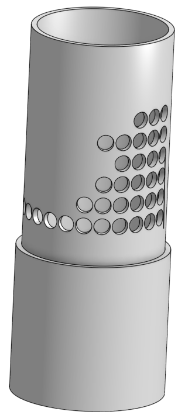
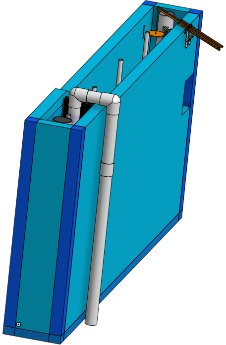
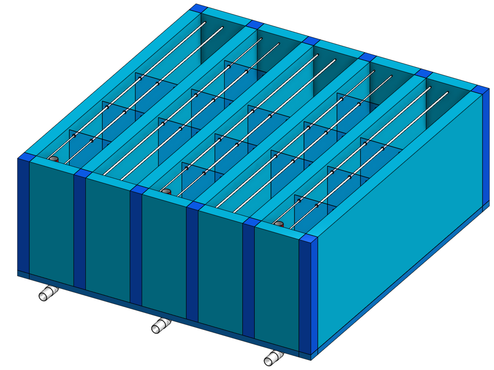
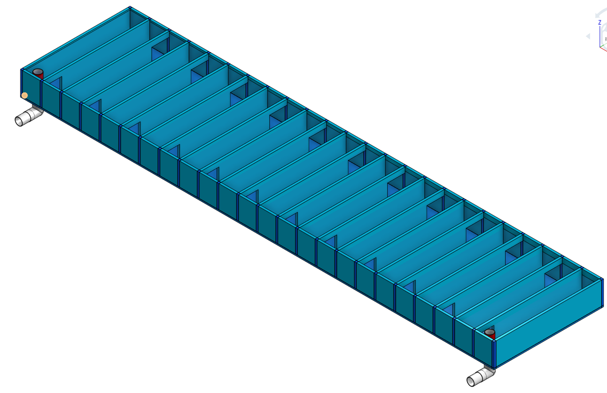
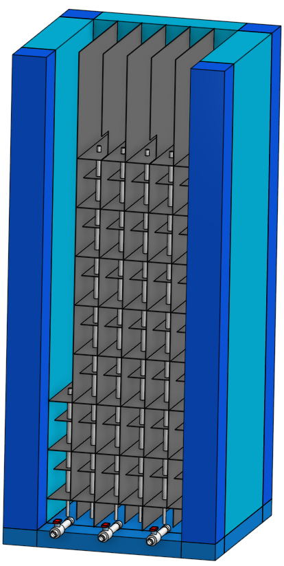
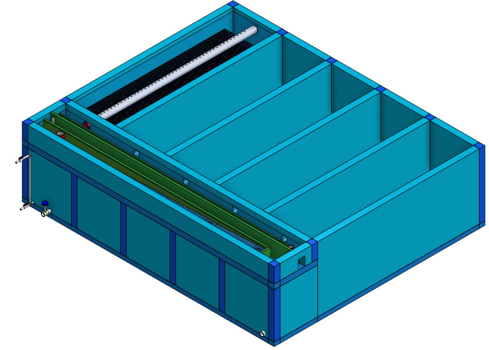
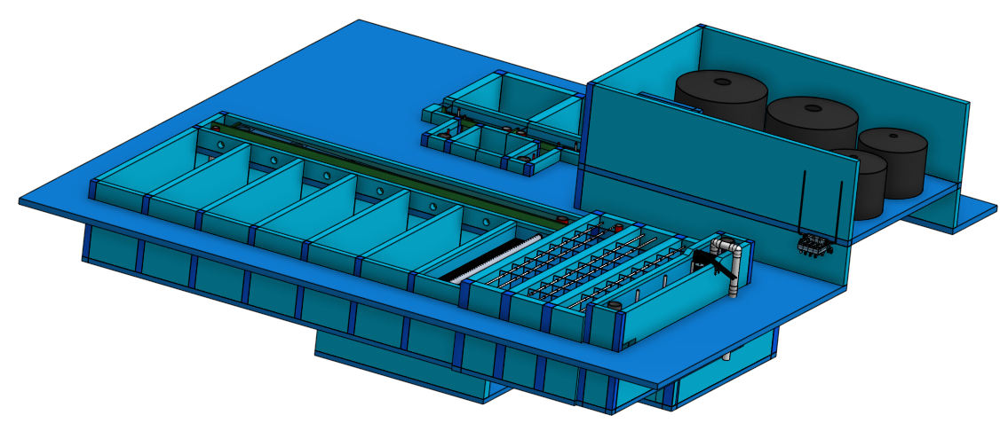

.. raw:: html

    <embed>
       <link rel="canonical" href="https://aguaclara.github.io/Textbook" />
       
    </embed>

.. _title_Chemistry_of_Water_Treatment_Introduction:

**************************************
AguaClara Infrastructure Design Engine
**************************************

.. |OStaRS| image:: ../Images/AIDEostars.png
  :width: 80

The following AIDE Smart Parts are provided for education and as a demonstration of the AguaClara Reach ability to provide customized designs to AguaClara implementation partners. The AIDE Smart Parts are not

If you do not yet have an Onshape account, then you will be able to make changes to the configuration of the Smart Parts and will have access to the `view only toolbar <https://cad.onshape.com/help/Content/viewonlytoolbar.htm>`_. You can sign up for a `free public Onshape account <https://www.onshape.com/en/products/free>`_ that will enable you to also access the parts lists and ESTIMATED materials cost for each of the AIDE Smart Parts.

.. _table_AIDE Smart Parts:

.. csv-table:: AIDE Smart Parts.
   :header: "Image", "`AIDE Smart Parts <https://cad.onshape.com/documents?nodeId=a20a96b6267e1942c6dc9951&resourceType=folder>`_",  "Description"
   :align: left

   |LFOM|, "`LFOM <https://cad.onshape.com/documents/49035a16b895fd8095d17a02>`_", "Linear Flow Orifice Meter"
   |EntranceTank|, "`Entrance Tank <https://cad.onshape.com/documents/4c47a124da3abec33e0ce813>`_", "Trash racks, grit removal, chemical dose controller, and linear flow orifice meter"
   |FlocculatorVH|, "`Flocculator VH <https://cad.onshape.com/documents/673077f4fa843a817d4cd55d>`_", "Vertical-Horizontal Flocculator for flows below about 20 L/s"
   |FlocculatorHV|, "`Flocculator HV <https://cad.onshape.com/documents/9742e8c019b742df4ae4db85>`_", "Horizontal-Vertical Flocculator for flows between about 10 and 100 L/s"
   |FlocculatorHH|, "`Flocculator HH <https://cad.onshape.com/documents/84c4c94f9773b67506cd35bb>`_", "Horizontal-Horizontal Flocculator for flows above about 100 L/s"
   |Clarifier|, "`Clarifier <https://cad.onshape.com/documents/e05915c533ee7568c402981a>`_", "Clarifier with floc filter, plate settlers, and floc hopper"
   |OStaRS|, "`OStaRS <https://cad.onshape.com/documents/8a1a990f01575e6e5eed1922>`_", "Open Stacked Rapid Sand Filter"
   |20-80Lpsplant|, "`20-80 L/s plant <https://cad.onshape.com/documents/0e9ede93e11e5a54f68f8606>`_", "Integrated plant for flows between 20 and 80 L/s"
