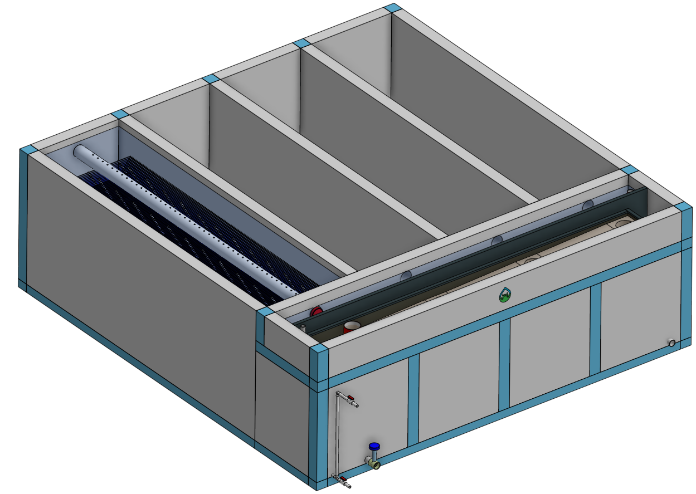
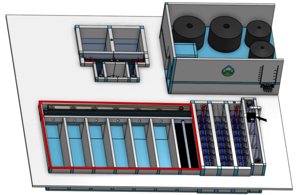
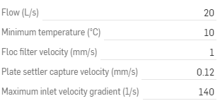

.. raw:: html
    <embed>
       <link rel="canonical" href="https://aguaclara.github.io/Textbook/AIDE/About/Clarifier.html" />
       
    </embed>

.. list-table::
   :widths: 40 45 35 30
   :header-rows: 0

   * - |ACRlogowithname|
     - |feedback|
     - |textbook|
     - |donate|

.. _title_Clarifier_Configurable_Component:

********************************************
Clarifier Configurable Component
********************************************

.. _figure_Clarifier:

    The clarifier includes a floc filter that captures small particles and plate settlers that capture particles that settle faster than the plate settler capture velocity.

.. _figure_ClarifierinPlant:

    The clarifier (outlined in red) is attached to the flocculator to create a compact plant layout.

The Clarifier Features:
==========================================

  #. A mechanism for the operator to dump poorly flocculated water before it enters the clarifier. This is important to reduce the recovery time when there is a flocculation failure.
  #. A stable floc filter that reduces the clarified water turbidity.
  #. Plate settlers cause small flocs to aggregate into large flocs that then act as filters in the floc filter.
  #. A inlet diffuser and jet reverser that prevents accumulation of sludge that would tend to become anaerobic and release both dissolved organics (taste and order issues) and methane bubbles that would carry flocs to the top of the clarifier.
  #. A floc hopper that removes the solids without requiring power or moving mechanical parts.

Generate New Models of the Clarifier
========================================

Edit the configurations to create new models of the clarifier. Send us |feedback| to share how you are using the clarifier model, to give us suggestions for how to make these models easier to use, and to report any bugs.

.. _figure_configClarifier:

    The configuration options for the Clarifier.

.. csv-table:: Clarifier configurations.
   :header: "Configuration", "Description"
   :align: left
   :widths: 50, 100

   "",""
   "Flow (L/s)", "The maximum flow rate sets the size of the clarifier. Vary it to see how the dimensions change. Flow rates below 2 L/s create a single clarifier bay and use a different inlet/outlet system."
   "",""
   Minimum temperature (˚C), The temperature influences the design of the inlet manifold.
   "",""
   Floc filter velocity (mm/s), Upflow velocity in the vertical wall section of the floc filter.
   "",""
   Plate settler capture velocity (mm/s), The capture velocity for removal of grit. The clarifier will capture grit that has a terminal velocity faster than this capture velocity. This determines the plan view area of the hoppers in the clarifier.
   "",""
   Maximum inlet velocity gradient (1/s), Controls breakup of flocs entering the clarifier. The inlet manifold diameter increases and the diffuser openings increase in width for lower values of the velocity gradient.

Additional information is available in the chapter on `Clarifier Design <https://aguaclara.github.io/Textbook/Clarification/Clarifier_Design.html>`_

.. |ACRlogowithname| image:: ./Images/ACRlogowithname.png
  :target: https://www.aguaclarareach.org/
  :height: 30

