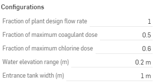

.. list-table::
   :widths: 60 50 30
   :header-rows: 0

   * - |ACRlogowithname|
     - |textbook|
     - |donate|

.. _title_Doser_Configurable_Component:

************************************************
Chemical Dose Controller Configurable Component
************************************************

.. _figure_Doser:

.. figure:: ./Images/doser.png
    :width: 500px
    :align: center
    :alt: Chemical Dose Controller

    Chemical dose controller designed for two independent chemical feeds.

.. _figure_DoserinET:

.. figure:: ./Images/DoserinET.png
    :width: 300px
    :align: center
    :alt: Location of the Chemical Dose Controller in the Entrance Tank

    The chemical dose controller (outlined in red) is mounted on the wall of the entrance tank.

Generate New Models of the Chemical Dose Controller
===================================================

Edit the configurations to create new models of the chemical dose controller. Send us |feedback| to share how you are using the chemical dose controller model and to give us suggestions for how to make these models easier to use.

.. _figure_configLFOM:

    The configuration options for the chemical dose controller.

.. csv-table:: Chemical dose controller configurations.
   :header: "Configuration", "Description"
   :align: left
   :widths: 50, 100

   "",""
   "Fraction of plant design flow rate", "The entrance tank water level is proportional to plant flow rate. The angle of the doser will change with this input."
   "",""
   Fraction of maximum coagulant dose, "The coagulant slider position will change with this input."
   "",""
   Fraction of maximum chlorine dose, "The chlorine slider position will change with this input."
   "",""
   Water elevation range (m), "Change in water elevation in the entrance tank that corresponds to the flow varying from 0 L/s up to the maximum design flow rate."
   "",""
   Entrance tank width (m), "The float position will be adjusted to ensure that it is inside the entrance tank."

Additional information is available in *The Physics of Water Treatment* in the section on `Linear Chemical Dose Controller <https://aguaclara.github.io/Textbook/Flow_Control_and_Measurement/FCM_Design.html#linear-chemical-dose-controller-cdc>`_

.. |donate| image:: ./Images/donate.png
  :target: https://www.aguaclarareach.org/donate-now
  :height: 40

.. |textbook| image:: ./Images/textbook.png
  :target: https://aguaclara.github.io/Textbook/AIDE/AIDE.html
  :height: 40

.. |ACRlogowithname| image:: ./Images/ACRlogowithname.png
  :target: https://www.aguaclarareach.org/
  :height: 40

.. |feedback| image:: ./Images/feedback.png
  :target: https://docs.google.com/forms/d/e/1FAIpQLSdYHVinzW-xZskW74rpZ_7prHAqjLQDwadCNiRP39nyu7NHMw/viewform?
  :height: 25
