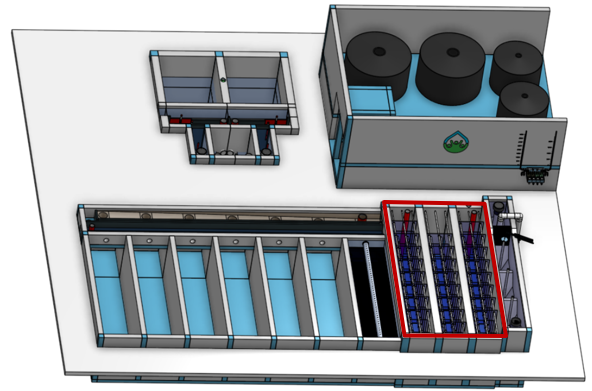
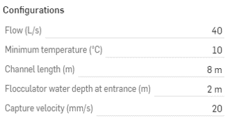

.. raw:: html
    <embed>
       <link rel="canonical" href="https://aguaclara.github.io/Textbook/AIDE/About/ET.html" />
       
    </embed>

.. list-table::
   :widths: 70 50 50
   :header-rows: 1

   * - |ACRlogowithname|
     - |textbook|
     - |donate|

.. _title_Entrance_Tank_Configurable_Component:

********************************************
Entrance Tank Configurable Component
********************************************

.. _figure_ETinPlant:

    The Flocculator (outlined in red) is where the raw water particles collide and grow into flocs.

The flocculator has three design constraints:

  #. Deform the fluid enough so that there are ample collision opportunities for particles.
  #.

Edit the configurations to create new models of the flocculator.

.. _figure_configET:

    The configuration options for the Entrance Tank.

Additional information is available in the chapter on `Entrance Tank Design <https://aguaclara.github.io/Textbook/Flow_Control_and_Measurement/ET_Design.html>`_

.. |donate| image:: Donate.png
  :target: https://www.aguaclarareach.org/donate-now
  :height: 40

