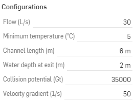

.. raw:: html
    <embed>
       <link rel="canonical" href="https://aguaclara.github.io/Textbook/AIDE/About/ET.html" />
       
    </embed>

.. list-table::
   :widths: 60 50 30
   :header-rows: 0

   * - |ACRlogowithname|
     - |textbook|
     - |donate|

.. _title_Flocculator_HV_Configurable_Component:

********************************************
Flocculator HV Configurable Component
********************************************

.. _figure_FlocHV:

.. figure:: FlocHV.png
    :width: 500px
    :align: center
    :alt: Location of the Entrance Tank

    The flocculator use baffles to create a flow path with 180˚ bends. The flow contracts as it goes around the bend, expands, generates turbulence, and then deforms the fluid as viscosity converts the turbulent kinetic energy into heat. The fluid deformation causes collisions between particles.

.. _figure_FlocHVinPlant:

.. figure:: FlocHVinPlant.png
    :width: 400px
    :align: center
    :alt: Location of the Entrance Tank

    The flocculator (outlined in red) is where the raw water particles collide and grow into flocs.

The flocculator has three design constraints:
=============================================

  #. Deform the fluid so there are sufficient collision opportunities for particles.
  #. Maintain a flow expansion geometric ratio (flow width to distance between expansions) that is greater than 4.
  #. Limit the velocity gradient so that flocs can grow large enough to be captured by the plate settlers in the clarifier.

Generate New Models of the Flocculator
========================================

Edit the configurations to create new models of the flocculator. Some models may fail because the constraints can't all be met.

.. _figure_configFloc:

    The configuration options for the Flocculator.

.. csv-table:: Flocculator HV configurations.
   :header: "Configuration", "Description"
   :align: left
   :widths: 50, 100

   "Flow (L/s)", "The maximum flow rate sets the size of the flocculator. Vary it to see how the dimensions change."
   Minimum temperature (˚C), The water viscosity increases for low temperatures and thus more energy is required (greater head loss) to achieve the same total fluid deformation.
   Channel length (m), The inside length of the flocculator that enables fitting the flocculator next to the clarifier to make a compact plant layout. Specify a long channel length to create a flocculator with a single channel.
   Water depth at exit (m), The flocculator is built on the same slab as the clarifier and the elevation of the water leaving the flocculator must match the water level at the entrance of the clarifier.
   Collision potential (Gt), The collision potential is created by the total fluid deformation in the flocculator.

Additional information is available in the chapter on `Flocculator Design <https://aguaclara.github.io/Textbook/Flocculation/Floc_Design.html>`_

.. |donate| image:: donate.png
  :target: https://www.aguaclarareach.org/donate-now
  :height: 40

.. |textbook| image:: textbook.png
  :target: https://aguaclara.github.io/Textbook/AIDE/AIDE.html
  :height: 40

.. |ACRlogowithname| image:: ACRlogowithname.png
  :target: https://www.aguaclarareach.org/
  :height: 40
