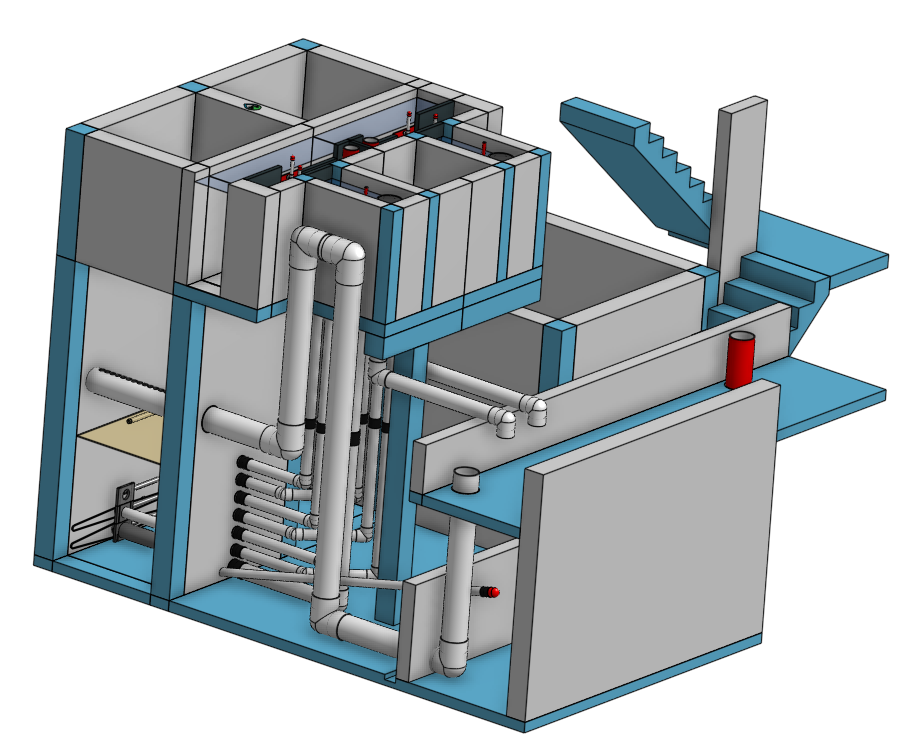
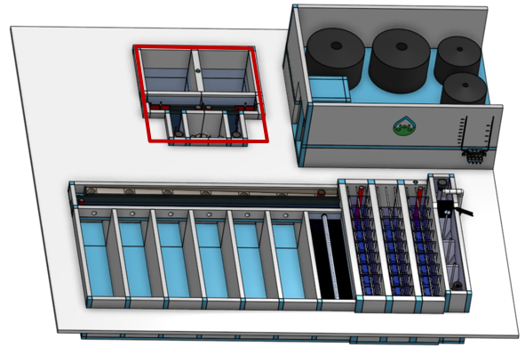

.. raw:: html
    <embed>
       <link rel="canonical" href="https://aguaclara.github.io/Textbook/AIDE/About/OStaRS.html" />
       
    </embed>

.. list-table::
   :widths: 60 50 30
   :header-rows: 0

   * - |ACRlogowithname|
     - |textbook|
     - |donate|

.. _title_Open_Stacked_Rapid_Sand_Filter_Configurable_Component:

*****************************************************
Open Stacked Rapid Sand Filter Configurable Component
*****************************************************

.. _figure_OStaRS:

    The entrance tank is where the raw water first enters the water treatment plant. It enters through the pipe on the right, passes through the 2 trash racks, flows through the grit removal zone, and exits through the linear flow orifice meter.

.. _figure_OStaRSinPlant:

    The entrance tank (outlined in red) is attached to the flocculator to create a compact plant layout.

The entrance tank has four main functions:
==========================================

  #. Remove trash and debris that could potentially clog the diffusers in the inlet manifold to the clarifier.
  #. Remove grit and sand that would otherwise settle in the flocculator.
  #. Measure the flow rate entering the plant using a Linear Flow Orifice Meter.
  #. Automatically vary the chemical feed rates as the plant flow rate changes with the chemical doser.

Generate New Models of the Entrance Tank
========================================

Edit the configurations to create new models of the entrance tank. Some models may fail because the constraints can't all be met.

.. _figure_configOStaRS:

.. figure:: configET.png
    :width: 400px
    :align: center
    :alt: Location of the Entrance Tank

    The configuration options for the Entrance Tank.

.. csv-table:: Entrance tank configurations.
   :header: "Configuration", "Description"
   :align: left
   :widths: 50, 100

   "Flow (L/s)", "The maximum flow rate sets the size of the entrance tank. Vary it to see how the dimensions change."
   Minimum temperature (˚C), The flow is turbulent throughout the entrance tank and thus temperature doesn’t have a significant effect on the design.

Additional information is available in the chapter on `Entrance Tank Design <https://aguaclara.github.io/Textbook/Filtration/Filtration_Design.html>`_

.. |donate| image:: Donate.png
  :target: https://www.aguaclarareach.org/donate-now
  :height: 40

.. |textbook| image:: textbook.png
  :target: https://aguaclara.github.io/Textbook/AIDE/AIDE.html
  :height: 40

.. |ACRlogowithname| image:: ACRlogowithname.png
  :target: https://www.aguaclarareach.org/
  :height: 40
