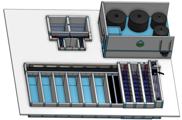
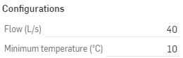

.. raw:: html

    <embed>
       <link rel="canonical" href="https://aguaclara.github.io/Textbook/AIDE/About/ET.html" />
       
    </embed>

.. list-table::
   :widths: 60 50 30
   :header-rows: 0

   * - |ACRlogowithname|
     - |textbook|
     - |donate|

.. _title_Full_Plant_20-80:

*********************************************
Full Plant (20-80 L/s) Configurable Component
*********************************************

.. _figure_Plant20-80:

    The full plant includes a gravity powered chemical dosing system, trash removal, flow measurement, hydraulic flocculation, floc filter, plate settlers, and stacked rapid sand filtration.

Generate New Models of the Full Plant
========================================

Edit the configurations to create new models of the full plant. Send us |feedback| to share how you are using the Full Plant model and to give us suggestions for how to make these models easier to use.

.. _figure_configPlant20-80:

    The configuration options for the full plant.

.. csv-table:: Full plant configurations.
   :header: "Configuration", "Description"
   :align: left
   :widths: 50, 100

   "",""
   "Flow (L/s)", "The maximum flow rate sets the size of all of the processes in the plant. Vary it to see how everything changes."
   "",""
   Minimum temperature (˚C), "Temperature changes the design for the flocculator, clarifier, and filter."

.. |donate| image:: ./Images/donate.png
  :target: https://www.aguaclarareach.org/donate-now
  :height: 40

.. |textbook| image:: ./Images/textbook.png
  :target: https://aguaclara.github.io/Textbook/AIDE/AIDE.html
  :height: 40

.. |ACRlogowithname| image:: ./Images/ACRlogowithname.png
  :target: https://www.aguaclarareach.org/
  :height: 40

.. |feedback| image:: ./Images/feedback.png
  :target: https://docs.google.com/forms/d/e/1FAIpQLSdYHVinzW-xZskW74rpZ_7prHAqjLQDwadCNiRP39nyu7NHMw/viewform?
  :height: 25
