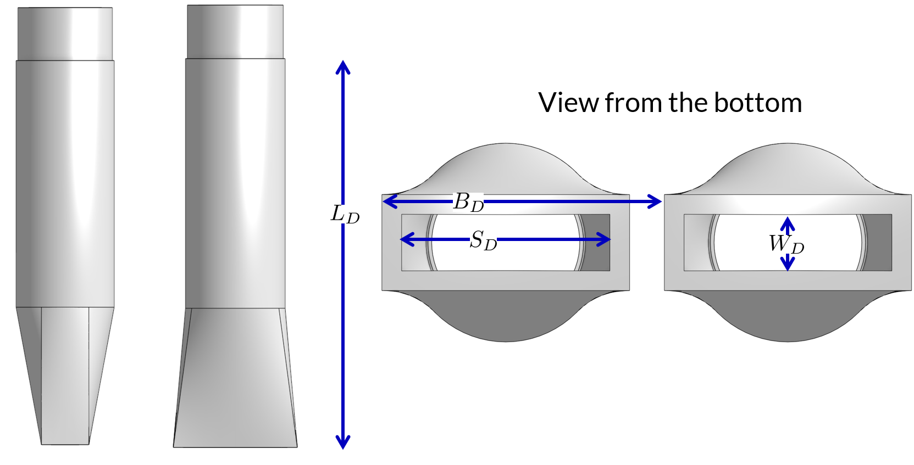

.. raw:: html

    <embed>
       <link rel="canonical" href="https://aguaclara.github.io/Textbook/AIDE/Specifications.html" />
       
    </embed>

.. _title_AguaClara_Specifications:

************************
AguaClara Specifications
************************

This document specifies the design goals, the raw water quality parameters, and the design and construction requirements for an AguaClara drinking water treatment plant. The plant will produce safe, potable drinking water from a source water that may be contaminated with particles, pathogens, and dissolved organics.

AguaClara Plant Design Goals |20-80Lpsplant|
============================================

AguaClara drinking water treatment technologies remove turbidity and pathogens from raw water and to deactivate remaining pathogens before distribution. AguaClara technologies are best suited for centralized water treatment in communities of at least 200 people. AguaClara technologies would not be appropriate for treatment of low-turbidity groundwater where the primary contamination issues are chemical, such as nitrate or heavy metals. AguaClara technologies are gravity-driven and do not require electricity. When required by the topography, pumps can raise the source water to the elevation necessary for water treatment and water distribution.

AguaClara treatment technologies include chemical dosing, rapid mix, flocculation, floc filter, plate settlers, filtration, and disinfection. An AguaClara treatment plant may be designed with all of these processes, or if raw water turbidity is consistently less than about 3 NTU, the treatment plant may be designed without flocculation, floc filter, and plate settlers.

Water Quality Parameters
------------------------

The tables below summarize the raw water quality parameters for which AguaClara treatment technologies are appropriate.

.. _table_Water_Quality_Parameters:

.. csv-table:: Water Quality Parameters Treated by AguaClara Plants
   :header: "Water Quality Parameter", "Comments"
   :align: left

   Turbidity, "Raw water with turbidity up to 1,000 NTU can consistently be treated to less than 1 NTU."
   "Color/Dissolved Organic Matter (DOM)", "For raw water with high color or total organic matter content, pilot studies are recommended to confirm the efficacy of the coagulant and the ability of the flocs to settle."
   pH, "pH can be lowered to prevent calcium carbonate scaling in distribution piping or increased to reduce corrosion potential."
   Microbiological contamination, "The AguaClara treatment processes are designed to remove pathogens through particle removal and disinfection."

AguaClara plants are only designed to treat the water quality parameters listed above. All other parameters should be within acceptable ranges in the raw water or should be treated by other means.

Before beginning construction of an AguaClara treatment plant, bench-scale jar testing should be performed to confirm that polyaluminum chloride or another proposed coagulant is able to successfully form flocs that settle.

Chemical Dosing System
======================

For more detailed information see :ref:`Linear chemical dosing system <heading_linear_cdc>`.

Design Goals
------------

A. The system will be capable of dosing chemicals for the following purposes. All materials shall be compatible with the chemicals being dosed.

   1. Disinfectant (normally sodium or calcium hypochlorite)

   #. Coagulant (typically polyaluminum chloride [PACl], but other coagulants such as alum can be used if justification is provided. Bench-scale jar testing should be performed to confirm that the proposed coagulant is able to successfully form flocs.)

   #. pH adjustment (if necessary)

#. The chemical dosing system shall function by gravity and not depend on pumps or electrical power.

#. The chemical dosing shall be flow-paced, meaning that the rate of chemical application is automatically adjusted proportional to the flow rate of water moving through the plant.

#. The system shall be easily disassembled by the plant operator for cleaning with vinegar to remove calcium carbonate deposits.

#. The chemical dose (mass chemical per volume water passing through the plant) shall be easily adjustable by the plant operator.

Chemical Storage
----------------

A. For each chemical, the plant shall include two or more storage tanks. The tank and fitting materials shall be compatible with the chemical. Storage tanks can be plastic or concrete, as long as they are confirmed to be compatible with the chemical being stored.

#. The combined volume of all tanks used for a chemical shall allow for storage of sufficient chemical to supply the plant at maximum flow and maximum chemical dose for at least 48 hours.

Chemical Feed System
--------------------

The plant shall be equipped with a chemical feed system configured as shown in :numref:`figure_spec_chemDoseController`. Materials that will be in contact with chemicals must be compatible with the chemical and suitable for use with potable water.

.. _figure_spec_chemDoseController:

.. figure:: ../Images/CDC_derivation.png
    :width: 500px
    :align: center
    :alt: chemDoseController

    Gravity powered chemical feed system schematic.

A. Constant Level Tank

   1. From the chemical storage tanks, the chemical passes via gravity to a constant level tank (see :numref:`figure_spec_constantLevelTank`). The chemical enters the constant level tank via a float valve, which maintains a constant level of chemical, providing a constant head to drive the chemical through the doser.

   #. The chemical level in the constant level tank shall be level with the fulcrum of the dosing lever.

   #. The vertical distance from the constant level tank level to the end of the dosing hose at max flow and max dose shall be 20 cm.

.. _figure_spec_constantLevelTank:

.. figure:: ../Images/CLT.png
    :width: 600px
    :align: center
    :alt: Constant Level Tank

    Constant level tank module for coagulant and chlorine.

B. Dosing Tubes

   1. Chemical flows from the constant level tank into dosing tubes, which terminate in a free discharge at the dose slider on the doser lever.

   #. The diameter of the tubes shall be designed to provide laminar flow over the desired range of chemical flows. Given the laminar flow, the flowrate through the dosing tubes will be directly proportional to elevation difference between the chemical level in the constant level tank and the dose slider.

   #. The plant shall have a spare set of dosing tubes on hand so that one set of tubes can be cleaned while the other set is in use.

   #. Head loss through all other tubes and fittings other than the dosing tubes shall be less than 5% of the head loss through the dosing tubes.

#. Chemical Dose Controller |Doser|

   1. One end of the chemical dose controller (see :numref:`figure_spec_doser`) is connected to a float in the plant entrance tank. The dose slider and thus the ends of the doser hoses are located on the other half of the chemical dose controller lever.

   #. To provide a reasonable maximum angle of the lever system the lever shall be at least four times as long as the LFOM change in water depth.

.. _figure_spec_doser:

.. figure:: ../Images/doser.png
    :width: 500px
    :align: center
    :alt: Doser

    Chemical dose controller designed for two independent chemical feeds.

D. Function

   1. The doser is designed so that the operator can select a chemical dose (mass of chemical per volume of water) by moving the dose slider to a specific position along the lever. The lever, LFOM and constant level tank then work together to adjust the chemical flow proportional to the plant flow to maintain a constant chemical dose.

   #. When the plant flow is zero, the lever is horizontal and chemical flow is zero.

   #. When plant flow increases, the water level in the entrance tank increases (due additional head loss through the LFOM), causing one end of the doser lever to rise. This, in turn, causes the other end of the lever, and the dose slider, to fall, increasing the elevation difference between the chemical level in the constant level tank and the dose slider. The greater driving head increases the chemical flow through the doser.

   #. Because the entrance tank level is directly proportional to the plant flow rate (due to the LFOM), the dose slider elevation is directly proportional to the entrance tank level, and the chemical flow is directly proportional to the dose slider elevation, the chemical flow is directly proportional to the plant flow.

Entrance Tank |EntranceTank|
============================

For more detailed information see :ref:`Entrance Tank Design <title_entrance_tank_design>`. The entrance tank (see :numref:`figure_spec_ET_Diagram_Labeled`) has multiple functions in a drinking water treatment plant.

#. Remove air bubbles to reduce splashing, turbulence, and unsteady motion of the chemical feed surface tracking lever system
#. Remove grit to prevent accumulation in the flocculator
#. Remove leaves and other debris to prevent clogging of the diffusers in the clarifier inlet
#. Dissipate kinetic energy to keep the water level steady for accurate flow measurement
#. Measure the incoming flow rate so that operators can make adjustments and respond to changes in water demand
#. Inject the coagulant and any other amendments required for flocculation

.. _figure_spec_ET_Diagram_Labeled:

.. figure:: ../Images/ET_Diagram_Labeled.png
    :width: 900px
    :align: center
    :alt: entrance tank diagram

    Cross-section of an entrance tank. Lever arm of chemical dosing system not pictured.

Grit Removal
------------

A. The entrance tank shall be designed as a horizontal flow sedimentation tank for the removal of grit with a recommended capture velocity of less than 15 mm/s .

#. The bottom of the entrance tank shall be a series of grit hoppers that can easily be cleaned by temporarily removing the pipe stub that blocks the outlet.

Trash Rack
----------

A. The trash rack shall have an opening size that is smaller than the diffusers in the clarifier and the orifices in the stacked rapid sand filter inlet branches.

#. The trash rack area shall be sufficient that it can be at least 80% clogged before exceeding the available head loss in the entrance tank.

Linear Flow Orifice Meter (LFOM) or Equivalent |LFOM|
-----------------------------------------------------

A. The plant entrance tank shall be equipped with a device that will result in a linear relationship between the plant flow and the water level in the entrance chamber. The Linear Flow Orifice Meter (LFOM), which is a pattern of orifices through which flow exits the entrance tank, is described below. An equivalent device, such as a Sutro weir, can also be used if demonstrated to function equivalently.

#. The pattern of orifices shall be designed so that the water level in the entrance chamber (equal to the hydrostatic head pushing water through the offices) is linearly proportional to the total flow through the orifices (equal to the plant flow). An example of an LFOM is shown in :numref:`figure_spec_LFOM`. The orifices may be drilled in a flat plate or in the walls of a vertical pipe.

#. The LFOM shall be capable of measuring flow ranging from 10 percent to 100 percent of the maximum plant design flow.

#. To ensure that plant flow is measured with adequate resolution the water level should change a minimum of 20 cm from no flow to the design flow rate. Larger water level changes can be used to enable use of smaller diameter LFOMs.

#. Depending on the plant flow, the LFOM may consist of orifices in one or multiple riser pipes or in a flat plate.

.. _figure_spec_LFOM:

.. figure:: ../Images/LFOM.png
    :width: 100px
    :align: center
    :alt: LFOM

    Example of a Linear Flow Orifice Meter

Flocculator
===========

For more detailed information see :ref:`Flocculation Design <title_Flocculation_Design>`. AguaClara flocculators have three potential flow patterns (see :numref:`figure_spec_flocculator_Geometry`) depending on the flow rate, plant layout, and velocity gradient.

#. |FlocculatorVH| Vertical - Horizontal: Flows between 0.5 L/s and 20 L/s are efficiently handled by a Vertical-Horizontal flow flocculator as shown in :numref:`figure_VHflocculator`.

#. |FlocculatorHV| Horizontal - Vertical: The geometry switches to horizontal-vertical for flows between about 20 and 200 L/s as shown in :numref:`figure_HVflocculator`.

#. |FlocculatorHH| Horizontal - Horizontal: As the flow increases above 200 L/s the optimal design will switch to a horizontal-horizontal flocculator as shown in :numref:`figure_HHflocculator`.

.. _figure_spec_flocculator_Geometry:

.. figure:: ../Images/flocculator_Geometry.png
  :align: center
  :width: 500px
  :alt:  3 flocculator geometries

  The optimal flocculator geometry transitions as the flow rate increases. Note that each of these flocculators has approximately the same depth.

Design Goals
------------

The AguaClara flocculator is designed with the following goals:

A. Velocity gradient and residence time to aggregate individual particles and small flocs into flocs large enough to settle out in the sedimentation tanks. The product of velocity gradient (G) and residence time (ϴ) is a dimensionless number known as collision potential or Gϴ.

#. Minimize retention time to reach a design Gϴ of approximately 37,000. This determines the minimum total volume of the flocculator. The design volume of the flocculator may be larger due to construction constraints, such as making the length of the flocculator the same as the length of the sedimentation tanks or keeping the flocculator channels wide enough to fit a human body for ease of cleaning and maintenance. 

#. Minimize “dead zones” in the flocculator and reduce the opportunity for short circuiting of the flocculator.

#. Facilitate the draining of sludge and maintenance manually by one person

Flow Paths
----------

A. The length of the flocculator channels is typically determined by the length of the clarifier to create a compact plant layout.

#. The width of each flocculation channel is determined by material constraints and to facilitate cleaning and maintenance. The flocculator baffles are made of polycarbonate sheets, so the width of the channel should be no larger than the width of a polycarbonate sheet. The width of the channel should be no smaller than 50 cm so an operator can safely enter the tank. Large plants treating more than 100 L/s may be designed with horizontal flocculation channels and may use ferrocement baffles.

#. The depth of the flocculation channels is determined by construction constraints and to minimize the plan view area of the flocculators and thus the plant.

#. The overall volume of the flocculator is determined by the individual constraints on each dimension of the flocculator, but the collision potential, Gϴ, of the flocculator must be at least 37,000.

#. The spacing between baffles is designed to achieve the target velocity gradient, G, at the design flow rate.

#. The ports between flocculator channels should be designed with the same flow area as the space between the baffles so that the port improves flocculation without breaking flocs. The width of the port is equal to the spacing between baffles and the height of the port is equal to the channel width.

Channel Construction
--------------------

A. The walls of the flocculation channels should be vertical, maintaining the channel width along both the length and height of each flocculator channel.

#. The floor of each flocculation channel should be sloped toward the drain channel, and one or more drain valves should be installed to periodically remove sludge from the flocculator. The slope and valves also allow the flocculation channels to be completely emptied for more in-depth maintenance.

#. The drain pipes are activated by removing a vertical pipe stub. The drain pipes must be large enough to empty the flocculation channels in 20 minutes. The drains are placed near a port between channels so that each drain can serve two channels.

#. The flocculator should have sufficient lighting for the operator to observe floc formation. The operator should also have a flashlight to observe floc formation during power outages.

Baffles
-------

A. The flocculation baffles must be constructed to be removable. A baffle module (see :numref:`figure_spec_baffleModule`) should be raisable by one operator working alone so that water can flow beneath the baffle and drain from the flocculator channel. Large flocculators may have baffle modules that require more than one person to completely remove from the flocculator channel.

#. The flocculation baffles should be constructed from polycarbonate sheets, and the frame for holding together baffle modules should be made from PVC. Other materials may be used if justification is provided, including the use of ferrocement baffles for horizontal flocculators in large plants.

.. _figure_spec_baffleModule:

.. figure:: ../Images/baffleModule.png
  :align: center
  :width: 500px
  :alt:  Baffle Module

  The baffle modules transfer the force of the water to the downstream wall through the PVC pipe frame. Each flocculator channels holds one baffle module.

Clarifier |Clarifier|
=====================

For more detailed information see :ref:`Clarifier Design <title_Clarifier_Design>`. The clarifier (see :numref:`figure_spec_clarifierElevation`) contains three separate processes: floc filter, plate settlers, and floc hopper.

The clarifier must be designed based on the coldest water temperature and based on the lowest density primary particles that will need to be captured. Surface waters with high concentrations of dissolved organic matter and low concentrations of suspended solids produce low density flocs and thus the velocity gradient in the inlet manifold and jet reverser must be reduced.

.. _figure_spec_clarifierElevation:

.. figure:: ../Images/clarifierElevation.png
  :align: center
  :width: 500px
  :alt:  Clarifier Elevation view

  Elevation view of a clarifier bay showing location of the floc filter, plate settlers, and floc hopper.

Design Goals
------------

The high-rate, vertical flow clarifier is designed with the following goals:

A. To deliver flocs to the clarifier bay without breaking them into pieces with terminal velocities below the capture velocity of the plate settlers. This sets the maximum velocity gradient for the transfer of the flocs from the flocculator to the floc filter in the clarifier bay. The maximum velocity gradient shall be less than 250 Hz and lower values will be required for raw waters with high concentrations of dissolved organic matter.

#. To produce a stable floc filter (fluidized suspension of flocs) that reduces the clarified water turbidity.

#. To provide evenly distributed low-velocity flow through the plate settlers.

#. To prevent accumulation of sludge that would tend to become anaerobic and release both dissolved organics (taste and odor issues) and methane bubbles that would carry flocs to the top of the clarifier.

#. To remove the solids without requiring power or moving mechanical parts.

#. To provide a mechanism for the operator to dump poorly flocculated water before it enters the clarifier. This is important to reduce the recovery time when there is a flocculation failure.

#. To ensure easy operation and maintenance.

#. To be able to take any clarifier bay offline for maintenance while the other clarifier bays continue to operate.

#. To be able to refill a clarifier bay with clarified water for rapid return to service.

Inlet Channel
----------------

The inlet channel (see :numref:`figure_spec_ClarifierInletOutletHydraulics`) is designed to have a velocity head that is very small compared with the head loss in the outlet manifold orifices to achieve uniform flow distribution between clarifier bays. The inlet channel is sloped up in the direction of flow to maintain relatively uniform velocity for improved flow distribution and to reduce floc deposition in the channel.

.. _figure_spec_ClarifierInletOutletHydraulics:

.. figure:: ../Images/ClarifierInletOutletHydraulics.png
  :align: center
  :width: 500px
  :alt:  Clarifier Inlet Outlet Hydraulics

  Flocculated water flows from the inlet channel to the inlet manifold and then through the diffusers, jet reverser, floc filter, and plate settlers. Clarified water flows into the outlet manifold, the collector channel, across the outlet weir, and into the outlet channel.

Inlet Manifold
-----------------

Flocculated water enters a pipe in the bottom of the inlet channel. Water flows down the pipe, through a 90-degree elbow, into the inlet manifold. Water exits the inlet manifold through a series of orifices and diffusers in the bottom of the pipe. The end of the inlet manifold is capped. The minimum diameter of the inlet manifold is set by the velocity gradient downstream of the 90-degree elbow (see Equation :eq:`D_pipe_min_of_K_and_jet_G_max`).

Achieving reasonable flow distribution between diffusers may require a flow equalization chamber inside the inlet manifold (see :numref:`figure_2stageInletManifold`).

Diffusers
---------

The orifices and diffusers point down to the bottom of the clarifier bay and extend along the length of the pipe at regular intervals to ensure that water is evenly distributed within the bay. Diffusers are designed to ensure that the jet exiting the jet reverser has a maximum velocity gradient that is less than the design constraint to prevent excessive floc breakup (see Equation :eq:`planejet_v_max_of_q`).

Diffusers are shaped so that one end is molded to be a reduced diameter that fits into the influent manifold port, and the other end is deformed to the shape of a rectangle (:numref:`figure_spec_diffuser_dimensions`). This deformation is done to create a line jet entering the jet reverser in the bottom of the clarifier bay and to enhance flow distribution by maximizing the jet velocity given the constraints of Equation :eq:`planejet_v_max_of_q`.

.. _figure_spec_diffuser_dimensions:

   Dimensions of the diffusers.

Jet Reverser
------------

The jet reverser consists of a longitudinally-cut half-pipe that is laid in the bottom of the bay (see :numref:`figure_spec_clarifierEndView`). It functions as a way to keep flocs suspended in the sedimentation tank by ensuring that any sludge that settles will be propelled back up by the force of the diffuser jet.

The diffusers are offset from the jet reverser centerline. This is intentionally done to promote the resuspension of flocs, which form a floc filter for primary filtration.

.. _figure_spec_clarifierEndView:

.. figure:: ../Images/clarifierEndView.png
   :width: 500px
   :align: center
   :alt: Clarifier showing jet reverser

   End view of a clarifier bay showing the sloped bottom, inlet manifold, diffusers, and jet reverser. The diffusers direct a jet of water into one side of the jet reverser.

Floc Filter (Floc Blanket)
--------------------------

Floc filters significantly improve the performance of a clarifier and reduce settled water.

A. The line jet from the diffusers enters the jet reverser to force flow up through the clarifier bay. The vertical upward jet momentum is used to resuspend flocs that have settled to the bottom of the clarifier bay. The resuspended flocs form a fluidized bed which is a floc filter. Small particles are captured by the flocs in the floc filter as the small particles flow into a floc.  The bed is fluidized because flocs are kept in suspension by the upflowing water.

#. Clarifiers use an upflow velocity of 1 mm/s in the floc filter. This velocity is measured  above the sloped bottom in the section of the clarifier bay with vertical walls.

#. For a floc filter to form, a clarifier requires that:

   1. The plate settlers capture small flocs and cause them to aggregate into larger flocs as they avalanche back into the floc filter zone. The increased terminal velocity of the larger flocs enables them to create a stable floc filter.

   #. All settled flocs are resuspended by the vertical jet of water exiting the jet reverser.

Sloped Bottom Geometry
----------------------

The clarifier bottom geometry (see :numref:`figure_spec_clarifierEndView`) prevents sludge accumulation while also ensuring good flow distribution. The slope on either side of the diffusers is at a 50 degree angle above horizontal. The bottom geometry allows for smooth flow expansion to the entire plan view area of the bay, and ensures that all flocs that settle are transported to the jet reverser. The diffusers do not touch the bottom of the tank so that flocs on both sides of the diffuser can return to the jet reverser for resuspension. Thus, there is no accumulation of settled flocs in the main clarifier bays.

Floc Hopper
-----------

The floc hopper (:numref:`figure_spec_flocHopper`) provides an opportunity for floc consolidation. The floc weir controls the depth of the floc filter because as the floc filter grows, it will eventually reach the top of the floc weir. Because flocs are more dense than water, the flocs “spill” over the edge of the floc weir which allows the floc filter to stay a constant height while sludge accumulates and consolidates in the floc hopper.

There is a manual valve at the drain of the floc hopper. Operators can open the floc hopper drain valve whenever they want to easily drain the sludge. The floc hopper allows for a self-cleaning clarifier. Operators only have to clean the clarifier once every three to six months because there is no stagnant accumulation of anoxic sludge.

.. _figure_spec_flocHopper:

.. figure:: ../Images/flocHopper.png
   :width: 400px
   :align: center
   :alt: Floc Hopper

   The floc hopper is located beneath the inlet and outlet channels. Flocs enter the hopper by flowing over the floc weir. Sludge is drained from the bottom of the hopper.

Plate Settlers
--------------

After flowing through the floc filter, flocs reach the plate settlers. Plate settlers are sloped surfaces that provide additional settling area for flocs, thereby increasing the effective settling area of the clarifier without increasing the plan view area. AguaClara plate settlers are sloped at 60 degrees. The spacing between plates is 2.5 cm.

The plate settlers are made from clear polycarbonate sheets. The sheets are assembled in modules (see :numref:`figure_spec_plateSettlerModule`). The modules are light enough to be removed from the clarifier by hand. The plate settler modules are supported by ledges along the clarifier bay walls and by a PVC pipe frame.

.. _figure_spec_plateSettlerModule:

.. figure:: ../Images/plateSettlerModule.png
   :width: 300px
   :align: center
   :alt: Plate settler module

   Plate settler module assembled from polycarbonate sheets and PVC piping. 

.. _table_Plate_Settler:

.. csv-table:: Plate Settler Design Parameters
   :header: Parameter, Determined by:, Determines , Value
   :align: left

   Upflow velocity, Floc blanket,Plan view area of tank,1 mm/s
   Capture velocity, Target turbidity, Particle size distribution, 0.12 mm/s
   Plate angle, Self-cleaning requirement, Plate settler length, 60 deg
   Plate spacing, Clogging and floc rollup constraints, Plate settler length, 2.5 cm
   Plate settler length, "Upflow velocity, Capture velocity, Plate angle, Plate spacing ", Tank depth, Calculated for each plant

Submerged Outlet Manifold
---------------------------

The submerged outlet manifold, sometimes called a launder, collects clarified water from the top of the clarifier. It is a horizontal pipe that extends along the length of the clarifier bay and is located above the plate settlers but below the surface of the water. The submerged pipe has orifices drilled into its top; water enters the pipe through the orifices and the pipe leads out of the clarifier bay.

The outlet manifold is designed to generate 5 cm of head loss to ensure uniform flow distribution between clarifier bays and to have the majority of the head loss through the orifices to obtain uniform flow distribution between the orifices.

Outlet Weir
-----------

The submerged outlet manifold transports water from the clarifier bay to a collector channel that runs perpendicular to the clarifier bays. All of the clarifier bay outlet manifolds deliver the clarified water to the collector channel. Water leaves the collector channel by flowing over the outlet weir. The elevation of the outlet weir controls the water levels in the clarifier and in the flocculator.

The outlet weir makes it possible to refill and emptied clarifier bays with clarified water to ensure that after returning a clarifier bay to service the first water is of high quality.

Outlet Channel
--------------

After the water flows over the outlet weir, it is collected in the outlet channel. The water can be transported from the clarifier outlet channel to the filter inlet channel by pipes or by a channel.

Stacked Rapid Sand Filter |OStaRS|
==================================

For more detailed information see :ref:`Filtration Design <title_Filtration_Design>`. Stacked Rapid Sand, StaRS, filters (see :numref:`figure_spec_OStaRSoverview`) were invented in 2010 by the AguaClara Cornell program in response to the need for a new technology that would both eliminate the need for backwash pumps and not require the construction of 6 filters for small towns. As shown in the figure below, StaRS filters use six 20 cm deep layers of sand with the layers stacked vertically. The six layers give a total active sand depth of 1.2 m.

.. _figure_spec_OStaRSoverview:

.. figure:: ../Images/OStaRSoverview.png
   :width: 500px
   :align: center
   :alt: Floc Hopper

   The open stacked rapid sand filters include advanced hydraulic controls to ensure stable operation during both filtration and backwash modes.

Operation
---------

A. The filter operates with the same design flow rate for both backwash and filtration modes and uses clarified water for backwash. This eliminates the need for backwash pumps and ensures that the filters can be backwashed as long as clarified water is available.

#. Filtration Mode:

#. Backwash Mode:

Design Goals
------------

A. Stacked Rapid Sand (StaRS) filters were developed to eliminate the need for backwash pumps and minimize the plan area required.

#. The filters should be designed so that the process of emptying the sand from the filter, removing the modules, cleaning the modules, replacing the modules, and replacing the sand is as easy as possible.

#. During backwash, all outlets and all inlets besides the bottom most inlet must be hydraulically isolated so all flow enters through the bottom inlet and flows out through the backwash siphon pipe.

#. The plant shall have a minimum of two StaRS filters so that one of the StaRS filters can be in operation while the other is offline for maintenance or repairs.

Configurations
--------------

A. Open StaRS (OStaRS) - used for flow rates greater than about 20 L/s. Minimum plan view area of **85 cm x 85 cm (minimum size that can be constructed with a human working inside the filter)**

#. Enclosed StaRS (EStaRS) filters - used for lower flow rates

#. Can be located on the same slab as the clarifier and flocculator because the EStaRS is operated under vacuum to achieve the necessary head for backwash
#. Assembled using PVC pipe as the body of the filter
#. Inner plumbing accessed through openings in the top and bottom of the main filter body

Figures go here
Enclosed Stacked Rapid Sand Filters (EStaRS) (Left)

Open Stacked Rapid Sand Filters (OStaRS) (Right)

Sand Specification
------------------

StaRS filters use (6) six 20 cm deep layers of sand (no dual-media required) with the layers stacked vertically. The six layers give a total sand depth of 1.2 m. The grain size is 0.45 to 0.55 mm.

Filter Modules
--------------

Each layer of sand sits in between an inlet and outlet filter module. Each module consists of a large diameter trunk inlet/outlet pipe, which branches off into rows of smaller branch pipes. The branch pipes are supported along the filter walls by receptor pipes.

A. Inlet Filter Module

   1. Small holes (orifices) are drilled into the inlet branches. The orifice diameter is selected based on constructability and not being too small to risk clogging (between 4 and 10 mm).

   #. During filtration mode, water flows into the inlet filter modules through the inlet trunk and into the branches. Water flows out of the branches through small holes and into the sand layer.

   #. During the transition from the backwash to filtration modes, water flows back into the inlet pipes. The “wings,” PVC pipes cut longitudinally are affixed to the inlet branches to prevent sand from flowing into the inlet pipe. Wings are only included on the inlet filter modules.

#. Outlet Filter Module

   1. The slots in the outlet branches should be designed so they are small enough to prevent sand from passing through. The filter modules shall be adequately supported to limit deflection of any of the module pipes to 2 millimeters or less to prevent significant opening or closing of the slots.

   #. During filtration mode, water flows from the filter media into the slots and then through the branches and into the trunk pipes.

   #. During backwash mode, the outlet trunks are closed or isolated and water does not flow through the outlet modules.

Backwash Siphon
---------------

The siphon should be designed **so that it is triggered when the filters are ready to be backwashed.**

Backwash Flow Control Weirs
---------------------------

A. The backwash flow control weirs ensure there is adequate flow to backwash one filter at all times

#. Removing the flow control weir in front of the desired backwash filter will create the desired backwash flow rate for the filter, while evenly distributing the remaining flow rate to the other filters

Sand Dump
---------

A. A sand dump pipe shall be installed in the filter box to allow for the filter media to be removed when the filter is in backwash mode and the sand bed is fluidized.

#. The sand dump pipe must be designed so that if the flow of the sand slurry is stopped, that the sand doesn’t collect at one location in the pipe and cause a clog.

Backwash Recycle
----------------

.. |LFOM| image:: https://cad.onshape.com/api/thumbnails/d/49035a16b895fd8095d17a02/w/b76e9410efc3d9f5861e9516/s/300x170
  :width: 100
  :target: https://cad.onshape.com/documents/49035a16b895fd8095d17a02/w/b76e9410efc3d9f5861e9516/e/c063acb14de8f1f558b02d2d?configuration=HL_min%3D0.2%2Bmeter%3BND_max%3D12.0%3BQm_max%3D5.0%3BTEMP_min%3D10.0%3BdrillD_max%3D0.1%2Bmeter%3BprintParams%3Dfalse&renderMode=0&uiState=626fea458d39dd1e3b6106e1

.. |Doser| image:: https://cad.onshape.com/api/thumbnails/d/e71bb0c05d9e7241822776b7/w/533d9612b07de271291829dc/s/300x170
  :width: 100
  :target: https://cad.onshape.com/documents/e71bb0c05d9e7241822776b7/w/533d9612b07de271291829dc/e/20f111b627e4c6d59c3f0ff9?configuration=HL_max%3D0.2%2Bmeter%3BQ_pi%3D1.0%3BchlorineC_pi%3D0.6%3BcoagC_pi%3D0.5%3BprintParams%3Dfalse%3Brep%3Dtrue%3BtankOW%3D1.0%2Bmeter&renderMode=0&uiState=6273e0ecd685467dff5c17c4

.. |EntranceTank| image:: https://cad.onshape.com/api/thumbnails/d/4c47a124da3abec33e0ce813/w/3955cd0d266daedd3eabf165/s/300x170
  :width: 100
  :target: https://cad.onshape.com/documents/4c47a124da3abec33e0ce813/w/3955cd0d266daedd3eabf165/e/bcf152c5be02d9ab5b2b5285?configuration=L%3D8.0%2Bmeter%3BQm_max%3D40.0%3BShow_Internal_Components%3Dtrue%3BTEMP_min%3D10.0%3BcaptureVm%3D20.0%3BflocUpstreamHW%3D2.0%2Bmeter%3BprintParams%3Dfalse%3Brep%3Dtrue&renderMode=0&uiState=626fea87ee1eae4ff2291321

.. |FlocculatorVH| image:: https://cad.onshape.com/api/thumbnails/d/673077f4fa843a817d4cd55d/w/8bd189f4769c2a64aa07a8c0/s/300x170
  :width: 100
  :target: https://cad.onshape.com/documents/673077f4fa843a817d4cd55d/w/8bd189f4769c2a64aa07a8c0/e/cdc0c6cfa0e8b64f179ced51?configuration=GT_min%3D35000.0%3BG_bod%3D50.0%3BQm_max%3D1.0%3BShow_Internal_Components%3Dtrue%3BTEMP_min%3D5.0%3BoutletHW%3D1.7%2Bmeter%3BprintParams%3Dfalse%3Brep%3Dtrue&renderMode=0&uiState=626feb5ffb767608344ad1ad

.. |FlocculatorHV| image:: https://cad.onshape.com/api/thumbnails/d/9742e8c019b742df4ae4db85/w/cbe4d0f58d318c45281687ae/s/300x170
  :width: 100
  :target: https://cad.onshape.com/documents/9742e8c019b742df4ae4db85/w/cbe4d0f58d318c45281687ae/e/05162587e7127122572d3a10?configuration=GT_min%3D35000.0%3BG_bod%3D50.0%3BL%3D6.0%2Bmeter%3BQm_max%3D30.0%3BShow_Internal_Components%3Dtrue%3BTEMP_min%3D25.0%3BoutletHW%3D2.0%2Bmeter%3BprintParams%3Dfalse%3Brep%3Dtrue&renderMode=0&uiState=626feb168bd195153bbbe9af

.. |FlocculatorHH| image:: https://cad.onshape.com/api/thumbnails/d/84c4c94f9773b67506cd35bb/w/58a1f53fe5ebbbbc808a3541/s/300x170
  :width: 100
  :target: https://cad.onshape.com/documents/84c4c94f9773b67506cd35bb/w/58a1f53fe5ebbbbc808a3541/e/aa5906755ba02b0a3925ec10?configuration=GT_min%3D35000.0%3BG_bod%3D50.0%3BQm_max%3D200.0%3BShow_Internal_Components%3Dtrue%3BTEMP_min%3D0.0%3BoutletHW%3D3.0%2Bmeter%3BprintParams%3Dfalse%3Brep%3Dtrue&renderMode=0&uiState=626fead687c54745ef4c039f

.. |Clarifier| image:: https://cad.onshape.com/api/thumbnails/d/e05915c533ee7568c402981a/w/56de4202f426e6443151ca07/s/300x170
  :width: 100
  :target: https://cad.onshape.com/documents/e05915c533ee7568c402981a/w/56de4202f426e6443151ca07/e/3f94eabd115787bc33ae755d?configuration=G_max%3D140.0%3BQm_max%3D20.0%3BShow_Internal_Components%3Dtrue%3BTEMP_min%3D10.0%3BcaptureVm%3D0.12%3BprintParams%3Dfalse%3Brep%3Dtrue%3BrepBayInternals%3Dfalse%3BupVm%3D1.0&renderMode=0&uiState=627688ef04309300574a09f6

.. |OStaRS| image:: https://cad.onshape.com/api/thumbnails/d/8a1a990f01575e6e5eed1922/w/3811cfb89da77b076395fdc0/s/300x170
  :width: 100
  :target: https://cad.onshape.com/documents/8a1a990f01575e6e5eed1922/w/3811cfb89da77b076395fdc0/e/fd576f076cd3757b426c7f20?configuration=Qm_max%3D20.0%3BShow_Internal_Components%3Dtrue%3BTEMP_min%3D10.0%3BfilterHL_pi%3D0.5%3BfilterMode%3Dfalse%3BprintParams%3Dfalse%3Brep%3Dtrue%3BrepBayInternals%3Dfalse%3BrepInternalPiping%3Dfalse%3BspareFilter%3Dfalse&renderMode=0&uiState=6276885764a43e34bd8c13b9

.. |20-80Lpsplant| image:: https://cad.onshape.com/api/thumbnails/d/0e9ede93e11e5a54f68f8606/w/2744164cc6e56e3693a3190f/s/300x170
  :width: 100
  :target: https://cad.onshape.com/documents/0e9ede93e11e5a54f68f8606/w/2744164cc6e56e3693a3190f/e/723e9e9d93f3008c9815e2d6?configuration=Qm_max%3D40.0%3BShow_Internal_Components%3Dfalse%3BTEMP_min%3D10.0%3BprintParams%3Dfalse%3Brep%3Dfalse&renderMode=0&uiState=626fedaca473381cd632eede

.. |ACRlogowithname| image:: ../Images/ACRlogowithname.png
  :target: https://www.aguaclarareach.org/
  :height: 50
