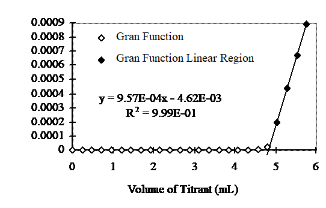

.. _title_Acid_Neutralizing_Capacity:

*****************************************
Acid Neutralizing Capacity
*****************************************

.. _heading_ANC_Introduction:

Introduction
============

Acid neutralizing capacity (ANC) is a measure of the ability of water to neutralize acid inputs. Lakes with high ANC (such as Cayuga Lake) can maintain a neutral pH even with some acid rain input whereas lakes with an ANC less than the acid input will not maintain a neutral pH. In the Adirondack region of New York State, lakes typically receive large inputs of acids during the spring thaw when the accumulated winter snow melts and runs off into the lakes. The ANC of Adirondack lakes is not always sufficient to neutralize these inputs.

.. _heading_ANC_Theory:

Theory
======

The ANC for a typical carbonate-containing sample is defined as:

.. math::

    ANC = [HCO_3^-]+2[CO_3^{-2} ]+{[OH}^{-} ] - [H^+]

This equation can be derived from a charge balance if ANC is considered to be the cation contributed by a strong base titrant and if other ions present do not contribute significantly.

Determination of ANC or alkalinity involves determination of an equivalence point by titration with a strong acid. The equivalence point is defined as the point in the titration where titrant volume that has been added equals the "equivalent" volume (:math:`V_e`). The equivalent volume is defined as:

.. math::

    V_{e} {\; =}\frac{V_{s} \cdot N_{s} }{N_{t} }

where:

 | Ns = normality (in this case alkalinity or ANC) of sample, equivalents/L
 | Vs = volume of sample, liters
 | Nt = normality of titrant, equivalents/L.

The titration procedure involves incrementally adding known volumes of standardized normality strong acid (or base) to a known volume of unknown normality base (or acid). When enough acid (or base) has been added to equal the amount of base (or acid) in the unknown solution we are at the "equivalence" point. The point at which we add exactly an equivalent or stoichiometric amount of titrant is the equivalence point. Experimentally, the point at which we estimate to be the equivalence point is called the titration endpoint.

There are several methods for determining :math:`V_e` (or the equivalence point pH) from titration data (titrant volume versus pH). The shape of the titration curve (:math:`V_t` versus pH) can reveal :math:`V_e`. It can be shown that one inflection point occurs at :math:`V_t= V_e`. In the case of monoprotic acids, there is only one inflection in the pH range of interest. Therefore, an effective method to find the equivalence volume is to plot the titration curve and find the inflection point. Alternately, plot the first derivative of the titration plot and look for a maximum.

.. _heading_ANC_Gran_Plot:

Gran Plot
---------

Another method to find the ANC of an unknown solution is the Gran plot technique. When an ANC determination is being made, titration with a strong acid is used to "cancel" the initial ANC so that at the equivalence point the sample ANC is zero. The Gran plot technique is based on the fact that further titration will result in an increase in the number of moles of :math:`H^+` equal to the number of moles of :math:`H^+` added. Thus after the equivalence point has been attained, the number of moles of :math:`H^+` added equals the number of moles of :math:`H^+` in solution. An equation describing this mass balance is provided as:

.. math::

    N_{t} \left(V_{t} -V_{e} \right)=\left(V_{s} +V_{t} \right)\left[H^{+} \right]

Solving for the hydrogen ion concentration:

.. math::

    \left[H^{+} \right]=\frac{N_{t} \left(V_{t} -V_{e} \right)}{\left(V_{s} +V_{t} \right)}

Equation \eqref{ZEqnNum183328} can also be solved directly for the equivalent volume.

.. math::

    V_{e} =V_{t} -\frac{\left[H^{+} \right]\left(V_{s} +V_{t} \right)}{N_{t} }

Equation \eqref{ZEqnNum199885} is valid if enough titrant has been added to neutralize the ANC. A better measure of the equivalent volume can be obtained by rearranging equation 1.5 so that linear regression on multiple titrant volume - pH data pairs can be used.

.. math::

    \frac{\left(V_{s} +V_{t} \right)}{V_{s} } \left[H^{+} \right]=\frac{N_{t} V_{t} }{V_{s} } -\frac{N_{t} V_{e} }{V_{s} }

We define F1 (First Gran function) as:

.. math::

    {F}_{{1}} {\; }={\; }\frac{V_{s} +V_{t} }{V_{s} } {[H}^{+} {]}

If F1 is plotted as a function of Vt the result is a straight line with slope = $\frac{N_{t} }{V_{s} } $ and abscissa intercept of Ve (Figure \eqref{ZEqnNum245538}).

The ANC is readily obtained given the equivalent volume. At the equivalence point:

.. math::

    V_{s} \; ANC={\; }V_{e} \; N_{t}

Equation \eqref{ZEqnNum665104} can be rearranged to obtain ANC as a function of the equivalent volume.

.. math::

    {ANC\; }={\; }\frac{V_{e} \; N_{t} }{V_{s} }

.. _figure_Gran_plot:

    Gran plot from titration of a weak base with 0.05 N acid. :math:`C_T` = 0.001 moles of carbonate and sample volume is 48 mL. The equivalent volume was 4.8 mL. From equation  \eqref{ZEqnNum755200} the ANC was 5 meq/L.

.. _heading_ANC_pH_Measurements:

pH Measurements
---------------

The pH can be measured either as activity :math:`\mathrm{\{}H^+\mathrm{\}}` as measured approximately by pH meter) or molar concentration ([H^+]). The choice only affects the slope of F1 since :math:`[H^+] = \mathrm{\{}H^+\mathrm{\}/\gamma}`.

.. math::

    {F}_{{1}} {\; }={\; }\frac{V_{s} +V_{t} }{V_{s} } {\; \; [H}^{+} {]\; }={\; }\frac{V_{s} +V_{t} }{V_{s} } {\; \; }\frac{\{ H^{+} \} }{\gamma } =\; {N} _{t} \frac{V_{t} -V_{e} }{V_{s} }

where :math:`\gamma` is the activity correction factor and the slope is :math:`N_t/V_0`. If :math:`[H^+]` concentration is used then

.. math::

    {F}_{{1}} {\; }={\; }\frac{V_{s} +V_{t} }{V_{s} } {\; \; \{ H}^{+} {\} \; }={\; }\gamma {N}_{{t}} \frac{V_{t} -V_{e} }{V_{s} }

where the slope is :math:`\frac{\gamma \cdot {N} _{t} }{V_{s} }`.

This analysis assumes that the activity correction factor doesn't change appreciably during the titration).

There are many other Gran functions that can be derived. For example, one can be derived for Acidity or the concentration of a single weak or strong acid or base.

To facilitate data generation and subsequent Gran plot construction and analysis pH versus titrant volume can be read directly into a computer, that can be programmed to analyze the data using the Gran plot theory. The program generates the Gran function for all data and then systematically eliminates data until the Gran function (plot) is as linear as possible. The line is then extrapolated to the abscissa to find the equivalent volume.

ANC Determination for Samples with pH < 4
-----------------------------------------

After the equivalence point has been reached (adding more acid than ANC = 0) the only significant terms in equation \eqref{ZEqnNum434822} are :math:`\left[{H}^{+} \right]` and ANC.

.. math::

    \left[{H}^{+} \right]>>{\; }\left[{HCO}_{{3}}^{{-}} \right]+{\; 2}\left[{CO}_{{3}}^{{-2}} \right]+\left[{OH}^{{-}} \right]{\; }

When the pH is 2 pH units or more below the :math:`pK_a`s of the bases in the system the only species contributing significantly to ANC is the hydrogen ion (equation \eqref{ZEqnNum293697}) and thus the ANC is simply

.. math::

    {ANC}={\; -\; [H}^{+} {]}

For a sample containing only carbonates, if the pH is below 4 the ANC is approximately equal to -[:math:`H^+`] and no titration is necessary.

.. _heading_ANC_Titration_Techniques:

Titration Techniques
--------------------

Operationally, the first few titrant volumes can be relatively large increments since the important data lies at pH values less than that of the equivalence point (approximately pH = 4.5 for an Alkalinity titration). As the pH is lowered by addition of acid the ionic strength of the solution increases and the activity of the hydrogen ion deviates from the hydrogen ion concentration. This effect is significant below pH 3 and thus the effective linear range is generally between pH 4.5 and pH 3.0. The maximum incremental titrant volume (:math:`\mathrm{\Delta}V_a`) that will yield n points in this linear region is obtained as follows.

If :math:`V_s` >> :math:`V_t` then equation \eqref{ZEqnNum567204} reduces to

.. math::

    {N}_{{t}} {\; \; \; }\frac{(V_{t} -V_{e} )}{V_{s} } \cong {\; [H}^{+} {]}

Let :math:`[H^+]_e` be the concentration of hydrogen ions at the equivalence point and :math:`[H^+]_f` be the final concentration of hydrogen ions at the end of the titration.

.. math::

    {N}_{{t}} {\; \; \; }\frac{(V_{e} -V_{e} )-(V_{f} -V_{e} )}{V_{s} } ={\; [H}^{+} {]}_{{e}} {\; -\; [H}^{+} {]}_{{f}}

Thus the volume of acid added to go from :math:`[H^+]_e` to :math:`[H^+]_f` is

.. math::

   {V}_{{f}} {\; -\; V}_{{e}} {\; }={\; }\frac{V_{s} \left([H^{+} ]_{f} -[H^{+} ]_{e} \right)}{N_{t} }

To obtain n data points between :math:`[H^+]_e` - :math:`[H^+]_f` requires the incremental titrant volume (:math:`\mathrm{\Delta} V_t`) be 1/n times the volume of acid added between the equivalence point and the final titrant volume. Thus by substituting :math:`n\mathrm{\Delta}V_t`, and typical hydrogen ion concentrations of :math:`[H^+]_e` = 10-4.5 and :math:`[H^+]_f` = 10-3.0 into equation \eqref{ZEqnNum824828} the maximum incremental titrant volume is obtained.

.. math::

    \Delta {V}_{{t}} {\; }\cong {\; }\frac{(0.001-0.00003)V_{s} }{n\; N_{t} } \cong {\; }\frac{0.001V_{s} }{n\; N_{t} }

.. _heading_ANC_Procedures:

Procedures
==========

Determine ANC of Acid Rain Samples
----------------------------------

Determine the ANC for all samples collected from the Acid Lake Remediation lab.  Start with 50 mL from the t=0 sample and run through the procedure to learn how the software works. Then repeat the procedure with 50 mL from the t=0 sample and for remaining samples with the goal of making an accurate ANC measurement and creating an accurate titration curve by using 0.100 mL titrant increments throughout the entire titration. Remember that the biggest source of error for this lab will likely be poor pipette techniques.

 #. Measure 50 mL of an acid lake sample in a graduated cylinder or using an electronic balance.
 #. Add to a 100 mL beaker.
 #. Place the beaker on the magnetic stirrer, add a stir bar and stir slowly.
 #. Place the pH electrode in the solution.
 #. If the initial pH is less than 4.5 no titration is necessary and equation \eqref{ZEqnNum542028} can be used to calculate the ANC.
 #. Record the initial pH (prior to adding any titrant) and initial sample volume.
 #. Analyze the sample using :ref:`Gran plot analysis <heading_Gran_Plot>`.  Add 0.05 N HCl (the titrant) using a digital pipette in increments of 0.100 mL.
 #. Save the Gran data to S:\Courses\4530\Group #\Lab 2 – Acid\group#_gran by selecting |ProCoDA_save_gran|. The data will be saved in a file (tab delimited format) that can be opened by any spreadsheet program. You will use this data to plot a titration curve and to verify that the Gran technique accurately measures the ANC of a sample.
 #. Record the ANC and the equivalent volume.

 If the error is greater than 2\% then check your pipette technique using a balance and then repeat the titration.

.. _heading_ANC_Prelab_Questions:

Prelab Questions
================

 #. Compare the ability of Cayuga lake and Wolf pond (an Adirondack lake) to withstand an acid rain runoff event (from snow melt) that results in 20\% of the original lake water being replaced by acid rain. The acid rain has a pH of 3.5 and is in equilibrium with the atmosphere. The ANC of Cayuga lake is 1.6 meq/L and the ANC of Wolf Pond is 70 :math:`\mu eq/L`. Assume that carbonate species are the primary component of ANC in both lakes, and that they are in equilibrium with the atmosphere. What is the pH of both bodies of water after the acid rain input? Remember that ANC is the conservative parameter (not pH!). Hint: You can use the scipy optimize root finding function called brentq. Scipy can't handle units so the units must be removed using .magnitude.}
 #. What is the ANC of a water sample containing only carbonates and a strong acid that is at pH 3.2? This requires that you inspect all of the species in the ANC equation and determine which species are important.
 #. Why is [:math:`H^+`] not a conserved species?

.. _heading_ANC_Data_Analysis:

Data Analysis
=============

 #. Plot the titration curve of the t=0 sample with 0.05 N HCl (plot pH as a function of titrant volume). Label the equivalent volume of titrant. Label the 2 regions of the graph where pH changes slowly with the dominant reaction that is occurring. (Place labels with the chemical reactions on the graph in the pH regions where each reaction is occurring.) Note that in a third region of slow pH change no significant reactions are occurring (added hydrogen ions contribute directly to change in pH).
 #. Prepare a Gran plot using the data from the titration curve of the t=0 sample. Use linear regression on the linear region or simply draw a straight line through the linear region of the curve to identify the equivalent volume. Compare your calculation of Ve with that was calculated by ProCoDA.
 #. Plot the measured ANC of the lake on the same graph as was used to plot the conservative, volatile, and nonvolatile ANC models (see questions 2 to 5 of the Acid Precipitation and Remediation of an Acid Lake lab). Did the measured ANC values agree with the conservative ANC model?

.. _heading_ANC_References:

References
==========

 Sawyer, C.N., P.L. McCarty and G.F. Parkin \textit{Chemistry for Environmental Engineering}\underbar{, }4th ed., McGraw-Hill (1994).

 Pankow, J.F. \textit{Aquatic Chemistry Concepts}, Lewis Publishers (1991).

 Morel, F.M.M. and J.G. Hering \textit{Principles and Applications of Aquatic Chemistry} Wiley-Interscience (1993).

 Stumm, W. and J.J. Morgan \textit{Aquatic Chemistry} 2nd ed. Wiley Interscience (1981).

.. _heading_ANC_Lab_Prep_Notes:

Lab Prep Notes
==============

 Table \label{1}. Reagent list.

\begin{tabular}{|p{0.7in}|p{0.7in}|p{0.7in}|} \hline
\textbf{Description} & \textbf{Supplier} & \textbf{Catalog number} \\ \hline
HCl 5.0 N & Fisher Scientific & LC15360-2 \\ \hline
Buffer-Pac & Fisher Scientific & SB105 \\ \hline
 &  &  \\ \hline
\end{tabular}

Table \label{2}. Equipment list

\begin{tabular}{|p{0.7in}|p{0.7in}|p{0.7in}|} \hline
\textbf{Description} & \textbf{Supplier} & \textbf{Catalog number} \\ \hline
Accumet$\mathrm{{}^{TM}}$ 50 pH meter & Fisher Scientific & 13-635-50 \\ \hline
 pH electrode & Fisher Scientific & 13-620-108 \\ \hline
7x7 stirrer & Fisher Scientific & 11-500-7S \\ \hline
stirbar 1/2" long & Fisher Scientific & 14-511-62 \\ \hline
100 mL Fisher beaker & Fisher Scientific & 02-593-50B \\ \hline
\end{tabular}

.. _heading_ANC_Setup:

Setup
=====

 #. Verify that the pH probes are operational, stable, and can be calibrated.
 #. Verify that buffers (pH = 4, 7, 10) are distributed to each student group
