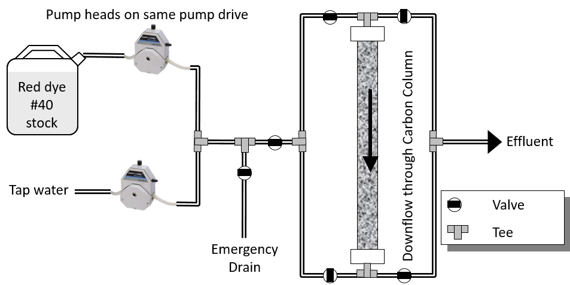

.. _title_Carbon_Adsorption:

*****************
Carbon Adsorption
*****************

.. _heading_Carbon_Adsorption_Objectives:

Objectives
==========

The objectives of this experiment are to:

 #. Determine the equilibrium isotherm for an organic dye (red dye \# 40) on a particular type of GAC;
 #. Investigate the breakthrough characteristics of red dye \#40 on this GAC in a continuous-flow carbon contactor at a single loading rate.

.. _heading_Carbon_Adsorption_Background:

Background
==========

Adsorption is a unit operation in which surface-active materials in true solution are removed from the solvent by interphase transfer to the surface of an adsorbent particle. This process is employed in environmental engineering practice for removal of various pollutants such as soluble organics, dyes, pesticides, humic substances, etc., from wastewaters and for removal of color, taste, and odor-producing compounds from natural waters that are to be used as potable water supplies. Adsorption onto granular activated carbon (GAC) also finds wide application in the remediation of groundwater contaminated with volatile and nonvolatile organic pollutants.

Under isothermal conditions the equilibrium partitioning between solution and solid phase is a function of concentration. In this experiment the isotherm data will be analyzed using both Freundlich

.. math::
    q^{\star} =KC^{1/n}  (\label{1})

and Langmuir models

.. math::
   q^{\star} =\frac{Kq_{\max }^{\star} C}{1+KC} (\label{2})

The Freundlich parameters K and n can be fit using a power law relationship and Langmuir parameters K and :math:`q_{\max }^{\star}` can be fit using nonlinear regression.

The carbon contactor will be analyzed using the results from the equilibrium isotherm study and the mass-transfer model,

.. math::

   S=\frac{v_a C_{0} }{\phi C_{0} +\rho _{b} Q}

.. math::

    \eta =\frac{\rho _b Q}{k'C_0 }\left[1+\frac{1}{1-r} ln\frac{\frac{ C }{C_0}} {\left(1-\frac{ C }{C_0} \right)^r}  \right]

.. math::

   \eta =t- \frac{x}{S}

where

 | :math:`v_a` =  superficial velocity or approach velocity
 | :math:`S` = front velocity
 | :math:`C_0` = influent concentration
 | :math:`\phi` = effective bed porosity
 | :math:`Q = q^\star` when :math:`C = C_0`
 | :math:`k'` is the effective mass-transfer coefficient
 | :math:`x` is the depth of the activated carbon bed

The effective bed porosity can be calculated from

.. math::

    \phi =1-\frac{\rho _b }{\rho _{ac} }

where

 | :math:`\rho _b =` apparent bulk density
 | :math:`\rho _{ac}  =  2.1 g/cm^3`

Note that modeling may first involve fitting the isotherm data to the generalized isotherm:

.. math::

   q=\frac{Q\frac{C}{C_0}}{r+(1-r)\frac{C}{C_0}}

where
 | :math:`q` =  concentration of contaminant in solid phase (mass contaminant/mass activated carbon)

The parameters r and Q should be fit using nonlinear regression on equation\eqref{ZEqnNum671226}. One technique for nonlinear regression is to use Solver (in Excel) to minimize the sum of the residuals while changing the unknown parameters.

.. _heading_Carbon_Adsorption_Isotherm_Procedures:

Isotherm Procedures
===================

Red Dye \# 40 Calibration Curve (week 1)
----------------------------------------

 #. Prepare the following Red Dye \#40 concentrations from the 10 g/L stock using distilled water for dilution: 0.5, 1.5, 5, 15, 50, 150, 500 mg/L.
 #. Analyze the standards using the Spectrophotometer that will be used to monitor the carbon contactor. (Make sure to include units and to enter a general description of the type of sample.)
 #. Clean the sample cell with 5\% bleach before analyzing dilute samples again!
 #. Prepare a second set of standards and analyze them as samples.
 #. Use the known samples to verify that all of the standards were accurately prepared and measured. This is important because these standards will be used to measure the concentrations in both the isotherm and contactor studies.

\begin{tabular}{|p{0.6in}|p{0.5in}|p{0.6in}|p{0.5in}|p{0.6in}|} \hline
\multicolumn{5}{|p{1in}|}{Table \label{ZEqnNum208070}. Isotherm sample preparation guide.} \\ \hline
Recommended Mass of AC(mg) & Actual Mass of AC\newline (mg) & Red Dye \#40 initial concentration (mg/L) & Volume of 10 g/L Red Dye in 100 mL (mL) & Red Dye \#40 final concentration (mg/L) \\ \hline
100 &  & 0 & 0 &  \\ \hline
100 &  & 50 & 0.5 &  \\ \hline
100 &  & 60 & 0.6 &  \\ \hline
100 &  & 70 & 0.7 &  \\ \hline
100 &  & 85 & 0.85 &  \\ \hline
100 &  & 100 & 1 &  \\ \hline
100 &  & 120 & 1.2 &  \\ \hline
100 &  & 150 & 1.5 &  \\ \hline
100 &  & 190 & 1.9 &  \\ \hline
100 &  & 250 & 2.5 &  \\ \hline
100 &  & 300 & 3 &  \\ \hline
100 &  & 400 & 4 &  \\ \hline
\end{tabular}

Adsorption Isotherm (week 1)
----------------------------

Each group will prepare the following samples so the replicates can be combined to obtain more reliable isotherm data.

 #. Prepare 12 120-mL glass serum bottles using Table \eqref{ZEqnNum208070} as a guide.
 #. Seal with Teflon-lined rubber septa and aluminum crimp caps.
 #. Agitate the bottles vigorously on a wrist-action or orbital shaker for 5 to 7 days.

Adsorption Isotherm Sample Analysis (week 2)
--------------------------------------------

 #. Measure the UV-Vis absorption spectra of the supernatants as samples using the spectrophotometer.
 #. Use spectral analysis to determine the Red Dye \#40 concentrations in each of the supernatants using the activated carbon and red dye \#40 standards.
 #. Investigate improving sample preparation by centrifuging at 14000 rpm and then transferring the supernatant to spectrophotometer cuvettes.

.. _heading_Carbon_Adsorption_Contactor_Procedures:

Contactor Procedures
====================

.. _figure_Schematic:

    Proposed design of the carbon column and feed system.

Continuous-Flow Carbon Contactor Setup (week 1)
-----------------------------------------------

\begin{tabular}{|p{2.8in}|} \hline
\includegraphics*[width=4.11in, height=1.83in, keepaspectratio=false]{image2}\newline Figure \label{ZEqnNum217028}. Schematic of Carbon contactor.\newline  \\ \hline
\end{tabular}

Assemble the system shown in Figure \eqref{ZEqnNum217028}. Use a peristaltic pump with \#14 tubing at approximately 10 rpm. Prepare 2-20 L jerricans with 50 mg/L of Red dye \#40. Use distilled water to dilute the dye. The carbon contactor will be operated in down flow mode. The specifications for the carbon contactors are given in Table \eqref{ZEqnNum743744}. Set up a daily sample schedule.

 #. Pump distilled water into the column from the bottom to a depth of 10 cm.
 #. Pour 27 g of activated carbon into a beaker containing distilled water.
 #. Swirl the carbon until most of the air is released.

\begin{tabular}{|p{2.1in}|} \hline
\newline Parameters \newline Influent red dye Concentration        0.050  g/L \newline Depth of carbon 15 cm \newline Influent flow rate 2.5 ml/min \newline ~  ~ \newline Fixed values \newline Column diameter 2.5 cm \newline Carbon bulk density 0.375 g/cm${}^{3}$ \newline ~  ~ \newline Calculated values \newline Mass of carbon 27.61 g \newline q        0.080  g/g \newline g red dye for breakthrough          2.21  g \newline Mass flux of red dye    0.00013  g/min \newline Volume of stock required 44.2 Liters \newline Estimated breakthrough 17671 min \newline ~ 12.3 days \newline Mass of red dye/20 L 1.00 g \newline Table \label{ZEqnNum743744}. Carbon contactor settings. \\ \hline
\end{tabular}

 #. )Use a funnel and a distilled water wash bottle to wash the distilled water from the beaker into the column.
 #. Use a 50 mL syringe to remove excess water from the top of the column if necessary.
 #. Use a long rod to gently stir activated carbon to help release air bubbles.
 #. Assemble the column end fitting.
 #. In up flow mode (at 10 mL/min), discharge the column effluent to waste until most of the fines are removed.
 #. Reverse the direction of flow to down flow.
 #. Measure the depth of the activated carbon in the column.
 #. Setup a sampling technique so that a 100 mL vial is always in place and filling up or overflowing.

Operate the Contactor (starting week 1 for 2 to 3 weeks)
--------------------------------------------------------

 #. Start pumping Red Dye \#40.
 #. Measure the flow rate daily using a balance to get mass of water in approximately 1 minute.
 #. Collect and label a 100 mL sample daily.
 #. It is probably impractical to try and achieve :math:`C/C_0 = 1`, but past experiments have usually run long enough to attain at least :math:`C/C_0 = 0.8`, which provides enough of the breakthrough curve to allow modeling of its shape.

Carbon Contactor Measurements (week 3)
--------------------------------------

 #. Use spectral analysis to measure the effluent samples using the techniques developed for the isotherm analysis.

Isotherm Results and Discussion
-------------------------------

Combine the data from all groups when doing the following analysis.

 #. Calculate the quantity of Red Dye \#40 that was transferred to the surface of the activated carbon for each bottle in grams/gram of GAC.
 #. Plot the data in a standard adsorption isotherm format (i.e., quantity sorbed, g/g, versus aqueous concentration, g/L).
 #. Attempt to fit both the Freundlich and Langmuir isotherm models to the data. Report the values of the respective constants in each case, and plot the fitted model curves on the same graph as the data. (Remember to use smooth lines for models and data points for data.) Use nonlinear regression to obtain the Langmuir isotherm parameters.
 #. Discuss the correspondence between the experimental data and the Freundlich and Langmuir isotherms.

Contactor Results and Analysis
------------------------------

 #. Plot the breakthrough curve showing :math:`\frac{C}{C_0}` versus time or :math:`\frac{C}{C_0}` versus cumulative volume treated. [Note: Obviously, if flow rate were held relatively constant, then volume treated and time are directly proportional, and either can be effectively plotted on the abscissa. However, if flow rate was not constant, it is preferable to plot :math:`\frac{C}{C_0}` versus cumulative volume treated, as the volume treated by the midpoint of breakthrough should be relatively independent of flow rate. Where flow rate was not constant, the cumulative volume treated can be estimated by summing the incremental volumes delivered during each interval between samplings, assuming average values for the interval flows.]
 #. From knowledge of both the mass of GAC added and the measured volume of the GAC bed, estimate the apparent bulk density (:math:`\rho_b`) of the bed during operation. Assuming a real (carbon) density of 2.1 :math:`g/cm^3`, estimate the effective bed porosity (:math:`\phi`).
 #. Calculate the expected breakthrough time (or volume treated) --- i.e., ignoring mass-transfer limitations --- based on your isotherm, flow and other data. Compare the actual breakthrough time (or volume treated), approximately the point where C/C0 = 0.5, with its expected value and offer explanations for discrepancy.
 #. Attempt to model the shape of your breakthrough-curve data, using the mass-transfer model presented in lecture:

[Note that the generalized isotherm is described by specifying one point on it (:math:`C_0`, Q) and corresponding value for a curve parameter (r). Alternative choices of :math:`C_0` will yield corresponding --- but different --- sets of Q and r-values that result in identical generalized isotherm curves. Therefore, the proper choice of :math:`C_0` for convenient, later application to breakthrough-curve modeling would be the average measured value of the column's influent Red Dye \#40 concentration --- and not the initial Red Dye \#40 concentration employed in the isotherm determination. That way, the values of Q and r obtained will be the correct ones to employ in the mass-transfer model.]

Alternatively, note that the Langmuir isotherm fit can be conveniently employed. The Langmuir is a special case of the generalized isotherm, where :math:`r=\frac{1}{1+KC_{0} }` (with K being the Langmuir constant). Q can be estimated from the Langmuir isotherm by substituting the column's influent Red Dye \#40 concentration for :math:`C_0`.

What value of k', the effective mass-transfer coefficient, gives best fit to the shape of your breakthrough curve? [Note: If the observed midpoint of breakthrough was significantly displaced in time (or volume treated) from that predicted from your isotherm, you should use your experimentally observed S value, rather than the theoretically predicted one. That way, you'll only have to deal with effects of k' on shape, rather than absolute position, of breakthrough.] If we had generated breakthrough curves at several values of hydraulic loading, we could empirically relate $k'$ to hydraulic loading for evaluating design and operating alternatives.

 #. Provide the usual discussion of error sources and suggestions for improvement.

.. _heading_Carbon_Adsorption_Lab_Prep_Notes:

Lab Prep Notes
==============

 #. Verify that all necessary supplies are in place for the pumps, tanks, column, valves, and tubing.
 #. Prepare the Red Dye \#40 stock solution.
 #. Prepare a 5\% bleach solution (5 mL bleach diluted to 100 mL with distilled water) for cleaning the photometer sample cell and sample lines.

Procedure to remove air from the top of the column
--------------------------------------------------

 #. Close the Red Dye \#40 influent valve.
 #. Open the distilled water influent valve.
 #. Wait for the influent line to clear of Red Dye \#40.
 #. Turn off the pump.
 #. Reverse the column flow direction.
 #. Turn on the pump until the air is removed.
 #. Turn off the pump.
 #. Reverse the column flow direction.
 #. Turn on the pump and switch the influent to Red Dye \#40.

.. _heading_Carbon_Adsorption_Recommendations_from_previous_years:

Recommendations from previous years
===================================

The column that was run at the slower flow rate had a much steeper breakthrough curve. However, it took 2 weeks to breakthrough. Thus it is recommended that a shorter column be used (15 cm rather than 60 cm) so that the breakthrough occurs in a reasonable amount of time with a slower flow rate.

Methylene blue may not be an ideal contaminant since it is a stain that absorbs strongly. It may be preferable to use red dye \#40.

We used red dye \#40 and obtained similar results. The problem with this lab is that mass transfer of solute into the activated carbon pores is rate limiting and the rate decreases as the pores fill. We used 100 mg of activated carbon in all isotherm bottles and varied the red dye concentration from 500, 250,100,75, to 50 mg/L. The range between 100 and 50 mg/L should be divided further for more data. Samples below 50 mg/L were clear.

The turbidity standard helps, but the spectrophotometer does pick up adsorbed red dye with a slightly different spectra than dissolved red dye. The best approach would be to filter the samples to remove the activated carbon fines.

We used red dye standards of 500, 150, 50, 15, 5, 1.5, 0.5 mg/L. We used a red dye stock containing 10 g/L.

Decreased flow rate in column to 15 mL/min.
