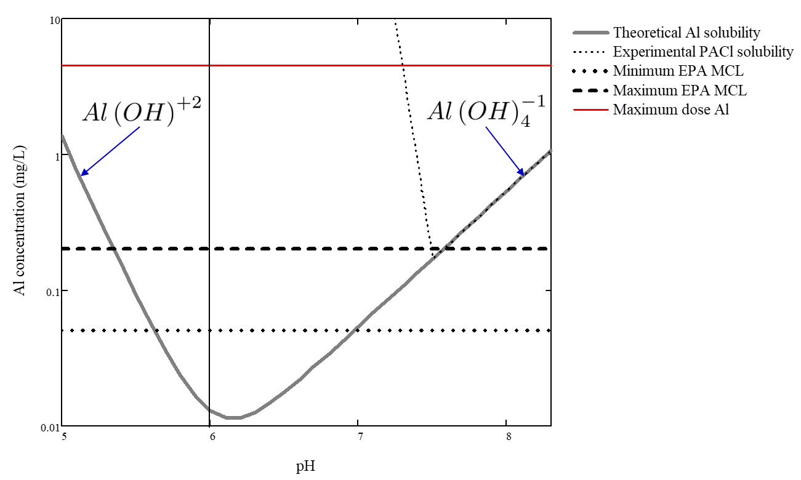

.. _title_Chemistry_of_Water_Treatment_Introduction:

*************************************
Chemistry of Coagulant Nanoparticles
*************************************

Aluminum based coagulants are commonly used in drinking water treatment plants. Less frequently iron based coagulants are used. These metals precipitate in water at neutral pH as :math:`Al(OH)_3` or :math:`Fe(OH)_3`. These precipitates form nanoparticles that are sticky. The origin of that stickiness is not well known, but one significant property of both precipitates is that they are both highly polar molecules. The `difference in electronegativity <https://en.wikipedia.org/wiki/Electronegativity>`_ (Pauling scale) between
 - Aluminum (1.61) and Oxygen (3.44) is 1.83
 - Iron (1.83) and Oxygen (3.44) is 1.61
 - Hydrogen (2.20) and Oxygen (3.44) is 1.24

Thus both aluminum and iron coagulants are more polar than water. It is possible that their strong polarity enables them to displace the water that is bound to particles' surfaces and then form bonds with those surfaces. In order to displace water molecules that are bound to the particles surfaces, the coagulants must have stronger bonds to particles surfaces than the polar water molecules and thus it seems likely that coagulants must be more polar than water.

.. _heading_pH_Effects_of_Adding_Coagulant:

pH Effects of Adding Coagulant
----------------------------------------

The coagulants used for drinking water treatment are acidic and thus result in a lowering of the pH of the treated water. The optimal pH for aluminum coagulant nanoparticle formation is between pH of 6.5 and 8.5. This is also the `pH range set by the EPA secondary standards for drinking water <https://www.epa.gov/dwstandardsregulations/secondary-drinking-water-standards-guidance-nuisance-chemicals>`__. Although many water sources are within this pH range, there are some waters with more extreme values of pH. The aluminum and iron based coagulants are also acidic and in some waters the pH may drop below the ideal range when adding the coagulant. When the pH is outside the acceptable range it is necessary to adjust the pH by adding either a base or an acid.

When aluminum sulfate (alum) is added to water it dissociates and then precipitates as :math:`Al(OH)_3`. In the process, protons (:math:`H^+`) are released and thus the pH (:math:`-log[H^+]`) decreases.

.. math:: Al_2(SO_4)_3 (aq) + 6H_2O (l) \rightarrow 2Al(OH)_3 (s) + 6H^+ (aq) + 3SO_4^{-2} (aq)

The release of these protons reduces the acid neutralizing capacity, ANC, (also known as alkalinity) of the water. ANC is traditionally measured with units of mg/L of :math:`CaCO_3` rather than eq/L.  :numref:`table_ANC_consumed_by_alum` shows the relationship between ANC measured as mg/L of :math:`CaCO_3` and alum (:math:`Al_2(SO_4)_3 \cdot 14H_2O`)

.. _table_ANC_consumed_by_alum:

.. csv-table:: Reduction in ANC caused by addition of alum.
   :header: "", "Alum", "Calcium Carbonate"
   :align: left

   Molecular Formula, :math:`Al_2(SO_4)_3 \cdot 14.3H_2O`, :math:`CaCO_3`
   Molecular mass, 600 g/mole, 100 g/mole
   eq/mole, 6,2
   Molecular mass/eq, 100 g/eq, 50 g/eq
   Simple guide, 1 mg/L alum consumes, 0.5 mg/L calcium carbonate ANC

Low ANC waters (See section on :ref:`heading_Buffering_Capacity_of_Natural_Waters`.) could have their ANC increased by addition of a base. A simpler approach is often to use a different coagulant that is less acidic.

Polyaluminum chloride (PACl) is another aluminum based coagulant that performs similarly to alum. PACl is manufactured by slowly titrating an acidic solution containing dissolved aluminum with a base (in the chemical plant) to produce a meta-stable and soluble polymeric aluminum. PACl consumes less alkalinity (ANC) because it is partially neutralized by the titration with a base. In addition, the aluminum mass fraction of PACl is higher than in alum because there are no attached water molecules. The mass of PACl required for flocculation is less the mass of alum required. This is due largely to the higher aluminum fraction. The lower mass of PACl required is an economic benefit when shipping is a significant portion of the cost of the coagulant.

There are many different molecular formulas given for PACl. The molecular formulas are either from the perspective of the chemical supplier or represent the composition of the PACl nanoparticles. The molecular formula from the chemical supplier represents the extent of neutralization and hence the replacement of chloride with hydroxide. In that case the PACl molecular formula is:

.. math:: [Al_n(OH)_mCl_{3n-m}]_x

The extent of the PACl titration with base is defined as basicity. Basicity is the ratio of hydroxyl equivalents to aluminum equivalents. Basicity of 1 would mean that the PACl does not produce any protons when it dissolves in water. Basicity of 0 means it produces 3 protons per Al (like alum). The equation for basicity is:

.. math:: Basicity = \left( \frac{m}{3n}\right)

The lowest basicity commercial PACl formulations are about 10%. Most PACls are in the medium to high basicity range (50-70%). The highest stable basicity (83%) is aluminum chlorohydrate (:math:`Al_2(OH)_5Cl`) that is useful for treating water with very low ANC.

The ANC of the aluminum coagulant can be obtained from the number of protons it releases:

.. math:: ANC_{Al} = 3(Basicity-1)[Al] = \left(\frac{m}{n} - 3\right)[Al] = \Pi_{Al}[Al]

| where:
| :math:`\Pi_{Al}=\left(\frac{m}{n} - 3\right)` is ANC per mole of aluminum for the given coagulant

Thus the ANC of alum (with 0 hydroxides) is :math:`-3[Al]`. The method of calculating the :math:`ANC_{Al}` will be used to calculate the amount of base that must be added to achieve a target pH.

.. todo:: Add link to the pH_adjust function that is currently in the RM_Exmaples.rst sheet.

The molecular formula of the PACl nanoparticles is always some combination of Al, O, and H. One common molecular structure is a Keggin structure with 13 aluminum atoms. This molecule has a tetrahedral Al atom in the center of the cluster coordinated to 4 oxygen atoms. The molecular formula of the Keggin structured aluminum molecule is

.. math:: AlO_4Al_{12}(OH)_{24}(H_2O)_{12}^{7+}

The attached water molecules are sometimes omitted. Coagulant nanoparticles are presumably created by aggregation of these Keggin structure molecules.

.. _heading_Buffering_Capacity_of_Natural_Waters:

Buffering Capacity of Natural Waters
----------------------------------------

When acid is added to a water containing bicarbonate, :math:`HCO_3^-`, one of the potential reactions is for a proton to combine with :math:`HCO_3^-` to form carbonic acid, :math:`{H_2}CO_3`. If a base is added to water the reaction will proceed in the opposite direction. Carbonic acid, :math:`{H_2}CO_3`, is indistinguishable from dissolved carbon dioxide, :math:`CO_{2_{aq}}` and the total of carbonic acid and dissolved carbon dioxide is represented as :math:`{H_2}CO_3^{\star}`. The reaction of bicarbonate to form carbonic acid removes one proton from solution and thus the concentration of protons doesn’t increase as fast as we might have first expected as acid is added to the water.

The reactions of carbonate species with protons provides pH buffering capacity that must be considered when calculating the effect of acid or base addition. Since carbonates are the dominant buffering agents in natural waters it is essential to account for their influence on pH.

The effect of acid or base addition to a water containing carbonates (or other weak acids and bases) can be modeled using the equation for :ref:`Acid Neutralizing Capacity <heading_Acid_Neutralizing_Capacity_(ANC)_or_Alkalinity>`.

.. _heading_pH_Range_for_Precipitation_of_Coagulant_Nanoparticles:

pH Range for Precipitation of Coagulant Nanoparticles
------------------------------------------------------

A critical property of coagulants is that in order to act as an adhesive between particles they must be solid phase at neutral pH. Both Al(III) and Fe(III) have low solubility at neutral pH and thus meet this requirement. The pH region of low solubility sets the range of pH where flocculation is effective. :numref:`figure_Al_solubility` shows the solubilty of aluminum as a function of pH.

.. _figure_Al_solubility:

    Solubility of aluminum as a function of pH. Figure adapted from `Pernitsky and Edzwald <http://dx.doi.org/10.2166/aqua.2006.062>`_.

Research is needed to quantify flocculation performance in continuous flow floc/floc blanket/plate settler systems as a function of pH.

The aluminum concentration range used for flocculation ranges from approximately 0.4 - 10 mg/L and is strongly influenced by the concentration of dissolved organic matter and the concentration of suspended solids. The flocculation and floc blanket capacity to produce collisions between suspended particles also influences the required aluminum concentration.

.. _heading_pH_Adjustment_in_Water_Treatment_Plants:

pH Adjustment in Water Treatment Plants
----------------------------------------

In drinking water treatment plant operation it is sometimes necessary to add a base (or acid) to increase (or decrease) the pH of the raw water. The added coagulant tends to reduce the pH. The carbonate system is most important in understanding how the base will adjust the pH because the reaction between carbonic acid and bicarbonate occurs around pH 6.3, the pK (negative log of the dissociation constant is the pH where that reaction is centered) for that reaction. Carbon dioxide exchange with the atmosphere is insignificant in drinking water treatment unit processes unless there is an aeration stage. Thus we can use the ANC equation for the case with no :math:`CO_2` exchange with the atmosphere.

In the :ref:`heading_pH_Adjustment` section of the textbook, we evaluate the case where we add a base to the influent water. Doing so will increase the ANC of the raw water and it may also increase the total carbonate concentration. We then calculate how much of that base needs to be added to reach a given target pH.
