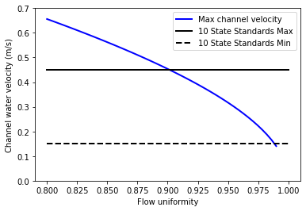

.. raw:: html

    <embed>
       <link rel="canonical" href="https://aguaclara.github.io/Textbook" />
       
    </embed>

.. _title_Clarifier_Design:

*************************
Clarifier Design
*************************

.. _heading_Clarifier_Design:

The AguaClara clarifier is a high-rate vertical flow clarifier that is designed with the following goals:

#. Minimize secondary currents that could send high velocity flow through some of the plate settlers
#. Prevent accumulation of sludge that would tend to become anaerobic and release both dissolved organics (taste and order issues) and methane bubbles that would carry flocs to the top of the clarifier
#. Include a stable floc filter that reduces the settled water turbidity
#. Remove the solids without requiring power or moving mechanical parts
#. Provide a mechanism for the operator to dump poorly flocculated water before it enters the clarifier. This is important to reduce the recovery time when there is a flocculation failure.
#. Ensure easy operation and maintenance.

.. _figure_clarifier_overview:

.. figure:: ../Images/clarifier_overview.png
    :target: https://youtu.be/ca3xVntxEzw
    :height: 300px
    :align: center
    :alt: Overview of an AguaClara Clarification tank (click to be sent to video).

Overview of an AguaClara Clarification tank (click image to be sent to video).

Inlet: Flocculator to Floc Filter
=================================

The channels, pipes, and diffusers that transport the floc suspension from the flocculator to the floc filter must be done very carefully to avoid breaking up flocs. Unlike the flocculator where the important parameter was :math:`G_{CS}` and approximately represented an average velocity gradient, the velocity gradient that matters here is the maximum velocity gradient that occurs in the core of each flow expansion. There are flow expansions after the inlet to the inlet channel, after the entrance of the inlet manifold, after the elbow, and after each change of geometry. It is essential that the flocculator flocs arrive in the floc filter with a terminal velocity, and corresponding diameter, that is large enough to be captured by the plate settlers.  The maximum velocity gradient that can be used without causing a deterioration in performance is :math:`G_{max}` as defined in Equation :eq:`G_of_vc_and_fractal` and shown in :numref:`figure_Gmax_of_T_and_vc`. The maximum velocity gradient for various flow geometries are derived in :ref:`heading_Maximum_velocity_gradients`.

The second major design constraint is equal flow distribution between parallel paths such as the multiple clarifier bays. To understand how we will use flow distribution as a primary design constraint, we will develop a concept called the "clarifier as a circuit". This concept will be elaborated on as you learn about the clarifier components and design, but we will introduce it now because it is a driving principle for flow distribution in AguaClara clarifiers. The chapter on Manifold design (still needs to be written) will be very useful to understand some of these fluids concepts.

An electrical circuit is a path in which electrons flow from a voltage or current source. Electrical circuits frequently have resistors, which are passive electrical components to create resistance in the flow of electric current. What does this have to do with clarifiers? In our "clarifier as a circuit" concept, we will draw parallels between how electrons flow through a circuit to how water flows through the clarifier.

The AguaClara treatment train is designed so that flow is driven by potential energy. The entrance of the clarifier, where water comes from the flocculator, is the source of the flow. Water then moves through the clarifier and exits to the filter. At different points throughout the flow of water in the clarifier, there are changes in piezometric head from fluid acceleration/deceleration and head loss. In the development of our circuit concept, piezometric head is like electrical voltage and minor loss coefficients are like resistance.

In electrical circuits, electrons will travel the path of least resistance in a parallel path system. Water is similar in that it will flow in the path of least resistance.

.. _figure_circuit_base:

.. figure:: ../Images/circuit_base.png
    :height: 300px
    :align: center
    :alt: Clarification tank as a circuit.

    Clarification tank as a circuit.

:numref:`figure_circuit_base` shows flow through a clarifier in which there are two clarifier bays working in parallel. Each bay has multiple components through which piezometric head changes; wherever a resistor symbol is shown, it means that there is a difference in piezometric head in that section of pipe. We want to understand what is going on between the influent channel and the effluent channel so that we can design to control head loss and fluid flow.

Remember, the goal is to have even flow distribution. It is bad if different flow paths have different loss coefficients. We must consider this between clarifier bays (comparing each bay to each other) and within a single clarifier bay (comparing the flows at different points within the clarifier bay). We want to limit differences in "resistance" to ensure equal flow distribution.

.. _heading_Clarifier_Influent_Channel:

Inlet Channel
-------------

After water exits the flocculator, it is ready for clarification. In AguaClara plants, there is one flocculator per treatment train. However, depending on the plant flow rate, one plant may have multiple clarifiers operating in parallel; we call each of these clarifier units a 'bay'. Because there may be multiple clarifier bays, we have to distribute flocculated water between the bays. To do this, we have an **influent channel** shown in :numref:`figure_influent_channel_bays`, which receives water from the flocculator and passes it to the clarifier bays. The channel is long, concrete, and relatively shallow. The objective of the channel is to distribute water and flocs to the clarifier bays without allowing any settling of flocs in the influent channel. The minimum velocity in the influent channel is about 0.15 mm/s to prevent flocs from settling. In the bottom of the channel, there are pipes that lead to the bottom of each clarifier bay.

.. _figure_influent_channel_bays:

.. figure:: ../Images/influent_channel_bays.png
    :height: 300px
    :align: center
    :alt: Influent channel with pipes leading to different clarifier bays.

    Influent channel with pipes leading to different clarifier bays.

An important question is consider is whether or not the water in the influent channel gets evenly distributed between the different bays. If it does not get evenly distributed, which bay will receive the most water? We know from our understanding of fluids and flow distribution that in a pipe (or channel) with multiple orifices that is closed at one end, the distribution of flow is nonuniform along the length of the pipe; it is decelerating. This nonuniformity is due to conversion of kinetic energy into potential energy as the flow decelerates. This deceleration results in an increase in the piezometric head in the direction of flow.

Where else in fluids have we discussed decelerating flow? We have discussed this in flow expansions. We know that in flow expansions, there are higher pressures and slower velocities downstream. At the end of the pipe, there is low velocity and thus high pressure, driving the flow through the orifices at the end. For this same reason, a channel with multiple exits will have greatest flow thru the last exit.

So, is this type of head loss "good" or "bad"? In our :ref:`definition of "good" and "bad" <heading_Good_v_Bad_Hl>`, we stated that "bad" head loss creates unequal flow in parallel flow paths. The head loss in the influent channel is therefore "bad" head loss because it can lead to different bays in parallel receiving different flows.

Clarification units have multiple bays for a few different reasons. Plants with higher flow rates require more clarifier bays because the flow through each bay is limited by other design constraints, namely upflow velocity, which will be discussed later. Additionally, it is good to have more than one bay for maintenance purposes; if one bay needs to be cleaned, we want to always have another that can be working. Pipe stubs can be used to plug the entrance hole to a clarifier bay to shut it down for maintenance.

Of note is that the clarifier influent channel is located directly next to a drain channel. This drain channel was built to remove poorly flocculated water from the treatment train. If an operator observes poor flocculation, they can change the chemical dosing in an attempt to improve flocculation. In the meantime, they will want to dump the poorly flocculated water to avoid poor effluent quality. Operators can plug the entrance hole to the clarifier bays, allowing the influent channel to fill with water. Once water reaches the height of the wall separating it from the drain channel, the water will pour over from the influent channel into the drain channel. This allows operators to easily dump poorly treated water and then easily restart the clarifier once flocculation performance improves.

The clarifier inlet channel is designed to distribute the flow uniformly between the clarifiers. The flow paths through the various clarifiers are identical except for the difference in the length of the path in the clarifier inlet channel. Thus the difference in piezometric head in the clarifier inlet channel must be small compared with the head loss through a clarifier. The head loss through a clarifier is dominated by the outlet manifold which is designed to have a head loss of 5 cm. This 5 cm of head loss is in turn dominated by the orifice head loss as required to achieve uniform flow distribution between the orifices (see :ref:`clarifier outlet manifold <heading_clarifier_outlet_manifold>`)

For a simple conservative design we calculate the maximum channel velocity assuming that the channel cross section is constant. In our designs we slope the bottom of this channel to maintain a constant velocity to ensure that flocs are scoured and don't accumulate at the end of this channel where the velocities would be lower if the cross section were constant.

We can use :eq:`Energy_and_Pi_Q_no_manifold_hl` to calculate maximum velocity in the clarifier inlet channel. In this case the average manifold piezometric head, :math:`\bar \Psi_M` ,is measured relative to the water level in the clarifier that is above the clarifier exit weir. This difference in elevation is dominated by the 5 cm of head loss created by the orifices in the clarifier outlet manifold. Solving for the maximum channel velocity we obtain

.. math::
  :label: vM_Energy_and_Pi_Q_no_manifold_hl

  \bar v_{M_1} = 2\sqrt{g\bar \Psi_{Clarifier}\frac{1 - \Pi_{Q}^2}{\Pi_{Q}^2 + 1}}

where :math:`\Pi_{Q}` represents the uniformity of flow distribution taken as the minimum clarifier flow divided by the maximum clarifier flow.

The Ten State Standards states, "The velocity of flocculated water through conduits to settling basins shall not be less than 0.15 m/s nor greater than 0.45 m/s." The lower velocity matches the constraint of ensuring that the velocity is high enough to scour flocs along the bottom of the channel and thus prevent sedimentation. The maximum velocity was presumably set to achieve reasonable flow distribution, but that value is dependent on the head loss through the clarifiers.

`Here we calculate the maximum clarifier inlet channel velocity as a function of the flow distribution uniformity. <https://colab.research.google.com/drive/1znzBGYHV1RXGqRz3Xm8Oyp7NQmAmkat6#scrollTo=8DRdoLVGUmWS&line=3&uniqifier=1>`_

.. _figure_Clarifier_channel_max_v:

    The ratio of port velocity to manifold velocity must increase to obtain more uniform flow from the ports.

The channel velocity must be less than 0.45 m/s to obtain a flow distribution uniformity above 0.9 given that the clarifier head loss is 5 cm.

Flocculated Water Dump Channel
------------------------------

The flocculated water dump channel is activated by the operators when flocculation fails for any reason. The ability to dump water that wasn't properly flocculated enables the AguaClara water treatment plant to recover quickly from a treatment failure because the clarifiers aren't contaminated with poorly flocculated water. Instead the operator can adjust the coagulant dose to recover flocculation and then return the clarifiers to service after a little more than one hydraulic residence time of the flocculator.

The flocculated water dump channel maintains the water level in the flocculator and clarifiers while the water is temporarily dumped. The channel must be designed to handle the entire flow of the plant.

.. note:: add open channel flow equations in the fluids and hydraulics chapter.

.. _heading_clarifier_inlet_manifold:

Inlet Manifold
--------------

Now, we will focus on a single clarifier bay. Flocculated water enters a pipe in the bottom of the influent channel and travels down a few feet. The pipe then has a 90 degree bend and extends along the bottom of the entire length of the clarifier bay. This section of pipe that distributes water at the bottom of the clarifier bay is referred to as the **influent manifold** shown in :numref:`figure_influent_channel_manifold`.

.. _figure_influent_channel_manifold:

.. figure:: ../Images/influent_channel_manifold.png
    :height: 300px
    :align: center
    :alt: Influent channel with pipe leading to one inlet manifold.

    Influent channel with pipe leading to one inlet manifold.

Clarification tank design is strongly influenced by the goal of not breaking flocs down to a size that can't be captured by the plate settlers. The maximum combination of velocity gradient, viscosity, and capture velocity is given by Equation :eq:`G_of_vc_and_floc_props`. Our goal is to eventually provide clear guidance on setting :math:`G_{max}`. In the meantime, given a maximum velocity gradient for the inlet to the clarifier, Equation :eq:`max_clarifier_jet_velocity_of_G` provides the maximum jet reverser velocity.

The ratio of manifold velocity to port velocity can be obtained as the inverse of Equation :eq:`Manifold_max_v_no_hl_series`.

.. math::
  :label: max_clarifier_manifold_velocity

  \frac{\bar v_{M_1}}{\bar v_{P}} = \sqrt{\frac{2(1 - \Pi_{Q}^2)}{\Pi_{Q}^2 + 1}}

where the port velocity, :math:`\bar v_{P}`, is equal to the jet velocity, :math:`v_{Jet_{max}}`, from Equation :eq:`max_clarifier_jet_velocity_of_G`. Given a flow uniformity goal, :math:`\Pi_Q`, of 0.85 the manifold velocity must be less than 0.57 of the jet velocity. This constraint ends up being rather severe. Given a maximum velocity gradient of 100 Hz, the maximum jet velocity for a 1 m wide floc filter operating at 5°C and 1 mm/s upflow velocity is 170 mm/s. Equation :eq:`max_clarifier_manifold_velocity` sets the maximum manifold velocity at 97 mm/s. This low velocity results in large diameter manifold pipes and can significantly increase the cost of the unit process.

.. _figure_influent_manifold_diffuser_flow:

.. figure:: ../Images/influent_manifold_diffuser_flow.png
    :height: 300px
    :align: center
    :alt: Influent manifold and diffuser flow paths.

    Influent manifold and diffuser flow paths.

The big unknown is the required design value for :math:`\xi_{breakup}` as defined in Equation :eq:`G_of_vc_and_floc_props`. The expectation is that raw waters with high concentrations of organic matter will have lower density core particles and thus will require a smaller :math:`\xi_{breakup}` for successful capture of the lower density flocs.

The maximum velocity that could be carried by the inlet manifold given the flow expansion corresponding to the inlet can be calculated using Equation :eq:`D_pipe_min_of_K_and_jet_G_max`. This constraint would allow the use of a smaller diameter inlet manifold than the velocity constraint required by Equation :eq:`max_clarifier_manifold_velocity`.

The result of the requirement for a low velocity jet to prevent floc break up is that the inlet manifold has to be large in diameter to obtain reasonably uniform flow distribution between the diffusers. This constraint is fairly severe and results in large diameter (and hence expensive) inlet manifold pipes.

The fundamental problem of the inlet manifold is that the diffusers exit perpendicular to the flow of the water in the inlet manifold and thus the flow into the diffusers is set by the difference in piezometric head between the manifold and the floc filter. The kinetic energy at the inlet of the manifold is converted to increased pressure at the end of the manifold. That results in more flow out of the last diffuser ports.

An alternative design would be to have each of the diffuser pipes end inside the manifold with an elbow so that the inlet to the diffuser would face upstream. This change would potentially improve the flow distribution between diffuser pipes, but the large number of diffuser pipes makes this impossible to fabricate without introducing significant additional head loss in the manifold pipe from drag around all of the diffuser inlets.

To overcome the impossibility of having higher velocity in the inlet manifold and directly connecting that to the diffusers we propose to use a two stage manifold system. The manifold pipe will be split into two chambers with the top chamber being the inlet manifold and the bottom section being a new equalization chamber (see :numref:`figure_2stageInletManifold`).

.. _figure_2stageInletManifold:

.. figure:: ../Images/2stageInletManifold.png
    :width: 400px
    :align: center
    :alt: two stage inlet manifold

    The two stage inlet manifold with upper chamber acting as the inlet manifold and the lower chamber acting to equalize the flow from the diffusers (not shown).

The inlet manifold flow is transferred to the equalization chamber through half-pipe ports that are tapered (see :numref:`figure_2stageInletManifoldfromUpstream`) to guide flow into the equalization chamber. The taper is designed to be less than the rate of the flow expansion as given by Equation :eq:`PlaneJet_expansion`.

.. _figure_2stageInletManifoldfromUpstream:

.. figure:: ../Images/2stageInletManifoldfromUpstream.png
    :width: 400px
    :align: center
    :alt: two stage inlet manifold from upstream

    The half-pipe ports face upstream and slope at a rate that is slower than the rate at which the flow expands to ensure that the flow is fully expanded before the entrance into the next half-pipe port.

The manifold system must be designed so that the velocity gradient in all flow expansions is less than the maximum allowed velocity gradient.

Manifold diameter
^^^^^^^^^^^^^^^^^

The manifold diameter must be large enough so that the maximum velocity gradient after the flow transition with the highest minor loss coefficient doesn't exceed the design value of :math:`G_{max}` as given by Equation :eq:`D_pipe_min_of_K_and_jet_G_max`. The largest minor loss coefficient is from the 90° elbow that is embedded in the concrete in the floc hopper.

The next available nominal diameter pipe that exceeds the inner diameter given by :eq:`D_pipe_min_of_K_and_jet_G_max` is the smallest pipe that can be used. The maximum allowable velocity in the inlet manifold is not a useful constraint because it increases with flow rate. Equation :eq:`roundjet_D_min` shows that the maximum allowable velocity increases slowly as the jet diameter increases.

Flow Equalizer
^^^^^^^^^^^^^^

The flow equalizer dissipates most of the kinetic energy in the inlet manifold as the flow exits the ports and enters the equalizer chamber. The ports face upstream and thus act like pitot tubes with the flow into the port controlled by the difference in total energy head between the manifold and the equalizer rather than controlled by the piezometric head (no kinetic energy term). The ports are sloped at a very gradual angle to allow the flow in the manifold to fully expand before arriving at the next port.

The port diameter and port velocity are governed by two constraints.

#. The slope of the port must be less than the rate of flow expansion in the manifold.
#. The velocity gradient created by the jet entering the equalizer must be less than the maximum allowed velocity gradient.

For the first constraint we use continuity to ensure that enough water enters the port to serve the diffusers that are in the length of the manifold corresponding to the sloped port. The flow per unit length of the clarifier is

.. math::
  :label: port_continuity

  Q_{port} = \bar v_{port} \Pi_{vc} \frac{\pi D_{port}^2}{8}
          = \frac{Q_{manifold}}{L_{jetreverser}} \Pi_r^L \frac{D_{port}}{2}

where :math:`\Pi_r^L` is the ratio of the port length to the port radius and must have a value greater than the inverse of the plane jet expansion ratio given in Equation :eq:`PlaneJet_expansion`. Solve for the minimum port diameter.

.. math::
  :label: D_port_min_continuity

   D_{port_{min}} = \frac{4 \Pi_r^L Q_{manifold}}{\bar v_{port} \Pi_{vc} L_{jetreverser}\pi}

The unknown in Equation :eq:`D_port_min_continuity` is the maximum allowable value for the port velocity, :math:`\bar v_{port}`. The port velocity is limited by the maximum allowable velocity gradient.

The ports all deliver kinetic energy into the equalizer and that energy has to be dissipated through turbulence without creating any large mean flows. Given that the ports are all pointed in the same direction a high velocity would be generated in the same direction as the velocity in the manifold. To counteract this effect half of the flow from each port must be reversed. This will be accomplished with a jet reverser that will catch approximately 50% of the port flow and redirect it upstream. The thickness of this reversed jet will be approximately equal 50% of the port area divided by the port diameter.

.. math::
  :label: S_port_reversed_jet

  S_{jet} =  \frac{\pi D_{port}}{16}

The plane jet velocity gradient given in Equation :eq:`planejet_V_max` can be combined with Equation :eq:`S_port_reversed_jet` to obtain the maximum jet velocity.

.. math::
  :label: v_port_max_of_G

  \bar v_{Port_{Max}} = G_{Max}^{\frac{2}{3}} \left(\frac{\nu \pi D_{port}}{16 \Pi_{JetPlane} }\right)^{\frac{1}{3}}

Now we can combine Equations :eq:`D_port_min_continuity` and :eq:`v_port_max_of_G` and solve for the minimum port diameter.

.. math::
  :label: D_port_min

   D_{port_{min}} = \left[\left(\frac{16 \Pi_{JetPlane} }{\nu \pi  G_{Max}^2 }\right) \left(\frac{4 \Pi_r^L Q_{manifold}}{ \Pi_{vc} L_{jetreverser}\pi} \right)^3 \right]^{\frac{1}{4}}

The port diameter will be rounded up to the next available pipe diameter. The maximum length of the port is given by the maximum flow from the port. The maximum port velocity is given by Equation :eq:`v_port_max_of_G`. The maximum port flow is obtained by multiplying by the port area.

.. math::
  :label: port_max_spacing

  Q_{port_{max}} = \bar v_{Port_{Max}} \frac{\pi D_{port}^2}{8} = G_{Max}^{\frac{2}{3}} \left(\frac{\nu \pi D_{port}}{16 \Pi_{JetPlane} }\right)^{\frac{1}{3}}\frac{\pi D_{port}^2}{8}

The port center to center distance is obtained by matching the port flow to the flow through the diffusers.

.. math::
  :label: continuity_for_port_spacing

  Q_{port_{max}} = \frac{Q_{manifold}}{L_{jetreverser}} B_{port_{max}}

where :math:`B_{port}` is the center to center spacing of the ports. Combining Equations :eq:`port_max_spacing` and :eq:`continuity_for_port_spacing` we obtain the maximum port spacing.

.. math::
  :label: max_port_spacing_draft

  G_{Max}^{\frac{2}{3}} \left(\frac{\nu \pi D_{port}}{16 \Pi_{JetPlane} }\right)^{\frac{1}{3}}\frac{\pi D_{port}^2}{8} = \frac{Q_{manifold}}{L_{jetreverser}} B_{port_{max}}

Solve for the port spacing.

.. math::
  :label: max_port_spacing

  B_{port_{max}} = \frac{L_{jetreverser}}{Q_{manifold}}  \left(\frac{\nu G_{Max}^2 \pi D_{port}}{16 \Pi_{JetPlane} }\right)^{\frac{1}{3}}\frac{\pi D_{port}^2}{8}

Round down to the port spacing that works given the total length of the jet reverser and the requirement that there be an integer number of ports.

The port reverser must have a diameter that is at least double that given by Equation :eq:`S_port_reversed_jet`. The optimal location for installing the port reverser is not yet determined. The port reverser is installed with its center below dividing plate. The port reverser center coincides with the center of the port. The assumption is that the flow has not expanded significantly and thus the port reverser will catch the flow in the upper half of the port reverser.

Jet Reverser
------------

The diffuser delivers water to the jet reverser. We cover these two elements in reverse order because the jet reverser provides the design constraint for the diffusers.

Although the diffusers don't create a continuous line jet, the flow will quickly tend to spread to uniform thickness as it flows through the jet reverser. The velocity exiting the diffusers and the velocity exiting the jet reverser is almost identical because momentum is conserved and there is no significant flow expansion as the flow is reversed. The thickness of the jet exiting the reverser is constrained to not create velocity gradients greater than the :math:`G_{max}` used for the design of the flow passages from the flocculator to the floc filter as derived in Equation :eq:`planejet_S_of_q`.

Given the assumption of conservation of velocity as the jet issuing from the diffuser travels around the jet reverser it can be deduced that the flow area is also conserved.

.. math::
  :label: diffuser_area

  W_D S_D = S_{Jet} B_D

where :math:`W_D`, :math:`S_D`, and :math:`B_D` are defined in :numref:`figure_diffuser_dimensions` and :math:`S_{Jet}` is the thickness of the jet leaving the jet reverser as defined by Equation :eq:`planejet_S_of_q`. Note that the S dimensions for the jet and for the diffuser are in different directions.

Diffuser
^^^^^^^^

The diffuser delivers water from the flow equalizer to the jet reverser. The critical dimensions are defined in :numref:`figure_diffuser_dimensions`

.. _figure_diffuser_dimensions:

.. figure:: ../Images/diffuser_dimensions.png
   :target: https://youtu.be/xh9dTjWRoto
   :width: 500px
   :align: center
   :alt: Diffuser dimension definition

   Dimensions of the diffusers.

The perimeter dimension of the rectangularly formed part of the diffuser is increased slightly due to stretching.

.. math::
  :label: diffuser_perimeter

  2\left(W_D + S_D\right) = \pi {\rm ID}_D \Pi_{stretch}

where :math:`{\rm ID}_D` is the inner diameter of the diffuser pipe and :math:`\Pi_{stretch}` is the factor describing the perimeter that can be created by heating and molding the PVC pipe. The value of :math:`\Pi_{stretch}` is approximately 1.1.

The center to center spacing of the diffusers, :math:`B_D`, must be large enough to not cause interference between diffusers and the gap between diffusers must be small enough that the diffuser jets combine into a continuous line jet as they flow around the jet reverser. We don't have a good estimate for how much the diffuser jets expand and hence how large of a gap is permissible between diffusers.

The current design approach is to set the spacing based on the simplifying assumption that no plastic is needed for the short diffuser walls. This is equivalent to assuming that the slot width is zero.

.. math::
  :label: diffuser_B

  B_D = ceil\left[\frac{\pi}{4} \left({\rm OD}_D^2 - {\rm ID}_D^2 \right) \frac{\Pi_{stretch}}{{\rm OD}_D - {\rm ID}_D}\right]

We now have two Equations, :eq:`diffuser_area` and :eq:`diffuser_perimeter`, and two unknowns, :math:`W_D` and :math:`S_D`. Eliminating :math:`S_D` in Equation :eq:`diffuser_perimeter` we obtain

.. math::
  :label: diffuser_dimensions

  2\left(W_D + \frac{S_{Jet} B_D}{W_D}\right) = \pi {\rm ID}_D \Pi_{stretch}

Equation :eq:`diffuser_dimensions` can be rewritten in standard quadratic form.

.. math::
  :label: diffuser_dimensions_quadratic

  0 = W_D^2 - \frac{\pi}{2} {\rm ID}_D \Pi_{stretch}W_D + S_{Jet} B_D

The solution path for the diffuser is:

#. Thickness of the jet exiting the reverser from Equation :eq:`planejet_S_of_q`.
#. Diffuser center to center spacing from Equation :eq:`diffuser_B`.
#. Diffuser width, :math:`W_D` from Equation :eq:`diffuser_dimensions_quadratic`.

Floc Filter
===========

We do not yet have equations for the design of the upflow velocity in the floc filter. The upflow velocity of 1 mm/s was determined from laboratory studies using kaolin clay. The floc filter suspended solids concentration will decrease if the primary particle density is lower and thus it is possible that a lower upflow velocity should be used when treating water with a high dissolved organic matter concentration.

.. _heading_Clarifier_Floc_Hopper:

Floc Hopper
===========

The **floc hopper** provides an opportunity for floc consolidation. The floc weir controls the depth of the floc filter because as the floc filter grows, it will eventually reach the top of the floc weir. Because flocs are more dense than water, the flocs "spill" over the edge of the floc weir which allows the floc filter to stay a constant height while sludge accumulates and consolidates in the floc hopper.

.. _figure_floc_hopper_highlight:

.. figure:: ../Images/floc_hopper_highlight.png
   :target: https://youtu.be/xh9dTjWRoto
   :width: 300px
   :align: center
   :alt: Floc hopper detail with flocs "spilling" over the wall (click to be sent to video).

   Floc hopper detail with flocs "spilling" over the wall (click to be sent to video).

Consolidated sludge in the bottom of the floc hopper is then removed from the clarifier through small drain valve controlled by the operator. Floc hoppers in the lab-scale and PF300 setting are currently set at a 45 degree angle, but further optimization is needed.

.. _figure_benchtop_sed:

.. figure:: ../Images/benchtop_sed.png
    :height: 300px
    :align: center
    :alt: Benchtop clarifier setup, highlighting the floc filter and floc hopper.

    Benchtop clarifier setup, highlighting the floc filter and floc hopper.

The floc hopper allows for a self-cleaning clarifier. By gravity, flocs are sent over to a floc hopper. This means that operators only have to clean the clarifier once every three to six months because there is no stagnant accumulation of anoxic sludge. When operators do clean the clarifier, they are primarily cleaning plate settlers. Under normal operation, operators can open the floc hopper drain valve whenever they want to easily drain the sludge. We don't yet have a method to guide the operation of the floc hopper, so operators determine how frequently to drain the floc hopper from experimental and operational experience. Without the floc filter transport system, other methods would be required to remove accumulated sludge in the bay. Mechanical sludge removal systems are common alternatives but are well known to be costly to install and a challenge to maintain.

We've stated that a benefit of the floc filter is that flocs can be removed without mechanical assistance, but why do we need the floc hopper at all? Why can't we just install drain holes in the bottom of the clarifier so that any accumulated sludge is removed? This is a question that plagued AguaClara in its early years. At first, before we were able to successfully build and operate a floc filter, we had sludge accumulate in the bottom of the clarifier bay. Therefore, we needed to remove the sludge with drain holes at the bottom. However, to have those drain holes where the sludge was accumulating in the tank, designers made a flat bottom tank. But as we now know, the flat bottom tank is part of the reason that there wasn't any floc filter forming. As soon as we realized that we could grow a floc filter with a sloped bottom tank and a jet reverser, we could not use drain holes in the bottom of the tank. Why? Because in the bottom of tanks with floc filters created by jet reversers, there is no settling. Drain holes at the bottom of a sloped tank would be draining a combination of flocculated water and floc filter water, neither of which are consolidated thus making the draining ineffective and inefficient. A benefit of the floc hopper is that there is no upflow velocity, which means that the sludge is able to settle and become more dense, allowing for less water waste from draining sludge.

Floc filter flow into the floc hopper is a function of the mass flux of particles into the clarifier. The floc hopper size must increase to handle higher turbidity water and thus we can derive equations for the high raw water turbidity case. If the clarifier is working as designed the vast majority of solids will be flowing over the floc hopper weir. Mass conservation on suspended solids yields

.. math::
  :label: floc-hopper-solids-conservation

  Q_{clarifier}C_{flocculator} = Q_{hopperWeir}C_{ff}

where :math:`C_{flocculator}` is the suspended solids concentration exiting the flocculator, :math:`C_{ff}` is the concentration of suspended solids in the floc filter, and :math:`Q_{hopperWeir}` is the flow rate of the floc filter suspension across the floc hopper weir. Note that much of the water in this flow will be returned from the floc hopper in countercurrent flow over the weir. Solving for the flow rate of the suspension into the floc hopper we obtain

.. math::
  :label: q-hopperweir

  Q_{hopperWeir} = \frac{Q_{clarifier}C_{flocculator}}{C_{ff}}

In order to optimize the floc hopper design, we need to characterize the consolidation rate of the flocs. The flocs that enter the floc hopper were previously settling at a rate that matched the upflow velocity in the floc filter, :math:`\bar v_{z_{ff}}`. Thus the flocs will settle at that velocity in the floc hopper. If we assume a simple sedimentation tank with out plate settlers for the floc hopper, then the required plan view area of the floc hopper is given by

.. math::
  :label: a-flochopper

  Q_{hopperWeir} = \bar v_{z_{ff}} A_{flocHopper}

We now have two Equations, :eq:`q-hopperweir` and :eq:`a-flochopper`, in two unknowns (:math:`Q_{hopperWeir}` and :math:`A_{flocHopper}`). Eliminating :math:`Q_{hopperWeir}` we obtain

.. math::
  :label: a-floc

  A_{flocHopper} = \frac{Q_{sed}C_{flocculator}}{C_{ff}\bar v_{z_{ff}} }

The floc hopper area will be determined by the maximum raw water turbidity (will set the :math:`C_{flocculator}`) and the suspended solids concentration in the floc filter, :math:`C_{ff}`. As we develop the ability to estimate the floc filter concentration based on the raw water particle and dissolved organic material properties it will be possible to estimate the required floc hopper area.

The analysis above does not take into account the effect of the waste flow from the floc hopper. The waste flow should be at a significantly higher concentration than the floc filter concentration and thus under normal operating conditions it should not have a significant effect on the area required for the floc hopper. During periods of high turbidity it is possible to overcome a deficiency in the plan view area of the floc hopper by increasing the wasting rate. For short periods of high turbidity this may be a satisfactory option to enable treatment albeit with a lower efficiency of produced water.

For water treatment plants that need to operate at high turbidities (perhaps greater than 500 NTU) for extended periods of time it may be necessary to further refine the design of the floc hoppers to increase the concentration of the wasted suspension and thus decrease the flow of the waste stream. The floc hopper performance could be improved by increasing the plan view area, but that becomes expensive. An alternative that is worth exploring is the possibility of adding plate settlers to the floc hopper.

Plate Settlers
==============

The required length of the plate settlers is given by Equation :eq:`L_plate_settler`. In practice the length can be rounded up to the nearest 10 cm to simplify fabrication. The effect of the lost triangle (see :numref:`figure_clarifier_velocities`) at the one end of the plate settlers can be handled by iteratively correcting :math:`L_{Active}` and :math:`\bar v_{z_{Active}}` for the lost triangle.

Outlet
======

.. _heading_clarifier_outlet_manifold:

Outlet Manifold
---------------

The clarifier outlet manifold collects the clarified water from the top of the plate setters. The outlet manifold is required to help ensure uniform flow up through the plate settlers.  The outlet manifold has orifices and it is these orifices that provide the majority of the head loss through the clarifier. The target head loss for the outlet manifold is about 5 cm. This head loss helps ensure that flow divides evenly between clarifiers and divides evenly between the plate settlers.

The outlet head loss is dominated by the orifice loss and by the exit loss where the manifold exits the clarifier and enters a channel. The total head loss through the outlet manifold, :math:`h_{e_{T}}`, is thus the sum of those two losses. If pipes were made of all possible diameters, then the ratio of orifice to manifold velocity would be exactly given by Equation :eq:`Manifold_max_v_no_hl_series` and that relationship can be used to eliminate the port velocity.

.. math::
  :label: Outlet_manifold_hl

   h_{e_{T}} = h_{e_{P}} + h_{e_{M}} = \frac{\bar v_{P}^2}{2g} + \frac{\bar v_{M}^2}{2g} =\frac{\bar v_{M}^2}{2g} \left(\frac{1}{\sqrt{{\Pi_{\Psi}}}} + 1 \right)

The maximum manifold velocity can be obtained by solving Equation :eq:`Outlet_manifold_hl` for the manifold velocity.

.. math::
  :label: Outlet_manifold_hl

  \bar v_{M_{max}} = \sqrt{\frac{2 g h_{e_{T}}\sqrt{{\Pi_{\Psi}}}}{\sqrt{{\Pi_{\Psi}}} + 1}}

The solution steps are as follows:

#. Calculate the minimum manifold diameter from continuity and the maximum allowable manifold velocity, :math:`\bar v_{M_{max}}`.
#. Calculate the manifold inner diameter from the next available pipe size.
#. Calculate the actual manifold velocity.
#. Calculate the manifold exit head loss.
#. Calculate the required orifice head loss by subtracting the manifold exit head loss from the desired total head loss.
#. Calculate the orifice diameter from the orifice head loss and the orifice flow rate given the number of orifices.

The **submerged effluent manifold**, sometimes called a launder, collects settled water from the clarifier. It is a horizontal pipe that extends along the length of the tank and is located above the plate settlers but below the surface of the water. The submerged pipe has orifices drilled into its top; water enters the pipe through the orifices and the pipe leads out of the clarifier. Recall that the influent manifold also uses a submerged pipe and orifice design to distribute flow. However, unlike the influent manifold, the effluent manifold does not include diffusers because we do not need to precisely control velocity and flow direction.

.. _figure_effluent_manifold:

.. figure:: ../Images/effluent_manifold.png
    :height: 300px
    :align: center
    :alt: Effluent manifold from the side- and top-view.

    Effluent manifold from the side- and top-view.

The orifices in the pipe are evenly distributed along the length of the pipe to promote even flow collection from the tank. The orifices are designed create uniform head loss. Is this head loss "good" or "bad"? Like the diffusers, the orifices in the effluent manifold create "good" head loss because they increase head loss through all flow paths. This is critical because there is pressure recovery within the effluent manifold that creates a changing piezometric head inside the manifold and thus unequal flow through the orifices.

Are there effluent manifold exit losses? What type of head loss would it be? This head loss is a result of exit loss into its receiving channel. Is it "good" or "bad"? This head loss is also "good" head loss because it impacts all flow paths the same; each clarifier bay and all water within a single bay is subject to the same amount of exit loss.

The effluent manifold is submerged for three main reasons.

#. It is designed to be submerged because sometimes there are particles or substances that rise to the top of clarifiers and float on the water surface. These particles or substances may be flocs that escaped capture and remain buoyant, or may be foam or scum that results from organic matter in the water. No matter what it is that is rising to the water surface, we want to avoid it entering the settled water effluent pipe. Placing the effluent manifold below the surface allows particles or substances floating on the surface to remain separate from the effluent water headed towards filtration. Operators can then skim the water surface to remove and dispose of anything that floats.

#. The launders were also designed to be submerged to simplify construction. Effluent launders that also act as weirs must be installed perfectly level. This is difficult to ensure during construction and thus we have elected to use a single weir to regulate the water level in all of the clarifiers. The water from all of the clarifiers in one treatment train joins together in a common channel before flowing over the exit weir.

#. The submerged launder and exit weir system also make it possible to refill and empty a clarifier with clean water. This innovation significantly reduces the time required to return a clarifier bay to service after maintenance.

The orifices in the effluent manifold are located at the top of the manifold to promote even flow collection and for ease of operation and maintenance. The orifices need to be either located on the top or bottom so that they are symmetrical about the tank because if the orifices were put on the sides, then they might not draw water evenly from the entire tank. The top is better because orifices located on the top of the pipe can be easily observed and maintained by operators in case any clogging occurs. We also want to limit the number of flocs that rise through the plate settlers and enter the effluent manifold. Locating the orifices on the top discourages that from happening by not drawing up directly from the top of plate settlers and by giving more time for flocs to potentially settle. Finally, the flow enters the orifices from all directions and creates high velocities near the orifice. We maximize the distance of these high velocities from the plate settlers by placing these orifices on the top of the manifold.

.. _heading_Clarifier_Exit_Weir_Channel:

Outlet Weir and Channel
------------------------

The submerged effluent manifold transports water from the clarifier to a channel that runs perpendicular to the clarifier bays. The channel collects water from all of the clarifier bays. Water leaves this channel by flowing over a small wall, called the **exit weir**. The clarifier exit weir controls water levels all the way upstream to the previous free-fall, which was the LFOM. So, the height of the exit weir is critical to ensuring appropriate water levels in the flocculator and clarifier. In construction, great care is taken to ensure that this weir is at the right elevation and is level. After the water flows over the exit weir, it is collected in the **effluent channel**. The effluent channel has pipes embedded in the bottom of it which lead the settled water to the filter inlet box.

.. _figure_channel_labeled:

.. figure:: ../Images/channel_labeled.png
    :height: 300px
    :align: center
    :alt: Image of clarifier channels.

    Image of clarifier channels.

.. _figure_channel_labeled_cad:

.. figure:: ../Images/channel_labeled_cad.png
    :height: 300px
    :align: center
    :alt: Figure of clarifier channels.

    Figure of clarifier channels.

.. _heading_Clarifier_Conclusions:

Clarifier Summary
=================

Let's recap some important points about the clarifier.

- The AguaClara clarifier includes three process in one tank: filtration in the floc filter, sedimentation in the plate settlers, and consolidation in the floc hopper.
- Floc filters improve clarifier performance two ways. First, they produce a uniform upward velocity so that the flow is distributed evenly between the plate settlers. This is a significant contribution because otherwise the plate settlers don't provide enough flow resistance to divide the flow equally between the plates. Second, they filter small particles and flocs that have terminal velocities that are too low to be captured by the plate settlers.
- The floc filter and floc hopper design eliminates the need for mechanized sludge removal by using hydraulic sludge removal.
- Plate settlers make it possible to significantly reduce the plan-view area of the clarifier.
- Reduced plate settler spacing allows for shallower, and therefore less expensive, tanks.
- Flow distribution is very important in clarifier design.
- Hydraulic residence times can be greatly decreased using AguaClara innovations. While some standards suggest a minimum of four hours for sedimentation processes, AguaClara plants have shown that a hydraulic residence time of 24 minutes is sufficient for efficient clarification.

References
===========

Garland, Casey, et al. “Revisiting Hydraulic Flocculator Design for Use in Water Treatment Systems with Fluidized Floc Beds.” Environmental Engineering Science, vol. 34, no. 2, 1 Feb. 2017, pp. 122–129., doi:10.1089/ees.2016.0174.
