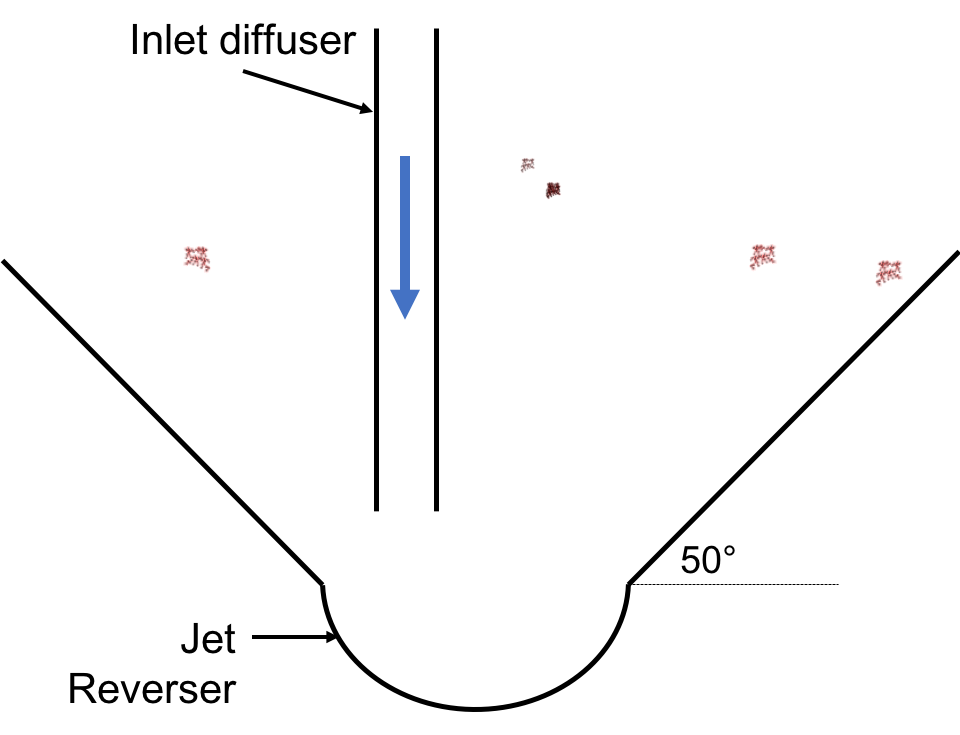

.. raw:: html

    <embed>
       <link rel="canonical" href="https://aguaclara.github.io/Textbook" />
       
    </embed>

.. _title_Clarifier_Design:

*************************
Clarifier Design
*************************

.. _heading_Clarifier_Design:

Components and Flow Paths
==========================

In this section, we will develop a conceptual understanding of the clarifier using figures and images. We will be using a mixture of terminology typically found in water treatment settings and AguaClara-specific terminology. We will discuss the different parts of the clarifier in the sequence that a parcel of water would encounter it, from the beginning of the unit process to the end. The three main sections are:

#. How water enters the clarifier.
#. How water moves through the clarifier.
#. How water leaves the clarifier.

.. _heading_Clarifier_As_Circuit:

Entering the Tank
==================

.. _heading_Good_v_Bad_Hl:

- Anything that makes parallel flow paths different is "bad" head loss.
- Anything that increases head loss through all of the paths, to make differences between the paths less significant, is "good" head loss.

We can artificially introduce the second form of head loss to dominate the resistance and render small variations due to pressure recovery insignificant. We will go through each part of the clarifier to understand how these goals drive AguaClara designs. As we learn about each component, we will attempt to categorize its contribution into creating "good" or "bad" head loss.

Inlet Channel
--------------------

Inlet Manifold
--------------

The port velocity for inlet manifold diffusers is set by the slot width, the width of the clarifier, and the upflow velocity in the clarifier. From mass conservation we have

.. math::
  :label: Clarifier_diffuser_mass_conserve

   Q_{Diffuser} = \bar v_{Jet} W_{Diffuser} S_{Diffuser} = \bar v_{FB} W_{Clarifier} B_{Diffuser}

Solve for the jet velocity, :math:`\bar v_{Jet}`.

.. math::
  :label: Clarifier_diffuser_jet_velocity

  \bar v_{Jet}  = \frac{\bar v_{FB} W_{Clarifier} B_{Diffuser}}{W_{Diffuser} S_{Diffuser}}

For clarifiers that are 1.07 m wide, an upflow velocity of 1 mm/s, with diffusers that are 3.175 mm wide, and assuming that the diffuser wall thickness is small we have a jet velocity of 0.34 m/s.

The maximum inlet manifold velocity can now be determined from Equation :eq:`Manifold_max_v_no_hl_series`. Given a port flow ratio of 85% the maximum manifold velocity is about 0.6 m/s.

`Design the inlet manifold based on a simple manifold analysis <https://colab.research.google.com/drive/1znzBGYHV1RXGqRz3Xm8Oyp7NQmAmkat6#scrollTo=ndlvydp8UMFJ&line=7&uniqifier=1>`_

Water exits the influent manifold through a series of orifices and **diffusers** in the bottom of the pipe shown in :numref:`figure_influent_manifold_diffuser_base`. Orifices refer to the holes that are drilled into the underside of the manifold while diffusers are what we call short stubs of pipe that extend down from the orifice, perpendicular to the influent manifold. The orifices and diffusers point down to the bottom of the clarifier bay and extend along the length of the pipe at regular intervals to ensure that water is evenly distributed within the bay. The ends of the diffuser tubes are flattened so that they are thin rectangles and when placed side-by-side achieve a line-jet effect. The end of the influent manifold is capped.

.. _figure_influent_manifold_diffuser_base:

.. figure:: ../Images/influent_manifold_diffuser_base.png
    :height: 300px
    :align: center
    :alt: Influent manifold with diffusers.

    Influent manifold with diffusers.

.. _figure_influent_manifold_diffuser_flow:

.. figure:: ../Images/influent_manifold_diffuser_flow.png
    :height: 300px
    :align: center
    :alt: Influent manifold and diffuser flow paths.

    Influent manifold and diffuser flow paths.

Recall the discussion about flow distribution in the influent channel. We know that the clarifier bay furthest away from the flocculator would receive the most flow from the influent channel due to fluids principles. For the same reasons, the orifice at the end of the influent manifold would receive the most flow in the pipe. Is the type of head loss introduced by the 90 degree bend "good" or "bad"? This head loss is "good" because it increases head loss through all paths equally.

Is the type of head loss in the influent manifold "good" or "bad"? Like the influent channel, it would be "bad" head loss because it can lead to different flow along the length of the clarifier; the end of the clarifier would receive more flow than the beginning.

However, the diffuser system was designed to greatly impact the overall flow distribution in an attempt to make the flow more equal in all parts of the system. Diffusers are designed to introduce 1 cm of head loss (see the section on :ref:`diffuser design <heading_Clarifier_Diffuser_Design>` for more information). This is "good" head loss because it uniformly increases the head loss through all flow paths. The "good" head loss from the diffusers dominate the "bad" head loss from the influent channel and manifold, making differences between the paths less significant.

The influent manifold diffuser system straightens the fluid jets that are exiting the manifold so that they have no horizontal velocity component as shown in :numref:`figure_flow_straightening`. This is critical because even a small horizontal velocity causes a large scale circulation that transports flocs directly to the top of the clarifier as shown in :numref:`figure_flow_circulation`. Influent manifolds without flow straightening diffusers are commonly used in vertical flow clarifiers including designs by leading manufacturers.

.. _figure_flow_circulation:

.. figure:: ../Images/flow_circulation.png
    :height: 300px
    :align: center
    :alt: Flow with a horizontal velocity component that causes problematic flow circulation.

    Flow with a horizontal velocity component that causes problematic flow circulation.

The horizontal flow created by the direction of flow inside the manifold results in preferential flow through the plate settlers at the terminal end of the manifold. This is a common problem in conventional clarifiers that don't have flow straightening diffusers or that have horizontal flow in the tank.

The underlying cause of the poor flow distribution between plate settlers (shown in :numref:`figure_flow_circulation`) is because the head loss through the plate settlers is inconsequential and thus there can't be **any** significant horizontal velocity below the plate settlers. It is possible that some plate settler manufactures address this issue by adding flow control orifices at the top of the plate settlers that add sufficient head loss to the flow through every plate settler to minimize the impact of velocity differences below the plates.

The AguaClara solution is to use flow diffusers that simultaneously eliminate horizontal flow and create a line jet that resuspends settled flocs to maintain the floc filter in suspension.

.. _figure_flow_straightening:

.. figure:: ../Images/flow_straightening.png
    :height: 300px
    :align: center
    :alt: Flow with the diffusers to remove horizontal velocity component to prevent problematic flow circulation.

    Flow with the diffusers to remove horizontal velocity component to prevent problematic flow circulation.

The diffusers create a line jet that spans the entire length of the clarifier. This line jet enters the bay going down, but we want the water to ultimately flow up to make our vertical flow clarifier. To get the flow to redirect upwards, we use a **jet reverser**, which is half of a pipe that is laid in the bottom of the bay.

.. _figure_bottom_of_clarifier_detail:

.. figure:: ../Images/bottom_of_clarifier_detail.png
    :height: 300px
    :align: center
    :alt: Detail of the bottom of the clarifier.

    Cross-section of the bottom of the clarifier.

You may be wondering, why do we need a jet reverser in the first place? Why don't we just have the diffusers point up to avoid having to change the flow in the first place? The answer has multiple components.

- If the diffusers were to point up, that would mean that any sedimentation that happens near the terminal end of the manifold would accumulate and the sediment would have no way of being removed.
- If flow were just to point directly up, it would not have an opportunity to sufficiently spread into the width of the clarifier bay, which could lead to "short-circuiting" and poor flow distribution overall.
- The jet reverser functions as a way to keep flocs suspended by ensuring that anything that settles will be propelled back up from the force of the diffuser jet. Because the diffusers and jet reverser are responsible for resuspension, their design must meet minimum velocity requirements, as derived in the section on :ref:`diffuser design <heading_Clarifier_Diffuser_Design>`. The jet reverser and diffuser alignment is not symmetrical; the diffusers are directed to one side of the jet reverser (either by slight rotation of the inlet manifold or by an offset). This is intentionally done to ensure that the diffuser jet never collapses to promote a floc filter, which will be discussed next. :numref:`figure_jet_placement` shows that flat bottomed and centered jets do not create a floc filter while offset jets are stable.

.. _figure_jet_placement:

.. figure:: ../Images/jet_placement.png
    :height: 300px
    :align: center
    :alt: The jet reverser and diffuser alignments; the offset jet is the most successful.

    The jet reverser and diffuser alignments; the offset jet is the most successful.

There is a lot of research interest in determining the optimal upflow velocity for floc filters considering that high velocity is better for resuspension but breaks more flocs. Currently, AguaClara plants use an upflow velocity of 1 mm/s.

.. _figure_flat_bottomed_tank:

.. figure:: ../Images/flat_bottomed_tank.png
   :target: https://www.youtube.com/watch?v=04OksWoRmQI
   :width: 400px
   :align: center
   :alt: Flat bottomed tank with settled flocs (click to be sent to video).

   Flat bottomed tank with settled flocs (click to be sent to video).

As shown in :numref:`figure_flat_bottomed_tank` and the linked video, in a flat bottom geometry, flocs settle in the corners of the tank because there is no direct flow of water to resuspend it. Flocs fall in such a way that the corners of the tank will fill first, with more and more flocs settling until the angle of repose is created. This angle that is occupied by flocs suggests that if we want to avoid having flocs settle, we should fill the sides of the tank in with concrete and create a sloped bottom so that there are no surfaces for settling.

The influent manifold, diffusers, and jet reverser work with a **sloped bottom geometry** in an AguaClara plant. The slope on either side of the diffusers is at a 50 degree angle. The bottom geometry allows for smooth flow expansion to the entire plan view area of the bay, and ensures that all flocs that settle are transported to the jet reverser. The diffusers do not touch the bottom of the tank so that flocs on both sides of the diffuser can fall into the jet reverser for resuspension. Thus, there is no accumulation of settled flocs in the clarifier bays. Sludge that is allowed to accumulate in the bottom of clarifiers in tropical and temperate climates decomposes anaerobically and generates methane. The methane forms gas bubbles that carry suspended solids to the top of the clarifier and cause a reduction in particle removal efficiency. The AguaClara clarifier bottom geometry prevents sludge accumulation while also ensuring good flow distribution.

.. _figure_clarifier_cross_section:

.. figure:: ../Images/clarifier_cross_section.png
    :height: 300px
    :align: center
    :alt: Cross-section of the bottom of the clarifier.

    Cross-section of the bottom of the clarifier.

.. _figure_Floc_Filter_Floc_Hopper:

.. figure:: ../Images/Floc_Filter_Floc_Hopper.png
   :target: https://www.youtube.com/watch?v=2x12wGb7xZE
   :width: 400px
   :align: center
   :alt: Sloped bottom tank with fully suspended flocs (click to be sent to video).

   Sloped bottom tank with fully suspended flocs (click to be sent to video).

So we know that the diffusers, jet reverser, and sloped bottom ensure that no sludge accumulates in the bay by creating a system to resuspend any settled flocs.

.. _figure_diffuser_jetreverser:

    Distribution of flocculated water and resuspension of settling flocs (click to be sent to video).

What are the failure modes for this system? For one, we need to ensure that the jet of water exiting the diffuser is able to maintain its upward direction after the jet reverser. The jet is influenced by the flows that are coming down the sloped sides of the tank. Thus, the jet must have enough momentum to remain upwards even with the momentum from other flows downwards. We can control the momentum of the jet by controlling the cross-sectional area of the diffuser slot. A smaller cross-sectional area will increase the velocity of the jet but the mass is the same because the flow rate for the plant is the same, thus increasing the momentum.

`Garland, 2016 <https://doi.org/10.1089/ees.2015.0314>`_ showed that the jet was unable to resuspend the flocs when the jet velocity was 57 mm/s and was successful for all velocities greater than 75 mm/s. The momentum of the floc density current will increase with the concentration of flocs in the primary filter which is in turn a function of the density and size of the core particles. The primary filter floc concentration will decrease at lower temperatures and thus failure of the jet reverser will occur at high temperatures. Given that Dr. Garland did the research at room temperature using a kaolin suspension it is likely that the 75 mm/s guidelines is sufficiently conservative for all designs that have a 1 mm/s upflow velocity. The jet reverser will fail at some point as the flow rate through the clarifier is decreased. The solution for that case would be to take a fraction of the clarifiers off line to maintain a higher jet velocity.

.. _figure_jet_angle:

.. figure:: ../Images/jet_angle.png
    :height: 300px
    :align: center
    :alt: Jet diameter and current of settled flocs.

    Jet diameter and current of settled flocs.

.. _figure_diffuser_jet_reverser:

.. figure:: ../Images/diffuser_jet_reverser.png
    :target: https://youtu.be/WEM-YyGITlQ
    :width: 400px
    :align: center
    :alt: Jet reverser resuspending flocs (click to be sent to video).

    Jet reverser resuspending flocs (click to be sent to video).

Jet Reverser
-------------

The jet reverser is an AguaClara invention for producing stable floc filters. The jet reverser includes a plane jet that is thin and has a high velocity. The momentum of that jet is important because it must counteract the momentum of the density current of the settled flocs. The thin, high velocity jet has a high energy dissipation rate (see Equation :eq:`planejet_EDR`) and a high energy dissipation rate undoubtedly breaks up flocs. If the jet breaks flocs into fragments that have a terminal velocity that is less than the capture velocity of the plate settlers, then the clarifier performance will deteriorate.

Conventional wisdom suggests that breaking up flocs on the way to the clarifier is counter productive. The traditional goal of not breaking flocs led to design of tapered flocculators and guidelines suggesting maximum velocities for transport of those flocs to the clarifier. Dimensional analysis provides the insight that if the constraint for not breaking flocs is actually a velocity, that there must be some way to make that velocity dimensionless if that constraint is rational. In order to identify and characterize the constraint related to floc break up we need to understand the physics of the processes and clearly identify the failure mode.

The maximum shear stress that should be used for design of jet reversers requires further analysis. Flocs composed of less clay and more organic matter or more coagulant nanoparticles will have a lower density and would still be sheared to the same diameter by the fluid shear stress. These flocs would have a lower terminal velocity than clay based flocs and thus they would not be captured by the plate settlers. Thus the design constraint for the fluid shear stress should be based on the lowest density floc that is to be captured by the plate settlers.

Different coagulants may well have different bond strengths and flocculant aids that increase the bond strength all merit study with the jet reverser experiment to determine an appropriate fluid shear stress. The shear stress of 0.55 Pa is likely an upper limit for operation without using flocculant aids.

The maximum fluid shear stress for conservative basis of design should be calculated based on minimum water temperature, plate settler capture velocity, and minimum floc density. The solution path is

#. Calculate the diameter of the lowest density floc that has a terminal velocity equal to the capture velocity of the plate settlers.
#. Solve Equation :eq:`d_floc_shear_stress` for the shear stress given the floc diameter.

The jet reverser can be designed given a maximum fluid shear stress that is calculated based on minimum operating temperature, plate settler capture velocity, and floc density. We do not yet have a comprehensive model for floc properties and thus we are not yet able to calculate floc terminal velocity as a function of composition. We do anticipate that floc density decreases dramatically for flocs that consist primarily of dissolved organics and coagulant.

The goal is to derive an equation that will calculate the maximum jet velocity given the upflow velocity, :math:`v_{z_{ff}}`, and width, :math:`W_{Clarifier}`, of the clarifier. Begin by eliminating the energy dissipation rate from the fluid shear stress, Equation :eq:`fluid_shear_stress`, by substituting the plane jet energy dissipation rate, Equation :eq:`planejet_EDR`.

.. math::
  :label: shear_stress_plane_jet

  \tau_{max} = \rho \sqrt{\nu \Pi_{JetPlane} \frac{  \bar v_{Jet} ^3}{W_{Jet}}}

The volumetric flow rate of the plane jet is the same as the volumetric flow rate through the clarifier.

.. math::
  :label: jet_clarifier_continuity

  \bar v_{Jet} W_{Jet} = \bar v_{z_{ff}} W_{Clarifier}

Use Equation :eq:`jet_clarifier_continuity` to eliminate the thickness of the jet, :math:`W_{Jet}` in Equation :eq:`shear_stress_plane_jet`

.. math::
  :label: shear_stress_jet_clarifier

  \tau_{max} = \rho \bar v_{Jet} ^2 \sqrt{ \frac{\nu \Pi_{JetPlane}}{\bar v_{z_{ff}} W_{Clarifier}}}

Solve for the maximum permissible jet velocity, :math:`\bar v_{Jet_{max}}`.

.. math::
  :label: max_clarifier_jet_velocity_of_tau

  \bar v_{Jet_{max}} = \left(\frac{\tau_{max}}{\rho}\right)^\frac{1}{2} \left( \frac{\bar v_{z_{ff}} W_{Clarifier}}{\nu \Pi_{JetPlane}}\right)^\frac{1}{4}

Given that the velocity gradient governs the design of the flocculator and the entrance to the floc filter we can substitute Equation :eq:`tau_of_mu_G` to obtain

.. math::
  :label: max_clarifier_jet_velocity_of_G

  \bar v_{Jet_{max}} =  \left( \frac{G_{max}^2 \nu \bar v_{z_{ff}} W_{Clarifier}}{ \Pi_{JetPlane}}\right)^\frac{1}{4}

Equation can also be written in terms of flow rate by substituting the continuity equation.

.. math::
  :label: max_clarifier_jet_velocity_of_G_and_Q

  \bar v_{Jet_{max}} =  \left( \frac{G_{max}^2 \nu \bar Q }{L_{Clarifier} \Pi_{JetPlane}}\right)^\frac{1}{4}

The maximum jet velocity increases with width of the clarifier valley because the jet thickness is proportional to valley width and the energy is dissipated more slowly as the jet width increases.

Clarifier Outlet Manifold
----------------------------------

The head loss through the clarifier is due to:

* entrance and elbow in influent manifold
* major losses in influent manifold (negligible)
* diffuser exit loss
* floc filter (negligible)
* plate settlers (negligible)
* effluent manifold orifices
* effluent manifold major loss (negligible)
* effluent manifold exit

It is convenient to set the total head loss through the clarifier to be equal to exactly 5 cm so that influent and effluent weirs always have the same elevation difference. The effluent manifold orifices are be designed for whatever head loss is required to meet that target.

.. _heading_clarifier_inlet_channel:

.. _heading_Clarifier_Velocity_Flow:

Comparison of Velocities and Flow in Clarifier
========================================================

To understand how water flows in the clarifier, we must understand how the water velocity changes with the geometry. There are four distinct zones in the clarifier:

#. The velocity of water exiting the diffusers.
#. The velocity of water moving through the floc filter.
#. The velocity of water that enters the plate settlers.
#. The velocity of water through the plate settlers.

The geometry of the clarifier changes in these four zones, so we will follow these changes to make sure that we understand the conservation of flow. The flow going through the clarifier is the same everywhere, but average velocities are different. The fact that flow rate is velocity multiplied by area, :math:`Q = \bar v A`, will be our guiding principle. In all cases,

| :math:`Q_{Clarifier} =` flow rate through each clarifier
| :math:`W_{Clarifier} =` width of each clarifier

.. _figure_clarifier_flow_conserve:

.. figure:: ../Images/clarifier_flow_conserve.png
    :height: 300px
    :align: center
    :alt: AguaClara clarifier showing "lost triangle" and its impact on relevant lengths.

    AguaClara clarifier showing "lost triangle" and its impact on relevant lengths.

.. _heading_Clarifier_Floc_Filter:

Floc Filter
-------------

After the water exits the diffusers and jet reverser, it flows through the expanded floc filter region where:

| :math:`L_{SedFloc} =` length of the clarifier that has a floc filter
| :math:`\bar v_{z_{ff}} =` upflow velocity of the water through the floc filter

Thus, :math:`Q_{Clarifier} = W_{Clarifier}*L_{SedFloc}* \bar v_{z_{ff}}`

The line jet from the diffusers enters the jet reverser to force flow up through the clarifier bay. The vertical upward jet momentum is used to resuspend flocs that have settled to the bottom of the clarifier. The resuspended flocs form a fluidized bed which is called a **floc filter**. The bed is fluidized because flocs are kept in suspension by the upflowing water.

For a floc filter to form 1) all flocs must be returned to the bottom of the clarifier and 2) all settled flocs must be resuspended by incoming water. As will be discussed soon, plate settlers are used to return flocs to the bottom of the bay, while the jet reverser and sloped bottom geometry allow for floc resuspension. Any surface with a horizontal component in a clarifier must be sloped to allow settled flocs to return to the resuspension zone. A flat bottom geometry does not allow for the formation of a floc filter, as discussed previously.

.. _figure_floc_filter_experiment:

.. figure:: ../Images/floc_filter_experiment.png
   :target: https://www.youtube.com/watch?v=w8ZFCz54IBs
   :width: 400px
   :align: center
   :alt: Floc filter formation over time (click to be sent to video).

   Floc filter formation over time (click to be sent to video).

Studies by AguaClara researchers have found that floc filters improve the performance of a clarifier and reduce settled water turbidity by a factor of 10 for multiple reasons (`Garland et al., 2017 <https://www.liebertpub.com/doi/10.1089/ees.2016.0174>`_):

- By providing additional collision potential. The high concentration of particles, with a suspended solids concentrations of approximately 1-5 g/L, leads to an increase in collisions and particle aggregation. As discussed for vertical flow clarifiers, flocculation can occur in a floc filter due to shear from suspended flocs which are colliding and growing. Fluidized flocs provide a collision potential of a few thousand. This collision potential is small compared to the collision potential from the flocculator. So how does a small :math:`G_{CS} \theta` cause a large reduction in turbidity? The two-fold answer may be that the lower :math:`G_{CS}` value provides an opportunity for all flocs to grow larger without floc breakup. The high concentration of flocs provides many opportunities for clay particles to collide with big flocs, but it is not clear if or when those collisions are successful. We also want to know which flocs are active or inactive in collisions in the floc filter. See the section on :ref:`floc filter design <heading_Clarifier_Floc_Filter_Design>` for more information.

- By creating a uniform vertical velocity of water entering the plate settlers.

- By transporting excess floc consolidation pipe with a drain port, called the floc hopper. The floc hopper is discussed in the next section.

While we have just explained three reasons that the floc filter improves clarifier effluent quality, we do not yet have a model for floc filter performance. Additional research is needed to create this model, and to determine optimal upflow velocity.

Consider the requirements that we have stated for the creation of the floc filter. Could we design for a floc filter in a treatment plant that experiences flow variability? There are some plants that only run for certain hours of the day. While this intermittent flow would impact many parts of the plant, how would it impact the floc filter specifically? Can a settled floc filter be resuspended?

We do not yet have a way to design for variable or intermittent flow rates in a clarifier. The ability of a settled floc filter to resuspend is dependent on the characteristics of the flocs themselves. For example, sticky and clumpy flocs would have a more difficult time resuspending because they tend to settle into hard masses in the absence of sufficient upflow velocities. The capacity for resuspension may require site-specific analysis. The AguaClara pilot PF300 in testing at the Cornell Water Treatment Plant is going to determine whether the floc filter at that site will be able to intermittent flow; the pilot plant and the Cornell Water Treatment Plant will be offline from around 10pm - 5am daily.

It is of interesting note that the suspended solids concentration in the floc filter is approximately 1-5 g/L. This concentration corresponds to measurements of thousands of NTU, which is remarkably turbid water. A water treatment plant could have 5 NTU water entering the plant, and water in the bottom of the clarifier could have 1000 NTU. This is one clue that there are interesting things happening in the floc filter; the bottom of the clarifier can be a completely different world from the rest of the treatment process.

An understanding of the bottom of a clarifier is important to understand how clarifiers work. However, most clarifiers do not allow the operator to observe what is happening. Without being able to observe the bottom of the clarifier, an operator would not know what is happening or if a floc filter is forming successfully. AguaClara research teams are working to develop a probe to get data on floc filter performance. Until then, there are two ways to learn about the floc filter. The AguaClara plant at the University of Zamorano in Honduras was built with a translucent wall on one end of a clarifier bay. This allows students and operators to observe the floc filter. The AguaClara pilot PF300 in testing at the Cornell Water Treatment Plant has small sample ports installed into the side of the reactor. Drawing a sample of water at different heights of the reactor will indicate if a floc filter has grown, and how deep it is.

Let's recap some important conclusions from this section on the floc filter.

- The low G flocculation in the floc filter may allow for the rapid growth of the flocs coming from the flocculator.
- The floc filter reduces the effluent turbidity from the clarifier.
- The floc filter requires a mechanism to keep the flocs resuspended:
  - An upflow velocity of approximately 1 mm/s is the current AguaClara design parameter;
  - Sloped surfaces to return flocs to the resuspension point is necessary to prevent floc build-up.
- We do not have a model for floc filter performance, meaning that we don't know the optimal floc filter depth or optimal upflow velocity.
- We do not yet have a consistent way for operators to observe the floc filter.
- We do not know what exactly contributes to the ability of a floc filter to resuspend or survive variable flow.

Floc Hopper
-----------

However, remember the diffusers that distribute water into the clarifier? They create velocities on the order of 100 mm/s. Those high initial velocities are damped out by the floc filter which helps to distribute the flow. If we weren't able to use the floc filter to dampen the flow to be less than 4 mm/s, then the plate settlers would not provide any head loss to help with uniform flow distribution. This point about uniform flow is really important.

.. _heading_Floc_Volcano_Intro:

Floc Volcanoes
==============

Now, lets discuss a plate settler problem that has not yet been solved: **floc volcanoes**. Floc volcanoes occur when water and flocs rise preferentially in one part of the clarifier. At points of high velocity, flocs can rise to the surface of the water. Consider the following case: an AguaClara plant in San Nicolas, Honduras, was witnessing intermittent floc volcanoes in the clarifiers. During operation, the plant was treating raw water with 4 NTU with a PACl dose of 3.5 mg/L. The settled water turbidity varied between 0.5 and 4 NTU. What might explain the floc volcanoes and very poor plant performance? Try coming up with a hypothesis that matches the information given to us from the plant. We want to figure out what is causing this problem so we can design a solution. What questions would you want to ask the technicians or engineers in Honduras? This exercise emphasizes the idea that asking the right questions are sometimes the hardest first step to learning more information.

Some hypotheses and questions may include:

1) Is the problem related to dissolved air flotation? Dissolved air coming out of flocculation can cause flocs to float to the top.

After asking the operators, we are told that there are not any bubbles in the clarifier.

2) Is the problem regularly intermittent? Is there anything that we can correlate these fluctuations to?

After asking the operators, we are told that the floc volcanoes appear in the early afternoon each day.

.. _figure_temp_turbidity:

.. figure:: ../Images/temp_turbidity.png
    :height: 300px
    :align: center
    :alt: Turbidity as a function of time in San Nicolas, Honduras.

    Turbidity as a function of time in San Nicolas, Honduras.

Using this new information, we have to make another hypothesis about why the floc volcanoes are impacted daily. Perhaps it is related to the sun and daily temperature changes. We can ask the operators to measure the water temperatures so we can do some analysis. The operators measure temperature and we plot the results, providing the following graph.

We know that this plant brings water from a water source about 14 km away. The water is transported in a galvanized iron pipe that is placed on the surface of the ground because there is no concern about freezing pipes in Honduras (galvanized iron is not damaged by UV like PVC pipe is). The pipe functions as a 14 km water heater, raising the temperature of the water to the plant after noon.

But why does the temperature difference cause a problem for the plate settlers?
The problem is that there is warmer water entering the clarifier than what is in it. This temperature difference causes a density difference in the clarifier and plate settlers. The less dense, warmer water rises to the top of the plate settlers while the cold water drops to the bottom of the plate. This creates a current, allowing water to flow up on the top and settle on the bottom. The temperature gradient changes slowly over a few hours.

.. _figure_temp_tube_settler:

.. figure:: ../Images/temp_tube_settler.png
    :height: 300px
    :align: center
    :alt: Hot water rising and cold water settling in a tube settler.

    Hot water rising and cold water settling in a tube settler.

So, now that we think we know what the problem is, how would we try to solve it? One idea would be to paint the entire line to reflect heat, but this is not feasible due to cost. The town Water Board had been maintaining the distribution line by cleaning weeds and brush from the pipe. The solution ended up being to just let the weeds grow over the pipe to provide shade. We haven't yet come up with a real solution. A possible long-term solution could be to design a clarifier that has a really short residence time. The longer the residence time in the clarifier, the worse the problem is because there is a large variation between the water that entered it last night and the water that enters it this afternoon. A tank with a really short residence time, on the order of a few minutes, would ensure that the water coming in would be very close to the water already in the tank.

Let's recap some important conclusions from this section on plate settlers.

#. Reynolds number calculations of flow through plate settlers prove that there is laminar flow between plate settlers. This is important because it allows us to assume that a parabolic velocity profile is established.
#. There is very low head loss between plate settlers so they will not do a good job of helping to achieve uniform flow between the plate settlers.
#. The plate settlers are designed to capture flocs with terminal velocities greater than the settle capture velocity. AguaClara currently uses :math:`\bar v_c = 0.12` mm/s but this value needs to be further optimized; we would like to know how settled water turbidity changes with capture velocity. Future work includes choosing a settle capture velocity based on overall plate performance.
#. Plate settler spacing:

   a. Plate settler spacing determines the ability of flocs to roll down the incline.
   b. Smaller spacings between plate setters have diminishing returns in terms of clarifier depth. The current AguaClara spacing is 2.5 cm but there is room for further optimization.
   c. Flocs made from natural organic matter (NOM) may be less dense, more prone to floc rollup, and may require larger spacing between plate settlers.

.. _heading_Clarifier_Exit:

Exiting the Tank
=================

Now that we have passed through the plate settlers, we are ready to leave the clarifier.

.. _heading_Clarifier_Effluent_Manifold:

Submerged Effluent Manifold
------------------------------

.. _heading_Clarifier_Exit_Weir_Channel:

Exit Weir and Effluent Channel
----------------------------------------

- The AguaClara clarifier design is driven by the need for high treatment capability coupled with easy operation and maintenance.
- There is "good" head loss introduced by the influent manifold entrance, diffusers, effluent manifold orifices, and effluent manifold exit. There is "bad" head loss introduced by pressure recovery in the influent channel, influent manifold, and effluent manifold. Even flow distribution is achieved by ensuring that "good" head loss dominates through intentional design.

.. _figure_circuit_full:

.. figure:: ../Images/circuit_full.png
    :height: 300px
    :align: center
    :alt: Clarification tank as a circuit, showing "good" and "bad" head loss.

    Clarification tank as a circuit, showing "good" and "bad" head loss.

.. _heading_Clarifier_Review:

Review
--------------------------------
You can review your understanding of AguaClara clarifiers by asking yourself the following questions:

#. Why do horizontal flow clarifiers perform must worse than theory predicts?
#. How does the floc filter improve clarifier performance?
#. What is the purpose of the floc hopper?
#. Why do we use plate settlers?
#. What is the failure mechanism for small spacing between plate settlers?
#. What helps the flow divide evenly between and within the clarifiers?

The hydraulic self cleaning clarifier with a high performing floc filter, zero sludge accumulation, and with no moving parts outperforms conventional clarifiers on capital cost, performance, and maintenance costs. We will now transition to the mathematical models which explain how we make these advancements possible.

References
===========

Garland, Casey, et al. “Revisiting Hydraulic Flocculator Design for Use in Water Treatment Systems with Fluidized Floc Beds.” Environmental Engineering Science, vol. 34, no. 2, 1 Feb. 2017, pp. 122–129., doi:10.1089/ees.2016.0174.
