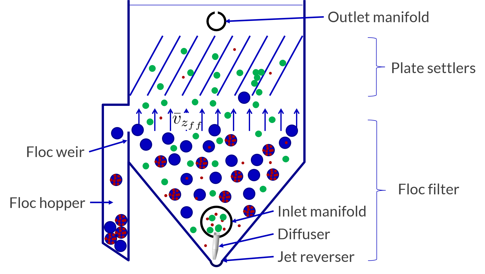

.. raw:: html

    <embed>
       <link rel="canonical" href="https://aguaclara.github.io/Textbook" />
       
    </embed>

.. _title_Clarification_Intro:

**************************
Clarification Introduction
**************************

AguaClara Clarifier
===================

.. _table_clarifier_floc_types:

.. csv-table:: Floc and particle types in the clarifier.
     :header: "Symbol", "Description", Terminal velocity
     :widths: 10, 80, 10

     |small_floc|, Flocs and raw water particles that settle too slowly to be captured by the plate settlers , :math:`v_t < v_c`
     |flocculator_floc|, Flocculator flocs that settle fast enough to be captured by the plate settlers, :math:`\bar v_{z_{ff}} > v_t > v_c`
     |empty_floc_filter|, Floc filters that form as |flocculator_floc| slide down the plate settlers ,:math:`v_t > \bar v_{z_{ff}}`
     |full_floc_filter|, Floc filters that no longer have capacity to capture |small_floc| , :math:`v_t > \bar v_{z_{ff}}`

The floc interactions in the clarifier include multiple steps. The video linked to :numref:`figure_clarifier_flocs` provides the context for the following description of the processes.

.. _figure_clarifier_flocs:

    AguaClara clarifier showing the four types of flocs and animation (click for video).

The inlet manifold supplies |small_floc| that settle too slowly to be captured by the plate settlers and |flocculator_floc| that will be captured by the plate settlers. Before the floc filter forms the |small_floc| are not removed by the clarifier and exit through the outlet manifold.

The |flocculator_floc| settle on the plate settlers and then eventually slide down the plates in an avalanche  `(see animation of floc aggregation on a plate settler) <https://youtu.be/jCjKz6bCD7Y>`_. As the flocs slide down they aggregate into |empty_floc_filter|. The conversion of |flocculator_floc| into |empty_floc_filter| provides the mechanism for the flocs that are captured on the plate settlers to increase their terminal velocity so that they can fall back into the bottom of the clarifier. If |flocculator_floc| didn't convert into |empty_floc_filter| there wouldn't be any way for flocs captured by the plate settlers to exit from the bottom of the plate settlers.

The |empty_floc_filter| have a fractal dimension of approximately 2 and thus are very porous. A significant amount of water flows right through these porous flocs (:numref:`figure_flow_thru_floc` and  `animation of floc capture <https://youtu.be/DZdF7_Krb2s>`_). As water flows through the floc some of the |small_floc| collide with similar sized particles that are held in place inside the floc.

.. _figure_flow_thru_floc:

.. figure:: ../Images/flow_thru_floc.png
    :target: https://youtu.be/DZdF7_Krb2s
    :align: center
    :height: 200px
    :alt: Flow through a floc.

    Streamlines go around and through a floc filter. The fraction of the flow that goes through the floc is a function of the floc porosity.

As the floc filters, |empty_floc_filter|, capture the particles that otherwise would have escaped the clarifier, |small_floc|, the porosity of the |empty_floc_filter| decreases and less flow goes through the floc. Eventually the floc becomes loaded to capacity with |small_floc| and the resulting |full_floc_filter| is no longer able to capture any more |small_floc|.

Mass conservation requires that at steady state the mass flux of solids into the clarifier match the flux of solids out of the clarifier. If the clarifier is functioning as designed and the coagulant dose is correct the majority of the incoming solids will be converted into large flocs (|empty_floc_filter| and |full_floc_filter|) and those flocs will flow over the top of the floc weir.

Sedimentation and Plate Settlers
================================

Sedimentation is a gravity-driven unit process in which suspended flocs are settled out from water. Large flocs made up of many primary particles and coagulant will settle if given enough time. Clarification is commonly preceded by flocculation to form flocs which will be large enough to settle in the clarifier - and is commonly followed by filtration to capture particles that passed through the clarifier. Sludge consolidation processes are often present alongside clarifiers to reduce the waste stream of settled flocs. Optimizing clarification is important because the more particles that clarifiers can remove, the fewer particles the filter will have to remove. This is good because filters can only handle a small amount of solids, and cleaning the filters with backwash uses a lot of water so we want to reduce the number of backwashes.

To introduce you to sedimentation, we will begin with a simple example. If a jar of water filled with flocs was left at rest, flocs would begin to settle due to gravitational forces pulling them down. Large flocs would settle first, but if left for long enough, all flocs would settle to the bottom of the jar. In its most basic form, the jar represents a clarifier in which flocculated water is treated. Settled flocs are waste and the water on the top of the jar, referred to as the supernatant, is the clarified water.

Constraints of space, time, and cost make it important to optimize the settling process. It would not be realistic to design water treatment systems that use the basic jar-like system to settle flocs because large flow rates would require unreasonably large reactor volumes and long retention times. The goal of clarifier design is to employ geometries that promote settling and allow for fast treatment with small footprints.

What if we were to do the same jar experiment with raw water that did not go through successful coagulation and flocculation? Would we observe the same settling and successful particle removal? To answer this, we must recall information learned in the section on coagulation and flocculation; those two treatment processes serve to destabilize and agglomerate particles to form flocs that will be heavy enough to settle. If the particles are colloids and are not destabilized, no amount of time will allow for the settling. This emphasizes the fact that successful clarification can only happen after successful flocculation.

The three main steps that need to be accomplished for a clarifier to be successful are as follows:

1) Suspended flocs need to be able to settle out of the water.
1) Settling flocs need to be able to move from wherever they settle to a resuspension zone.
1) 

Clarification is ubiquitous in water treatment. Nevertheless, the process is very complex with many failure modes and there are many active research areas. The following sections will explore the state of conventional sedimentation systems and their challenges, gaps in knowledge, and the AguaClara approach to clarification.

To understand how clarification works, a few key concepts must first be developed. This includes understanding how and why flocs move in water. Remember, one of the goals of clarifiers is to optimize the floc-settling process.

.. _heading_capture_velocity:

Terminal Velocity and Capture Velocity
======================================

Sedimentation is the process of particles ‘falling’ because they have a higher density then the water, and its governing equation is:

.. math::
  :label: eq_laminar_terminal_velocity

  \bar v_t = \frac{D_{particle}^2 g}{18 \nu} \frac{\rho_p - \rho_w}{\rho_w}

| Such that:
| :math:`\bar v_t` = terminal velocity of a particle, its downwards speed if it were in quiescent (still) water
| :math:`D_{particle}` = particle diameter
| :math:`\rho` = density. The :math:`p` subscript stands for particle, while :math:`w` stands for water

The terminal velocities of particles in surface waters range over many orders of magnitude especially if you consider that mountain streams can carry large rocks. But removing rocks from water is easily accomplished, gravity will take care of it for us. Gravity is such a great force for separation of particles from water that we would like to use it to remove small particles too. Unfortunately, gravity becomes rather ineffective at separating pathogens and small inorganic particles such as clay. The terminal velocities (Equation :eq:`eq_laminar_terminal_velocity`) of these particles is given in :numref:`figure_Terminal_velocity`.

`The code to generate the following plot can be found here <https://colab.research.google.com/drive/1lE7cHu3TS1vMs0_yA3FmNdPnk3iktBJw#scrollTo=7r75Qu4yPC80&line=18&uniqifier=1>`_

.. _figure_Terminal_velocity:

.. figure:: ../Images/Terminal_velocity.png
    :width: 500px
    :align: center
    :alt: Terminal Velocity

    The terminal velocity of a 1 :math:`\mu m` bacteria cell is approximately 20 nanometers per second. The terminal velocity of a 5 :math:`\mu m` clay particles is 30 :math:`\mu m/s`. The velocity estimates for the faster settling particles may be too slow because those particles are transitioning to turbulent flow.

The low terminal velocities of particles that we need to remove from surface waters reveals that sedimentation alone will not work. The time required for a small particle to settle even a few mm would require excessively large clarifiers. This is why flocculation, the process of sticking particles together so that they can attain higher terminal velocities, is perhaps the most important unit process in surface water treatment plants.

Capture velocity is defined as the velocity of the slowest settling particle that a clarifier captures reliably. It is a property of the geometry of the clarifier. Because it is a property of geometry, we can use it as an important design tool; because we can control reactor geometry, we can control the sizes of particles that we can settle. However, the size of particles that a clarifier can capture is also a function of the viscosity of the water and thus is influenced by temperature.

Note that there are a couple of different terms used to describe the sedimentation process. We can say that clarifiers "capture" particles when particles settled. We can also say that clarifiers "remove" particles. Both terms refer to the process of particles or floc settling out of suspension in water. Clarification tanks separate some particles from the water and eventually divert those captured particles into a waste stream.

We will develop our definition of settle capture velocity using examples of horizontal flow and vertical flow clarifiers. It should be noted that there are many idealizations and simplifications made for modeling clarifiers. We assume that water will move through the reactor as expected (in the case of the horizontal flow clarifier, from one end to the other), but we know that there are many more fluids complications than are described here. We assume that everything is moving at the average velocity and there are no turbulence or velocity profiles. For the time being, we will ignore what will happen to particles once they are captured by the clarifier. Our intuition tells us that particles which settle will need to be removed somehow, and that is correct. For now, we only care about capturing the particles, and later we will care about what we do with them once they are captured.

Temperature plays an important role in sedimentation processes. Colder temperatures mean more viscous fluid; particles suspended in viscous fluid don't fall as quickly as they would in warmer, less viscous fluid. Clarification tanks don't work as well in cold temperatures as they do in warm temperatures. If the goal is for the clarifier to remove a certain size of particle, then the required capture velocity must also be a function of temperature. Keep this in mind throughout the chapter as you learn how capture velocity drives to plant design.

Horizontal Flow Clarifier
=========================

.. _figure_horizontal_flow_tank_base:

    Horizontal flow clarifier.

| Where:
| :math:`L =` length [L]
| :math:`W =` width [L]
| :math:`H =` height [L]
| :math:`A_p =` plan view area of the tank [:math:`L^2`]

Let's begin with a few questions that will describe our horizontal flow clarifier in :numref:`figure_horizontal_flow_tank_base`. We will assume that 1) water travels uniformly from one end of the tank to the other, and 2) the particle that we are discussing is 35 :math:`\mu m` (which is the size of particle that AguaClara plate settlers can capture).

**1) How much time is required** for water to pass through the tank?

To determine this value, we can use the given volume and flow rate information by the following relationship:

.. math::

  \theta = \frac{\rlap{-}V_{tank}}{Q}

| Where:
| :math:`\theta =` residence time :math:`[T]`
| :math:`\rlap{-}V_{tank} =` volume of the clarifier :math:`\left[L^3\right]`
| :math:`Q =` flow rate through the tank :math:`\left[\frac{L^3}{T}\right]`

**2) In the "worst case scenario", how far** must a particle fall to reach the bottom of the tank?

The "worst case scenario" is the condition in which a particle must travel the furthest in order to be successfully captured by the clarifier. We assume that particles are evenly distributed throughout the height and width of the reactor entrance. Therefore, a particle entering at the top of the entrance of the reactor would need to fall a distance of :math:`H` to reach the bottom. Any particle entering from a position lower than the top of the tank would need to fall a distance :math:`< H`. We refer to the "worst case scenario" pathway as the "critical path" of the particle in the clarifier design because this is the case which we must design to treat. The height that the particle must fall is called the "critical height", :math:`H_c`.

**3) How fast** must the particle fall?

We know that for a particle to fall to the bottom successfully, it needs to fall fast enough that it can reach the bottom before the water that is carrying it leaves the reactor. Water is carrying the particle across the reactor at the horizontal velocity speed, :math:`v_H`. Gravity is causing the particle to settle at its terminal velocity, :math:`v_t`. In order to reach the bottom, that settling velocity needs to be the capture velocity, :math:`\bar v_c`, to ensure that the particle will reach the bottom of the reactor. We can see the critical path of the particle in :numref:`figure_horizontal_flow_tank_capture`.

.. _figure_horizontal_flow_tank_capture:

    Horizontal flow clarifier with capture velocity.

Capture velocity can be determined by the distance that a particle must travel and the time that the particle has to travel.

.. math::

  \bar v_c = \frac{H}{\theta}

We can make some substitutions into the equation for :math:`\bar v_c` to solve for it in explicit terms of reactor plan view area. We are interested in plan view area because this will indicate the efficiency and cost of an associated reactor.

.. math::

  \bar v_c = \frac{H}{\theta} = \frac{HQ}{\rlap{-}V_{tank}} = \frac{Q}{LW} = \frac{Q}{A_p}

  \bar v_c = \frac{Q}{A_p}

Thus, we have capture velocity which is a descriptor of a clarifier. It determines how fast a particle has to settle in order to be reliably captured by a particular clarifier, assuming idealized flow. The capture velocity is not a particle property, but rather a clarifier property.

**4) Will any particles** that are smaller than 35 :math:`\mu m` be captured in the clarifier?

This question is important because as stated in the beginning of this section, our discussion assumed that the particle in question was 35 :math:`\mu m`. If we design a clarifier to capture particles that are 35 :math:`\mu m`, we also have to understand the impact of our design on particles smaller than 35 :math:`\mu m`.

To answer this question, think about the two extremes of our reactor.

- We could have a small particle entering the reactor at the top, defining the critical path in the same "worst case scenario". This particle would not be successfully captured by the tank because its terminal velocity is less than the capture velocity, meaning that it doesn't have enough time in the reactor to settle.
- We could have a small particle entering the reactor near the bottom, in a "best case scenario". In this case, the particle does not have a large distance to fall because it is already close to the bottom of the tank. Small particles entering the reactor may be able to be captured by a tank designed for particles 35 :math:`\mu m` or larger, but it depends on the height at which they enter the reactor as shown in :numref:`figure_horizontal_flow_tank_small_capture`.

.. _figure_horizontal_flow_tank_small_capture:

.. figure:: ../Images/horizontal_flow_tank_small_capture.png
    :height: 200px
    :align: center
    :alt: Horizontal flow clarifier with critical path and small particle.

    Horizontal flow clarifier with critical path and small particle.

Vertical Flow Clarifier
=======================
We will complete the same exercise for vertical flow clarifiers shown in :numref:`figure_vertical_flow_tank_base`. In vertical flow clarifiers, water flows up from the bottom of the reactor and exits near the top of the reactor.

.. _figure_vertical_flow_tank_base:

.. figure:: ../Images/vertical_flow_tank_base.png
    :align: center
    :height: 400px
    :alt: Vertical flow clarifier.

    Vertical flow clarifier.

**1) How much time** is required for water to pass through the tank?

The answer is the same for the horizontal flow clarifier because this is a property of reactor flow rate and volume.

.. math::

  \theta = \frac{\rlap{-}V_{tank}}{Q}

| Where:
| :math:`\theta =` residence time [T]
| :math:`\rlap{-}V_{tank} =` volume of the clarifier [:math:`L^3`]
| :math:`Q =` flow rate through the tank [:math:`\frac{L^3}{T}`]

**2) How far** must a particle fall relative to the fluid to not be carried out the exit?

Note how this question is different from the question we asked for the horizontal flow clarifier. In the horizontal flow clarifier, particles could settle to the bottom of the reactor. We care about particles settling to the bottom because we assume that if particles hit the bottom of the reactor, then they would be captured and would not leave the reactor. Remember, the goal of sedimentation is to remove particles from suspension in water. In the vertical flow clarifier, we also want to remove particles from suspension, but because there is a different geometry, we are now interested in the relative movement of particle to water. If a particle is falling due to the forces of gravity, but also water is pushing up on it, the only way for a particle to remain in the reactor is if it either falls at the same velocity or faster than the water is pushing it.

If a particle is falling at the same velocity that water is moving it, it will be stationary in the reactor. Water flowing through the reactor moves a distance :math:`H` in time :math:`\theta`, which means that a stationary particle must settle the same distance :math:`H` in the same time :math:`\theta`. Therefore, the answer is :math:`H`.

**3) How fast** must the particle fall (relative to the fluid)?

We determined in the previous question that a particle must fall a distance :math:`H` in time :math:`\theta`. Therefore, we determine the same capture velocity for vertical flow clarifiers as for horizontal flow clarifiers.

.. math::

  \bar v_c = \frac{H}{\theta}

We can the same substitutions to show,

.. math::

  \bar v_c = \frac{H}{\theta} = \frac{HQ}{\rlap{-}V_{tank}} = \frac{Q}{LW} = \frac{Q}{A_p}

Again, we find that capture velocity is,

.. math::

  \bar v_c = \frac{Q}{A_p}

It doesn't matter whether water is flowing horizontally or vertically in the tank. What determines the capture velocity is the flow rate and the plan view area of the clarifier.

**4) Will any particles** that are smaller than 35 :math:`\mu m` be captured in the clarifier?

This question is surprisingly complex because we have to consider what we have learned so far about sedimentation and also recall what we have learned about flocculation.

Let's start with the simple sedimentation approach. We can compare the vertical flow clarifier with the horizontal flow clarifier. In a horizontal flow tank, the capture of particles smaller than the design particle (35 :math:`\mu m`) is possible depending on the height which the particle enters the reactor. In a vertical flow tank, all particles enter the reactor at the same height (which is the bottom of the tank). This means that any particle entering the reactor will need to fall the same distance :math:`H` in time :math:`\theta` relative to the water if it will be captured. If particles smaller than 35 :math:`\mu m` enter the reactor, they will not be captured because they are not able to settle fast enough.

However, we must also consider potential flocculation processes that could occur in the clarifier. A clarifier is still subject to the same laws of fluids as the flocculator, meaning that there will still be shear in the reactor. While it may not be as much shear as that introduced in the flocculator, there are still velocity gradients which mean that there could be some additional flocculation happening in the clarifier. In the flocculator, the main mechanism that led to flocculation was the deformation of fluid which caused particles to collide. In the clarifier, the main mechanism that can lead to flocculation is velocity gradients. Flocculation is provided by an opportunity for collision by differences in relative velocities of particles. Big particles in the clarifier settle out but are still in suspension, and small particles continue to move up through the large particles. There is relative velocity between particles based on their terminal velocities.

Understanding relative velocities is very important to understand how vertical flow clarifiers work. Let's consider an example to develop our understanding of differential sedimentation. Imagine that two people are skydiving; one person is 150 lbs and the other person is 300 lbs. Assume that both people are using the same size parachutes and are jumping out of the same stationary helicopter. If the 150 lb person jumps out first and the 300 lb person jumps out a few moments after, what will happen? The 300 lb person will fall faster than the 150 lb person, causing a collision in the air. In a clarifier, we would describe the collision due to differential sedimentation as flocculation because particles are colliding and growing.

Now that we understand differential settling and the potential for flocculation in a clarifier, let's revisit the original question. Can smaller particles be captured? The answer is that smaller particles can be captured only if they collide with other particles and grow so that they have a terminal velocity that is greater than the capture velocity. This flocculation that happens in the clarifier is an additional mechanism for removing particles.

There are some important differences between horizontal and vertical clarifiers. Many of these points will be discussed next when we learn specifically about the :ref:`AguaClara design process <heading_Clarifier_Design>`, but it is important to get introduced to these ideas now:

- vertical flow tanks require careful attention to the delivery of water in the bottom of the tank and the extraction of water in the top of the tank;
- vertical and horizontal flow tanks may have different velocities and turbulence capacities due to plan view areas;
- research on tube settlers by `Brentwood Industries <https://www.brentwoodindustries.com/water-wastewater-products/tube-settlers/>`_ suggests that settle capture velocities should be 0.12 - 0.36 mm/s;
- research on horizontal flow tanks in *Surface Water Treatment for Communities in Developing Countries* by Schulz and Okun suggests that settle capture velocities should be 0.24 - 0.72 mm/s.

References
============

Schulz, C. R., Okun, D. A., & Water and Sanitation for Health Project (U.S.). (1984). Surface water treatment for communities in developing countries. New York: Wiley.
