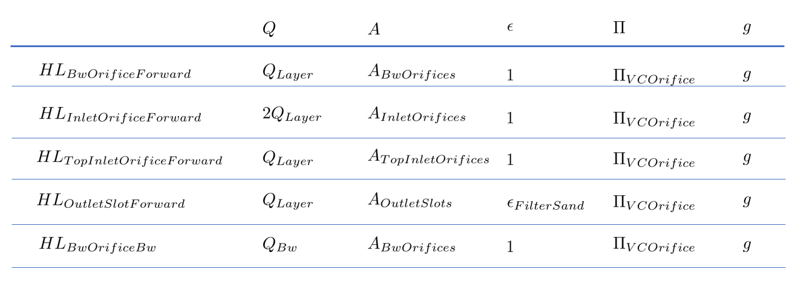

.. _title_estars:

*******************
EStaRS Design
*******************

[I made it about 2/3 of the way through the file and then I ran out of steam. I suggest beginning by stating in text how the design will proceed. Below is my attempt.]

#. Set the spacing between branches to be 0.5 of the sand layer depth
inlet branch orifice size set by maximum diameter than can be used without creating holes through the side of the connection between the branch and the wing pipe.
#. Set the orifice area in the backwash inlet branches based on keeping backwash head loss low. Aim for something between 1 and 5 cm with these numbers chosen to be small relative to the total head loss through an AguaClara plant and assuming that there isn't any reason to waste energy here.
#. Calculate the spacing between orifices (and make sure it is possible to fabricate)
You can continue with these steps. Make sure that you always know everything required to get to the next step.

.. attention::

  This file is a work in progress and includes notes from the author to the author, all information included here is correct though likely incomplete

.. note:: Explain the limitation of OStaRS and thus define the range of flows that EStaRS must be able to handle.

The EStaRS: Enclosed Stacked Rapid Sand filter, is a compact filter that can be amended to a 1 L/s floc/sed unit to provide a filter. EStaRS are also used for low flow plants because they are less resource intensive to construct than a small version of the full-size concrete filter, additionally the OStaRS become infeasible in term of maintainence at very low flows because it would very narrow and very deep. This difficutly is noted in OStaRS filters handling less than 8 L/s corresponding to plant flows less than 16 L/s. This challenge invites the EStaRS as an alternative.

Because the EStaRS filter is constructed using only pipes and couplings, the possible EStaRS sizes are discretized as pipes are not available in every conceivable size. This constraint means that there are only three available sizes of EStaRS: 1 ft, 2ft, and 3 ft diameter, which treat .764 L/s, 3.07 L/s, and 7.024 L/s, respectively. Though the design algorithm can account for additional sizes these sizes as well as the 1.5 ft, are the only sizes that have been constructed. The 1.5ft EStaRS was not inlcuded in the list of possible sizes on the recommendation of an AguaClara engineer who helped construct that particular size.

As with the OStaRS, each plant should have at least 2 filters so that one can still be in use even when the other is in backwash. If the plant flow is more than corresponds with 2 filters, additional filters can and should be added in parallel to accommodate additional flow. In additional to requiring multiple filters there are other parts of the design that are the same for both types of filters! The stacked trunk and branch system is the most notable of these similarities, with key differences being in how the inlet and outlet system can be designed. Both the "traditional" concrete entrance/exit channel and boxes can be used, but a more compact design is what is called the "Micky Mouse" filter [link to figure]. This design features entrance and exit tanks made from large diameter pipes rather than concrete making them modular. Most of this design file considers the shared characteristics of the concrete and "Micky Mouse", but places where the design varies will be noted.

[ How long can the branches be without requiring end support? What is the maximum length of branch that is used in OStaRS? This is a structural issue. A cantilevered pipe must be less than half as long as a pipe that is held at both ends (as is the case in OStaRS). Thus we need structural testing of our inlet and outlet branches before building EStaRS that require stronger branches than are used in the OStaRS. Also a fatigue analysis.]

[Discuss flow control for filters in parallel. A team researched a weir system for this about a year ago.]

.. attention::

  In this file, many values are functions of pipe nominal diameter and SDR. For the simplicity of reading, those values are written with just the geometric value used. For example, if an outer diameter (OD) is needed, it is written as :math:`OD_{ExamplePipe}` rather than :math:`OD(ND_{ExamplePipe}, SDR26)` which is more similar to how it would be found explicitly. Some other features that follow this convention are Inner Diameters and Radii, Outer Radii, and wall thicknesses.

:numref:`table_comparsion_filters` shows some of the design differences between the different filter types. The parameters included in the table will be described throughout this design.

.. _table_comparison_filters:

+--------------------------+------------------+-----------------+----------------------+--------------------------------------+
| Feature                  | EStaRS for PF300 | EStaRS concrete  | EStaRS "Micky Mouse" | OStaRS                              |
+==========================+==================+==================+======================+=====================================+
| Signal for BW            | 60cm head loss   | 75cm head loss   | 75cm head loss       | Min 20cm, function of trunk diameter|
+--------------------------+------------------+------------------+----------------------+-------------------------------------+
| Entrance Tank Material   | Concrete/PVC     | Concrete         | PVC                  | Concrete                            |
+--------------------------+------------------+------------------+----------------------+-------------------------------------+
| Design Flow for 1 Filter | <.75 L/s         | .764 - 7.024 L/s | .764 - 7.024 L/s     | >8 L/s                              |
+--------------------------+------------------+------------------+----------------------+-------------------------------------+
| Sand Layer Height        | 15cm             | 20cm             | 20cm                 | 80cm head loss                      |
+--------------------------+------------------+------------------+----------------------+-------------------------------------+

[Add a section (table or figure) on your proposal for number and size of filters as a function of flow rate over the range of flows that you anticipate EStaRS will be used.]

Dimensions and Overall Filter Body Pipe Size
===================================================

Generally 2 or more filters are considered, so that one can still be in use when the other is being backwashed. The number and size of the filters as a function of the design flow rate and the maximum flow a filter of a particular size can handle.

In the design the first step is to determine what size EStaRS is needed because this determines nearly every parameter. :numref:`_figure_body_d_and_n` shows the process by which the number and size of EStaRS is determined.

.. _figure_body_d_and_n:

.. figure:: Images/_figure_body_d_and_n.png
    :width: 70%
    :align: center
    :alt: flowchart showing how the filter size is determined, interal image

    This flowchart shows the way the plant flow is used with the available pipe diameters to determine an appropriate size and number of filters based on the total plant flow.

The constraint that defines the filter body size is ultimately the backwash velocity. For the sand used in the filters the required upwards velocity to fluidize the sand is 9.8 mm/s. Using this velocity and the flow area of a pipe, as based on the inner diameter, provides a maximum flow for the filter, based on :math:`Q_{Filter} = V_{BW}*A_{Filter}`. This :math:`Q_{Filter}` describes the flow that must be seen for backwash to happen properly. Another array is generated by diving :math:`Q_{Plant}` by :math:`Q_{Filter}`. This array is equal to the required number of filters (:math:`N_{Filter}`) of a particulatr diameters to serve a plant with a flow of :math:`Q_{Plant}. The value that is the smallest number of filters greater than or equal to 2 should is chosen, and the corresponding index of pipe diameter yields the size. If the chosen number is not an integer, it is rounded up to the nearest integer to provide the number of filters to be included. Rounding up guarantees that the entire plant flow can be filtered.

Constants in Filter Design
=============================

+-----------------------------+--------------------------------------+--------------+-------------------------------------------------------------------+
| Constant Name               | Description                          | Value        | Why is this a constant?                                           |
+=============================+======================================+==============+===================================================================+
| :math:`N_{Layers}`          | The number of filter layers          |     6        | Happy medium of fast filtration and small filter                  |
+-----------------------------+--------------------------------------+--------------+-------------------------------------------------------------------+
| :math:`V_{Backwash}`        | Speed required to fluidize sand      |     9.8mm/s  |  The same sand size is used in all filters                        |
+-----------------------------+--------------------------------------+--------------+-------------------------------------------------------------------+
|                             |                                      |              |                                                                   |
+-----------------------------+--------------------------------------+--------------+-------------------------------------------------------------------+
|                             |                                      |              |                                                                   |
+-----------------------------+--------------------------------------+--------------+-------------------------------------------------------------------+
|                             |                                      |              |                                                                   |
+-----------------------------+--------------------------------------+--------------+-------------------------------------------------------------------+
|                             |                                      |              |                                                                   |
+-----------------------------+--------------------------------------+--------------+-------------------------------------------------------------------+
|                             |                                      |              |                                                                   |
+-----------------------------+--------------------------------------+--------------+-------------------------------------------------------------------+
|                             |                                      |              |                                                                   |
+-----------------------------+--------------------------------------+--------------+-------------------------------------------------------------------+

Constraints for Inner Parts
==============================

From the determination of the filter body size, the branch and trunk manifolds are the next most important feature of the design. Some relevant variables defined here. These are constrains that are set before actual componenet dimensions are determined.

[Place these variables in a table that includes name, description, default and constraint that gives the default]

+-----------------------------+--------------------------------------+--------------+-------------------------------------------------------------------+
| Variable Name               | Description                          | Default Value| What Constrains the Default Value                                 |
+=============================+======================================+==============+===================================================================+
|  :math:`ND_{BallValve}`     |                                      |        3 in  |                                                                   |
+-----------------------------+--------------------------------------+--------------+-------------------------------------------------------------------+
|  :math:`ND_{BedTester}`     |                                      | 0.5in        |                                                                   |
+-----------------------------+--------------------------------------+--------------+-------------------------------------------------------------------+
|  :math:`ND_{BedTesterOuter}`|                                      | 1in          |                                                                   |
+-----------------------------+--------------------------------------+--------------+-------------------------------------------------------------------+
|  :math:`ND_{FiAirRelValve}` | Air Valve diameter                   |        0.5in |                                                                   |
+-----------------------------+--------------------------------------+--------------+-------------------------------------------------------------------+
|  :math:`ND_{FiBwTrunkMin}`  | Minimum backwash trunk diameter      | 3in          |  Must fit branches and accomodate full filter flow                |
+-----------------------------+--------------------------------------+--------------+-------------------------------------------------------------------+
|  :math:`ND_{FiBwBranchkMin}`| Mininmum backwash branch diameter    |    1in       |  Slotted pipes cannot be fabricated smaller than 1in              |
+-----------------------------+--------------------------------------+--------------+-------------------------------------------------------------------+
|  :math:`ND_{FiTrunkMin}`    | Minimum trunk diameter               |   2in        |  Must be able to fit branches without significant flow obstruction|
+-----------------------------+--------------------------------------+--------------+-------------------------------------------------------------------+
|  :math:`ND_{FiDrainExit}`   | Minimum drain pipe diameter          | 3in          |  Entire filter flow can drain with 10cm of head                   |
+-----------------------------+--------------------------------------+--------------+-------------------------------------------------------------------+
|  :math:`ND_{FiOverflowEnt}` | Minimum overflow pipe diamete        |  3in         |  Entire filter flow can drain with 10cm of head                   |
+-----------------------------+--------------------------------------+--------------+-------------------------------------------------------------------+
|  :math:`ND_{FiBranchMin}`   |  Mininmum branch diameter            |   1in        |  Slotted pipes cannot be fabricated smaller than 1in              |
+-----------------------------+--------------------------------------+--------------+-------------------------------------------------------------------+
|  :math:`D_{OrificeMax}`     |  Maximum orifice size on branches    |     1/4in    |  Larger will leave gaps along the wings for sand to escape        |
+-----------------------------+--------------------------------------+--------------+-------------------------------------------------------------------+
|                             |                                      |              |                                                                   |
+-----------------------------+--------------------------------------+--------------+-------------------------------------------------------------------+
|                             |                                      |              |                                                                   |
+-----------------------------+--------------------------------------+--------------+-------------------------------------------------------------------+
|                             |                                      |              |                                                                   |
+-----------------------------+--------------------------------------+--------------+-------------------------------------------------------------------+
|                             |                                      |              |                                                                   |
+-----------------------------+--------------------------------------+--------------+-------------------------------------------------------------------+
|                             |                                      |              |                                                                   |
+-----------------------------+--------------------------------------+--------------+-------------------------------------------------------------------+
|                             |                                      |              |                                                                   |
+-----------------------------+--------------------------------------+--------------+-------------------------------------------------------------------+
|                             |                                      |              |                                                                   |
+-----------------------------+--------------------------------------+--------------+-------------------------------------------------------------------+
|                             |                                      |              |                                                                   |

*trunk sizes based on Juan Guzmán's recommendation in November 2018 to account for fabrication problems

Another important value determined by the filter body size is the area of the filter which is defined as: :math:`ID_{pipe}^2 / 4`. This becomes important later in determination of the mass of sand needed.

The pipe sizes recommended in this section come from certain assumptions of the amount of head required to use the filter. In November 2018, the difference in elevation of the water level from the exit tank to the entrance tank was increased to 75cm (an additional increase from 60, which was decided a year or so earlier) so that extra head loss in the manifold system does not influence filter functionality as has been seen in the field. This additional head will allow smaller manifold pipes to be used, as the added head loss in smaller pipes (from the increase of velocity) will not overcome the entrance and exit heights. Smaller manifold pipes will mean the entrance and exit tanks can stay narrower, though taller.

The determination of sizes for the drain and overflow come from using the orifice equation and the maximum flow that could be seen in the filter with a 10 cm safety height due the height of the weirs in the entrance and exits boxes in the concrete design and the height of pipe stubs in the Micky Mouse design. The goal with the drain especially is to allow the water to exit at the same flow it is entering in the event that the outflow isn't working properly.

A schematic of these pipes can be see below in {Make a basic drawing of the filter or an Onshape drawing}. The image is not to scale, but shows generally how pipes are organized within the filter.

[We need an Onshape drawing! Perhaps early next year. The pipes MUST go to the floor. Exit to distribution starts at the bottom of the exit tank. Possibly the top of the exit and entrance tanks are only 10 cm above the filter body. Filter Body has an air vent. Need flow control weir system. Is it possible to have some of the pipes exit through the side of the entrance and exit tanks so those tanks don't have to be so large? Sand drain? Pipe stubs in entrance and exit tanks for automated switch from filter to backwash. Backwash drain pipe with valve? Considering putting numbers on the inlets and outlets so that you can ]

It is important that th heights between the top of the settled water inlet and the overflow are 10 cm apart because if that distance is too small the overflow may not be large enough to handle excess flow as based on the safety height to find the overflow pipe area.

During operation the height of water in the entrance tank is watched to determine when backwash is necessary as it rises as headloss in the filter increases.

In addition to these numerical constraints there are several other contraints that are more clearer outlined in words.

#. All inlet and outlet pipes must bend and rest on the floor before connecting to the entrance or exit tank to prevent air from getting into the filter body.
#. The exit branches are slotted pipes and the inlet branches have orifices with wings
#. The branches on either side of a trunk are composed of one length of pipe meaning the trunk has to be large enough so the branches don't act like valves.
#. The branch spacing must be small compared to the sand layer depth, to efficiently use the sand. See :numref:`_figure_layer_depth_and_branch_spacing` for a visual. They must however, also be far enough apart so that they can be feasible to fabricate.
#. The orifice spacing must be small compared to the branch spacing (for the same reasons as above)
#. The exit tank contain pipes for: the plant exit, the three filter outlets, and a drain.
#. The entrance tank contains pipes for: the four inlet pipes, an overflow pipe, and the inlet for the settled water.
#. During forward filtration there should be even flow between filters in parallel.
#. Within each filter there should be equal flow within each sand layer.
#. The filter body must have an air vent.
#. The filter body must contain a sand drain. (Which should only be used to replace sand, because it makes a mess!)
#. The maximum flow in the filter should only ever be what the filter is designed for!

.. _figure_layer_depth_and_branch_spacing:

.. figure:: Images/_figure_layer_depth_and_branch_spacing
    :width: 70%
    :align: center
    :alt: schematic of brach spacing as comared to layer thickness, interal image

    This figure shows the way the branch spacing should be small compared to the sand layer thickness. WAter flows in the direction of decreasing piezometric head as shownby the vertical arrows on the left. On the right the flow of water within each sand layer is shown. If the branches were further apart the lines showing the path of the water would not utilize all the sand within the layer, resulting in wasted space, a source of inefficiency in the filter. Thus keepin the branches close together is important.

Sand Layer Thickness and Branch Spacing
===========================

In the EStaRS filters, of all three sizes (1ft, 2ft, and 3ft), the sand layer thickness will be 20cm for each layer, except for filters designed to go with PF300 plants, then the depth will be 15cm to account for the smaller piping system and lower flow. In the OStaRS there are functions that define the sand layer depth, but the minimum distance, 20cm is applicable until trunk diameters are larger than 6 inches. Because for EStaRS this variable is unchanging the equations are not included, but it can be found in the OStaRS filter design file in the :ref:`sand layer thickness <heading_sand_layer_thickness>` section.

The OStaRS filters have an option to increase the layer depth to account for the added width of the pipes in a larger filter, but in the EStaRS the trunk sizes will never be large enough because the flow is substantially lower.

So:

.. math::

  H_{FiSandLayer} = 20cm [Above you state that it can also be 15 cm.]

This is the center to center distance of the trunks.

As described in the constraints above, the spacing of the branches must be small compared to the layer depth. In this case, small can be taken to be half the distance, so :math:`\Pi_{Spacing) = 0.5}`. Thus:

.. math::

  S_{Branches} = H_{FiSandLayer}*\Pi_{Spacing} = 10cm

This is the center to center distance of the branches.

.. _flow_distribution_constraints:

Flow Distribution Constraints: ratio of pressure recovery to clean bed head loss
===================================================================================

In the EStaRS there are three components where flow distribution must be considered:

1. Between slots along outlet manifold branches and between orifices on inlet branches

2. Between branches along manifold trunks

3. Between filter layers

Having uneven flow distribution is unwanted for several reasons, the mostly importantly being that the goal is for each parcel of water to spend approximately the same amount of time in the filter. If flow isn't distributed well the distribution of residence times for the parcels will widen which decreases treatment efficiency. Additonally, uneven flow distributions will increase the head loss in certain parts of the system which can perpetuate preferential flow paths. [I'm not sure if this is true. In a filter if more water takes a preferential flow path, then pores are filled to capacity more rapidly and flow resistance increases in that path.]

The basis of this part of the design is using head loss in an analogous way as resistors in an electrical system. If head loss is intentionally high at a certain point in the filter, then other differences between paths (such a length of the pipe, or which orifice along a branch is the outlet) will not matter because the head loss of those differences is comparatively small. Additionally, some variation is considered. Creating a system with perfectly identical paths would be extraordinarily complex and would require setting the head loss (and pressure recovery) to zero for paths that have different lengths, so some dissimilarity is allowed for the sake of simplicity.

Design
-------

The relative distribution of the flow through a particular path is defined as:

.. math::

  \Pi_Q = \frac{Q_{long}}{Q_{short}} = \sqrt{\frac{C_{p_{Short}}}{C_{p_{Short}}}}

| Such that:
| :math:`\Pi_Q =` the ratio of flow
| :math:`Q_{long} =` the flow through the longest filter path (lowest layer, at the furthest slot on the furthest branch)
| :math:`Q_{Long} =` the flow through the shortest filter path (top layer, closest slot on the first branch)
| :math:`C_{p_{short}} =` pressure coefficient at the end of the shortest path
| :math:`C_{p_{long}} =` pressure coefficient at the end of the longest path

:math:`C_p` is defined thoroughly in :ref:`Filtration Introduction <title_filtration>`
[according to our convention https://aguaclara.github.io/Textbook/Textbook_Creation_Help/parameter_convention_list.html. head loss is :math:`h_L` Thus use :math:`h_{L_{sand}}`]

.. math::

  \Pi_Q = \frac{Q_{long}}{Q_{short}} = \sqrt{\frac{H_{LSand}-PR}{H_{LSand}}}

| Such that:
| :math:`HL_{Sand} =` the head loss in the sand bed
| :math:`PR =` pressure recovery (as defined by: :math:`\frac{V^2}{2g}`)

:math:`PR = H_{LSand}(1- \Pi_Q^2)`

These relationships define the head loss constraints of the filter.

The ratio, :math:`\Pi_{Q}` has been  somewhat arbitrarily given a value of :math:`0.85`, meaning the flow exiting the longest path is 85% of the flow exiting from the shortest path.

Thus from above:

:math:`1 - \Pi_{Q}^2 = .278 = \Pi_{ManifoldHeadLoss}`

Where the ratio of the pressure recovery in the branches to the head loss through the clean bed (or through just the slots/holes in backwash) is:

:math:`\Pi_{ManifoldHeadLoss} = \frac{PR}{H_{LSand}}`

[explain how this equation is used. What does it mean? How is it used to set pipe sizes?]
Though the piezometric head profiles for the inlet and outlet manifolds for the middle layers may be parallel, meaning the pressure recovery is less constrained for a good flow distribution, a tight constraint is still needed for the outer manifolds where the velocity is 1/2 and the PR is 1/4 (because presseue recovery goes with the square of the velocity) that of the inner layer, while the term is smaller still in the bottom-most manifold where the velocity head is tiny as the diameter is larger.[Explain why the bottom most manifold is larger]

See the section on Pressure Recovery  in :ref:`Filtration Intro <title_filtration>` for more infomation if this is unclear.

Filter Flow Rates and Layer Height
===================================

As the maximum flow of the filter is constrained by the available sizes of the pipe for the filter, the design flow of the filter is characterized by: :math:`Q_{Bw} = V_{Bw}A_{Fi}`. Filters should not be run at flows above those for which they were designed. In the detemination of the size of the internal components of a filter the design flow of the filter shold always be used, this ensures that all parts can handle the maximum flow in the filter

.. note::
  It may seem peculiar that there is no minimum flow in the filter. This is because a filter, during forward filtration, will function fine at lower flows. A minimum flow constraint does occur with backwash, but if the flow is that low that less than one filter is needed it is unlikely that it will need to be backwashed regaualrly enough to be a concern. This issue has not been seen in any plant to  date and is not accounted for in the design.

This design will focus on flow through one filter, as having several filters in parallel wouldn't alter the flow within one, though flow will be split between the filters. To do this a weir system is in place to split flow about evenly during forward filtration.

Within each filter the flow is then further split into the 6 layers of the filter.

The entire area of the filter is assumed to be active and is denoted as :math:`A_{Fi}`, as calculated previously as a function of ID.

Within each filter the flow is diverted across six layers. (:math:`N_{FiLayer} = 6`)

Thus the flow through each layer is: :math:`Q_{FiLayer} = \frac{Q_{Fi}}{N_{FiLayer}}`

From the area of the filter and the velocity required for backwash, the backwash flow can be determined: :math:`Q_{FiBw} = V_{FiBw}A_{Fi}`
[Backwash flow is the design flow. This is going in circles.]

Filter Trunk and Branch Diameters
==================================

In determining the size of the trunk and branches of the EStaRS the pressure recovery constraints are the most important design considerations. Having a pressure recovery term that is too high will lead to an uneven flow distribution. The two pressure recovery terms that are of particular concern are those in the trunks and branches during forward filtration, and the pressure recovery in the lowest branch during backwash. To calculate the estimated pressure recovery term the first thing to find is the velocity in the branches [No. First step is to find the flow rate in teh branches. Then you use PR constraint to find the minimum diameter.] during forward filtration and during backwash. Before calculating this, the geomery of the branches should be determined, specifically the number of branches.

The branch spacing is a function of the size of the EStaRS. The "maximum" spacing is somewhat arbitrarily set 10cm. [The ratio of branch spacing to layer depth was set to be 0.5 to ensure relatively uniform flow through each sand layer.] This value is meant to balance even flow distribution across each layer with ease of fabrication and material use (i.e. having 100 branches would mean very good flow distribution, but would be impossible to fabricate). As a result, the expression for number of branches is the following:

:math:`B_{FiBranchMax} = 10cm`

.. math::

    N_{FiBranchMin} = round(\frac{ID_{FiPipe}}{B_{FiBranchMax}})

the ID function also takes the SDR for the pipe (26), but in the equation above was left out so the overall mechanism of the calculation is clearer. The value is rounded because an integer number of branches is needed.

:numref:`figure_manifold_sizing` shows these dimensions. [B is the center to center distance. You show it incorrectly as the space between which is the S measurement.]

.. _figure_manifold_sizing:

.. figure:: Images/figure_manifold_sizing.png
    :width: 70%
    :align: center
    :alt: filter manifold schematic, interal image

    This schematic shows the general naming and dimensons for one layer of the filter. This is a top down view.

The number of inlet and outlet pipes are fixed by the way the filter works:

.. math::

    N_{FiInletPipe} = 4

    N_{FiOutletPipe} = 3

Determining Forward Filtration and Backwash Velocities
--------------------------------------------------------

See  :numref:`figure_estars_flow_schematic` for a schematic of the filter layers. For a schematic of flwo during backwash see :numref:`_figure_estars_bw_flow_schematic`.

.. _figure_estars_flow_schematic:

.. figure:: Images/figure_flow_distribution_estars.PNG
    :width: 80%
    :align: center
    :alt: filter schematic, interal image

    This schematic shows the flows through every inlet and outlet components of the EStaRS system. Each of the outlets takes in flow from two filter layers as do the inner inlets. The outer inlets provide water for only one layer. The bottom inlet must also accomodate the flow required for backwash and is larger in diameter to account for this.[add a second image that shows what happens during backwash.]

Because the 2 inner inlets (the ones that aren't the backwash trunk or the uppermost trunk) distribute flow to two layers the flow between them is equal to :math:`2Q_{FiLayer}` which is shown in the schematic. In a later section, we will show that the flow within each layer is not exactly even because of the head loss through various paths, but for the calculation of maximum flow, even flow is an appropriate guess.

From the schematic we can also see that the maximum flow experienced by any trunk during forward filtration is :math:`2Q_{FiLayer}`, using this value it is possible to calculate the maximum flow through a branch. Using :math:`2Q_{FiLayer}` is a conservative estimate, most branches will not see this flow, however because the pressure recovery is the main constraint in the filter pipe manifold, it is best to use the maximum possible flow to determine allowable PR. [This paragraph seems to confuse flow through the trunks with flow through the branches. YOu need to look at the figure showing a plan view of the filter. Then you can estimate the area of the filter that contributes to the longest branch. You can simplify this! Longest branch is approximately IDfilter/2. The branch serves an area that is 10 cm wide. Now given the filter velocities you can calculate the flow rate through the longest branch in the inlets and outlets that serve two filter layers.]

.. _figure_estars_bw_flow_schematic:

    .. figure:: Images/figure_bw_flow_distribution.PNG
        :width: 80%
        :align: center
        :alt: filter schematic, interal image

        This schematic shows the flows through an EStaRS during backwash. For the design, it is assumed that filter is being used to full capacity so that flow total flow during forward filtration is equal to the backwash (design) flow. In practice those values might be different, in which case the flow is the design flow, **not** the sum of the filter layers. Rather than the outlet pipes, a separate backwash manifold is used to discard the water used during bacwash.

.. note::

    **Check this design with Juan next time you talk! It might be better to account for the single branch design rathe than this current two branch design!!!** [I don't know what this means.]

On each layer trunk, there are :math:`N_{FiBranch}` branches on **each side** of the trunk. That means the total number of branches on each trunk is :math:`2N_{FiBranch}`

Using the maximum flow in a trunk and the number of branches on a trunk the maximum flow in a branch becomes: [I prefer the method I detailed above to get the maximum branch flow rate. The approach below misses the fact that the branches are different lengths.]

.. math::

    Q_{FiBranchMax} = \frac{2Q_{FiLayer}}{2N_{FiBranch}}

Using the minimum ND of the Filter Manifold Branches, as defined above, the minimum flow area of a branch can be calculated: [I'm lost here. You haven't calculated the Branch diameter yet. See my approach above for calculating the area served by one branch. The ID of the branch is irrelevant. I now realize that we made a mistake in first creating the text. You can't see the mistakes if you don't actually do the calculations. I always develop a method in a calculation space (now python) AND in an equation derivation space (now RST)].

.. math::

  A_{FiBranchMin} = \frac{ID_{FiBranchMin}^2 *\pi}{4}

Knowing the area allows the velocity within a branch to be found. [this process is backwards.]

.. math::

  V_{FiBranchEst} = \frac{Q_{FiBranchMax}}{A_{FiBranchMin}}

From the velocity the pressure recovery term can be determined, this equation comes from the definition of pressure recovery:

.. math::

  PR_{FiManBranchEst} = \frac{V_{FiBranchEst}^2}{2g}

A similar series of calcualtions can be done for the backwash branches based on :math:`Q_{FiBw}`:

.. math::

  Q_{FiBwBranchMax} = \frac{Q_{FiBw}}{2N_{FiBranch}}

  A_{FiBwBranchMin} = \frac{ID_{FwBwBranch}^2 *\pi}{4}

  V_{FiBwBranchEst} = \frac{Q_{FiBwBranchMax}}{A_{FiBwBranchMin}}

  PR_{FiBwManBranchEst} = \frac{V_{FiBwBranchEst}^2}{2g}

[fix this section so you start with the constraints and calculate the branch diameter.]

The two pressure recovery terms calculated here are compared against the allowable PR terms, which are calculated in the next section.

First Constraint: Pressure Recovery in Trunks during forward filtration
---------------------------------------------------------------------------

[This section needs to go above the section where you calculate the branch diameter given the PR constraint.]

The total allowable pressure recovery of the filter manifold is controlled by the head loss in each sand layer and the head loss ratio, :math:`\Pi_{ManifoldHeadLoss}`, as defined above in :ref:`Flow Distrbution Constraints <flow_distribution_constraints>`.

The head loss through the sand layer, :math:`HL_{FiCleanLayerMin}` is a fuction of layer depth, :math:`H_{FiLayer}` and overall velocity of the filter , :math:`\frac{Q_{FiLayer}}{A_{Fi}}`, using the Kozeny Equation in :ref:`Headloss Requirement <heading_headloss_requirements>` in the Filtration Design section.

Using the definition of the pressure recovery ratio, the maximum allowable pressure recovery in the filter manifold can be calculated, this value is not necessarily the actual pressure recovery the system may see, just the allowable maximum:

.. math::

  PR_{FiMax} = HL_{FiCleanLayerMin}*\Pi_{ManifoldHeadLoss}

Subtracting the previously calculated branch PR from this maximum determine how much PR is theoretically left for the trunks. The maximum trunk PR can then be calculated back to a velocity.
[The PR in the branches must be low in order to ensure uniform flow along the length of a branch. The PR in the Trunks must be low to ensure that each branch has the same piezometric head driving flow into (or out of) the filter. Also note that there will be another constraint for the trunk that is designed to get uniform flow distribution between filter layers. And one must consider the flow blockage in the trunk line caused by the branches when calculating the pressure recovery.]

.. math::

  PR_{TrunkEst} = PR_{FiMax} - PR_{FiBwManBranchEst}

  V_{FiTrunkMaxPR} = \sqrt{2g*PR_{TrunkEst}}

The velocity is important because it, along with the known flow rate through the trunk, are used to find a theoretical area for the flow. This area sets and ideal ID for a trunk pipe. Using the pipe database allows a search for the closest match.

.. math::

  ID_{TrunkIdeal} = \sqrt{\frac{4*\frac{2*Q_{FiLayer}}{{V_{FiTrunkMaxPR}}}}   {\pi}}

In the pipe database the nearest, larger, pipe size is chosen for SDR 26. The associated ND is compared with :math:`ND_{FiTrunkMinLow}`, whichever is larger is chosen as :math:`ND_{FiTrunk}`. From this ND the ID is found knowin the pipe is SDR 26.

Then the PR term can be found:

.. math::

  PR_{FiTrunk} = \frac{(\frac{2Q_{FiLayer}}{(\pi\frac{ID_{FiTrunk}^2}{4})})^2}{2g}

Knowing the actual (for this flow) PR term provides a better value for determining the allowable PR in the branches.

So now, the :math:`PR_{FiBranchMax}` is the different between the allowable PR and the PR calculated for the trunk:

.. math::

  PR_{FiBranchMax} = PR_{FiMax} - PR_{FiTrunk}

Then the maximum velocity in the branches can be found. Which, as above leads to the actual size of the branches.

.. math::

  V_{FiBranchMax} = \sqrt{2g*PR_{FiBranchMax}}

The ND is found by again comparing the :math:`ND_{FiBranchMin}` with the ND that emerges from taking the ID as calculated from the velocity and the flow:

.. math::

  ID_{FiBranchEst} = \sqrt { \frac{4}{\pi}(\frac{\frac{2Q_{FiLayer}}{2N_{FiBranch}}}{V_{FiBranchMax}})^2}

This ID is compared with available IDs of SDR26 and the nearest value that is above that ID is chosen to compare against :math:`ND_{FiBranchMin}` as defined in the beginning.

For the chosen ND, the corresponding ID is used to determine the PR in the branches with SDR26.

.. math::

  PR_{FiBranch} = \frac{(\frac{\frac{2Q_{FiLayer}}{2N_{{FiBranch}}}}{(\pi\frac{ID_{FiBranch}^2}{4})})^2}{2g}

The sum of the PRs from the branches can then be compared to the maximum allowable PR term. If the design logic worked properly then :math:`(PR_{FiBranch} +  PR_{FiTrunk}) < PR_{FiMax}` with  :math:`PR_{FiBranch} +  PR_{FiTrunk} = PR_{FiMan}` indicating the pressure recovery in the Filter Manifold.

Second Constraint: Pressure Recovery in lowest trunk during backwash
------------------------------------------------------------------------

The second pressure recovery constraint is in the backwash branch during backwash. During backwash the lowest trunk sees all the flow at a higher velocity than any branch [you are mixing trunks with branches. ] does during forward filtration. Because the velocity is higher, the PR term will also be higher, so it must be constrained to maintain even flow.

In backwash there is no head loss through the sand bed because the sand is fully fluidized [not true. there is 1.2 m of head loss through the sand bed.]. The startup time in which it takes to fluidize the bed is ignored in this design. Thus, the only head loss occurs from the flow expansion as water exits the filter manifold out of the exits [Have you described these holes? Need a figure.] holes. [call them orifices.]

The initial estimate of head loss through the holes is :math:`HL_{FiBwOrifices} = 10cm`. [where did this come from? One proposal is the same constraint as we discussed with the horizontal filter. The head loss through the orifice must be close to the distance between orifices. This is to ensure that the entire bed fluidizes. If there is a section of the filter where the sand isn't fluidized, then that sand will form an incline that is the angle of repose of sand in water. Thus, the maximum depth that the first covered orifice under the settled sand will be determined by the distance between orifices and the angle of repose of the sand. If we assume conservatively that the angle of repose is 45 degrees, then the depth of sand would equal the spacing between the orifices. And if the head loss through the orifices was equal to that depth of sand, then there would be enough water coming out of the first covered orifice to fluidize the sand above it.

Darn... My analysis in the previous paragraph is flawed because the water flows from the orifices into a big half pipe BEFORE coming into contact with sand. Thus, the head loss through the orifices DOES NOT help ensure that the sand fluidizes everywhere in the filter. Similarly, the orifices don't have to be sized to get the same flow out of the first and last orifice in a branch because flow equalization will occur in the half pipe. So perhaps the goal is to get reasonable flow distribution between first and last orifice so that the equalization flow has a much lower velocity than the main flow in the branch. We need to figure this out! and this can go near the top of the design. My sense is that there may be a good deal of flexibility in the total orifice area.   ]

[Need to start by calculating the diameter of these orifices and somehow set the spacing between orifices. This requires a design algorithm. Not sure of the steps yet. I understand that the maximum size hole that can be drilled is something close to 1/4" because larger holes end up coming out the side of the gap between the wing pipe and the branch. Once you know the max diameter that can be used for the orifice (Juan should know this) then you can calculate the total maximum orifice area required (based on an algorithm that we need to invent). Then calculate the spacing between the orifices to get the required number of orifices.  ]

Using the head loss ratio, :math:`\Pi_{ManifoldHeadLoss}` , the allowable PR can be determined: :math:`PR_{FiBwManMax} = HL_{FiBwOrifices}*\Pi_{ManifoldHeadLoss}`

From above the PR estimate for the Backwash Branches exists.

This allows the maximum velocity in the BW Trunk to be found
[Where did you find the diameter of the backwash branches? That must come earlier.]

.. math::

  V_{FiBwTrunkMaxPR} = \sqrt{2g *(PR_{FiBwMax}-PR_{FiBwBranchEst})}

From the velocity the ND of the backwash trunk can be found based on the necessary inner diameter and pipe schedule as calculated using the flow area.

.. math::

  ID_{FiBranchEst} = \sqrt { \frac{4}{\pi}(\frac{Q_{FiBW}}{V_{FiBwTrunkMaxPR}})^2}

The corresponding ND (using SDR 26) is compared against :math:`ND_{FiBwTrunkMin}`. The larger pipe is chosen for the design. The ID from the chosen pipe size is then used to find the actual backwash PR for the backwash trunk.

.. math::

  PR_{FiBwTrunk} = \frac{(\frac{Q_{FiBw}}{(\pi\frac{ID_{FiBwTrunk}^2}{4})})^2}{2g}

Then the actual allowable pressure recovery for the backwsh branches can be found.

  .. math::

    PR_{FiBwBranchMax} = PR_{FiBwMax} - PR_{FiBwTrunk}

Then the branch velocity can be found:

.. math::

  V_{FiBwBranchMax} = \sqrt{2g *(PR_{FiBwBranchMax})}

Then, as above this velocity is used to find the area of the backwash branch with:
[Should be based on the maximum length branch, not the average branch.]

.. math::

  A_{BwBranchEst}  = \frac{Q_{FiBw}}{2N_{FiBwBranch}}

If it seems like these processes are 1. similar and 2. circular in their logic, you are correct on both counts! The determination of PR for backwash and forward filtration follows the same steps, the only difference is with the flows and conditions required. It seems circular because the initial calculations are done on guesses, if these guesses weren't made solving for other quantities couldn't be done. The step where the trunk calculations are resolved for the branch conditions mainly acts to assess if the initial guesses were reasonable, and corrects the error in the guess, though of course the initial guess could've been correct! Running the final values back through the entire process should yield the same results meaning the check was valid.

[what prevents calculating in a step by step approach? I think the logic is convoluted.]

Manifold Pipe Lengths
======================

Come back to this a little bit... depends on fabrication methods

Inlet Orifice and Outlet Slot Design
========================================
[I believe these calculations can go above the pipe size calculations. I believe the orifice area is set by the backwash fluidization of the next covered orifice constraint. And I think that constraint is minimal because the orifices end up being very close together. ]

*come back to this once Juan and Bayron have results from their test of how much fabrication matters.*

Knowing the PR in the BW manifold, the design head loss through the outlet orifices can be determined based on:

.. math::

  HL_{BwOrifices} = \frac{PR_{BwManTotal}}{\Pi_{ManifoldHeadLoss}}

With this head loss the necessary total area of the orifices for the backwash branch can be determined using the orifice equation **REF**, as :math:`HL_{BwOrifices}` , :math:`\Pi_{VCOrifice}`, and :math:`Q_{FiBw}` are known.

This area is doubled to find the area of the slots.

  .. math::

    A_{FiManSlots} = 2*A_{FiBwOrifices}

**why is this? I don't know!**

Also the area of the backwash orifices is equal to :math:`A_{FiTopManSlots}`, which is the area of the **this is the area of something thats for sure**

Outlet Design
---------------

Due to fabrication methods for the slotted pipes (manufacturing by machine), the slot width, :math:`B_{slot}` is always .008 inch. *The number of slot rows is also fixed at 2, because each branch has slots on the top and bottom because the outlet pipes are accepting flow from two layers of sand, one above and one below.* This constrains the minimum size that the slotted pipes can be.

From the cumulative area of slots and the width of the slots, the total length of slots can be determined. This length of slots is for one side of one branch *yes?*

As the branches are different lengths along one trunk, the number of slots is different per branch depending on the length. Dividing the length of the

Inlet Design
--------------

Regarding the inlets, those for backwash are determined differently than the orifices on the rest of the inlet branches. This section traces the process for the backwash branches and then the rest of the manifold branches.

The spacing of orifices, :math:`B_{OrificeEst}` is estimated at 1cm. [why?]

The number of orifices per branch is the floor value of:

.. math::

  N_{BwBranchOrifices} = \frac{L_{FiBwBranchLow} - B_{OrificeEst} - 2*L_{FiBranchExt}}{B_{OrificeEst}}

  and

  N_{BranchOrifices} = \frac{L_{FiBranchLow} - B_{OrificeEst} - 2*L_{FiBranchExt}}{B_{OrificeEst}}

The only difference between the two is the length of the branches. Because the backwash trunk is slightly larger than the rest of the trunks, the branches must be slightly shorter so that the whole manifold fits in the filter body.

Then for each the total number of orifices necessary for a layer of the manifold can be found by summing the array of number of holes (:math:`N_{BranchOrifices}`) and multiplying by 2 to account for the trunks having branches on two sides.

Have the holes close together is important to maintain an even flow distribution, which is why the holes spacing is determined before hole size (which is also constrained by available drill bit sizes) [I don't think so. holes close together doesn't help flow distribution because the water flows into the half pipe.]

The drill bit sizes considered are 1/16 inch, 1/8 inch, 3/16 in, and 1/4 inch. The maximum hole size is 1/4in because when the holes are larger they stick out from under the edge of the wings. This is constrained by the curvature of the wings as shown below in **Figure XYZ**

The choice of drill bit size is then determined using the cumulative area of orifice needed for a branch.

Generally, the hole diameter is chosen from the closest (but larger) drill bit based on:

.. math::

  D_{guess} = 2*\sqrt{\frac{A_{OrificeTotal}}{\pi*N_{OrificePerBranch}}}

  Where:
  A_{OrificeTotal} = (A_{BwOrifices}, A_{FiManSlots}, A_{FiTopManSlots})

The 3 distinct diameters corresponding with these three areas are compared to available drill bits, and actual diameters are chosen.

Because this diameter is likely larger than the calculated diameter, the number of holes must be recalculated for each. The new number of holes is the minimum between the new calculated number (rounded down to the nearest integer) and the original number of holes (which was defined as a maximum). The new calculation is done as follows:

.. math::

  N_{OrificesEstNew} = \frac{A_{TotalNecessaryArea}}{\frac{\pi}{4}D_{Orifice}^2}

Again using the three areas, but now also with the new corresponding diameters.

This number of holes can be used to check that total area of holes is close to the total area necessary to provide the appropriate amount of head loss.

The head loss calculation can then be checked as well for all 5 branch systems involved: the backwash branches in forward, the backwash branches in backwash, the top inlet pipe during filtration, the other inlet pipes during filtration, and the outlet pipes during filtration.

The head loss for each branch type is generally:

.. math::

    HL = \frac{(\frac{Q}{\Pi*A*\epsilon})^2}{2g}

With the relevant parameters for each type of manifold branch shown below in :numref:`table_branch_head_loss`

.. _table_branch_head_loss:

    This table outline which values are used for various components of the filter manifold. Note how the porosity of sand is only relevant for the outlets during forward filtration. This is because the sand doesn't directly interact with the manifold in any of the other cases.

Because the flows and area are different for each of the branches the head loss through each system layer is slightly different. This head loss is also only for the one branch system.  As show in the figure below with numbered branches, there are several pipes that are constructed the same and several that are different.

**figure_numbered_filter_layers.PNG**

Pipes 2, 4, and 6 (the outlet pipes) are all identical and the total head loss through the outlet system is approximately three times the :math:`HL_{OutletSlotForWard}` as calculated based on the table above. The outlet pipes are the only pipes where the porosity of the sand is accounted for because the outlet slot system is the only place in the filter where the sand interfaces with the pipe openings. The exclusion zones prevent sand at the inlets and as such the porosity is not accounted for in any other head loss calculation, see **FIGURE SOMETHING OR OTHER FOR IMAGE OF THE EXCLUSION ZONE**. Pipe 7 experiences 2 different head losses depending on whether the filter is in forward filtration or backwash. Pipes 3 and 5 are also identical.

Additional note for :numref:`table_branch_head_loss`. The pipes show the overall flow direction at each layer. The each of those numbers pipes, from a vertical cross-sections looks generally like the trunk and branches in :numref:`figure_circle_branches`.

.. _figure_circle_branches:

.. figure:: Images/figure_circle_branches.PNG
    :width: 60%
    :align: center
    :alt: basic sketch of flow path within a manifold layer

    A generic sketch of one layer of a manifold. The yellow arrows indicate this is an influent manifold. The number of branches is variable depending on the size of the filter.

Having these geometries and head losses determined means the parameters for the rest of the system can be determined, as most of it depends on the sizes of the trunks and branches.

Entrance and Exit Pipe Dimensions for "Micky Mouse" design
============================================================

The construction of the entrance and exit pipes are the main difference between the "conventional" filter entrance/exits tanks and the "Micky Mouse" design. The difference can be seen in the :numref:`figure_estars_comparison`

.. _figure_estars_comparison:

.. figure:: Images/figure_estars_comparison.png
    :width: 80%
    :align: center
    :alt: CAD "conventional" vs micky mouse photo design

    These images show the difference in the two styles of EStaRS. In the image on the left, the "Micky Mouse" design is shown. the two pipes on the upper right and left are the entrance and exit tanks for the filter. The image on the right shows the EStaRS design that is more similar to the design of the OStaRS with a concrete entrance and exit system. Note that these two systems are for different flow rates which is why the image on the right shows two modules.

In this sections the sizes of these tanks are determined.

The size of the entrance and exit tank pipe dimensions is constrained by the sizes and number of the pipes that feed into or out of each tank.

The entrance needs to have space for: 4 inlets, one of which is the bottom, slightly larger pipe for backwash, an inlet from the sedimentation tank, and an overflow pipe, so that if the entrance pipe overflows the water is directed elsewhere rather than just spilling all over the place. The outlet tank pipe requires space for three outlets from the filter, an outlet to the plant exit, and a drain in the event that maintenance needs to be done or if the effluent quality is not sufficient.

The pipes connect lengthwise with the pipe so it is their total area that must fit with the area of the tanks. In addition to the pipe area, they will be connected with ferncos, which add extra space considerations. Additionally, for ease of fabrication the ferncos should not be closer than 1 cm to each other. The pipe sized determined in this section come from using Onshape to determine feasible pipe placements (as there are many configurations that may fit)

The minimum sizes for the trunks and drains specified at the beginning of this file turn out to be sufficient for each design, therefore the entrance tank must accommodate: 4 2" pipes and 1 3" pipes (with the overflow being the only pipe that comes from the side of the tank). These dimensions require a 12in pipe. The exit tank requires 4 2" pipes and 1 3" pipe as well, but the drain is included in that number. Thus a 12" pipe is required for the exit as well.

Total Sand Depth, Filter Pipe Length
=================================================

In determining the total sand depth and total length of the filter pipe several distances are assumed:

| :math:`T_{BottomCap} = 1 in` This is the thickness of the cap at the bottom of the filter, without this cap the pipe would be open on the bottom.
| :math:`H_{TopCap} = 6 in` This is the overlap of the cap onto the filter pipe.
| :math:`H_{FilterValve} = 10 cm` This is the height of the sand drain. It should not opened unless all the sand is to come out of the filter!
| :math:`H_{FiBottom} = 5cm + T_{BottomCap}` This is the elevation at which the sand starts, and exists because the cap has thickness.
| :math:`H_{FluidizedBedtoSiphon} = 20cm` This is a safety distance to prevent sand from ever escaping the filter during filtration or backwash.

The minimum height of sand in the filter is the depth of each filter layer times the number of filter layers plus the outer radius of the backwash trunk. The outer radius is added because the layer height is defined as the center-to-center distance of the layer, but on the bottom layer there is an additional radius depth of sand, as shown in the following equation.

:math:`H_{FiSand} = N_{Layer}*H_{FiLayerMin} + OR_{BwTrunk}` **the actual height should just be calculated here?**

The active sand depth (the sand actually used during filtration) is just the number of layer times sand depth. This depth is useful to consider how much sand is being used during filtrations. **should this consider the sand around each branch/trunk or does that not matter?**

:math:`H_{FiSandActive} = N_{Layer}*{H_FiLayerMin}`

The total height of the filter needs to account for the safety distance to prevent sand escape in addition to the necessary space for the sand to fluidize. At the velocity backwash occurs, the ratio of the fluidized bed height to the settled bed height is: :math:`\Pi_{FiFluidized} = 1.3`

It is assumed that all of the sand fluidizes so that:

:math:`H_{FluidizedBed} = \Pi_{FiFluidized}*H_{FiSand}` **make this variable match up**

Then, the height of the filter, characterized as a length because it is in the direction of flow is the sum of these components:

.. math::

  L_{FilterBody} = H_{FiBottom} + H_{FluidizedBed} +  H_{FluidizedBedtoSiphon} + OD_{BWTrunkFitting} + S_{Fitting}

Where :math:`S_Fitting` is the spacing of the fitting? **But what does this look like? Add a pic**

This length comes out to be around 2 meters which is much less than that required for an OStaRS!

.. _fluidized_bed_headloss_variation:

Fluidized Bed Head Loss and Variation
======================================

One the depth of the fluidized bed is determined, the steady state head loss during backwash can be determined. Knowing this will inform later assumptions about relative head loss in the system.

The following expression is used to find this value:

.. math::

  HL_{BwSS} = \frac{H_{FiSand}*(\rho_{Sand} - \rho_{Water})*(1 - \epsilon_{Sand})}{\rho_{Water}}

This head loss value should be very close to the depth of the settled sand bed.  This equation for head loss comes from **...where does it come from....**

The head loss of a dirty bed is taken as :math:`HL_{FiDirty} = 0.75m` As a result the height in the filter for backwash initiation to occur is the sum of head loss in the other components. **check this**

.. _plumbing_head_loss:

Plumbing Head Loss
=====================

Path head loss calculations and flow distribution between layers
=================================================================

Now that the sand layer depth is set the Kozeny Head Loss can be determined for the clean bed and the head loss through various flow paths can be determined.

First use the Kozeny equation from :ref:`Headloss Requirements <heading_headloss_requirements>` to find the head loss in each of the sand layers. In the design for the OStaRS a different layer height may be used for the bottom layer to account for the larger backwash pipe, but in the EStaRS that difference does not matter, as that additional depth does not contain head loss that matter for the flow.

As the filter has 6 layers there are six possible paths for the water to take. The calculations for head loss through each layer depends specifically on which layer when it comes to minor loss coefficients and lengths of flow paths but the overall process is the same. This section outlines the algorithm without going into the specific calculations necessary for the head loss determination.

In each path, the path head loss is the sum of : inlet plumbing major and minor losses, sand layer losses, and outlet plumbing (for the relevant flow) minor losses

The design steps are as follows:

1. Find the max head loss through the respective paths (Q1 - Q6) using the equations specified in :ref:`Plumbing Head Loss <plumbing_head_loss>`

#. Find the min head loss through the respective paths (Q1 - Q6) using the equations specified in :ref:`Plumbing Head Loss <plumbing_head_loss>`

#. Find the average head loss of the paths :math:`(\frac{sum(HL)}{6})` (*This average is a theoretical term because the flow distribution will change slightly to make the head loss pretty much even in each path (otherwise flow distribution would be a non-issue) It is expected that each layer will have a head loss close to this average*)

#. Find :math:`\Pi_{layer}`. The ratio of  the flow distribution. The goal is to be close to 1. This term is calulated as the square root of the ratio of the minimum path head loss to the maximum path head loss. :math:`\Pi_{layer}` is a check to ensure all paths provide approximately the same impediment to flow.

In figuring out the flow for each layer from the head losses, some assumptions should be made to turn the manifold system into a system of equations.

Because the flow distribution will change to make the head losses even, it can be taken as true that :math:`HL_{Path1} = HL_{Path2}` and so on for each path, with head loss being a function of the flow. In each path the clean bed head losses are also accounted for, as from the Kozeny equation mentioned previously.

The other necessary constraint is a mass balance:

The flow in all the layers must add up to the flow in the filter. With this information,  a system of equations can be set up to use the head loss and total flow requirement to solve for the flow in each layer. Those flows are then taken as the flow through each layer.

The 6 equations to be solved are:

.. math::

  Q_1 + Q_2 + Q_3 + Q_4 + Q_5 + Q_6 = Q_{Fi}

  HL_{Path1}(Q_1) = HL_{Path2}(Q_2)

  HL_{Path2}(Q_2) = HL_{Path3}(Q_3)

  HL_{Path3}(Q_3) = HL_{Path4}(Q_4)

  HL_{Path4}(Q_4) = HL_{Path5}(Q_5)

  HL_{Path5}(Q_5) = HL_{Path6}(Q_6)

Each of the head losses as a function of Q in the latter 5 of the equations to be solved are fairly simple to solve using any kind of solving program (such as Python!)

Siphon Design and Head Loss
==============================

The siphon in the EStaRS system is different from the OStaRS system because it doesn't involve air to create suction. It acts simply as an exit for water at the top of the filter. This system only works because the entire filter is enclosed, meaning if the head loss out through the siphon pipe is less than going out the other exits, that is the flow path the water will take. Based on this strict definition of the siphon, this system isn't really a siphon to maintain parallel naming to the OStaRS, it is called that.

.. _figure_siphon_schematic:

.. figure:: Images/figure_siphon_schematic.png
    :width: 80%
    :align: center
    :alt: siphon schematic for EStaRS systems

    This figure shows the important components to the siphon system in an EStaRS system. The component labelled entrance tank either the filter entrance box (for the Micky Mouse design) or the concrete filter entrance box. In either design the head loss calculations are the same.

It works by simply opening the siphon valve as labelled in :numref:`figure_siphon_schematic`, then the inlet pipes are closed in the entrance tank with pipe stubs starting at the top, eventually leaving only the backwash pipe open. That's it! To end backwash, the process is reversed. Inlets are opened back up one at time, and THEN the valve is closed. Though this process is simple it requires some finesse get right. If all the inlet are closed immediately then the water level in the filter entrance tank will drop too low and air will get in the filter. Air in the filter causes head loss problems and is unwanted. To avoid this the pipe stubs to close the inlets are wiggled around to act as valves so that the water level during backwash is around 10cm above the bottom of the filter entrance tank. :numref:`figure_siphon_schematic` has this value labelled.

It is important to maintain this height because the height of the water level during backwash as compared to the height of the outlet of the siphon pipe controls the backwash flow. If the water level is too low, the sand may not fluidize. If the water level is too high, the sand may over-fluidize and be washed out of the filter.

The pipe size for the siphon is the same as the backwash trunk: :math:`ND_{Siphon} = ND_{BwTrunk}`, this diameter is really a minimum to ensure the siphon pipe doesn’t accumulate too much head loss.

The preliminary estimate of siphon length is twice the length of the filter: :math:`L_{SiphonEst} = 2*L_{FilterBody}`. By making this initial assumption the major losses through this length of the siphon piping can be calculated.

There are assumed to be minor losses in the entrance, exit, and in three elbows.

.. math::

  K_{FiSiphon} = K_{PipeEnt} + 3*K_{Elbow90} + K_{PipeExit}

The maximum head loss for siphon initiation is the sum of head losses of other predetermined quantities including:

:math:`HL_{BWinitiation}` (From head loss section)
:math:`HL_{FiForwardNoSuckAir}` (The height the water level needs to be to stop air from getting into the filter.)
:math:`HL_{FiDirty}`  (as defined in Expert Inputs) (The height water is allowed to rise in the entrance tank before backwash should be started, this varies on the style of filter. See :numref:`table_comparsion_filters` for the different values)
:math:`HL_{BwInletPlumbing}`
:math:`HL_{SiphonMax}` (as defined in expert inputs) (the maximum head loss allowed through the siphon at stea)

with  :math:`H_{SiphonNoSuckAir}` subtracted

These values are calculated or described in the :ref:`Fluidized Bed and Head Loss Variation <fluidized_bed_headloss_variation>` section or defined as Expert Inputs for the system. This value represents the highest the water can be over the siphon exit.

To determine a more appropriate siphon head loss the actual head losses are determined.

The head loss of the siphon pipe is determined by major losses resulting from the backwash flow through the pipe. This pipe is labelled in the schematic.

The outlet system head loss is taken as a head loss from a weir using the backwash flow and inner diameter of the siphon pipe.

The orifice head loss of the siphon (where it connects from the filter body into the siphon pipe) is determined using the orifice equation with the inner diameter, the Vena Contracta coefficient, and the backwash flow as inputs.

From those calculated parameters the steady state backwash head loss can be found as follows:

.. math::

  HL_{FiBwTotalSS} = HL_{BwInletPlumbing} + HL_{BwSS} + HL_{SiphonOrifice} + HL_{FiSiphonPipe} + HL_{SiphonOutlet}

The first term comes from the :ref:`Plumbing Head Loss <plumbing_head_loss>` section the second term comes from the :ref:`Fluidized Bed and Head Loss Variation <fluidized_bed_headloss_variation>` section. The last three were described just above.

This the distance in height that must exist between the siphon outlet and 10 cm above the bottom of the filter entrance box, as shown in the schematic. Because the backwash system works using the difference in elevation getting these values correct is critical.

Additionally, the density of the fluidized sand can be determined.

.. math::

    \rho_{Fluidized} = \rho_{H2O}*\epsilon_{Sand}*\Pi_{Fluidized} + \frac{\rho_{FiSand}*(1-\epsilon_{sand})}{\Pi_{Fluidized}}

Elevations and Filter Sizing
=============================

Backwash Flow Control
===========================

Sand Volume
==============

Determining the sand volume allows for cost estimation and stability assessments of the filter. As sand is only in the main filter body that is the volume of largest concern. Most generally, the amount of sand needed is the volume of sand that would fit into the filter body to the proper height with the volume of the pipe manifold subtracted, because volume containing pipes should not have sand.

The plumbing within the filter body consists of the Backwash Trunk, the other inlet/outlet trunks, and the branches.

Approximating each of these as cylinders and excluding the small volume taken up by pipe caps, this calculation is very straight forward.

The volume of the backwash trunk is: :math:`\frac{\pi}{4}*OD_{BWTrunk}^2*ID_{FiPipe}`

The volume of the rest of the trunks is :math:`\frac{\pi}{4}*OD_{Trunks}^2*ID_{FiPipe}*6`
where 6 is the number of trunks excluding the backwash trunk.

The volume occupied by the branches is :math:`OD_{Branches}^2 *L_{TotalBranches*7}`

Where 7 is the number of layers of branches, and :math:`L_{TotalBranches}` the total lengths of the branches for one filter layer.

Thus the total plumbing volume is:

:math:`V_{FiPlumbing} = V_{BWTrunk} + V_{Trunks} + V_{Branches}`

Then the total sand volvume in the filter is the volume of the filter (a function of its heigth and area) minus the volume of the plumbing.

:math:`V_{SandTotal} = (A_{Fi}*H_{FiSandLow}) - V_{FiPlumbing}`.

Multplying the density of the sand, :math:`\Rho_{Sand}` by the volume of the sand gives the mass of the sand, :math:`M_{Sand}`

The mass of one sand bag, :math:`M_{SandBag}` is 50 pounds so the number of sand bags can be determined by: :math:`N_{Fi}*\frac{M_{Sand}}{M_{SandBag}}` (rounded up to a whole number).

As a safety factor, this value is multiplied by 1.25 to get the total number of sand bags:

.. math::

  N_{SandBag} = 1.25(N_{Fi}*\frac{M_{Sand}}{M_{SandBag}})

Something this volume of sand indicates, is that the filter is quite heavy and will not tip over! The stability of the empty filter can be determined, but is not necessarily critical to the design because if there is water in the filter there will be some extra pipes stabilizing the system.

Materials
=============

For construction and cost estimates the PVC material quantities can be found.

The total length of the largest diameter pipe  for the filter body, :math:`L_{TotalFiPipe}` is equal to the length of one filter times the number of filters: :math:`L_{FilterBody}*N_{Fi}`

The total length of pipe for the entrance and exit tanks is:

:math:`L_{TotalEntExitPipe} = N_{Fi}*(H_{EntranceTank} + H_{ExitTank})`

The total lengths of the branch manifold piping is the sum of the total manifold piping of one layer times 3, for the three inlets which are all the same size (the slotted pipes are ordered separately because they cannot be hand fabricated at this point). This value is multiplied by 1.5 to account the wings that create the gravity exclusion zone around the inlets, wings are half pipes of the same size!  Thus:

.. math::

  L_{TotalBranchManifold} = 1.5*(3*\Sigma L_{FiManBranch})

The lengths of the slotted pipes would be just :math:`3*\Sigma L_{FiManBranch}`, where (in both) :math:`L_{FiManBranch}` is an array of lengths for an entire filter layer

    **note from the writer of this section, at the time of writing is it unclear if the filter manifolds can be constructed with one branch serving both sides of the trunk, this section assumes it can and is being done, so elsewhere in this code the array of branch lengths may just be an array of branches on one side of the trunk! Beware of this as it can cause problems as the lengths will be off by around 2x! If this is resolved in the future all sections will be updated to contain the most correct information**

Lastly, the number wings to be made is the number or filters times the number of branches (per side) per layer times 4, as there are 4 layers which require wings!

:math:`N_{Wing}` is equal to :math:`N_{Fi}*2N_{FiBranchLow}*4`.
