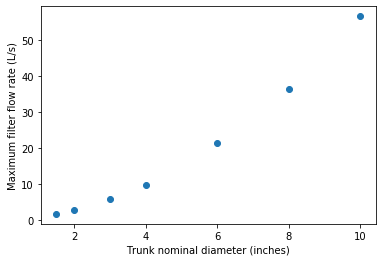

.. _title_Filtration_Design:

*******************
Filtration Design
*******************

1.  Calculate array of maximum filter flows given available trunk sizes and given constraint of maximum allowable head loss in the trunk line during backwash. Note that the outer inlet trunk minor loss coefficient is set (by adding a flow restriction at the inlet to the trunk line) to be 4 times the minor loss coefficient for the inner inlet trunks so that during filtration they have the same head loss when the outer trunks have 1/2 the flow of the inner trunks.
1.  Select the trunk size that gives a number of filters equal to or less than the minimum number of filters required for operation and maintenance.
1.  Calculate filter flow given minimum number of filters
1.  Calculate the orifice head loss required to provide uniform flow to the sand bed during backwash. This is based on the required ratio of port to manifold velocity (see equation :eq:`Manifold_max_v_no_hl_series`).
1.  Design the branches based on manifold flow distribution requirements
1.  Set the siphon drain time (assuming no inflow!) to equal the time required to refill the filter box after backwash.
1.  Design the siphon pipe given the constraint on drain time
1.  Design the siphon air valve given volume of air in the siphon
1.  Calculate all elevations
1.  Design backwash flow control weirs

Potential Changes to the Filter Design
======================================

* Have the siphon manifold exit straight through the side of the filter (perhaps in line with the other inlets and outlets) and then elbow up to the required elevation and elbow and Tee back down again. This would make the siphon install inside the filter be a single straight pipe instead of the large assembly that is currently used. This will have the additional advantage that the connection between this drain manifold and the pipe stub in the wall doesn't have to be leak tight! The connection could be a wrap of stainless steel and two hose clamps.
* Switch to gravity exclusion zones that include orifices to get uniform flow distribution without risk of sand scour.
* Simplest design to fabricate will have identical trunk lines for all inlets
* Change the inlet and outlet boxes so that all of the inlet trunks have only one elbow
* Outlet trunks each have 2 elbows

Maximum Trunk Flows
===================

The trunks are constrained to both provide similar flow to each filter layer and to provide similar flow to each branch within the sand bed. Providing the same flow to each filter layer during filtration is the key constraint that determines the size of the trunk lines. The most challenging flow distribution is between middle inlets that carry flow for two layers and the top and bottom inlets that carry flow for one sand layer. This flow distribution is ensured by making the head loss through the outer inlet trunks to be equal to the head loss through the inner inlet trunks when the outer inlet trunks have 1/2 the flow of the inner inlet trunks.

.. _figure_Filter_Max_Q_given_ND:

    The flows through the inlet trunks of stacked rapid sand filters are not identical and this requires a careful hydraulic design.

The flow distribution within the filter bed to ensure complete fluidization of the sand bed during backwash can be achieved by increasing the head loss through the flow control orifices in the branches. Calculating this required head loss is the second step in designing the filter inlet piping.
