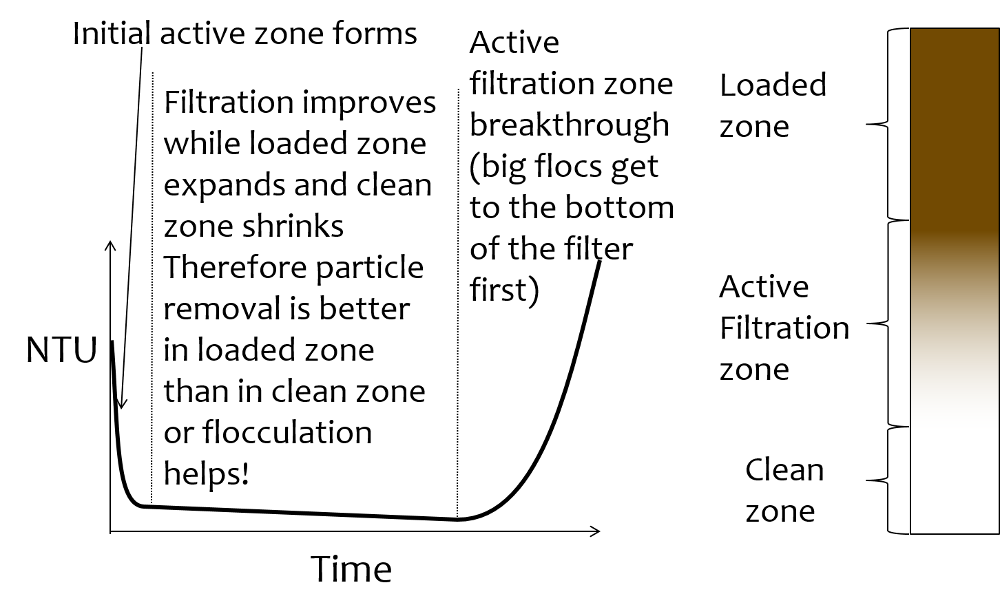
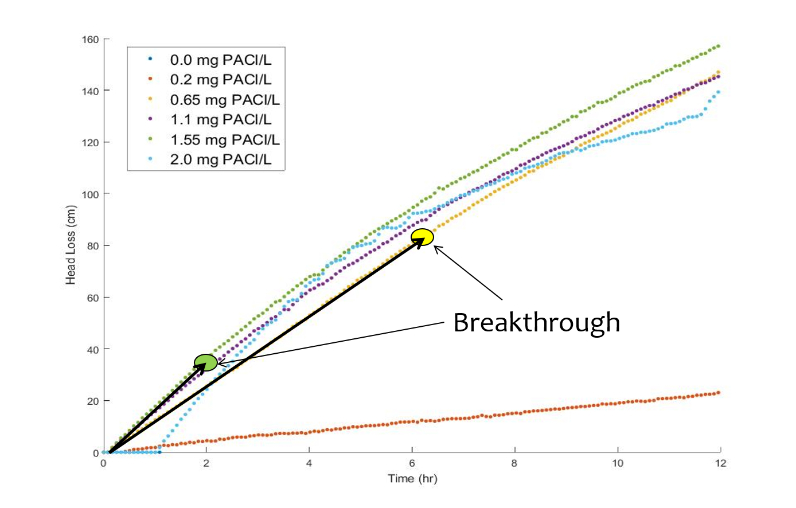
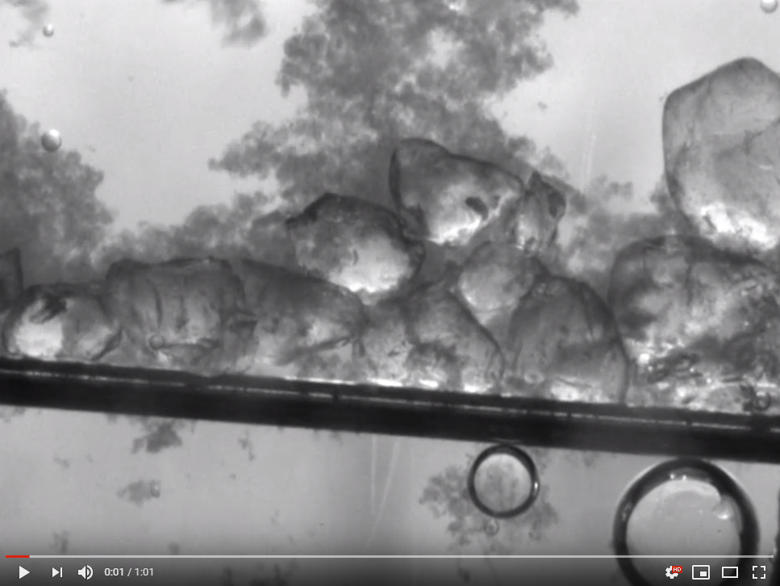
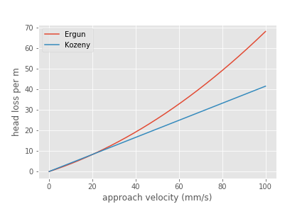
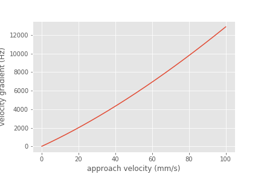

.. raw:: html

    <embed>
       <link rel="canonical" href="https://aguaclara.github.io/Textbook/Filtration/Filtration_Theory_and_Future_Work.html" />
       
    </embed>

.. _title_Filtration_Theory_and_Future_Work:

*********************************
Filtration Theory and Future Work
*********************************

Filters are used to remove particles and thus we'd like to be able to predict particle removal efficiency in a filter. Unfortunately we don't yet have equations that describe particle removal by sand filtration. This is a very unpleasant surprise. It is as if we were designing a suspension bridge and didn't have any equations describing the relationship between the tension in the cables and the load they are supporting. We only have an equation describing what the cables do when there isn't any additional load. In the case of filtration we only have clean bed filtration models that attempt to describe what happens before the filter begins to remove particles.

Reflection: How did we get to 2019 without a model for filter performance? There may be several reasons for the lack of a filtration model. Here are a few ideas:
 - The lack of data acquisition systems in university laboratories means that very few rapid sand filters were operated and evaluated for full filter runs in laboratory settings.
 - The Environmental Engineering fixation on jar tests as the way to model water treatment plants provided no method to test filtration and thus most university laboratories only experimented with batch operation and not continuous flow.
 - Filtration models were borrowed from air filtration (`Yao et al, 1971 <https://pubs.acs.org/doi/abs/10.1021/es60058a005>`_) and thus did not take into account that the coagulant nanoparticles made particle attachment to surfaces very favorable.
 - Filtration models only modeled the clean bed phase (the first few minutes of a filter run) before particles were deposited and began altering the geometry of the pores.

Clean bed filtration models include an equation first presented by Iwasaki in 1937 that suggested that particle removal occurred as a first order process with respect to depth. This simplifies to

.. math::
  :label: filter_Iwasaki

    pC^* \propto \frac{L}{D_{sand}}

where L is the depth of the sand in the column. This suggests that increasing the depth of sand in a filter would dramatically improve performance.

It is quite amazing that we have no useful models for sand filter performance after more than a century of using sand filters as a required process in converting surface waters into safe drinking water. Fortunately we have plenty of clues suggesting what is happening inside filters and at the level of the particles traveling through the pores.

The movie in :numref:`figure_Active_zone_model` illustrates that the classic performance of a rapid sand filter as a function of time could be explained by the presence of an active filtration zone that slowly progresses down through the filter as the pores become fully loaded. But that begs the question of what determines "fully loaded."

.. _figure_Active_zone_model:

   Movie illustrating how effluent turbidity connects to deposition of particles within a sand bed.

The linear increase in head loss with time (see :numref:`figure_Head_loss_vs_time`) is a remarkable and surprising property of depth filtration. The deposition of particles in a pore would change the flow geometry, increase the flow velocity, and increase the head loss across the pore. As each particle is deposited in the pore it would be expected to have an increasing impact on head loss as the flow area is decreased and the flow velocity increases.  Head loss due to the flow expansion downstream from the flow constriction is proportional to the velocity squared. Thus we would not expect head loss across a pore to increase linearly with time.

.. _figure_Head_loss_vs_time:

   Head loss through a filter increases linearly with time under conditions of constant influent turbidity.

The data is trying to tell us something. The head loss through a filter does increase linearly with time and with the amount of solids that have been captured by the filter. Our hypothesis is that the number of fully loaded pores is increasing linearly with time. To understand how this might be working we need to delve into the filter and imagine what must be happening in the pores as particles are flowing by.

:numref:`figure_Deposition_at_constrictions` illustrates that particles that are carried by the fluid can come into contact with the walls of the pores where the streamlines converge. Clean bed filtration models predict that this process of interception is significant even for clean beds. As a pore begins to fill due to particle deposition, the flow constriction becomes even more severe and thus the capture efficiency increases. This would suggest that a pore would rapidly fill with flocs until it became so clogged that the flow of water through the pore effectively stopped.

.. _figure_Deposition_at_constrictions:

.. figure:: ../Images/Deposition_at_constrictions.png
   :target: https://youtu.be/Odp6uwqJmMc
   :width: 300px
   :align: center

   Movie illustrating that particles are transported closer to sand surfaces where streamlines converge.

If pores clogged completely, then sand filters would clog as soon as one layer of pores was filled. There must be another process that is preventing pores from clogging. We hypothesize that flocs can't attach to the filter surfaces when the fluid drag on the floc exceeds the strength of the bonds between the coagulant nanoparticles and the particle and pore surfaces. Thus as pores grow smaller due to deposition it becomes more difficult for incoming flocs to attach. Instead, the flocs are shoved right through the pore even if it means the floc has to undergo significant deformation to squeeze through.

.. _figure_Flocs_teleporting:

   Movie showing flocs flowing through a pore created by sand grains. (Credit `Filter_Constrictions team Spring 2018 <https://github.com/AguaClara/filter-constrictions>`_)

The story is beginning to emerge. Converging streamlines result in flocs touching previously deposited particles in the flow constriction and attaching. As the flow constriction becomes even smaller the fluid drag on particles that attempt to attach to the pore becomes too great and the particles are forced through the constriction. At that point the pore is fully loaded. However, fully loaded does not mean that the void is full of flocs. It just means that the constriction is as small as it can get given the strength of the coagulant nanoparticle bonds and the fluid drag on the flocs.

Pores at the upstream end of the filter are fully loaded first and then remain relatively unchanged for the duration of the filter run. Thus the active filtration zone is pushed deeper into the filter bed. At any one time there are likely a series of pores that are partially loaded and thus actively filling. The number of pores in series that are actively filling is not yet known, but it is clear that the particle removal efficiency of a filter must be related to the number of actively filling pores in series.

The active filtration zone is progressing through the filter at a constant velocity. The number of fully loaded pores is increasing linearly with time! That is why head loss increases linearly with time.

The poor performance at the beginning of a filter run is because the clean zone isn't a good filter. This suggests that dual media filters are pointless because the smaller media at the downstream end of the filter remains clean and doesn't actually do anything. If this is correct, then multimedia filters can be replaced with a single larger media size.

As coagulant dose increases:
 - Flocs are larger and thus they fill the pores faster and thus the active zone moves faster through the filter.
 - Large flocs are removed more efficiently and thus the active zone is thinner (fewer active pores in series).
 - Thinner active zone results in faster failure (higher slope of turbidity vs time during failure).
 - Larger flocs results in faster failure (higher slope of turbidity vs time during failure).

As sand size increases:
 - There are fewer pores and thus fewer constrictions and thus less head loss at the end of the filter run.
 - Each constriction requires more particles to build and thus there is less head loss per mass of particles removed.

Particle Removal Efficiency
=============================

This is the multi-decade old question that challenges us to continue our research. What determines how many particles sneak through a water treatment plant? We've learned that flocculation runs out of steam because the primary particles only want to collide with other primary particles and thus they start taking forever to collide as they become scarce. The floc filter likely acts like a series of collectors (can't say it is like a filter because it doesn't have stationary constrictions). This would suggest that more floc filter is always better. Some primary particles make it through the floc filter. What determines how many of those primary particles make it through the filter? It must depend on the geometry of every constriction. Large flocs are easy to capture in a sand filter. Primary particles are much more difficult to capture. Large flocs tend to fill up the first unfilled pore they come to. Thus large flocs tend to take active pores out of service. This suggests that the influent floc size distribution might influence filter performance. See :ref:`heading_Shear_big_flocs_to_improve_filter_performance` for an analysis of the feasibility of breaking up flocs at the point of injection into the sand bed.

Filtration Model
================

The filtration model is based on the insight that rapid sand filters have an active filtration zone that slowly progresses down through the filter as it fills to maximum capacity at the upstream end. A clean bed of sand is ineffective at capturing small particles as evidenced by the poor initial performance after backwash. Thus it is apparent that previously deposited particles play a key role in subsequent capture of particles.

Interception!
Flow constrictions - converging streamlines move particles closer to the pore wall. Previously deposited particles form constrictions. The constrictions are the most likely location for particles to collide with deposited particles. Thus particles do not fill the pores and clog the filter. Instead particles form constrictions where streamlines already converged.

Maximum shear sets a minimum constriction opening size!
As particles gradually deposit in an ever shrinking flow constriction, the velocity through the constriction increases and the velocity gradient at the wall increases. Eventually the bond strength of the coagulant nanoparticles is not great enough to capture suspended particles that collide with the deposited particles. The flow constriction reaches a minimum diameter and subsequent suspended flocs flow right through the constriction.

The gradual creation of more flow constrictions results in an almost linear increase in head loss as a function of the volume of deposited flocs.

.. _table_filter_hypotheses:

.. csv-table:: Hypotheses, evidence, and why it matters
   :header: #,Hypotheses, Evidence, Why it matters
   :widths: 2, 30, 15, 15
   :align: center

   1, Particle removal is primarily due to converging streamlines that move particles close to the sand surface or to previously deposited particles, Filtration theory and estimates of void volume occupied by particles, Basis for our filtration model
   2, The particle size distribution entering the filter is set by the plate settlers, Estimate of velocity gradient in inlet waterfall and in filter bed, High velocity injection would be required to reduce the floc size
   3, The jets that the constrictions create dissipate almost all of their energy in the downstream void BEFORE entering the next constriction, Laminar flow jets dissipate energy very quickly, Allows a simple relationship between pore head loss and constriction velocity
   4, Flocs are captured with VERY high efficiency and thus primary particle removal limits filter performance, Clean bed filtration models, Need to optimize filters for primary particle removal
   5, Constrictions form a continuous barrier across the filter at each sand grain layer, Any gaps would receive higher flow rate and thus higher flux of particles, Filter automatically prevents short circuiting
   6, The thickness of the deposit scales with the width of the ring or perhaps simply with the pore size or sand size, Thickness can't scale with diameter of the flocs because that would predict more total mass retained with increased coagulant dose, Required to predict head loss vs mass deposited.

.. _heading_Filter_Head_loss_model:

Filter Head Loss
=================

The maximum velocity in a constriction is set by the drag on a primary particle that is large enough to prevent the primary particle from attaching. Given that the constriction is likely sharp edged on the upstream face, the flow velocity is likely close to uniform at the entrance to the constriction. There is likely a *vena contracta* effect and that effect would prevent deposition of particles downstream of the leading edge of the constriction because particles are diverted away from the constriction walls.

The maximum constriction velocity is thus likely independent of the filtration velocity and pore size. The maximum velocity at the inlet to the constrictions is likely proportional to the fractional surface coverage of the primary particles by coagulant nanoparticles. Thus as the coagulant dose increases the head loss per pore and the head loss at the time of particle breakthrough increases.

.. math::
  :label: eq_headloss_constriction

    h_{l_{constriction}} = \frac{\bar v_{constriction}^2}{2g}

The maximum drag that a primary particle can
 - Need to connect velocity to drag.
 - Use experimental data from filtration to find critical velocity.
 - Expect velocity to be independent of pore size (sand size).
 - Create model for total head loss in a filter as a function of sand size.
 - Need a connection between pore size and volume of particles it can hold.

The average distance between sand grains in a filter bed is obtained by taking the cube root of the total volume occupied by a sand grain including the pore space. We also assume that there is a one-to-one correspondence between pores and sand grains and thus the distance between pores is the same as the distance between sand grains.

.. math::

   \Lambda_{sand} = \Lambda_{pore} = \left(\frac{\pi}{6(1-\phi)} \right)^\frac{1}{3}D_{sand}

The flow rate per pore is the approach velocity multiplied by :math:`\Lambda^2`.

.. math::

     Q_{pore} = v_a \Lambda_{pore}^2

The velocity through a constriction in a pore is

.. math::

     Q_{pore} = v_a \Lambda_{pore}^2 = \frac{\pi}{4} D_{constriction}^2v_{constriction}

The constriction diameter is thus given by

.. math::
  :label: eq_D_constriction

    D_{constriction} = \Lambda_{pore} \sqrt\frac{4 v_a}{\pi v_{constriction}}

The Reynolds number of the jet issuing from the constriction is obtained by using Equation :eq:`eq_D_constriction` to eliminate the dependence on diameter.

.. math::
  :label: eq_Re_constriction

    Re_{jet} = \frac{\Lambda_{pore} }{\nu }\sqrt\frac{4 v_a v_{constriction}}{\pi }

The jet issuing from the constrictions is laminar for Reynolds numbers below 500 (`see Ungate et al., 1975 page 13 <https://dspace.mit.edu/handle/1721.1/27517>`_).  The constriction is likely a relatively thin (washer-like) deposit and thus the flow through the constriction is likely close to uniform. In order to estimate the head loss in the flow expansion that occurs after the constriction we need to understand how much the flow expands. The flow expansion may be limited by the geometry of the pores or it might be limited by the rate at which laminar flow jets expand. We don't have a way to know which constraint will set the expansion and thus we need to calculate the expansion rate for a laminar jet to see if that expansion could occur given the pore geometry.

The rate of jet expansion can be obtained from an analytical solution of the Navier Stokes equation as shown by `Pai, S.I., Fluid dynamics of jets. (D. Van Nostrand Company, Inc., Princeton, NJ, 1954 (pages 78-79) <https://babel.hathitrust.org/cgi/pt?id=mdp.39015000450273;view=1up;seq=99>`_

The momentum in the direction of flow is conserved and is given by

.. math::

    M_0 = 2 \pi \rho \int_{0}^{\infty} u^2 r dr

For the case of uniform velocity through the constriction we can replace :math:`\infty` with :math:`r_{constriction}`

.. math::

    M_0 = 2 \pi \rho v_{constriction}^2 \int_{0}^{r_{constriction}}  r dr

.. math::

    M_0 = \pi \rho v_{constriction}^2 r_{constriction}^2 = \rho Q_{pore}v_{constriction}

The velocity in the direction of the jet is given by (equation 4.39 in `Pai, 1954 <https://babel.hathitrust.org/cgi/pt?id=mdp.39015000450273;view=1up;seq=99>`_)

.. math::

    u = \frac{3M_0}{8\pi \mu} \frac{1}{x} \frac{1}{\left[1+(\frac{\zeta_{jet}^2}{4})\right]^2}

.. math::

   \zeta_{jet} = \frac{1}{4\nu} \left(\frac{3M_0}{\pi\rho}\right)^{\frac{1}{2}} \frac{r}{x}

and thus :math:`\zeta` is zero at the centerline.  We will use the centerline velocity at distance :math:`\Lambda_{pore}` from the constriction to estimate the head loss caused by one constriction.

.. math::

    v_{exp} = \frac{3\rho Q_{pore}v_{constriction}}{8\pi \mu \Lambda_{pore}}

We can substitute for :math:`Q_{pore}` to obtain

.. math::

    v_{exp} =  \frac{3 v_a \Lambda_{pore} }{8\pi \nu }v_{constriction}

We can use mass conservation and the equation for :math:`Q_{pore}` to replace :math:`v_a` with :math:`v_{constriction}`

.. math::

    v_{exp} =  \frac{3}{32}\frac{D_{constriction}}{\Lambda_{pore}}Re_{jet}v_{constriction}

It isn't yet clear if this always means that :math:`v_{exp}` will be very small compared with :math:`v_{constriction}`, but that seems to be the logical conclusion. Thus when calculating the head loss for a pore it is reasonable to assume that the kinetic energy of the jet is all lost before entering the next constriction.

Clarification Impacts
======================

The characteristic floc size could be set by the plate settlers that preferentially remove large flocs or it could be set by any of the high shear events on the path to or through the filter. We will estimate floc size from each of the potential shear and terminal velocity events. The calculations are done in
:ref:`python below <heading_floc_size_and_velocity_gradient_calculations>`.

The floc diameter that is not completely captured by plate settlers with a capture velocity of 0.12 mm/s (the capture velocity used by AguaClara) is 25 :math:`\mu m`.

Velocity Gradient
------------------

Almost all of the kinetic energy of the jet issuing from the constriction is dissipated in the downstream pore. We will assume that the majority of the head loss is due to the jet (rather than wall shear). The volume of a pore is given by

.. math::

   \rlap{-} V_{pore} = \phi\Lambda_{pore}^3

The hydraulic residence time in a pore is obtained from the volume and flow rate through a pore.

.. math::

   \theta_{pore} = \frac{\rlap{-} V_{pore}}{Q_{pore}} = \frac{\phi\Lambda_{pore}^3}{v_a \Lambda_{pore}^2} = \frac{\phi\Lambda_{pore}}{v_a}

The Camp Stein velocity gradient in a pore is obtained by assuming that all of the input kinetic energy is dissipated through viscosity during the time that the water spends in the pore.

.. math::

    G_{CS} = \sqrt{\frac{gh_{\rm{L}}}{\nu \theta}}

The head loss in the pore is from the jet kinetic energy. Substitute the equations for pore volume, residence time, and head loss to obtain the fundamental equation for the velocity gradient in a pore.

.. math::

    G_{CS} =\bar v_{constriction} \sqrt{\frac{ v_a}{2\nu \phi\Lambda_{pore}}}

The estimated value of this velocity gradient is *300 Hz*.

We need to compare the constricted jet velocity gradient with the clean bed injection velocity gradient that occurs due to the fact that the approach velocity at the point of flow injection in StaRS filters is much higher than the average approach velocity. The flow injection area is approximately 2.5 cm wide and serves an effective filter area (up and down!) of 20 cm (spacing between injection points is 10 cm.). Thus the approach velocity in current StaRS filters is 14.6 mm/s and the corresponding Camp Stein velocity gradient is *1440 Hz*.

EstaRS filters have water falls from the filter inlet channel to inlet box. In recent designs the water flows through a narrow slot and then falls into the inlet box. The slot is about 3.4 cm wide and the water falls about 40 cm. The vertical velocity after dropping 40 cm is 2.8 m/s. The geometry of this water fall is complicated and we will assume the resulting jet is circular at impact with the water surface. The diameter of the jet is thus obtained from continuity and is equal to 9.5 cm.  Now we use the energy dissipation rate of a round jet to obtain *4300 Hz*. Thus the floc size could be set by the water fall in the inlet box since this is the highest velocity gradient on the path into and through the filter. However, our rough estimate based on wild extrapolation suggests that this would yield a 36 :math:`\mu m` diameter floc. This is larger than the flocs produced by the clarifier plate settlers and thus it is possible that even with this waterfall, that the floc size distribution is set by the clarifier plate settlers.

Note that the water fall height diminishes during a filter run as the water level in the inlet box increases due to head loss through the filter. Thus it is likely that the waterfall doesn't significantly break flocs.

Constriction Velocity
======================

`Be sure to run the import code before trying any of the code examples linked in this section <https://colab.research.google.com/drive/15IrqdHgnk3NZVTiIuhQc6YdwFgquIHD1#scrollTo=iraCMmqY4sT2&line=1&uniqifier=1>`_

The maximum velocity in a pore is set by the strength of the coagulant bonds and the size of the core particles that are being captured by the filter. The drag force on the core particle must be balanced by the chemical bond strength and that relationship is given by Equation :eq:`Fbond_of_v_constriction`.

The minimum diameter of a particle deposition constriction is set by the maximum constriction velocity, :math:`v_{constriction_{max}}`.

.. math::
  :label: eq_D_constriction_min

    D_{constriction_{min}} = \Lambda_{pore} \sqrt\frac{4 v_a}{\pi v_{constriction_{max}}}

The head loss through a flow constriction can be estimated from the head loss through a flow expansion. We will use the form of the expansion Equation :eq:`eq_exp_v_in` that is based on the contraction velocity. The jet is assumed to expand sufficiently so that the residual kinetic energy is insignificant.

.. math::
  :label: eq_exp_v_constriction

     h_{e_{constriction}} =  \frac{\bar v_{constriction_{max}}^2}{2g}

The number of deposited constrictions per unit depth in a filter is

.. math::

    N_{constrictions_{series}} = \frac{H_{filter}}{\Lambda_{pore}}

The total head loss in a filter if taken to the point where the active filtration zone exited the filter and all pores were constricted would be

.. math::
  :label: eq_he_filter

    h_{e_{filter_{max}}} = \frac{H_{filter}}{\Lambda_{pore}}  \frac{\bar v_{constriction_{max}}^2}{2g}

The effect of increasing the pore size on terminal head loss is to decrease the *final* head loss when the active zone reaches the bottom of the filter because of the effect of :math:`\Lambda_{pore}`in the first term of Equation :eq:`eq_he_filter`. Note that this does not yet address the rate of head loss accumulation which is expected to be a function of sand grain diameter.

We can solve Equation :eq:`eq_he_filter` for maximum constriction velocity based on experimental measurements of the head loss at filter failure that is due to constrictions. Note that this head loss does NOT include the clean bed head loss.

.. math::
  :label: eq_he_filter2

    v_{constriction_{max}} = \sqrt{ \frac{2g\Lambda_{pore}}{H_{filter}}h_{e_{filter_{max}}}}

From :numref:`figure_Head_loss_vs_time` we have an estimate of 80 cm of head loss through a 20 cm bed of 0.5 mm diameter sand. This gives an estimate of 163 mm/s for the constriction velocity. This can be combined with Equation :eq:`Fbond_of_v_constriction` to estimate the coagulant bond strength to be 3.9 nN.

.. _heading_Shear_big_flocs_to_improve_filter_performance:

Shear Big Flocs
================

Here we explore the possibility of breaking flocs as they enter the filter bed to eliminate large flocs that may be reducing filter performance.

Primary particles have the lowest probability of hitting the wall in a constriction. Thus primary particles can travel the greatest distance through the active zone and still have a very small chance of being deposited near the end of the active zone. Thus it is possible that primary particles set the maximum length of the active zone and flocs tend to fill in the active zone at the upstream end. The larger the floc the more likely it will fill in an upstream constriction and thus shorten the active zone.

This suggests that one way to improve filter performance is to have a zone of very high shear that rips flocs apart so that they don't fill in the upstream pores in the active zone so quickly. This is because smaller flocs will not be removed as efficiently by each constriction and thus they will penetrate deeper into the active zone. One possible method to create a high shear zone is to size the flow injection area to achieve high shear through the first sand grains. The idea is to shred incoming flocs so they have a lower probability of being removed per pore and thus more of these small flocs penetrate deeper into the active filtration zone before being captured. Smaller flocs are also more dense and thus don't fill up the available volume in the constrictions as fast as the large flocs that they came from.

We need an estimate of the shear through the first pores as the water enters the sand. The Kozeny equation is valid up to a particle Reynolds number of 1 (:eq:`eq_Re_porous_media`). The Reynolds number at this proposed flow injection site will be much larger than 1 and thus the Ergun equation (:eq:`eq_Ergun`) that is valid for laminar and turbulent flow in porous media will be used.

We will use the Camp Stein velocity gradient to estimate injection velocity required to create very small flocs. The important parameter for floc break up is a force that can be obtained from the velocity gradient multiplied by the dynamic viscosity.

Solving :eq:`eq_G_CS_porous_media` for the approach velocity, :math:`v_a`, we obtain

.. math::

    v_a = \left( G_{CS}^2 \frac{2\nu D_{sand}}{f_{\phi}} \frac{\phi^4}{(1-\phi)} \right)^{\frac{1}{3}}

to estimate the injection area that should be used to break up flocs entering the sand bed.

.. _heading_floc_size_and_velocity_gradient_calculations:

Floc Size Calculations
=======================

`The code to make a figure showing the relationship between approach velocity and headloss can be found here. <https://colab.research.google.com/drive/15IrqdHgnk3NZVTiIuhQc6YdwFgquIHD1#scrollTo=Mlv81ZYLi1Gc&line=25&uniqifier=1>`_

.. _figure_Head_loss_Ergun_and_Kozeny:

   The Ergun and Kozeny equations are very similar even at approach velocities that are much larger than are used in rapid sand filtration. At very high velocities the turbulent term in the Ergun equation begins to be significant.

`The code for the following graph is found here. <https://colab.research.google.com/drive/15IrqdHgnk3NZVTiIuhQc6YdwFgquIHD1#scrollTo=g4nn81gGi9aS&line=3&uniqifier=1>`_

.. _figure_G_vs_approach_velocity:

   The Camp Stein velocity gradient increases rapidly with approach velocity.

`See here for how the injection port width and injection velocity are determined. <https://colab.research.google.com/drive/15IrqdHgnk3NZVTiIuhQc6YdwFgquIHD1#scrollTo=KqQCyZaZjBJm&line=3&uniqifier=1>`_

The analysis above suggests that the approach velocity required to break flocs down to a dimension of :math:`20 \mu m` is approximately 80 mm/s. This is based on a VERY bad guesstimate of the relationship between floc size and shear.

We need to know how much energy would be expended to force the water through this high velocity injection zone. Once the water enters the sand it will spread radially in all directions. As the water spreads it will slow down and the head loss per distance traveled will decrease. We need to integrate this head loss over the first few centimeters to get an estimate of the injection head loss.

The velocity at distance r from the center of the injection line can be calculated from the velocity at :math:`r_0` by continuity.

.. math::

    v_{a_r} r= v_{a_{r_0}} r_0

.. math::

    v_{a_r}= v_{a_{r_0}} \frac{r_0}{r}

.. math::

    dh_f= \frac{dr}{2g D_{sand}} \left( 300 \frac{\nu (1-\phi)^2}{D_{sand} \phi^3}v_a  + 3.5 \frac{ (1-\phi) }{\phi^3}v_a^2 \right)

Now substitute for the approach velocity

.. math::

   \frac{dh_f}{dr}= \frac{1}{2g D_{sand}} \left[ 300 \frac{\nu (1-\phi)^2}{D_{sand} \phi^3}\left(v_{a_{r_0}} \frac{r_0}{r}\right)  + 3.5 \frac{ (1-\phi) }{\phi^3} \left(v_{a_{r_0}} \frac{r_0}{r}\right)^2 \right]

.. math::

    dh_f= \frac{v_{a_{r_0}}r_0}{2g D_{sand}} \left[ 300 \frac{\nu (1-\phi)^2}{D_{sand} \phi^3}\left( \frac{1}{r}\right)  + 3.5 \frac{ (1-\phi)v_{a_{r_0}}r_0 }{\phi^3} \left( \frac{1}{r}\right)^2 \right] dr

We will create terms to make the integration easier

.. math::

    a_0 = \frac{v_{a_{r_0}}r_0}{2g D_{sand}}

.. math::

    a_1 = 300 \frac{\nu (1-\phi)^2}{D_{sand} \phi^3}

.. math::

    a_2 = 3.5 \frac{ (1-\phi)v_{a_{r_0}}r_0 }{\phi^3}

Now we set up the numerical integration and integrate from the injection site to the radius where the velocity is equal to the filtration velocity.

`For an inlet that service two layers, see here to determine the head loss through the sand <https://colab.research.google.com/drive/15IrqdHgnk3NZVTiIuhQc6YdwFgquIHD1#scrollTo=PF8v34hSjJtx&line=11&uniqifier=1>`_

The analysis above suggests that a high velocity and high velocity gradient injection into the sand bed with the goal of breaking flocs into pieces that are 20 :math:`\mu m` in diameter would require about 12 cm of head loss. This is based on the assumption that the water would be able to flow radially from the injection point and thus rapidly slow down. Thus the head loss rapidly decreases with distance from the injection point.

This is an experiment worth trying. It will help us understand if large flocs result in poorer filter performance.

Floc Volume
============

The volume of solids deposited in one pore can be obtained based on the average diameter of clean pore constrictions, the diameter of the constricted pore after solids deposition, and the thickness of the deposit. We already have an estimate for the diameter of the constricted pore after solids deposition. The thickness of the deposit must be proportional to some other length scale. We initially hypothesized that the thickness of the deposit scaled with the diameter of the flocs that make it up. That led to the conclusion that increased coagulant dose would increase the total mass of solids that could be retained by the filter before breakthrough. That doesn't match experimental data and thus we now propose that the average thickness of the deposit scales with the sand grain size, or pore size, or pore separation distance. We will use the pore separation distance as our scaling parameter.

There are several options for estimating the areal extent of the constriction. We already have an estimate of the inner diameter of the constriction and thus all we need is an estimate of the outer extent of the deposited constriction.  One option would be to take the area of a circle defined by 3 spheres coming close together. That is a clear underestimate because the constriction must extend into the gaps between the spheres. A second option would be to use the porosity to estimate the average plane view area of the pores. If we assume that the pore must connect vertically and thus has a height :math:`\Lambda_{pore}`, then the plane view area is given by

.. math::

    A_{pore} = \phi\Lambda_{pore}^2

The area of the deposit is obtained by subtracting the constriction opening from the previous equation.

.. math::

    A_{deposit} = \Lambda_{pore}^2\left(\phi-\frac{v_a}{ v_{constriction}} \right)

The volume of the deposit is thus

.. math::

   \rlap{-} V_{deposit} = \Pi_{pore}^{deposit}\Lambda_{pore}^3\left(\phi-\frac{v_a}{ v_{constriction}} \right)

where :math:`\Pi_{pore}^{deposit}` a number much less than 1 that represents the fixed ratio between the thickness of the deposit and the pore separation distance.

The head loss per volume of particles deposited can be obtained by dividing the head loss per pore by the volume of particles per pore.

.. math::

    h_{l_{per_{deposit}}} = \frac{\bar v_{constriction}^2}{2g\Pi_{pore}^{deposit}\Lambda_{pore}^3\left(\phi-\frac{v_a}{ v_{constriction}} \right)}

If the primary goal for filter design were to decrease head loss per volume of solids deposited, then selecting larger sand (increasing :math:`\Lambda_{pore}`) would be the clear strategy. Increasing the sand diameter by a factor of two should decrease the head loss by a factor of 8. Increasing the approach velocity :math:`v_a`, results in a small increase in the head loss per volume of deposited material.

We need a method to connect turbidity removed by a filter into volume of deposited flocs. We will make this connection by first assuming that the flocs have a characteristic size based on a high shear event on their way into the filter. We begin with the relationship between the number of clay particles in a floc and the floc diameter.

.. math::

    D_{floc} = D_{clay} n_{clay}^\frac{1}{\Pi_{fractal}}

Where :math:`\Pi_{fractal}` is the volume based fractal dimension of a floc. We estimate :math:`\Pi_{fractal}` to have a value of 2.1. We can rearrange this equation and solve for the number of clay particles in a floc.

.. math::

    n_{clay} = \left(\frac{D_{floc}}{D_{clay}}\right)^{\Pi_{fractal}}

Now we can create a relationship for the concentration of clay in a floc dividing the mass of clay by the volume of the floc.

.. math::

    C_{clay_{floc}} = \frac{n_{clay}\rlap{-} V_{clay}\rho_{clay}}{\rlap{-} V_{floc}} = \frac{n_{clay}D_{clay}^3\rho_{clay}}{D_{floc}^3}= \frac{D_{clay}^3\rho_{clay}}{D_{floc}^3}\left(\frac{D_{floc}}{D_{clay}}\right)^{\Pi_{fractal}}

With one more simplification we obtain the desired equation for the clay concentration in a floc of given diameter.

.. math::
    C_{clay_{floc}} = \rho_{clay} \left(\frac{D_{clay}}{D_{floc}}\right)^{3-\Pi_{fractal}}

The mass of clay per pore is obtained by multiplying the deposit volume by the concentration of the flocs.

.. math::

    M_{clay_{pore}} =\rho_{clay}  \Pi_{pore}^{deposit}\Lambda_{pore}^3\left(\phi-\frac{v_a}{ v_{constriction}} \right)\left(\frac{D_{clay}}{D_{floc}}\right)^{3-\Pi_{fractal}}

The mass of clay per plan view area of the filter is obtained by multiplying by the number of pores per depth of the filter and dividing by the plan view area of a pore, :math:`\Lambda_{pore}^2`.

.. math::

    M_{clay_{filter}} =H_{filter} \rho_{clay}  \Pi_{pore}^{deposit}\left(\phi-\frac{v_a}{ v_{constriction}} \right)\left(\frac{D_{clay}}{D_{floc}}\right)^{3-\Pi_{fractal}}

According to this model, the mass of clay that can be held by a filter increases linearly with filter depth. The retained mass is independent of the sand size. This is an easy hypothesis to test. Note, however, that this model does not account for the depth of the active zone. Presumably the active zone depth may be greater for larger diameter media and thus breakthrough may occur sooner for larger diameter media.

If coagulant dose increases it will have two effects. The primary particle attachment strength will increase, the constricted velocity will increase, and the mass retained will increase. The size of the flocs will also increase and that will result in a slight decrease in the retained mass.

Thus it isn't immediately clear how changing the coagulant dose will change the maximum mass of retained particles. The evidence from the AguaClara filter theory team is that the mass of clay retained decreases as the coagulant dose increases.

The head loss per mass of particles deposited can be obtained by dividing the head loss per pore by the mass per pore.

.. math::

      h_{e_{permassclay}} = \frac{\bar v_{constriction_{max}}^2}{2g\rho_{clay}  \Pi_{pore}^{deposit}\Lambda_{pore}^3\left(\phi-\frac{v_a}{ v_{constriction}} \right)}\left(\frac{D_{floc}}{D_{clay}}\right)^{3-\Pi_{fractal}}

The head loss per mass of solids removed is significantly lower for larger sand sizes. When the coagulant dose increases the head loss increases rapidly because the constricted velocity increases and the floc diameter increases. Unfortunately we do not yet have a model describing floc size as a function of both velocity gradient and coagulant nanoparticle coverage.

Particle Removal Efficiency
===========================

Particle removal is complicated. We hypothesize that flocs form the deposits that change the flow from being wall shear dominated with a parabolic velocity profile to being uniform velocity flow through the constrictions. This uniform velocity profile transports a very small fraction of clay particles close enough to the deposit to be captured.

During filter ripening the particles that pass through the filter would be expected to be the primary particles because removal efficiency increases very rapidly with size. During the main part of the filter run the escaping particles are primary particles that weren't captured by the actively growing deposits. Breakthrough at the end of the filter run is caused by both primary particles and flocs.

The flocs form a series of actively growing deposits. The number of actively growing deposits in series is possibly a function of the average volume of the flocs (smaller flocs result in more active deposits) and the volume fraction of the flocs normalized by the volume fraction of the primary particles. If this dimensionless volume fraction increases there may be more active deposits and hence improved removal of primary particles.

Proposed Experiments
=====================

 #. Compare different sizes of sand media. Expect to get poorer removal efficiency with larger sand sizes, similar mass of particles retained at breakthrough, and much lower head loss.
 #. dual media. expect to find less head loss and poorer performance than single small media. And expect the smaller media to not contribute anything.
 #. How small could the sand media be? We could get better filter performance if we used smaller sand. Shallow sand beds are apparently fine and if we used smaller diameter sand the filter layer depth could be reduced even more. Why not use a 0.2 mm sand and 5 cm sand layers? If we offset the inlet and outlet branches (with branches spaced on 10 cm centers and inlet and outlet branches offset by 5 cm) there would still be a significant path length.
 #. Floc amendment. We could add floc hopper particles to the filter to increase the ratio of flocs to primary particles. Presumably this would reduce effluent turbidity IF there aren't many primary particles in the floc hopper. We could compare the prospects of using smaller sand grains vs adding floc amendment as strategies to get higher performing filters.
 #. Now that we know that sand doesn't remove clay without the help of flocs, could we invent a filter that could capture clay and other primary particles without requiring ripening? We need a filter media that has sharp edges or sudden constrictions that create high velocity near the edge. Washers with holes the size of constrictions aren't available.
