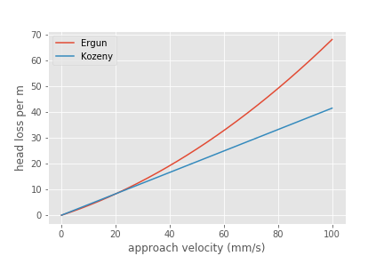

.. _title_Filtration_Theory_and_Future_Work:

*********************************
Filtration Theory and Future Work
*********************************

Filtration model
================

The filtration model is based on the insight that rapid sand filters have an active filtration zone that slowly progresses down through the filter as the active zone fills to maximum capacity at the upstream end. A clean bed of sand is ineffective at capturing small particles as evidenced by the poor initial performance after backwash. Thus it is apparently that previously deposited particles play a key role in subsequent capture of particles.

Interception!
Flow constrictions - converging streamlines move particles closer to the pore wall. Previously deposited particles form constrictions. The constrictions are the most likely location for particles to collide with deposited particles.

Maximum shear sets a minimum constriction opening size!
As particles gradually deposit in an ever shrinking flow constriction the velocity through the constriction increases and the velocity gradient at the wall increases. Eventually the bond strength of the coagulant nanoparticles is not great enough to capture suspended particles that collide with the deposited particles. The flow constriction reaches a minimum diameter and subsequent suspended flocs flow right through the constriction.

The gradual creation of more flow constrictions results in an almost linear increase in head loss as a function of the volume of deposited flocs.

.. _heading_Filter_Head_loss_model:

Filter Head loss model
======================

The maximum velocity in a constriction is set by the drag on a primary particle that is large enough to prevent the primary particle from attaching. Given that the constriction is likely sharp edged on the upstream face the flow velocity is likely close to uniform at the entrance to the constriction. There is likely a vena contracta effect and that effect would prevent deposition of particles downstream of the leading edge of the constriction because particles are diverted away from the constriction walls.

The maximum constriction velocity is thus likely independent of the filtration velocity and pore size. The maximum velocity at the inlet to the constrictions is likely proportional to the fractional surface coverage of the primary particles by coagulant nanoparticles. Thus as the coagulant dose increases the head loss per pore and the head loss at the time of particle breakthrough increases.

.. math::
    :label: eq_headloss_constriction

    h_{l_{constriction}} = \frac{\bar v_{constriction}^2}{2g}

The maximum drag that a primary particle can
 - need to connect velocity to drag
 - Use experimental data from filtration to find critical velocity
 - expect velocity to be independent of pore size (sand size)
 - Create model for total head loss in a filter as a function of sand size
 - Need a connection between pore size and volume of particles it can hold.

The average distance between sand grains in a filter bed is obtained by taking the cube root of the total volume occupied by a sand grain including the pore space. We also assume that there is a one-to-one correspondence between pores and sand grains and thus the distance between pores is the same as the distance between sand grains.

.. math::

    \Lambda_{sand} = \Lambda_{pore} = \left(\frac{\pi}{6(1-\phi)} \right)^\frac{1}{3}D_{sand}

The flow rate per pore is the approach velocity multiplied by :math:`\Lambda^2`.

.. math::

     Q_{pore} = v_a \Lambda_{pore}^2

The velocity through a constriction in a pore is

.. math::

     Q_{pore} = v_a \Lambda_{pore}^2 = \frac{\pi}{4} D_{constriction}^2v_{constriction}

The constriction diameter is thus given by

.. math::
    :label: eq_D_constriction

    D_{constriction} = \Lambda_{pore} \sqrt\frac{4 v_a}{\pi v_{constriction}}

The Reynolds number of the jet issuing from the constriction is obtained by using equation :eq:`eq_D_constriction` to eliminate the dependence on diameter.

.. math::
    :label: eq_Re_constriction

    Re_{jet} = \frac{\Lambda_{pore} }{\nu }\sqrt\frac{4 v_a v_{constriction}}{\pi }

.. code:: python

    from aide_design.play import*
    D_sand = 0.5 * u.mm
    porosity = 0.4
    Temperature = 20 * u.degC
    v_a = 1.85 *u.mm/u.s
    he_filter = 40 * u.cm
    H_filter = 20 * u.cm
    Lambda_pore = (np.pi/(6*(1-porosity)))**(1/3)*D_sand
    Lambda_pore
    v_constriction = (np.sqrt(2*pc.gravity*Lambda_pore*he_filter/H_filter)).to(u.mm/u.s)
    v_constriction
    Re_constriction =(Lambda_pore/pc.viscosity_kinematic(Temperature) * np.sqrt(4*v_a*v_constriction/np.pi)).to(u.dimensionless)
    Re_constriction

The maximum velocity in a pore is hypothesized to be set by the bond strength of the coagulant nanoparticles and the fluid drag on the primary particle that is attaching. It is assumed that the last particles that are able to deposit in a pore are primary particles because they can fill in the last available volume before the pore velocity is too high for any other particles to attach. It is possible that the attachment strength of the primary particles is a function of the fraction of their surface area that is covered by coagulant nanoparticles, :math:`\Gamma`. The total force acting downward on a primary particle that attaches to a constriction is the sum of the drag and the particle buoyant weight. These forces are counteracted by the force of the coagulant bonds.

.. math::

    F_{coag_{bonds}} = F_{drag} + F_{weight} - F_{buoyancy}

The drag force on a clay particle that has attached to the

.. math::

    F_{drag} = C_D \frac{\pi}{4} D_{clay}^2 \rho_{H_2O} \frac{v_{constriction}^2}{2}

At Reynolds numbers (based on primary particle diameter) less than about 10 the drag coefficient is given by

.. math::

    C_D = \frac{24}{Re} = \frac{24\nu}{v_{constriction}D_{clay}}

Thus the drag on a clay particle is given by

.. math::

    F_{drag} = 3\pi \nu v_{constriction} D_{clay} \rho_{H_2O}

.. math::

    F_{coag_{bonds}} = 3\pi \nu v_{constriction} D_{clay} \rho_{H_2O} + (\rho_{clay} - \rho_{H_2O}) g \frac{\pi}{6}D_{clay}^3

The drag force is assumed to be set by the average pore water velocity because the deposition occurs near the entrance to the constriction before the boundary layer on the wall can develop.

The force of the coagulant bonds is presumed to be proportional to the fractional coverage of the clay with coagulant and the intrinsic shear strength of the coagulant bonds to the clay surface

.. math::

    F_{coag_{bonds}} = \Gamma \tau_{bonds} \frac{\pi}{4} D_{clay}^2

where :math:`\tau_{bonds}` is the intrinsic shear strength of the coagulant bonds to the clay surface. Solving for the maximum constriction velocity we obtain

.. math::

    v_{constriction_{max}} = \frac{\Gamma \tau_{bonds}\frac{\pi}{4} D_{clay}^2 - (\rho_{clay} - \rho_{H_2O}) g \frac{\pi}{6}D_{clay}^3}{3\pi \nu  D_{clay} \rho_{H_2O}}

It is likely that the weight of the clay particle is a small contribution to the force balance. In that case the equation simplifies to

.. math::

    v_{constriction_{max}}  = \frac{\Gamma \tau_{bonds} D_{clay} }{12 \nu \rho_{H_2O}}

Unfortunately, we do not have a measure of the intrinsic bond strength of the coagulant nanoparticles to clay surfaces, :math:`\tau_{bonds}`. This equation does provide a possible means to back calculate this property.

The minimum diameter of a particle deposition constriction is set by the maximum constriction velocity, :math:`v_{constriction_{max}}`.

.. math::
    :label: eq_D_constriction_min

    D_{constriction_{min}} = \Lambda_{pore} \sqrt\frac{4 v_a}{\pi v_{constriction_{max}}}

The head loss through a flow constriction can be estimated from the head loss through a flow expansion. We will use the form of the expansion equation :eq:`eq_exp_v_in` that is based on the contraction velocity. The expanded dimension, :math:`D_{pore_{exp}}` is a maximum pore size, not the original pore size at the constriction before particles were deposited there.

.. math::
    :label: eq_exp_v_constriction

     h_{e_{constriction}} = \left( 1 - \frac{D_{constriction}^2}{D_{pore_{exp}}^2} \right)^2 \frac{\bar v_{constriction_{max}}^2}{2g}

The number of deposited constrictions per unit depth in a filter is

.. math::

    N_{constrictions_{series}} = \frac{H_{filter}}{\Lambda_{pore}}

The total head loss in a filter if taken to the point where the active filtration zone exited the filter and all pores were constricted would be

.. math::
   :label: eq_he_filter1

    h_{e_{filter_{max}}} = \frac{H_{filter}}{\Lambda_{pore}} \left( 1 - \frac{D_{constriction}^2}{D_{pore_{exp}}^2} \right)^2 \frac{\bar v_{constriction_{max}}^2}{2g}

The constriction diameter and the velocity in the constriction are related by equation :eq:`eq_D_constriction_min`. Eliminate

.. math::
    :label: eq_he_filter2

    h_{e_{filter_{max}}} = \frac{H_{filter}}{2g\Lambda_{pore}} \left( v_{constriction_{max}} - \frac{4 v_a \Lambda_{pore}^2 }{\pi  D_{pore_{exp}}^2} \right)^2

We haven't yet derived an equation relating :math:`D_{pore_{exp}}` and :math:`\Lambda_{pore}`. The expanded diameter of interest here is the characteristic diameter of the expanded flow. Given how close the

.. math::
    :label: eq_D_pore

    D_pore = D_sand

That ratio is a constant for porous media. Thus the squared term in equation :eq:`eq_he_filter2` is independent of sand grain size.

The effect of increasing the pore size on terminal head loss is to decrease the final head loss because of the effect of :math:`\Lambda_{pore}`in the first term of equation :eq:`eq_he_filter2`. Note that this does not yet address the rate of head loss accumulation which is expected to be a function of sand grain diameter.

We can solve equation :eq:`eq_he_filter2` for maximum constriction velocity based on experimental measurements of the head loss at filter failure.

.. math::
    :label: eq_he_filter2

    v_{constriction_{max}} = \frac{4 v_a \Lambda_{pore}^2 }{\pi  D_{pore}^2} + \sqrt{ \frac{2g\Lambda_{pore}}{H_{filter}}h_{e_{filter_{max}}}}

From :numref:`figure_Head_loss_vs_time` we have an estimate of 35 to 80 cm of head loss through a 20 cm bed of 0.5 mm diameter sand.

.. _heading_Shear_big_flocs_to_improve_filter_performance:

Shear big flocs to improve filter performance
=============================================

Here we explore the possibility of breaking flocs as they enter the filter bed to eliminate large flocs that may be reducing filter performance.

Primary particles have the lowest probability of hitting the wall in a constriction. Thus primary particles can travel the greatest distance through the active zone and still have a very small chance of being deposited near the end of the active zone. Thus it is possible that primary particles set the maximum length of the active zone and flocs tend to fill in the active zone at the upstream end. The larger the floc the more likely it will fill in an upstream constriction and thus shorten the active zone.

This suggests that one way to improve filter performance is to have a zone of very high shear that rips flocs apart so that they don't fill in the upstream pores in the active zone so quickly. This is because smaller flocs will not be removed as efficiently by each constriction and thus they will penetrate deeper into the active zone. One possible method to create a high shear zone is to size the flow injection area to achieve high shear through the first sand grains. The idea is to shred incoming flocs so they have a lower probability of being removed per pore and thus more of these small flocs penetrate deeper into the active filtration zone before being captured. Smaller flocs are also more dense and thus don't fill up the available volume in the constrictions as fast as the large flocs that they came from.

We need an estimate of the shear through the first pores as the water enters the sand. The Kozeny equation is valid up to a particle Reynolds number of 1 (:eq:`eq_Re_porous_media`). The Reynolds number at this proposed flow injection site will be much larger than 1 and thus the Erdun equation (:eq:`eq_Erdun`) that is valid for laminar and turbulent flow in porous media will be used.

We will use the Camp Stein velocity gradient to estimate injection velocity required to create very small flocs. The important parameter for floc break up is a force that can be obtained from the velocity gradient multiplied by the dynamic viscosity.

Solving :eq:`eq_G_CS_porous_media` for the approach velocity, :math:`v_a`, we obtain

.. math::

    v_a = \left( G_{CS}^2 \frac{2\nu D_{sand}}{f_{\phi}} \frac{\phi^4}{(1-\phi)} \right)^{\frac{1}{3}}

to estimate the injection area that should be used to break up flocs entering the sand bed.

.. code:: python

    from aide_design.play import*
    from aide_design import floc_model as floc
    N_layers = 6
    v_filter_backwash = 11 * u.mm/u.s
    v_a = v_filter_backwash/N_layers
    Porosity = 0.4
    D_sand = 0.5 * u.mm
    # the following is just a guess at pore size
    D_pore = 0.2 * D_sand
    Temperature = 20 * u.degC
    L = 20 * u.cm
    def Re_Erdon(v_a, D_sand, Temperature, Porosity):
      return (v_a*D_sand/(pc.viscosity_kinematic(Temperature)*(1-Porosity))).to(u.dimensionless)

    def f_Erdon(v_a, D_sand, Temperature, Porosity):
      return 300/Re_Erdon(v_a, D_sand, Temperature, Porosity) + 3.5

    def hf_Erdon(v_a, D_sand, Temperature, Porosity, L):
      return (f_Erdon(v_a, D_sand, Temperature, Porosity)*L/D_sand*v_a**2/(2*pc.gravity)*(1-Porosity)/Porosity**3).to(u.m)

    v_graph = np.linspace(0.1, 100, 500) * u.mm/u.s

    fig, ax = plt.subplots()
    ax.plot(v_graph,(hf_Erdon(v_graph, D_sand, Temperature, Porosity, L)/L).to(u.dimensionless),'-')
    ax.plot(v_graph,(pc.headloss_kozeny(L,D_sand, v_graph, Porosity, pc.viscosity_kinematic(Temperature) )/L).to(u.dimensionless),'-')
    ax.set(xlabel='approach velocity (mm/s)')
    ax.set(ylabel='head loss per m')
    ax.legend(['Ergun', 'Kozeny'])
    fig.savefig('Filtration/Images/Head_loss_Ergun_and_Kozeny')
    plt.show()

.. _figure_Head_loss_Ergun_and_Kozeny:

   The Ergun and Kozeny equations are very similar even at approach velocities that are much larger than are used in rapid sand filtration. At very high velocities the turbulent term in the Ergun equation begins to be significant.

.. code:: python

    # Need to use a root finding method here because f_phi is a function of velocity
    # Will use a graphical solution for now

    def G_CS_Ergun(v_a, D_sand, Temperature, Porosity):
      return np.sqrt(f_Erdon(v_a, D_sand, Temperature, Porosity) * v_a**3 * (1-Porosity)/(2 * pc.viscosity_kinematic(Temperature) * D_sand * Porosity**4)).to(u.Hz)

    fig, ax = plt.subplots()
    ax.plot(v_graph,G_CS_Ergun(v_graph, D_sand, Temperature, Porosity),'-')
    ax.set(xlabel='approach velocity (mm/s)')
    ax.set(ylabel='velocity gradient (Hz)')
    fig.savefig('Filtration/Images/G_vs_approach_velocity')
    plt.show()

.. _figure_G_vs_approach_velocity:

.. figure:: Images/G_vs_approach_velocity.png
   :width: 400px
   :align: center
   :alt: G vs approach velocity

   The Camp Stein velocity gradient increases rapidly with approach velocity.

.. code:: python

    #We guess at a velocity gradient by extrapolating wildly to a 20 um floc.
    G_CS =np.sqrt((floc.ener_dis_diam_floc(20*u.um))/pc.viscosity_kinematic(Temperature)).to(u.Hz)
    print('A wild guess at the velocity gradient required to break up flocs is ',G_CS,'.')
    #from the graph above we'd need an approach velocity of about 80 mm/s to achieve a G of 10,000 Hz.
    v_inject = 80*u.mm/u.s
    (v_inject/v_approach).to(u.dimensionless)
    injection_port_spacing = 10 * u.cm
    injection_port_width =     (injection_port_spacing/(v_inject/v_approach)).to(u.mm)
    print('The injection port width would be ',injection_port_width,'.')
    print('The injection velocity would be ',v_inject.to(u.mm/u.s),'.')

The analysis above suggests that the pore water velocity required to break flocs down to a dimension of :math:`20 \mu m` is approximately 80 mm/s. This is based on a VERY bad guesstimate of the relationship between floc size and shear.

We need to know how much energy would be expended to force the water through this high velocity injection zone. Once the water enters the sand it will spread radially in all directions. As the water spreads it will slow down and the head loss per distance traveled will decrease. We need to integrate this head loss over the first few centimeters to get an estimate of the injection head loss.

The velocity at distance r from the center of the injection line can be calculated from the velocity at :math:`r_0` by continuity.

.. math::

    v_{a_r} r= v_{a_{r_0}} r_0

.. math::

    v_{a_r}= v_{a_{r_0}} \frac{r_0}{r}

.. math::

    dh_f= \frac{dr}{2g D_{sand}} \left( 300 \frac{\nu (1-\phi)^2}{D_{sand} \phi^3}v_a  + 3.5 \frac{ (1-\phi) }{\phi^3}v_a^2 \right)

Now substitute for the approach velocity

.. math::

    \frac{dh_f}{dr}= \frac{1}{2g D_{sand}} \left[ 300 \frac{\nu (1-\phi)^2}{D_{sand} \phi^3}\left(v_{a_{r_0}} \frac{r_0}{r}\right)  + 3.5 \frac{ (1-\phi) }{\phi^3} \left(v_{a_{r_0}} \frac{r_0}{r}\right)^2 \right]

.. math::

    dh_f= \frac{v_{a_{r_0}}r_0}{2g D_{sand}} \left[ 300 \frac{\nu (1-\phi)^2}{D_{sand} \phi^3}\left( \frac{1}{r}\right)  + 3.5 \frac{ (1-\phi)v_{a_{r_0}}r_0 }{\phi^3} \left( \frac{1}{r}\right)^2 \right] dr

We will create terms to make the integration easier

.. math::

    a_0 = \frac{v_{a_{r_0}}r_0}{2g D_{sand}}

.. math::

    a_1 = 300 \frac{\nu (1-\phi)^2}{D_{sand} \phi^3}

.. math::

    a_2 = 3.5 \frac{ (1-\phi)v_{a_{r_0}}r_0 }{\phi^3}

Now we set up the numerical integration and integrate from the injection site to the radius where the velocity is equal to the filtration velocity.

.. code:: python
    #This is for an inlet that serves 2 layers (up and down)
    v_filter = (11 * u.mm/u.s)/N_layers*2
    S_branch = 10 * u.cm
    v0 = 80 * u.mm/u.s
    r0 = (2*v_filter/v0 * S_branch/(2*np.pi)).to(u.mm)
    r0

    #create coefficients for the constant terms in the equation
    a0 = v0 * r0 /(2*pc.gravity*D_sand)
    a1 = (300*pc.viscosity_kinematic(Temperature)*(1-Porosity)**2)/(D_sand*Porosity**3)
    a2 = 3.5*(1-Porosity)* v0 * r0/Porosity**3
    r1 = S_branch/(2*np.pi)
    r1
    #create an array of r values with each value centered in the ring that it represents. #We will use simple
    n_points = 10000
    dr = ((r1-r0)/(n_points)).to(u.mm)
    r_array = np.linspace((r0).to(u.mm),(r1).to(u.mm),n_points)*u.mm
    y_array = (a0*(np.divide(a1,r_array) + np.divide(a2,np.multiply(r_array,r_array)))).to(u.dimensionless)
    #Use the trapezoidal rule to integrate
    #need to reattach units to np.trapz.
    hf_inlet = np.trapz(y_array,x=r_array, dx = dr)*u.mm
    print('The head loss through the sand between the injection point and where it reaches the filtration velocity is ', hf_inlet)

The analysis above suggests that a high velocity and high velocity gradient injection into the sand bed with the goal of breaking flocs into pieces that are 20 :math:`\mu m` in diameter would require about 12 cm of head loss. This is based on the assumption that the water would be able to flow radially from the injection point and thus rapidly slow down. Thus the head loss rapidly decreases with distance from the injection point.

This is an experiment worth trying. It will help us understand if large flocs result in poorer filter performance.
