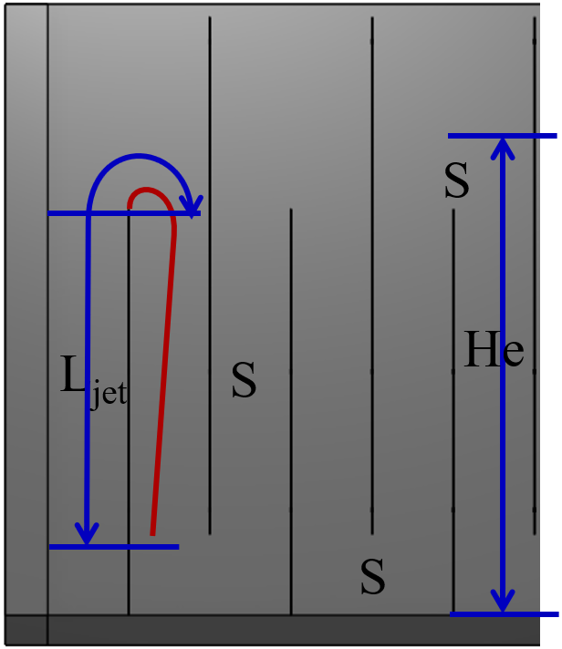
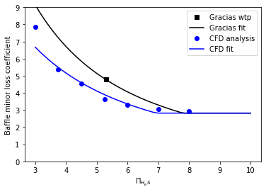

.. _title_Flocculation_Derivations:

*************************
Flocculation Derivations
*************************

.. _heading_Baffle_Loss_Coefficient:

Baffle Minor Loss Coefficient
=============================

For contractions in series the minor loss coefficient is strongly influenced by the distance between the contractions. When the contractions are spaced so closely that the flow can't fully expand between contractions the velocity exiting the contraction is greater and the resulting head loss is gerater. The distance required for the flow to expand can be estimated based on jet expansion equations. The flow exiting a rectangular contraction can be modeled as a plane jet and plane jets grow in width at a rate

.. math::
  :label: PlaneJet_expansion

  W_{jet} = 0.116x

where x is the distance along the path of the jet centerline and :math:`\Pi_{PlaneJet_{exp}} = 0.116` for a plane jet in an infinite medium. The location of this expanding jet is shown in Figure

.. _figure_baffle_geometry:

   Baffle geometry for a hydraulic flocculator where S is the space between baffles, :math:`L_{jet}` is the distance over which a jet can expand, and :math:`H_e` is the approximate total distance between expansions.

The distance over which the jet can expand is given by :math:`L_{jet}`. The minimum path length assumes that jet expansion doesn't occur when the streamlines are curving to go around the end of the baffle.

.. math::
  :label: L_jet_min

  L_{jet_{min}} = H_e - 2 S

The maximum path length for the jet to expand could include an additional distance of approximately :math:`2S` (shown) for the centerline of the flow as it arcs around the end of the baffle.

.. math::
  :label: L_jet_max

  L_{jet_{max}} = H_e

The jet may be influenced by the presence of a baffle on the one side. Computational Fluid Dynamics is needed to determine the correct value for :math:`\Pi_{PlaneJet_{exp}} in baffled flocculators.

The maximum width of the expanding jet, :math:`W_{jet_{max}}`, occurs immediately upstream of where the streamlines begin to curve to go around the end of the baffle. The jet minimum width (greatest contraction) occurs shortly after going around the 180° bend. Given that the flow might not have fully expanded we can express the jet minimum width as a function of the jet maximum width.

.. math::
  :label: W_jet_min

  W_{jet_{min}} = W_{jet_{max}} \Pi_{vc}^{baffle}

Similarly the maximum jet width is determined by how much it can expand in distance :math:`L_{jet}`.

.. math::
  :label: W_jet_max_of_W_jet_min

  W_{jet_{max}} = W_{jet_{min}} +  \Pi_{PlaneJet_{exp}}L_{jet}

Equations :eq:` W_jet_min` and :eq:`W_jet_max_of_W_jet_min` provide two equations in two unknowns. Eliminate :math:`W_{jet_{min}}` from equation :eq:`W_jet_max_of_W_jet_min`.

.. math::
  :label: W_jet_max

  W_{jet_{max}} =  \frac{\Pi_{PlaneJet_{exp}}L_{jet}}{1 - \Pi_{vc}^{baffle}}

The velocity in the expanded jet is higher would have been obtained based on continuity and the dimensions of the flow passage. The effect of the higher velocity can be factored into equation :eq:`K_baffle_min` by multiplying by the ratio of the velocity squared. From continuity the ratio of :math:`S` to :math:`W_{jet_{max}}` is the ratio velocity in the expanded jet to the velocity that would have occurred if the flow had filled the enter flow passage. Substitute equation :eq:`W_jet_max` to obtain

.. math::
  :label: baffle_expanded_jet_width_ratio

   \frac{S}{W_{jet_{max}}}  =  \frac{S}{ \frac{\Pi_{PlaneJet_{exp}}L_{jet}}{1 - \Pi_{vc}^{baffle}}}

The ratio of :math:`\frac{L_{jet}}{S}` can be expressed as a function of the baffle ratio, :math:`\Pi_{H_eS}`. The maximum path length for jet expansion is used here.

.. math::
  :label: L_jetS_ratio

  \frac{L_{jet_{max}}}{S} = \frac{H_e}{S}= \Pi_{H_eS}

Substitute equation :eq:`L_jetS_ratio` into equation :eq:`baffle_expanded_jet_width_ratio` to obtain the ratio of the velocity in the expanded jet to the velocity that would have occurred if the flow had filled the enter flow passage.

.. math::
  :label: baffle_unexpanded_velocity_ratio

  \frac{S}{W_{jet_{max}}}  =   \frac{1 - \Pi_{vc}^{baffle}}{\Pi_{PlaneJet_{exp}}\Pi_{H_eS}}

Equation :eq:`baffle_unexpanded_velocity_ratio` has a minimum value of 1 representing fully expanded flow. For small values of :math:`\Pi_{H_eS}` the equation would incorrectly predict values less than 1. The square of this velocity ratio can be factored into the baffle minor loss equation (equation :eq:`K_baffle_min`) to obtain an equation that handles baffles in series where the flow doesn't fully expand between baffles.

.. math::
  :label: K_baffle_expanding_messy

  K_{baffle_{exp}} = \left( \frac{1 - \Pi_{vc}^{baffle}}{\Pi_{PlaneJet_{exp}}\Pi_{H_eS}} \right)^2 \left( \frac{1-\Pi_{vc}^{baffle}}{\Pi_{vc}^{baffle}} \right)^2

Equation :eq:`K_baffle_expanding_messy` can be simplified to obtain

.. math::
  :label: K_baffle_expanding

   K_{baffle_{exp}} = \left(\frac{\left(1 - \Pi_{vc}^{baffle}\right) ^ 2}{ \Pi_{vc}^{baffle} \Pi_{PlaneJet_{exp}} \Pi_{H_{e}S}}\right) ^ 2

Equation :eq:`K_baffle_expanding` incorporates two assumptions that need to be checked with computational fluid dynamics.

1) The :math:`\Pi_{PlaneJet_{exp}}` may be missing a correction to account for the slower jet expansion along the baffle that is in contact with the jet.
1) The distance for the jet to expand may be greater or less than :math:`H_e`.

.. _figure_K_baffle:

   Baffle minor loss coefficient (Equation :eq:`K_baffle_expanding`) is predicted to increase rapidly as the H/S ratio decreases.

Figure :numref:`figure_K_baffle` reveals that the baffle minor loss coefficient increases rapidly as :math:`\Pi_{H_{e}S}` decreases below about 5.6. This suggests that estimating the baffle minor loss coefficient correctly will be critical and more difficult for low values of :math:`\Pi_{H_{e}S}`.

Linking head loss, velocity gradient, and geometry
==================================================

The energy dissipation rate in Equation :eq:`G_Camp_Stein` can be set equal to the energy dissipated in a control volume given by Equation :eq:`eq_EDR_HL` to obtain

.. math::
  :label: eq_gen_G_and_hL

  \nu G_{CS}^2 \theta = g h_{L}

Equation :eq:`eq_gen_G_and_hL` can be applied to a control volume that contains an entire flocculator or to a control volume containing a single flow expansion. Here we develop the analysis of a single flow expansion. This means that the residence time is the time between expansions, :math:`\theta_e`, and the head loss is for one expansion, :math:`h_{L_{e}}`.

From here we make three subsequent substitutions: first
:math:`h_{L_{e}} = K_{baffle} \frac{\bar v^2}{2g}`, then
:math:`\theta_e = \frac{H_e}{\bar v}`, and finally
:math:`\bar v = \frac{Q}{WS}`.

where :math:`S` is the distance between baffles, :math:`W` is the dimension of the flow that is normal to :math:`S` and :math:`H_e` the distance between expansions. For complex geometry the best way to estimate :math:`H_e` is the volume of water divided by :math:`WS`.

.. math:: \nu G_{CS}^2 = K_{baffle} \frac{\bar v^2}{2 \theta_e}

.. math:: \nu G_{CS}^2 = K_{baffle} \frac{\bar v^3}{2 H_e}

.. math::
  :label: flocGeoG

  \nu G_{CS}^2 = \frac{K_{baffle}}{2 H_e} \left( \frac{Q}{WS} \right)^3

Equation :eq:`flocGeoG` describes the relationship between the geometry of the flocculator, the flow rate, and the resulting velocity gradient.

Channel or Flow Width
=====================

The minimum allowable width of a Horizontal-Vertical flocculator channel is based on the requirements that :math:`3 < \Pi_{H_eS} < 6` and that we maintain the :math:`G_{CS}` that
serves as a basis for design. The final parameter derived is
:math:`W_{Min, \, \Pi_{H_eS}}`.

Our two restrictions are:

#. Ensuring that we maintain the :math:`G_{CS}` we get based on our input parameters.
#. Ensuring that :math:`3 < \frac{H_e}{S} < 6`

Now we can solve this equation for channel width, :math:`W`.

.. math:: W = \frac{Q}{S}\left( \frac{K_{baffle}}{2 H_e \nu G_{CS}^2} \right)^\frac{1}{3}

From here, we can define :math:`\Pi_{H_eS} = \frac{H_e}{S}` and
substitute :math:`S = \frac{H_e}{\Pi_{H_eS}}` into the previous equation
for :math:`W` to get :math:`W_{Min, \, \Pi_{H_eS}}`:

.. math::

   W_{Min, \, \Pi_{H_eS}} = \frac{\Pi_{H_eS}Q}{H_e}\left( \frac{K_{baffle}}{2 H_e \nu G_{CS}^2} \right)^\frac{1}{3}

| This equation represents the absolute smallest width of a flocculator
  channel if we consider the lowest value of :math:`\Pi_{H_eS}` and the
  highest possible value of :math:`H_e`:
| :math:`H_e = H`, this implies that there are no obstacles between
  baffles
| :math:`\Pi_{H_eS} = 3`

Baffle Spacing
==============
The core equation relating flow geometry and velocity gradient is Equation :eq:`flocGeoG`. If the jet has fully expanded before entering the next contraction then the minor loss coefficient is a constant. Rearranging for :math:`S`, we obtain:

.. math::
  :label: Floc_baffle_spacing_of_K

   S = \left( \frac{K_{baffle}}{2 H_e G_{CS}^2 \nu } \right)^\frac{1}{3} \frac{Q}{W}

If the jet has not fully expanded before entering the next contraction then an exact solution for the space between baffles can be obtained by substituting :eq:`K_baffle_expanding` into :eq:`Floc_baffle_spacing_of_K` and replacing :math:`\Pi_{H_eS}` with :math:`\frac{H_e}{S}`.

.. math::
  :label: Floc_baffle_spacing_of_K_var_K_messy

   S = \left( \frac{\left(\frac{S \left(1 - \Pi_{vc}^{baffle}\right) ^ 2}{H_{e} \Pi_{vc}^{baffle} \Pi_{PlaneJet_{exp}}}\right) ^ 2}{2 H_e G_{CS}^2 \nu } \right)^\frac{1}{3} \frac{Q}{W}

Factor out the :math:`S` from the righthand side and simplify to obtain

.. math::
  :label: floc_baffle_spacing_var_K

  S = \left(\frac{Q}{W H_e}\right)^3   \frac{ \left(1 - \Pi_{vc}^{baffle}\right) ^ 4}{2 \nu G_{CS}^2 \left( \Pi_{vc}^{baffle} \Pi_{PlaneJet_{exp}} \right)^2}

If it is unknown if the jet has fully expanded, then simply use the maximum of Equations :eq:`Floc_baffle_spacing_of_K` and :eq:`floc_baffle_spacing_var_K`.

One possible set of assumptions for Horizontal-Horizontal and Vertical-Horizontal flow flocculators is that :math:`\Pi_{H_eS}` is specified (perhaps = 6).

.. math::
  :label: HeofPI_HS

  H_e = \Pi_{H_eS} S

If :math:`\Pi_{H_eS}` and the flow width, :math:`W`, are specified we can substitution Equation :eq:`HeofPI_HS` into Equation :eq:`flocGeoG` and solve for the baffle space, :math:`S`.

.. math::
  :label: floc_baffle_spacing_const_PiHS

  S = \left[\frac{K_{baffle}}{2 \nu G_{CS}^2 \Pi_{H_eS}} \left( \frac{Q}{W} \right)^3\right]^{\frac{1}{4}}

An alternative assumption is that the flow width and the baffle spacing are equal. Given those assumptions we can make those substitutions and solve Equation :eq:`flocGeoG` for the baffle space, S.

.. math::
  :label: floc_baffle_spacing_squareGeometry

   S = \left(\frac{K_{baffle}Q^3}{2  \nu G_{CS}^2 \Pi_{H_eS}} \right)^{\frac{1}{7}}
