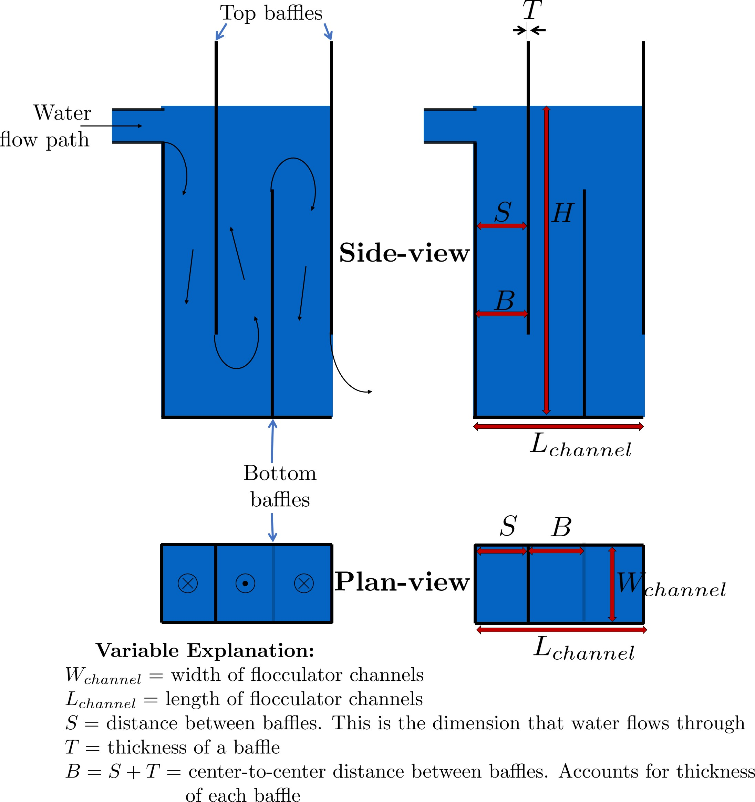
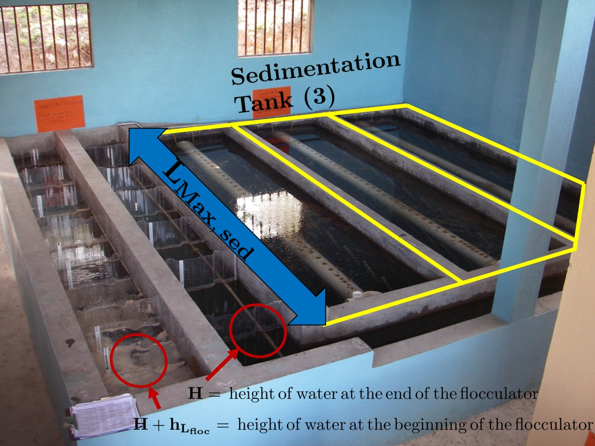
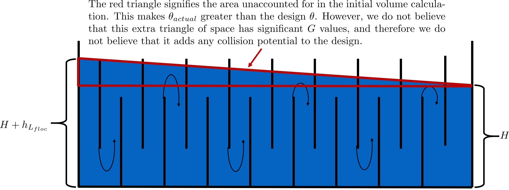

.. _title_Flocculation_Design:

********************
Flocculation Design
********************

**Important Note:** This chapter introduces uncertainty and empirical design. Some of the parameters used to design AguaClara flocculators are based on what has been shown to work in the field, as opposed to having been derived scientifically. To make sure that the reader is aware of these concepts and parameters that don’t yet have a thorough basis in research, they will be highlighted in red when they appear.

AguaClara's approach to flocculator design is the same as it is for any other unit process. First, critical design criteria, called inputs, are established. These criteria represent the priorities that the rest of the design will be based around. Once these parameters are established, then the other parameters of the design, which are dependent on the inputs, are calculated based on certain constraints.

Take the CDC as an example of this design process in :ref:`title_flow_control_design`; its inputs are :math:`h_{L_{Max}}`, :math:`\sum K`, :math:`\Pi_{Error}`, and the discrete dosing tube diameters  :math:`D` that are available at hardware stores or pipe suppliers. Its dependent variables include the number and length of the dosing tubes and the flow through the CDC system.

The flocculator is more complex to design than the CDC, as it has more details and parameters and the equations for those details and parameters are very interdependent. Therefore, there are many ways to design an AguaClara flocculator, and many different sets of critical design criteria to begin with. Below are design approaches for several of the different potential flocculator geometries.

In all cases we will need equations relating head loss, velocity gradient, viscosity, and collision potential. Flocculators must operate effectively over a range of temperatures and the critical design temperature is the coldest operating temperature. The viscosity shown in subsequent equations is the viscosity at the coldest operating temperature.

The following equations describe the design process assuming that a velocity gradient is specified for the coldest operating temperature. Given :math:`G_{CS}`, we can very easily find :math:`\theta`:

.. math::

  \theta = \frac{G_{CS} \theta}{G_{CS}}

Finally, we take retention time :math:`\theta` over plant flow rate :math:`Q` to get the required volume of the flocculator:

.. math::

  \rlap{-} V_{floc} = \frac{\theta}{Q}

Now that we have the basic parameters defined, we can start to design the details of the flocculator, starting from the physical dimensions.

Horizontal-Horizontal flow flocculators
=======================================

Horizontal-Horizontal flocculators can be easily designed to have an optimal :math:`\Pi_{H_eS}`. Our current understanding is that the optimal value to achieve uniform velocity gradients and to allow the flow to fully expand is when :math:`\Pi_{H_eS} = 6`. The flow geometry can be optimized to reduce construction costs by varying the relationship between :math:`S` and :math:`W`. The dimension :math:`W` is in the vertical direction and thus increasing W will increase the water depth and reduce the plan view area of the flocculator. If land area is constrained and the cost of roofing is considered it is very likely that the optimal solution will require :math:`W>S`.

Horizontal-Vertical flow flocculators
=====================================

1. Input parameters
    - Specify:
      - :math:`G_{CS}`, velocity gradient at the coldest operating temperature
      - :math:`G_{CS} \theta`, collision potential at the coldest operating temperature
      - :math:`Q`, plant flow rate
      - :math:`H`, height of water *at the end of the flocculator*
      - :math:`L_{Max, \, sed}`, max length of a flocculator channel based on sedimentation tank length
      - :math:`W_{Min, \, human}` minimum width of a single channel based on the width of the average human hip (someone's got to go down there...)
    - Find:
      - :math:`\theta`, hydraulic retention time
      - :math:`\rlap{-}V_{floc}`, flocculator volume
      - :math:`h_{L_{floc}}`, head loss (independent of operating temperature)
2. Physical dimensions
    - Calculate:
      - :math:`L_{channel}`, actual channel length
      - :math:`n_{channels}`, amount of channels
      - :math:`W_{channel}`, actual channel width
3. Hydraulic parameters
    - Calculate:
      - :math:`H_e`, distance between baffle/obstacle induced flow expansions
      - :math:`n_{obstacles}`, amount of obstacles per baffle space
      - :math:`S`, baffle spacing, distance between baffles

.. _figure_floculator_physical_parameters:

   Flocculator geometry definition including the effect of baffle thickness. Accounting for baffle thickness would be particularly important if `ferrocement <https://en.wikipedia.org/wiki/Ferrocement>`_ or wood were used for baffles.

We start by making sure that our flocculator will be able to flocculate effectively by defining :math:`h_{L_{floc}}` and :math:`G_{CS} \theta`. Fixing these two parameters initially allows us to easily find all other parameters which determine flocculator performance. Here are the current standards in AguaClara flocculators:

 - :math:`G_{CS} = 100 Hz`
 - :math:`G_{CS} \theta = 37,000`

The plant flow rate :math:`Q` is defined by the needs of the community that the plant is being desiged for. Additionally, the height of water *at the end* of the flocculator, :math:`H`, the *maximum* length of the flocculator based on the length of the sedimentation tank length, :math:`L_{Max, \, sed}`, and the *minimum* width of a flocculator channel required for a human to fit inside, :math:`W_{Min, \, human}`, are also defined initially. Ordinarilly in AguaClara plants, the flocculator occupies the same length dimension as the sedimentation tanks, which is why the length constraint exists. See :numref:`figure_physical_design_criteria_floc` for a representation of how the flocculator and sedimentation tanks are placed in a plant.

- :math:`H = 2 \, {\rm m}`
- :math:`L_{Max, \, sed} = 6 \, {\rm m}`
- :math:`W_{Min, \, human} = 45 \, {\rm cm}`

.. _figure_physical_design_criteria_floc:

   Layout of flocculator and sedimentation tanks that was adopted starting with the 2nd AguaClara plant in Tamara, Honduras in 2008.

Physical Dimensions
-----------------------------
Deriving the equations required to find the physical dimensions now and the hydraulic parameters (baffle/obstacle design) in the next section requires many steps. To simplify this design explanation the equation derivations are developed in :ref:`title_review_fluid_mechanics_derivations`. All complex equations which seemingly came out of nowhere will be derived in the derivation sheet.

Length
^^^^^^^^^^^^^^^^^^^^^

Flocculator length, :math:`L_{channel}`` must meet two constraints: it must be less than or equal to the length of the sedimentation tanks, as the flocculator is adjacent to the sed tanks. This constraint is :math:`L_{Max, \, sed}`. Next, the flocculator must be short enough to make sure the target volume of the flocculator is met, while still allowing for a human to fit inside :math:`L_{Max, \, \rlap{-} V}`. **The constraint that wins out is the one that results in the *smaller* length value**.

.. math::

  L_{Max, \, sed} = 6 \, {\rm m}
  L_{Max, \, \rlap{-}V} = \frac{\rlap{-} V}{n_{Min, \, channels} W_{Min, \, human} H}

| Such that:
| :math:`n_{Min, \, channels} = 2`

The reason why :math:`W_{Min, \, human}` is used is because it represents the absolute minimum of flocculator channel width. If the width ends up being larger, the length will decrease. :math:`n_{Min, \, channels} = 2`  to make sure that the flow ends up on the correct side of the sedimentation tank, as the image below shows. Note that there can only be an even number of flocculator channels, as explained in the image's caption.

The equation for *actual* flocculator length is therefore:

.. math::

  L_{channel} = {\rm min}(L_{Max, \, sed}, \, L_{Max, \, \rlap{-} V})

.. _figure_floc_channels:

.. figure:: ../Images/Floc_channels.jpg
   :align: center
   :width: 600px
   :alt: floc channels

   There are an even amount of flocculator channels to keep the AguaClara plant layout consistent for flows greater than 12 L/s. This ensures that the entrance tank, filter box, and filters can be kept in the same places across plants.

Width and Number of Channels
^^^^^^^^^^^^^^^^^^^^^^^^^^^^^^^^^^^^^^^^^^^

The width of a single flocculator channel must meet the following conditions:
- Maintain :math:`G_{CS}` at the value found in the inputs section
- Allow for :math:`3 < \frac{H_e}{S} < 6`. Recall that :math:`\frac{H_e}{S} =  \Pi_{H_eS}`
- Allow for a human to be able to fit into a flocculator channel

The first two conditions are wrapped up into the following equation, :ref:`which is derived here <title_Flocculation_Derivations>`.

.. math::
  :label: floc_channel_W_min_const_K

  W_{Min_{H_eS}} = \frac{\Pi_{H_eS_{min}}Q}{H_e}\left( \frac{K}{2 H_e \nu G_{CS}^2} \right)^\frac{1}{3}

Given that the baffle minor loss coefficient is now known to be a function of :math:`\Pi_{H_eS}` we substitute :eq:`K_baffle_expanding`.

.. math::
  :label: floc_channel_W_min_var_K_draft

  W_{Min_{H_eS}} = \frac{\Pi_{H_eS_{min}}Q}{H_e}\left( \frac{ \left(\frac{\left(1 - \Pi_{vc}^{baffle}\right) ^ 2}{ \Pi_{vc}^{baffle} \Pi_{PlaneJet_{exp}} \Pi_{H_eS_{min}}}\right) ^ 2}{2 H_e \nu G_{CS}^2} \right)^\frac{1}{3}

Group the parameters so that the dimensions inside the exponents are a simple as possible.

.. math::
  :label: floc_channel_W_min_var_K

  W_{Min_{H_eS}} = \frac{Q}{\left(\nu G_{CS}^2 H_e^4\right)^\frac{1}{3}}\left( \frac{ \left(1 - \Pi_{vc}^{baffle}\right) ^ 4 \Pi_{H_eS_{min}}}{2   \left( \Pi_{vc}^{baffle} \Pi_{PlaneJet_{exp}} \right)^2} \right)^\frac{1}{3}

This equation represents the absolute smallest width of a flocculator channel if we consider the lowest value of :math:`\Pi_{H_eS}` and the highest possible value of :math:`H_e`:

:math:`H_e = H_{e_{Max}} = H = 2 \, {\rm m}`, this implies that there are no obstacles between baffles
:math:`\Pi_{H_eS} = \Pi_{ {HS}_{Min} } = 3`

Recall our other width constraint, :math:`W_{Min, \, human} = 45 \, {\rm cm}`, which is based on our desire to have a human be able to fit into the channels. The governing constraint is the *larger* value of :math:`W_{Min}`:

.. math::

  W_{Min} = {\rm max}(W_{Min, \, \Pi_{H_eS}}, \, W_{Min, \, human})

We can find the number of channels, :math:`n_{channels}` and their actual width in one last step, by finding the *total flocculator width* if there were no channels and dividing that by the minimum flocculator width, :math:`W_{Min}`, found above. The equation for total flocculator width is based on our target volume:

.. math::

  W_{total} = \frac{\rlap{-} V}{H L_{channel}}

Finally:

.. math::

    n_{channels} = \frac{W_{total}}{W_{Min}}

| Such that:
| :math:`n_{channels}` is an even number and is not 0. Usually, :math:`n_{channels}` is either 2 or 4.

Now that we know :math:`n_{channels}`, we can find the actual width of a channel, :math:`W_{channel}`.

.. math::

     W_{channel} = \frac{W_{total}}{n_{channels}}

Hydraulic Parameters
--------------------

Now that the physical dimensions of the flocculator have been defined, the baffle module needs to be designed. The parameter on which most others are based is the distance between flow expansions, :math:`H_e`. Recall that :math:`H_e = H` when there are no obstacles in between baffles.

Height Between Expansions
^^^^^^^^^^^^^^^^^^^^^^^^^

We have a range of possible :math:`H_e` values based on our window of :math:`3 < \frac{H_e}{S} < 6`. However, we have a limitation and a preference which shape how we design :math:`H_e`. Our limitation is that there can only be an integer number of obstacles. Our preference is to have as few obstacles as possible to make the baffle module as easy to fabricate as possible. Therefore, we want :math:`\frac{H_e}{S}` to be closer to :math:`6` than it is to :math:`3`; we are looking for :math:`H_{e_{Max}}`.

We calculate :math:`H_{e_{Max}}` based on the physical flocculator dimensions. The equation for :math:`H_e` is obtained by rearranging Equation :eq:`floc_channel_W_min_var_K`. Because we have already designed the channel width, we substitute :math:`W_{channel}` for :math:`W_{Min_{H_eS}}`. Since we are looking for :math:`H_{e_{Max}}`, we also substitute :math:`\Pi_{{H_eS}_{Max}}` for :math:`\Pi_{H_eS}`. The result is:

.. math::
  :label: floc_He_max_var_K

  H_{e_{Max}}^\frac{4}{3}= \frac{Q}{W_{Min_{H_eS}} \left(\nu G_{CS}^2 \right)^\frac{1}{3}}\left( \frac{ \left(1 - \Pi_{vc}^{baffle}\right) ^ 4 \Pi_{{H_eS}_{Max}}}{2   \left( \Pi_{vc}^{baffle} \Pi_{PlaneJet_{exp}} \right)^2} \right)^\frac{1}{3}

raise to 3/4

.. math::
  :label: floc_He_max_var_K

  H_{e_{Max}}= \left[ \left(\frac{Q^3}{W_{Min_{H_eS}}^3 \nu G_{CS}^2}\right)\frac{  \Pi_{{H_eS}_{Max}}}{2   \left( \Pi_{vc}^{baffle} \Pi_{PlaneJet_{exp}} \right)^2} \right]^\frac{1}{4} \left(1 - \Pi_{vc}^{baffle}\right)

For :math:`\Pi_{H_eS}` large enough such that the flow has fully expanded the following equation applies.

.. math::

  H_{e_{Max}} = \left[ \frac{K}{2 \nu G_{CS}^2} \left( \frac{Q \Pi_{{HS}_{Max}}}{W_{channel}} \right)^3 \right]^\frac{1}{4}

Note that this is the *maximum* distance between flow expansions, and does not account for the limitation that there must be an integer number of obstacles per baffle space. Thus, we need to find the *actual* distance between flow expansions. To do this, we determine and round up the number of expansions per baffle space using the ceiling function:

.. math::

  n_{expansions} = {\rm ceil}\left( \frac{H}{H_{e_{Max}}} \right)

If we had used the floor() function instead, we would find that :math:`H_e` would be larger than our upper bound, :math:`H_{e_{Max}}`. From here, we can easily get to the actual number of flow expansions per baffle spacing:

.. math::

     H_e = \frac{H}{n_{expansions}}

Finally, we can obtain the number of obstacles per baffle space. The :math:`- 1` in the equation is because the baffles themselves provide one flow expansion per baffle space.

.. math::

  n_{obstacles} = \frac{H}{H_e} - 1

Baffle Spacing
^^^^^^^^^^^^^^^

Finally, we can find the space between baffles, :math:`S`.

Checking the Flocculator Design
--------------------------------

We then compare :math:`n_{spaces, \, required}` to :math:`n_{spaces, \, actual}` to make sure that they are equal.

Average Velocity
^^^^^^^^^^^^^^^^^

As water flows through the flocculators, the flocs will get larger and larger. As a result, their terminal sedimentation velocity will increase. This is what we want. However, we need to make sure that the flocs don’t settle in the flocculator; that they instead all settle in the sedimentation tank. To make sure of this, we need to make sure that the velocity of water in the flocculator is high enough to scour any flocs that fall to the bottom of the flocculator. The velocity required to scour flocs from the bottom and avoid floc accumulation is around :math:`v_{scour} = 15 \, {\rm \frac{cm}{s}}`. We can check our average velocity :math:`\bar v` against this value. Unfortunately, the only method to increase the velocity through the flocculator is to increase the space between baffles, S, and decrease the channel width, W. Generally those changes aren't practical and thus there isn't any way to increase the velocity.

.. math:: \bar v = \frac{Q}{W_{channel} S}

Head loss
^^^^^^^^^

Head loss is calculated for each expansion using the minor loss coefficient associated with that expansion in Equation :eq:`minor_loss`. The total head loss is simple a sum of the head loss for all of the expansions.

Residence Time
^^^^^^^^^^^^^^^

It is now time to make our final check. We need to make sure that our actual residence time is *at least* as much as we designed for. Fortunately, in our design we did not account for the change in water level throughout the flocculator due to head loss. Therefore, the actual volume of water in the flocculator is actually greater than :math:`\rlap{-} V_{floc}`. See :numref:`figure_flocculator_head_loss` for clarification.

.. _figure_flocculator_head_loss:

    The water level in the flocculator decreases due to head loss. Flocculators may occupy multiple channels, but this extra triangle of water exists in any case.

Thus, the actual average water level in the flocculator is :math:`H + \frac{h_{L_{floc}}}{2}`. Thus, the actual residence time is:

.. math:: \theta_{actual} = \frac{n_{channels} L_{channel} W_{channel} \left( H + \frac{h_{L_{floc}}}{2} \right)} {Q}

Check to see if :math:`\theta_{actual}` is greater than :math:`\theta`.

.. bibliography:: /references.bib
  :cited:
  :keyprefix: floc-
