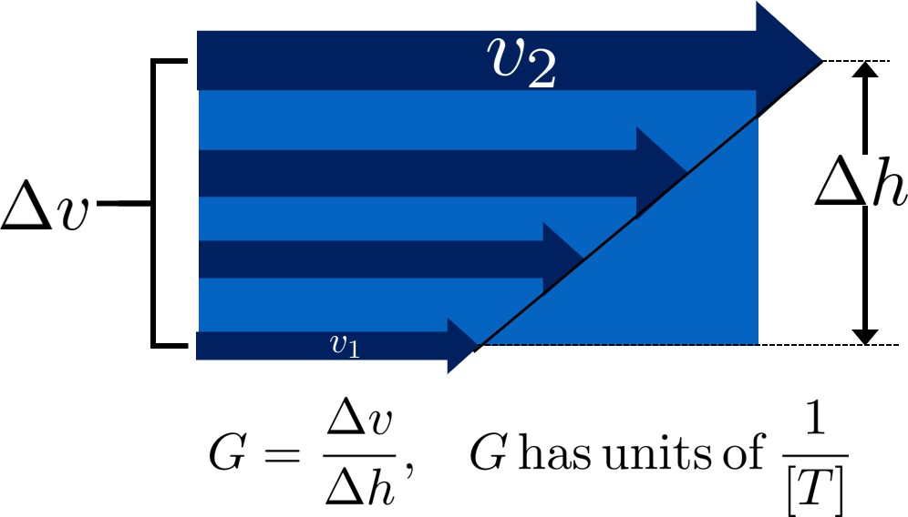
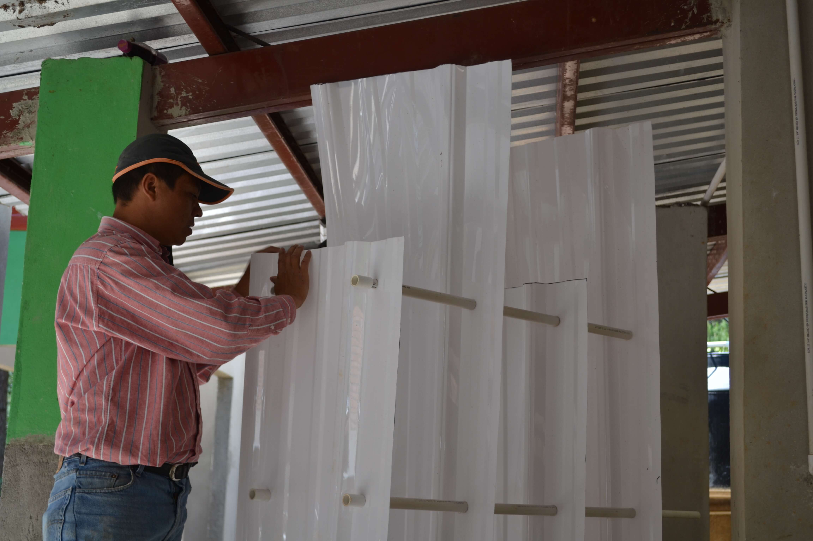
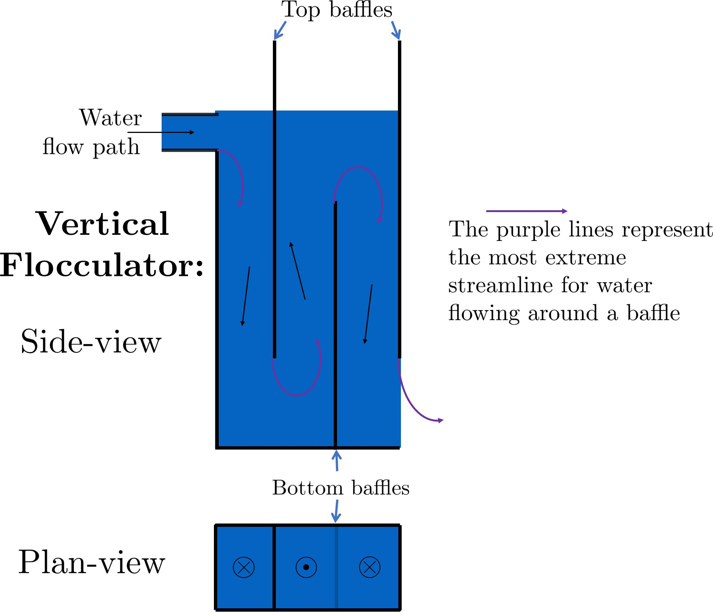
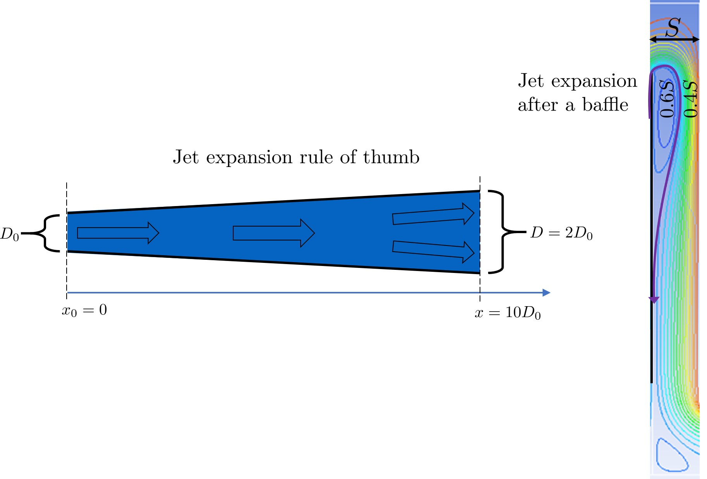
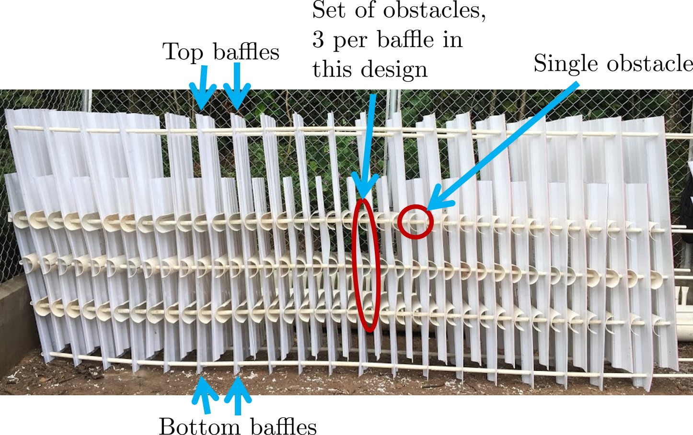
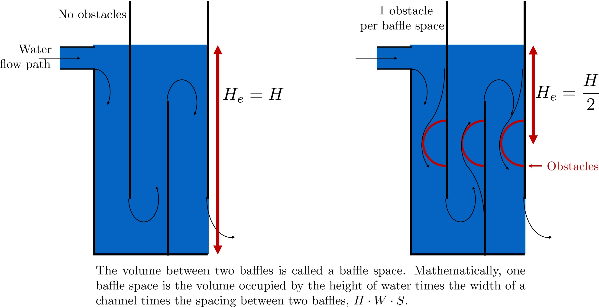
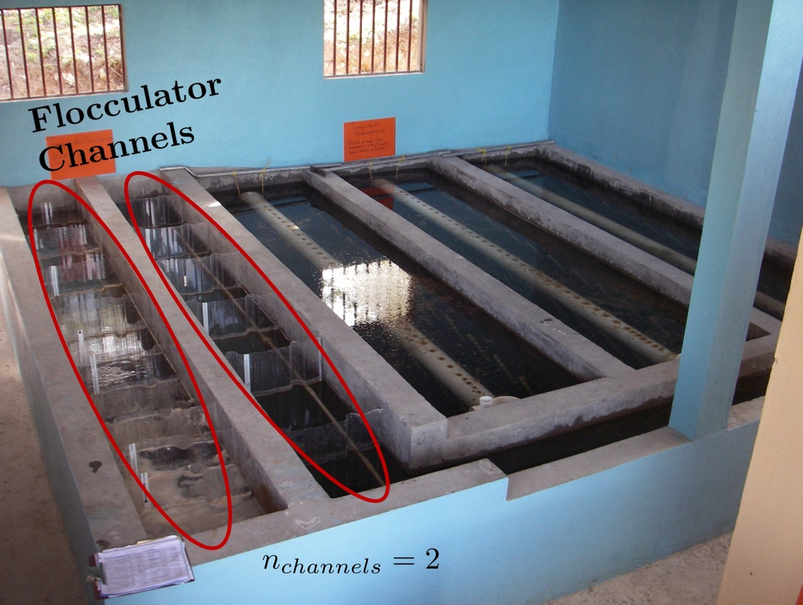
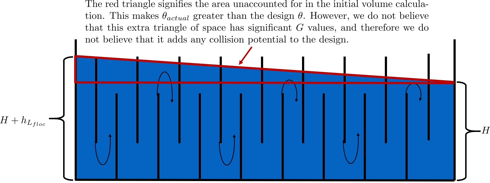

.. _title_Flocculation_Design:

********************
Flocculation Design
********************

Welcome to the **fourth** summary sheet of CEE 4540! These documents will be guides and references for you throughout the semester. Since
Professor Monroe’s class time is limited, so too is the amount of material he can fit on the slides while ensuring that they remain
understandable. Thus, these summary sheets will supplement the powerpoints by going into further detail on the course concepts
introduced in the slides.

Equations, universal constants, and other helpful goodies can be found in the `aide_design repository on GitHub <https://github.com/AguaClara/aide_design/tree/master/aide_design>`__. Most equations and constants you find in these summary sheets will already have been coded into aide_design, and will be shown here in the following format:

| Variable: ``pc.gravity``
| Function: ``pc.area_circle(DiamCircle)``.

The letters before the ``.``, in this case ``pc``, indicate the file within aide_design where the variable or function can be found. In the examples above, ``pc.gravity`` and ``pc.area_circle(DiamCircle)`` show that the variable ``gravity`` and function ``area_circle(DiamCicle)`` are located inside the `physchem.py <https://github.com/AguaClara/aide_design/blob/master/aide_design/physchem.py>`__ (``pc``) file. You are strongly recommended to look up any aide_design equations you plan to use within in their aide_design file before using them, even if they are given here in this summary sheet. This is because each equation has comments in its original file describing what the specific conditions are to using it.

For the most part, `hyperlinks in these documents will contain supplementary information <http://likethis.com/>`__. The information contained in the linked external sites is there in case you don’t feel completely comfortable with a concept, but is not necessary to learn thoroughly and will not be tested.

**Important Note:** This chapter introduces uncertainty and empirical design. Some of the parameters used to design AguaClara flocculators are based on what has been shown to work in the field, as opposed to having been derived scientifically. To make sure that the reader is aware of these concepts and parameters that don’t yet have a thorough basis in research, they will be highlighted in red when they appear.

Hydraulic Flocculators, the AguaClara Approach
=======================================================

Important Terms
---------------

1. Collision potential
2. Energy dissipation rate
3. Baffle
4. Baffle module
5. Baffle space
6. Obstacle

Important Equations
------------------~

1. Minor Loss equation

Introduction to Hydraulic Flocculation
======================================

The reason that flocculation is widely used in water treatment is because of sedimentation. Sedimentation is the process that actually removes particles like clay, dirt, organic matter, and bacteria from water. As you learned in the
:ref:`introduction on treatment trains <heading_Treatment_Trains>`, sedimentation is the process of particles ‘falling’ because they have a higher density then the water, and its governing equation is:

.. math:: \bar v_t = \frac{D_{particle}^2 g}{18 \nu} \frac{\rho_p - \rho_w}{\rho_w}

| Such that:
| :math:`\bar v_t` = terminal velocity of a particle, its downwards speed if it were in quiescent (still) water
| :math:`D_{particle}` = particle diameter
| :math:`\rho` = density. The :math:`p` subscript stands for particle, while :math:`w` stands for water

To increase :math:`\bar v_t` and make sedimentation more efficient, flocculation aims to increase the diameter :math:`d` of the particles. This is done by applying a coagulant to the dirty water and helping the coagulant to stick evenly to all particles during Rapid Mix ***(DOUBLE CHECK THAT THIS IS IN RAPID MIX ONCE RAPID MIX IS WRITTEN)***. Being covered in coagulant allows the particles to collide, merge, and grow bigger during flocculation.

Our goal in designing a flocculator is to facilitate particle collisions. How can we do this?

Collision Potential, :math:`\bar G \theta`, and Energy Dissipation Rate, :math:`\varepsilon`
--------------------------------------------------------------------------------------------

**Collision potential :math:`(\bar G \theta)`** is a term with a very straightforward name. It represents the magnitude of potential particle collisions in a fluid. It is a *dimensionless* parameter which is often used as a performance metric for flocculators; big :math:`\bar G \theta` values indicate lots of collisions (good) while small values indicate fewer collisions (not so good). AguaClara flocculators usually aim for a collision potential of :math:`\bar G \theta = 37,000`\ , which has worked well in AguaClara plants historically. However, this value may change as research continues. The value for collision potential is obtained by multiplying :math:`\bar G`, a parameter for average fluid shear with units of :math:`\frac{1}{[T]}`, and :math:`\theta`, the residence time of water in the flocculator, with units of :math:`[T]`. :math:`\theta` is intuitive to measure, calculate, and understand. :math:`\bar G` is a bit more difficult. First, an intuitive explanation. :numref:`figure_G_velocity_profile` , which shows the velocity profile of flowing water.

.. _figure_G_velocity_profile:

    Velocity profile for the case of uniform shear.

:math:`G` measures the magnitude of shear by using the velocity gradient of a fluid in space, :math:`\frac{\Delta \bar v}{\Delta h}`. This is essentially the same as the :math:`\frac{\delta u}{\delta y}` term in fluid mechanics, which is found in the ubiquitous `fluid-shear problem <http://polymerdatabase.com/polymer%20physics/images/Visc.png>`__.

:math:`\bar G` represents the average :math:`\frac{\Delta \bar v}{\Delta h}` for the entire water volume under consideration, and is the parameter we will be using from now on. Unfortunately, it is unrealistic to measure :math:`\frac{\Delta \bar v}{\Delta h}` for every parcel of the water in our flocculator and take an average. We need to approximate :math:`\bar G` using measureable parameters.

The parameter that serves as the basis for obtaining :math:`\bar G` is :math:`\varepsilon`, which represents the **energy dissipation** rate of a fluid *normalized by its mass*. The units of :math:`\varepsilon` are Watts per kilogram:

.. math::

   \varepsilon = \left[ \frac{W}{Kg} \right]
   = \left[ \frac{J}{s \cdot Kg} \right]
   = \left[ \frac{N \cdot m}{s \cdot Kg} \right]
   = \left[ \frac{kg \cdot m \cdot m}{s^2 \cdot s \cdot Kg} \right]
   = \left[ \frac{m^2}{s^3} \right]
   = \left[ \frac{[L]^2}{[T]^3} \right]

There are at least two ways to think about :math:`\varepsilon`. One is through :math:`G`. Imagine that a fluid has *no viscosity*; there is no internal friction caused by fluid flow. No matter how high :math:`G` becomes, no energy is dissipated. Now image a honey, which has a very high viscosity. Making honey flow fast requires a lot of energy over a short period of time, which means a high energy dissipation rate. This explanation allows us to understand the equation for :math:`\varepsilon` in terms of :math:`G` and :math:`\nu`. `See this textbook <https://app.knovel.com/web/view/khtml/show.v/rcid:kpMWHWTPD1/cid:kt00AD4KW1/viewerType:khtml/root_slug:mwh-s-water-treatment/url_slug:principles-reactor-analysis?&b-toc-cid=kpMWHWTPD1&b-toc-url-slug=coagulation-flocculation&b-toc-title=MWH%E2%80%99s%20Water%20Treatment%20-%20Principles%20and%20Design%20(3rd%20Edition)&page=80&view=collapsed&zoom=1>`__ for the derivation of the following equation:

.. math:: \varepsilon = \nu G^2

Which means we can solve for :math:`G`:

.. math:: G = \sqrt{\frac{\varepsilon}{\nu}}

Energy dissipation rate is, fortunately, easier to determine than collision potential. This is due to the second way to think about :math:`\varepsilon`, which is using head loss. In any reactor, a flocculator in this case, the total energy dissipated is simply the head loss, :math:`h_L`. The amount of time required to dissipate that energy is the residence time of the water in the reactor, :math:`\theta`. Accounting for the fact that ‘head’ energy is due to gravity :math:`g`, we have all the parameters needed to determine another equation for energy dissipation rate:

.. math::  \bar \varepsilon = \frac{g h_L}{\theta}

Note that the equation above is for :math:`\bar \varepsilon`, not :math:`\varepsilon`. Since the head loss term we are using, :math:`h_L`, occurs over the entire reactor, it can only be used to find an average energy dissipation rate for the entire reactor. Combining the equations above, :math:`G = \sqrt{\frac{\varepsilon}{\nu}}` and :math:`\bar \varepsilon = \frac{g h_L}{\theta}`, we can get an equation for :math:`\bar G` in terms of easily measureable parameters:

.. math:: \bar G = \sqrt{\frac{g h_L}{\nu \theta}}

We can use this to obtain a final equation for collision potential of a reactor:

.. math:: \bar G \theta = \sqrt{\frac{g h_L \theta}{\nu}}

**Note:** When we say :math:`G \theta` we are almost always referring to :math:`\bar G \theta`.

Generating Head Loss with Baffles
---------------------------------

What are Baffles?
^^^^^^^^^^^^^^^^^^^^^

Now that we know how to measure collision potential with head loss, we need a way to actually generate head loss. While both major or minor losses can be the design basis, it generally makes more sense to use major losses only for very low-flow flocculation (lab-scale) and minor losses for higher flows, as flocculation with minor losses tends to be more space-efficient. Since this book focuses on town and village-scale water treatment (5 L/S to 120 L/S), we will use minor losses as our design basis.

To generate minor losses, we need to create flow expansions. AguaClara does this with **baffles**, which are obstructions in the channel of a flocculator to force the flow to switch directions by 180°. Baffles in AguaClara plants are plastic sheets, and all of the baffles in one flocculator channel are connected to form a **baffle module.** :numref:`AC_flocculator` shows an AguaClara flocculator and :numref:`Baffle_module` shows the assembly of a baffle module.

.. _AC_flocculator:

.. figure:: Images/AC_flocculator.jpg
    :width: 500px
    :align: center
    :alt: AC flocculator

    AguaClara vertical flow hydraulic flocculator.

.. _Baffle_module:

    AguaClara baffle module for a hydraulic flocculator.

AguaClara flocculators, like the one pictured above, are called **vertical hydraulic flocculators** because the baffles force the flow vertically up and down. If the baffles were instead arranged to force the flow side-to-side, the flocculator would be called a **horizontal hydraulic flocculator**. AguaClara uses vertical flocculators because they are more efficient when considering plant area. They are deeper than horizontal flocculators, which allows them to have a smaller `plan-view area <https://simple.wikipedia.org/wiki/Plan_view>`__ and thus to be cheaper.

**Finding the Minor Loss of a Baffle**
^^^^^^^^^^^^^^^^^^^^^^^^^^^^^^^^^^^^^^

Before beginning this section, it is important to make sure that the we understand how water flows through a baffled flocculator (see :numref:`Flocculator_flow`). Take note of the red lines, they indicate the compression of the flow around a baffle.

.. _Flocculator_flow:

    Flow path through a vertical flow hydraulic flocculator.

Since baffles are the source of head loss via minor losses, we need to find the minor loss coefficient of one baffle if we want to be able to quantify its head loss. To do this, we apply fluid mechanics intuition and check it against a computational fluid dynamics (CFD) simulation. Flow around a 90° bend has a vena contracta value of around :math:`\Pi_{vc} = 0.62`. Flow around a 180° bend therefore has a value of :math:`\color{red}{\Pi_{vc, \, baffle} = \Pi_{vc}^2 = 0.384}`. This number is roughly confirmed with CFD, as shown in the image below.

.. raw:: html

   

.. raw:: html

   

We can therefore state with reasonable accuracy that, when most contracted, the flow around a baffle goes through 38.4% of the area it does when expanded, or :math:`A_{contracted} = \Pi_{vc, \, baffle} A_{expanded}`. Through the :ref:`third form of the minor loss equation <heading_minor_losses>`,
:math:`h_e = K \frac{\bar v_{out}^2}{2g}` and its definition of the minor loss coefficient, :math:`K = \left( \frac{A_{out}}{A_{in}} -1 \right)^2`, we can determine a :math:`K` for flow around a single baffle:

.. math:: K_{baffle} = \left( \frac{A_{expanded}}{A_{contracted}} -1 \right)^2

.. math:: K_{baffle} = \left( \frac{\rlap{\Big/} A_{expanded}}{\Pi_{vc, \, baffle} \rlap{\Big/} A_{expanded}} -1 \right)^2

.. math:: K_{baffle} = \left( \frac{1}{0.384} -1 \right)^2

.. math::

   \color{red}{
   K_{baffle} = 2.56
   }

This :math:`K_{baffle}` has been used to design many flocculators in AguaClara plants. However, its value has not yet been rigorously tested for AguaClara plants the field. Therefore it might actually deviate from :math:`2.56`. Research and testing the :math:`K` of a baffle in an AguaClara plant is ongoing, but for now the designs made under the assumption that :math:`\color{red}{K_{baffle} = 2.56}` are functioning very well in AguaClara plants. Although research has been done by many academics on the minor loss coefficient, including `this paper by Haarhoff in 1998 <http://aqua.iwaponline.com/content/47/3/142>`__, the :math:`K_{baffle}` values found are context dependent and empirically based. For AguaClara flocculator parameters, literature suggest a :math:`K_{baffle}` value between :math:`2.5` and :math:`4`.

Flocculator Efficiency
---------------------~

When designing an effective and efficient flocculator, there are two main problems that we seek to avoid:

  1. Having certain sections in the flocculator with such high local :math:`G` values that our big, fluffy flocs are sheared apart into smaller flocs.
  1. Having dead space. Dead space means volume within the flocculator that is not being used to facilitate collisions. Dead space occurs after the flow has fully expanded from flowing around a baffle and before it reaches the next baffle.

Fortunately for us, both problems can be quantified with a single ratio:

.. math:: \Pi_{\bar G}^{G_{Max}} = \frac{G_{Max}}{\bar G}

High values of :math:`\Pi_{\bar G}^{G_{Max}}` occur when one or both of the previous problems is present. If certain sections in the flocculator have very high local :math:`G` values, then :math:`G_{Max}` becomes large. If the flocculator has a lot of dead space, then :math:`\bar G` becomes small. Either way, :math:`\Pi_{\bar G}^{G_{Max}}` becomes larger.

**Note:** Recall the relationship between :math:`G` and :math:`\varepsilon`: :math:`G = \sqrt{ \frac{\varepsilon}{\nu} }`. From this relationship, we can see that :math:`G \propto \sqrt{\varepsilon}`. Thus, by defining :math:`\Pi_{\bar G}^{G_{Max}}`, we can also define a ratio for Max to average energy dissipation rate:

.. math:: \Pi_{\bar \varepsilon}^{\varepsilon_{Max}} = \left( \Pi_{\bar G}^{G_{Max}} \right)^2

Therefore, by making our :math:`\Pi_{\bar G}^{G_{Max}}` as small as possible, we can be sure that our flocculator is efficient, and we no longer have to account for the previously mentioned problems. `A paper by Haarhoff and van der Walt in 2001 <https://doi.org/10.2166/aqua.2001.0014>`__ uses CFD to show that the minimum :math:`\Pi_{\bar G}^{G_{Max}}` attainable in a hydraulic flocculator is :math:`\Pi_{\bar G}^{G_{Max}} = \sqrt{2} \approx 1.4`, which means that :math:`\Pi_{\bar \varepsilon}^{\varepsilon_{Max}} = \left( \Pi_{\bar G}^{G_{Max}} \right)^2 \approx 2`. So how do we optimize an AguaClara flocculator to make sure :math:`\Pi_{\bar G}^{G_{Max}} = \sqrt{2}`?

We define and optimize a performance metric:

.. math:: \frac{H_e}{S} = \Pi_{H_eS}

Where :math:`H_e` is the distance between flow expansions in the flocculator and :math:`S` is the spacing between baffles. For now, :math:`H_e` is approximated as the height of water in the flocculator.

Since :math:`G_{Max}` is determined by the fluid mechanics of flow around a baffle, our main concern is eliminating dead space in the flocculator. We do this by placing an upper limit on :math:`\frac{H_e}{S}`. To determine this upper limit, we need to find the distance it takes for the flow to fully expand after it has contracted around a baffle. We base this on the rule of thumb for flow expansion, ***RESEARCHED BY GERHART JIRKA FIND A REFERENCE THAT’S BETTER THAN ONE OF MONROE’S POWERPOINTS***: a jet doubles its initial diameter/length once it travels 10 times the distance of its original diameter/length. If this is confusing, refer to the equation and image below:

.. math:: \frac{x}{10} = D - D_0

.. _figure_Jet_expansion_flocculator:

    This is a caption.

Using the equation and image above, we can find the distance required for the flow to fully expand around a baffle as a function of baffle spacing :math:`S`. We do this by substituting :math:`D_0 = (0.384 S)` along with :math:`D = S` to approximate how much distance, :math:`x = H_e`, the contracted flow has to cover.

.. math:: \frac{H_e}{10} = S - (0.384 S)

.. math:: \frac{H_e}{10} = 0.616 S

.. math:: H_e = 6.16S

.. math:: \frac{H_e}{S} = 6.16

.. math:: \Pi_{H_eS_{Max}} = \frac{H_e}{S} = 6.16 \approx 6

This is the highest allowable :math:`\Pi_{H_eS}` that we can design while ensuring that there is no dead space in the flocculator.

.. raw:: html

   

.. raw:: html

   

.. raw:: html

   

.. raw:: html

   

In order to have a robust design process for a baffle module, we need to have some flexibility in the :math:`\Pi_{H_eS} = \frac{H_e}{S}` ratio. Since we found :math:`\Pi_{H_eS_{Max}}` previously, we must now find the lowest functional :math:`\frac{H_e}{S}` ratio, :math:`\Pi_{H_eS_{Min}}`.

AguaClara uses a fairly straightforward way of setting :math:`\Pi_{H_eS_{Min}}`. It is based on the distance between the water level and the bottom baffle (which is the same distance between the flocculator floor and a top baffle). This distance is referred to as the slot width `Haarhoff 1998 <http://aqua.iwaponline.com/content/47/3/142>`_ and is defined by the slot width ratio, which describes the slot width as a function of baffle spacing :math:`S`. Slot width is shown in the following image:

.. raw:: html

   

.. raw:: html

   

AguaClara uses a slot width ratio of 1 for its flocculators. This number has been the topic of much hydraulic flocculation research, and values between 1 and 1.5 are generally accepted for hydraulic flocculators. See the following paper and book respectively for more data on slot width ratios and other hydraulic flocculator parameters: `Haarhoff 1998 <http://aqua.iwaponline.com/content/47/3/142>`_, `Shulz and Okun 1984 <https://isbnsearch.org/isbn/0471802611>`__. We base our slot width ratio of 1 on research done by `Haarhoff and van der Walt in 2001 <https://doi.org/10.2166/aqua.2001.0014>`__ on optimizing hydraulic flocculator parameters to maximize flocculator efficiency.

The minimum :math:`\Pi_{H_eS}` allowable depends on the slot with ratio. If :math:`\Pi_{H_eS}` is less than twice the slot width ratio, the water would flow straight through the flocculator without having to bend around the baffles. This means that the flocculator would not be generating almost any head loss, and the top and bottom of the flocculator will largely be dead space. See the following image for an example:

.. raw:: html

   

.. raw:: html

   

Thus, :math:`\Pi_{H_eS_{Min}}` should be at leasts twice the slot width ratio, :math:`\Pi_{H_eS_{Min}} = 2`. Historically, AguaClara plants have been designed using :math:`\Pi_{H_eS_{Min}} = 3`. This adds a safety factor of sorts, ensuring that the flow does not short-circuit through the flocculator and also allowing more space for the flow to expand after each contraction.

.. math:: \Pi_{H_eS_{Min}} = \frac{H_e}{S} = 3

Finally, we describe a range of :math:`\Pi_{H_eS}` that we can use to design an AguaClara flocculator:

.. math::  3 < \Pi_{H_eS} < 6

**Obstacles**
^^^^^^^^^^^^^

Knowing that efficient flocculators require an :math:`\frac{H_e}{S}` ratio that lies between 3 and 6, we need to understand how that impacts the flocculator design. Keeping :math:`\frac{H_e}{S}` between two specific values limits the options for baffle spacing and quantity, due to the flocculator having certain size constraints before beginning the design of the baffles. This limitation places an upper limit on the amount of head loss that a baffled flocculator can generate, since the number of baffles is limited by space and baffles are what cause head loss. This is unfortunate, it means that baffled flocculators under certain size specifications can’t be designed to generate certain values of :math:`\bar \varepsilon` and :math:`\bar G` *while remaining efficient and maintaining* :math:`3 < \Pi_{H_eS} < 6`. This problem only arises for low flow plants, usually below :math:`Q_{Plant} = 20 {\rm \frac{L}{s}}`

To get around this problem, AguaClara included ‘obstacles,’ or half-pipes to contract the flow after the flow expands around one baffle and before it reaches the next baffle. The purpose of these obstacles is to provide extra head loss in between baffles. They also generate head loss via minor losses, *and one obstacle is designed to have the same :math:`K` as one baffle*. Introducing obstacles slightly alters how we think about :math:`H_e`. In a flocculator where there are just baffles and no obstacles, then :math:`H_e = H`, since the height of water in the flocculator is equal to the distance between expansions. When obstacles are added, however, then :math:`H_e = \frac{H}{1 + n_{obstacles}}`, where :math:`n_{obstacles}` is the number of obstacles between two baffles.

**Baffle space** is the term we use for the space between two baffles. The number of flow expansions per baffle space is :math:`n_{expansions} = 1 + n_{obstacles}`. The :math:`1` is because the baffle itself causes a flow expansion.

These obstacles serve as ‘pseudo-baffles’. They allow for :math:`\frac{H}{S}` to exceed 6, while maintaining maximum flocculator efficiency since, :math:`\frac{H_e}{S}` can still be between 3 and 6. Obstacles make it possible to design smaller flocculators without compromising flocculation efficiency. :numref:`figure_Floc_module_with_obstacles` and :numref:`figure_Floc_flow_with_obstacles` show these obstacles and how they affect the flow in a flocculator.

.. _figure_Floc_module_with_obstacles:

Images/Floc_flow_with_obstacles.jpg

.. _figure_Floc_flow_with_obstacles:

AguaClara Design of Hydraulic, Vertical Flow Flocculators
=========================================================

AguaClara’s approach to flocculator design is the same as it is for any other unit process. First, critical design criteria, called inputs, are established. These criteria represent the priorities that the rest of the design will be based around. Once these parameters are established, then the other parameters of the design, which are dependent on the inputs, are calculated based on certain constraints.

Take the CDC as an example of this design process in :ref:`title_flow_control_design`; its inputs are :math:`h_{L_{Max}}`, :math:`\sum K`, :math:`\Pi_{Error}`, and the discrete dosing tube diameters :math:`D` that are available at hardware stores or pipe suppliers. Its dependent variables include the number and length of the dosing tubes and the flow through the CDC system.

The flocculator is more complex to design than the CDC, as it has more details and parameters and the equations for those details and parameters are very interdependent. Therefore, there are many ways to design an AguaClara flocculator, and many different sets of critical design criteria to begin with. Enumerated below is the current AguaClara approach.

1. Input parameters

   -  Specify:

      -  :math:`h_{L_{floc}}`, head loss
      -  :math:`\bar G \theta`, collision potential
      -  :math:`Q`, plant flow rate
      -  :math:`H`, height of water *at the end of the flocculator*
      -  :math:`L_{Max, \, sed}`, max length of a flocculator channel based on sedimentation tank length
      -  :math:`W_{Min, \, human}` minimum width of a single channel based on the width of the average human hip (someone’s got to
         go down there…)

   -  Find:

      -  :math:`\bar G`, average velocity gradient
      -  :math:`\theta`, hydraulic retention time
      -  :math:`\rlap{-}V_{floc}`, flocculator volume

2. Physical dimensions

   -  Calculate:

      -  :math:`L_{channel}`, actual channel length
      -  :math:`n_{channels}`, amount of channels
      -  :math:`W_{channel}`, actual channel width

3. Hydraulic parameters

   -  Calculate:

      -  :math:`H_e`, distance between baffle/obstacle induced flow expansions
      -  :math:`n_{obstacles}`, amount of obstacles per baffle space
      -  :math:`S`, baffle spacing, distance between baffles

Flocculator_physical_parameters.jpg

.. _figure_Flocculator_physical_parameters:

.. figure:: Images/Flocculator_physical_parameters.jpg
    :width: 400px
    :align: center
    :alt: external figure

    This is a caption.

Input Parameters
---------------~

**Specify**

We start by making sure that our flocculator will be able to flocculate effectively by defining :math:`h_{L_{floc}}` and :math:`\bar G \theta`. Fixing these two parameters initially allows us to easily find all other parameters which determine flocculator performance. Here are the current standards in AguaClara flocculators: -
:math:`h_{L_{floc}} = 40 \, {\rm cm}` - :math:`\bar G \theta = 37,000`

The plant flow rate :math:`Q` is defined by the needs of the community that the plant is being desiged for. Additionally, the height of water *at the end* of the flocculator, :math:`H`, the *maximum* length of the flocculator based on the length of the sedimentation tank length, :math:`L_{Max, \, sed}`, and the *minimum* width of a flocculator channel required for a human to fit inside, :math:`W_{Min, \, human}`, are also defined initially. Ordinarilly in AguaClara plants, the flocculator occupies the same length dimension as the sedimentation tanks, which is why the length constraint exists. See the image below for a representation of how the flocculator and sedimentation tanks are placed in a plant.

-  :math:`H = 2 \, {\rm m}`
-  :math:`L_{Max, \, sed} = 6 \, {\rm m}`
-  :math:`W_{Min, \, human} = 45 \, {\rm cm}`

.. _figure_Physical_design_criteria:

.. figure:: Images/Physical_design_criteria.jpg
    :width: 300px
    :align: center
    :alt: Physical design criteria

    Here is a caption

**Find**

We can rearrange the equation for :math:`\bar G` from the section on collision potential, :math:`\bar G = \sqrt{\frac{g h_L}{\nu \theta}}`, to solve for :math:`\bar G` in terms of :math:`\bar G \theta`:

.. math:: \bar G = \frac{g h_{L_{floc}}}{\nu (\bar G \theta)}

Now that we have :math:`\bar G`, we can very easily find :math:`\theta`:

.. math:: \theta = \frac{\bar G \theta}{\bar G}

Finally, we take retention time :math:`\theta` over plant flow rate :math:`Q` to get the required volume of the flocculator:

.. math:: \rlap{-} V_{floc} = \frac{\theta}{Q}

Now that we have the basic parameters defined, we can start to design the details of the flocculator, starting from the physical dimensions.

Physical Dimensions
------------------~

Deriving the equations required to find the physical dimensions now and the hydraulic parameters (baffle/obstacle design) in the next section requires many steps. To simplify this design explanation the equation derivations are developed in :ref:`title_review_fluid_mechanics_derivations`. All complex equations which seemingly came out of nowhere will be derived in the derivation sheet.

**Length**

Flocculator length, :math:`L_{channel}` must meet two constraints: it must be less than or equal to the length of the sedimentation tanks, as the flocculator is adjacent to the sed tanks. This constraint is :math:`L_{Max, \, sed}`. Next, the flocculator must be short enough to make sure the target volume of the flocculator is met, while still allowing for a human to fit inside :math:`L_{Max, \, \rlap{-} V}`. **The constraint that wins out is the one that results in the *smaller* length value**.

|
 .. math:: L_{Max, \, sed} = 6 \, {\rm m}
 .. math:: L_{Max, \, \rlap{-}V} = \frac{\rlap{-} V}{n_{Min, \, channels} W_{Min, \, human} H}
 Such that:
 :math:`n_{Min, \, channels} = 2`

The reason why :math:`W_{Min, \, human}` is used is because it represents the absolute minimum of flocculator channel width. If the width ends up being larger, the length will decrease. :math:`n_{Min, \, channels} = 2` to make sure that the flow ends up on the correct side of the sedimentation tank, as the image below shows. Note that there can only be an even number of flocculator channels, as explained in the image’s caption.

The equation for *actual* flocculator length is therefore:

.. math::

   \color{purple}{
     L_{channel} = {\rm min}(L_{Max, \, sed}, \, L_{Max, \, \rlap{-} V})
     }

.. _figure_Floc_channels:

    Here is a caption

Width and Number of Channels
----------------------------

The width of a single flocculator channel must meet the following conditions: - Maintain :math:`\bar G` at the value found in the inputs section - Allow for :math:`3 < \frac{H_e}{S} < 6`. Recall that :math:`\frac{H_e}{S} = \Pi_{H_eS}` - Allow for a human to be able to fit into a flocculator channel

The first two conditions are wrapped up into the following equation, :ref:`which is derived here <title_Flocculation_Derivations>`:

.. math:: W_{Min, \, \Pi_{H_eS}} = \frac{\Pi_{H_eS}Q}{H_e}\left( \frac{K}{2 H_e \nu \bar G^2} \right)^\frac{1}{3}

This equation represents the absolute smallest width of a flocculator channel if we consider the lowest value of :math:`\Pi_{H_eS}` and the highest possible value of :math:`H_e`:

| :math:`H_e = H_{e_{Max}} = H = 2 \, {\rm m}`, this implies that there
  are no obstacles between baffles
| :math:`\Pi_{H_eS} = \Pi_{ {HS}_{Min} } = 3`

Recall our other width constraint, :math:`W_{Min, \, human} = 45 \, {\rm cm}`, which is based on our desire to have a human be able to fit into the channels. The governing constraint is the *larger* value of :math:`W_{Min}`:

.. math:: W_{Min} = {\rm max}(W_{Min, \, \Pi_{H_eS}}, \, W_{Min, \, human})

We can find the number of channels, :math:`n_{channels}` and their actual width in one last step, by finding the *total flocculator width* if there were no channels and dividing that by the minimum flocculator width, :math:`W_{Min}`, found above. The equation for total flocculator width is based on our target volume:

.. math:: W_{total} = \frac{\rlap{-} V}{H L_{channel}}

Finally:

|

  .. math::

     \color{purple}{
       n_{channels} = \frac{W_{total}}{W_{Min}}
       }
| Such that:
| :math:`n_{channels}` is an even number and is not 0. Usually,
|  :math:`n_{channels}` is either 2 or 4.

Now that we know :math:`n_{channels}`, we can find the actual width of a channel, :math:`W_{channel}`.

.. math::

   \color{purple}{
     W_{channel} = \frac{W_{total}}{n_{channels}}
     }

Hydraulic Parameters
--------------------

Now that the physical dimensions of the flocculator have been defined, the baffle module needs to be designed. The parameter on which most others are based is the distance between flow expansions, :math:`H_e`. Recall that :math:`H_e = H` when there are no obstacles in between baffles.

**Height Between Expansions :math:`H_e` and Number of Obstacles per Baffle Space :math:`n_{obstacles}`**
^^^^^^^^^^^^^^^^^^^^^^^^^^^^^^^^^^^^^^^^^^^^^^^^^^^^^^^^^^^^^^^^^^^^^^^^^^^^^^^^^^^^^^^^^^^^^^^^^^^^^^^^

We have a range of possible :math:`H_e` values based on our window of :math:`3 < \frac{H_e}{S} < 6`. However, we have a limitation and a preference which shape how we design :math:`H_e`. Our limitation is that there can only be an integer number of obstacles. Our preference is to have as few obstacles as possible to make the baffle module as easy to fabricate as possible. Therefore, we want :math:`H_e` to be closer to :math:`6` than it is to :math:`3`; we are looking for :math:`H_{e_{Max}}`.

We calculate :math:`H_{e_{Max}}` based on the physical flocculator dimensions. The equation for :math:`H_e` is obtained by rearranging one of the equations for minimum channel width found above, :math:`W_{Min, \, \Pi_{H_eS}} = \frac{\Pi_{H_eS}Q}{H_e}\left( \frac{K}{2 H_e \nu \bar G^2} \right)^\frac{1}{3}`. Because we have already design the channel width, we substitute :math:`\color{purple}{W_{channel}}` for :math:`W_{Min, \, \Pi_{H_eS}}`. Since we are looking for :math:`H_{e_{Max}}`, we also substitute :math:`\Pi_{{HS}_{Max}}` for :math:`\Pi_{H_eS}`. The result is:

.. math:: H_{e_{Max}} = \left[ \frac{K}{2 \nu \bar G^2} \left( \frac{Q \Pi_{{HS}_{Max}}}{W_{channel}} \right)^3 \right]^\frac{1}{4}

Note that this is the *maximum* distance between flow expansions, and does not account for the limitation that there must be an integer number of obstacles per baffle space. Thus, we need to find the *actual* distance between flow expansions. To do this, we determine and round up the number of expansions per baffle space using the ceiling function:

.. math:: n_{expansions} = {\rm ceil}\left( \frac{H}{H_{e_{Max}}} \right)

If we had used the floor() function instead, we would find that :math:`H_e` would be larger than our upper bound, :math:`H_{e_{Max}}`. From here, we can easily get to the actual number of flow expansions per baffle spacing:

.. math::

   \color{purple}{
     H_e = \frac{H}{n_{expansions}}
     }

Finally, we can obtain the number of obstacles per baffle space. The :math:`- 1` in the equation is because the baffles themselves provide one flow expansion per baffle space.

.. math::

   \color{purple}{
     n_{obstacles} = \frac{H}{H_e} - 1
     }

**Baffle Spacing :math:`S`**
^^^^^^^^^^^^^^^^^^^^^^^^^^^^

Finally, we can find the space between baffles, :math:`S`. The equation for :math:`S` is taken from an intermediate step `in the :math:`W_{Min, \, \Pi_{H_eS}} :ref:`derivation <title_Flocculation_Derivations>`, :math:`W = \frac{Q}{S}\left( \frac{K}{2 H_e \nu \bar G^2} \right)^\frac{1}{3}`. Rearranging for :math:`S`, we get:

.. math::

   \color{purple}{
   S = \left( \frac{K}{2 H_e \bar G^2 \nu } \right)^\frac{1}{3} \frac{Q}{W_{channel}}
   }

Fortunately, we either know or have already design for all the parameters in this equation

Checking the Flocculator Design
===============================

Due to the complex and interconnected nature of flocculator design, there is a chance that the parameters did not come together as intended. Now that we have calculated all of our design parameters required to build an AguaClara flocculator, we need to check that this flocculator we just designed will actually work. The three parameters we will check are:

  1. Total baffle spaces in the flocculator
  1. Average velocity of water in the flocculator
  1. Residence time of the water in the flocculator

Total Baffle Spaces Check
------------------------~

Does our flocculator actually generate the collision potential we want it to? First, calculate how many baffle spaces are in the flocculator you designed:

.. math:: n_{spaces, \, actual} = {\rm floor}\left( \frac{L_{channel} n_{channels}}{S} \right)

**Note:** The floor( ) function is used instead of the ceil( ) function for a very good reason. Having a baffle at the end of the flocculator less than :math:`S` distance from the wall creates a high velocity gradient :math:`G`, which can break up the big, fluffy flocs that we worked so hard to create. So instead of risking having a spacing less than :math:`S`, we have one space per channel that is slightly larger than :math:`S`.

We check :math:`n_{spaces, \, actual}` against the amount of baffle spaces that would be required to generate the collision potential we want, :math:`n_{spaces, \, required}`. To find :math:`n_{spaces, \, required}`, we first find the collision potential generated in one baffle space:

.. math:: \bar G \theta_{1space} = \sqrt{ \frac{g h_{L_{1space}} \theta_{1space}}{\nu}}

.. math:: \bar G \theta_{1space} = \sqrt{ \left( n_{expansions} K \right) \frac{\bar v^2 \theta_{1space}}{2 \nu}}

.. math:: \bar G \theta_{1space} = \sqrt{ \left( n_{expansions} K \right) \frac{H Q}{2 \nu W S}}

Now, we divide the total collision potential by the collision potential per baffle space:

.. math:: n_{spaces, \, required} = \frac{\bar G \theta}{\bar G \theta_{1space}}

We then compare :math:`n_{spaces, \, required}` to :math:`n_{spaces, \, actual}` to make sure that they are equal.

Average Velocity in the Flocculator Check
-----------------------------------------

As water flows through the flocculators, the flocs will get larger and larger. As a result, their terminal sedimentation velocity will increase. This is what we want. However, we need to make sure that the flocs don’t settle in the flocculator; that they instead all settle in the sedimentation tank. To make sure of this, we need to make sure that the velocity of water in the flocculator is high enough to scour any flocs that fall to the bottom of the flocculator. The velocity required to scour flocs from the bottom and avoid floc accumulation is around :math:`v_{scour} = 15 \, {\rm \frac{cm}{s}}`. We need to check our average velocity :math:`\bar v` against this value.

.. math:: \bar v = \frac{Q}{W_{channel} S}

Residence Time of Water in the Flocculator Check
------------------------------------------------

It is now time to make our final check. We need to make sure that our actual residence time is *at least* as much as we designed for. Fortunately, in our design we did not account for the change in water level throughout the flocculator due to head loss. Therefore, the actual volume of water in the flocculator is actually greater than :math:`\rlap{-} V_{floc}`. See :numref:`figure_Flocculator_head_loss` for clarification.

.. _figure_Flocculator_head_loss:

    Here is a caption

Thus, the actual average water level in the flocculator is :math:`H + \frac{h_{L_{floc}}}{2}`. Thus, the actual residence time is:

.. math:: \theta_{actual} = \frac{n_{channels} L_{channel} W_{channel} \left( H + \frac{h_{L_{floc}}}{2} \right)} {Q}

Check to see if :math:`\theta_{actual}` is greater than :math:`\theta`.
