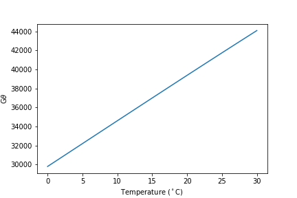
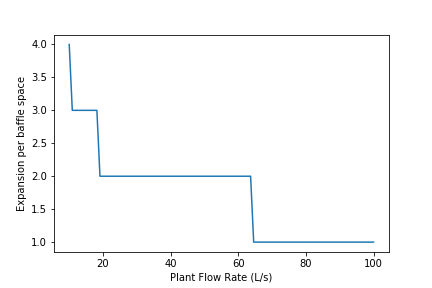
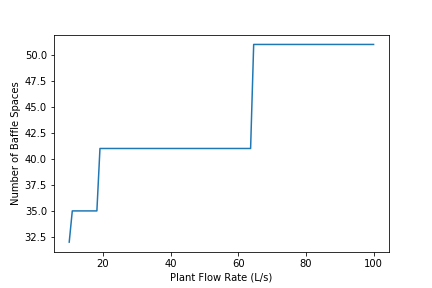
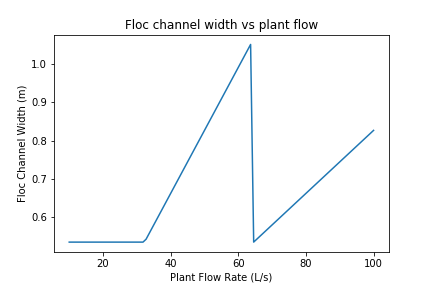

.. raw:: html

    <embed>
       <link rel="canonical" href="https://aguaclara.github.io/Textbook/Flocculation/Floc_Design_Solution.html" />
       
    </embed>

***************************
Flocculator Design Solution
***************************

`Be sure to run all imports before viewing the code <https://colab.research.google.com/drive/1HhsaTHEzVKtkoiCQF-XnD0ssGJ93DsXn#scrollTo=QrnYxdOGmQ0x&line=3&uniqifier=1>`_

In this design challenge you will design a vertical flow hydraulic flocculator. You will use the flow rate of ``flow_plant = 20 L/s`` as your default design value.

Although we don’t require that you use the nomenclature from the AguaClara variable naming guide, it provides a reasonable basis for organizing your variable names. We use the convention that the first part of the variable name describes the type of variable and always has a unique dimension. The subsequent parts of the variable name start from the big picture and slowly add more and more detail to arrive at the precise component that you are describing. Thus space_floc_baffle is the spacing between baffles in the flocculator and n_floc_channel_baffle should be the number of baffles in a flocculator channel. width_floc_channel_port should be the width of the port connecting two flocculator channels.

**In this design challenge we will use functions to calculate each step of the design. Whenever we need to access a previously calculated result we will use the function call to access that value. Using this method of nested function calls will make the entire design be only a function of a few input parameters.** This makes it possible to have flexible design code and ease the creation of new plant designs.

The minimum input parameters to define a flocculator are (flow_plant, headloss_floc_BOD, Gt_BOD, T_BOD). We could have included a longer list of input parameters (height_floc_end, width_PC_sheet, K_e, etc.) to make our functions even more general. But to keep our code more concise we will focus on only 4 of the input parameters. This will make it possible to easily change the input parameters to obtain new designs. We will use this capability to plot the results of varying the design flow rate.

Hydraulic Vertical flow flocculator Design
==========================================

This challenge is design a hydraulic flocculator using the core concepts of the AguaClara design methodology.

`Here are the inputs for the design. <https://colab.research.google.com/drive/1HhsaTHEzVKtkoiCQF-XnD0ssGJ93DsXn#scrollTo=HsR9iOQUmTbu&line=5&uniqifier=1>`_ BOD stands for Basis Of Design.

Design Algorithm Steps
----------------------

1. Calculate the total volume of flocculator given head loss and collision potential
2. Calculate the number of channels by taking the total width and dividing by the maximum channel width
3. Calculate the channel width (total width over number of channels)
4. Calculate the minimum number of obstacles and spacing between obstacles by assuming a maximum H/S ratio
5. Use the actual H/S ratio based on obstacle spacing to calculate the spacing between baffles
6. Calculate the obstacle width to obtain the same jet expansion conditions as produced by the 180 degree bend.

This algorithm does not yet handle the integer number of baffles in a channel or the thickness of the baffles

For this assignment **create functions for each question** and then use those function calls whenever that calculation result is required in a subsequent step. Include flow_plant, headloss_floc_BOD, Gt_BOD and T_BOD as the inputs that can be varied for each function.

**Whenever you reference a previously calculated value in a function, use the function call for that value so that dependency is not broken.**

That way you will be able to easily vary any of the three main input parameters (flow, Gt, head loss) to see their effect on the design.

**1) Estimate the average velocity gradient** of a flocculator given head loss and collision potential. I’m going to solve this problem for you so you see how to use function calls.

`See flocculator design solution here <https://colab.research.google.com/drive/1HhsaTHEzVKtkoiCQF-XnD0ssGJ93DsXn#scrollTo=btxgm0xvmw7M&line=2&uniqifier=1>`_

The average velocity gradient of flocculator is 93.24 / second

**2) Estimate the residence time** of flocculator given the target head loss and collision potential. (Note that this ignores the decrease in water depth caused by head loss. We hope to improve this design process further in the near future.)

`See solution here <https://colab.research.google.com/drive/1HhsaTHEzVKtkoiCQF-XnD0ssGJ93DsXn#scrollTo=K4M3_Qaxm4OZ&line=2&uniqifier=1>`_

    print ('The residence time of flocculator is', t_floc_est(headloss_floc_BOD, Gt_BOD, T_BOD))

The residence time of flocculator is 396.8 second

**3) Plot :math:`G\theta` as a function of the operating temperature** given the head loss and residence time for this design. In this step you are assuming that you have built this hydraulic flocculator and you want to see how the collision potential, :math:`G\theta`, varies with temperature of operation. Vary the temperature from 0°C to 30°C. The following equation makes it clear that the velocity gradient originates from head loss that creates fluid deformation that is limited by viscosity.

.. math:: \bar G\theta =\sqrt {\frac{{g{h_e}\theta }}{\nu }}

`See the code to generate the plot <https://colab.research.google.com/drive/1HhsaTHEzVKtkoiCQF-XnD0ssGJ93DsXn#scrollTo=u-JpICEvm8OL&line=4&uniqifier=1>`_

.. _figure_Gtheta_vs_temperature:

   The :math:`\bar G\theta` delivered by a flocculator increases with temperature. Note that the apparent linearity of this graph is because the inverse of the square root of kinematic viscosity varies linearly with temperature over this range!

**4) The Equation :eq:`pClam` creates the link** between :math:`\bar G \theta` and flocculator performance. What does the floc model and :numref:`figure_Gtheta_vs_temperature` tell you about flocculator performance and flocculator design? Explain why performance varies with temperature. Explain how temperature influences collisions between particles. What temperature should be used to design flocculators?

Flocculator performance improves with warmer temperatures because the fluid deforms more given the same input energy. The fluid deforms more because it is less viscous at higher temperatures. Flocculators should be designed to perform well based on the coldest operating temperature that they will encounter.

**5) Calculate the volume of flocculator.** Note that this volume does not take into account the extra volume that flocculator will have due to the changing water level caused by the head loss. Simply estimate the volume based on the residence time and the flow rate.

`Determine the volume <https://colab.research.google.com/drive/1HhsaTHEzVKtkoiCQF-XnD0ssGJ93DsXn#scrollTo=yKbX8NzxnCAx&line=2&uniqifier=1>`_

The volume of flocculator is 7.936 meter ** 3

**6) Calculate the actual length** of the flocculator channels. This must meet two constraints. First, it must be less than or equal to the maximum channel length. Second, the channel length is limited by the flocculator volume, height, minimum number of channels, and minimum width of the channels. This second constraint is important for low flow rates so that the flocculator has the correct target volume. Make sure to use this floc channel length in subsequent calculations.

`Calculat the channel length <https://colab.research.google.com/drive/1HhsaTHEzVKtkoiCQF-XnD0ssGJ93DsXn#scrollTo=Q9e2Z2FVnG4K&line=1&uniqifier=1>`_

The maximum channel length is 3.719 meters.

**7) Calculate the combined total width** of the flocculator channels (not including walls) based on the given length and depth.

`Calculate the width <https://colab.research.google.com/drive/1HhsaTHEzVKtkoiCQF-XnD0ssGJ93DsXn#scrollTo=YFINBYZynKaE&line=4&uniqifier=1>`_

The total width of the flocculator channels is is 1.067 meters.

**8) Calculate the minimum channel width** required to achieve H/S>3. The channel can be wider than this, but this is the absolute minimum width for a channel. The minimum width occurs when there is only one expansion per baffle and thus the distance between expansions is the same as the depth of water at the end of the flocculator.

:math:`{W_{min}} = \frac{{\Pi _{HS}}Q}{H_e}{\left( {\frac{K_e}{2{H_e}\nu {\bar G}^2}} \right)^{\frac{1}{3}}}`

`Calculate the minimum width <https://colab.research.google.com/drive/1HhsaTHEzVKtkoiCQF-XnD0ssGJ93DsXn#scrollTo=r5K7ayIQnM_I&line=3&uniqifier=1>`_

The minimum channel width is 11.64 centimeters.

**9) What is the minimum channel width** given the additional constraint that must be built by humans? Use the max function to find the true minimum channel width given both constraints.

`Calculate the practical minimum width <https://colab.research.google.com/drive/1HhsaTHEzVKtkoiCQF-XnD0ssGJ93DsXn#scrollTo=qAn6NgRdnQmv&line=3&uniqifier=1>`_

The minimum channel width is 0.5335 meter.

**10) Calculate the number of channels** by taking the total flocculator width (see step 7) and dividing by the minimum channel width (round down). Include the requirement that the number of channels must be even (Use the numpy floor function - look it up!). To make this function robust, make sure that it can’t ever return zero channels (the max function might be useful here)! You can convert the float to an integer with the int() function.

`Calculate the number of channels <https://colab.research.google.com/drive/1HhsaTHEzVKtkoiCQF-XnD0ssGJ93DsXn#scrollTo=oORz6cGhnRhK&line=4&uniqifier=1>`_

There are 2 channels.

**11) Calculate the actual channel width** based on the number of channels and the total flocculator width.

`Calculate the actual width <https://colab.research.google.com/drive/1HhsaTHEzVKtkoiCQF-XnD0ssGJ93DsXn#scrollTo=FFx1TDcinUMT&line=4&uniqifier=1>`_

The actual flocculator channel width is 53.35 centimeter

**12) Calculate** the *maximum* distance between expansions. This occurs for the largest allowable H/S ratio. Note that this isn’t accounting for the integer requirement for the number of baffle spaces per channel yet.

.. math::

  {H_{{e_{max}}}} = {\left[ {\frac{{{K_e}}}{{2\nu {{\bar G}^2}}}{{\left( {\frac{{Q{\Pi _{H{S_{max}}}}}}{W}} \right)}^3}} \right]^{\frac{1}{4}}}

`Find the maximum distance <https://colab.research.google.com/drive/1HhsaTHEzVKtkoiCQF-XnD0ssGJ93DsXn#scrollTo=wzCaYvVSnY3Q&line=5&uniqifier=1>`_

The maximum distance between expansions 1.074 meters.

**13) Calculate the minimum number of expansions per baffle space.**

`Find the minimum number of expansions <https://colab.research.google.com/drive/1HhsaTHEzVKtkoiCQF-XnD0ssGJ93DsXn#scrollTo=NOqKB2Iwnbgg&line=3&uniqifier=1>`_

The number of expansions is 2.

**14) Calculate the actual distance between expansions** given the integer requirement for the number of expansions per flocculator depth.

`Find the actual distance <https://colab.research.google.com/drive/1HhsaTHEzVKtkoiCQF-XnD0ssGJ93DsXn#scrollTo=Xq_jOoUJne2t&line=3&uniqifier=1>`_

The actual distance between expansions is 1 meter.

**15) Calculate the spacing between baffles** based on the target velocity gradient using :eq:`Floc_baffle_spacing_of_K`.

`Find the baffle spacing <https://colab.research.google.com/drive/1HhsaTHEzVKtkoiCQF-XnD0ssGJ93DsXn#scrollTo=pWb4aEgFnhZe&line=6&uniqifier=1>`_

The spacing between baffles is 0.1832 meter.

**16) How many baffle spaces would fit** in the channel(s) given the length of the flocculator and the baffle spacing? Round to the nearest integer.

`Find the number of baffle spaces <https://colab.research.google.com/drive/1HhsaTHEzVKtkoiCQF-XnD0ssGJ93DsXn#scrollTo=fPjTwCB9r8SP&line=3&uniqifier=1>`_

The number of baffle spaces that would fit in the channels is 41

**17) How many baffle spaces are needed** to create the required collision potential? Note that this isn’t necessarily the same number as found in Problem 16. Calculating the collision potential per baffle space is the advised first step.

`Calculate the number of baffles needed <https://colab.research.google.com/drive/1HhsaTHEzVKtkoiCQF-XnD0ssGJ93DsXn#scrollTo=MyLau92XnkxF&line=6&uniqifier=1>`_

The collision potential (Gt) per baffle space is 944 dimensionless. The minimum number of baffles required is 41

**18) Do the two estimates of the number of baffle spaces agree?**

Yes.

**19) Calculate the average velocity** of the water in the flocculator. This is the velocity after the flow has expanded through each baffle/obstacle.

`Calculate average velocity <https://colab.research.google.com/drive/1HhsaTHEzVKtkoiCQF-XnD0ssGJ93DsXn#scrollTo=b5T9L7tZsAHP&line=5&uniqifier=1>`_

The average velocity of the water in the flocculator is 0.2046 meter / second

**20) Calculate the depth of water** at the beginning of the flocculator based on the design head loss.

`Find the depth of water <https://colab.research.google.com/drive/1HhsaTHEzVKtkoiCQF-XnD0ssGJ93DsXn#scrollTo=DclI0a4asC0x&line=1&uniqifier=1>`_

The depth of the water at the beginning of the flocculator is 2.4 meter

**21) Estimate the residence time** in the hydraulic flocculator taking head loss into account. It is okay if your estimate doesn’t capture all of the details of the flocculator. You don’t need to account for the volume of the baffles. Simply account for the added water due to head loss. You can approximate the extra depth as a triangle.

`Determine the residence time <https://colab.research.google.com/drive/1HhsaTHEzVKtkoiCQF-XnD0ssGJ93DsXn#scrollTo=nV_MCM7gsE_s&line=1&uniqifier=1>`_

The residence time in the hydraulic flocculator is 7.275 minutes.

**22) Create plots** showing number of channels, number of expansions per water depth, total number of baffles, and channel width for a flow range from 10-100 L/s. Note that the functions that we created in this design challenge are not able to handle arrays as inputs. Use ``for`` loops to create the numpy arrays of y data needed for these graphs. Use 100 points to define each plot. Remember to initialize the numpy arrays before

`See how the plots are created here <https://colab.research.google.com/drive/1HhsaTHEzVKtkoiCQF-XnD0ssGJ93DsXn#scrollTo=CCtncYrXsHPN&line=11&uniqifier=1>`_

.. _figure_Expansions_per_baffle_space_vs_plant_flow:

   The number of expansions per baffle space decreases rapidly with flow rate. These results are a function of the flocculator depth and of the target head loss used for the design.

.. _figure_Number_of_channels_vs_plant_flow:

.. figure:: ../Images/Number_of_channels_vs_plant_flow.png
   :width: 400px
   :align: center
   :alt: Number of channels vs plant flow

   The number of channels is less than 2 for a wide range of flows. This is because the required residence time in the flocculator is so low. We may eventually want to create a design that makes it possible to have an odd number of flocculator channels so that we can use a single channel for low flow rates.

.. _figure_Number_of_baffle_spaces_vs_plant_flow:

   The number of baffle spaces is lower for low flow rates because those flocculators have additional expansions. At high flow rates the number of baffles spaces increases because the residence time per baffle space decreases. The residence time per baffle space decreases when the number of channels jumps from 2 to 4.

.. _figure_Floc_channel_width_vs_plant_flow:

   The flocculator channel width varies linearly with flow rate for a constant number of channels. The exception is for flows below about 35 L/s. In that flow rate the requirement of 2 channels that are the length of the clarifier is excessive and results in more collision potential than needed. We need a new design solution to handle this suboptimal design for flows lower than 35 L/s.

**23) Read from the graphs to determine:**

#. At what flow rate is it no longer necessary to add extra obstacles in the flocculator?
#. At what flow rate does the flocculator switch from 2 channels to 4 channels?
#. **Why** did the flocculator switch from 2 to 4 channels?
#. No obstacles are needed for flows greater than about 65 L/s.
#. The flocculator switches from 2 to 4 channels at 65 L/s.
#. The channels had reached their maximum width at that flow rate.

**24) Change Gt_BOD to 20,000 and run the code again.** Identify at least 3 changes in the design.

#. The number of channels would be 2 for all of the flows explored here.
#. The value of G increased.
#. The spacing between baffles decreased.
#. The flow expansions became closer together (because the spacing between baffles decreased).
#. The number of baffles decreased.
