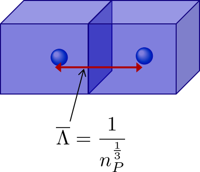
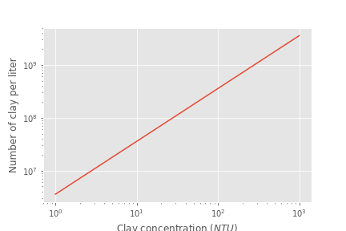
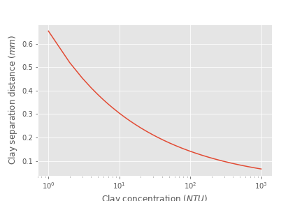

.. _title_Flocculation_Introduction:

************
Introduction
************

Flocculation transform inorganic (clays such as `kaolinite, smectite, etc. and metallic oxy-hydroxides such as goethite and gibbsite <https://www.sciencedirect.com/science/article/pii/S0048969708010103>`_) and organic (viruses, bacteria and protozoa) primary particles into flocs (particle aggregates). Flocculation doesn’t remove any particles from suspension. Instead it causes particle aggregation and then floc blankets, lamellar sedimentation, and sand filtration will be used to separate those flocs from the water. Sedimentation can remove flocs more easily than it can remove primary particles because flocs have a higher terminal sedimentation velocity. Floc blankets and sand filtration rely primarily on capture based on interception and interception is much more efficient when the particles are larger. Thus the purpose of flocculation is to join **all** of the primary particles together into flocs (See movie in :numref:`figure_Collisions_in_Sequence`).

.. _figure_Collisions_in_Sequence:

.. figure:: ../Images/Collisions_in_Sequence.png
   :target: https://youtu.be/NIgP56htShw
   :width: 400px
   :align: center
   :alt: Random walk toward a collision

   Clay particles with attached coagulant nanoparticles collide due to fluid deformation. They grow in size quickly. The challenge is to catch the last few primary particles that failed to participate in the aggregation process.

History of Flocculation
========================

Historically flocculation was assumed to involve collisions between all particles in the suspension. The Smoluchowski coagulation equation was published in 1916 and uses a population balance approach to track the number of particles of each size based on the probability of collisions between all possible combinations of particle sizes. The Smoluchowski equation is a statement of the conservation of mass and as such it certainly applies to flocculation in drinking water treatment plants. The challenge is that the probability of collisions between all possible combinations of particle sizes must be somehow known in order to use the model. The complexity of obtaining the collision probabilities and the complexity of solving the equation have preventing use of the Smoluchowski equation for design or operation of flocculators.

For most of the past century there have been two explanations for the particle interactions during flocculation based on the addition of a coagulant. The first explanation was that the positive charge of the coagulant neutralizes the negative charge of naturally occurring particles and thus eliminates the electrostatic repulsion that was preventing aggregation. The second explanation was called sweep flocculation and was the catch all explanation that was used to describe observations that didn't fit the charge neutralization explanation. Particles were presumed to be swept into a mesh of coagulant precipitate at coagulant dosages that are typically used in drinking water treatment.

The mechanism of particle-particle aggregation was thought to be controlled by the average surface charge. Unfortunately no one was able to develop a model of how that mechanism would influence particle attachment efficiency and no predictive models for flocculation were developed. Indeed, there were several observations that were at odds with the charge neutralization hypothesis.

    1. Flocculation was observed to be efficient even at coagulant dosages that led to positive surface charge. This unexpected result was attributed to “sweep floc”.
    2. Flocculation began to be effective even when the surface charge was still negative.
    3. Flocculation time for highly turbid suspensions was expected to proceed very rapidly and produce very low turbidity settled water. This expectation was not observed and led to the hypothesis that flocs were continually breaking up and producing primary particles or at least very small flocs.
    4. The floc break up hypotheses led to the expectation that high turbidity suspensions would have significantly higher settled water turbidity than low turbidity suspensions. This expectation was also not observed.
    5. The coagulant precipitate self aggregates – this is inconsistent with the positive charge that the electrostatic hypothesis asserts will prevent aggregation
    6. Electrostatic repulsion extends only a few nm from the surface of a particle – and the coagulant nanoparticles are many times larger than the reach of the repulsive electrostatic force. Thus there is no need to neutralize surface charge when using coagulant nanoparticles.
    7. Charge neutralization explanation neglects to fully account for the presence of water in the system. Water molecules will also be attracted to surfaces by London van der Waals forces and thus there will be competition between particle-particle bonds and water-particle bonds. Thus eliminating repulsion is NOT sufficient to produce a bond between the particles. It is also necessary for the particle-particle bonds to be stronger than the water-particle bonds. (see `hydration repulsion, page 21 <https://vtechworks.lib.vt.edu/bitstream/handle/10919/30137/Chapter1.pdf?sequence=9>`__) ` "The theory of DLP was a great step forward in that it appeared to circumvent the whole intractable problem of many body forces through its use of measured bulk dielectric response functions. However, it must be stressed again that it is a perturbation theory. That is, it depends on the assumption that an intervening liquid between interacting surfaces has bulk liquid properties up to a molecular distance from the surfaces. This is thermodynamically inconsistent, being equivalent to the statement that surface energies (or alternatively, the positions of the Gibbs dividing surfaces) are changed infinitesimally with distance of separation. This limits the theory to large distances (Young–Laplace vs. Poisson again) where large is undefined." <https://doi.org/10.1016/S0001-8686(99)00008-1>`__

Evidence that the charge neutralization hypothesis doesn’t explain flocculation of surface waters has been accumulating for decades. *Sweep* flocculation has been proposed as an alternative "mechanism" that described common observations that didn’t fit the charge neutralization hypothesis. However, similar to the charge neutralization hypothesis, the *sweep* hypothesis didn’t result in the development of predictive equations to describe the process.

For example, in 1992 Ching, Tanaka, and Elimelech published their research on `Dynamics of coagulation of kaolin particles with ferric chloride <https://doi.org/10.1016/0043-1354(94)90007-8>`__. They found that the electrophoretic mobility, a measure of the clay particle surface charge, was never neutralized at pH 7.8 and was neutralized at :math:`10\mu M` at pH 6.0. The results were interpreted by the authors to mean that some combination of sweep floc and charge patchiness was responsible for the observed results.

See :numref:`figure_Ching_Electrophoretic_Mobility_vs_Ferric_Chloride` showing that at pH 7.8 the ferric chloride was still negatively charged and yet succeeded in flocculating the suspension to almost the same extent as the ferric chloride at ph 6.0 that was positively charged (see :numref:`figure_Ching_Residual_Turbidity_vs_Ferric_Chloride`).

.. _figure_Ching_Electrophoretic_Mobility_vs_Ferric_Chloride:

.. figure:: ../Images/Ching_Electrophoretic_Mobility_vs_Ferric_Chloride.png
    :width: 300px
    :align: center
    :alt: internal figure

    `Electrophoretic Mobility for final pH <https://doi.org/10.1016/0043-1354(94)90007-8>`__ (after coagulant addition) of 6.0 and 7.8 as a function of :math:`FeCl_3` dose

.. _figure_Ching_Residual_Turbidity_vs_Ferric_Chloride:

.. figure:: ../Images/Ching_Residual_Turbidity_vs_Ferric_Chloride.png
    :width: 300px
    :align: center
    :alt: internal figure

    `The settled water turbidity was almost independent of pH even though the electrophoretic mobility was quite different for the two pH values tested <https://doi.org/10.1016/0043-1354(94)90007-8>`__.

`At pH 6.0 the ferric hydroxide precipitates are positively charged and at pH 7.8 they are close to neutral <https://doi.org/10.1016/0043-1354(94)90007-8>`__. Thus it is apparent that neutralization of the clay surface charge can not explain these results.

Polymers
========

Synthetic polymers often made with repeating units of acrylic acid and its derivatives are used to aid flocculation by bridging between particles. For polymer bridging to occur the polymer chains must be able to span the length scale of double-layer repulsion. The thickness of the diffuse layer is about 10 nm at an ionic strength of 1 mM (Coagulants and Flocculants: Theory & Practice by Yong Kim, 1995). The length of linear polymers ranges from 100 to 1500 nm (`Table 3 of Ying and Chu, 1987 <https://doi.org/10.1021/ma00168a023>`_) and thus both synthetic polymers and coagulant nanoparticles can easily span the length scale of double-layer repulsion.

The shortest synthetic polymers are similar in size to the coagulant nanoparticles and the longest synthetic polymers are similar in length to bacteria. These polymers could create additional connections between primary particles and coagulant nanoparticles or they could connect primary particles. In either case the polymers can add connections (more bonds!) that likely have some elasticity and thus there can be more than 3 bonds connecting two particles.

Polymers undoubtedly increase the connections that bind flocs together and thus enable flocs to grow larger. The stronger flocs created by polymer addition may have unintended consequences in subsequent treatment steps. Large strong flocs are great for improved removal in plate or tube settlers. In sedimentation tanks with floc blankets they may form sludge that is more difficult to suspend after a brief shutdown. In filters it is possible that large flocs are more rigid and fail to enter the pore spaces of the filter. Thus the use of polymers may require using large media size for depth filtration. The polymers may also form mudballs in granular filters and thus require more aggressive washing.

Flocculation Theory
====================

Particle aggregation is the fundamental mechanism that facilitates ultra low energy and low cost removal of particles and pathogens from water. Aggregation requires successful collisions. Success is defined by particles  attaching when they collide.

Sticky Coagulant Nanoparticles
------------------------------

Prior to the AguaClara flocculation model it was widely assumed that attachment was made possible by reducing the net surface charge of the particles. The AguaClara flocculation model is based on the understanding that coagulant nanoparticles are sticky and are much larger than the length scale of the repulsive forces due to surface charges. Thus surface charge is largely irrelevant and this explains why particle aggregation begins even with very low dosages of coagulant.

Particles Follow Fluid
----------------------

The collisions are caused by particles having relative motion due to fluid deformation. Particle trajectories can be different from the fluid trajectory if the density of the fluid and the particle are significantly different and if the viscous effects are small compared with inertial effects (the Stokes number). The motion of primary particles and small flocs in surface water treatment have low Stokes numbers and follow the fluid trajectory.

Long Range Transport
--------------------

We need to calculate the rate of primary particle collisions. In turbulent flow flocculators the fluid deformation is caused by turbulent eddies that lose their energy to viscosity. The relative motion of particles would appear somewhat random as the small eddies have ever changing orientation and intensity. The result is that primary particles take a long meandering path before they finally approach each other and connect in a final collision. The path of relative motion prior to the collision can be thought of as having two distinct components.

 - The first component is long range transport when the particles are far apart with a separation distance that is proportional to the average distance between particles.
 - The second component is the short range transport at length scales less than the average particle separation distance to the final collision

The AguaClara flocculation model assumes a relatively high velocity and long distance random walk clearing a volume of fluid equal to the volume occupied by a single particle. This is followed by a slow, short, straight walk toward a collision. The insight that the long range transport is the rate limiting step will be used to estimate the time required for particle collisions.

Primary Particle Attachment
---------------------------

In our early modeling work we assumed that collisions between primary particles and large flocs were favorable. This assumption led to the prediction that the highest quality water should be obtained when the raw water has the highest turbidity. That prediction is inconsistent with observations and led to the insight that during flocculation, primary particles are only able to collide successfully with other primary particles (or potentially with other very small flocs).

The only transport mechanism that could cause a clay particle to collide with a large floc is the fluid deformation caused by the linear velocity gradient. In our flocculators that linear velocity gradient is caused by turbulent eddies at much larger scales of the flow. We hypothesize that primary particles can not attach to large flocs because primary particles can not collide with large flocs! To understand why this collision is impossible, we need a simple insight.

The insight is that the large flocs drag fluid around as they rotate (due to the linear velocity gradient). The viscous layer around the large flocs creates a flow field in which there is no location far from the flocs that will eventually approach the surface of the flocs or even approach within the clay particle radius. If this is correct, then clay particles never collide with large flocs in a linear velocity gradient flow field.

.. todo:: Find evidence that proves or disproves the hypothesis that no collisions occur between dissimilar sized particles in a linear velocity gradient.

Viscous Shear Dominates
-----------------------

Relative velocities between particles are dominated by viscous shear because the separation distances are smaller than the inner viscous length scale. The average particle separation distance is given by

.. math::
  :label: eq_spacing_of_number_concentration

   \bar \Lambda  = \frac{1}{n_P^{\frac{1}{3}}} = {\rlap{-} V_{\rm{Surround}}}^\frac{1}{3}

| Where:
| :math:`\bar \Lambda` is the average separation distance
| :math:`n_P` is the number of particles per volume of suspension
| :math:`{\rlap{-} V_{\rm{Surround}}}` is the suspension volume occupied by one particle

The number concentration of particles is given by

.. math::
  :label: eq_number_concentration_of_diameter

   n_P = \frac{C_P}{\rlap{-} V_P \rho_P} = \frac{6}{\pi \bar{d_P}^3} \frac{C_P}{\rho_P}

| Where:
| :math:`C_P` is the particle concentration
| :math:`\rlap{-} V_P` is the volume of a single particle
| :math:`\rho_P` is the particle density
| :math:`\bar{d_P}` is the average particle diameter

Equations :eq:`eq_spacing_of_number_concentration` and :eq:`eq_number_concentration_of_diameter` can be combined to obtain the relationship between separation distance and particle diameter.

.. math::
  :label: eq_spacing_of_diameter

   \bar \Lambda  = \frac{1}{n_P^{\frac{1}{3}}} =  \bar{d_P} \left(\frac{\pi}{6}\frac{\rho_P}{C_P}\right)^{\frac{1}{3}}

.. _figure_Particle_separation:

   The average particle separation distance is defined as the distance between centers of cubes that each contain the volume of the suspension occupied by a single particle.

Particle separation distance matters because it determines which transport mechanisms are at play when two particles approach for a collision. The particle separation distance is a function of the particle concentration. Surface water treatment plants commonly treat water with turbidity between 1 and 1000 NTU. We will first find the number of clay particles per liter in typical raw water suspensions.

.. code:: python

  import aguaclara
  import aguaclara.core.physchem as pc
  from aguaclara.core.units import unit_registry as u
  import aguaclara.core.constants as con
  import aguaclara.research.environmental_processes_analysis as epa
  import aguaclara.research.floc_model as fm

  import numpy as np
  import matplotlib.pyplot as plt

  C_Clay = np.arange(1,1000,1)*u.NTU
  n_Clay = fm.num_clay(C_Clay,fm.Clay)
  fig, ax = plt.subplots()
  ax.loglog(C_Clay.to(u.NTU),n_Clay.to(1/u.L))
  ax.set(xlabel='Clay concentration ($NTU$)', ylabel='Number of clay per liter')
  fig.savefig('../Images/NClay_vs_CClay')
  plt.show()

.. _figure_NClay_vs_CClay:

   Diagram of number of clay particles per liter as a function of the clay concentration. Note that even 1 NTU water has millions of primary particles per liter.

The next step is to calculate the separation distance between the clay particles over this range of clay concentrations using Equation :eq:`eq_spacing_of_diameter`.

.. code:: python

  import aguaclara.core.physchem as pc
  from aguaclara.core.units import unit_registry as u
  import aguaclara.core.constants as con
  import aguaclara.research.environmental_processes_analysis as epa
  import aguaclara.research.floc_model as fm

  import numpy as np
  import matplotlib.pyplot as plt
  lamda_Clay = fm.sep_dist_clay(C_Clay,fm.Clay)
  fig, ax = plt.subplots()
  ax.semilogx(C_Clay.to(u.NTU),lamda_Clay.to(u.mm))
  ax.set(xlabel='Clay concentration ($NTU$)', ylabel=r'Clay separation distance ($mm$)')
  fig.savefig('../Images/LambdaClay_vs_CClay')
  plt.show()

.. _figure_LambdaClay_vs_CClay:

   The clay separation distance varies with the cube root of the concentration and thus varies over a relatively narrow range (0.07 mm to 0.7 mm) while the turbidity varies from 1 to 1000 NTU.

Given this range of particle separation distances the next question is whether transport of these particles relative to each other is driven by inertial or viscous dominated processes. Turbulent eddies devolve into smaller and smaller eddies until viscosity finally kills them. Viscosity damps out the effects of inertia at the inner viscous length scale.  Higher intensity turbulence can generate more energetic small eddies and can resist the effects of viscosity longer. Thus the inner viscous length scale decreases as the turbulent energy dissipation rate increases.

The Camp-Stein velocity gradient used for flocculators varies from about 20 to 300 Hz. We will convert the Camp-Stein velocity gradient to an energy dissipation rate using

.. math::

   G_{CS} = \sqrt{\frac{\bar \varepsilon}{\nu}}

Solving for the average energy dissipation rate, :math:`\bar \varepsilon`, we obtain

.. math::

  \bar \varepsilon = \nu G_{CS}^2

We will use the inner viscous length scale, Equation :eq:`eq_inner_viscous_length` to determine whether viscous or inertial transport dominates particle collisions in surface water treatment given the range of particle separation distances (see :numref:`figure_LambdaClay_vs_CClay`).

.. code:: python

  import aguaclara.core.physchem as pc
  from aguaclara.core.units import unit_registry as u
  import aguaclara.core.constants as con
  import aguaclara.research.environmental_processes_analysis as epa
  import aguaclara.research.floc_model as fm

  import numpy as np
  import matplotlib.pyplot as plt
  Temperature = 20 * u.degC
  G=np.arange(1,1000,1)*u.Hz
  EDR = G**2 * pc.viscosity_kinematic(Temperature)
  Inner_viscous = fm.lambda_vel(EDR, Temperature)
  fig, ax = plt.subplots()
  ax.semilogx(G.to(u.Hz),Inner_viscous.to(u.mm))
  ax.set(xlabel='Velocity gradient (Hz)', ylabel='Inner viscous length scale (mm)')
  ax.text(10, 30, 'Eddies cause mixing', fontsize=12,rotation=-30)
  ax.text(3, 14, 'Viscous shear', fontsize=12,rotation=-30)
  fig.savefig('../Images/innerviscous_vs_G')
  plt.show()

.. _figure_innerviscous_vs_G:

.. figure:: ../Images/innerviscous_vs_G.png
   :width: 400px
   :align: center
   :alt: inner viscous vs G

   The inner viscous length scale is approximately 3 to 10 mm for velocity gradients that are typically used in flocculators. Clay separation distances are smaller than the inner viscous length scale and thus viscous shear dominates particle collisions in flocculation.

By comparing :numref:`figure_LambdaClay_vs_CClay` and :numref:`figure_innerviscous_vs_G` it is apparent that the particle separation distances commonly found in surface water treatment plants are much smaller than the inner viscous length scale for all practical flocculation velocity gradients. Thus viscosity will dominate the flocculation process. This key insight reveals why turbulent flow flocculators have been designed using the dimensionless grouping :math:`G \theta` which is fundamentally :math:`\sqrt\frac{\epsilon}{\nu} \theta`. Given that flocculation is viscous dominated implies that the flocculation process will slow down as the temperature increases and the viscosity increases.

Modeling Particles
==================
