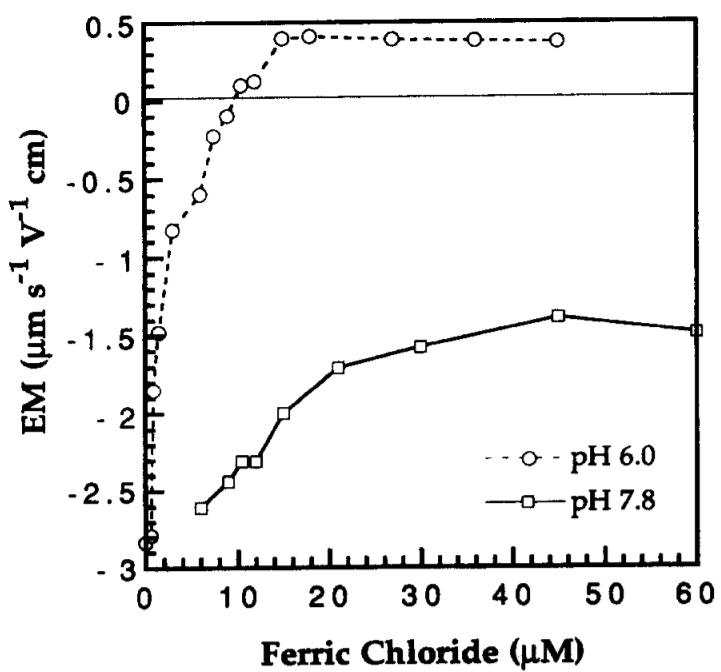

.. _title_Flocculation_Introduction:

**************************
Flocculation Introduction
**************************

Flocculation
============

Flocculation transform inorganic (clays such as `kaolinite, smectite, etc. and metallic oxy-hydroxides such as goethite and gibbsite <https://www.sciencedirect.com/science/article/pii/S0048969708010103>`_) and organic (viruses, bacteria and protozoa) primary particles into flocs (particle aggregates). Flocculation doesn’t remove any particles from suspension. Instead it causes particle aggregation and then floc blankets, lamellar sedimentation, and sand filtration will be used to separate those flocs from the water. Sedimentation can remove flocs more easily than it can remove primary particles because flocs have a higher terminal sedimentation velocity. Floc blankets and sand filtration rely primarily on capture based on interception and interception is much more efficient when the particles are larger. Thus the purpose of flocculation is to join **all** of the primary particles together into flocs.

It is also possible that a difference in a physical property between primary particles and flocs plays a role in enhanced removal of flocs in floc blankets and filters. For example, the many relatively weak connection points between the primary particles in the flocs enables the flocs to deform. It is possible that deformation plays an important role right at the moment of collision. Presumably the bond strength required to lock the colliding particles together is less if the particles can deform as they are colliding.

Primary particles can’t attach to large flocs
---------------------------------------------

One of the mysteries of flocculation has been why it is such a slow process and yet it appears to be a very rapid process. Plant operators observe that with high raw water turbidities that they can see flocculation progressing after about 0.5 minutes of flocculation. We can estimate the collision potential, :math:`G\theta` that corresponds to making visible flocs.

.. math:: \bar G = \sqrt{ \frac{g h_e}{\theta \nu}}

.. code:: python

    from aide_design.play import*
    from aguaclara_research.play import*
    from pytexit import py2tex
    from sympy import*
    from scipy.optimize import root
    from scipy.optimize import brentq
    import pandas as pd
    HL_floc = 43*u.cm
    HRT = 8 * u.min
    Temperature =20 * u.degC
    G_floc = ((pc.gravity*HL_floc/(HRT*pc.viscosity_kinematic(Temperature)))**0.5).to_base_units()
    print(G_floc)
    Gt_floc = G_floc*HRT
    HRT_floc_visible = 0.5*u.min
    Gt_floc_visible = (G_floc*HRT_floc_visible).to_base_units()
    print(Gt_floc_visible)

Here initial flocculation is visible at a :math:`G\theta` of less than 3000. Given that flocculation is visible at this low collision potential, it is unclear why recommended :math:`G\theta` are as high as 100,000. This is one of the great mysteries that motivated the search for a flocculation model that was based on hypotheses that were consistent with laboratory and field observations.

History
=======

The mechanism of particle-particle aggregation was thought to be controlled by an average surface charge. Apparently no one was able to develop a model of how that mechanism would influence particle attachment efficiency and the result was that no predictive models for flocculation were developed. There were several observations that were at odds with conventional explanations of flocculation.
 1. Efficient flocculation at coagulant dosages that led to positive surface charge. This led to a second flocculation mechanism that was called “sweep floc” and that was used to describe any observations that didn’t fit the charge neutralization flocculation hypotheses
 1. Flocculation time for highly turbid suspensions was expected to proceed very rapidly and produce very low turbidity settled water. This expectation was not observed and led to the hypothesis that flocs were continually breaking up and producing primary particles or at least very small flocs.
 1. The floc break up hypotheses led to the expectation that high turbidity suspensions would have significantly higher settled water turbidity than low turbidity suspensions. This expectation was also not observed.

Evidence that the charge neutralization hypothesis doesn’t explain flocculation of surface waters has been accumulating for decades. *Sweep* flocculation has been proposed as an alternative "mechanism" that described common observations that didn’t fit the charge neutralization hypothesis. However, similar to the charge neutralization hypothesis, the *sweep* hypothesis didn’t result in the development of predictive equations to describe the process.

For example, in 1992 Ching, Tanaka, and Elimelech published their research on `Dynamics of coagulation of kaolin particles with ferric chloride <https://doi.org/10.1016/0043-1354(94)90007-8>`__. They found
that the electrophoretic mobility which is a measure of the clay particle surface charge was never neutralized at pH 7.8 and was neutralized at :math:`10\mu M` at pH 6.0. The results were interpreted by the authors to mean that some combination of sweep floc and charge patchiness was responsible for the observed results.

See :numref:`figure_Ching_Electrophoretic_Mobility_vs_Ferric_Chloride` for a typical mountain view.

.. _figure_Ching_Electrophoretic_Mobility_vs_Ferric_Chloride:

    `Electrophoretic Mobility for final pH <https://doi.org/10.1016/0043-1354(94)90007-8>`__ (after coagulant addition) of 6.0 and 7.8 as a function of :math:`FeCl_3` dose

.. _figure_Ching_Residual_Turbidity_vs_Ferric_Chloride:

.. figure:: Images/Ching_Residual_Turbidity_vs_Ferric_Chloride.png
    :width: 300px
    :align: center
    :alt: internal figure

    `The settled water turbidity was almost independent of pH even though the electrophoretic mobility was quite different for the two pH values tested <https://doi.org/10.1016/0043-1354(94)90007-8>`__.

`At pH 6.0 the ferric hydroxide precipitates are positively charged and at pH 7.8 they are close to neutral <https://doi.org/10.1016/0043-1354(94)90007-8>`__. Thus it is apparent that neutralization of the clay surface charge can not explain
these results.

`Figure x. Settled water turbidity (jar tests) for final pH (after coagulant addition) of 6.0 and 7.8. <https://doi.org/10.1016/0043-1354(94)90007-8>`__

Electrostatic charge neutralization hypothesis The coagulant precipitate self aggregates – this is inconsistent with the positive charge that the electrostatic hypothesis asserts will prevent aggregation \* Electrostatic repulsion extends only a few nm from the surface of a particle – and the coagulant adhesive nanoparticles are many times larger than the reach of the repulsive electrostatic force. The hypothesis that London van der Waals forces result in attachment neglects to account for the presence of water in the system. Water molecules will also be attracted to surfaces by London van der Waals forces and thus there will be competition between the coagulant and water. Thus eliminating repulsion is NOT sufficient to produce a bond between the particles. (see `hydration repulsion, page 21 <https://vtechworks.lib.vt.edu/bitstream/handle/10919/30137/Chapter1.pdf?sequence=9>`__) ` "The theory of DLP was a great step forward in that it appeared to circumvent the whole intractable problem of many body forces through its use of measured bulk dielectric response functions. However, it must be stressed again that it is a perturbation theory. That is, it depends on the assumption that an intervening liquid between interacting surfaces has bulk liquid properties up to a molecular distance from the surfaces. This is thermodynamically inconsistent, being equivalent to the statement that surface energies (or alternatively, the positions of the Gibbs dividing surfaces) are changed infinitesimally with distance of separation. This limits the theory to large distances (Young–Laplace vs. Poisson again) where large is undefined." <https://doi.org/10.1016/S0001-8686(99)00008-1>`__

#references `Coagulation and Flocculation in Water and Wastewater Treatment <https://www.iwapublishing.com/news/coagulation-and-flocculation-water-and-wastewater-treatment>`__,
iwapublishing
