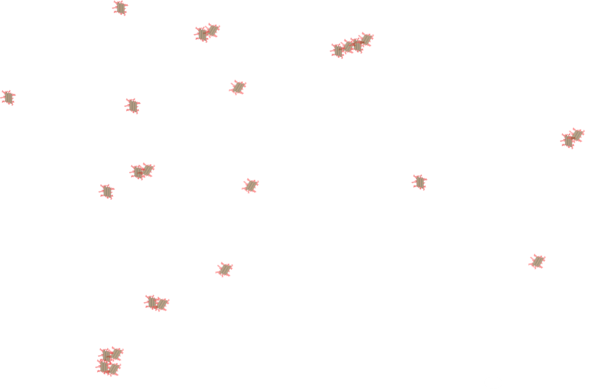

.. _title_Flocculation_Introduction:

************
Introduction
************

Flocculation transform inorganic (clays such as `kaolinite, smectite, etc. and metallic oxy-hydroxides such as goethite and gibbsite <https://www.sciencedirect.com/science/article/pii/S0048969708010103>`_) and organic (viruses, bacteria and protozoa) primary particles into flocs (particle aggregates). Flocculation doesn’t remove any particles from suspension. Instead it causes particle aggregation and then floc blankets, lamellar sedimentation, and sand filtration will be used to separate those flocs from the water. Sedimentation can remove flocs more easily than it can remove primary particles because flocs have a higher terminal sedimentation velocity. Floc blankets and sand filtration rely primarily on capture based on interception and interception is much more efficient when the particles are larger. Thus the purpose of flocculation is to join **all** of the primary particles together into flocs (See movie in :numref:`figure_Collisions_in_Sequence`).

.. _figure_Collisions_in_Sequence:

   Clay particles with attached coagulant nanoparticles collide due to fluid deformation. They grow in size quickly. The challenge is to catch the last few primary particles that failed to participate in the aggregation process.

History of Flocculation
========================

Historically flocculation was assumed to involve collisions between all particles in the suspension. The Smoluchowski coagulation equation was published in 1916 and uses a population balance approach to track the number of particles of each size based on the probability of collisions between all possible combinations of particle sizes. The Smoluchowski equation is a statement of the conservation of mass and as such it certainly applies to flocculation in drinking water treatment plants. The challenge is that the probability of collisions between all possible combinations of particle sizes must be somehow known in order to use the model. The complexity of obtaining the collision probabilities and the complexity of solving the equation have preventing use of the Smoluchowski equation for design or operation of flocculators.

For most of the past century there have been two explanations for the particle interactions during flocculation based on the addition of a coagulant. The first explanation was that the positive charge of the coagulant neutralizes the negative charge of naturally occurring particles and thus eliminates the electrostatic repulsion that was preventing aggregation. The second explanation was called sweep flocculation and was the catch all explanation that was used to describe observations that didn't fit the charge neutralization explanation. Particles were presumed to be swept into a mesh of coagulant precipitate at coagulant dosages that are typically used in drinking water treatment.

The mechanism of particle-particle aggregation was thought to be controlled by the average surface charge. Unfortunately no one was able to develop a model of how that mechanism would influence particle attachment efficiency and no predictive models for flocculation were developed. Indeed, there were several observations that were at odds with the charge neutralization hypothesis.

    1. Flocculation was observed to be efficient even at coagulant dosages that led to positive surface charge. This unexpected result was attributed to “sweep floc”.
    2. Flocculation began to be effective even when the surface charge was still negative.
    3. Flocculation time for highly turbid suspensions was expected to proceed very rapidly and produce very low turbidity settled water. This expectation was not observed and led to the hypothesis that flocs were continually breaking up and producing primary particles or at least very small flocs.
    4. The floc break up hypotheses led to the expectation that high turbidity suspensions would have significantly higher settled water turbidity than low turbidity suspensions. This expectation was also not observed.
    5. The coagulant precipitate self aggregates – this is inconsistent with the positive charge that the electrostatic hypothesis asserts will prevent aggregation
    6. Electrostatic repulsion extends only a few nm from the surface of a particle – and the coagulant nanoparticles are many times larger than the reach of the repulsive electrostatic force. Thus there is no need to neutralize surface charge when using coagulant nanoparticles.
    7. Charge neutralization explanation neglects to fully account for the presence of water in the system. Water molecules will also be attracted to surfaces by London van der Waals forces and thus there will be competition between particle-particle bonds and water-particle bonds. Thus eliminating repulsion is NOT sufficient to produce a bond between the particles. It is also necessary for the particle-particle bonds to be stronger than the water-particle bonds. (see `hydration repulsion, page 21 <https://vtechworks.lib.vt.edu/bitstream/handle/10919/30137/Chapter1.pdf?sequence=9>`__) ` "The theory of DLP was a great step forward in that it appeared to circumvent the whole intractable problem of many body forces through its use of measured bulk dielectric response functions. However, it must be stressed again that it is a perturbation theory. That is, it depends on the assumption that an intervening liquid between interacting surfaces has bulk liquid properties up to a molecular distance from the surfaces. This is thermodynamically inconsistent, being equivalent to the statement that surface energies (or alternatively, the positions of the Gibbs dividing surfaces) are changed infinitesimally with distance of separation. This limits the theory to large distances (Young–Laplace vs. Poisson again) where large is undefined." <https://doi.org/10.1016/S0001-8686(99)00008-1>`__

Evidence that the charge neutralization hypothesis doesn’t explain flocculation of surface waters has been accumulating for decades. *Sweep* flocculation has been proposed as an alternative "mechanism" that described common observations that didn’t fit the charge neutralization hypothesis. However, similar to the charge neutralization hypothesis, the *sweep* hypothesis didn’t result in the development of predictive equations to describe the process.

For example, in 1992 Ching, Tanaka, and Elimelech published their research on `Dynamics of coagulation of kaolin particles with ferric chloride <https://doi.org/10.1016/0043-1354(94)90007-8>`__. They found that the electrophoretic mobility, a measure of the clay particle surface charge, was never neutralized at pH 7.8 and was neutralized at :math:`10\mu M` at pH 6.0. The results were interpreted by the authors to mean that some combination of sweep floc and charge patchiness was responsible for the observed results.

See :numref:`figure_Ching_Electrophoretic_Mobility_vs_Ferric_Chloride` showing that at pH 7.8 the ferric chloride was still negatively charged and yet succeeded in flocculating the suspension to almost the same extent as the ferric chloride at ph 6.0 that was positively charged (see :numref:`figure_Ching_Residual_Turbidity_vs_Ferric_Chloride`).

.. _figure_Ching_Electrophoretic_Mobility_vs_Ferric_Chloride:

    `Electrophoretic Mobility for final pH <https://doi.org/10.1016/0043-1354(94)90007-8>`__ (after coagulant addition) of 6.0 and 7.8 as a function of :math:`FeCl_3` dose

.. _figure_Ching_Residual_Turbidity_vs_Ferric_Chloride:

.. figure:: ../Images/Ching_Residual_Turbidity_vs_Ferric_Chloride.png
    :width: 300px
    :align: center
    :alt: internal figure

    `The settled water turbidity was almost independent of pH even though the electrophoretic mobility was quite different for the two pH values tested <https://doi.org/10.1016/0043-1354(94)90007-8>`__.

`At pH 6.0 the ferric hydroxide precipitates are positively charged and at pH 7.8 they are close to neutral <https://doi.org/10.1016/0043-1354(94)90007-8>`__. Thus it is apparent that neutralization of the clay surface charge can not explain these results.

Polymers
========

Synthetic polymers often made with repeating units of acrylic acid and its derivatives are used to aid flocculation by bridging between particles. For polymer bridging to occur the polymer chains must be able to span the length scale of double-layer repulsion. The thickness of the diffuse layer is about 10 nm at an ionic strength of 1 mM (Coagulants and Flocculants: Theory & Practice by Yong Kim, 1995). The length of linear polymers ranges from 100 to 1500 nm (`Table 3 of Ying and Chu, 1987 <https://doi.org/10.1021/ma00168a023>`_) and thus both synthetic polymers and coagulant nanoparticles can easily span the length scale of double-layer repulsion.

The shortest synthetic polymers are similar in size to the coagulant nanoparticles and the longest synthetic polymers are similar in length to bacteria. These polymers could create additional connections between primary particles and coagulant nanoparticles or they could connect primary particles. In either case the polymers can add connections (more bonds!) that likely have some elasticity and thus there can be more than 3 bonds connecting two particles.

Polymers undoubtedly increase the connections that bind flocs together and thus enable flocs to grow larger. The stronger flocs created by polymer addition may have unintended consequences in subsequent treatment steps. Large strong flocs are great for improved removal in plate or tube settlers. In sedimentation tanks with floc blankets they may form sludge that is more difficult to suspend after a brief shutdown. In filters it is possible that large flocs are more rigid and fail to enter the pore spaces of the filter. Thus the use of polymers may require using large media size for depth filtration. The polymers may also form mudballs in granular filters and thus require more aggressive washing.

