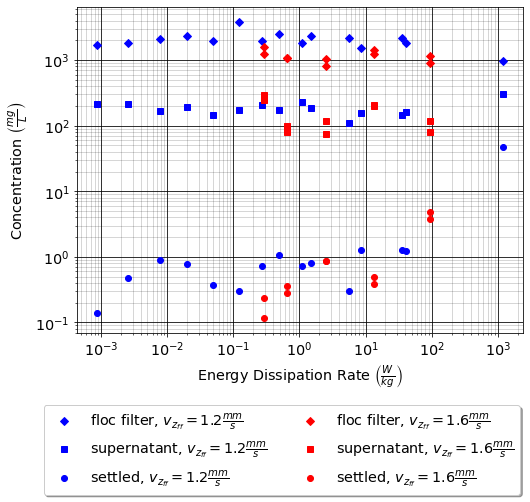

.. raw:: html

    <embed>
       <link rel="canonical" href="https://aguaclara.github.io/Textbook" />
       
    </embed>

.. _title_Flocs_Fractals_Forces_and_Fluidized_Suspensions_Introduction:

************************
Flocs, Fractals, Forces
************************

The physics of flocs, fractals, fluids, and forces define the processes of flocculation, floc filters, lamellar sedimentation, and filters. The chemical bonds that hold flocs together determine the maximum diameter that a floc can grow to in the fluid shear of a flocculator. The force of gravity is strong enough to break flocs and determines the maximum size that a floc can grow to on planet earth or, for that matter, in the floc filter that forms in the bottom of the AguaClara clarifiers. The maximum diameter that a floc can grow to without being pulled apart by gravity sets a maximum terminal velocity for flocs and that has direct implications for the maximum upflow velocity than can be used in upflow clarifiers.

The three forces of chemical bonds, gravity, and shear can be grouped into two dimensionless parameters that will define the relationships between floc size, floc density, and these forces.

Characteristic Core Particle
============================

The concept of a characteristic core particle that sets the floc properties as it moves through the process of the flocculation, floc filter, settlers, and filter arose with two AguaClara plants in Honduras that ran into difficulties treating water from pristine high elevation mountain water sources. In both cases the water was very low turbidity and was yellow from dissolved organics. The exact source of the color was not identified, but it was likely the decaying leaf litter from the forests.

The high concentration of dissolved organics in the raw water requires a significant dosage of coagulant and there is very little clay present. The result is a very low density floc made of organic matter that is close to the density of water and perhaps even less dense than water and coagulant nanoparticles. These low density flocs are not captured efficiently by the plate settlers. The challenge of treating these two water sources led to the insight that we could characterize the properties of a floc if we understood the characteristic density and size of the core particle that aggregates to form the flocs.

The algorithm to define the characteristic density and diameter of the core particle is still under development. Nonetheless, the density and diameter of the characteristic core particle that aggregates to form the flocs are the key parameters that determine the performance of each stage of the treatment process.

Fractal Flocs
=============

Flocs are fractals. Fractals describe structures in which similar patterns occur over a range of scales. During flocculation flocs grow larger and larger by combining similar sized flocs. Flocs do not combine like raindrops! As raindrops combine they conserve both volume and mass.  With each subsequent collision the floc incorporates more water and thus its density gradually approaches the density of water. The inclusion of more and more water as the floc grows means that the floc mass is NOT conserved as it grows. Likewise, the volume of the floc is not conserved as it grows.

When :math:`n_{raindrops}` of equal volume :math:`\rlap{-} V_0` combine the resulting volume is :math:`\rlap{-} V = \rlap{-} V_0 n_{raindrops}`. When flocs combine the equation is slightly more complicated.

.. math::
  :label: V_floc_of_n_cp

  \rlap{-} V_{floc} = \rlap{-} V_{cp} n_{cp}^\frac{3}{\Pi_{fractal}}

| Where
| :math:`\rlap{-} V_{floc}` is the floc volume
| :math:`n_{cp}` is the number of core particles in the floc
| :math:`\rlap{-} V_{cp}` is the core particle volume
| :math:`\Pi_{fractal}` is the floc volume-based fractal dimension

Raindrops conserve volume when they collide and have a :math:`\Pi_{fractal}` of 3. If a particle would conserve its projected area when it combines, then it would have a :math:`\Pi_{fractal}` of 2. If a particle would conserve its diameter when it combines, then it would have a :math:`\Pi_{fractal}` of 1. A fractal dimension of 1 could occur if the particles all attached into a single long chain.

The fractal dimension of the resulting floc is a function of the difference in size of the colliding particles. We will show in the chapter on flocculation that the aggregation of flocs in a shear environment is limited to flocs that are of similar size. The sequential collisions of similar sized particles is the basis of the hierarchical model described by `Meakin (1988) <https://www-sciencedirect-com.proxy.library.cornell.edu/science/article/pii/0001868687800167>`_. The fractal dimension of flocs that form from collisions of similarly sized flocs has a slightly lower value than would be obtained from collisions between differently sized flocs.

The fractal dimension of flocs formed through hierarchical (same size) collisions has been bracketed between about 1.89 and 2.13. The fractal dimension of 1.89 is the result of aggregation where the flocs only attach at one point and do not rotate and make additional attachments after the initial collision. `Meakin (1988) <https://www-sciencedirect-com.proxy.library.cornell.edu/science/article/pii/0001868687800167>`_ simulated floc cluster aggregation that considered potential relative rotation of the two flocs and the formation of additional attachment points. After the initial collision with one attachment point the flocs rotate until they collide again and make a second attachment. The two attachment points will still allow rotation about an axis defined by the two attachment points. The flocs can rotate about that axis until a 3rd point of attachment is formed. With 3 points of attachment the relative motion of the 2 flocs is completely constrained.

The fractal dimension increases with each additional attachment point. `Meakin (1988) <https://www-sciencedirect-com.proxy.library.cornell.edu/science/article/pii/0001868687800167>`_ found  fractal dimensions :math:`\Pi_{fractal}` of 1.89, 2.08, and 2.13 were obtained for initial contact, rotation until contact in a direction that decreases the distance between the centers of mass of the two flocs, and then rotation about the axis defined by the two contact points in a direction that would again move their centers of mass to be closer.

.. math::
  :label: D_floc_of_n_cp

  D_{floc} = D_{cp} n_{cp}^\frac{1}{\Pi_{fractal}}

| Where
| :math:`D_{floc}` is the floc diameter
| :math:`n_{cp}` is the number of core particles in the floc
| :math:`D_{cp}` is the core particle diameter
| :math:`\Pi_{fractal}` is the floc volume-based fractal dimension

The number of core particles in a floc is obtained by solving Equation :eq:`D_floc_of_n_cp` for :math:`n_{cp}`.

.. math::
  :label: n_cp_of_D_floc

  n_{cp} = \left(\frac{D_{floc}}{D_{cp}}\right)^{\Pi_{fractal}}

Floc Density
============

The density of a floc decreases as it grows larger. The density of the floc can be calculated based on conservation of mass and volume. Note that as the floc grows it incorporates more and more water and thus the initial mass of the core particles does not equal the final mass of the larger flocs.

.. math::
  :label:

  M_{mix} = M_1 + M_2

Mass conservation can be written in terms of density as:

.. math::
  :label:

  \rho_{mix} \rlap{-} V_{mix} =
  \rho_1 \rlap{-} V_1 + \rho_2 \rlap{-} V_2

Written in terms of water and core particles the floc mass conservation and taking into account that the water volume is equal to the floc volume minus the core particle volume we obtain

.. math::
  :label: floc_mass_conservation

  \rho_{floc} \rlap{-} V_{floc} =
  \rho_{H_2O} \rlap{-} V_{floc} - \rho_{H_2O}\rlap{-} V_{n_{cp}} + \rho_{cp} \rlap{-} V_{n_{cp}}

where :math:`\rlap{-} V_{n_{cp}}` is the total volume of the core particles in the floc. The buoyant density is the parameter of interest when calculating terminal velocity and thus Equation :eq:`floc_mass_conservation` can be rewritten as

.. math::
  :label: floc_buoyant_density_1

  \left( \rho_{floc} - \rho_{H_2O} \right)  =
  \left( \rho_{cp}  - \rho_{H_2O} \right) \frac{\rlap{-} V_{n_{cp}}}{ \rlap{-} V_{floc}}

The floc volume can be rewritten as a function of the floc diameter.

.. math::
  :label: volume_floc_of_D

  \rlap{-}V_{floc} =
  \frac{\pi}{6} D_{floc}^3

The volume of core particles in the floc is a function of the number of core particles.

.. math::
  :label: volume_core_particles_of_D_1

  \rlap{-}V_{n_{cp}} =
  n_{cp} \frac{\pi}{6} D_{cp}^3

The number of core particles can be eliminated from Equation :eq:`volume_core_particles_of_D_1` by substituting Equation :eq:`n_cp_of_D_floc`.

.. math::
  :label: volume_core_particles_of_D

  \rlap{-}V_{n_{cp}} =
  \frac{\pi}{6} D_{cp}^3 \left(\frac{D_{floc}}{D_{cp}}\right)^{\Pi_{fractal}}

Substituting the floc volume and the core particle volume into Equation :eq:`floc_buoyant_density_1`

.. math::
  :label: floc_buoyant_density_2

  \left( \rho_{floc} - \rho_{H_2O} \right)  =
  \left( \rho_{cp}  - \rho_{H_2O} \right) \frac{\frac{\pi}{6} D_{cp}^3
  \left(\frac{D_{floc}}{D_{cp}}\right)^{\Pi_{fractal}} }{ \frac{\pi}{6} D_{floc}^3}

Simplifying :eq:`floc_buoyant_density_2` we obtain

.. math::
  :label: floc_buoyant_density

  \left( \rho_{floc} - \rho_{H_2O} \right)  =
  \left( \rho_{cp}  - \rho_{H_2O} \right)
  \left(\frac{D_{cp}}{D_{floc}}\right)^{3-\Pi_{fractal}}

For volume-based fractal dimension less than 3 the buoyant density decreases as the floc size increases. The smaller the fractal dimension the less dense the resulting floc.

The floc density assuming a fractal dimension of 2 is given by

.. math::
  :label: floc_density

  \rho_{floc} = \rho_{H_2O} + \left( \rho_{cp}  - \rho_{H_2O} \right) \left(\frac{D_{cp}}{D_{floc}}\right)

.. _heading_Floc_Terminal_Velocity:

Floc Terminal Velocity
======================

As flocs settle in water, they will fall at a speed dictated by the weight of the floc, the buoyancy of the floc, and drag from the water. These three forces - the gravitational weight force, the buoyant force, and the drag force - dictate the speed at which a floc falls and are detailed in the free body diagram of :numref:`figure_terminal_velocity_FBD`. We care about determining the speed at which flocs will fall because knowing this information will help inform plate settler design.

.. _figure_terminal_velocity_FBD:

.. figure:: ../Images/terminal_velocity_FBD.png
    :height: 300px
    :align: center
    :alt: Buyouant force, drag force, and gravitational force shown for floc free body diagram.

    Free body diagram of a floc in water.

To determine the force balance on a falling floc, consider:

.. math::

  \sum F = m a

At terminal velocity, the floc has been falling for a long period of time so there is no acceleration and the right side of the equation simplifies to zero.

:math:`F_{drag} + F_{buoyant} - W_{floc} = 0`

The drag force is determined by:

.. math::
  :label: drag_force_on_sphere

  F_{drag} = C_D A_{floc} \rho_{H_2O} \frac{v_t^2}{2}

The buoyant force is given by:

.. math::
  :label: buoyant_force_on_sphere

  F_{buoyant} = \rlap{-}V_{floc} \rho_{H_2O} g

The weight of the sphere is given by:

.. math::
  :label: gravity_force_on_sphere

  W_{floc} = \rlap{-}V_{floc} \rho_{floc} g

| Where:
| :math:`\rlap{-}V_{floc} =` floc particle volume
| :math:`A_{floc} =` particle projected cross-sectional area
| :math:`\rho_{floc} =` particle density
| :math:`\rho_{H_2O} =` water density
| :math:`g =` acceleration due to gravity
| :math:`C_D =` drag coefficient
| :math:`v_t=` particle terminal velocity
| :math:`D=` particle diameter

Plugging into the original force balance,

.. math::

  \left [C_D A_{floc} \rho_{H_2O} \frac{v_t^2}{2} \right]+\left [\rlap{-}V_{floc} \rho_{H_2O} g\right ]-\left [\rlap{-}V_{floc} \rho_{floc} g \right] =0

Solving for terminal velocity, :math:`v_t`, we obtain

.. math::
  :label: v_t_general

  v_t = \sqrt{\frac{4}{3}\frac{g D_{floc}}{C_D}\frac{(\rho_{floc}-\rho_{H_2O})}{\rho_{H_2O}}}

Terminal velocity is a function of fluid density, floc density, gravity, particle diameter, and the drag coefficient. To calculate velocity, all of those inputs must be determined.

The first component that we will focus on is the drag coefficient, :math:`C_D`. The drag coefficient is function of Reynolds Number, :math:`Re`, and the characteristic flow around a particle. As a reminder, :math:`Re = \frac{v_t D_{floc}}{\nu}` where :math:`v_t` is the velocity of the fluid relative to the particle, :math:`D_{floc}` is the characteristic length scale (in this case the floc diameter), and :math:`\nu` is kinematic viscosity.

Drag coefficients are used to describe flow around a particle and are shown in :numref:`figure_drag_coeff_Re_base`.

.. _figure_drag_coeff_Re_base:

.. figure:: ../Images/drag_coeff_Re_base.png
    :height: 300px
    :align: center
    :alt: Drag coefficient as a function of Reynolds number.

    Drag coefficient on a sphere as a function of Reynolds number.

As an introduction to this drag coefficient diagram, we can compare it to something we've already learned about: the Moody diagram. Drawing parallels between the two will help us understand some important relationships better.

.. _table_Moody_DragCoefficient:

.. csv-table:: Comparison of the Moody diagram and the Drag Coefficient diagram.
   :header: "Characteristic", "Moody Diagram", "Drag Coefficient Diagram"
   :align: left

   Relationship to Reynolds number, "friction factor, :math:`f`", "drag coefficient, :math:`C_D`"
   Type of head loss, major losses as shear force on pipe walls, shear on sphere and pressure drag from wake
   Laminar region, ":math:`f = \frac{64}{Re}`", :math:`C_D = \frac{24}{Re}`
   "High Reynolds number (:math:`f`, :math:`C_D`)", ":math:`f` remains constant", ":math:`C_D` remains constant"
   "High Reynolds number (:math:`h_L`, :math:`F_{drag}`)", :math:`h_L = \frac{fL\bar v^2}{2Dg}`,:math:`F_{drag} = C_D A_{floc} \rho_{H_2O} \frac{v_t^2}{2}`

The flow around the particle and the Reynolds Number can be described in the laminar, turbulent, or turbulent-boundary regions as shown in :numref:`figure_drag_coeff_Re_full`. In the laminar region viscous forces dominate, :math:`Re < 1`,and the coefficient of drag is represented as the straight line with a slope of -1 on the log-log plot. The equation for drag on a sphere in laminar flow :math:`C_D = \frac{24}{Re}` is referred to as Stokes Law. You'll notice that the line for Stokes Law shown in the figure extends past the laminar region. This was done because it highlights that even though Stokes Law is not exactly correct past the turbulent region, it is still a pretty good approximation for  :math:`Re < 10`.

.. _figure_drag_coeff_Re_full:

    Drag coefficient as a function of Reynolds number.

Note that the coefficient of drag in the transition region is an important parameter to understand. Equations for the coefficient of drag are explored in the paper by `Yang et al. in "General formulas for drag coefficient and settling velocity of sphere based on theoretical law" </secret https://www.sciencedirect.com/science/article/pii/S2095268615000178>`_. They have determined that Oseen law based formulas are recommended for use.

Let's consider the drag coefficient diagram at Reynolds numbers of :math:`10^5`. We notice that there is a "bump" in the plot, in which the drag coefficients drop. This is because at really high Reynolds numbers, the boundary layer around the particle became turbulent. This causes the wake behind the particle to be a little smaller, leading to a slight reduction in drag. The drag coefficient decreases, but the total drag force does not necessarily decrease (and likely keeps on increasing).

To understand this phenomenon, think about a golf ball. Golf balls are designed with dimpled surfaces because the dimpled surface forces the transition described above to happen at lower Reynolds numbers. The dimples initiate turbulence in the boundary layer and cause a slight reduction in the drag coefficient. Thus, dimpled golf balls can travel further than smooth ones.

You might think: why aren't more surfaces dimpled? If I want my car to get better mileage, should I dimple its surface to take advantage of the same turbulent boundary layer properties as the golf ball? But before you go and damage some metal, let's think. If a car and golf ball are traveling through air at the same speed, what will be their relative Reynolds numbers? We know that :math:`Re = \frac{v_t D}{\nu}` and :math:`D_{golfball} << D_{car}`. The relative length scales mean that cars have much higher Reynolds numbers than the golf ball. In fact, the Reynolds number for a car is so high that it is already past the point that the boundary layer becomes turbulent. The golf ball needs to be dimpled because its Reynolds numbers are not so large that they will pass the turbulent boundary transition.

Let's go back to the realm of water treatment. We care about drag coefficients and terminal velocities because they help describe how flocs will move in water. Flocs tend to exist in the region between 1< :math:`Re` < 10. This region is not perfectly described by Stokes Law, but it is used as an appropriate approximation. We have already solved for the general equation for terminal velocity using the force balance approach. Now, we can solve for a terminal velocity equation specifically in the laminar region.

Plug the drag coefficient for laminar flow, :math:`C_D = \frac{24}{Re}`, and Reynolds number, :math:`Re = \frac{v_t D_{floc}}{\nu}`,  into the general terminal velocity Equation :eq:`v_t_general` to obtain

.. math::

  v_t = \frac{D_{floc}^2g}{18\nu}\frac{\rho_{floc} -\rho_{H_2O}}{\rho_{H_2O}}

Again, we can draw a parallel with the Moody Diagram. The general form of the terminal velocity equation is like the Darcy-Weisbach equation; it is always true. The terminal velocity in the laminar flow region is like the Hagen-Poiselle equation; it is only good for laminar flow. We will use the laminar specific condition because we are working with flocs with low Reynolds numbers.

Our equations for terminal velocity depend on the density of a floc. As discussed in previous sections, we know that there is a specific relationship between the density of a floc and the diameter of a floc because flocs are fractals and as flocs get bigger, their density gets lower. We can account for the size and density relationship by substitution Equation :eq:`floc_buoyant_density` into the terminal velocity equation.

.. math::
  :label: vt_of_floc

  v_t = \frac{D_{cp}^2g}{18\nu}\frac{\rho_{cp} - \rho_{H_2O}}{\rho_{H_2O}} \left( \frac{D_{floc}}{D_{cp}} \right) ^{\Pi_{fractal}-1}

| Where:
| :math:`D_{cp} =` diameter of core particle
| :math:`\Pi_{fractal} =` volume-based fractal dimension
| :math:`D_{floc} =` floc diameter
| :math:`\rho_{cp} =` density of the core particle making up the floc

The following plot in :numref:`figure_terminal_velocity_floc_diam` shows the relationship between floc diameter and terminal velocity.

.. _figure_terminal_velocity_floc_diam:

.. figure:: ../Images/terminal_velocity_floc_diam.png
    :target: https://colab.research.google.com/github/AguaClara/Textbook/blob/master/Flocs_Fractals_and_Forces/Colab/FFF.ipynb#scrollTo=KBt24x6V_a3v
    :width: 400px
    :align: center
    :alt: Terminal velocity as a function of floc diameter, taking into account the changing density of flocs formed from clay.

    Terminal velocity as a function of floc diameter taking into account the changing density of flocs given a fractal dimension of 2.

Three important regions are highlighted in the plot. At small floc diameters, less than 10 :math:`\mu m`, terminal velocity is less that 0.1 :math:`\frac{mm}{s}`. A terminal velocity this low would require extremely large clarifiers for reasonable treatment. Because large clarifiers are costly and unfeasible, we use flocculation to aggregate particles and achieve floc sizes of greater diameters and higher terminal velocities.

For flocs made of clay and with diameters around 35 :math:`\mu m`, the terminal velocity is about 0.12 :math:`\frac{mm}{s}`. AguaClara plate settlers are designed to settle out flocs of this size (particles dropping at 0.12 :math:`\frac{mm}{s}`) so the smallest floc that the plate settlers can reliably capture is 35 :math:`\mu m`. This will be explored in more detail during the discussion on :ref:`capture velocity <heading_capture_velocity>`.

Clay based flocs with diameters around 200 :math:`\mu m` have a terminal velocity of about 1 :math:`\frac{mm}{s}`. In our clarifiers, which are upflow clarifiers, we have water flowing up at about 1 :math:`\frac{mm}{s}` to capture a 200 :math:`\mu m` floc. These flocs are clearly visible but are small.

Our understanding of floc terminal velocity suggests that we can decide the size of the floc that we want the plate settlers to capture. If we decide that we want to capture flocs that are 35 :math:`\mu m` or larger, we know that we must design the plate settlers to capture flocs falling at 0.12 :math:`\frac{mm}{s}`.

The diameter of a floc as a function of the terminal velocity is obtained from Equation :eq:`vt_of_floc`

.. math::
  :label: d-floc-of-vt

  D_{floc} = D_{cp} \left( \frac{18 v_t \nu }{D_{cp}^2g} \frac{ \rho_{H_2O}}{ \rho_{cp} - \rho_{H_2O}}\right) ^{\frac{1}{ \Pi_{fractal} - 1}}

If we assume the fractal dimension is 2, then Equation :eq:`vt_of_floc` simplifies to

.. math::
  :label: vt_of_floc_Pi_fractal_of_2

  v_t = \frac{D_{cp} D_{floc} g}{18\nu}\frac{\rho_{cp} - \rho_{H_2O}}{\rho_{H_2O}}

The diameter of a floc with a fractal dimension of 2 and given a terminal velocity is

.. math::
  :label: D_of_vt_Pi_fractal_of_2

   D_{floc} = \frac{18\nu v_t}{D_{cp} g} \frac{\rho_{H_2O}}{\rho_{cp} - \rho_{H_2O}}

Chemical Bond Strength
======================

The chemical bonds formed by the polymers or the coagulant nanoparticles could be strong, intramolecular bonds such as covalent bonds in which valence electrons are shared, or a non-covalent bond that does not involve sharing electrons. Non-covalent bonds include hydrogen bonding, and Van der Waals forces.

The strength of a polymer chain with carbon-carbon bonds is of the order of 1 to 10 nN (`Levinthal and Davison, 1961 <https://doi.org/10.1016/S0022-2836(61)80030-2>`_). Covalent bonds rupture at approximately 1600 pN, noncovalent bonds break at about 160 pN, and hydrogen bonds break at about 4 pN (`Forces involved at the biological level <http://www.picotwist.com/index.php?content=smb&option=odg>`_).

If we assume that the flocs are joined by 3 bonds to create a constrained connection then we can compare the fluid shear forces that are pulling flocs apart to the strength of potential bonds. The result of this force comparison is shown in :numref:`figure_Shear_force_and_bond_strength`.

.. _figure_Shear_force_and_bond_strength:

.. figure:: ../Images/Shear_force_and_bond_strength.png
   :width: 400px
   :align: center
   :alt: figure_Shear_force_and_bond_strength

   The diameter of flocs after flocculation suggests that covalent bonds are likely responsible for holding flocs together.

Given that flocs grow to be approximately 1 mm in a 100 Hz flocculator it suggests that the bonds holding the flocs together are either covalent bonds or noncovalent bonds that are stronger than hydrogen bonds. Van der Waals interactions are weaker than hydrogen bonds and thus Van der Waals interactions likely are not significant for flocculation when using coagulants.

Van der Waals forces have traditionally been viewed as the primary force responsible for holding flocs together after the repulsive electrostatic force was neutralized. The analysis of the forces shown above reveals that Van der Waals forces are too weak to allow the formation of large easily settled flocs in the shear environment of a flocculator. Instead flocculation is based on stronger noncovalent bonds or perhaps even covalent bonds.

Hydrated oxides of polyvalent metals like Fe(III), Al(III), Ti(IV) and Zr(IV) exhibit ligand sorption properties by forming inner-sphere complexes (`Sarkar et al, 2007 <https://doi.org/10.1016/j.reactfunctpolym.2007.07.047>`_). In inner-sphere complexes the coagulant nanoparticle forms covalent bonds with the molecules in the surface of the raw water particles. Inner sphere bonds are strong and stable. In contrast, outer sphere bonds include a molecule of water between the two surfaces and form a transient bond.

Given that

#. Aluminum and iron coagulant nanoparticles form covalent bonds with arsenic
#. Outer sphere complexes are transient
#. The shear forces acting on flocs suggest strong bonds

we conclude that the coagulant nanoparticles likely form covalent bonds with inorganic particles present in raw water.

Shear Force Acting on Flocs
===========================

The hydrodynamic force caused by a velocity gradient for two identically sized particles is given by `Goren, 1971 <https://doi.org/10.1016/0021-9797(71)90244-X>`_

.. math::
  :label: shear_force_on_doublet

  F_{shear_{max}} =
  \frac{3 \pi}{4} \mu D_{floc}^2 G

where :math:`D_{floc}` is the diameter of each of the two flocs that have joined and :math:`G` is the uniform velocity gradient.

Flocs will break (or will not grow larger) when the fluid forces acting on the floc exceed the strength of the bonds that hold the floc together. The fluid shear stress is given by Equation :eq:`tau_of_mu_G`. The velocity gradient is caused by turbulent kinetic energy dissipation as given by Equation :eq:`G_Camp_Stein`. Equation :eq:`tau_of_mu_G` and Equation :eq:`G_Camp_Stein` can be combined to obtain an estimate of the fluid shear stress, :math:`\tau`.

.. math::
  :label: fluid_shear_stress

	 \tau =
   \rho \sqrt{\varepsilon \nu} =
   \mu G

The shear stress is a function of the rate of turbulent energy dissipation and the viscosity of the fluid. The shear stress increases as the water temperature decreases. The shear force acting to pull a doublet floc apart is given in Equation :eq:`shear_force_on_doublet` and can be combined with Equation :eq:`tau_of_mu_G` to obtain

.. math::
  :label: fluid_shear_stress_on_doublet

	 F_{shear_{max}} =
     3 \tau \frac{ \pi D_{floc}^2}{4} =
     3 \tau A_{floc}

The fluid shear combined with the strength of covalent bonds can be used to solve for the floc diameter using Equation :eq:`fluid_shear_stress_on_doublet`.

.. math::
  :label: d_floc_shear_stress

   D_{floc_{max}} =
   \sqrt{\frac{4F_{bond}}{3 \pi \tau}}

The floc will break apart when the :math:`F_{shear_{max}}` exceeds the coagulant bond strength of the coagulant nanoparticles and the particles they attach to. Thus we can create a dimensionless parameter describing the ratio of the fluid shear stress to the bond strength by dividing Equation :eq:`fluid_shear_stress_on_doublet` by :math:`F_{covalent}`.

.. math::
  :label: fluid_shear_stress_to_bond_ratio

	 \Pi_{bond}^{shear} =
   \frac{F_{shear_{max}}}{F_{bond}} =
   \frac{3 \tau A_{floc}}{F_{bond}}

The expectation is that the flocs will break for values of :math:`\Pi_{bond}^{shear}>1`. The value of :math:`\Pi_{bond}^{shear}` will ideally be measured experimentally since there are a number of unknowns buried in the term including a characteristic length of the lever arm that the coagulant bond is acting on.  This analysis shows that the maximum size of a floc is set by the fluid shear stress, :math:`\tau`. Previously it wasn't clear if floc size was limited by energy dissipation rate or by the velocity gradient. Neither of those parameters captures the physics because ultimately it is a force that breaks the covalent bond and thus it must be a fluid force (not energy dissipation rate or velocity gradient) that can be used as a design parameter. By recognizing that the shear stress :math:`\tau` must be limited we can now develop design equations that account for the effects of viscosity and temperature on the design.

When flocs are broken by the shearing action of the fluid it is possible that a primary particle is torn off or that the floc is broken in half. The method of breaking matters because if primary particles are dislodged from a floc then any breaking will lead to a deterioration of the clarifier performance because some of those primary particles will make it through the floc filter and won't be captured by the plate settlers. Conventional wisdom would suggest that flocs will be broken into little pieces. If that were the case then any floc breakup would cause the settled water turbidity to increase. `Garland, 2016 <https://doi.org/10.1089/ees.2015.0314>`_ showed that there was no sign of increased settled water turbidity up to an energy dissipation rate of 300 mw/kg  (:numref:`figure_sed_performance_vs_jet_edr` adapted from `Garland, 2016 <https://doi.org/10.1089/ees.2015.0314>`_).

.. _figure_sed_performance_vs_jet_edr:

   Settled water solids concentrations during steady state as a function of jet energy dissipation rate given an upflow velocity of 1.2 mm/s and 1.6 mm/s.  Results shown are averaged over 2 residence times.

:numref:`figure_sed_performance_vs_jet_edr` suggests that the floc filter and plate settler system begins to fail for energy dissipation rates in excess of about 30 W/kg. At higher energy dissipation rates the settled water turbidity increased rapidly from about 1 mg/L at 30 W/kg to 45 mg/L at 1000 W/kg. If flocs from the floc filter were broken up such that the fragments had terminal velocities less than :math:`v_{z_{ff}}`, the supernatant concentration would increase. There was no indication of increasing supernatant concentration at 100 W/kg. This suggests that the performance deterioration began with the breakup of flocs from the flocculator rather than by breakup of flocs in the floc filter. The maximum energy dissipation rate occurs in the core of the jet and thus flocs from the floc filter that are being resuspended likely do not experience the maximum jet energy dissipation rate. This potentially explains why the supernatant solids concentration doesn't increase until the energy dissipation rate is even higher than where the settled water turbidity begins to increase.

At 1000 W/kg the supernatant concentration increases to about 300 mg/L. This suggests that this very high energy dissipation rate was sufficient to begin breaking up flocs from the floc filter.

The maximum energy dissipation rate that has a low settled water solids concentration (30 W/kg) can be converted into the corresponding *maximum* velocity gradient using :eq:`G_Camp_Stein` to obtain 5500 Hz (assuming a water temperature of 21°C).

Garland's experiment with the result of floc breakup in the jet reverser is consistent with several hypotheses.

#. The bonds holding flocs together are likely strong (order 6 nN). It is not yet clear what the origin of the bonds is. Van der Waals forces may be of similar magnitude, but they would also apply to water molecules and thus there wouldn't be a mechanism for the coagulant to displace water molecules between approaching surfaces. For example, the gecko adhesion to surfaces is reduced by a factor of 40 when the surface is wet (`Stark et al., 2012 <https://doi.org/10.1242/jeb.070912>`_). Thus a force that is stronger than any bonds between water molecules and the surfaces must be responsible for joining coagulant nanoparticles and the particles present in the raw water. One likely candidate is covalent bonds.
#. Flocs are broken where there is the largest force per bond. This would logically occur at the connection between the two subunits that form the floc. Thus it is possible that flocs break without producing tiny fragments.
#. The fluid shear stress determines the force acting to tear a floc apart. Thus given a constant energy dissipation rate, the force acting to break up flocs will increase as the temperature drops (see Equation :eq:`fluid_shear_stress`)
#. Settled water turbidity increases when the broken floc terminal velocity is less than the capture velocity of the plate settlers.

The maximum size of the flocs after exposure to the shear stress in the core of the jet reverser is given by Equation :eq:`d_floc_shear_stress`. The shear stress can be replaced by the velocity gradient by substituting Equation :eq:`fluid_shear_stress` for the fluid shear.

.. math::
  :label: d_floc_G

   D_{floc_{max}} =
   \sqrt{\frac{4F_{bond}}{3 \pi \mu G_{max}}}

Equation :eq:`d_floc_G` must be based on the maximum velocity gradient in a reactor and not the average value. This is particularly important for flocculators that are not designed to have uniform velocity gradients.

.. math::
  :label: Gmax_of_d_floc

  G_{max} =
  \frac{4F_{bond}}{3 \pi \mu D_{floc_{max}}^2}

.. _figure_GmaxofFlocD:

    The maximum velocity gradient that flocs can withstand decreases rapidly as flocs increase in diameter.

The maximum floc diameter is influenced by temperature because as the viscosity increases the shear force exerted on the floc increases. Equation :eq:`d_floc_G` shows this dependency and illustrates one of the reasons (see :numref:`figure_DmaxofGandTemp`) why temperature is a critical parameter in the design of drinking water treatment plants.

.. _figure_DmaxofGandTemp:

.. figure:: ../Images/DmaxofGandTemp.png
    :width: 400px
    :align: center
    :alt: internal figure

    The maximum floc size at a maximum velocity gradient of 100 Hz increases with temperature due to a decrease in the viscosity.

Linking Jet Reverser Velocity Gradient and Capture Velocity
===========================================================

The coagulant bond strength provides a link between diffuser-jet reverser design and plate settler design.

We can substitute Equation :eq:`d_floc_G` into Equation :eq:`vt_of_floc` and solve for the maximum jet reverser velocity gradient that will produce flocs that are large enough to be captured by the clarifier. The capture velocity of the clarifier must be equal to or smaller than the floc terminal velocity to ensure capture of the floc.

.. math::
  :label: vc_of_G

  v_c = \frac{D_{cp}^2g}{18\nu}\frac{\rho_{cp} -    \rho_{H_2O}}{\rho_{H_2O}} \left( \frac{  \sqrt{\frac{4F_{bond}}{3 \pi \mu G_{max}}}}{D_{cp}} \right) ^{\Pi_{fractal}-1}

Solve Equation :eq:`vc_of_G` for the maximum velocity gradient :math:`G_{max}`.

.. math::
  :label: G_of_vc_and_fractal

   G_{max} = \frac{4F_{bond}}{3 \pi \nu \rho_{H_2O} D_{cp}^2}\left(  \frac{D_{cp}^2g}{18 v_c \nu} \frac{\rho_{cp} - \rho_{H_2O}}{\rho_{H_2O}}\right) ^\frac{2}{\Pi_{fractal}-1}

Equation :eq:`G_of_vc_and_fractal` can be simplified by making the assumption that the floc fractal dimension exiting the flocculator is approximately 2.

.. math::
  :label: G_of_vc_and_fractal_of_2

   G_{max} \approx  \frac{4F_{bond}}{3 \pi \nu^3 \rho_{H_2O}}\left(  \frac{g D_{cp}}{18 v_c} \frac{\rho_{cp} - \rho_{H_2O}}{\rho_{H_2O}}\right) ^2

It would be helpful to develop a design guideline based on Equation :eq:`G_of_vc_and_fractal_of_2`. We place the parameters that represent properties of the core particle on the right hand side. The left hand side of the equation is a combination of design parameters, :math:`G_{max}` and :math:`v_c`, as well as the water viscosity that is a function of temperature.  The right hand side of the equation represents a combination of the bond strength, the density of the core particle, and the diameter of the core particle.

.. math::
  :label: G_of_vc_and_floc_props

  \xi_{breakup} = G_{max} \nu^3 v_c^2 \approx   \frac{4F_{bond}}{3 \pi  \rho_{H_2O}}\left(  \frac{ D_{cp} g}{18} \frac{\rho_{cp} - \rho_{H_2O}}{\rho_{H_2O}}\right) ^2

Given the experimental conditions used by Casey Garland where performance began to decline, the value of left side of Equation :eq:`G_of_vc_and_floc_props`, :math:`\xi_{breakup}`, is  :math:`50 \cdot \frac{mm^8}{s^6}`, :math:`\left(50 \cdot  10^{-24}\frac{m^8}{s^6}\right)`, for a kaolin suspension. :math:`\xi_{breakup}` represent an upper limit on the maximum velocity gradient to prevent floc breakup and plate settler capture velocity design parameters and is a combination of properties of the core particles. The expectation is that :math:`\xi_{breakup}` will be less than 50 :math:`\frac{mm^8}{s^6}` for core particles that include dissolved organic matter. It is also expected that the density of the core particles decreases at high coagulant doses and this may explain the reduction in performance at high coagulant doses (see :numref:`figure_PennockFig3`).

Equation :eq:`G_of_vc_and_floc_props` reveals the key relationships between jet reverser and plate settler design. The jet reverser velocity gradient must decrease in proportion to the square of the plate settler capture velocity. If AguaClara were to increase the plate settler capture velocity from 0.12 to 0.3 mm/s the jet reverser velocity gradient would need to decrease by a factor of 6.25. The dramatic effect of temperature is revealed as well. It is well known that flocculation and sedimentation processes perform poorly at low temperatures. The kinematic viscosity of water approximately doubles as the temperature drops from 20°C to 0°C. That results in a need to decrease the velocity gradient by a factor of 8! Finally, the dissolved organic matter and inorganic particles together determine the density and diameter of the core particles that make up the flocs. Organic matter reduces the density of the core particles and that requires a lower velocity gradient. The worst combination of parameters is a cold water with a high dissolved organic concentration and a low concentration of inorganic particles.

The effect of water temperature and plate settler capture velocity on the maximum jet reverser velocity gradient for kaolin suspensions are shown in :numref:`figure_Gmax_of_T_and_vc` (`see Colab Worksheet <https://colab.research.google.com/github/AguaClara/Textbook/blob/master/Flocs_Fractals_and_Forces/Colab/FFF.ipynb#scrollTo=r_wm34KQ8jm4&line=3&uniqifier=1>`_).

.. _figure_Gmax_of_T_and_vc:

.. figure:: ../Images/Gmax_of_T_and_vc.png
    :width: 400px
    :align: center
    :alt: internal figure

    The maximum average velocity gradient, :math:`G_{CS}`, that can be used in the jet reverser for treating kaolin suspensions. The velocity gradient decreases rapidly as the water temperature decreases because the higher viscosity results in more shear force being applied to the floc and reduces their terminal velocity in the plate settlers.

The model results (Equation :eq:`G_of_vc_and_fractal_of_2`) shown in :numref:`figure_Gmax_of_T_and_vc` provides insight into the dramatic reduction in velocity gradient required for effectively cold weather operation. Design for cold temperatures will require lower velocity gradients in the flow path from the flocculator into the floc filter. This includes flow expansions in channels, pipes, diffusers, and in the jet reverser.

The effects of the core particle density on the velocity gradient is also dramatic especially as the particle density approaches the density of water. Water sources that have high concentrations of dissolved organics require pilot testing to ensure that flocs with a reasonable terminal velocity can be produced. If the buoyant density of the core particles is a factor of 5 lower than the buoyant density of kaolin clay the value of :math:`\xi_{breakup}` will decrease by a factor of 25 (see Equation :eq:`G_of_vc_and_floc_props`). This will require a 25 fold reduction in the value of :math:`G_{max}`.

:numref:`figure_Gmax_of_T_and_vc` suggests that AguaClara should limit the flocculation velocity gradient to 100 Hz for raw waters with a minimum temperature of 5°C. The velocity gradient may need to be lowered or the capture velocity may need to be reduced for raw water with high concentrations of dissolved organic matter. More research is required to characterize the effect of dissolved organic matter on the core particles that make up the flocs.

:eq:`G_of_vc_and_floc_props` also provides a window into the coagulant bond strength.

.. math::
  :label: coag_bond_of_zeta

  F_{bond} \approx \frac{3}{4} \pi  \rho_{H_2O} \xi_{breakup} \left(  \frac{18}{ D_{cp} g} \frac{\rho_{H_2O}}{\rho_{cp} - \rho_{H_2O}}\right) ^2

Given

  * :math:`D_{cp} = 5 \mu m`
  * :math:`\rho_{cp} = 2650 \frac{kg}{m^3}`
  * :math:`\xi_{breakup} = 50 \cdot \frac{mm^8}{s^6}`

The value of :math:`F_{bond}` was calculated to be :math:`F_{bond} = 6 nN` (see `Colab worksheet <https://colab.research.google.com/github/AguaClara/Textbook/blob/master/Flocs_Fractals_and_Forces/Colab/FFF.ipynb#scrollTo=nEZGIfnHFRKo&line=3&uniqifier=1>`_) based on the measurements of `Garland, 2016 <https://doi.org/10.1089/ees.2015.0314>`_.

Note that further work is required to better estimate the density of a clay particle with coagulant nanoparticles attached. The coagulant nanoparticles effectively increase the clay plate thickness by two times the diameter of the coagulant nanoparticles. That extra thickness is composed of water and the coagulant nanoparticles and thus has a much lower density than the clay particle.

Dissolved organic matter will reduce the density of the core floc particles. The core particle diameter will likely also increase because it will have more attached coagulant nanoparticles that are in turn partially coated with organic molecules. The net effect on :math:`\xi_{breakup}` has not yet been characterized, but given that dissolved organics have a density close to that of water it is possible that the buoyant density multiplied by the diameter would be reduced by a factor of two. From Equation :eq:`G_of_vc_and_floc_props` this would result in a four fold reduction in :math:`\xi_{breakup}`. The maximum velocity gradient for delivering flocs to the floc filter would thus be about 250 Hz at 5°C.

The value of :math:`\xi_{breakup}` increases rapidly as a function of the flow rate through the plant. Thus if a plant is designed with a value of :math:`\xi_{breakup}` that is too high for the core particles that are being treated, the plant performance will deteriorate rapidly as the flow rate is increased. From :eq:`flocGeoG` the velocity gradient increases with flow rate to the :math:`\frac{3}{2}` power. The capture velocity is proportional to the flow rate and thus from :eq:`G_of_vc_and_floc_props` we have :math:`\xi_{breakup} \propto Q^{\frac{7}{2}}`. If settled water turbidity increases rapidly as the plant flow rate is increased it is possible that the velocity gradient needs to be reduced in the flow passages between the flocculator and floc filter. Of course, decreasing the plate settler capture velocity may also be needed, but making that change in an existing plant is a more substantial upgrade.

In the previous discussion we assumed that the highest velocity gradient in the inlet to the floc filter is in the jet reverser because it has the smallest dimension of flow. Nonetheless, it is important to check the inlet into the inlet manifold and the elbow in the inlet manifold to ensure that those flow expansions don't result in higher velocity gradients. Equation :eq:`D_pipe_min_of_K_and_jet_G_max` can be used to check the design of the inlet manifold.

Force Required for Attachment of Two Flocs
==========================================

The velocity gradient in the jet reverser that causes flocs to break are many times larger than the velocity gradients that are used in flocculators to bring flocs together. The physics of these two situations are quite different. In the jet reverser, fluid shear is rotating the floc and exerting a moment in opposite directions on two halves of the floc. In the flocculator the velocity gradient is carrying flocs past each other and causing them to intersect. At the moment of collision the relative velocities must suddenly change if the coagulant nanoparticle bond that is connecting the two flocs is to remain intact. The deceleration force must be applied very quickly because the bond only acts over a very short distance. This suggests that the velocity gradient for successful attachment may be much lower than the velocity gradient that causes floc breakup.

The attachment of two flocs requires that the flocs collide at a point where there is a coagulant nanoparticle and the bond must be strong enough to brake the relative motion of the two flocs. There are many possible collision paths and thus it isn't clear how to describe the total energy required to stop the relative motion. The critical force applied to the bonds could occur at the instance when the two flocs have a single bond connection. At that instance the two flocs are able to continue to rotate relative to each other around the single bond that is connecting them. As the two flocs rotate they eventually collide at a second point and make a second bond. With two active bonds the two flocs only have one degree of freedom to rotate relative to each other. As the two flocs rotate in the one free direction they will make contact at a third location and possibly create a third bond.

As an attempt to characterize this braking energy we assume that the bond that experiences the greatest force is the first bond. Note that this assumption could easily be wrong and it is likely that the forces involved are not so different between the first and second bonds because in all cases the relative motion of the two flocs must be stopped. In a shear flow the flocs are both rotating and translating relative to each other. The kinetic energy of both motions are directly proportional to the velocity gradient. To simplify the analysis we take the kinetic energy associated with the relative translation velocity and we assume that the first bond must stop that relative motion.

The braking energy is equal to the braking force times the braking distance. Thus we need a characteristic braking distance over which the bond can act. If two clay plates are parallel and separated by the diameter of the coagulant nanoparticle, then the two plates could continue translating relative to each other by having the coagulant nanoparticle roll between the two plates and in that case the braking distance would scale with the length of the clay plates. A more likely scenario is that the two plates are not parallel and thus the plates would act like levers that pull against the coagulant nanoparticle. It is possible that the coagulant nanoparticle can deform slightly or that it could slide on a clay surface to maintain contact over a short distance. It is also possible that the bond will break if there is relative motion of a distance comparable to the bond length. To simplify the analysis we assume that the bond energy must exceed the kinetic energy of the relative velocity.

If we assume a single covalent bond between a hydrogen in the coagulant nanoparticle and an oxygen in the clay it is expected to have a `bond energy of 464 kJ/mol <https://science.jrank.org/pages/984/Bond-Energy.html>`_ and a bond length of 96 pm. The bond energy is calculated by dividing by Avogadro's number to obtain 0.77 aJ. The force for a single bond can be obtained by dividing the bond energy by the bond length to obtain 8 nN. This estimate is similar to the estimate of 6 nN based on the floc breakup analysis for the velocity gradient in the jet reverser.

We hypothesize that the bond energy must be greater than the braking energy to achieve attachment. The kinetic energy due to the relative translational velocity of two identical flocs separated by a distance equal to their diameters is obtained from :math:`\frac{mv^2}{4}` where v is the relative velocity and m is the mass of one of the flocs. This assumes conservation of momentum in a perfectly inelastic collision between the two flocs.

.. math::
  :label: floc_braking_energy_1

    E_{K_{floc}} = \frac{\rho_{floc} \pi D_{floc}^3}{6} \frac{\left(G D_{floc}\right)^2}{4} =  \frac{\rho_{floc} \pi D_{floc}^5 G^2}{24}

Substituting the floc density from Equation :eq:`floc_density` (assuming a fractal dimension of 2) into Equation :eq:`floc_braking_energy_1` we obtain the required braking energy as a function of floc size.

.. math::
  :label: floc_braking_energy

    E_{K_{floc}} = \left[ \rho_{H_2O} + \left( \rho_{cp}  - \rho_{H_2O} \right) \left(\frac{D_{cp}}{D_{floc}}\right) \right]  \frac{ \pi D_{floc}^5 G^2}{24}

The flocs created in a flocculator must have a terminal velocity greater than the capture velocity of the plate settlers. We can add this constraint to Equation :eq:`floc_braking_energy` by substituting Equation :eq:`D_of_vt_Pi_fractal_of_2` to eliminate the :math:`D_{floc}`. However, the parameter, :math:`D_{floc}`, does not have the same meaning in both equations. In the terminal velocity equation (:eq:`D_of_vt_Pi_fractal_of_2`) the :math:`D_{floc}` refers to the combined floc. In the braking energy equation (:eq:`floc_braking_energy`) the :math:`D_{floc}` refers to one of the colliding flocs.

Each of the flocs that are colliding have half of the core particles that the combined floc will have. The ratio of the diameter of the colliding flocs to the diameter of the combined floc can be obtained from Equation :eq:`D_floc_of_n_cp`. Given a fractal dimension of 2 the relationship between the resulting floc diameter and the constituent floc diameter is :math:`\sqrt{2}`.

.. math::
  :label: ratio_D_floc_to_D_subfloc

  \frac{D_{floc}}{D_{subfloc}}
  = \frac{ n_{cp}^\frac{1}{\Pi_{fractal}}}{ (0.5n_{cp})^\frac{1}{\Pi_{fractal}}}
  =\sqrt{2}

The energy analysis of floc collisions (see :numref:`figure_floc_braking_energy_of_G` and the `Colab Worksheet <https://colab.research.google.com/github/AguaClara/Textbook/blob/master/Flocs_Fractals_and_Forces/Colab/Floc_Attachment_Energies.ipynb>`_) suggests that a single bond of 0.77 aJ (464 kJ/mol) cannot adsorb the kinetic energy of one of the constituent flocs given the assumption of a core particle with diameter 5 :math:`\mu m` and density of 2650 :math:`\frac{kg}{m^3}` and assuming that the constituent flocs are offset in the velocity gradient by a distance equal to their diameters. A successful collision could occur if much of the kinetic energy is transferred to the other floc through compression rather than through shear or tension. Flocs that are separated by less than their diameters would also have a lower relative velocity. The heterogeneity of the velocity gradients created by turbulence would also provide opportunities for low energy collisions that could be successful. Each of these effects (angle of contact, separation distance, local velocity gradient) suggests that the probability of a successful collision is reduced but does not go to zero as flocs grow in size.

.. _figure_floc_braking_energy_of_G:

    The required braking energy for a floc collision that results in a floc that has a terminal velocity of 0.12 mm/s. The collision is the least favorable with only one bond acting to counteract all of the kinetic energy of one of the constituent flocs.

The required energy increases rapidly as the temperature decreases because larger flocs are needed to achieve the same terminal velocity. This analysis suggests that velocity gradients should be reduced for low temperature operation or that the flocculator velocity gradient should be set based on the coldest operating temperature. Although not shown here, the braking energy required also increases rapidly for lower density flocs because the diameter of the floc must increase to achieve the terminal velocity required to be removed by the plate settlers.

The required energy for attachment increases rapidly with the floc diameter as shown in :numref:`figure_floc_braking_energy_of_D` (see `Colab Worksheet <https://colab.research.google.com/github/AguaClara/Textbook/blob/master/Flocs_Fractals_and_Forces/Colab/Floc_Attachment_Energies.ipynb>`_).

.. _figure_floc_braking_energy_of_D:

.. figure:: ../Images/floc_braking_energy_of_D.png
    :width: 400px
    :align: center
    :alt: internal figure

    The required braking energy for a collision between two flocs that results in the final floc diameter at three different velocity gradients.

The analysis of the ability of braking energy required for successful attachment suggests a rational for either using a lower velocity gradient or tapering the velocity gradient in flocculators.  It also reveals that the coagulant nanoparticle bonds are under much higher stress during the collision than when they are only counteracting the force of fluid shear. The analysis does not provide guidance on how to select the velocity gradient in the flocculator.

The analysis assumes that all of the fluid inside the floc stops as quickly as the solid part of the floc. Given that the flocs are quite porous the fluid can continue moving and exert a smaller force on the solid part of the floc through shear than it would have given its inertia. The fluid flow through the floc as the floc quickly stops complicates this analysis beyond our current capabilities. More research and analysis is needed to develop a model that provides clear guidance on the flocculator velocity gradient.

Drag Force on a Floc in a Filter Constriction
=============================================

The drag force on a floc or core particle that has attached to a constriction wall in a sand filter can be modeled as the drag on a sphere in uniform flow. The uniform flow approximation is reasonable because the constriction is expected to have a sharp entrance as particles preferentially deposit there. The drag force, Equation :eq:`drag_force_on_sphere`, is counteracted by the chemical bond force.

The maximum velocity in a pore is hypothesized to be set by the bond strength of the coagulant nanoparticles and the fluid drag on the primary particle that is attaching. It is assumed that the last particles that are able to deposit in a pore are primary particles because they can fill in the last available volume before the pore velocity is too high for any other particles to attach. It is possible that the attachment strength of the primary particles is a function of the fraction of their surface area that is covered by coagulant nanoparticles, :math:`\Gamma`. The total force acting downward on a primary particle that attaches to a constriction is the sum of the drag and the particle buoyant weight. These forces are counteracted by the force of the coagulant bonds.

.. math::
  :label: Fbond_drag_gravity

    F_{bond} = F_{drag} + F_{weight} - F_{buoyancy}

The flocs and particles that are captured in a filter are small in diameter and the strength of the coagulant bonds is large compared with forces of their buoyant weight. Equation :eq:`Fbond_drag_gravity` can be simplified to

.. math::
  :label: Fbond_drag

    F_{bond} = F_{drag}

The drag force is assumed to be set by the average pore water velocity because the deposition occurs near the entrance to the constriction before the boundary layer on the wall can develop. The velocity profile through the constriction could be uniform or the boundary layer could be developing and then the velocity at the wall could be significantly reduced. The particles are expected to attach at the sharp edge at the entrance to the constriction and the boundary layer is not expected to have grown significantly. Thus the velocity through the constriction is assumed to be uniform. The drag force on a clay particle that has attached to the wall of the constriction is

.. math::

  F_{drag} = C_D \frac{\pi}{4} D_{cp}^2 \rho_{H_2O} \frac{v_{constriction}^2}{2}

At Reynolds numbers (based on core particle diameter) less than about 10 the drag coefficient is given by

.. math::

  C_D = \frac{24}{Re} = \frac{24\nu}{v_{constriction}D_{cp}}

Thus the drag on a core particle is equal to the bond force and is given by

.. math::
  :label: Fbond_of_v_constriction

  F_{bond} = 3\pi \nu v_{constriction} D_{cp} \rho_{H_2O}

Gravity Acting on Flocs
=======================

In the same way that fluid shear sets a maximum size for flocs, gravity also limits floc size. As flocs grow larger their terminal velocity increases and they have a larger surface area that is experiencing shear as the floc falls through the water. The buoyant weight of the floc is counteracted by the shear on the floc. The shear tends to tear the floc apart and thus the coagulant nanoparticle bonds must hold the floc together. This problem might seem intractable because it isn't initially clear how many coagulant nanoparticle bonds are responsible for holding a floc together.

The majority of the floc growth will occur in the flocculator where only similarly sized flocs collide. At most flocs attach to each other at 3 points because additional connections would require deformation of the floc. This would suggest that 3 coagulant nanoparticle bonds prevent a floc from splitting in half. The shear forces on the floc cause a torque on each half of the floc such that the bottom of the floc is in tension and the top of the floc is in compression. The bonds will only fail in tension and thus it is one or two bonds in the bottom half of the floc that are holding the floc together.

We can create a dimensionless number that is the ratio of the bond strength to the buoyant weight of the floc.

.. math::
  :label: bong_1

  \Pi_{bond}^g = \frac {\rlap{-} V_{floc} \left(\rho_{floc} - \rho_{H_2O} \right) g} {F_{bond}}

To obtain an equation that is a function of the floc diameter we substitute the floc volume (Equation :eq:`volume_floc_of_D`) and the floc buoyant density (Equation :eq:`floc_buoyant_density_2`) into Equation :eq:`bong_1`.

.. math::
  :label: bong_of_D_floc_1

  \Pi_{bond}^g =
  \frac {\pi D_{floc}^3 g} {6 F_{bond}}
  \left( \rho_{cp}  - \rho_{H_2O} \right)
  \left(\frac{D_{cp}}{D_{floc}}\right)^{3-\Pi_{fractal}}

Separate the floc diameter term and simplify as much as possible.

.. math::
  :label: bong_of_D_floc

  \Pi_{bond}^g =
  \frac {\pi  g\left( \rho_{cp}  - \rho_{H_2O} \right) D_{cp}^{3-\Pi_{fractal}}} {6 F_{bond}} D_{floc}^{\Pi_{fractal}}

The maximum size of a floc that is under the influence of gravity can be obtained by solving Equation :eq:`bong_of_D_floc` for :math:`D_{floc}`.

.. math::
  :label: D_floc_of_bong_1

  D_{floc} =
  \left[\frac {6 F_{bond} \Pi_{bond}^g} {\pi  g\left( \rho_{cp}  - \rho_{H_2O} \right) D_{cp}^{3-\Pi_{fractal}}}\right]^{\frac{1}{\Pi_{fractal}}}

Unit calculations are problematic when the exponent on the units isn't an integer. To avoid that dilemma with the volume-based fractal dimension we will make the term that is raised to a fractional power be dimensionless by factoring out the diameter of the core particle.

.. math::
  :label: D_floc_of_bong

  D_{floc_{max}}^g = D_{cp}
  \left[\frac {6 F_{bond} \Pi_{bond}^g} {\pi  g\left( \rho_{cp}  - \rho_{H_2O} \right) D_{cp}^3}\right]^{\frac{1}{\Pi_{fractal}}}

The value of :math:`\Pi_{bond}^g` will need to be determined experimentally. A preliminary force analysis by Kevin Sarmiento suggests that this dimensionless factor may be approximately 8 based on reasonable assumptions for the length of the moment arm acting on one coagulant nanoparticle bond.

The maximum floc size that can be obtained based on a :math:`\Pi_{bond}^g = 8` as a function of the core particle density is shown in :numref:`figure_DmaxofFbondandGravity`.

.. _figure_DmaxofFbondandGravity:

.. figure:: ../Images/DmaxofFbondandGravity.png
    :width: 400px
    :align: center
    :alt: internal figure

    The maximum floc size deceases rapidly as the density of the core particle increases.

The maximum size of flocs that can be obtained with aluminum-based coagulants is thus limited due to the force of gravity. This has direct implications for the use of ballasted sand flocculation that uses micro-sand (size 40 - 150 µm) to increase the terminal velocity of the flocs. Equation :eq:`D_floc_of_bong` reveals that aluminum-based coagulants aren't strong enough to hold two micro-sand particles together. Ballasted sand flocculation requires additional polymers that increase the bond strength to create flocs around the micro-sand.

Maximum Floc Terminal Velocity
==============================

Given that the maximum floc size is limited by gravity we can determine the maximum terminal velocity that can be obtained by a floc. Then we can use the terminal velocity equation to find the maximum diameter of a floc that is falling through water under the influence of gravity. The force balance requires that the buoyant force be equal to :math:`F_{bond} \Pi_{bond}^g` in the terminal velocity equation.

.. math::
  :label: v_t_of_F_bond_1

  F_{drag} = C_D A_{floc} \rho_{H_2O} \frac{v_t^2}{2} = F_{bond} \Pi_{bond}^g

Plugging into the force balance between buoyant weight and bond force and assuming laminar flow we obtain

.. math::
  :label: v_t_of_F_bond_2

  \frac{24 \nu}{v_t D_{floc}} \frac{\pi}{4} D_{floc}^2 \rho_{H_2O} \frac{v_t^2}{2}  = F_{bond} \Pi_{bond}^g

Solving for terminal velocity, :math:`v_t`, we obtain

.. math::
  :label: v_t_of_F_bond_3

  v_t  =
  \frac{F_{bond} \Pi_{bond}^g}{3 \pi \nu D_{floc} \rho_{H_2O}}

The maximum floc diameter and the bond strength are related through Equation :eq:`D_floc_of_bong` and that relationship can be used to eliminate the floc diameter from Equation :eq:`v_t_of_F_bond_3`.

.. math::
  :label: v_t_of_F_bond

  v_t  =
  \frac{F_{bond} \Pi_{bond}^g}{3 \pi \nu \rho_{H_2O} D_{cp}
  \left[\frac {6 F_{bond} \Pi_{bond}^g} {\pi  g\left( \rho_{cp}  - \rho_{H_2O} \right) D_{cp}^3}\right]^{\frac{1}{\Pi_{fractal}}} }

The maximum terminal velocity (Equation :eq:`v_t_of_F_bond`) that can be obtained based on a :math:`\Pi_{bond}^g = 8` as a function of the core particle density is shown in :numref:`figure_vtmaxofFbondandGravity`.

.. _figure_vtmaxofFbondandGravity:

    The maximum terminal velocity increases as the density of the core particle increases.

The maximum upflow velocity in the bottom of an upflow clarifier is limited by the maximum terminal velocity of the flocs. The flocs can grow to an even larger size while sliding down the plate settlers, but when they begin freefall they break apart and reach this maximum terminal velocity. The terminal velocity will also have direct influence on the concentration of the floc filter.
