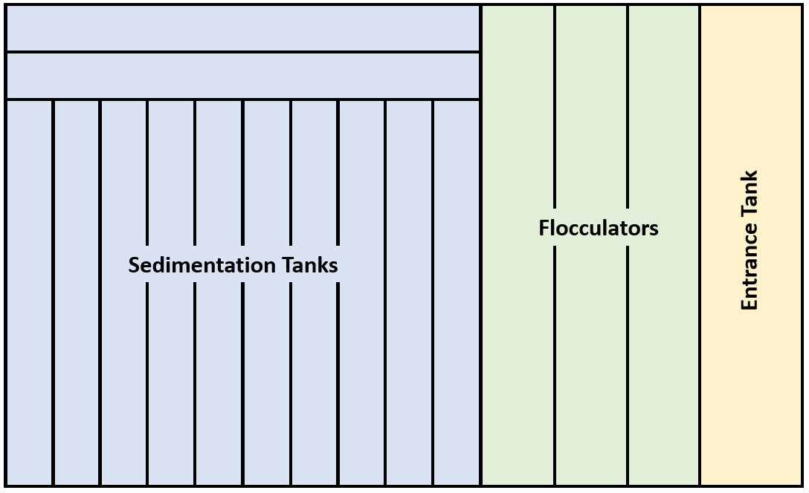

.. _title_entrance_tank_design:

**************************************
Entrance Tank Design
**************************************

The water treatment plant must be protected from potentially damaging materials that could be carried from the watershed to the plant by the water. Typically there will be a large opening trash rack at the water source to prevent damage to the transmission line that carries water to the plant. There may also be a small sedimentation tank to remove sand and gravel before the water enters the transmission line. The trash rack and removal of sand and gravel is important for protection of the water treatment plant, but these protections are generally not sufficient. Excessive grit has historically caused maintenance challenges in some AguaClara plants by settling in the flocculator and the channel leading the sedimentation tanks. Steep mountain streams often overwhelm the sand and gravel removal system during storm events and thus depending on the watershed characteristics additional protection is required at the water treatment plant.  

The specific design characteristics of a water treatment plant dictate the potential failure modes and hence the required protection.

The entrance tank has multiple functions in a drinking water treatment plant.

#. Remove air bubbles to reduce splashing, turbulence, and unsteady motion of the chemical feed surface tracking lever system
#. Remove grit to prevent grit accumulation in the flocculator
#. Remove leaves and other debris to prevent clogging of the diffusers in the sedimentation tank inlet
#. Dissipate kinetic energy of the water prior to facilitate accurate measurement of the water level used for flow measurement
#. Measure the flow rate so that operators can make adjustments to the incoming flow rate and respond to changes in water demand
#. Inject the coagulant and any other amendments required for flocculation

The entrance tank consists of several components: an influent pipe, a trash rack, an overflow pipe to prevent flows larger than the design flow rate from overwhelming the plant, the Liner Flow Orifice Meter (LFOM), and depending on the water quality characteristics, a grit chamber. The Chemical Dose Controller (CDC) lever arm and float sit between the trash rack and the LFOM. 

 .. _figure_ET_Diagram_Labeled:

.. figure:: ../Images/ET_Diagram_Labeled.png
    :width: 900px
    :align: center
    :alt: entrance tank diagram

    The entrance tank contains the influent pipe, trash rack, overflow pipe, grit chamber with hoppers, pipe stubs for drainage, a waste channel, the LFOM, the lever arm of the chemical dosing system (not pictured), and a pipe leading to the flocculator. (EMW - How to do figure captions?)

In some AguaClara plants, the entrance tank, flocculators, and sedimentation tanks are separated by walkways. However, a more space efficient approach would be to arrange the entrance tank in a channel next to the flocculator as shown in :numref:`figure_Plant_Layout_Option`. (EMW - need help linking figure number), This avoids the need for buried pipes to carry water underneath the walkway from one component to the other and simplifies construction. 

(EMW - why isn't my picture centered?)

 .. _figure_Plant_Layout_Option:

    A space efficient layout of the entrance tank alongside the flocculators. The entrance tank may extend the full length of the flocculator and then get wider as needed to meet grit removal requirements. 

Trash Rack Design
===============================

The trash rack is specifically designed to remove low density debris that could easily be carried through the plant and clog any small flow passages. In an AguaClara plant there are critical flow passages in the sedimentation tank inlet manifold diffusers and in the flow injection system in the stacked rapid sand filters. The inlet manifold diffusers have flared nozzles which currently have a minimum dimension of about 4 mm. This sets a requirement that the opening dimension for the trash rack be less than the opening size of the inlet manifold nozzles.

The minimum trash rack area is set by a goal of minimizing head loss through the plant while maintaining a trash rack size that is reasonably compact. We recommend that the trash rack be designed to reach a terminal head loss of 5 cm when it is 90% clogged. The design follows directly from that constraint. The guiding equation is the orifice equation with the simple addition of the fractions of the area that is actually available for the water to flow through the trash rack. The area is reduced by the porosity, the vena contracta, and the clogging.

.. math::
  :label: trashrack_flow

   Q = (1-\Pi_{clogged})\Pi_{vc} \phi A_{trashrack}\sqrt{2gh}

where :math:`\phi_{trashrack}` is the fraction of clean trash rack that is open, :math:`\Pi_{vc}` is the vena contracta coefficient, :math:`\Pi_{clogged}` is the clogged fraction of the trash rack. The ideal trash rack has a high porosity and a large vena contracta coefficient. The vena contracta coefficient is set by the geometry of the entrance into the opening through the trash rack. If the entrance has a sharp edge, then the vena contract coefficient will have a value of approximately 0.62. If the entrance is rounded then the vena contracta could approach 1.0. Thus the idea trash rack will have rounded openings.

The area of the trash rack can be solved for as follows:

.. math::
  :label: trashrack_area

   A_{trashrack} = \frac{Q}{(1-\Pi_{clogged})\Pi_{vc} \phi \sqrt{2gh}}

Set the fraction clogged to between 80 and 90%. The vena contracta coefficient is 0.62 for sharp edged orifices and could be 1 for round wire.
Porosity varies widely depending on the fabrication method.
For AguaClara plants, a maximum head loss of 5 cm is recommended.

Also of interest is the effective velocity taking into account the whole area of the trash rack.

.. math::
  :label: trashrack_velocity

   v_{trashrack} = \frac{Q}{A_{trashrack} } = (1-\Pi_{clogged})\Pi_{vc} \phi \sqrt{2gh}

The trash rack characteristic velocity is 50 mm/s for 50% porosity, 90% clogged, vena contracta of 1, and a maximum head loss of 5 cm.

Grit Chamber Design
===============================

The length of the entrance tank may be extended to function as additional grit removal capacity for watersheds where sediment has the potential to produce harmful amounts of sand and gravel during storm events. As of 2021, plant operators at only two AguaClara plants, Gracias and Agalteca, have reported maintenance issues due to grit settling in the flocculator or inlet channel to the sedimentation tanks. If a grit chamber is deemed necessary for a particular watershed, it would be located on the effluent side of the trash racks and is lined with a series of hoppers to faciliate cleaning. To remove settled grit from the entrance tank, the plant operator can remove the pipe stub blocking the drain at the bottom of each hopper, allowing water to pull the grit into the drain channel below. 

Stokes' Law can be used to calculate the area of the grit chamber required to remove particles of a desired size. Kawamura recommends a critical pparticle size of 0.1 mm (2000, p. 416).  [emw - check publication date] The overall strategy to determine appropriate dimensions of the entrance tank is follows: 

1. Use the appropriate Stokes Law for laminar or turbulent flow to determine the corresponding critical velocity of the particle.
2. Calculate the required plan-view area of the entrance tank
3. Determine the ideal length and width of the entrance tank
4. Calculate the required entrance tank depth

Recall that Stokes Law tells us the terminal velocity of a particle settling under laminar flow, and can be calculated as follows: 

.. math::
  :label: grit_criticalVelocity
  
  v_c = \frac{(\rho_p - \rho_{H_20})\cdot g\cdot(d_p)^2}{18 \cdot \nu \cdot\rho_{H_20}}
  
  where d\ :sub:'p' is the minimum particle diameter to be removed (Kawamura recommends 0.1 mm). 
  
  As a check, calculate the Reynolds number to confirm that flow is in the laminar regime for Stokes' Law to be valid. 
  
  .. math::
  :label: grit_Re
  
  Re = \frac{v_c \cdot d_p}{\nu}
  
  The required plan view area to capture the minimum particle can be calculated by dividing the plant flow rate by the critical particle velocity:
  
   .. math::
  :label: planViewA
  
  A = \frac{Q}{v_c}
  
  The next step is to determine the optimal dimensions of the entrance tank. For constructibility purposes, the entrance tank must not be smaller than 50 cm, as a mason needs to work inside to apply a waterproof coating. Additionally, the entrance tank should not be longer than the flocculator. The ideal width of the entrance tank would be the area of the grit chamber divided by the length of the flocculator, or the minimum width of 50 cm, whichever is larger. 
  
   .. math::
  :label: width_ET
  
  W_{ET} = max(\frac{A}{L_{flocculator}}, W_{min})
  
  The corresponding entrance tank length would be:
  
     .. math::
  :label: length_ET
  
  L_{ET} = \frac{A}{W_{ET}}
   
The maximum height of water in the entrance tank is governed by either the trash rack or the headloss of the Linear Flow Orifice Meter (LFOM), and depends on the design flow rate of the plant. The minimum depth of the trash rack is its active area divided by the width of the entrance tank and the LFOM headloss for a typicaly AguaClara plant is 20 cm. 
  
    .. math::
  :label: depth_trashrack
  
  d_{trashrack} = \frac{A_{trashrack}}{W_{ET}}
  
  The depth of the entrance tank is therefore the maximum of the trashrack depth and the LFOM headloss, plus some freeboard (typically 10 cm for AguaClara). 
  
    .. math::
  :label: depth_ET
  
  d_{ET} = max(d_{trashrack}, HL_{LFOM}) + FB
  
References
===============================

Kawamura, S. (2000). Integrated Design and Operation of Water Treatment Facilities. John Wiley &amp; Sons. 
  
