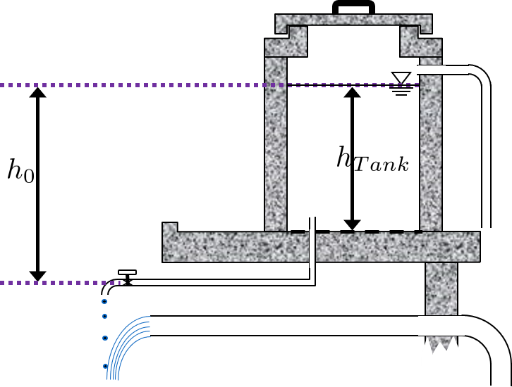
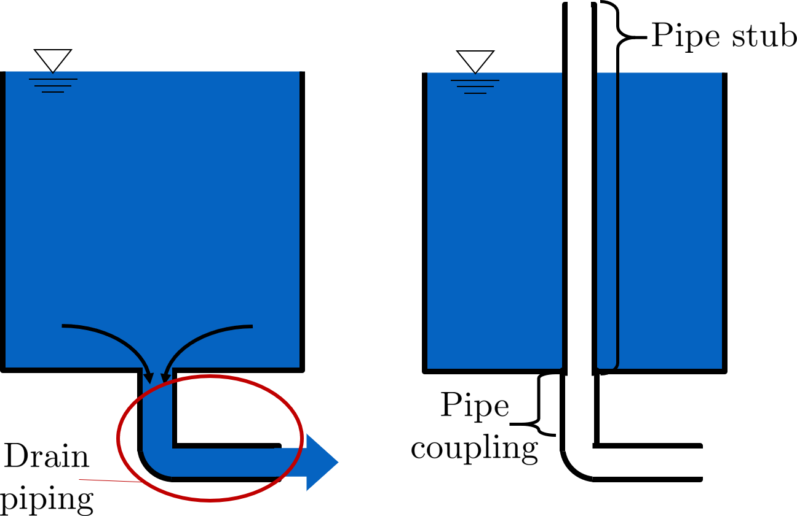
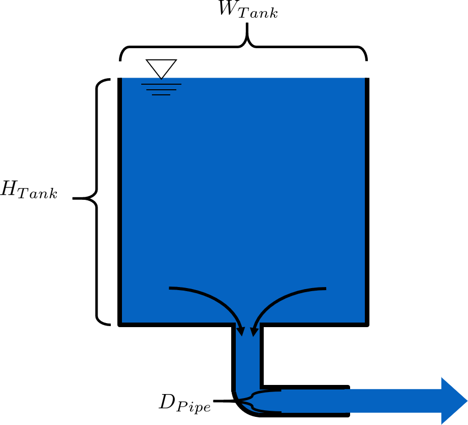
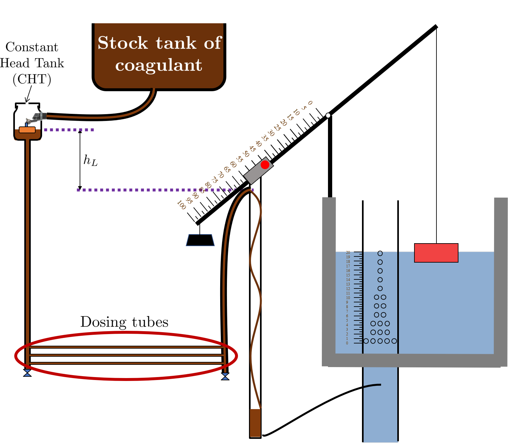
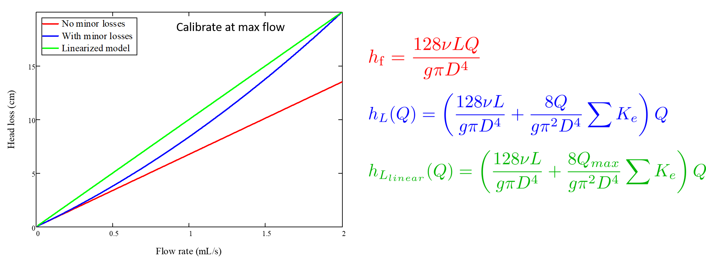
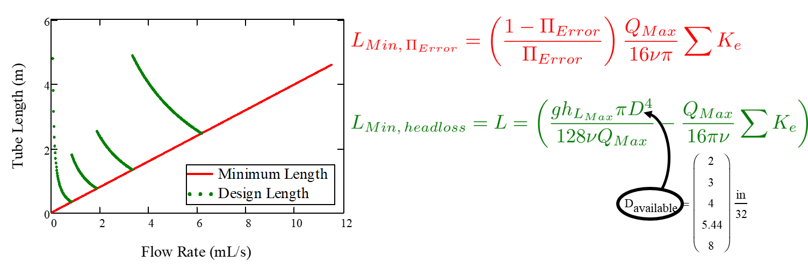

.. _flow_control_derivations:

******************************************
Flow Control and Measurement Derivations
******************************************

.. _flow_for_a_tank_with_a_valve:

:math:`Q(t)` for a Tank with a Valve
======================================
This document contains the derivation of the flow through a tank-with-a-valve over time, :math:`Q(t)`. Our reference will be a simple hypochlorinator, shown in the following image. In the image, a hypochlorite solution is slowly dripping and mixing with piped source water, thereby disinfecting it. The valve is almost closed to make sure that the hypochlorite solution drips instead of flows. At the end of this document is an image which shows the variables in the final equation.

.. _drip_hypochlorinator:
.. figure:: Images/drip_hypochlorinator.png
    :width: 600px
    :align: center
    :alt: Drip hypochlorinator

    This is a common setup for chlorinating water before distributing it to a nearby community.

This derivation begins by finding two equations for flow, :math:`Q`, through the hypochlorinator and setting them equal to each other. First, the rate of change of the volume of hypochlorite solution in the tank is equivalent to the flow out of the hypochlorinator. Since the volume of hypochlorite solution in the tank is equal to the tank’s cross-sectional area times it height, we get the following equation:

.. math::

    Q =  - \frac{d\rlap{-}V}{dt} = - \frac{{A_{Tank}}dh}{dt}

| Such that:
| :math:`\frac{d\rlap{-}V}{dt}` = rate of change in volume of solution in the tank
| :math:`\frac{dh}{dt}` = rate of change in height of water (hypochlorite solution) level with time

Our other equation for flow is the head loss equation. Since major losses are negligible for a short pipe-low flow rate system, we only need to consider minor losses. The only real minor loss in this system occurs in the almost-closed valve that is dripping the hypochlorite solution. However, we will also use the head loss trick. Therefore, the total driving head of the system :math:`h` is equal to the minor losses:

.. math::

    h = h_e = \left( \sum K \right) \frac{Q^2}{2gA_{Valve}^2}

Bear in mind that this is the second form of the minor loss equation as described in :ref:`final_minor_loss_equations`. Rearranging the minor loss equation to solve for :math:`Q`, it looks like this:

.. math::

    Q = A_{Valve} \sqrt{\frac{2 h_e g}{\sum K}}

Now we can set both equations for :math:`Q` equal to each other and move them both to one side:

.. math::

    A_{Tank} \frac{dh}{dt} + A_{Valve} \sqrt{\frac{2gh}{\sum K}} = 0

From here, calculus and equation substitution dominate the derivation. Separating the variables of the equation immediately above, we get the following integral:

.. math::

    \frac{ -A_{Tank}}{{A_{Valve}} \sqrt{\frac{2g}{\sum K}} }   \int \limits_{h_0}^h \frac{dh}{\sqrt h} = \int \limits_0^t {dt}

Which, when integrated, yields:

.. math::

    \frac{ -A_{Tank}}{A_{Valve} \sqrt{ \frac{2g}{\sum K}} } \cdot 2 \left( \sqrt{h} - \sqrt{h_0} \right) = t

And solved for :math:`\sqrt{h}` returns:

.. math::

    \sqrt h  = \sqrt{h_0} - t \frac{A_{Valve}}{2 A_{tank}} \sqrt {\frac{2g}{\sum K}}

At this point, the steps and equation substitutions may begin to seem unintuitive. Do not worry if you do not understand why *exactly* a particular substitution is occurring. Since we determined above that :math:`h_e = h`, our equation above for :math:`\sqrt{h}` is also an equation for :math:`\sqrt{h_e}`. As such, we will plug the equation above back into the minor loss equation solved for :math:`Q` from above, :math:`Q = A_{Valve} \sqrt{\frac{2 h_e g}{\sum K}}`, to produce:

.. math::

    Q = A_{Valve} \sqrt{\frac{2g}{\sum K}} \left( \sqrt{h_0}  - t \frac{A_{Valve}}{2 A_{tank}} \sqrt{\frac{2g}{\sum K}} \right)

Now we can focus on getting rid of the variables :math:`A_{Valve}`, :math:`\sum K`, and :math:`A_{tank}`. By using the minor loss equation once more, we can remove both :math:`A_{Valve}` and :math:`\sum K`. Consider the initial state of the system, when the hypochlorinator is set up and starts dropping its first few drops of hypochlorite solution into the water. The initial flow rate, :math:`Q_0`, and elevation difference between the water level and the valve, :math:`h_0`, can be input into the minor loss equation, which can then be solved for :math:`A_{Valve}`:

.. math::

    A_{Valve} = \frac{Q_{0}}{ \sqrt{ \frac{2 h_0 g}{\sum K}} }

Plugging this equation for :math:`A_{Valve}` into the equation for :math:`Q` just above, we get the following two equations, in which the second equation is a simplified version of the first:

.. math::

    Q = Q_0 \frac{1}{\sqrt{h_0}} \left( \sqrt{h_0} - \frac{Q_0 t}{2 A_{Tank} \sqrt{h_0}} \right)

.. math::

    \frac{Q}{Q_0} = 1 - \frac{t Q_0}{2 A_{Tank} h_0}

This next step will eliminate :math:`A_{Tank}`. However, it requires some clever manipulation that has a tendency to cause some confusion. We will define a new parameter, :math:`t_{Design}`, which represents the time it would take to empty the tank **if the initial flow rate through the valve, :math:`Q_0`, stays constant in time**. Of course, the flow :math:`Q` through the valve does not stay constant in time, which is why this derivation document exists. But imagining this hypothetical :math:`t_{Design}` parameter allows us to form the following equation:

.. math::

    Q_0 t_{Design} = A_{Tank} h_{Tank}

This equation describes draining all the hypochlorite solution from the tank. The volume of the solution, :math:`A_{Tank} h_{Tank}`, is drained in :math:`t_{Design}`. Rearranged, the equation becomes:

.. math::

    \frac{Q_0}{A_{Tank}} = \frac{h_{Tank}}{t_{Design}}

| Such that:
| :math:`h_{Tank}` = elevation of water level in the tank with reference to tank bottom at the initial state, :math:`t = 0`

Here lies another common source of confusion. :math:`h_{Tank}` is not the same as :math:`h_{0}`. :math:`h_{Tank}` is the height of water level in the tank with reference to the tank bottom. :math:`h_{0}` is the water level in the tank with reference to the valve. Therefore, :math:`h_{0} \geq h_{Tank}` is true if the valve is located at or below the bottom of the tank. If the tank is elevated far above the valve, then the :math:`h_{0} > > h_{Tank}`. If the valve is at the same elevation as the bottom of the tank, then :math:`h_{0} = h_{Tank}`. Please refer to the following image to clarify :math:`h_{0}` and :math:`h_{Tank}`. Also note that both :math:`h_{Tank}` and :math:`h_{0}` are not variables, they are constants which are defined by the initial state of the hypochlorinator, when the solution just begins to flow.

.. _hypochlorinator_variable_explanation:

    :math:`Q_0 =` initial flow rate of hypochlorite solution at time :math:`t = 0`, :math:`t_{Design} =` time it would take to drain the tank if flow was held constant at :math:`Q_0`

Finally, our fabricated equivalence, :math:`\frac{Q_0}{A_{Tank}} = \frac{h_{Tank}}{t_{Design}}` can be plugged into :math:`\frac{Q}{Q_0} = 1 - \frac{t Q_0}{2 A_{Tank} h_0}` to create the highly useful equation for flow rate as a function of time for a drip hypochlorinator:

.. math::

   \color{purple}{
   \frac{Q}{Q_0} = 1 - \frac{1}{2} \frac{t}{t_{Design}} \frac{h_{Tank}}{h_0}
   }

Which can be slightly rearranged to yield:

.. math::

   \color{purple}{
   Q(t) = Q_0 \left( 1 - \frac{1}{2} \frac{t}{t_{Design}} \frac{h_{Tank}}{h_0} \right)
   }

| Such that:
| :math:`Q = Q(t)` = flow of hypochlorite through valve at time :math:`t`
| :math:`t` = elapsed time
| :math:`t_{Design}` = time it would take for tank to empty *if* flow stayed constant at :math:`Q_0`, which it does not
| :math:`h_{Tank}` = elevation of water level with reference to tank bottom
| :math:`h_0` = elevation of water level with reference to the valve

“How does this ‘tank with a valve’ scenario differ from the ‘hole in a bucket’ scenario?” some might ask. If you are interested, you may go through the derivation on your own using the orifice equation instead of the minor loss equation for the first step. If you do so you’ll find that the equation remains almost the same, the only difference being that the :math:`\frac{h_{Tank}}{h_0}` term drops out for an orifice, as :math:`h_{Tank} = h_0`. The big difference in the systems lies with the flexibility of having a valve. It can be tightened or loosened to change the flow rate, whereas changing the size of an orifice multiple times in a row is not recommended and is usually irreversible.

.. _diameter_and_time_tank_drain_equation:

:math:`D(t)` and :math:`t(D)` for Tank Drain Equation
=========================================================
This document contains the derivation of :math:`D_{Pipe}`, which is the pipe diameter necessary to install in a drain system to entirely drain a tank in time :math:`t_{Drain}`.

First, it is necessary to understand how AguaClara tank drains work and what they look like. Many tanks, including the flocculator and entrance tank, have a hole in their bottoms which are fitted with `pipe couplings <https://www.mrpoolman.com.au/assets/thumbL/16057.jpg>`_. During normal operation, these couplings have pipe stubs in them, and the pipe stubs are tall enough to go above the water level in the tank and not allow water to flow into the drain. When the pipe stub is removed, the water begins to flow out of the drain, as the image below indicates. The drain pipe consists of pipe and one elbow, shown in the image.

.. _pipe_stub_drainage:

    This is AguaClara's alternatives to having valves.

While AguaClara sedimentation tanks use valves instead of pipe to begin the process of draining, the actual drain piping system is the same, pipe and an elbow. The equation that will soon be derived applies to both pipe stub and valve drains.

We will start the derivation from the following equation, which is found in an intermediate step from the ':math:`Q(t)` :ref:`flow_for_a_tank_with_a_valve`.' While this system does not have a valve, it has other sources of minor loss and therefore the equation is still valid.

.. math::

    \sqrt h  = \sqrt{h_0} - t \frac{A_{Valve}}{2 A_{Tank}} \sqrt {\frac{2g}{K}}

We need to make some adjustments to this equation before proceeding, to make it applicable for this new drain-system scenario. First, we want to assume that the tank has fully drained. Thus, :math:`t = t_{Drain}` and :math:`h = 0`. Next, we recall that the tank drain is not actually a valve, but just pipe and an elbow, so :math:`A_{Valve} = A_{Pipe}`. Additionally, there can be multiple points of minor loss in the drain system: the entrance from the tank into the drain pipe, the elbow, and potentially the exit of the water out of the drain pipe. When considering a sedimentation tank, the open valve required to begin drainage also has a minor loss associated with it. Therefore, it is necessary to substitute :math:`\sum K` for :math:`K` With these substitutions, the equation becomes:

.. math::

    \sqrt{h_0}  = t_{Drain} \frac{A_{Pipe}}{2 A_{Tank}} \sqrt {\frac{2g}{\sum K}}

Now, with the knowledge that :math:`A_{Pipe} = \frac{\pi D_{Pipe}^2}{4}` and rearranging to solve for :math:`D_{Pipe}`, we obtain the following equation:

.. math::

    D_{Pipe} = \sqrt{ \frac{8 A_{Tank}}{\pi t_{Drain}} \sqrt{ \frac{h_0 \sum K}{2g} } }

To get the equation in terms of easily measureable tank parameters, we substitute :math:`L_{Tank} W_{Tank}` for :math:`A_{Tank}`. To maintain consistency in variable names, we substitute :math:`H_{Tank}` for :math:`h_0`.

.. note:: By saying that :math:`h_0 = H_{Tank}`, we are making the assumption that the pipe drain is at the same elevation as the bottom of the tank. The pipe drain is actually a little lower than the bottom of the tank, but that would make the tank drain faster than :math:`t_{Drain}`, which is preferred. Therefore, we are designing a slight safety factor when we say that :math:`h_0 = H_{Tank}`.

Finally, we arrive at the equation for drain pipe sizing:

.. math::

   \color{purple}{
   D_{Pipe} = \sqrt{ \frac{8 L_{Tank} W_{Tank}}{\pi t_{Drain}}} \left( \frac{H_{Tank} \sum K}{2g} \right)^{\frac{1}{4}}
   }

We can also easily rearrange to find the time required to drain a tank given a drain diameter:

.. math::

   \color{purple}{
   t_{Drain} = \frac{8 L_{Tank} W_{Tank}}{\pi D_{Pipe}^2} \sqrt{ \frac{H_{Tank} \sum K}{2g} }
   }

Such that the variables are as the appear in the image below.

.. _pipe_stub_drainage_variables:

    :math:`L_{Tank}` is the length of the tank which goes the page. :math:`K` is the aggregate minor loss coefficient of the drain system.

.. _design_equations_for_the_cdc:

Design Equations for the Linear Chemical Dose Controller (CDC)
===============================================================
This document will include the equation derivations required to design a CDC system. The most important restriction in this design process is maintaining linearity between head :math:`h` and flow :math:`Q`, which is the entire purpose of the CDC. Recall that major losses under laminar flow scale with :math:`Q` and minor losses scale with :math:`Q^2` Since it is impossible to remove minor losses from the system entirely, we will simply try to make minor losses very small compared to major losses. The CDC does this by including ‘dosing tube(s),’ which are long, straight tubes designed to generate a lot of major losses. There can be one tube or multiple, depending on the design conditions.

We will use the ‘head loss trick’ that was introduced in the Fluids Review section. Therefore, the elevation difference between the water level in the constant head tank (CHT) and the end of the tube connected to the slider, :math:`\Delta h`, is equal to the head loss between the two points, :math:`h_L`. Thus, :math:`\Delta h = h_L = h_e + h_f`.

.. note:: There are a lot of equations in this section, and they may quickly get confusing. They are color coded in an attempt to make them easier to follow. There are two final design equations: :math:`\color{purple}{\bar v_{Max}}` and math:`\color{purple}{L_{Min}}`, and they will be written in :math:`\color{purple}{\rm{purple \, text \, coloring}}` to make them noticeable.

.. _cdc_derivation:

    Visual representation of CDC.

.. _cdc_design_equation_derivations:

CDC Design Equation Derivation
-------------------------------
.. important:: **When designing the CDC, there are a few parameters which are picked and set initially, before applying any equations. These parameters are:**

1. :math:`D` = tube diameter. only certain tubing diameters are manufactured (like :math:`\frac{x}{16}` inch), so an array of available tube diameters is set initially.
2. :math:`\sum K` = sum of minor loss coefficients for the whole system. This is also set initially, it is usually 2.
3. :math:`h_{L_{Max}}` = maximum elevation difference between CHT water level and outlet of solution. This parameter is usually 20 cm.

We begin by defining the head loss through the system :math:`h_L`, which is equivalent to defining the driving head :math:`\Delta h`. Major losses will be coded as red.

.. math::

   \color{red}{
     h_{\rm{f}} = \frac{128\nu LQ}{g\pi D^4}
     }

| Such that:
| :math:`\nu` = kinematic viscosity *of the solution going through the dosing tube(s)*. This is either coagulant or chlorine
| :math:`Q` = flow rate through the dosing tube(s)
| :math:`L` = length of the dosing tube(s)

.. note:: ‘Tube(s)’ is used because there may be 1 or more dosing tubes depending on the particular design.

Minor losses are equal to:

.. math::

    h_e = \frac{8 Q^2}{g \pi^2 D^4} \sum{K}

Therefore, the total head loss is a function of flow, and is shown in the following equation.

.. math::

   h_L(Q) =
   {\color{red}{
     \frac{128\nu L Q}{g \pi D^4}}} +
     \frac{8Q^2}{g \pi^2 D^4} \sum K

Blue will be used to reference *actual* head loss from now on. This is the same equation as above.

.. math::

   \color{blue}{
     h_L(Q) = \left( \frac{128\nu L}{g \pi D^4} + \frac{8Q}{g \pi ^2 D^4} \sum{K} \right) Q
     }

This equation is not linear with respect to flow. We can make it linear by turning the variable :math:`Q` in the :math:`\frac{8Q}{g \pi ^2 D^4} \sum{K}` term into a constant. To do this, we pick a maximum flow rate of coagulant/chlorine through the dose controller, :math:`Q_{Max}`, and put that into the term in place of :math:`Q`. The term becomes :math:`\frac{8Q_{Max}}{g \pi ^2 D^4} \sum{K}`, and our linearized model of head loss, coded as green, becomes:

.. math::

   \color{green}{
     h_{L_{linear}}(Q) = \left( \frac{128\nu L}{g \pi D^4} + \frac{8Q_{Max}}{g \pi ^2 D^4} \sum{K} \right) Q
     }

Here is a plot of the three colored equations above. Our goal is to minimize the minor losses in the system; to bring the red and blue curves as close as possible to the green one.

.. _CDC_linearity_model:

    MathCAD generated graph for linearity error analysis. TODO: make this in python

Designing for the error constraint, :math:`\Pi_{Error}`
^^^^^^^^^^^^^^^^^^^^^^^^^^^^^^^^^^^^^^^^^^^^^^^^^^^^^^^
.. important:: The first step in the design is to make sure that major losses far exceed minor losses. This will result in an equation for the maximum velocity that can go through the dosing tube(s), :math:`\color{purple}{\bar v_{Max} }`.

Minor losses will never be 0, so how much error in our linearity are we willing to accept? Let’s define a new parameter, :math:`\Pi_{Error}`, as the maximum amount of error we are willing to accept. We are ok with 10% error or less, so :math:`\Pi_{Error} = 0.1`.

.. math::

    \Pi_{Error} = \frac{\color{green}{ h_{L_{linear}} } - \color{blue}{ h_L }}{\color{green}{ h_{L_{linear}} }} = 1 - \frac{\color{blue}{ h_L }}{\color{green}{ h_{L_{linear}} }}

.. math::

    1 - \Pi_{Error} = \frac{\color{blue}{ h_L }}{\color{green}{ h_{L_{linear}} }}

Now we plug :math:`\color{blue}{ h_L(Q) }` and :math:`\color{green}{ h_{L_{linear}} }` back into the equation for :math:`1 - \Pi_{Error}` and take the limit as :math:`Q \rightarrow 0`, as that is when the relative difference between actual head loss and our linear model for head loss is the greatest.

.. math::

   1 - \Pi_{Error} =
     \frac{ \color{blue}{
     \left( \frac{128 \nu L}{g \pi D^4} +
     \cancel{\frac{8Q}{g \pi^2 D^4} \sum{K}}
     \right) Q
     }}
     {\color{green}{
     \left( \frac{128 \nu L}{g \pi D^4} + \frac{8 Q_{Max}}{g \pi^2 D^4} \sum{K} \right) Q
     }}
     =     \frac{\left( \frac{128 \nu L}{g \pi D^4} \right)}{\left( \frac{128 \nu L}{g \pi D^4} + \frac{8 Q_{Max}}{g \pi^2 D^4} \sum{K} \right)}

The next steps are algebraic rearrangements to solve for :math:`L`. This :math:`L` describes the *minimum* length of dosing tube necessary to meet our error constraint at *maximum* flow. Thus, we will refer to it as :math:`L_{Min, \, \Pi_{Error}}`.

.. math::

    \left( 1 - \Pi_{Error} \right)  \frac{128 \nu L}{g \pi D^4} + \left( 1 - \Pi_{Error} \right) \frac{8 Q_{Max}}{g \pi ^2 D^4} \sum{K}  =  \frac{128 \nu L}{g \pi D^4}

.. math::

    - \Pi_{Error} \frac{128 \nu L}{g \pi D^4} + \left( 1 - \Pi_{Error} \right) \frac{8 Q_{Max}}{g \pi^2 D^4} \sum{K}  = 0

.. math::

    L = \left( \frac{1 - \Pi_{Error}}{\Pi_{Error}} \right) \frac{Q_{Max}}{16 \nu \pi} \sum{K}

.. math::

    L_{Min, \, \Pi_{Error}} = L = \left( \frac{1 - \Pi_{Error}}{\Pi_{Error}} \right) \frac{Q_{Max}}{16 \nu \pi} \sum{K}

| Note that this equation is independent of head loss.

Unfortunately, both :math:`L_{Min, \, \Pi_{Error}}` and :math:`Q_{Max}` are unknowns. We can plug this equation for :math:`L_{Min, \, \Pi_{Error}}` back into the head loss equation at maximum flow, which is :math:`h_{L_{Max}} = \left( \frac{128\nu L Q_{Max}}{g \pi D^4} + \frac{8Q_{Max}^2}{g \pi ^2 D^4} \sum{K} \right)` and rearrange for :math:`Q_{Max}` to get:

.. math::

    Q_{Max} = \frac{\pi D^2}{4} \sqrt{\frac{2 h_{L_{Max}} g \Pi_{Error}}{\sum K }}

.. seealso:: **Function in aide_design** ``cdc.max_linear_flow(Diam, HeadlossCDC, Ratio_Error, KMinor)`` Returns the maximum flow :math:`Q_{Max}` that can go through a dosing tube will making sure that linearity between head loss and flow is conserved.

From this equation for :math:`Q_{Max}`, we can get to our first design equation, :math:`\color{purple}{\bar v_{Max}}` by using the continuity equation :math:`\bar v_{Max} = \frac{Q_{Max}}{\frac{\pi D^2}{4}}`

.. math::

   \color{purple}{
     \bar v_{Max} = \sqrt{ \frac{2 h_L g \Pi_{Error}}{\sum{K} }}
     }

Designing for the proper amount of head loss, :math:`h_{L_{Max}}`
^^^^^^^^^^^^^^^^^^^^^^^^^^^^^^^^^^^^^^^^^^^^^^^^^^^^^^^^^^^^^^^^^
.. important:: The second step in the design is to make sure that the maximum head loss corresponds to the maximum flow of chemicals. This will result in an equation for the length of the dosing tube(s), :math:`\color{purple}{L_{Min} }`.

We previously derived an equation for the minimum length of the dosing tube(s), :math:`L_{Min, \, \Pi_{Error}}`, which was the minimum length needed to ensure that our linearity constraint was met. This equation is shown again below, in red:

.. math::

   \color{red}{
     L_{Min, \, \Pi_{Error}} = \left( \frac{1 - \Pi_{Error}}{\Pi_{Error}} \right) \frac{Q_{Max}}{16 \nu \pi} \sum{K}
     }

This equation does not, however, account for getting to the proper amount of head loss. If we were to use this equation to design the dosing tubes, we might not end up with the proper amount of flow :math:`Q_{Max}` at the maximum head loss :math:`h_{L{Max}}`. So we need to double check to make sure that we get our desired head loss.

First, consider the head loss at maximum flow that was used to get the equation for :math:`Q_{Max}`:

.. math::

    h_{L_{Max}} = \left( \frac{128 \nu L{Q_{Max}}}{g \pi D^4} + \frac{8 Q_{Max}^2}{g \pi^2 D^4} \sum{K} \right)

Now that we know all of the parameters in this equation except for :math:`L`, we can solve the equation for :math:`L`. This the *shortest* tube that generates our required head loss, :math:`h_{L_{Max}}`.

.. math::

  \color{green}{
     L_{Min, \, head loss} = L = \left( \frac{g h_{L_{Max}} \pi D^4}{128 \nu Q_{Max}} - \frac{Q_{Max}}{16 \pi \nu} \sum{K} \right)
     }

.. seealso:: **Function in aide_design:** ``cdc._length_cdc_tube_array(FlowPlant, ConcDoseMax, ConcStock, DiamTubeAvail, HeadlossCDC, temp, en_chem, KMinor)`` Returns :math:`\color{purple}{L_{Min}}`, takes in the flow rate input of *plant design flow rate*.

.. seealso:: **Function in aide_design:** ``cdc._len_tube(Flow, Diam, HeadLoss, conc_chem, temp, en_chem, KMinor)`` Returns :math:`\color{purple}{L_{Min}}`, takes in the flow rate input of *max flow rate through the dosing tube(s)*.

If you decrease the max flow :math:`Q_{Max}` and hold :math:`h_{L_{Max}}` constant, :math:`\color{green}{L_{Min, \, head loss}}` becomes larger. This means that a CDC system for a plant of 40 :math:`\frac{L}{s}` must be different than one for a plant of 20 :math:`\frac{L}{s}`. If we want to maintain the same head loss at maximum flow in both plants, then the dosing tube(s) will need to be a lot longer for the 20 :math:`\frac{L}{s}` plant.

To visualize the distinction between :math:`\color{red}{  L_{Min, \, \Pi_{Error}}}` and math:`\color{green}{ L_{Min, \, head loss}}`, see the following plot. :math:`\color{green}{ L_{Min, \, head loss}}` is discontinuous because it takes in the smallest allowable tube diameter as an input. As the chemical flow rate through the dosing tube(s) decreases, the dosing tube diameter does as well. Whenever you see a jump in the green points, that means the tubing diameter has changed.

.. _CDC_length_model:

    CDC length modeling in MathCAD.

As you can see, the head loss constraint is more limiting than the linearity constraint when designing for tube length. Therefore, the design equation for tube length is the one which accounts for head loss. This is the second and final design equation for designing the CDC:

.. math::

   \color{purple}{
   L_{Min} = L_{Min, \, head loss} = \left( \frac{g h_{L_{Max}} \pi D^4}{128 \nu Q_{Max}} - \frac{Q_{Max}}{16 \pi \nu} \sum{K} \right)
   }

The equations for :math:`\color{purple}{\bar v_{Max}}` and :math:`\color{purple}{L_{Min}}` are the only ones you **need** to manually design a CDC.

CDC Dosing Tube(s) Diameter :math:`D_{Min}` Plots
^^^^^^^^^^^^^^^^^^^^^^^^^^^^^^^^^^^^^^^^^^^^^^^^^^^^
Below are equations which also govern the CDC and greatly aid in understanding the physics behind it, but are not strictly necessary in design.

By rearranging :math:`Q_{Max} = \frac{\pi D^2}{4} \sqrt{\frac{2 h_L g \Pi_{Error}}{\sum K }}`, we can solve for :math:`D` to get the *minimum* diameter we can use assuming the shortest tube possible that meets the error constraint, :math:`\color{red}{L_{Min, \, \Pi_{Error}}}`. If we use a diameter smaller than :math:`D_{Min, \, \Pi_{Error}}`, we will not be able to simultaneously reach :math:`Q_{Max}` and meet the error constraint :math:`\Pi_{Error}`.

.. math::

   \color{blue}{
   D_{Min, \, \Pi_{Error}} = \left[ \frac{8 Q_{Max}^2 \sum K}{\Pi_{Error} h_l g \pi^2} \right]^{\frac{1}{4}}
   }

We can also find the minimum diameter needed to guarantee laminar flow, which is another critical condition in the CDC design. We can do this by combining the equation for Reynolds number at the maximum :math:`\rm{Re}` for laminar flow, :math:`{\rm{Re}}_{Max} = 2100` with the continuity equation at maximum flow:

.. math::

    {\rm Re}_{Max}  = \frac{\bar v_{Max} D}{\nu}

.. math::

    \bar v_{Max} = \frac{4 Q_{Max}}{\pi D^2}

To get:

.. math::

   \color{red}{
   D_{Min, \, Laminar} = \frac{4 Q_{Max}}{\pi \nu {\rm{Re}}_{Max}}
   }

Combined with the discrete amount of tubing sizes (shown in dark green), we can create a graph of the three diameter constraints:

.. _CDC_diameter_model:
.. figure:: Images/CDC_diameter_model.png
    :width: 600px
    :align: center
    :alt: CDC diameter model

    CDC diameter modeling in MathCAD.
