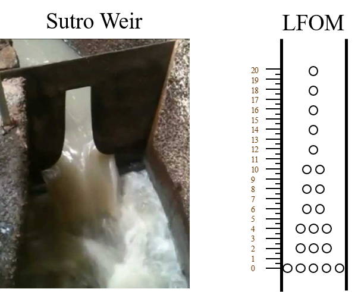
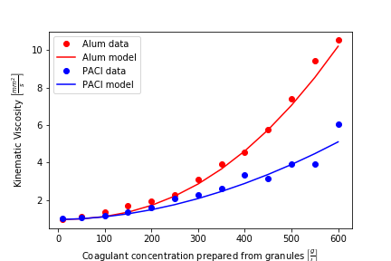

.. _title_flow_control_design:

**************************************
Flow Control and Measurement Design
**************************************
This section explores AguaClara's search for constant head in chemical dosing. The term **constant head** means that the driving head of a system, :math:`\Delta z` or :math:`\Delta h`, does not change over time, even as water flows through or out of the system. Constant head implies constant flow, since the energy driving the flow does not change.

The challenge of constant head in chemical dosing for water treatment plants is not *just* providing one continuous flow of chemicals; it is also varying that flow of chemicals as the flow rate through the plant changes, so that the concentration of chemicals in the raw water stays the same.

.. _heading_fcm_terms_eqs:

Important Terms and Equations
===============================
**Terms:**

1. Dose
2. Coagulant
3. Chlorination
4. Turbidity
5. Organic Matter
6. Constant Head Tank
7. Sutro weir

**Equations:**

1. Hagen-Poiseuille equation

.. _heading_aguaclara_flow_control_and_measurement_technologies:

AguaClara Flow Control and Measurement Technologies
=====================================================
Each technology or component for this section will have five subsections:

-  **What it is**
-  **What it does and why**
-  **How it works**
-  **Notes**

Before diving into the technologies, recall the purpose of the chemicals that we are seeking to constantly **dose**, and why it is important to keep a constant, specific dose. Also recall that ‘dose’ means ‘concentration of chemical’ *in the water we are trying to treat*, not in the stock tanks of the chemicals. `Coagulant <https://en.wikipedia.org/wiki/Coagulation_(water_treatment)>`_ like alum, PAC, and some iron-based chemicals are used to turn small particles into bigger particles, allowing them to be captured more easily. Waters with high `turbidity <https://en.wikipedia.org/wiki/Turbidity>`_, indicative of a lot of particles like clay and bacteria, require more coagulant to treat effectively. Additionally, waters with a lot of `organic matter <https://en.wikipedia.org/wiki/Organic_matter>`_ require significantly more coagulant to treat. `Chlorine <https://en.wikipedia.org/wiki/Water_chlorination>`_ is used to disinfect water that has already been fully treated. A proper and consistent chlorine dose is required, as too low of a dose creates a risk of reintroduction of pathogens in the distribution system and too high of a dose increases the risk of carcinogenic `disinfection byproduct <https://en.wikipedia.org/wiki/Disinfection_by-product>`_ formation.

.. important:: This section will often refer to the proportionality between flow :math:`Q` and head :math:`\Delta h` (recall that :math:`\Delta h = h_L` after applying the head loss trick) by using the ‘proportional to’ symbol, :math:`\propto`. It is important to remember that it doesn’t necessarily matter whether :math:`Q` or :math:`h_L` goes first, :math:`Q \propto \sqrt{h_L}` is equivalent to saying that :math:`h_L \propto Q^2`.

.. _heading_almost_linear_flow_controller:

“Almost Linear” Flow Controller
--------------------------------

What it is
^^^^^^^^^^^^^^
This device consists of a bottle of chemical solution, called the **Constant Head Tank** (CHT), a float valve to keep a solution in the CHT at a constant water level, a flexible tube starting at the bottom of the CHT, and many precisely placed and equally spaced holes in a pipes. The holes in the pipe hold the other end of the tube that starts at the CHT.

Chemical solution, either coagulant or chlorine, is stored in a stock tank somewhere above the CHT. A different tube connects the stock tank to the float valve within the CHT.

What it does and why
^^^^^^^^^^^^^^^^^^^^^^^^
This flow controller provides a constant flow of chemical solution to the water in the plant. When the end of the flexible tube is placed in a hole, the elevation difference between the water level in the bottle and the hole is set and does not change unless the tube is then placed in another hole. Thus, a constant flow is provided while the end of the tube is not moved.

As has been mentioned previously, the amount of chlorine and coagulant that must be added to the raw water changes depending on the flow rate of the plant; the change is necessary to keep the dose constant. More water flowing through the plant means more chlorine is necessary to maintain the dose of chlorine in the treated water. For coagulant, there are also other factors aside from plant flow rate that impact the required dose, including the turbidity and amount of organic matter in the water. The operator must be able to change the dose of both coagulant and chlorine quickly and easily, and they must be able to know the value of the new dose they set. The “Almost Linear” Flow Controller accomplishes this by having a large number of holes in the flow control pipe next to the CHT. This large number of holes gives the operator many options for adjusting the dose, and let them quickly change the flow of chemicals into the raw water by moving the end of the flexible tube from one hole to another.

How it works
^^^^^^^^^^^^^^^^
The idea behind this flow controller is to have a linear relationship between :math:`Q` and :math:`h_L` (remember that :math:`h_L` is equal to :math:`\Delta h` when we apply the head loss trick), which can be written as :math:`Q \propto h_L`. Here, :math:`Q` is the flow of chemicals out of the flexible tube, and :math:`h_L` is the elevation difference between the water level in the CHT and the end of the flexible tube.

As you remember from section 1.5, the summary of Fluids Review, :math:`Q \propto \Delta h`, or :math:`\Delta h \propto Q` as it was written in the section summary, is only true for the combination of major losses and laminar flow, which makes applicable the Hagen-Poiseuille equation. Therefore, the flow must always be laminar in the flexible tube that goes between the CHT and the holes, and major losses must far exceed minor losses.

It is easy to design for laminar flow, but the “Almost Linear” Flow Controller was unable to make major losses far exceed minor losses. The bending in the flexible tube caused a lot of minor losses which changed in magnitude depending on exactly how the tube was bent. This made the flow controller “almost linear,” but that wasn’t good enough.

Notes
^^^^^^^^^
-  This flow controller is **no longer used by AguaClara.**
-  The tube connecting the CHT to the outlet of chemicals must be very long and, more importantly, **straight** to form a linear relationship between driving head and flow. This linear relationship was not true for the “Almost Linear” Flow Controller, and is why it was replaced by the Linear Chemical Dose Controller (CDC). The CDC will be covered in more depth later on in this section.

.. _heading_lfom:

Linear Flow Orifice Meter (LFOM)
--------------------------------

What it is
^^^^^^^^^^^^^^
The LFOM is a weir shape cut into a pipe. It was meant to imitate `the Sutro Weir <https://confluence.cornell.edu/display/AGUACLARA/LFOM+sutro+weir+research>`_ while being far easier to build. The LFOM is a pipe with rows of holes, or orifices, drilled into it. There are progressively fewer holes per row as you move up the LFOM, as the shape is meant to resemble half a parabola on each side. The size of all holes is the same, and the amount of holes per row are precisely calculated. Water in the entrance tank flows into and down the LFOM, towards the rapid mix orifice and flocculator.

.. _figure_sutro_v_lfom:

    On the left is a sutro weir. On the right is AguaClara's approximation of the sutro weir's geometery. This elegant innovation is called a linear flow orifice meter, or LFOM for short.

What it does and why
^^^^^^^^^^^^^^^^^^^^^^^^
The LFOM does one thing and serves two purposes.

What it does:

**The LFOM creates a linear relationship between water level in the entrance tank and the flow out of the entrance tank.** *It does not control the flow through the plant*. If the LFOM were replaced with a hole in the bottom of the entrance tank, the same flow rate would go through the plant, the only difference being that the water level in the entrance tank would scale with flow squared :math:`h \propto Q^2` instead of :math:`h \propto Q`. For example, if an LFOM has 10 rows of holes and has been designed for a plant whose maximum flow rate is 10 L/s, then the operator knows that the number of rows submerged in water is equal to the flow rate of the plant in L/s. So if the water were up to the third row of holes, there would be 3 L/s of water flowing through the plant.

Why it is useful:

#. Allows the operator to measure the flow through the plant quickly and easily, explained above.
#. Allows for the Linear Chemical Dose Controller, which will be explained next, to automatically adjust the flow of coagulant/chlorine into the plant as the plant flow rate changes. This means the operator would only need to adjust the flow of coagulant when there is a change in turbidity or organic matter.

How it works
^^^^^^^^^^^^^^^^
This is best understood with examples. By shaping a weir differently, different relationships between :math:`Q` and :math:`h` are formed:
* In the case of a `rectangular weir <https://swmm5.files.wordpress.com/2016/09/image00124.jpg>`_, :math:`Q \propto h^{\frac{3}{2}}`
* In the case of a `v-notch weir <https://swmm5.files.wordpress.com/2016/09/image0096.jpg>`_, :math:`Q \propto h^{\frac{5}{2}}`
* In the case of a `Sutro weir <http://www.engineeringexcelspreadsheets.com/wp-content/uploads/2012/11/Sutro-Weir-Diagram1.jpg>`_ and thus LFOM, :math:`Q \propto h`.

Notes
^^^^^^^^^

-  The LFOM is not perfect. Before the water level reaches the second row of holes, the LFOM is simulating a rectangular weir, and thus :math:`h \not\propto Q`. The Sutro weir also experiences this problem.
-  If the water level exceeds the topmost row of the LFOM’s orifices, the linearity also breaks down. The entire LFOM begins to act like an orifice, the exponent of :math:`Q` in :math:`h \propto Q` becomes greater than 1. This is because the LFOM approaches orifice behavior, and for orifices, :math:`h \propto Q^2`.

.. _heading_linear_cdc:

Linear Chemical Dose Controller (CDC)
---------------------------------------
Since the Linear Chemical Dose Controller has become the standard in AguaClara, it is often simply called the Chemical Dose Controller, **or CDC for short**. It can be confusing to describe with words, so be sure to flip through the slides in the ‘Flow Control and Measurement’ powerpoint, as they contain very, very, helpful diagrams of the CDC.

What it is
^^^^^^^^^^^^^^
The CDC brings together the LFOM and many improvements to the “Almost Linear” Flow Controller. Let’s break it down, with the image below as a guide.

1. Start at the Constant Head Tank (CHT). This is the same set up as the “Almost Linear” Flow Controller. The stock tank feeds into the CHT, and the float valve makes sure that the water level in the constant head tank is always the same.

2. Now the tubes. These fix the linearity problems that were the main problem in the “Almost Linear” Flow Controller.
* The tube connected to the bottom of the CHT is large diameter to minimize any head loss through it.

   * The three thin, straight tubes are designed to generate a lot of major losses and to minimize any minor losses. This is to make sure that major losses far exceed any minor losses, which will ensure that the Hagen-Poiseuille equation is applicable and that flow will be directly proportional to the head, :math:`Q \propto \Delta h`. Why are there 3 tubes?

     1. **3 short instead of 1 short** Removing 2 of the 3 tubes would mean 3 times the flow through the remaining tube. This means the velocity in the tube would be 3 times as fast. Since minor losses scale with :math:`v^2` and major losses only scale with :math:`v`, this would increase the ratio of :math:`\rm{\frac{minor \, losses}{major \, losses}}`, which would break the linearity we’re trying to achieve. It would also increase the total head loss through the system, resulting in a lower maximum flow rate than before.

     2. **1 long instead of 3 short** One tube whose length is equal to the three combined would be inconveniently long, and would suffer from the same problems as above. There would be even more head loss through the tube, since its length would be longer.

   * The large-diameter tube on the right of the three thin, straight tubes is where the chemicals flow out. The end of the tube is connected to both a slider and a ‘drop tube.’ The drop tube allows for supercritical flow of the chemical leaving the dosing tubes; once the chemical enters the drop tube it falls freely and no longer affects the CDC system.

3. The slider rests on a lever. This lever is the critical part of the CDC, it connects the water level in the entrance tank, which is adjusted by the LFOM, to the difference in head between the CHT and the end of the dosing tube. This allows the flow of chemicals to automatically adjust to a change in the plant flow rate, maintaining a constant dose in the plant water. One end of the lever tracks the water level in the entrance tank by using a float. The counterweight on the other side of the lever is to make sure the float ‘floats,’ since this float is usually made of PVC, which is more dense than water.

4. The slider itself controls the dose of chemicals. For any given plant flow rate, the slider can be adjusted to increase or decrease the amount of chemical flowing through the plant.

.. _figure_cdc_labelled:
.. figure:: ../Images/cdc_labelled.png
    :width: 600px
    :align: center
    :alt: CDC Displayed

    This is the setup of the chemical dose controller.

What it does and why
^^^^^^^^^^^^^^^^^^^^^^^^
The CDC makes it easy and accurate to dose chemicals. The flow of chemicals automatically adjusts to changes in the plant flow rate to keep a constant dose, set by the operator. When a turbidity event occurs, the operator can change the dose of coagulant by moving the coagulant slider *lower* on the lever to increase the dose. The slider has labelled marks so the operator can record the dose accurately.

How it works
^^^^^^^^^^^^^^^^
A lot of design has gone into the CDC. The design equations and their derivations that the following steps are based on can be found here: :ref:`heading_design_equations_for_the_cdc`, and you are very, very strongly encouraged to read them.

The CDC can be designed manually using the equations from the derivation linked above or via aguaclara, using the equations found in `cdc_functions.py <https://github.com/AguaClara/aguaclara>`_. Either way, the design algorithm is roughly the same:

1. Calculate the maximum flow rate, :math:`Q_{Max, \, Tube}`, through each available dosing tube diameter :math:`D` that keeps error due to minor losses below 10% of total head loss. Recall that tubing diameter is an array, as there are many diameters available at hardware stores and suppliers. This means that for each step, there will be as many solutions as there are reasonable diameters available.

.. math::

    Q_{Max, \, Tube} = \frac{\pi D^2}{4} \sqrt{\frac{2 h_L g \Pi_{Error}}{\sum{K} }}

2. Calculate how much flow of chemical needs to pass through the CDC at maximum plant flow and maximum chemical dose. This depends on the concentration of chemicals in the stock tank.

.. math::

    Q_{Max, \, CDC} = \frac{Q_{Plant} \cdot C_{Dose, \, Max}}{C_{StockTank}}

3. Calculate the number of dosing tubes required if the tubes flow at  maximum capacity (round up)

.. math::

    n_{Tubes} = {\rm ceil} \left( \frac{Q_{Max, \, CDC}}{Q_{Max, \, Tube}} \right)

4. Calculate the length of dosing tube(s) that correspond to each available tube diameter.

.. math::

    L_{Min} = \left( \frac{g h_L \pi D^4}{128 \nu Q_{Max}} - \frac{Q_{Max}}{16 \pi \nu} \sum{K} \right)

5. Select a tube length from your array of solutions. Pick the longest dosing tube that you can, keeping in mind that the tube(s) must be able to fit in the plant and can’t be longer than the length of the plant wall it will be placed along.

6. Finally, select the dosing tube diameter and flow rate corresponding to the selected tube length.

Kinematic Viscosity of Coagulants
---------------------------------

AguaClara plants currently use either alum (aluminum sulfate) or PACl (polyaluminum chloride) solutions that are prepared from granular chemicals. The viscosity of solutions created from granular alum and PACl were measured using a SV - 10 Vibro Viscometer. The results are shown below.

.. code:: python

  import aguaclara.core.physchem as pc
  from aguaclara.core.units import unit_registry as u
  import numpy as np
  import matplotlib.pyplot as plt
  # the following concentrations were prepared for each chemical
  Measured_C = np.linspace(0,600,13) * u.g/u.L
  Measured_C[0] = 10 * u.g/u.L
  # the following dynamic viscosities were measured
  Measured_Viscosity_Dynamic_Alum = np.array([0.00097, 0.00114,0.00143,0.00178,0.00208,0.00253,0.00349,0.00451,0.00532,0.00691,0.00901,0.0117,0.0133]) * u.kg/u.s/u.m
  Measured_Viscosity_Dynamic_PACl = np.array([0.001,0.00108,0.00122,0.00145,0.00171,0.00231,0.00256,0.00301,0.00392,0.00378,0.00476,0.00486,0.00768]) * u.kg/u.s/u.m
  Density_PACl_400gperL = 58.88 * u.g/(50 * u.mL)
  Density_Alum_600gperL = 63.2 * u.g/(50 * u.mL)
  temperature = 22 * u.degC

  def Density_Alum(Alum_C, temperature):
    #Alum_C is concentration of aluminum sulfate with attached waters (not concentration of aluminum)
    return Density_Alum_600gperL * Alum_C/(600 * u.g/u.L) + pc.density_water(temperature)*(600 * u.g/u.L - Alum_C)/(600 * u.g/u.L)

  def Density_PACl(PACl_C, temperature):
    #PACl_C is concentration of poly aluminum chloride granules (not concentration of aluminum
    return Density_PACl_400gperL * PACl_C/(400 * u.g/u.L) + pc.density_water(temperature)*(400 * u.g/u.L - PACl_C)/(400 * u.g/u.L)

  Measured_Viscosity_Kinematic_Alum = Measured_Viscosity_Dynamic_Alum/Density_Alum(Measured_C, temperature)
  Measured_Viscosity_Kinematic_PACl = Measured_Viscosity_Dynamic_PACl/Density_PACl(Measured_C, temperature)
  def Alum_Viscosity_Kinematic(Alum_C, temperature):
    return (1 + (4.225 * 10**(-6) * ((Alum_C.to(u.kg/u.m**3)).magnitude)**2.289))*pc.viscosity_kinematic(temperature)

  def PACl_Viscosity_Kinematic(PACl_C, temperature):
    return (1 + (2.383 * 10**(-5) * ((PACl_C.to(u.kg/u.m**3)).magnitude)**1.893))*pc.viscosity_kinematic(temperature)

  fig, ax = plt.subplots()
  ax.plot(Measured_C, Measured_Viscosity_Kinematic_Alum.to(u.mm**2/u.s), 'ro')
  ax.plot(Measured_C, Alum_Viscosity_Kinematic(Measured_C, temperature).to(u.mm**2/u.s), 'r-')
  ax.plot(Measured_C, Measured_Viscosity_Kinematic_PACl.to(u.mm**2/u.s), 'bo')
  ax.plot(Measured_C, PACl_Viscosity_Kinematic(Measured_C, temperature).to(u.mm**2/u.s), 'b-')

  ax.set(xlabel=r'Coagulant concentration prepared from granules ' + r'$\left[\frac{g}{L}\right]$')
  ax.set(ylabel='Kinematic Viscosity ' + r'$\left[\frac{mm^2}{s}\right]$')
  ax.legend(['Alum data','Alum model', 'PACl data','PACl model'])
  fig.savefig('../Images/Coagulant_Viscosity')
  plt.show()

The equations for the kinematic viscosities of the two coagulants prepared from granules are given below.

.. math::

   \nu_{Alum} = \left[ 1 + 4.225 \times {10}^{-6}{\left( \frac{C_{Alum}}{\frac{kg}{m^3}} \right)}^{2.289} \right] \nu_{{H_2}O}

   \nu_{PACl} = \left[ 1 + 2.383 \times {10}^{-5}\left(\frac{C_{PACl}}{\frac{kg}{m^3}} \right)^{1.893} \right] \nu_{{H_2}O}

This analysis is incomplete in that we don't know the aluminum concentration of these coagulant solutions.

.. _figure_coagulant_viscosity_kinematic:

    The viscosity of solutions prepared from granular aluminum sulfate and polyaluminum chloride. The concentration is the mass of granules per volume of solution.

Notes
^^^^^^^^^
Nothing in life is perfect, and the CDC is no exception. It has a few causes of inaccuracy which go beyond non-zero minor losses:

* Float valves are not perfect. There will still be minor fluctuations of the fluid level in the CHT which will result in imperfect dosing.
* Surface tension may resist the flow of chemicals from the dosing tube into the drop tube during low flows. Since the CDC design does not consider surface tension, this is a potential source of error.
* The lever and everything attached to it are not weightless. Changing the dose of coagulant or chlorine means moving the slider along the lever. Since the slider and tubes attached to it (drop tube, dosing tube) have mass, moving the slider means that the torque of the lever is altered. This means that the depth that the float is submerged is changed, which affects :math:`\Delta h` of the system. This can be remedied by making the float’s diameter as large as possible, which makes these fluctuations small. This problem can not be avoided entirely.

Design of Chemical Feed Systems
===============================

The AguaClara plants in Honduras have used chlorine stock concentrations between 9 and 11 g/L of calcium hypochlorite. The stainless steel cotter pin in the float valve only lasts about 4 months when the stock concentration is 11 g/L. Thus a maximum calcium hypochlorite concentration of 9 g/L is recommended. A supply of stainless steel cotter pins should be maintained at each plant or a chlorine and acid resistant replacement should be developed. Given the low cost of the stainless steel cotter pins it is likely most cost effective to simply put those pins on a regular replacement schedule. A PVC pin could be used, but PVC is weak in comparison with stainless steel. A larger pin diameter would be needed and could be used by enlarging the hole in the valve. Unfortunately there isn't much material available in the float valve to allow a significant increase in pin diameter.

The maximum coagulant stock concentrations had been 120 g/L as granular PACl prior to the plant at Gracias, Honduras. At Gracias the coagulant stock concentration was 150 g/L of granular PACl. As the concentration of PACl increases it becomes more difficult to mix, the viscosity of the solution increases, and the rate of incrustation of the float valve and dosing tubes increases.

At Gracias with 11 g/L of calcium hypochlorite and 150 g/L of granular PACl the operators need to disassemble and clean the dosing systems for both chlorine and PACl once per week. At other AguaClara plants the maintenance interval varies between 2 and 4 weeks. Maintenance for the chlorine system includes removal of the float valve and the dosing tubes and then cleaning those with vinegar to dissolve the deposition of calcium carbonate. The scaling that forms from polyaluminum chloride is water soluble and can be removed with water.

The dosing systems should either be designed to be cleaned with vinegar in place or to be easily disassembled and cleaned. Given the relatively large volume of 1/2" diameter PVC piping that connects the components of the system the preferred option thus far has been to remove the dosing tubes and the float valves for cleaning. We have used barbed fittings for the dosing tubes, but it is quite challenging to remove tubing from barbed fittings and the result has been premature failure of those fittings. For future chemical dosing systems our goal is to use an easy to disconnect coupling that doesn't require taking the tubing off of the barbed fittings for cleaning.

.. _heading_FCM_section_summary:

Section Summary
================
1. **Tank with a valve:**

.. math::

   \frac{Q}{Q_0} = 1 - \frac{1}{2} \frac{t}{t_{Design}} \frac{h_{Tank}}{h_0}

This equation describes flow :math:`Q` as a function of time :math:`t` of a fluid leaving a tank through a valve. Attempting to get this ‘tank with a valve’ system to yield constant head means raising the tank far, far above the valve that controls the flow. This is unreasonable when designing a flow control system for constant dosing, but can be used to design systems to drain a tank. See the section above for a description of the variables in the equation.

2. **LFOM:** The LFOM makes the water level in the entrance tank linear with respect to the flow out of the entrance tank. This is useful in measuring the flow and is a critical component in AguaClara’s chemical dosing system. The LFOM *measures* the flow through the plant, it does not *control* the flow through the plant.

3. **The Linear Chemical Dose Controller (CDC)** combines the:
   * linear relationship between water level and flow in the entrance tank caused by the LFOM,
   * linear relationship between elevation difference and flow caused by the Hagen-Poiseuille equation, which is only valid for major losses under laminar flow, and
   * a lever to link the two linear relationships

To keep the chemical dose constant by automatically adjusting the addition of coagulant and chlorine as the plant flow rate varies. Two sliders on the lever allows the operator to change the dose of coagulant and chlorine independently of the plant flow rate.

.. _heading_FCM_important_equations:

Important Equations
===================
Below are a handful of equations relevant to the design of the different flow control and measurement technologies outlined in this chapter. For more context for these equations, please refer to the appropriate section in the chapter above; these equations have been copied verbatim for ease of reference. This list is not exhaustive—if there is an equation missing, please share it in the appropriate `GitHub issue <https://github.com/AguaClara/Textbook/issues/6>`_.

1. **Tank with a valve:**

 * :math:`\frac{Q}{Q_0} = 1 - \frac{1}{2} \frac{t}{t_{Design}} \frac{h_{Tank}}{h_0}`

2. **LFOM:**

 * :math:`Q \propto h`

3. **Linear CDC:**

 * :math:`Q_{Max, \, Tube} = \frac{\pi D^2}{4} \sqrt{\frac{2 h_L g \Pi_{Error}}{\sum{K} }}`

 * :math:`Q_{Max, \, CDC} = \frac{Q_{Plant} \cdot C_{Dose, \, Max}}{C_{StockTank}}`

 * :math:`n_{Tubes} = {\rm ceil} \left( \frac{Q_{Max, \, CDC}}{Q_{Max, \, Tube}} \right)`

 * :math:`L_{Min} = \left( \frac{g h_L \pi D^4}{128 \nu Q_{Max}} - \frac{Q_{Max}}{16 \pi \nu} \sum{K} \right)`
