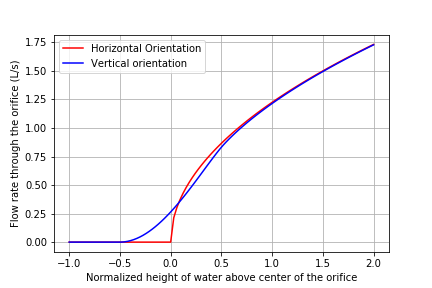

*************************************
Flow Control and Measurement Solution
*************************************

A Brief Programming Guide
=========================

 #. Do not use a numerical or iterative solution when an analytical solution is easily available.
 #. Whenever a function has the potential to be used multiple times, create a function call that includes the parameters that could potentially change.
 #. Do not break dependency. That means that if I change an input parameter at the top of your worksheet, that I should get the correct answers for the new parameter for all related calculations in the worksheet.
 #. Always use dimensions (units). All calculations involving physical units must include those units.
 #. Document your design process with comments.
 #. Do not redefine your variables in subsequent problems. This loses valuable digits of precision on your numbers and can cause a lot of trouble and frustration.
 #. For everyone’s sake, use logical and reasonable variable names. `Here is AguaClara variable naming convention <https://github.com/AguaClara/aguaclara/wiki/Design-Variable-Naming-Conventions>`_

A Brief Design Challenge guide
==============================

 #. Read the Problem statement in its entirety before beginning a problem. If you don’t immediately know what to do, read it again, thoroughly. If you are getting stuck, read it a third time. If you have a good understanding of what the problem is asking and are still having trouble, TAs can help through email or office hours.
 #. If you decide to email a TA, make sure the other two are CC’ed. This minimizes the time you will have to wait until one responds.
 #. When in doubt, Kernel -> Restart & Run All
 #. Play around! Print arrays, test inputs, and ask yourself if your answers are reasonable. Should flow have units of km mg/s?

.. code:: python

    import aguaclara as ac
    from aguaclara.core.units import unit_registry as u
    import numpy as np
    import matplotlib.pyplot as plt

Vertical Orifice Equation
=========================

1) Find the vena contract (VC) coefficient ratio for an orifice in the expert_inputs and print the result in a sentence. Please display 2 significant figures.

.. code:: python

    print('The vena contracta coefficient for an orifice is ',ac.VC_ORIFICE_RATIO,'.')

The vena contracta coefficient for an orifice is 0.63.

2) The simple orifice Equation :math:`Q = {\Pi _{vc}}{A_{or}}\sqrt {2g\Delta h}` that we normally use is not applicable for vertically oriented orifices that are partially or barely submerged. The `USGS published a great solution <https://il.water.usgs.gov/proj/feq/fequtl98.i2h/4_7aupdate.html>`__ for flow through partially submerged vertically oriented orifices. AguaClara uses a general solution for a vertically oriented orifice, which is available in the physchem file as ``pc.flow_orifice_vert``. That function handles vertically oriented orifices even if they are only partially submerged.

The vertical orifice equation is based on the concept that the velocity through the orifice at any point is equal to :math:`\sqrt{2gh}`, where h is the local depth of submergence. The total flow can be obtained by integration of that velocity over the submerged area of the orifice.

For this question, you will create a well formatted graph with two curves to display flow rate through a 5 cm diameter orifice oriented **vertically and horizontally**.

We want to be able to describe the height of the water in the orifice as relative to the orifice diameter size. The relationship between velocity and orifice diameter is true for orifices of any size, so it is valuable to create a nondimensional model that can be understood for all diameters. The flow rate that you will use for this question is as a function of the normalized depth of water from 1 diameter below the center of the orifice to 2 diameters above the center of the orifice.

The steps for making the graph are as follows:

  - Use ``np.linspace`` to generate an array of 100 dimensionless water surface elevations. The surface elevations should be normalized (also referred to as nondimensionalized) by the diameter of the orifice, and should range from -1 to 2 orifice diameters.
  - Create a second array for water elevation (with units) by multiplying the normalized water elevation array by the orifice diameter.
  - Create two arrays of flow rates through the orifice: one for the horizontal orifice orientation and one for the vertical orifice orientation. Use the two orifice equations ``pc.flow_orifice`` and ``pc.flow_orifice_vert`` in the physchem file, with orifice diameter and the dimensional water elevation array you created as inputs.
  - Plot the curves for vertical and horizontal orifice flow in L/s as a function of the normalized height of water.
  - Label the graph with flow rate in L/s as the y-axis and with normalized water elevation above the center of the orifice as the x-axis.
  - Include a legend for the two curves.

.. code:: python

    WaterElevationNormalized = np.linspace(-1,2,100)
    DiamOrifice = 5*u.cm
    WaterElevation = WaterElevationNormalized*DiamOrifice

    #Here we initialize some empty numpy arrays of the same size and type as WaterElevationNormalized
    HorizontalOrificeFlows = np.empty_like(WaterElevationNormalized)
    VerticalOrificeFlows = np.empty_like(WaterElevationNormalized)

    #Here we need to populate the arrays we created above.
    # Our graphing library, pyplot, cannot handle units, so we need to remove
    # them from each element as we insert it into the array.
    # While the code looks somewhat ugly, this is the best place to remove units;
    # we are removing them after all calculations have been made to minimize the
    # severity of floating-point errors.
    for i in range(len(WaterElevation)):
      HorizontalOrificeFlows[i] = (ac.flow_orifice(DiamOrifice, WaterElevation[i], ac.VC_ORIFICE_RATIO).to(u.L/u.s).magnitude)
      VerticalOrificeFlows[i] = (ac.flow_orifice_vert(DiamOrifice, WaterElevation[i], ac.VC_ORIFICE_RATIO).to(u.L/u.s).magnitude)

    fig, ax = plt.subplots()
    ax.plot(WaterElevationNormalized, HorizontalOrificeFlows, 'r-', WaterElevationNormalized, VerticalOrificeFlows, 'b-')

    ax.set(xlabel='Normalized height of water above center of the orifice')
    ax.set(ylabel='Flow rate through the orifice (L/s)')
    ax.legend(['Horizontal Orientation', 'Vertical orientation'])
    ax.grid(True)
    fig.savefig('../Images/Horizontal_vs_Vertical_Orifice_Orientation')
    plt.show()

.. _figure_Horizontal_vs_Vertical_Orifice_Orientation:

   Horizontal vs. Vertical Orifice Orientation

3) Write a paragraph about what the graph means by explaining the following two items: - Explain why the vertical orifice equation predicts more flow when the water level is below the center of the orifice and predicts less flow when the water level is above the center of the orifice. It might help to draw a picture of what the equations are describing to understand what is happening here! - Explain how the horizontal orifice equation function from ``physchem.py`` predicts the flow rate for submergence depths that are negative. You will need to find the function and look at the code.

Explanation
-----------

The vertical orifice has the lower part of the orifice partially submerged before the horizontal orifice has any part submerged. This explains why the vertical orifice has more flow than the horizontal orifice between -0.5 and 0.

The horizontal orifice has higher flow rates between 0 and 0.5 because it is fully submerged when the vertical orifice is still not fully submerged.

At the elevation where the vertical orifice is first fully submerged the flow rate through the vertical orifice is less than the flow rate through the horizontal orifice. This is a result of the nonlinear relationships between depth of submergence and velocity.

The difference between the two equations becomes negligible for submergence greater than 1 diameter.

For negative depths of submergence the horizontal orifice function uses an if statement to set the flow rate through the orifice equal to zero.

Linear Flow Orifice Meter (LFOM)
================================

A linear flow orifice meter is used in AguaClara plants to measure the plant flow rate and to provide a linear relationship between flow rate and the depth of water in the entrance tank. Below, we use the LFOM code to obtain a design for a linear flow orifice meter. Your task will be to test this design using the orifice equations to see if it is correct. We have a custom `LFOM class <https://aguaclara.github.io/aguaclara/design/lfom.html>`_ that defines the LFOM properties. This code will be updated soon based on the code below. In the meantime, the code below can be used for calculations.

The following questions are all answered in one big block of code to make it easy to change values and then see the resulting graph.

4) **Create a function** that calculates the flow rate through the LFOM as a function of only water elevation using the vertical orifice function. Use the arrays for LFOM key parameters, given above as ``my_LFOM.orifice_diameter``, ``my_LFOM.n_orifices_per_row``, and ``my_LFOM.height_orifices``.

 - Create an array for depth of submergence for each row of orifices at a given a height of water in the LFOM. This array is dependent on the water elevation (which should be your function input) and the height of the LFOM orifices (which is from the LFOM key parameters). Use this submergence depth array as the “height” input to your vertical orifice function. The array should be created within your function.

 - To calculate the flow rate through the LFOM, multiply the calculated flow for each row of orifices by the number of orifices in that row (``my_LFOM.n_orifices_per_row``) to get an array of flows through each row of orifices. Note: the vertical orifice function will report zero flow for any orifices that aren’t submerged, so you can send the whole array of depth of submergence for each row of orifices.

 - At the end of your function, sum flows from each row of the LFOM and return that value with the correct units.

 - Add a comment under the function definition to explain what the function does (see any of the aguaclara design files for examples of descriptive comments).

5) Calculate the total flow through the LFOM using the vertical orifice equation for the case when the water level is at the maximum water level for the LFOM, ``HeadlossLfom``. You are checking to make sure that the LFOM produces the correct target flow (given as ``Flow``) at the maximum height. Does it?

6) We want to compare the actual flow rate through the LFOM to the expected flow rate through the elevation as a function of water depth. Create a graph of the normalized actual and expected flow rates, using the following steps:

  - Create an 100-unit long array of water depths using ``np.linspace``. Note: the expected flow rate at elevation zero is zero, which makes the normalized flow rate undefined for zero elevation. An undefined normalized flow will not run and Python will report an error. You can solve this by beginning your water depth array at a very small (nonzero) elevation. You can end your water depth array at the maximum water depth. Recall that an array of elevations should have units of length.
  - Create an array of normalized actual flow rates at each water depth; use the function you created in Problem 4 and a ``for`` loop (the function you created in Problem 4 probably can’t handle an array of depths as input, so you need the ``for`` loop to cycle through each depth value to make your array of flows).

     - Start by creating an empty array for actual flow rates that is the same shape as the 100-unit water depth array you just created.
     - In your ``for`` loop, normalize the actual flow rates by using the following relationship: normalized actual flow rate = (actual flow rate)/[(water depth \* target flow rate)/maximum water level]

  - Plot a straight horizontal line at y = 1, which is your normalized expected flow value if the LFOM were perfect.

.. _figure_Normalized_Flow_Rate_vs_Water_Depth:

.. figure:: ../Images/Normalized_Flow_Rate_vs_Water_Depth.png
   :width: 400px
   :align: center
   :alt: Normalized Flow Rate vs. Water Depth

   Normalized Flow Rate vs. Water Depth

7) Play with the value for the plant flow rate, ``LFOM_flow``, and try a bunch of different flows over the range 1 to 100 L/s. The LFOM isn’t accurate for the first couple of rows.

8) Do you observe any failure modes where the design produces very inaccurate flow measurements? If so, then create an issue!

9) Explain why all LFOMs perform poorly when the water depth is in the first row of orifices.

The relationship between head and flow is nonlinear for a single row of orifices. Thus it is impossible for the LFOM to be accurate when there is only one row of orifices.

Laminar Flow Based Flow Controller
==================================

You will design (by completing the following questions) a laminar flow controller for chlorine feed for a plant design flow rate of 50 L/s.

For the following steps do NOT use the aguaclara cdc code. Instead, create the functions that you need to solve this problem. At the end, we will compare your solution to the aguaclara cdc solution.

You may assume that the chlorine stock solution kinematic viscosity is approximately the same as water. The dose controller is to have a maximum head loss of 20 cm through the dosing tubes. We will start with commercially available liquid bleach (equivalent to 51.4 gm/L of chlorine gas), which we will use in our chemical stock tanks without dilution. Our goal is to provide a constant chlorine dose of 2 mg/L to the water entering the storage tank. We will be following the guidelines given below.

 #. Calculate the maximum fow rate through each available dosing tube diameter that keeps error due to minor losses below 10%.

 #. Calculate the total chemical flow rate that would be required by the treatment system for the maximum chemical dose and the maximum allowable stock concentration.

 #. Calculate the number of dosing tubes required if the tubes flow at maximum capacity (round up).

 #. Calculate the length of the dosing tubes that correspond to each available tube diameter.

 #. Select the longest dosing tube that is shorter than the maximum tube length allowable based on geometric constraints.

 #. Select the dosing tube diameter, flow rate, and stock concentration corresponding to the selected tube length.

.. code:: python

  FlowPlant = 50*u.L/u.s
  T = 20 * u.degC
  NuBleach = ac.viscosity_kinematic(T)
  HeadlossDosingTubeMax = 20*(u.cm)
  StockCl2 = 51.4*(u.g/u.L)
  DoseCl2 = 2*(u.mg/u.L)
  RatioError = 0.1
  KMinor = 2

11) At the given water treatment plant design flow rate, what is the required flow of bleach (the chlorine stock solution)?

.. code:: python

    FlowStockClMax = (FlowPlant * DoseCl2 / StockCl2).to(u.mL/u.s)
    print('The required flow of bleach is', FlowStockClMax)

The required flow of bleach is 1.95 ml/s

12) How many liters of liquid bleach are required in one day? (you can simply change the units on the flow rate!)

.. code:: python

    print('The daily required flow of bleach is',FlowStockClMax.to(u.L/u.day))

The daily required flow of bleach is 168.09 l/day

13) Our next big goal is to choose a tubing size for the dosing tube (or tubes). This requires multiple steps. Begin by first creating a numpy array of tubing sizes between 1/16" and 5/16" with a 1/16" interval. Your list should contain 5 elements. Does ``np.linspace`` work here? What about ``np.arange``? Remember to always attach the units to the entire array and not to array elements!

.. code:: python

    DiamTubeArray = (np.arange(1,6,1)) * 1 / 16 * u.inch
    print(DiamTubeArray.magnitude, DiamTubeArray.units)

[ 0.0625  0.125   0.1875  0.25    0.3125] inch

14) What is the maximum average velocity in a dosing tube based on the constraint that minor losses must be small? This means that the minor losses account for ``RatioError`` fraction of the total losses (10% when ``RatioError`` is 0.1). Note that this velocity is independent of the tube diameter.

.. code:: python

    VelTubeMax = (((RatioError * 2 * HeadlossDosingTubeMax * u.gravity) / KMinor)**(1/2)).to(u.m/u.s)
    print('The maximum average velocity in a dosing tube is', VelTubeMax)

The maximum average velocity in a dosing tube is 0.443 m/s

15) What is the head loss due to minor losses in the tube when the tube is flowing at maximum capacity? Solve for this value algebraically by substituting your equation for the velocity in the tube into the minor loss equation and then calculate the value.

.. code:: python

    HeadlossMinorMax = RatioError * HeadlossDosingTubeMax
    print('The head loss due to minor losses when the tube is at maximum capacity is', HeadlossMinorMax)

The head loss due to minor losses when the tube is at maximum capacity is 2.0 cm

16) Create an array of the maximum flow rates corresponding to the array of tubing diameters. The flow rates must meet the error constraint.

.. math:: Q_{Max} = \frac{\pi D^2}{4}\sqrt{\frac{2h_{L}g \Pi_{error}}{\sum K_{e}}}

 - First, create a function that uses diameter and velocity as inputs to return flow rate. Note that ``ac.area_circle(diam)`` returns a circle’s area given its diameter, and you have already calculated the maximum average velocity in Problem 14.
 - Create the array of maximum flow rates using the array of tubing diameters and the maximum head loss through the dosing tubes.

.. code:: python

    def flow_cdc_max(diam, VelTubeMax):
        Flow = ac.area_circle(diam) * (VelTubeMax)
        return Flow

    FlowMaxArray = flow_cdc_max(DiamTubeArray, VelTubeMax).to(u.mL/u.s)
    print(FlowMaxArray)

[  0.87658228   3.5063291    7.88924048  14.02531641  21.91455688] milliliter / second

17) Find the minimum number of tubes for each of the available tube diameters that would be required to deliver the maximum flow of bleach.

.. code:: python

    NDosingTubes = np.ceil(FlowStockClMax / FlowMaxArray)
    print('The number of tubes of each diameter is', NDosingTubes)

The number of tubes of each diameter is [ 3.  1.  1.  1.  1.] dimensionless

18) Create an array of the maximum flow rate per tube for each of the available tubing diameters, given the number of tubes that would be used. This will be the flow through each dosing tube at the maximum flow of bleach.

.. code:: python

    FlowDosingTubeArray = FlowStockClMax / NDosingTubes
    print('The flow rate per tube is', FlowDosingTubeArray)
    print(FlowStockClMax)

The flow rate per tube is [ 0.64850843  1.94552529  1.94552529  1.94552529  1.94552529] milliliter / second
    1.9455252918287937 milliliter / second

19) We now know the target flow in the dosing tubes, the diameter of the tubes, and the target head loss through the tubes. Thus, we can solve for the length of the tube that will deliver that target flow. Write a function to find the length of each tube that could handle the entire flow. Your function should use the following equation:

.. math:: L = \frac{g h_{L}\pi D^4}{128 \nu Q_{Max}}-\frac{Q_{Max}}{16 \pi \nu}\sum K_{e}

Call your function to return the length of tubing required for each tube
size.

.. code:: python

    def length_tube(flow_max, diam, headloss_max, nu, k_minor):
        "Returns the length of tube necessary to handle the maximum flow."
        L = (((ac.gravity * headloss_max * np.pi * diam**4)/
                               (128 * nu * flow_max))-
                        ((k_minor * flow_max)/
                                 (16 * np.pi * nu)))
        return L

    LengthDosingTube = length_tube(FlowDosingTubeArray, DiamTubeArray,
                                     HeadlossDosingTubeMax, NuBleach, KMinor).to(u.m)

    print('The length of each dosing tube would be', LengthDosingTube)

The length of each dosing tube would be [  0.44406171   2.42832361  12.60675229  40.01021413  97.79237081] meter

20) Which option do you think is best? You can simply set the array index to your choice and then display your solution by using that index value on your arrays for number of tubes, flow rates, tube diameters, and length of tubes.

.. code:: python

    MYPICK = 1
    print('The number of dosing tubes I will need is',NDosingTubes[MYPICK])
    print('The flow through each tube is', FlowDosingTubeArray[MYPICK])
    print('The inner diameter of the tube is', DiamTubeArray[MYPICK])
    print('The length of each tube is', LengthDosingTube[MYPICK].to(u.m))

The number of dosing tubes I will need is 1
    The flow through each tube is 1.95 ml/s
    The inner diameter of the tube is 0.125 inch
    The length of each tube is 2.43 m

21) What physical constraints might you use to select the best solution? How did you make your selection in Problem 19?

The ideal solution will have - a “reasonable” number of tubes and thus one possibility is to select the smallest diameter of tubing that uses a single tube. However, this won’t work for plants with high flow rates of chemicals. - tubes that are short enough to mount in the water treatment plant

22) AguaClara has coded these dosing tube size functions in the CDC Functions (ac.CDC). Find the function calls for the length, diameter, and number of dosing tubes and use those functions to calculate the values for the problem that you solved above. Compare your answers. Your answers should agree!

Pending new solution using updated CDC code.
