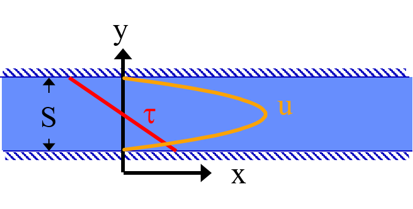
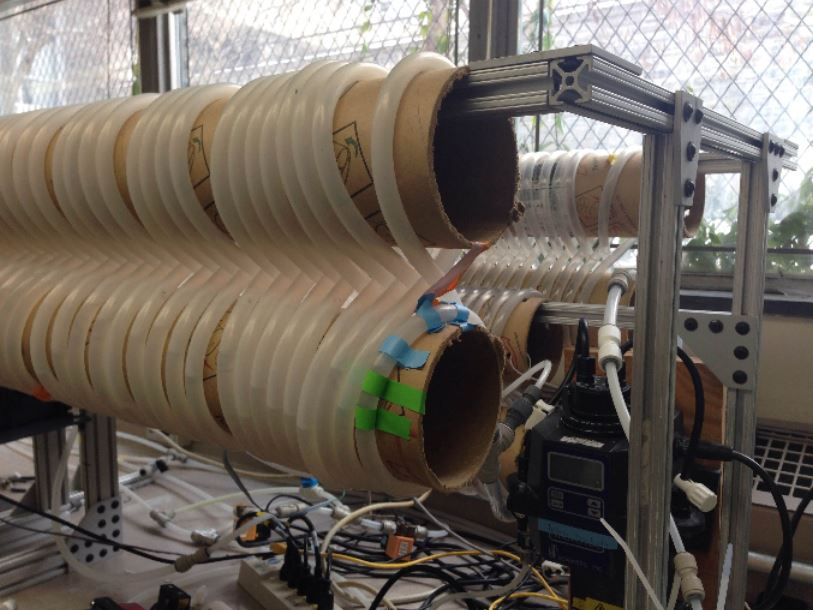
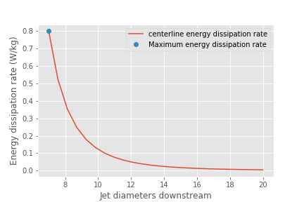

.. _title_Fluid_Deformation_and_Energy_Dissipation_derivations:

******************************************************
Fluid Deformation and Energy Dissipation Derivations
******************************************************

.. _heading_Equations_Varying_Flow_Geometries:

Equations for :math:`\varepsilon` and :math:`G` in Varying Flow Geometries
===============================================================================

Estimation of velocity gradients for various flow geometries is the basis for the design of rapid mix, flocculators, and plate settlers. Thus, our goal is to define the velocity gradients consistently across a range of possible flow regimes. There are three approaches to calculating the average velocity gradient within a control volume. 1) Use the Navier Stokes equations and solve for the spatially averaged velocity gradient. 1) Use Computational Fluid Dynamics (CFD) to solve for the spatially averaged velocity gradient. 1) Use the total mechanical energy loss in the control volume to calculate the energy dissipation rate. Estimate the velocity gradient directly from the energy dissipation rate, :math:`G_{CS} = \sqrt{\frac{\bar\varepsilon}{\nu}}`, as defined by Camp and Stein in 1943 (Camp, T. R., and Stein, P. C. (1943) ‘‘Velocity Gradients and Hydraulic Work in Fluid Motion,’’ J. Boston Soc. Civil Eng., 30, 203–221.).

The first approach would be ideal but is difficult in practice because Navier Stokes solutions are only available for limited geometries and laminar flow. CFD could be used but is difficult to use as a general engineering design approach given the large number of geometries that are used in drinking water treatment plants. For these reasons we will use the control volume approach to estimate the average velocity gradient. This method incorrectly assumes that the energy dissipation rate is completely uniform in the control volume and hence the velocity gradient is also uniform. This method results in an over estimation of the velocity gradient.
The Camp-Stein estimate of :math:`G_{CS}` is based on a control volume where the velocity gradient is uniform. Consider a layer of fluid of depth :math:`H` and apply a velocity, :math:`v` at the top of the fluid. The velocity gradient, :math:`G`, is thus :math:`\frac{v}{H}` everywhere in the fluid. The force required to move the top of the fluid at velocity v can be obtained from the required shear, :math:`\tau`. From Newtons Law of Friction we have

.. math::
  :label: tau_of_mu_G

  \tau = \mu \frac{v}{H} = \mu G = \nu\rho G

Where :math:`\tau` is the force required per unit plan view area. The power per unit area required to move the fluid at velocity :math:`v` is :math:`\tau v`. The mass per unit area is :math:`\rho H`. Thus the energy dissipation rate or the power per mass is

.. math:: \varepsilon = \frac{P}{m} = \frac{\tau v}{\rho H} = \frac{\nu \rho G v}{\rho H} = \nu G^2

This equation has no approximations, but has one very important assumption. We derived this equation for a control volume where the velocity gradient was **uniform**. The reactors and control volumes that we will be using as we design water treatment plants will **not** have uniform velocity gradients. Indeed, several of the water treatment processes will be turbulent and thus the velocity gradients in the fluid will vary in both space and time. Even in laminar flow in a pipe the velocity gradient is far from uniform with high velocity gradients at the wall and zero velocity gradient at the center of the pipe.

We’d like to know if we can apply the previous equation

.. math:: \varepsilon = \nu G^2

to the case where the energy dissipation rate and velocity gradients are nonuniform by simply introducing average values of both quantities.

.. math:: \bar\varepsilon \overset{?}{=} \nu \bar G^2

We will test this option with a simple case. Consider a hypothetical reactor (case 2) that is 4 times as large in plan view area as the uniform velocity gradient case explored above (case 1). In addition, assume that 3/4 of the reactor has a velocity gradient of zero. The average energy dissipation rate for case 1 is

.. math:: \bar \varepsilon_1 = \frac{P_1}{m_1} =  \nu \bar G_1^2

The average energy dissipation rate for case 2 is

.. math:: \bar \varepsilon_2 = \frac{P_1}{4m_1} = \frac{\bar \varepsilon_1}{4}

This makes sense because we are putting in the same amount of energy into a control volume that is 4 times bigger.

Now we calculate the velocity gradients. As previously determined,

.. math:: \bar G_1 = \sqrt{\frac{\bar\varepsilon_1}{\nu}}

The average velocity gradient in the second control volume is simply the volume weighted average

.. math:: \bar G_2 = \bar G_1\frac{1}{4}+ 0 \frac{3}{4}

where 1/4 of the case 2 control volume has the same velocity gradient as the case 1 control volume and 3/4 of the control volume has a velocity gradient of 0. The Camp Stein method would suggest that :math:`\bar G_2` is equal to

.. math:: \bar G_2 \overset{?}{=} \sqrt{\frac{\bar\varepsilon_2}{\nu}}= \sqrt{\frac{\bar\varepsilon_1}{4\nu}}

Now we check to see if the Camp Stein method of estimating the average velocity gradient, :math:`\bar G`, is correct.

.. math:: \bar G_2 = \frac{\bar G_1}{4} \neq \sqrt{\frac{\bar\varepsilon_1}{4\nu}} =  \frac{\bar G_1}{2}

Given that the energy dissipation rate is proportional to the square of the velocity gradient the mean of the energy dissipation rate is **not** proportional to the mean of the velocity gradient. Thus the Camp Stein method of calculating the average velocity gradient is not correct except in the case of uniform velocity gradient. The Camp Stein equation is dimensionally correct and could be corrected by adding a dimensionless constant :math:`\Pi_{CS}` that is a function of the energy dissipation rate distribution within the control volume.

.. math:: \bar G =\Pi_{CS}\sqrt{\frac{\bar\varepsilon}{\nu}}

where :math:`\Pi_{CS}` is 1 for a uniform velocity gradient and is less than one for non uniform velocity gradients. We can think :math:`\Pi_{CS}` as a measure of the efficiency of using energy to deform the fluid. We can calculate :math:`\Pi_{CS}` for cases where we have either a Navier Stokes or a computation fluid dynamics estimate of :math:`\bar G`.

The conventional approach to design of flocculators uses the Camp Stein definition of

.. math::
  :label: G_Camp_Stein

  G_{CS} = \sqrt{\frac{\bar\varepsilon}{\nu}}

where :math:`G_{CS}` is **not** the average velocity gradient, but is larger than the average velocity gradient by a factor of :math:`\Pi_{CS}`. Thus we have

.. math:: G_{CS} = \Pi_{CS}\bar G

Use of the Camp Stein velocity gradient in design of mixing units and flocculators results in an error when applying results from one reactor to another. If the energy dissipation rate distribution within the reactors is different, then :math:`\Pi_{CS}` will be different for the two reactors and the actual average velocity gradient, :math:`\bar G` will be different for the two reactors.

Given that energy is used more efficiently to produce velocity gradients if the velocity gradients are uniform, our goal is to design mixing and flocculation units that have relatively uniform velocity gradients. If all of our reactors at both research scale and municipal scale have similar values of :math:`\Pi_{CS}`, then we can use the Camp Stein definition of :math:`G_{CS}` and not introduce any significant errors. It will not be reasonable, however, to expect similar performance based on similar values of :math:`G_{CS}` if one reactor has relatively uniform energy dissipation rates and the other reactor has zones with very high energy dissipation rates and zones with very low energy dissipation rates.

We will demonstrate later that mechanically mixed reactors typically have a much wider range of energy dissipation rates than do well designed hydraulically mixed reactors. Thus comparisons between mechanically mixed and hydraulically mixed reactors must account for differences in :math:`\Pi_{CS}`.

We will use the Camp Stein definition :math:`G_{CS} = \sqrt{\frac{\bar\varepsilon}{\nu}}` as the design parameter of convenience in this textbook.

.. _heading_Estimates_of_time_required_for_mixing_processes:

Estimates of time required for mixing processes
================================================

.. _heading_Turbulent_Large_Scale_Eddies:

Turbulent Large Scale Eddies
------------------------------------

The first step in mixing is at the scale of the largest eddies. The largest eddies are limited in size by the smallest dimension normal to the direction of flow. Thus in a pipe the dimension of the largest eddies is set by the pipe diameter. In a open channel the dimension of the largest eddies is usually the water depth although it could be the width of the channel for the case of a narrow, deep channel.

Eddy turnover time, :math:`t_{eddy}`, is the time it takes for the eddy to travel a distance equal to its length-scale. Thus the eddy turnover time provides a good estimate of the time required for mixing to occur at the length scale of the eddy. We assume that the energy of the large eddy is dissipated into smaller length scales in the time :math:`t_{eddy}`:

.. math:: t_{eddy} \approx \frac{L_{eddy}}{v_{eddy}}

The rate of energy loss to smaller scales is

.. math::  \bar\varepsilon \approx\frac{v_{eddy}^2}{t_{eddy}}

Combining the two equations

.. math::  \bar\varepsilon \approx\frac{v_{eddy}^3}{L_{eddy}}

We can use this equation to estimate the eddy velocity given an energy dissipation rate.

.. math:: v_{eddy} \approx \left( \bar\varepsilon \, L_{eddy} \right)^\frac{1}{3}

Now we can solve for the eddy turnover time which is a measure of the mixing time at the eddy scale.

.. math::

      t_{eddy} \approx \frac{L_{eddy}}{\left( \bar\varepsilon \, L_{eddy} \right)^\frac{1}{3}} \approx \left( \frac{L_{eddy}^2}{ \bar\varepsilon }\right)^\frac{1}{3}

This provides a simple insight that the time required for an eddy to turn over scales with the size of the eddy raised to the 2/3 power. Thus large eddies take more time to turn over than do small eddies. Thus if we calculate the time required for large scale mixing using the dimension of the eddies, it will provide a reasonable estimate of the total time for mixing because mixing at all smaller scales requires much less time. A notable exception to this is the case of mixing in rivers. Rivers are usually shallow and wide. The largest eddies in a river are limited by the depth of the river. Mixing over the width of the river takes much longer than vertical mixing because multiple eddies are required to transport a substance from one side of the river to the other.

We can use the eddy velocity to estimate how long it will take for an eddy to cross the smallest dimension of flow. Eddy velocity is :math:`v_{eddy} \approx \left( \bar\varepsilon \, L_{eddy} \right)^\frac{1}{3}`.
The “:math:`\approx`” indicates that this relationship is the same order of magnitude.

Chemical injection into the center of a pipe is common in drinking water treatment plants. We can develop equations to estimate the distance required for full mixing with the fluid in the pipe. In a pipe we have

.. math:: v_{eddy} \approx \left( \bar\varepsilon \, D \right)^\frac{1}{3}

For a long straight pipe
:math:`\bar\varepsilon = \frac{{\rm f}}{2} \frac{\bar v^3}{D}` (Equation :eq:`eq_EDR_straight_pipe`) and thus we can obtain the ratio between mean velocity and the velocity of the large scale eddies.

.. math:: v_{eddy} \approx \left( \frac{{\rm f}}{2} \frac{\bar v^3}{D} \, D \right)^\frac{1}{3}

.. math:: \frac{v_{eddy}}{\bar v} \approx \left( \frac{{\rm f}}{2}  \right)^\frac{1}{3}

Given a friction factor of 0.02, the eddy velocity is approximately 20% of the mean velocity. We can use this ratio to estimate how many pipe diameters downstream from an injection point will the coagulant be mixed across the diameter of the pipe.

.. math::
  :label: mixing_pipe_diameters

  N_{D_{pipe}} \approx \frac{\bar v}{v_{eddy}} \approx \left(\frac{2}{{\rm f}} \right)^\frac{1}{3}

Where :math:`N_{D_{pipe}}` is the distance in number of pipe diameters downstream of the injection point where complete mixing will have occurred. This estimate is a minimum distance and a factor of safety of 2 or more would reasonably be applied. In addition it is best practice to inject the coagulant in the center of the pipe. Injecting the coagulant at the side of the pipe will require considerably greater distance downstream for mixing across the pipe.

.. code:: python

    print((0.02/2)**(1/3))

.. _heading_Inner_Viscous_Length_Scale:

Inner Viscous Length Scale
--------------------------

The smallest scale at which inertia containing eddies causes mixing is set by the final damping of inertia by viscosity. Turbulence occurs when fluid inertia is too large to be damped by viscosity. The ratio of inertia to viscosity is given by the Reynolds number, :math:`\rm Re`:

.. math:: {\rm{Re}} = \frac{\bar vD}{\nu}

Flows with high Reynolds numbers are turbulent (inertia dominated) and with low Reynolds are laminar (viscosity dominated). The transition Reynolds number is a function of the flow geometry and the velocity and length scale that are used to characterize the flow. In all turbulent flows there is a length scale at which inertia finally loses to viscosity. The scale where viscosity wins is some multiple of the Kolmogorov length scale, which is defined as:

.. math:: \eta_K = \left( \frac{\nu^3}{\varepsilon} \right)^{\frac{1}{4}}

where :math:`\eta_K` is the Kolmogorov length scale. At the Kolmogorov length scale viscosity completely dampens the inertia of the eddies and effectively “kills” the turbulence.

The length scale at which most of the kinetic energy contained in the small eddies is dissipated by viscosity is the inner viscous length scale, :math:`\lambda_v`, which according to Dimotakis (2000) is about `50 times larger than <https://doi.org/10.1017/S0022112099007946>`_
Thus we have

.. math::
  :label: eq_inner_viscous_length

  \lambda_\nu = \Pi_{K\nu}\left( \frac{\nu^3}{\varepsilon} \right)^{\frac{1}{4}}

where :math:`\Pi_{K\nu} = 50`

At length scales larger than the inner viscous length scale, :math:`\lambda_v`, the dominant transport mechanism is by turbulent eddies. At length scales smaller than :math:`\lambda_v` the dominant transport mechanism is fluid deformation due to shear. If the flow regime is completely laminar such as in a small diameter tube flocculator, then the dominant transport mechanism is fluid deformation due to shear at length scales all the way up to the diameter of the tubing.

The dividing line between eddy transport and fluid deformation controlled by viscosity can be calculated as a function of the energy dissipation rate using :eq:`eq_inner_viscous_length`.

.. code:: python

    """ importing """

    from aguaclara.core.units import unit_registry as u
    import aguaclara.core.utility as ut
    import numpy as np
    import matplotlib.pyplot as plt
    import aguaclara.research.floc_model as fm

    from matplotlib.ticker import FormatStrFormatter
    imagepath = 'Rapid_Mix/Images/'
    EDR_array = np.logspace(0,4,num=50)*u.mW/u.kg
    Temperature = 20*u.degC
    def Inner_viscous(EDR, Temperature):
        return fm.RATIO_KOLMOGOROV * fm.eta_kolmogorov(EDR, Temperature)

    fig, ax = plt.subplots()
    ax.semilogx(EDR_array.to(u.mW/u.kg),Inner_viscous(EDR_array, Temperature).to(u.mm))
    ax.yaxis.set_major_formatter(FormatStrFormatter('%.f'))
    ax.xaxis.set_major_formatter(FormatStrFormatter('%.f'))
    ax.set(xlabel='Energy dissipation rate (W/kg)', ylabel='Inner viscous length scale (mm)')
    ax.text(30, 6, 'Eddies cause mixing', fontsize=12,rotation=-30)
    ax.text(1, 5, 'Shear and diffusion cause mixing', fontsize=12,rotation=-30)
    fig.savefig(imagepath+'Inner_viscous_vs_EDR')
    plt.show()

.. _figure_Inner_viscous_vs_EDR:

.. figure:: Images/Inner_viscous_vs_EDR.png
    :width: 400px
    :align: center
    :alt: Inner viscous vs EDR

    Eddies can cause fluid mixing down to the scale of a few millimeters for energy dissipation rates used in rapid mix units and flocculators.

.. _heading_Mixing Time as a Function of Scale:

Turbulent Mixing Time as a Function of Scale
--------------------------------------------

We are searching for the rate limiting step in the mixing process as we transition from the scale of the flow down to the scale of the coagulant nanoparticles. We can estimate the time required for eddies to mix at their length scales by assuming that the eddies pass all of their energy to smaller scales in the time it takes for an eddy to travel the distance equal to the length scale of the eddy. This time is known as the **`eddy turnover time <http://ceeserver.cee.cornell.edu/eac20/cee637/handouts/TURBFLOW_1.pdf>`__**,
:math:`t_{eddy}`. :ref:`The derivation for the equation below is found here <heading_Estimates_of_time_required_for_mixing_processes>`.

.. math::
  :label: eq_t_eddy

   t_{eddy} \approx \left( \frac{L_{eddy}^2}{ \bar\varepsilon }\right)^\frac{1}{3}

We can plot the eddy turnover time as a function of scale from the inner viscous length scale up to the scale of the flow. We will discover whether large scale mixing by eddies is faster or slower than small scale mixing by eddies.

.. code:: python

    from aguaclara.core.units import unit_registry as u
    import aguaclara.core.utility as ut
    import numpy as np
    import matplotlib.pyplot as plt
    import aguaclara.research.floc_model as fm
    EDR_graph = np.array([0.01,0.1,1,10 ])*u.W/u.kg
    """Use the highest EDR to estimate the smallest length scale"""
    Inner_viscous_graph = Inner_viscous(EDR_graph[2], Temperature)
    Inner_viscous_graph
    L_flow = 0.5*u.m
    L_scale = np.logspace(np.log10(Inner_viscous_graph.magnitude),np.log10(L_flow.magnitude),50)
    L_scale
    imagepath = 'Rapid_Mix/Images/'
    fig, ax = plt.subplots()
    for i in range(len(EDR_graph)):
      ax.semilogx(L_scale,((L_scale**2/EDR_graph[i])**(1/3)).to_base_units())

    ax.legend(EDR_graph)

    #ax.yaxis.set_major_formatter(FormatStrFormatter('%.f'))
    #ax.xaxis.set_major_formatter(FormatStrFormatter('%.f'))
    ax.set(xlabel='Length (m)', ylabel='Eddy turnover time (s)')
    fig.savefig(imagepath+'Eddy_turnover_time')
    plt.show()

.. _figure_Eddy_turnover_time:

.. figure:: Images/Eddy_turnover_time.png
    :width: 400px
    :align: center
    :alt: Eddy turnover time

    Small eddies turn in less time than large eddies. This is why the mixing at the largest scale dominates the mixing time.

.. _heading_Shear-Diffusion_Transport:

Shear-Diffusion Transport
-------------------------

After the first few seconds in which mixing occurs from the length scale of the flow down to the inner viscous length scale the next step in the transport process is blending of the coagulant uniformly with the raw water. At the end of the turbulent transport the coagulant stock has been stretched out into thin bands throughout the raw water, but the two fluids are not actually blended together by turbulence. The blending is accomplished by a combination of fluid deformation controlled by viscous shear and then by molecular diffusion.

.. _heading_Fluid_Deformation_by_Shear:

Fluid Deformation by Shear
--------------------------

The time scale for fluid deformation is :math:`1/G` where :math:`G` is the velocity gradient. This simple relationship is because the velocity of fluid deformation is proportional to the length scale and thus the time to travel any given distance in a linear velocity gradient is always the same. Velocity gradients in conventional mechanized rapid mix units are order 1000 Hz and thus the time for fluid deformation to blur concentration gradients is approximately 1 ms. This confirms the idea that blending the coagulant with the raw water is actually a very fast process with the slowest phase being the transport by turbulent eddies at the scale of reactor.

The full time required for fluid deformation to achieve blending down to the scale where molecular diffusion takes over is likely a multiple of 1/G where the multiple is determined by the number of different directions that the fluid must be sheared in to reach close to uniform blending. However, even multiplying 1/G by a factor of 10 still results in very rapid mixing.

.. _heading_Einstein_Diffusion_Equation:

Einstein’s Diffusion Equation
-----------------------------

The final step of mixing is mediated by molecular diffusion. We can estimate the length scale at which fluid shear and diffusion provide transport at the same rate. Einstein’s diffusion equation is

.. math:: D_{Diffusion} = \frac{k_B T}{3 \pi \mu d_P}

where :math:`k_B` is the Boltzmann constant and :math:`d_P` is the diameter of the particle that is diffusion in a fluid with viscosity :math:`\nu` and density :math:`\rho`. The diffusion coefficient :math:`D_{Diffusion}` has dimensions of :math:`\frac{[L^2]}{[T]}` and can be understood as the velocity of the particle multiplied by the length of the mean free path. From dimensional analysis the time for diffusion to blur a concentration gradient over a length scale, :math:`L_{Diffusion}` is

.. math:: t_{Diffusion} \approx \frac{L_{Diffusion}^2}{D_{Diffusion}}

The shear time scale is :math:`1/G` and thus we can solve for the length scale at which diffusion and shear have equivalent transport rates.

.. math::  1/G \approx t_{Diffusion} \approx \frac{L_{Diffusion}^2}{D_{Diffusion}}

Substitute Einstein’s diffusion equation and solve for the length scale that transitions between shear and diffusion transport.

.. math:: L_{Diffusion}^{Shear} \approx \sqrt{\frac{k_B T}{3 G \pi \mu  d_P}}

.. code:: python

    import aguaclara.core.physchem as pc
    import aguaclara.research.floc_model as fm
    def L_Shear_Diffusion(G,Temperature,d_particle):
      return np.sqrt((u.boltzmann_constant*Temperature/
      (3 * G *  np.pi *pc.viscosity_dynamic(Temperature)* d_particle)).to_base_units())

    G = np.arange(10,5000)*u.Hz
    d_particle = fm.PACl.Diameter*u.m
    Temperature=20*u.degC
    x = (L_Shear_Diffusion(G,Temperature,d_particle)).to(u.nm)
    imagepath = 'Rapid_Mix/Images/'
    fig, ax = plt.subplots()
    ax.semilogx(G,x)
    ax.set(xlabel='Velocity gradient (Hz)', ylabel='Length scale (nm)')
    fig.savefig(imagepath+'Shear_diffusion_length_scale')
    plt.show()

.. _figure_Shear_diffusion_length_scale:

    The length scale at which diffusion becomes the dominant transport mechanism for coagulant nanoparticles as a function of the velocity gradient. The time scale for the final diffusion to achieve blending of the nanoparticles with the water is simply 1/G.

Molecular diffusion finishes the blending process by transporting the coagulant nanoparticles the last few hundred nanometers. The entire mixing process from the coagulant injection point to uniform blending with the raw water takes only a few seconds.

We have demonstrated that all of the steps for mixing of the coagulant nanoparticles with the raw water are very fast. Compared with the time required for flocculation, 10s to 1000s of seconds, the time required for this mixing (blending the nanoparticles uniformly with the water) is insignificant. The remaining steps are:
 1. Molecular diffusion causes some dissolved species and Al nanoparticles to aggregate.
 1. Fluid shear and molecular diffusion cause Al nanoparticles with attached formerly dissolved species to collide with inorganic particles (such as clay) and organic particles (such as viruses, bacteria, and protozoans).

The time scale for the fluid shear and molecular diffusion to cause coagulant nanoparticles to collide with particles is estimated in :ref:`heading_Diffusion_and_Shear_Transport_Coagulant_Nanoparticles_to_Clay`.

Below are the derivations for the equations that appear in :numref:`table_Control_volume_equations` containing equations for :math:`G`, :math:`\varepsilon`, and :math:`h_L`.

.. _heading_Straight_Pipe_Wall_Shear:

Straight pipe (wall shear)
--------------------------

The average energy dissipation rate, :math:`\bar\varepsilon`, in a control volume with residence time :math:`\theta` is

.. math::
  :label: eq_EDR_straight_pipe

  \bar\varepsilon = \frac{gh_{\rm{L}}}{\theta}

The residence time can be expressed as a function of length and average velocity.

.. math::

  \theta = \frac{L}{\bar v}

For straight pipe flow the only head loss is due to wall shear and thus we have the Darcy Weisbach equation.

.. math::

     h_{{\rm f}} = {{\rm f}} \frac{L}{D} \frac{\bar v^2}{2g}

Combining the 3 previous equations we obtain the energy dissipation rate for pipe flow

.. math::

  \bar\varepsilon = \frac{{\rm f}}{2} \frac{\bar v^3}{D}

The average velocity gradient was defined by Camp and Stein as

.. math::

   G_{CS} = \sqrt{\frac{\bar \varepsilon}{\nu}}

where this approximation neglects the fact that square root of an average is not the same as the average of the square roots.

.. math::

   G_{CS} = \left(\frac{{\rm f}}{2\nu} \frac{\bar v^3}{D} \right)^\frac{1}{2}

or in terms of flow rate, we have:

.. math::

   G_{CS} = \left(\frac{\rm{32f}}{ \pi^3\nu} \frac{Q^3}{D^7} \right)^\frac{1}{2}

.. _heading_Straight_Pipe_Laminar:

Straight Pipe Laminar
---------------------

Laboratory scale apparatus is often limited to laminar flow where viscosity effects dominate. The equations describing laminar flow conditions always include viscosity. For the case of laminar flow in a straight pipe, we have:

.. math::

   {\rm f} = \frac{64}{Re}

Reynolds number is defined as

.. math::

   Re= \frac{\bar vD}{\nu}

The Darcy Weisbach head loss equation simplifies to the Hagen–Poiseuille equation for the case of laminar flow.

.. math::

   h_{{\rm f}} = \frac{32\nu L\bar v}{gD^2}

and thus the energy dissipation rate in a straight pipe under conditions of laminar flow is

.. math::

  \bar\varepsilon =32\nu \left( \frac{\bar v}{D} \right)^2

The Camp-Stein velocity gradient in a long straight laminar flow tube is thus

.. math::

   G_{CS}^2 =32 \left( \frac{\bar v}{D} \right)^2

.. math::

   G_{CS} =4\sqrt2 \frac{\bar v}{D}

Our estimate of :math:`G_{CS}` based on :math:`\bar \varepsilon` is an overestimate because it assumes that the energy dissipation is completely uniform through the control volume. The true spatial average velocity gradient, :math:`\bar G`, for laminar flow in a pipe is (`Gregory, 1981 <https://doi.org/10.1016/0009-2509(81)80126-1>`__),

.. math::

  \bar G = \frac{8}{3}\frac{\bar v}{D}

Our estimate of :math:`G_{CS}` for the case of laminar flow in a pipe is too high by a factor of :math:`\frac{3}{\sqrt2}`.

As a function of flow rate we have

.. math::

  \bar v=\frac{Q}{A} = \frac{4Q}{\pi D^2}

.. math::

   G_{CS} =\frac{16\sqrt2}{\pi} \frac{Q}{D^3}

.. _heading_Parallel_Plates_Laminar:

Parallel Plates Laminar
-------------------------

Flow between parallel plates occurs in plate settlers in the sedimentation tank. We will derive the velocity gradient at the wall using the Navier Stokes equation.

.. _figure_Parallel_Plate_schematic:

   A fluid flowing from left to right due to a pressure gradient results in wall shear on the parallel plates. This flow profile is for the case when the pressure gradient is negative.

We start with the Navier-Stokes equation written for flow in the x direction.

.. math::

  \frac{y^2}{2} \frac{dp}{dx} + Ay + B = \mu u

where :math:`u` is the velocity in the x direction.

Apply the no slip condition at bottom plate.

.. math::

   u=0 \quad at \quad y=0

Thus the constant :math:`B=0`.

Apply the no slip condition at top plate.

.. math::

   u=0 \quad at \quad y=S

Thus the constant :math:`A = \frac{- S}{2} \frac{dp}{dx}`

Substitute the values for constants :math:`A` and :math:`B` into the original equation.

.. math::

  \frac{y^2}{2} \frac{dp}{dx} - \frac{S}{2} \frac{dp}{dx} y = \mu \,u

Simply the equation to obtain

.. math::

   u = \frac{y \left( y - S \right)}{2 \mu} \frac{dp}{dx}

We need a relationship between average velocity and :math:`\frac{dp}{dx}`. We can obtain this by integrating from 0 to
:math:`S`.

.. math::

   {\bar v } = \frac{q}{S}
   = \frac{1}{S}\int\limits_0^S u dy
   = \frac{1}{S} \int\limits_0^S
  \left(
  \frac{y^2 - S y}{2 \mu} \left( \frac{dp}{dx} \right)
  \right) dy

.. math::

  \bar v = - \frac{S^2}{12 \mu} \frac{dp}{dx}

Solving for :math:`\frac{dp}{dx}`

.. math::

  \frac{dp}{dx} = - \frac{12 \mu \bar v}{S^2}

From the Navier Stokes equation after integrating once we get

.. math::

  \mu \,\left( \frac{du}{dy} \right) = y \frac{dp}{dx} + A

Substituting our boundary condition,
:math:`A = \frac{- S}{2} \frac{dp}{dx}` we obtain

.. math::

  \frac{du}{dy}_{y = 0} = - \frac{S}{2 \mu} \frac{dp}{dx}

Substituting the result for :math:`\frac{dp}{dx}` we obtain

.. math::

  \frac{du}{dy}_{y = 0} = \frac{6 \bar v}{S}

Therefore in velocity gradient notation we have

.. math::

   G_{wall} = \frac{6 \bar v}{S}

The energy dissipation rate at the wall

.. math:: \varepsilon_{wall} = G_{wall}^2 \nu

.. math::

  \varepsilon_{wall} = \left( \frac{6 \bar v}{S}\right)^2 \nu

Head loss due to shear on the plates is obtained from a force balance on a control volume between two parallel plates as shown in :numref:`figure_Parallel_Plate_schematic`.

A force balance on a control volume gives

.. math::

   2 \tau L W = -\Delta P W S

.. math::

  \Delta P = -\frac{2 \tau L}{S}

The equation relating shear and velocity gradient is

.. math::

  \tau = \nu \rho \frac{du}{dy} = \nu \rho G

The velocity gradient at the wall is

.. math::

   G_{wall} = \frac{6 \bar v}{S}

.. math::

  \tau  = \nu \rho \frac{6 \bar v}{S}

Substituting into the force balance equation

.. math::

  \Delta P = -\frac{2 \nu \rho 6 \bar v L}{S^2}

The head loss for horizontal flow at uniform velocity simplifies too

.. math::

   h_{{\rm f}} = \frac{-\Delta P}{\rho g}

.. math::

   h_{{\rm f}} = 12\frac{ \nu \bar v L}{gS^2}

The average energy dissipation rate is

.. math::

  \bar\varepsilon = \frac{gh_{\rm{L}}}{\theta}

.. math::

  \bar\varepsilon = 12 \nu \left(\frac{  \bar v}{S} \right)^2

The Camp-Stein velocity gradient for laminar flow between parallel plates is

.. math::

   G_{CS} = 2\sqrt{3}\frac{  \bar v}{S}

.. _heading_Coiled_tubes_(laminar_flow):

Coiled tubes (laminar flow)
----------------------------

Coiled tubes are used as flocculators at laboratory scale. The one shown below is a doubled coil. A single coil would only go around one cylinder

` <https://confluence.cornell.edu/display/AGUACLARA/Laminar+Tube+Floc?preview=/10422268/258146480/ReportLaminarTubeFlocSpring2014.pdf>`__

.. _figure_Coiled_tube_flocculator:

   The double coiled laminar flow flocculator creates secondary currents that oscillate in direction. This may be helpful in creating much more mixing than would occur in a straight laminar flow pipe.

The ratio of the coiled to straight friction factors is given by `Mishra and Gupta <https://doi.org/10.1021/i260069a017>`__

The Dean number is defined as:

.. math::

   De = Re\left(\frac{D}{D_c}\right)^\frac{1}{2}

where :math:`D` is the inner diameter of the tube and :math:`D_c` is the diameter of the coil. Note that the tubing coils are actually helixes and that for the tubing diameters and coil diameters used for flocculators that the helix doesn’t significantly change the radius of curvature.

.. math::

  \frac{{\rm f}_{coil}}{{\rm f}} = 1 + 0.033\left(log_{10}De\right)^4

.. math::

   h_{L_{coil}} = h_{{\rm f}} \left[ 1 + 0.033\left(log_{10}De\right)^4 \right]

where :math:`h_{{\rm f}} = \frac{32\nu L\bar v}{ g D^2}`. Note that we switch from major losses to total head loss here because the head loss from flowing around the coil is no longer simply due to shear on the
wall.

.. math::

   h_{L_{coil}} = \frac{32\nu L\bar v}{ g D^2} \left[ 1 + 0.033\left(log_{10}De\right)^4 \right]

The average energy dissipation rate is

.. math::

  \bar\varepsilon = 32\nu \left( \frac{\bar v}{D} \right)^2 \left[ 1 + 0.033\left(log_{10}De\right)^4 \right]

The average velocity gradient is proportional to the square root of the head loss and thus we obtain

.. math::

   G_{CS_{coil}} = G_{CS}\left[ 1 + 0.033\left(log_{10}De\right)^4  \right]^\frac{1}{2}

where :math:`G_{CS} =4\sqrt2 \frac{\bar v}{D}` for laminar flow in a straight pipe.

.. math::

   G_{CS_{coil}} = 4\sqrt2 \frac{\bar v}{D}\left[ 1 + 0.033\left(log_{10}De\right)^4  \right]^\frac{1}{2}

.. _heading_Flow_in_porous_media:

Flow in porous media
--------------------

The `Ergun equation <https://neutrium.net/fluid_flow/pressure-drop-through-a-packed-bed/>`_ applies to both laminar and turbulent flow through packed beds.

.. math::
  :label: eq_Ergun

    h_f = \frac{L}{2g D_{sand}} \left( 300 \frac{\nu v_a (1-\phi)^2}{D_{sand} \phi^3} + 3.5 \frac{v_a^2 (1-\phi) }{\phi^3} \right)

The Ergun equation can be rewritten to be consistent with the format of the Darcy-Weisbach equation. To do this we add a factor of 2 to the definition of the Ergun friction factor and will divide by the factor of 2 in a subsequent equation. The modified Ergun friction factor is

.. math::
  :label: eq_f_porous_media

    f_{\phi} = \frac{300}{Re_{\phi}} + 3.5

where the :math:`Re_{\phi}` includes the porosity effect on the velocity and is given by

.. math::
  :label: eq_Re_porous_media

    Re_{\phi} = \frac{v_a D_{sand}}{\nu(1-\phi)}

I added a factor of two into the denominator to be consistent with the Darcy-Weisbach equation to obtain the modified Ergun equation.

.. math::
  :label: eq_Ergun_of_f

    h_f = f_{\phi} \frac{L}{D_{sand}} \frac{v_a^2}{2g} \frac{(1-\phi)}{\phi^3}

The residence time in a porous media bed is given by

.. math::

  \theta = \frac{L\phi} {v_a}

Now we can calculate the average energy dissipation rate in porous media.

.. math::

  \bar\varepsilon = \frac{g h_f}{\theta}

Substituting the equations for head loss and residence times we obtain

.. math::
  :label: eq_EDR_CS_porous_media

   \bar\varepsilon = \frac{f_{\phi}}{2} \frac{v_a^3}{D_{sand}} \frac{(1-\phi)}{\phi^4}

The Camp Stein velocity gradient for flow in porous media is

.. math::
  :label: eq_G_CS_porous_media

    G_{CS} = \left(\frac{f_{\phi}}{2\nu} \frac{v_a^3}{D_{sand}} \frac{(1-\phi)}{\phi^4}\right)^{\frac{1}{2}}

.. _heading_Expansions:

Expansions
-----------

The average energy dissipation rate for a flow expansion really only has meaning if there is a defined control volume where the mechanical energy is lost. Hydraulic flocculators provide such a case because the same flow expansion is repeated and thus the mechanical energy loss can be assumed to happen in the volume associated with one flow expansion. In this case we have

.. math::

   h_e =  K\frac{\bar v_{out}^2}{2g}

In this Equation :math:`K` represents the fraction of the kinetic energy that is dissipated.

If we define the length of the control volume (in the direction of flow) as :math:`H` then the residence time is

.. math::

  \theta = \frac{H}{\bar v}

.. math::

  \bar\varepsilon = \frac{gh_{\rm{e}}}{\theta}

Combining the previous equations we obtain

.. math::

  \bar\varepsilon = K\frac{\bar v_{out}^3}{2H}

.. math::

   G_{CS} = \sqrt{\frac{\bar \varepsilon}{\nu}}

.. math::

   G_{CS} = \bar v_{out}\sqrt{\frac{K\bar v_{out}}{2H\nu}}

.. _heading_Maximum_velocity_gradients:

Maximum velocity gradients
============================

.. _heading_Straight_pipe_(major_losses):

Straight pipe (major losses)
-----------------------------

The maximum velocity gradient in pipe flow occurs at the wall. This is true for both laminar and turbulent flow. In either case a force balance on a control volume of pipe gives us the wall shear and the wall shear can then be used to estimate the velocity gradient at the wall.

.. _figure_pipe_pressure_shear_force_balance:

.. figure:: Images/pipe_pressure_shear_force_balance.png
      :width: 400px
      :align: center
      :alt: Pipe pressure and shear force balance

      A fluid flowing from left to right due to a pressure gradient results in wall shear.

A force balance for the case of steady flow in a round pipe requires that sum of the forces in the x direction must equal zero. Given a pipe with diameter, D, and length, L, we obtain

.. math::

  \left(P_{in}- P_{out}\right)\frac{\pi D^2}{4} = \tau_{wall} \pi D L

.. math::

   -\Delta P\frac{D}{4} = \tau_{wall} L

For this control volume the energy equation simplifies to

.. math::

   -\Delta P=\rho g h_{{\rm f}}

The relationship between shear and velocity gradient is

.. math::

  \tau_{wall} = \mu \frac{du}{dy}_{wall} = \nu \rho G_{wall}

Combining the energy equation, the force balance, and the relationship between shear and velocity gradient we obtain

.. math::

  \rho g h_{{\rm f}}\frac{D}{4} = \nu \rho G_{wall} L

.. math::

   G_{wall} = \frac{g h_{{\rm f}}D}{4\nu L}

This equation is valid for both laminar flow. For turbulent flow it is necessary to make the approximation that wall shear perpendicular to the direction of flow is insignificant in increasing the magnitude of the wall shear. We can substitute the Darcy Weisbach equation for head loss to obtain

.. math::

   G_{wall} ={\rm f}  \frac{\bar v^2}{8\nu}

The energy dissipation rate at the wall is

.. math::

  \varepsilon_{wall} = G_{wall}^2 \nu

.. math::

  \varepsilon_{wall} = \frac{1}{\nu}\left({\rm f}  \frac{\bar v^2}{8} \right)^2

For laminar flow we can substitute :math:`{\rm f} = \frac{64}{{\rm Re}}` and the definition of the Reynolds number to obtain

.. math::

   G_{wall} =  \frac{8\bar v}{D}

This equation is useful for finding the velocity gradient at the wall of a tube settler.

The energy dissipation rate at the wall is

.. math::

  \varepsilon_{wall} = G_{wall}^2 \nu

.. math::

  \varepsilon_{wall} = \left(\frac{8\bar v}{D} \right)^2 \nu

.. _heading_coiled-tubes-laminar-flow-1:

Coiled tubes (laminar flow)
---------------------------

The shear on the wall of a coiled tube is not uniform. The outside of the curve has a higher velocity gradient than the inside of the curve and there are secondary currents that results in wall shear that is not purely in the locally defined upstream direction. We do not have a precise equation for the wall shear. The best we can do currently is define an average wall shear in the locally defined direction of flow by combining
:math:`G_{{CS}_{wall_{coil}}} =\rm{f_{coil}} \frac{\bar v^2}{8\nu}` and
:math:`{\rm f}_{coil} = {\rm f} \left[ 1 + 0.033\left(log_{10}De\right)^4 \right]`
to obtain

.. math::

   G_{{CS}_{wall_{coil}}} ={\rm f} \left[ 1 + 0.033 \left(log_{10}De \right)^4 \right]  \frac{\bar v^2}{8\nu}

.. _heading_Expansions-1:

Expansions
----------

Flow expansions are used intentionally or unavoidable in multiple locations in hydraulically optimized water treatment plants. Rapid mix and hydraulic flocculation use flow expansions to generate fluid mixing and collisions between particles. Flow expansions are responsible for minor losses and the rate at which expansions dissipate energy increases as the dimension of the jet decreases.

.. _heading_Round_Jet:

Round Jet
-----------

The energy dissipation rate at the centerline of a round jet is a well studied phenomenon (`Baldyga, et al. 1995 <https://doi.org/10.1016/0009-2509(95)00049-B>`__).

.. math::

  \varepsilon_{Centerline} = \frac{50 D_{Jet}^3 \bar v_{Jet}^3}{ \left( x - 2 D_{Jet} \right)^4}

The maximum energy dissipation rate occurs at approximately 7D downstream from the origin of the jet.

.. math::

  \varepsilon_{Max} = \frac{\left( \frac{50}{\left( 5 \right)^4} \right) \bar v_{Jet}^3}{D_{Jet}}

The measured dimensionless coefficient, :math:`\Pi_{JetRound}`, is proportional to the fraction of the kinetic energy that is dissipate in the time required for the jet to travel a distance equal to its original diameter. The higher this coefficient the faster the jet dissipates its energy. The coefficient is only a function of the geometry of the jet and thus round jets and plane jets have different coefficients.

.. math::

  \varepsilon_{Max} = \Pi_{JetRound} \frac{\bar v_{Jet} ^3}{D_{Jet}}

.. math::

  \Pi_{JetRound} = 0.08

The maximum velocity gradient in a jet is thus

.. math::

   G_{Max} = \bar v_{Jet} \sqrt{\frac{\Pi_{JetRound} \bar v_{Jet} }{\nu D_{Jet}}}

Below we plot the Baldyga et al. equation for the energy dissipation rate as a function of distance from the discharge location for the case of a round jet that is discharging into a large tank.

.. _figure_Jet_centerline_EDR:

    The centerline energy dissipation rate downstream from a round jet. The distance downstream is measured in units of jet diameters. The energy dissipation rate between the jet and 7 jet diameters is developing as the shear between the stationary fluid and the jet propagates toward the center of the jet and turbulence is generated.

.. _heading_Plane_Jet:

Plane Jet
---------

Plane jets occur in hydraulic flocculators and in the sedimentation tank inlet jet system. We haven’t been able to find a literature estimate of the maximum energy dissipation rate in a plane jet. Original measurements of a plane turbulent jet have been made by `Heskestad in 1965 <http://dx.doi.org/10.1115/1.3627309>`__ and it may be possible to use that data to get a better estimate of :math:`\Pi_{JetPlane}` from that source.

.. math::

  \Pi_{\bar \varepsilon}^{\varepsilon_{Max}} = \frac{\varepsilon_{Max}}{\bar \varepsilon}

.. math::
  :label: EDR_JetPlane

  \varepsilon_{Max} = \Pi_{JetPlane}  \frac{  \bar v_{Jet} ^3}{S_{Jet}}

The maximum velocity gradient is thus

.. math::
  :label: eq_G_JetPlane

   G_{Max} = \bar v_{Jet}\sqrt{\frac{\Pi_{JetPlane} \bar v_{Jet}}{\nu S_{Jet}}}

.. math::

  \bar v = \frac{Q}{SW}

.. math::

  \bar v_{Jet} = \frac{\bar v}{\Pi_{VCBaffle}}

.. math::

   S_{Jet} = S \Pi_{VCBaffle}

The average hydraulic residence time for the fluid between two baffles
is

.. math::

  \theta_B = \frac{H}{\bar v}

where :math:`H` is the depth of water. Substituting into the equation for :math:`\varepsilon_{Max}` to get the equation in terms of the average velocity :math:`\bar v` and flow dimension :math:`S`

.. math::

  \varepsilon_{Max}= \frac{\Pi_{JetPlane}}{S \Pi_{VCBaffle}} \left( \frac{ \bar v}{\Pi_{VCBaffle}} \right)^3

From the control volume analysis the average energy dissipation rate is

.. math::

  \bar \varepsilon = K \frac{\bar v^2}{2} \frac{1}{\theta_B} = \frac{K}{2} \frac{\bar v^3}{H_e}

where :math:`K` is the minor loss coefficient for flow around the end of a baffle with a :math:`180^\circ` turn.

Substitute the values for :math:`\bar \varepsilon` and
:math:`\varepsilon_{Max}` to obtain the ratio,
:math:`\Pi_{\bar \varepsilon}^{\varepsilon_{Max}}`

.. math::

  \Pi_{\bar \varepsilon}^{\varepsilon_{Max}} = \frac{\Pi_{JetPlane}}{\Pi_{VCBaffle}^4} \frac{2 H_e}{K S}

:math:`\Pi_{\bar \varepsilon}^{\varepsilon_{Max}}` has a value of 2 for
:math:`H_e/S <5` (CFD analysis and `Haarhoff, 2001 <https://search-proquest-com.proxy.library.cornell.edu/docview/1943098053?accountid=10267>`__)
The transition value for :math:`H_e/S` is at 5 (from CFD analysis, our weakest assumption).

We also have that :math:`\Pi_{\bar \varepsilon}^{\varepsilon_{Max}}` has a value of
:math:`\frac{\Pi_{JetPlane}}{\Pi_{VCBaffle}^4} \frac{2 H_e}{K S}` for
:math:`H_e/S>5`. Thus we can solve for :math:`\Pi_{JetPlane}` at
:math:`H_e/S=5`

.. math::

  \Pi_{JetPlane} = \left(
  \Pi_{\bar \varepsilon}^{\varepsilon_{Max}} \Pi_{VCBaffle}^4 \frac{K}{2} \frac{S}{H_e}
  \right)

.. math::

  \Pi_{JetPlane} = 0.0124

.. code:: python

    import aguaclara.core.constants as con
    VC_BAFFLE_RATIO=con.VC_ORIFICE_RATIO**2
    K_MINOR_FLOC_BAFFLE = (1/VC_BAFFLE_RATIO - 1)**2
    Ratio_Jet_Plane = 2*con.VC_ORIFICE_RATIO**8 * K_MINOR_FLOC_BAFFLE/2/5
    Ratio_Jet_Plane

    VC_BAFFLE_RATIO**4*K_MINOR_FLOC_BAFFLE/Ratio_Jet_Plane

.. _heading_Behind_a_flat_plate:

Behind a flat plate
---------------------

A flat plate normal to the direction of flow could be used in a hydraulic flocculator. In vertical flow flocculators it would create a space where flocs can settle and thus it is not a recommended design.

The impellers used in mechanical flocculators could be modeled as a rotating flat plate. The energy dissipation rate in the wake behind the flat plate is often quite high in mechanical flocculators and this may be responsible for breaking previously formed flocs.

Ariane Walker-Horn modeled the flat plate using Fluent in 2015.

.. _figure_CFD_Flat_Plate:

.. figure::    Images/CFD_Flat_Plate.png
      :width: 600px
      :align: center
      :alt: CFD Flat Plate

      The energy dissipation rate and streamlines for a 1 m wide plate in two dimensional flow with an approach velocity of :math:`1 m/s`. The maximum energy dissipation rate was approximately :math:`0.04 W/kg`.

.. math::

  \varepsilon _{Max} = \Pi_{Plate}\frac{\bar v^3}{W_{Plate}}

The maximum velocity gradient is thus

.. math::

   G_{Max} = \bar v\sqrt{\frac{\Pi_{Plate} \bar v}{\nu W_{Plate}}}

.. math::

  \Pi_{Plate} = \frac{ \left( \varepsilon_{Max} W_{Plate} \right)}{\bar v^3}

.. code:: python

    """CFD analysis setup used by Ariane Walker-Horn in 2015"""
    EDR_Max = 0.04*u.W/u.kg
    v = 1*u.m/u.s
    W = 1*u.m
    Ratio_Jet_Plate = (EDR_Max * W/v**3).to_base_units()
    print(Ratio_Jet_Plate)

The flat plate :math:`\Pi_{Plate}` has a value of 0.04.
