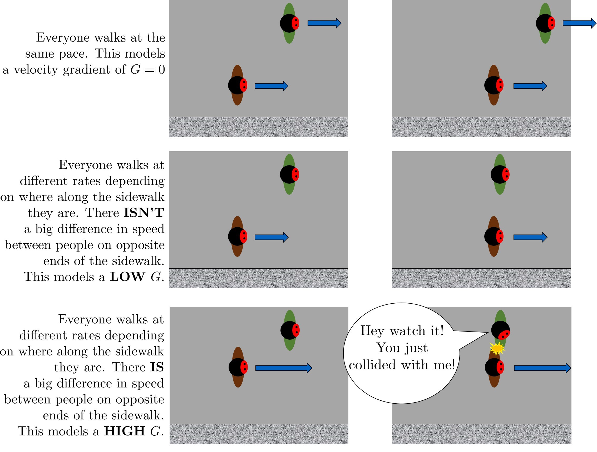

.. _title_Fluid_Deformation_and_Energy_Dissipation_introduction:

******************************************************
Energy Dissipation Rate, Velocity Gradient, and Mixing
******************************************************

In addition to the general fluids review (:ref:`title_review_fluid_mechanics`), there are a few extra fluid dynamics concepts that are important to know in order to understand drinking water treatment and AguaClara’s approach to it. These concepts are primarily focused on the relationships between:
 - Turbulence
 - Viscosity
 - Shear
 - Velocity Gradients (:math:`G`),which serve as a measure of fluid deformation
 - Energy Dissipation Rate (EDR, :math:`\varepsilon`)

Knowledge of these concepts and how they interact is critical to understand rapid mix, flocculation, filtration, and disinfection. These concepts and their interactions first become relevant in rapid mix, the step in which the coagulant gets added to the raw water.

The two concepts that were not covered in the previous chapter, :ref:`title_review_fluid_mechanics`, are velocity gradient :math:`G` and energy dissipation rate :math:`\varepsilon`. While these will be very thoroughly described over the course of this introduction, a brief and simple explanation is included to help get the ball rolling.

Understanding :math:`G` and :math:`\varepsilon`
================================================

:math:`G`, or velocity gradient, is a measure of fluid deformation. It is defined by how quickly one point of water along one streamline moves in comparison to another point on another streamline (:math:`v_A` compared to :math:`v_B`, for example), taking into account the distance between the streamlines, :math:`\Delta h`. A visual example of a velocity gradient is shown in the image below:

.. _figure_Velocity_gradient_image:

.. figure:: ../Images/Velocity_gradient_image.jpg
    :width: 700px
    :align: center
    :alt: Velocity gradient image

    Velocity gradients cause relative velocities of fluid elements. Those relative velocities form the basis of particle collisions that are essential for the flocculation process.

**Note on terminology:** “Fluid deformation” is equivalent to “velocity gradient,” and the two terms can be used interchangeably. They are different ways of thinking about the same concept. Thus, :math:`G` is the measure of both terms.

:math:`\varepsilon`, or energy dissipation rate, is the rate that the kinetic energy of the fluid is being converted to heat. EDR is a very useful concept because the last step of converting kinetic energy into heat is accomplished by viscosity (:math:`\nu`). This kinetic energy being dissipated by viscosity is the energy associated with velocity gradients (:math:`G`). Thus, through EDR there is a direct connection between :math:`\nu` and :math:`G`. This connection will be further covered later on in this introduction.

As mentioned above, EDR and velocity gradients play an important role in mixing and in causing suspended particles to collide with each other, both of which are important topics in flocculation. Their use is not limited to flocculation, they are also helpful in understanding failure modes of plate settlers and terminal head loss of sand filters

.. todo:: Add links to textbook sections for plate settlers and filtration

We will begin by defining the concept of energy dissipation rate for a control volume. In a control volume that does not include pumps, turbines or other external energy sources or sinks, the mechanical energy lost is indicated by a change in elevation and quantified as :math:`g h_L`. That mechanical energy is lost in the time, :math:`\theta`, that the fluid is in the control volume.

.. math::  \bar\varepsilon \theta = g h_L

This equation simply states that the average rate of energy dissipation times the time over which that dissipation occurs is equal to the total lost mechanical energy. The dimensions of :math:`\varepsilon` are:

.. math::  \varepsilon = \frac{[m^3]}{[s^3]} = {\rm \frac{W}{kg}}

These dimensions can be understood as a velocity squared per time, otherwise known as a rate of kinetic energy loss (recall that kinetic energy is :math:`{\rm Ke} = \frac{\bar v^2}{2g}`, or :math:`{\rm Ke} \propto \bar v^2`), or as power per unit mass, which would be :math:`{\rm  \frac{W}{kg}}`.

Velocity gradients are central to flocculation because they cause the deformation of the fluid, and this results in particle collisions. Consider a real-world example via the image below: if everyone on a sidewalk is walking in the same direction at exactly the same velocity, then there will never be any collisions between people (top). If, however, people at one side of the sidewalk stand still and people walk progressively faster as a function of how far they are away from the zero velocity side of the sidewalk, then there will be many collisions between the pedestrians (see :numref:`figure_Pedestrians_on_sidewalk`). Indeed, the rate of collisions is proportional to the velocity gradient.

.. _figure_Pedestrians_on_sidewalk:

    Pedestrians walking on a sidewalk serve as a model for velocity gradients.

Common Flow Geometries that Dissipate Energy
============================================

Water treatment plants at research and municipal scales deploy a wide range of flow geometries. The following list includes the flow geometries that are commonly used for mixing processes.

  -  Straight pipe (wall shear) - [uncommon, but included for completeness]
  -  Coiled tube (wall shear and expansions) - [research scale mixing]
  -  Series of expansions (expansions) - [hydraulic flocculators]
  -  Mechanical mixing - [mechanical rapid mix and flocculators]
  -  Between flat plates (wall shear) - [plate settlers]
  -  Round jet (expansion) - [hydraulic rapid mix]
  -  Plane jet (expansion) - [inlet into sedimentation tank]
  -  Behind a flat plate (expansion) - [mechanical mixers]

The following tables can serve as a convenient reference to the equations describing head loss, energy dissipation rates, and velocity gradients in various flow geometries that are commonly encountered in water treatment plants. The :ref:`heading_Equations_Varying_Flow_Geometries` are available as a reference.

.. _table_Control_volume_equations:

.. csv-table:: Equations for control volume averaged values of head loss, energy dissipation rate, and the Camp-Stein velocity gradient.
   :header: "Geometry", ":math:`h_L`", "Energy dissipation rate",":math:`G_{CS}(\bar v)`",":math:`G_{CS}(Q)`"
   :align: left

   "Straight pipe",":math:`h_{{\rm f}} = {{\rm f}} \frac{L}{D} \frac{\bar v^2}{2g}`", ":math:`\bar\varepsilon = \frac{{\rm f}}{2} \frac{\bar v^3}{D}`",":math:`G_{CS} = \left(\frac{{\rm f}}{2\nu} \frac{\bar v^3}{D} \right)^\frac{1}{2}`",":math:`G_{CS} = \left(\frac{\rm{32f}}{ \pi^3\nu} \frac{Q^3}{D^7} \right)^\frac{1}{2}`"
   "Straight pipe laminar",":math:`h_{{\rm f}} = \frac{32\nu L\bar v}{ g D^2}`",":math:`\bar\varepsilon =32\nu \left( \frac{\bar v}{D} \right)^2`",":math:`G_{CS} =4\sqrt2 \frac{\bar v}{D}`",":math:`G_{CS} =\frac{16\sqrt2}{\pi} \frac{Q}{D^3}`"
   "Parallel plates laminar",":math:`h_{{\rm f}} = 12\frac{ \nu L \bar v }{gS^2}`",":math:`\bar\varepsilon = 12 \nu \left(\frac{ \bar v}{S} \right)^2`",":math:`G_{CS} = 2\sqrt{3}\frac{ \bar v}{S}`","-"
   "Coiled tube laminar",":math:`h_{L_{coil}} = \frac{32\nu L\bar v}{ g D^2} \left[ 1 + 0.033\left(log_{10}De\right)^4 \right]`",":math:`\bar\varepsilon = 32\nu \left( \frac{\bar v}{D} \right)^2 \left[ 1 + 0.033\left(log_{10}De\right)^4 \right]`",":math:`G_{CS_{coil}} = 4\sqrt2 \frac{\bar v}{D}\left[ 1 + 0.033\left(log_{10}De\right)^4 \right]^\frac{1}{2}`","-"
   "Porous media",:math:`h_f = f_{\phi} \frac{L}{D_{sand}} \frac{v_a^2}{2g} \frac{(1-\phi)}{\phi^3}`,:math:`\bar\epsilon = \frac{f_{\phi}}{2} \frac{v_a^3}{D_{sand}} \frac{(1-\phi)}{\phi^4}`,:math:`G_{CS} = \left(\frac{f_{\phi}}{2\nu} \frac{v_a^3}{D_{sand}} \frac{(1-\phi)}{\phi^4}\right)^{\frac{1}{2}}`,"-"
   "Expansions",":math:`h_e = K\frac{\bar v_{out}^2}{2g}`",":math:`\bar\varepsilon = K\frac{\bar v_{out}^3}{2H}`",":math:`G_{CS} = \bar v_{out}\sqrt{\frac{K\bar v_{out}}{2H\nu}}`","-"

The equations used to convert between columns in the table above are:

.. math::

  \bar\varepsilon = \frac{gh_{\rm{L}}}{\theta} \qquad\qquad
   G_{CS} = \sqrt{\frac{\bar \varepsilon}{\nu}} \qquad\qquad
  \bar v=\frac{4Q}{\pi D}

Note that the velocity gradient is independent of viscosity (and hence temperature) for laminar flow. This is because the total amount of fluid deformation is simply based on geometry. The no slip condition, the diameter, and the length of the flow passage set the total fluid deformation. Of course, if temperature decreases and viscosity increases the amount of energy required to push the fluid through the flow passage will increase (head loss is proportional to viscosity for laminar flow).

For turbulent flow and for flow expansions the amount of fluid deformation decreases as the viscosity increases and the total energy required to send the flow through the reactor is almost independent of the viscosity. The “almost” is because for wall shear under turbulent conditions there is a small effect of viscosity that is buried inside the friction factor.

.. _table_EDR_G_max_equations:

.. csv-table:: Equations for maximum (wall) energy dissipation rates and wall velocity gradients.
   :header: "Geometry", "Energy dissipation rate at the wall", "Velocity gradient at the wall"
   :align: left

   "Straight pipe", ":math:`\varepsilon_{wall} = \frac{1}{\nu}\left({\rm f}  \frac{\bar v^2}{8} \right)^2`", ":math:`G_{wall} ={\rm f}  \frac{\bar v^2}{8\nu}`"
   "Straight pipe laminar", ":math:`\varepsilon_{wall} = \left(\frac{8\bar v}{D} \right)^2 \nu`", ":math:`G_{wall} =  \frac{8\bar v}{D}`"
   "parallel plates laminar
   ", ":math:`\varepsilon_{wall} = 36\left( \frac{\bar v}{S}\right)^2 \nu`", ":math:`G_{wall} = \frac{6 \bar v}{S}`"
   "Coiled pipe laminar", "-", ":math:`G_{CS_{wall_{coil}}} ={\rm f} \left[ 1 + 0.033\left(log_{10}De\right)^4 \right]\frac{\bar v^2}{8\nu}`"

.. _table_EDR_G_equations:

.. csv-table:: Equations for maximum energy dissipation rates and velocity gradients for flow expansions.
   :header: "Geometry", ":math:`\Pi_{Jet}`", "Maximum energy dissipation rate", "Maximum velocity gradient"
   :align: left

   "Round jet", "0.08", ":math:`\varepsilon_{Max} = \Pi_{JetRound}\frac{  \bar v_{Jet} ^3}{D_{Jet}}`", ":math:`G_{Max} = \bar v_{Jet} \sqrt{\frac{\Pi_{JetRound} \bar v_{Jet} }{\nu D_{Jet}}}`"
   "Plane jet", "0.04", ":math:`\varepsilon_{Max} = \Pi_{JetPlane} \frac{  \bar v_{Jet} ^3}{S_{Jet}}`", ":math:`G_{Max} = \bar v_{Jet}\sqrt{\frac{\Pi_{JetPlane} \bar v_{Jet}}{\nu S_{Jet}}}`"
   "Behind a flat plate", "0.04", ":math:`\varepsilon _{Max} = \Pi_{Plate}\frac{\bar v^3}{W_{Plate}}`", ":math:`G_{Max} = \bar v\sqrt{\frac{\Pi_{Plate} \bar v}{\nu W_{Plate}}}`"
   "Flocculator baffle", "0.0124", ":math:`\varepsilon_{Max} = \Pi_{FlocBaffle} \frac{  \bar v_{Jet} ^3}{S_{Jet}}`", ":math:`G_{Max} = \bar v_{Jet}\sqrt{\frac{\Pi_{FlocBaffle} \bar v_{Jet}}{\nu S_{Jet}}}`"

For mechanical mixing where an impeller or other stirring device is adding shaft work to a control volume we have

.. math::  \bar\varepsilon = \frac{P}{m} = \frac{P}{\rho \rlap{-}V}

| where
| :math:`P` = power input into the control volume
| :math:`m` = mass of fluid in the control volume
| :math:`\rlap{-}V` = volume of the control volume
| :math:`\rho` = density of the fluid

The Camp-Stein velocity gradient for a mechanically mixed reactor is

.. math::  G_{CS} = \sqrt{\frac{P}{\rho \nu \rlap{-}V}}
