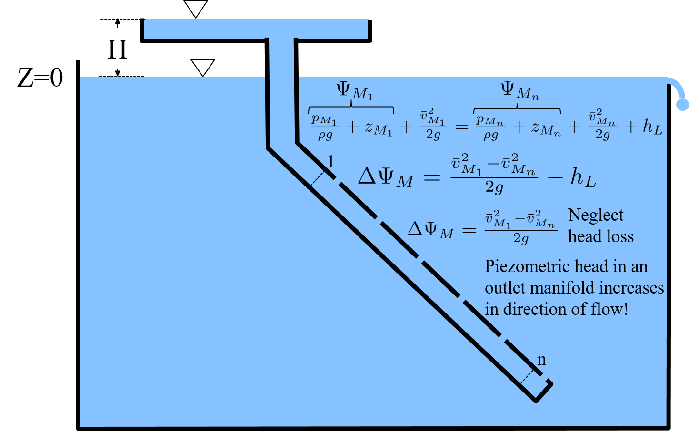
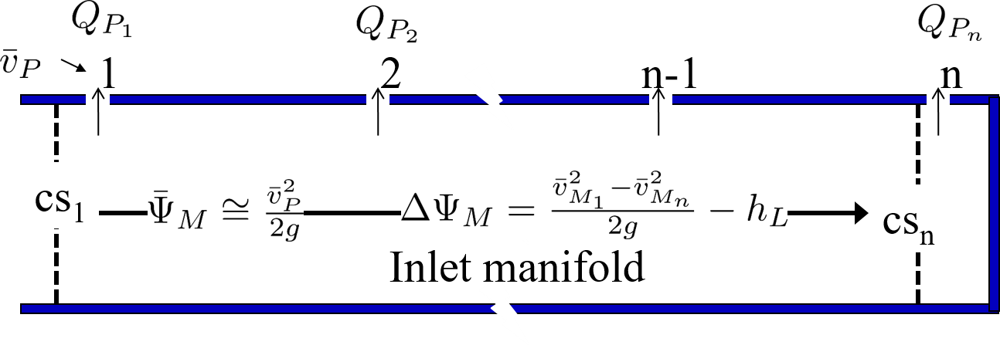
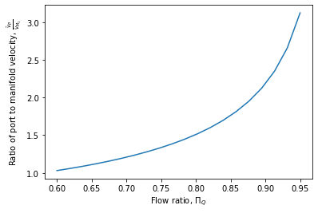

.. raw:: html

    <embed>
       <link rel="canonical" href="https://aguaclara.github.io/Textbook" />
       
    </embed>

.. _title_hydraulics_intro:

***********************
Manifold Hydraulics
***********************

`Be sure to run the import code before trying the code <https://colab.research.google.com/drive/1znzBGYHV1RXGqRz3Xm8Oyp7NQmAmkat6#scrollTo=QKlfOMPoROA3&line=5&uniqifier=1>`_

The hydraulic controls provide the basis for efficient and robust water treatment plant operation. Water must move through unit processes and between unit processes and the flow passages must be designed to meet various constraints. One constraint is that water that is carrying a significant amount of sediment (flocculator and clarifier inlet) must have sufficient velocity and turbulence levels to minimize sedimentation.  A more challenging constraint is that the flow must be divided equally between parallel processes. Flow distribution through parallel paths is a key hydraulic design constraint for all municipal scale water treatment plants. The parallel path constraint only goes away for laboratory scale processes where there is a single tube settler and a filter with a single layer of sand. A schematic illustrating the electrical circuit analogy is shown in :numref:`figure_circuit`.

.. _figure_circuit:

.. figure:: ../Images/circuit.png
    :width: 400px
    :align: center
    :alt: Clarification tank flow circuit

    The flow through a clarifier is analogous to an electrical circuit with wires and resistors. Identical resistors in parallel paths help improve flow distribution between the paths. Differences in piezometric head (think voltage) in the manifolds that connect to multiple parallel paths.

.. _heading_piezometric_head:

Piezometric Head
================

The sum of the pressure and elevation term in the energy equation is the piezometric head, :math:`\Psi`. Fluid will move in the direction of decreasing piezometric head. Note that fluid does NOT always move from high pressure to low pressure nor does it always move from high elevation to low elevation. You can prove this to yourself by placing a sloped pipe in a swimming pool!

.. math::
  :label: piezometric_head_defined

  \Psi = \frac{p}{\rho g} + z

.. _figure_Sloped_Manifold_no_flow:

.. figure:: ../Images/Sloped_Manifold_no_flow.png
    :width: 400px
    :align: center
    :alt: Sloped manifold with no flow

    Piezometric head is constant in a stationary body of water. The piezometric head inside the enclosed sloped pipe is greater (by height H) than the piezometric head in the tank. Thus if we add an orifice to this sloped pipe, water will flow from the sloped pipe into the tank.

Add multiple outlets to this sloped pipe to create a sloped manifold (:numref:`figure_Sloped_Manifold_with_flow`). The energy equation applied between control surface 1 and n  shows that the piezometric head in an inlet manifold increases in the direction of flow for cases where head loss is smaller than :math:`\frac{\bar v_{M_1}^2}{2 g}`.

.. _figure_Sloped_Manifold_with_flow:

    Sloped inlet manifold showing that the piezometric head increases in the direction of flow for the case where head loss due to wall shear is smaller than :math:`\frac{\bar v_{M_1}^2}{2 g}`.

.. _heading_inlet_manifold_flow_distribution:

Inlet Manifold Flow Distribution
================================

There is disagreement in the literature about the physics of manifolds. One school of thought postulates that the flow out of the ports exiting a manifold is controlled by the total energy of the flow inside the manifold. The other school of thought postulates that the flow of water out of the ports is controlled by the difference in piezometric head between the manifold and the receiving reservoir. These two approaches are mutually exclusive and make completely different predictions about how manifolds will perform, especially for the case where head loss in the manifold is small compared with the pressure recovery caused by the gradual flow expansion in the manifold.

Fortunately it is relatively easy to check the physics to see which approach is correct. A venturi (gradual flow contraction in a pipe) is used to generate a low pressure region in a pipe by converting pressure into kinetic energy. Venturis can be used to generate low pressure inside the pipe and then pull fluid **into** the pipe even though the total energy of the fluid in the pipe far exceeds the energy of the fluid that was outside of the pipe! This proves that flow out of a manifold is due to the difference in piezometric head and NOT due to the difference in total energy.

If manifolds were built using pitot type exits with the exit facing upstream and into the flow of the fluid, the exit from the manifold would be based on the total energy. The manifolds that we use in water treatment plants do not have pitot tube style ports and thus our analysis of manifolds is based on piezometric head.

Flow distribution from ports exiting a manifold is controlled by the change in piezometric head inside the manifold and the change in piezometric head as the water exits through a port. The reason that the flow from each port is not identical is because of changes in piezometric head in the manifold. These changes are caused by major losses due to shear on the manifold walls and due to pressure recovery as the velocity in the manifold decreases. The control volume is shown in :numref:`figure_inlet_manifold`

.. math::
  :label: energy_cv_manifold

   \frac{p_{M_1}}{\rho g}+z_{M_1}+\frac{\bar v_{M_1}^2}{2 g}=\frac{p_{M_n}}{\rho g}+z_{M_n}+\frac{\bar v_{M_n}^2}{2g} + h_{L}

The energy control volume Equation :eq:`energy_cv_manifold` can be simplified with the definition of piezometric head (Equation :eq:`piezometric_head_defined`).

.. math::
  :label: piezometric_cv_manifold

   \Psi_{M_1}+\frac{\bar v_{M_1}^2}{2 g}=\Psi_{M_n}+\frac{\bar v_{M_n}^2}{2 g}+h_{L}

The change in piezometric head is the important parameter and is given by

.. math::
  :label: delta_piezometric_cv_manifold

   \Delta\Psi_M = \frac{\bar v_{M_1}^{2}-\bar v_{M_n}^{2}}{2 g} - h_{L}

.. _figure_inlet_manifold:

    The piezometric head can either increase due to conversion of kinetic energy to pressure or the piezometric head can decrease due to major losses.

For short :math:`f\frac{L}{D}<<1`, straight (minor loss coefficient = 0), inlet manifolds the change in piezometric head, :math:`\Delta\Psi_M` is equal the initial velocity head.

.. math::
  :label: delta_piezometric_is_velocity_head

   \Delta\Psi_M = \frac{\bar v_{M_1}^{2}}{2 g}

To simplify analysis we assume the middle port gets the average flow (this isn’t quite right because the velocity is squared) and the average piezometric head, :math:`\bar \Psi_M`. The first port has mean piezometric head – ½ delta piezometric head and the last port has an increase in the piezometric head.

.. math::
  :label: Piezo_ports

   \Psi_{M_1} = \bar \Psi_{M} - \frac{1}{2}\Delta \Psi_M

   \Psi_{M_n} = \bar \Psi_{M} + \frac{1}{2}\Delta \Psi_M

where the piezometric head at each port is also proportional to the port velocity squared. A design constraint for a manifold is the target ratio of flow from port one, :math:`Q_{P_1}`, divided by the flow from the last port, :math:`Q_{P_n}`.

.. math::
  :label: Pi_Q_ports

   \Pi_{Q} = \frac{Q_{P_1}}{Q_{P_n}}=\sqrt{\frac{\Psi_{M_1}}{\Psi_{M_n}}}

Substitute equations :eq:`Piezo_ports` into Equation :eq:`Pi_Q_ports` to obtain the relationship between piezometric head and the flow distribution ratio.

.. math::
  :label: Pi_Q_ports2

   \Pi_{Q}^2 = \frac{\bar \Psi_{M} - \frac{1}{2}\Delta \Psi_M}{\bar \Psi_{M} + \frac{1}{2}\Delta \Psi_M}

This equation shows that the flow distribution will approach 1 when :math:`\bar \Psi_{M}` is much larger than :math:`\Delta \Psi_M`. This can be achieved by having the manifold velocities be small compared with the port velocities. Solving for the change in piezometric head in the manifold we obtain the relationship between change in piezometric head and uniformity of port flow.

.. math::
  :label: Pi_Psi

   \Pi_{\Psi} = \frac{\Delta \Psi_M}{\bar \Psi_{M}} = \frac{2\left(1 - \Pi_{Q}^2 \right)}{\Pi_{Q}^2 + 1}

The energy equation also yields an equation for the change in piezometric head (see Equation :eq:`delta_piezometric_cv_manifold`) and we can equate those two to obtain

.. math::
  :label: Energy_and_Pi_Q

   \frac{\bar v_{M_1}^{2}-\bar v_{M_n}^{2}}{2 g} - h_{L} = \bar \Psi_{M} \Pi_{\Psi}

If head loss in the manifold is small, then we have

.. math::
  :label: Energy_and_Pi_Q_no_manifold_hl

   \frac{\bar v_{M_1}^{2}}{2 g} = \bar \Psi_M \Pi_{\Psi}

The average piezometric head in the manifold is also influenced by any head loss that is in series with the port head loss. Here we assume that the piezometric head datum is in the receiving tank. If the receiving tank is a filter, then there could be head loss through the sand on the way to the outlet of the filter. This head loss in series will help provide more uniform flow out of the manifold if there aren't any paths for flow to blend between the first and last ports. This is the case for division of flow between sand layers in a stacked rapid sand filter where the head loss through the sand plays a key role in helping to divide the flow evenly between the 6 layers of sand. The average piezometric head in the manifold, :math:`\bar \Psi_{M}` is equal to the head from the port kinetic energy plus any downstream head loss.

.. math::
  :label: Manifold_piezometric_head_port_KE_and_HL

   \bar \Psi_M \cong \frac{\bar v_{P}^{2}}{2 g} + h_{l_{series}} \cong h_{e_{port}} + h_{l_{series}}

The port head loss is given by :math:`\bar v_{P} = \sqrt{2gh_e}` where the port velocity is the true contracted velocity if there is a *vena contracta*. If the head loss in series, :math:`h_{l_{series}}`, is significant, then equations :eq:`Energy_and_Pi_Q_no_manifold_hl` and :eq:`Manifold_piezometric_head_port_KE_and_HL` combine to produce

.. math::
  :label: Manifold_max_v_with_hl_series

   \bar v_{M_1}= \sqrt{2 g (h_{e_{port}} + h_{l_{series}})\Pi_{\Psi}}

If there is no additional head loss in series to improve flow distribution, then Equation :eq:`Manifold_max_v_with_hl_series` simplifies to

.. math::
  :label: Manifold_max_v_no_hl_series

   \frac{A_{M_1}}{A_{P}} =\frac{\bar v_{P}}{\bar v_{M_1}} = \sqrt{\frac{1}{\Pi_{\Psi}}}

Equation :eq:`Manifold_max_v_no_hl_series` (see :numref:`figure_Ratio_port_to_manifold_velocity`) can be used to determine the required diameter of inlet manifolds in clarifiers or to determine the required port velocity for the backwash manifold in the StaRS filters. It can also be used to solve for the maximum manifold velocity given the port velocity in the clarifier diffusers.

`Define a function for the flow ratio <https://colab.research.google.com/drive/1znzBGYHV1RXGqRz3Xm8Oyp7NQmAmkat6#scrollTo=JTY6Xw3SSuQ0&line=1&uniqifier=1>`_

.. _figure_Ratio_port_to_manifold_velocity:

    The ratio of port velocity to manifold velocity must increase to obtain more uniform flow from the ports.
