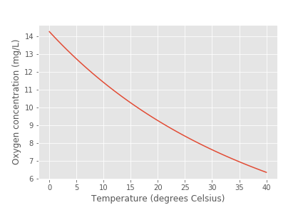
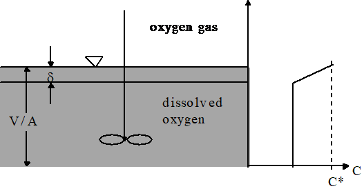
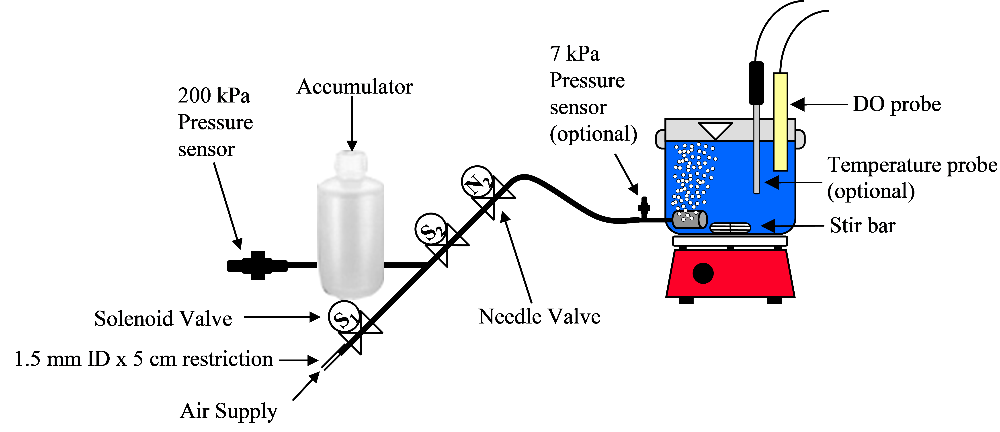
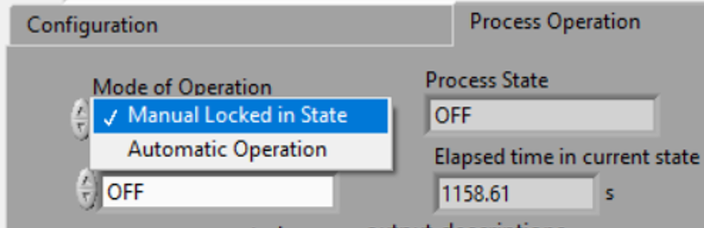
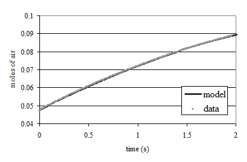

.. _title_Gas_Transfer:

************
Gas Transfer
************

.. _heading_Gas_Transfer_Introduction:

Introduction
============

Exchange of gases between aqueous and gaseous phases is an essential element of many environmental processes. Wastewater treatment plants require enhanced transfer of oxygen into activated sludge tanks to maintain aerobic degradation. Water treatment plants require gas transfer to dissolve chlorine gas or ozone. Gas transfer can also be used to remove unwanted volatile chemicals such as carbon tetrachloride, tetrachloroethylene, trichloroethylene, chloroform, bromodichloromethane, and bromoform from water (Zander et al., 1989). Exchange of a dissolved compound with the atmosphere is controlled by the extent of mixing in the aqueous and gaseous phase, the surface area of the interface, the concentration of the compound in the two phases, and the equilibrium distribution of the compound. Technologies that have been developed to enhance gas transfer include: aeration diffusers, packed-tower air stripping, and membrane stripping. Each of these technologies creates a high interface surface area to enhance gas transfer.

.. _heading_Gas_Transfer_Theory:

Theory
======

Oxygen transfer is important in many environmental systems. Oxygen transfer is controlled by the partial pressure of oxygen in the atmosphere (0.21 atm) and the corresponding equilibrium concentration in water (approximately 10 mg/L). According to Henry's Law, the equilibrium concentration of oxygen in water is proportional to the partial pressure of oxygen in the atmosphere.

.. code:: python

    """ importing """
    from aide_design.play import*
    # the code below will eventually be in the AguaClara core and should be called directly
    def O2_sat(P_air, temp):
      """This equation returns saturaed oxygen concentration in mg/L. It is valid
      for 278 K < T < 318 K
      Parameters
      ----------
      Pressure_air : float
          air pressure with appropriate units.
      Temperature :
          water temperature with appropriate units
      Returns
      -------
      Saturated oxygen concentration in mg/L
      Examples
      --------
      >>> O2_sat(1*u.atm , 300*u.kelvin)
      8.093157231428425 milligram/liter
      """
      fraction_O2 = 0.21
      P_O2 = P_air * fraction_O2
      return ((P_O2.to(u.atm).magnitude) *
              u.mg/u.L*np.exp(1727 / temp.to(u.K).magnitude - 2.105))

    P_air = 101.3*u.kPa
    temp = np.linspace(0,40)*u.degC
    C_Oxygen = O2_sat(P_air,temp)

    fig, ax = plt.subplots()
    ax.plot(temp,C_Oxygen)
    ax.set(xlabel='Temperature (degrees Celsius)', ylabel='Oxygen concentration (mg/L)')
    fig.savefig('Gas_Transfer/Images/Oxygen_vs_T')
    plt.show()

.. _figure_Oxygen_vs_T:

    Dissolved oxygen concentrations in equilibrium with the atmosphere.

Natural bodies of water may be either supersaturated or undersaturated with oxygen depending on the relative magnitude of the sources and sinks of oxygen. Algae can be a significant source of oxygen during active photosynthesis and can produce supersaturation. Algae also deplete oxygen levels during the night.

At high levels of supersaturation dissolved gas will form microbubbles that eventually coalesce, rise, and burst at the water surface. The bubbles provide a very efficient transfer of supersaturated dissolved gas to the gaseous phase, a process that can be observed when the partial pressure of carbon dioxide is decreased by opening a carbonated beverage. Bubble formation by supersaturated gasses also occurs in the environment when cold water in equilibrium with the atmosphere is warmed rapidly. The equilibrium dissolved oxygen concentration decreases as the water is warmed (Figure 1-1).

Supersaturation of dissolved gases can also occur when water carrying gas bubbles from a waterfall or spillway plunges into a deep pool. The pressure increases with depth in the pool and gasses carried deep into the pool dissolve in the water. When the water eventually approaches the surface the pressure decreases and the dissolved gases come out of solution and form bubbles. Bubble formation by supersaturated gases can kill fish (similar to the bends in humans) as the bubbles form in the bloodstream.

.. _heading_Gas_Transfer_Coefficient:

Gas Transfer Coefficient
------------------------

The gas transfer rate can be modeled as the product of a driving force (the difference between the equilibrium concentration and the actual concentration) and an overall volumetric gas transfer coefficient (a function of the geometry, mixing levels of the system and the solubility of the compound). In equation form

.. math::

    \frac{dC}{dt} =\hat{k}_{v,l} \left(C^{*} -C\right) 1.1

where C is the dissolved gas concentration, C* is the equilibrium dissolved gas concentration, and :math:`\hat{k}_{v,l}` is the overall volumetric gas transfer coefficient . Although :math:`\hat{k}_{v,l}` has dimensions of 1/T, it is a function of the interface surface area (A), the liquid volume (V), the oxygen diffusion coefficient in water (D), and the thickness of the laminar boundary layer (?) through which the gas must diffuse before the much faster turbulent mixing process can disperse the dissolved gas throughout the reactor.

.. math::

    \hat{k}_{v,l} =f(D,\delta ,A,V) 1.2

.. _figure_Single_film_model:

    Single film model of interphase mass transfer of oxygen.

The overall volumetric gas transfer coefficient is system specific and thus must be evaluated separately for each system of interest (Weber and Digiano, 1996).

A schematic of the gas transfer process is shown in Figure 1-2. Fickian diffusion controls the gas transfer in the laminar boundary layer. The oxygen concentration in the bulk of the fluid is assumed to be homogeneous due to mixing and the oxygen concentration above the liquid is assumed to be that of the atmosphere.

The gas transfer coefficient will increase with the interface area and the diffusion coefficient and will decrease with the reactor volume and the thickness of the boundary layer. The functional form of the relationship is given by

.. math::

    \hat{k}_{v,l} =\frac{AD}{V\delta }  1.3

Equation 1.1 can be integrated with appropriate initial conditions to obtain the concentration of oxygen as a function of time. However, care must be taken to ensure that the overall volumetric gas transfer coefficient is not a function of the dissolved oxygen concentration. This dependency can occur where air is pumped through diffusers on the bottom of activated sludge tanks. Rising air bubbles are significantly depleted of oxygen as they rise through the activated sludge tank and the extent of oxygen depletion is a function of the concentration of oxygen in the activated sludge. Integrating equation 1.1 with initial conditions of C = C0 at t = t0

.. math::

    \int _{C_{0} }^{C}\frac{dC}{C^{*} -C}  =\int _{t_{0} }^{t}\hat{k}_{v,l} dt  1.4

.. math::

    \ln \frac{C^{*} -C}{C^{*} -C_{0} } =-\hat{k}_{v,l} (t-t_{0} ) 1.5

Equation 1.5 can be evaluated using linear regression so that $\hat{k}_{v,l} $ is the slope of the line.

The simple gas transfer model given in equation 1.5 is appropriate when the gas transfer coefficient is independent of the dissolved gas concentration. This requirement can be met in systems where the gas bubbles do not change concentration significantly as they rise through the water column. This condition is met when the water column is shallow, the bubbles have large diameters, or the difference between the concentration of dissolved gas and the equilibrium concentration is small.

.. _heading_Gas_Transfer_Oxygen_Transfer_Efficiency:

Oxygen Transfer Efficiency
--------------------------

An important parameter in the design of aeration systems for the activated sludge process is the energy cost of compressing air to be pumped though diffusers. The pumping costs are a function of the pressure and the airflow rate. The pressure is a function of the hydrostatic pressure (based on the depth of submergence of the diffusers) and the head loss in the pipes and through the diffuser. The required airflow rate is a function of the BOD of the wastewater and the efficiency with which oxygen is transferred from the gas phase to the liquid phase. This oxygen transfer efficiency (OTE) is a function of the type of diffuser, the diffuser depth of submergence, as well as temperature and ionic strength of the activated sludge. Oxygen transfer is a remarkably inefficient process; only a small fraction of the oxygen carried by the rising bubbles diffuses into the activated sludge. The most efficient systems use membrane diffusers and achieve an OTE of approximately 10\%.

The manufacturer typically provides oxygen transfer efficiency for a specific diffuser. In this laboratory we will measure oxygen transfer efficiency for the aeration stone that we will be using in an activated sludge tank. The molar transfer rate of oxygen through the diffuser is

.. math::

    \dot{n}_{gas\; o_{2} } =\frac{Q_{air} P_{air} f_{O_{2} } }{RT}  1.6

where
 | :math:`f_{O_2}` is the molar fraction of air that is oxygen (0.21),
 | :math:`Q_{air}` is the volumetric flow rate of air into the diffuser,
 | :math:`P_{air}` is the air pressure immediately upstream from the diffuser,
 | :math:`R` is the universal gas constant and
 | :math:`T` is absolute temperature.

If the airflow rate is already given with units of moles/s then the molar transfer rate of oxygen can be obtained by multiplying by the molar fraction of air that is oxygen.

The molar rate of dissolution into the aqueous phase is

.. math::

    \dot{n}_{aq\; o_{2} } =\frac{\rlap{-} V}{MW_{O_{2} } } \frac{dC}{dt}  1.7

where
 | :math:`MW_{O_2}` is the molecular weight of oxygen,
 | :math:`\rlap{-} V` is the reactor volume, and
 | :math:`\frac{dC}{dt}` is the change in aqueous oxygen concentration with time.

The rate of change of oxygen concentration is a function of the dissolved oxygen concentration and is a maximum when the dissolved oxygen concentration is zero. Oxygen transfer efficiency could be measured for any dissolved oxygen concentration. A better method of analysis is to substitute the right side of equation 1.1 for :math:`\frac{dC}{dt}` .

.. math::

    \dot{n}_{aq\; o_{2} } =\frac{V\hat{k}_{v,l} \left(C^{*} -C\right)}{MW_{O_{2} } }  1.8

The oxygen transfer efficiency is the ratio of equation 1.8 to equation 1.6.

.. math::

    OTE=\frac{\hat{k}_{v,l} \left(C^{*} -C\right)VRT}{MW_{O_{2} } Q_{air} P_{air} f_{O_{2} } }  1.9

Measurement of OTE using equation 1.9 requires that the gas transfer coefficient, air flow rate, air pressure, and the air temperature be measured. (:math:`P_{air}` and :math:`Q_{air}` have to correlate and in this experiment the best combination is atmospheric pressure and the flow rate given by the pump.)

If the molar airflow rate is controlled then OTE is based on the ratio of equation 1.8 to the molar transfer rate of supplied oxygen.

.. math::
    OTE=\frac{\dot{n}_{aq\; o_{2} } }{f_{O_{2} } \dot{n}_{air} } =\frac{V\hat{k}_{v,l} \left(C^{*} -C\right)}{f_{O_{2} } \dot{n}_{air} MW_{O_{2} } }  1.10

.. _heading_Gas_Transfer_Deoxygenation:

Deoxygenation
-------------

To measure the reaeration rate it is necessary to first remove the oxygen from the reactor. This can be accomplished by bubbling the solution with a gas that contains no oxygen. Nitrogen gas is typically used to remove oxygen from laboratory reactors. Alternately, a reductant can be used. Sulfite is a strong reductant that will reduce dissolved oxygen in the presence of a catalyst.

.. math::

    {O}_{{2}} +{2SO}_{{3}}^{-{2}} \stackrel{{cobalt}}{\longrightarrow}{2SO}_{{4}}^{-{2}}  1.11

The mass of sodium sulfite required to deoxygenate 1 mg of oxygen is calculated from the stoichiometry of equation 1.11.

.. math::

    \frac{{mole\; O}_{{2}} }{{32000\; mg\; O}_{{2}} } \cdot \frac{{2\; mole\; Na}_{{2}} {SO}_{{3}} }{{mole\; O}_{{2}} } \cdot \frac{{126,000\; mg\; Na}_{{2}} {SO}_{{3}} }{{mole\; Na}_{{2}} {SO}_{{3}} } =\frac{{\; 7.875\; mg\; Na}_{{2}} {SO}_{{3}} }{{mg\; O}_{{2}} }  1.12

 If complete deoxygenation is desired a 10\% excess of sulfite can be added. The sulfite will continue to react with oxygen as oxygen is transferred into the solution. The oxygen concentration can be measured with a dissolved oxygen probe or can be estimated if the temperature is known and equilibrium with the atmosphere assumed (Figure 1-1).

.. _heading_Gas_Transfer_Experimental_Objectives:

Experimental Objectives
=======================

The objectives of this lab are to:

 #. Illustrate the dependence of gas transfer on gas flow rate.
 #. Develop a functional relationship between gas flow rate and gas transfer.
 #. Measure the oxygen transfer efficiency of a course bubble diffuser.
 #. Explain the theory and use of dissolved oxygen probes.

A small reactor that meets the conditions of a constant gas transfer coefficient will be used to characterize the dependence of the gas transfer coefficient on the gas flow rate through a simple diffuser. The gas transfer coefficient is a function of the gas flow rate because the interface surface area i.e., the surface area of the air bubbles) increases as the gas flow rate increases.

.. _heading_Gas_Transfer_Dissolved_Oxygen_Probes:

Dissolved Oxygen Probes
=======================

Theory
------

The dissolved oxygen probes make use of the fact that an applied potential of 0.8 V can reduce :math:`O_2` to :math:`H_2O`:

.. math::

   4 e${}^{-}$ + 4 H${}^{+}$ + O${}_{2}$ $\mathrm{\to}$ 2 H${}_{2}$O

The cell is separated from solution by a gas permeable membrane that allows :math:`O_2` to pass through. The concentration of :math:`O_2` in the cell is kept very low by reduction to :math:`H_2O`. The rate at which oxygen diffuses through the gas permeable membrane is proportional to the difference in oxygen concentration across the membrane. The concentration of oxygen in the cell is :math:`\mathrm{\approx}0` and thus the rate at which oxygen diffuses through the membrane is proportional to the oxygen concentration in the solution.

Oxygen is reduced to water at a silver (Ag) cathode of the probe. Oxygen reduction produces a current that is measured by the meter.

Calibration
-----------

:ref: `Calibrate the dissolved oxygen probe <heading_ProCoDA_Dissolved_Oxygen>` after you have assembled the apparatus.

.. _heading_Gas_Transfer_Experimental_Methods:

Experimental Methods
====================

.. _figure_Schematic:

    Apparatus used to measure reaeration rate.

The reactors are 4 L containers (Figure 1-3). The DO probe should be placed in a location so as to minimize the risk of air bubbles lodging on the membrane on the bottom of the probe. The aeration stone is connected to a source of regulated air flow. A 7-kPa pressure sensor (optional) can be used to measure the air pressure immediately upstream from the diffuser stone. A 200-kPa pressure sensor is used to measure the air pressure in the accumulator.

Initial Setup
-------------

.. |Open_method| image:: ../ProCoDA/Images/Open_method.png
.. |Logging_data_short_exp| image:: ../ProCoDA/Images/Logging_data_short_exp.png

Follow these steps to set up the experiment.

 #. Assemble the apparatus (don't forget the 1.5 mm x 5 cm restriction).
 #. Install the head loss orifice as close to the valve as possible (plug it directly into the valve!).
 #. The ProCoDA II software will be used to control the air flow rate for the aeration experiment. The software will use external code to calculate the calibration constant for the flow restriction, to control valve 1 (the air supply valve), and to regulate the flow of air into the accumulator. The calibration uses the ideal gas law to determine the flow rate as a function of the difference in pressure between the source and the accumulator. Once this calibration is obtained a separate code will set the fraction of time that valve 1 needs to be open to obtain the desired flow rate of air into the accumulator.
 #. Use the |Open_Method| on the ProCoDA configuration tab to load a method file containing the configuration necessary to control airflow. The file is at S:\Courses\4530\GasTransfer2.pcm. You will need to adjust the channels for the accumulator pressure and the DO probe to match where you plugged them in your ProCoDA box. You will also need to make sure that your valves are connected to the correct ports on the ProCoDA box.
 #. Navigate to the Process Operation tab.
 #. Set the **operator selected state** to toggle.  The solenoid valves should click rhythmically if they are working properly.
 #. Install a membrane on the oxygen probe.
 #. Add 4 L of tap water to the reactor.
 #. Set the mode of operation |Mode_of_operation| to automatic operation and the *operator selected state* to "prepare to calibrate". The software should quickly cycle through the calibration step and then begin attempting to control the air flow rate to the target value.  Note:  the purpose of the prepare to calibrate state is to vent excess pressure from the accumulator.  The state will not change to calibrate until the pressure drops below a predefined threshold.  To speed this up, you may open the top of the air accumulator to release the air *before starting the automatic calibration*.
 #. Set the stirrer speed to achieve a vortex on the surface of the water.
 #. Calibrate the DO probe if you haven't already. Use 22�C as the temperature.

Test the air flow controller
----------------------------

In the following test, the air flow controller should provide a constant flow of air into the accumulator. You can assess how well the air flow controller is working based on the slope of the pressure as a function of time.

 #. Set the **mode of operation** to Manual Locked in State.
 #. Set the **operator selected state** to off
 #. Open the accumulator cap to empty the accumulator.
 #. Close the accumulator cap.
 #. Close the needle valve.
 #. We can set the air flow rate based on our calibration be navigating to the Configuration tab and selecting edit rules. We want to control the air flow rate, so select air flow rate from the set points and variables list. Set the air flow rate to a value of 200u (200 ?M/s).
 #. Begin logging data from the 200kPa pressure sensor (accumulator pressure) at a 1 s interval using the datalog button on the configuration tab. Data is being logged when the icon is green.
 #. Navigate back to process operation tab and set the **operator selected state** to aerate.
 #. End logging data when the accumulator pressure is approximately equal to the source pressure.
 #. Analyze the data to see if the airflow rate is close to the expected value. This can be done using the data obtained and the ideal gas law.  Plot the accumulator air pressure as a function of time.  The slope of the best fit linear line is in units of Pa/s.  The volume of the accumulator is 1 liter.  Solving the ideal gas law for n gives a result in units of moles/s. You set the air flow rate for 200 :math:`\mu M/s` and that is what you are expecting from this calculation.
 #. If the error is greater than 20\% look for leaks and recalibrate the airflow controller.

Measure the Gas Transfer
------------------------

 #. Call the instructor and/or TA to check the system configuration.
 #. The instructor or TA will add 1 mg CoCl2� 6H2O (note this only needs to be added once because it is the catalyst). A stock solution of CoCl2� 6H2O (100 mg/mL -- thus add 10 ?L) has been prepared to facilitate measurement of small cobalt doses. (Use gloves when handling cobalt!)
 #. Prepare to record the dissolved oxygen concentration using ProCoDA software. Use 5-second data intervals and log the data to S:{\textbackslash}Courses{\textbackslash}4530{\textbackslash}Group \#{\textbackslash}gastran\_flowrate{\textbackslash} for later analysis. Include the actual flow rate in the file name.
 #. Set the airflow rate to the desired flow rate.  Each group will investigate six flowrates.  The instructor will assign the flowrates on the day of the lab exercise.
 #. Set the **operator selected state** to aerate.
 #. Set the needle valve so the pressure in the accumulator is approximately 75\% of the source pressure.
 #. Wait until the accumulator pressure reaches steady state.
 #. Turn the air off by changing the operator selected state to OFF.
 #. Add enough sodium sulfite to deoxygenate the solution. A stock solution of sodium sulfite (100 mg/mL) has been prepared to facilitate measurement of small sulfite doses. Calculate this dose based on the measured dissolved oxygen concentration. (4 L of water at :math:`C_{oxygen}\; mg \; O_2/L = 4\; C_{oxygen}\; mg\; O_2`, therefore add :math:`4 (7.875) C_{oxygen}` mg sodium sulfite or :math:`4(7.875)(C_{oxygen})/100 mL` of stock solution.)
 #. Turn the air on by changing the \textbf{\textit{operator selected state}} to Aerate.
 #. Monitor the dissolved oxygen concentration until it reaches 50\% of saturation value or 10 minutes (whichever is shorter).
 #. Repeat steps 3-11 to collect data from at least two additional flow rates.
 #. Consolidate the files into one spreadsheet file with a separate sheet for each flow rate.
 #. Collect data from the whole class to analyze the full spectrum of flow rates investigated.

.. _heading_Gas_Transfer_Pre-Laboratory_Questions:

Pre-Laboratory Questions
========================

 #. Calculate the mass of sodium sulfite needed to reduce all the dissolved oxygen in 4 L of pure water in equilibrium with the atmosphere and at :math:`30^\circ C`.
 #. Describe your expectations for dissolved oxygen concentration as a function of time during a reaeration experiment.  Assume you have added enough sodium sulfite to consume all of the oxygen at the start of the experiment. What would the shape of the curve look like?
 #. Why is :math:`\hat{k}_{v,l}` not zero when the gas flow rate is zero? How can oxygen transfer into the reactor even when no air is pumped into the diffuser?
 #. )Describe your expectations for :math:`\hat{k}_{v,l}` as a function of gas flow rate. Do you expect a straight line? Why?
 #. A dissolved oxygen probe was placed in a small vial in such a way that the vial was sealed. The water in the vial was sterile. Over a period of several hours the dissolved oxygen concentration gradually decreased to zero. Why? (You need to know how dissolved oxygen

.. _heading_Gas_Transfer_Data_Analysis:

Data Analysis
=============

This lab requires a significant amount of repetitive data analysis. Plan how you will organize the analysis to be as easy as possible.

 #. Calculate the air flow rate from testing the air flow controller and compare with the target value.
 #. Eliminate the data from each data set when the dissolved oxygen concentration was less than 0.5 mg/L. This will ensure that all of the sulfite has reacted.
 #. Plot a representative data set showing dissolved oxygen vs. time.
 #. Calculate :math:`C^{\star}` based on the average water temperature, barometric pressure, and the following equation.

   .. math::

       C^{\star} =P_{O_{2} } {\mathop{e}\nolimits^{\left(\frac{1727}{T} -2.105\right)}}

   where
    | T is in Kelvin,
    | :math:`P_{O_{2} }` is the partial pressure of oxygen in atmospheres, and
    | :math:`C^{\star} ` is in mg/L. This equation is valid for 278 K < T < 318 K.

 #.  Estimate $\hat{k}_{v,l} $ using linear regression and equation 1.5 for each data set.
 #. Create a graph with a representative plot showing the linearized data, :math:`\left(\ln \frac{C^{\star} -C}{C^{\star} -C_{0} } \right)` vs. time, and the best-fit line.
 #. Plot the reaeration model on the same graph as the dissolved oxygen vs. time data.  This is done by solving equation for C.
 #. Plot :math:`\hat{k}_{v,l}` as a function of airflow rate (:math:`\mu mole/s`).
 #. Look at each dataset and if necessary (to make more linear plots) eliminate more data from the beginning (or end) of the dataset. You will be able to see when the oxygen level is affected by residual sulfite at the beginning of the experiments.
 #. Plot OTE as a function of airflow rate (?mole/s) with the oxygen deficit (:math:`C^{\star} -C`) set at 6 mg/L.
 #. Plot the molar rate of oxygen dissolution into the aqueous phase (:math:`\mu mole/s`) as a function of airflow rate (:math:`\mu mole/s`).
 #. Comment on results and compare with your expectations and with theory.
 #. Verify that your report and graphs meet the requirements.

.. _heading_Gas_Transfer_References:

==================
References}

 Weber, W. J. J. and F. A. Digiano. 1996. Process Dynamics in Environmental Systems. New York, John Wiley \& Sons, Inc.Zander, A. K.; M. J. Semmens and R. M. Narbaitz. 1989. **Removing VOCs by membrane stripping** American Water Works Association Journal 81: 76-81.

.. _heading_Gas_Transfer_Lab_Prep_Notes:

Lab Prep Notes
==============

\begin{tabular}{|p{0.7in}|p{0.7in}|p{0.7in}|} \hline
\multicolumn{3}{|p{1in}|}{Table 1- #. Reagent list\textbf{}} \\ \hline
\textbf{Description} & \textbf{Supplier} & \textbf{Catalog number} \\ \hline
Na2SO3 & Fisher Scientific & S430-500 \\ \hline
CoCl2� 6H2O & Fisher Scientific & C371-100 \\ \hline
\end{tabular}

Setup
-----

 #. Prepare the sodium sulfite immediately before class and distribute to groups in 15 mL PP bottles to minimize oxygen dissolution and reaction with the sulfite.
 #. The cobalt solution can be prepared anytime and stored long term.
 #. Install the membranes on the DO probes and confirm that all probes are operational.
 #. Provide clamps to mount DO probes on magnetic stirrers.
 #. Determine maximum airflow rate that is reasonable given small reactor volume.

 \begin{tabular}{|p{0.4in}|p{0.3in}|p{0.3in}|p{0.3in}|p{0.3in}|p{0.4in}|} \hline
 \multicolumn{6}{|p{1in}|}{Table 1-2. Stock solutions list} \\ \hline
 \textbf{reagent} & M.W. & g/100 mL & mg/ mL & mL/\newline group & solubility g/L \\ \hline
 Na2SO3 & 126.04 & 10 g & 100 & 10 & 125 \\ \hline
 CoCl2� 6H2O & 237.92 & 10 g & 100 & 1 & 770 \\ \hline
 \end{tabular}

 \begin{tabular}{|p{0.7in}|p{0.7in}|p{0.7in}|} \hline
 \multicolumn{3}{|p{1in}|}{Table 1-3. Equipment list\textbf{}} \\ \hline
 \textbf{Description} & \textbf{Supplier} & \textbf{Catalog number} \\ \hline
 magnetic stirrer & Fisher Scientific & 11-500-7S \\ \hline
 100-1095 �L pipette & Fisher Scientific & 13-707-5 \\ \hline
 10-109.5 �L pipette & Fisher Scientific & 13-707-3 \\ \hline
 15 mL PP bottles & Fisher Scientific & 02-923-8G \\ \hline
 Solenoid valves &  &  \\ \hline
 Stamp control boxes &  &  \\ \hline
 Pressure sensors &  &  \\ \hline
 1 L airflow accumulators &  &  \\ \hline
 \end{tabular}

Major elements of apparatus
---------------------------

 #. air flow hardware (built by students)
 #. reactor hardware (built by students)
 #. sensors (plugged in to ports by TA)
 #. solenoid valves (already plugged in to ports by TA)
 #. software

\begin{tabular}{|p{0.3in}|p{0.9in}|} \hline
Group & Flows (?M/s) \\ \hline
1 & 200, 250, 300 \\ \hline
2 & 350, 400, 450 \\ \hline
3 & 500, 600, 700 \\ \hline
4 & 800, 900, 1000 \\ \hline
5 & 1200, 1500, 2000 \\ \hline
6 & 3000, 4000, 5000 \\ \hline
\end{tabular}

Class Plan
----------

 #. Show how to calibrate DO probe using Calibrator.
 #. Assign groups different gas flow rates

.. _heading_Gas_Transfer_Airflow_Control:

Airflow Control
===============

The ProCoDA software can be configured to control the flow of air into the reactor. The hardware required is shown in Figure 1. The control algorithm is based on the theoretical relationship between head loss and flow rate for the air flowing into the accumulator. We can empirically measure the head loss coefficient and then use the theoretical relationship to determine what fraction of time the influent valve should be open to obtain the desired flow rate. We can use the change in pressure in the accumulator when the influent valve is open to determine how fast air was flowing into the accumulator. In order to develop an appropriate head loss model we need to know if the flow into the accumulator is laminar or turbulent.

.. math::

    {Re}=\frac{\rho VD}{\mu }

.. math::

    {Re}=\frac{4\rho Q}{\pi d\mu }

If we hold pressure and temperature constant and then take the derivative of the ideal gas law we obtain.

.. math::

    P\rlap{--}\dot{V}=\dot{n}RT

and since change in volume with respect to time is a flow rate we have

.. math::

    Q=\frac{\dot{n}RT}{P}

Density of an ideal gas is given by

.. math::

    \rho =\frac{PM_{gas} }{RT}

Substituting these relationships into the equation for Reynolds number we obtain

.. math::

    {Re}=\frac{4\dot{n}M_{gas} }{\pi d\mu }

For the air flow controller used in the lab the following values are obtained

 :math:`\dot{n}` max flow is about 10,000 :math:`\mu M/s` :math:`M_{gas}` is 0.029 kg/M, and :math:`\mu` is :math:`1.8 x 10^{-5} Ns/m${}^{2}`.

.. math::

    {Re}=\frac{4\left(10000\times 10^{-6} \frac{M}{s} \right)\left(0.029\frac{kg}{M} \right)}{\pi \left(1\times 10^{-3} m\right)\left(1.8\times 10^{-5} \frac{N\cdot s}{m^{2} } \right)} =20,500

The flow into the air accumulator will almost certainly be turbulent and thus we can use the turbulent flow equations for minor losses to describe head loss. The equation for minor losses is:

.. math::

    h_{minor} =K\frac{8Q^{2} }{g\pi ^{2} D^{4} }

To use equation \eqref{ZEqnNum823776} for air we substitute pressure change for :math:`h_{minor}`, equation \eqref{ZEqnNum261903} for flow rate, and equation \eqref{ZEqnNum758497} for density.

.. math::

    \Delta p=K\frac{8M_{gas} RT\dot{n}^{2} }{\pi ^{2} D^{4} P}

This change of pressure is occurring between the air supply and the accumulator. The pressure, P, in equation \eqref{ZEqnNum122024} helps determine the velocity of the air and thus head loss is a function of the pressure. The pressure varies between the pressure of the lab air supply, :math:`P_s`, and the pressure in the air accumulator, :math:`P_a`. As a reasonable first approximation we use the average pressure of the supply and the accumulator for P, the difference in pressure for :math:`\Delta p`, and solve equation \eqref{ZEqnNum122024} for the molar flow rate.

.. math::

    \dot{n}=\frac{\pi D^{2} }{4\sqrt{KM_{gas} RT} } \sqrt{\left(P_{s} -P_{a} \right)\left(P_{s} +P_{a} \right)}

where :math:`\dot{n}` is the molar flow rate.

Multiplying terms and noting that the supply pressure is relatively constant, but that the accumulator pressure varies as it charges according to the ideal gas law we obtain.

.. math::

    \frac{dn}{dt} =\frac{\pi D^{2} }{4\sqrt{KM_{gas} RT} } \sqrt{P_{s}^{2} -\frac{n^{2} R^{2} T^{2} }{V^{2} } }

Separating terms and integrating from an initial condition with :math:`n_1` moles to a final condition with :math:`n_2` moles in the accumulator.

.. math::

    \frac{\rlap{--}V}{RT} \int _{n_{1} }^{n_{2} }\frac{dn}{\sqrt{\frac{P_{s}^{2} V^{2} }{R^{2} T^{2} } -n^{2} } }  =\int _{0}^{t}\frac{\pi D^{2} }{4\sqrt{KM_{gas} RT} } dt

After integrating we obtain the following equation.

.. math::

    \frac{\rlap{--}V}{RT} \left(\sin ^{-1} \frac{n_{2} RT}{P_{s} V} -\sin ^{-1} \frac{n_{1} RT}{P_{s} V} \right)=\frac{\pi D^{2} t}{4\sqrt{KM_{gas} RT} }

.. math::

    t=\frac{4\sqrt{KM_{gas} RT} }{\pi D^{2} } \left(\sin ^{-1} \frac{n_{2} RT}{P_{s} V} -\sin ^{-1} \frac{n_{1} RT}{P_{s} V} \right)\frac{\rlap{--}V}{RT}

Since we will be measuring the pressure in the accumulator we can now substitute that pressure for the terms containing moles of air to obtain an equation that is in a linear form such that a single term containing K and D can be obtained by linear regression.

.. math::

    t=\frac{4\sqrt{KM_{gas} RT} }{\pi D^{2} } \left(\sin ^{-1} \frac{P_{a_{2} } }{P_{s} } -\sin ^{-1} \frac{P_{a_{1} } }{P_{s} } \right)\frac{\rlap{--}V}{RT}

Airflow_controller_calibration

.. _figure_Airflow_controller_calibration:

    Taking a data set obtained by filling the accumulator, finding the unknown term :math:`\frac{4\sqrt{KM_{gas} RT} }{\pi D^{2} }` by linear regression and then plotting the resulting model next to the data we obtain this graph.

The final step is to calculate the fraction of time that the valve must be open in order to obtain a desired flow rate into the accumulator. Take the target air flow rate $\dot{n}_{t\arg et} $ and divide by the molar flow rate given by equation \eqref{ZEqnNum773701} to get the fraction of time the valve must be open to get the desired average flow rate.

.. math::

    f_{valve} =\frac{\dot{n}_{t\arg et} }{\dot{n}} =\frac{\dot{n}_{t\arg et} }{\frac{\pi D^{2} }{4\sqrt{KM_{gas} RT} } \sqrt{P_{s}^{2} -P_{a}^{2} } }

Equation \eqref{ZEqnNum820776} assumes that inertial effects during flow startup are not significant. Application of equation \eqref{ZEqnNum820776} results in slightly more air being delivered than requested. The reason for this error is that when the valve is closed the volume between the location of the head loss and the valve fills to the pressure of the source. This volume of air quickly discharges through the valve as soon as the valve is opened. This error can be minimized by using small valves and by keeping the head loss orifice as close to the valve as possible.

Equation \eqref{ZEqnNum820776} is used by the air flow control.vi to calculate the fraction of time that the valve should be open. The ability of the control algorithm to create a desired flow rate can be measured by setting the flow rate and closing the effluent valves from the accumulator. The result is that the accumulator will gradually fill and as it fills $f_{valve} $ will gradually increase so the flow rate into the accumulator remains constant. The slope of the pressure vs. time line is proportional to the flow rate.

.. code:: python

  import os
  x = os.listdir('C:/Users/mw24/github/EnvEngLabTextbook/ProCoDA/Images')
  x
