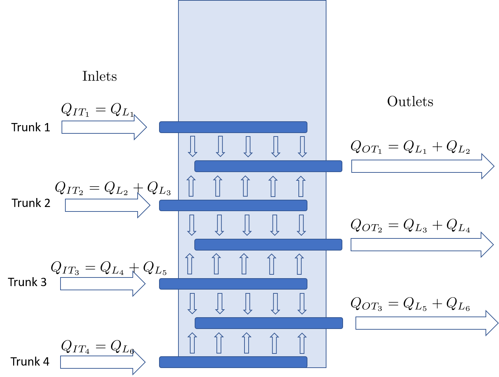

.. _title_hydraulics_intro:

********************************************
Hydraulics Introduction
********************************************

The hydraulic controls provide the basis for efficient and robust water treatment plant operation. Water must move through unit processes and between unit processes and the flow passages must be designed to meet various constraints. One constraint is that water that is carrying a significant amount of sediment (flocculator and sedimentation tank inlet) must have sufficient velocity and turbulence levels to minimize sedimentation.  A more challenging constraint is that the flow must be divided equally between parallel processes. Flow distribution through parallel paths is a key hydraulic design constraint for all municipal scale water treatment plants. The parallel path constraint only goes away for laboratory scale processes where there is a single tube settler and a filter with a single layer of sand.

Municipal water treatment plants

.. _figure_circuit:

.. figure:: Images/circuit.png
    :width: 400px
    :align: center
    :alt: Sedimentation tank flow circuit

    The flow through a sedimentation tank is analogous to an electrical circuit with wires and resistors. Identical resistors in parallel paths help improve flow distribution between the paths. Differences in piezometric head (think voltage) in the manifolds that connect to multiple parallel paths.

.. _OStaRS_Design:

Open Stacked Rapid Sand Filter Design
=====================================

Design steps
------------

1.  Calculate array of maximum filter flows given available trunk sizes and given constraint of flow distribution between filter layers during filtration
1.  Calculate the orifice head loss required for each
1.  Calculate filter flow given minimum number of filters
1.  Find the available maximum filter flow that is equal or greater than the filter flow required given the minimum number of filters
1.  Find the corresponding Trunk size.
1.  Design the branches based on manifold flow distribution requirements
1.  Design the siphon pipe given a reasonable (help!!) constraint on drain time
1.  Design the siphon air valve given volume of air in the siphon
1.  Calculate all elevations
1.  Design backwash flow control weir

Design assumptions
------------------

* Simplest design to fabricate will have identical trunk lines for all inlets
*

Maximum Trunk Flows
-------------------

The trunks are constrained to both provide similar flow to each filter layer and to provide similar flow to each branch within the sand bed. Providing the same flow to each filter layer during filtration is the key constraint that determines the size of the trunk lines. The most challenging flow distribution is between middle inlets that carry flow for two layers and the top and bottom inlets that carry flow for one sand layer.

.. _figure_Trunk_flows:

    The flows through the inlet trunks of stacked rapid sand filters are not identical and this requires a careful hydraulic design.

The flow distribution within the filter bed to ensure complete fluidization of the sand bed during backwash can be achieved by increasing the head loss through the flow control orifices in the branches. Calculating this required head loss is the second step in designing the filter inlet piping.

The factor of two difference in design flow rates for outer and inner inlet trunks requires that the head loss through the trunks be small relative to the head loss through the orifices and sand bed.  The orifices contribute very little to the flow distribution because the orifices also have to deliver the backwash flow which is 6 times the filtration flow for the bottom inlet. That means that the orifice head loss during filtration is 1/36th of the head loss during backwash.

The solution path for design of the requires setting a constraint on how far the flows can diverge from the target, setting the head loss through the two paths from the inlet box through the sand to be equal, and ensuring that mass is conserved. With these constraints it is possible to solve for the maximum head loss in the trunks and then calculate the required trunk diameter to meet the head loss constraint.

Nomenclature
------------

.. _table_Trunk_Nomenclature:

.. csv-table:: Nomenclature for filter trunk design.
   :header: "Symbol", "Units", "Description"
   :align: left

   ":math:`\Pi_Q`", "dimensionless", "ratio of minimum layer flow to maximum layer flow"
   ":math:`Q_{IT_i}`",":math:`\frac{L}{s}`", "actual flow in **I**nlet **T**runk i"
   ":math:`Q_{L_i}`",":math:`\frac{L}{s}`", "actual flow in filter **L**ayer i"
   ":math:`\overset{u}{Q}_L`",":math:`\frac{L}{s}`", "ideal **u**niform flow in each filter layer"
   ":math:`h_{L_i}`",":math:`m`", "head loss from inlet tank all the way through the sand in layer i"

.. math::
   :label: Flow_ratio

    \Pi_Q = \frac{0.5Q_{IT_3}}{Q_{IT_4}} = \frac{Q_{L_{4,5}}}{Q_{L_6}}

Where :math:`\Pi_Q` is slightly less than 1 and represents the extent of uniform flow distribution. Flows :math:`Q_{IT_3}` and :math:`Q_{IT_4}` represent the actual flow through the two inlet trunk lines, not the ideal flows. We need to specify the flow distribution error that we are willing to accept. A value of about 0.85 would be reasonable and experiments to measure the effect of poor flow distribution on filter performance are needed. Non uniform flow distribution means that the bottom layer of the filter and the top layer of the filter will receive more flow. That will result in them filling with particles faster which will cause a slight improvement in flow distribution between the layers.

The unknown actual flow rates can be eliminated from subsequent equations for head loss by replacing them with the known target flow through a layer of sand. The next equations develop these relationships.

The relationship between :math:`Q_{IT_3}` and :math:`Q_{IT_4}` and the target value of :math:`\overset{u}{Q}_L` can be obtained because 50% of the filter flow goes through the bottom two inlets and thus we can use a mass balance around the bottom half of the filter. Thus we have:

.. math::
   :label: Flow_layer_uniform

     3 \overset{u}{Q}_L = Q_{IT_3} + Q_{IT_4}

Eliminate :math:`Q_{IT_3}` from equation :eq:`Flow_layer_uniform` by substituting equation :eq:`Flow_ratio` and solve for :math:`Q_{IT_4}`.

.. math::
   :label: Flow_Trunk_4

     \frac{Q_{IT_4}}{\overset{u}{Q}_L} = \frac{3}{2\Pi_Q +1}

.. math::
  :label: Flow_Trunk_3

    \frac{Q_{IT_3}}{\overset{u}{Q}_L} = \frac{6\Pi_Q}{2\Pi_Q +1}

The actual flows through the filter layers can also be expressed as a function of the ideal uniform flow through a filter layer and the flow ratio. The flow of water through the bottom layer (layer 6) of sand is equal to the flow of water through trunk 4.

.. math::
  :label: Flow_Layer_6

    \frac{Q_{L_6}}{\overset{u}{Q}_L} = \frac{Q_{IT_4}}{\overset{u}{Q}_L} = \frac{3}{2\Pi_Q +1}

The flow through layers 4 and 5 are identical and from equation :eq:`Flow_ratio` they are equal to :math:`\Pi_Q` times the flow in layer 6, :math:`Q_{L_6}`.

.. math::
  :label: Flow_Layer_45

    \frac{Q_{L_{4,5}}}{\overset{u}{Q}_L} = \frac{\Pi_Q Q_{IT_4}}{\overset{u}{Q}_L} = \frac{3\Pi_Q}{2\Pi_Q +1}

The next step is to write the equations for the total head loss from the inlet tank to where the water exits the sand layers and enters the outlet system.

.. math::
   :label: Head_loss_Layer_6

     h_{L_6} = h_{L_{IT_4}} + h_{L_{Orifices_4}} + h_{L_{Sand_6}}

The head loss in the trunk and through the orifices is directly proportional to the square of the flow rate. The head loss through the sand is directly proportional to the flow rate. Thus we can write the equation in terms of the head losses that would be observed under uniform flow conditions.

.. math::
   :label: Head_loss_Layer_6u

     h_{L_6} = \left(\overset{u}{h}_{L_{IT_4}} + \overset{u}{h}_{L_{Orifices_4}}\right)\left(\frac{Q_{L_6}}{\overset{u}{Q}_L}\right)^2 + \overset{u}{h}_{L_{Sand_6}}\left(\frac{Q_{L_6}}{\overset{u}{Q}_L}\right)
