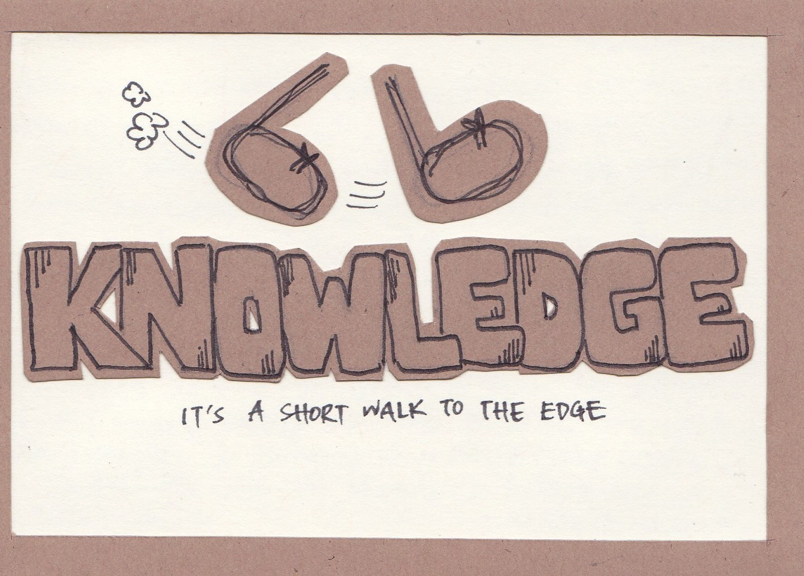
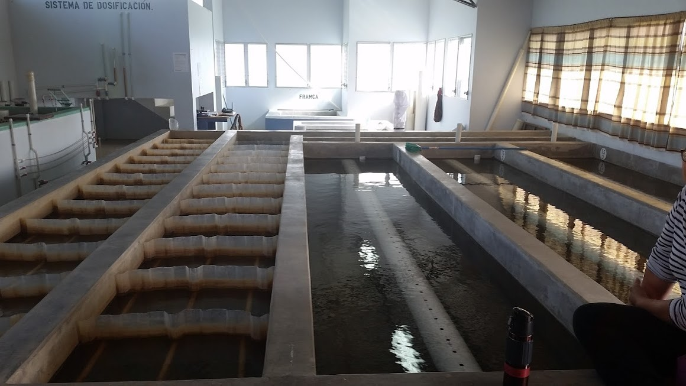
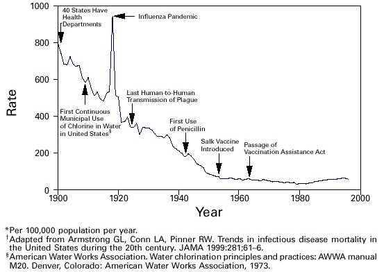

.. _title_Introduction_to_The_Physics_of_Water_Treatment_Design:

**************************************
The Physics of Water Treatment Design
**************************************

.. _heading_A_Different_Kind_of_Textbook:

A Different Kind of Textbook
============================

This textbook represents our cumulative insights from our journey that has been motivated by a quest to make the world a better place where everyone has access to safe water on tap, the engineering challenge of optimizing the design of drinking water treatment plants, and the curiosity to understand what controls their performance. We would like to understand what determines which contaminants make it the whole way through a water treatment plant. If we could understand what allows some contaminants to sneak the whole way through a water treatment plant, then we suspect that we could create better designs to more effectively remove contaminants.

Engineering textbooks provide a venue for authors to share what they've learned, to organize ideas, and to provide a guide for engineers as they design solutions for real world problems. Engineering textbooks are often intended to document the established core of knowledge. It seems reasonable to assume that what is in textbooks and in peer reviewed literature is mostly true.

.. _heading_Edge_of_Knowledge:

The Edge of Knowledge
----------------------

The assumption that what is written and passed down in oral history through the scientific community is true can lead to missed opportunities and lost insights. The hypotheses from one generation of scientists can too easily evolve into new theories in the next generation and then into established theories for the next. The history of drinking water treatment science is cloudy (think high turbidity!) with hypotheses that miss or misrepresent key concepts.

You might wonder why we care so much about getting the science right and being as clear as possible about what is known. After all, the core drinking water treatment technologies were invented before we were born and many of us have safe drinking water coming from our taps. Environmental Engineers have known how to design municipal drinking water treatment plants since they early 1900's. We care about getting the science right because we hypothesize that there are many opportunities to significantly improve drinking water treatment technologies and that improved understandings of each unit process have the potential to lead to new breakthroughs.

Our contention is that no one has ever optimized the design of a drinking water treatment plant! We are reasonably certain of this because we don't yet have models (with equations) that describe performance of most of the core unit processes (rapid mix, flocculation, floc blankets, sedimentation, sand filtration) used for surface water treatment. The only possible exception is lamellar sedimentation which can be characterized if we know the size and density distribution of the particles entering the sedimentation tank.

Traditional drinking water treatment textbooks can too easily miss the opportunity to advance the science of drinking water treatment technologies by presenting certainty where there should be skepticism. For example, rapid mix is described as process that occurs in a few seconds, flocculation is described as a process that should be fastest for high turbidity waters and slowest for low turbidity waters, and filtration performance is described by a model that predicts first order removal with respect to filter bed depth. We will demonstrate why each of these assumptions doesn't match observations, we will discuss new insights into these processes, and we will identify high priority research questions that have the potential to lead to major improvements in drinking water treatment.

We want to encourage skepticism and we want to develop insights to guide thoughtful skepticism. A key skill for successful engineering is the ability to identify the location of the edge of knowledge. The ability to distinguish between what is reasonably certain and what is still in question is what powers the scientific method of slowly extending knowledge. New insights are difficult to obtain if the research is based on a faulty premise.

.. _figure_short_walk:

    We've learned that we can find the edge of knowledge very soon after we begin researching a water treatment technology (artwork created by Yi Wen Ng in 2012).

There are significant knowledge gaps in every process that we cover in this textbook. We aren’t yet able to optimize surface water treatment processes because we don’t yet understand the fundamental physics of many of the processes. We are getting closer, join us on the journey.

We need the brightest and the best to create new and better solutions so we can meet the goal of providing everyone with safe drinking water. This challenge is apparently more difficult than building a space station, designing a fuel cell, or inventing the world wide web. So let’s role up our sleeves and begin.

Don't believe everything we say. Ask lots of questions:

  - How do you know that? The goal here is to identify the difference between what is known and what is hypothesized.
  - What is the equation that describes the physics of this process? If there isn't an equation that describes the process and that can be used to design the reactor for the process, then it is likely that the physics of the process is not yet understood.
  - How could we improve this process? If the physics of a process are fully understood, then dimensionally correct equations can be used to obtain the optimal design for that process.
  - Is the process design based on "rules of thumb" or on physics? "Rules of thumb" or empirical design guidelines often can be identified by the use of physical parameters that have units. For example, if the design guideline specifies a length, time, or velocity then it is likely that the guideline is not based on physics. If the design guidelines are based on a dimensionless parameter then it is possible that it is based on physics.
 - Evaluate the data to see if it matches predictions of the hypothesized model. Assess whether the authors acknowledge when their data doesn't match hypothesized models.
 - Beware of the use of words that are poorly defined and that hide uncertainty. For example, creating a name for a supposed mechanism to describe all of the observations that don't fit with your theory does NOT mean that you understand that mechanism. The ability to name something doesn't mean it is understood (see "sweep" flocculation as an example).
 - Does this “theory” provide insights that have led to new discoveries or new applications?
 - Does the “theory” include equations that are based on the fundamental laws of nature?
 - Does the “theory” use dimensionless constants that are close to one?
 - Is it an elegant “theory” with no need for special cases?

.. _heading_Uncertainty_in_Science_and_Engineering:

Uncertainty in Science and Engineering
--------------------------------------

A challenge for authors is to recognize the difference between what is known with a reasonably high degree of certainty and what is assumed to be true without a solid basis. We struggle to tell the difference between fact and hypothesis. The time-honored approach in science is to rely on the peer review process. That process for vetting knowledge has been shown to be flawed.

Your question could be whether the distinction between fact and hypothesis really matters. If the hypothesis is widely accepted as fact and if it has been accepted for decades what benefit is there to calling it a hypothesis rather than a fact?

This question is at the core of our educational philosophy. Is this text the repository of knowledge that we are providing for you to drink or is this text a conversation where we invite you to join the effort to discover better ways to provide safe water on tap?

.. _heading_Empathy:

Core Principles of AguaClara Innovation
---------------------------------------

The AguaClara network of organizations has been methodically inventing improved water treatment technologies since 2005. Our success is based on respect, empathy and love. Innovation requires flocculation of ideas. The transport of ideas between organizations and individuals is mediated by respect. Respect as a cornerstone of organizational culture foster rapid and honest exchange of ideas. The rapid pace of innovation in the AguaClara network is sustained thru a shared culture of respect, empathy, and love.

Curiosity can flourish in a culture of love, respect, and empathy. Asking why and why not and pondering an ever growing number of questions has empowered student teams to take on the quest for new knowledge and new solutions.

Any large organization will require a leadership hierarchy and any hierarchy will rely on respect based on fear or respect based on love. `Fear-based hierarchies <https://www.forbes.com/sites/lizryan/2015/11/25/the-five-characteristics-of-fear-based-leaders/#a6179f38a968>`_ impede the accurate sharing of information and can easily devolve into data-free and low-truth decision-making schemes. According to `Liz Ryan <https://www.forbes.com/sites/lizryan/2015/11/25/the-five-characteristics-of-fear-based-leaders/#a6179f38a968>`_, the characteristics of fear-based leaders include:

  - They'll Teach You, Whether You Like It or Not
  - Everyone is a Friend or a Foe
  - It's All about the Trophies
  - They Don't Step Outside Boxes
  - They're Addicted to Yardsticks

Love-based hierarchies foster honesty and a free-flow of information. Reflection is encouraged across the organization and truth, honesty, and integrity are valued. Staff at the bottom of the hierarchy know that their opinions and reflections are valued and thus they will be willing to report problems to organization leaders and share their ideas.

Love-based leaders relate to others based on true respect for the other. They will take the time to converse with people at all levels of the organization and will value the opportunity to speak with people who are the interface between the organization and the rest of the world. A person's value is based on being a person, not based on position in the hierarchy.

As water treatment plant designers it is critical that we spend time with a diverse set of stakeholders including community members and water treatment plant operators. Those relationships must begin with respect and valuing their insights. As we spend time together we can develop trust so that they communicate both the good and bad.

We've learned much from plant operators. They figured out how to reduce rising flocs at Agalteca, Honduras where we learned that conventional sedimentation tank inlet manifolds generate large circulation currents. Plant operators added curtains to the windows at Moroceli, Honduras (see :numref:`figure_Moroceli_curtains`) because they noticed that direct sunlight on the sedimentation tanks caused an increase in settled water turbidity.

.. _figure_Moroceli_curtains:

    Moroceli AguaClara water treatment plant operators installed curtains to reduce direct sunshine on sedimentation tanks. Solar heating produces density currents that carry flocs to the top of the sedimentation tank.

Empathy is fundamental in design. Empathy enables us to consider reality from another's perspective. Empathy enables us to bring the people who will use or benefit from a technology into the design considerations. Empathy brings the insight that water treatment plants need to have roofs and provide a secure work environment both day and night. Empathy brings the insight that replacement parts must be readily available and that generic components are preferred over specialty proprietary components.

.. _heading_The_Global_Context_for_Drinking_Water Treatment:

The Global Context for Drinking Water Treatment
===============================================

The `Sustainable Development Goals: SDGs <https://www.un.org/sustainabledevelopment/sustainable-development-goals/>`_ and specifically `SDG 6 <https://www.un.org/sustainabledevelopment/water-and-sanitation/>`_ provide the context and motivation for this text. The first SDG 6 target is: "By 2030, achieve universal and equitable access to safe and affordable drinking water for all." That goal is daunting and won't be met using the approaches of the past 5 decades. This text is about creating a new paradigm for the design of high performing water treatment technologies with the goal of making a real contribution toward SDG 6.1.

.. _figure_SDG6:

.. figure:: Images/SDG6.png
    :width: 100px
    :align: center
    :alt: SDG6

    Sustainable development goal 6 is all about clean water and sanitation.

The number of people who currently lack access to reliable safe water on tap is not known. Estimates range from "`1.8 billion who use a source of drinking water that is contaminated with feces <https://www.un.org/sustainabledevelopment/water-and-sanitation/>`_" to the Centers for Disease Control recommendations for where it is `usually safe to drink tap water <https://lifehacker.com/know-what-countries-guarantee-drinkable-tap-water-with-1635070463>`_.

.. _figure_CDC_Global_Safe_Tap_Water:

.. figure:: Images/CDC_Global_Safe_Tap_Water.png
    :width: 600px
    :align: center
    :alt: CDC Global Safe Tap Water

    There are relatively few countries where it is almost always safe to drink the tap water.

The `UN estimate in 2017 <https://www.un.org/sustainabledevelopment/blog/2017/07/billions-around-the-world-lack-safe-water-proper-sanitation-facilities-reveals-un-report/>`_ was that 2.1 billion lack access to safe water. By 2030 there will be an additional `1.2 billion from population growth <https://news.un.org/en/story/2015/07/505352-un-projects-world-population-reach-85-billion-2030-driven-growth-developing>`_.

.. _figure_Population_Infographic_01:

.. figure:: Images/Population_Infographic_01.jpg
    :width: 400px
    :align: center
    :alt: Population infographic

    1.2 billion people will be added to the global population between 2015 and 2030.

Thus by 2030 we need to provide safe water for at least 3.3 billion people AND maintain the water supply systems for the 5.2 billion who currently have access to safe water. That is a daunting number that requires some exploration!

.. code:: python

  from aguaclara.core.units import unit_registry as u
  import datetime
  People_needing_water_2030 = 3.3*10**9
  now = datetime.datetime.now()
  Task_time = (2030 - now.year)*u.year
  #If we assume we will meet this demand by building the same amount of new capacity each year, then we have
  People_per_year = People_needing_water_2030/Task_time
  People_per_year
  #The percapita demand for water
  Per_capita_demand = 3*u.mL/u.s
  Per_capita_demand.to(u.L/u.day)
  Per_capita_demand
  Rate_new_water_supply_capacity = (People_per_year * Per_capita_demand).to(u.L/(u.s*u.year))
  Rate_new_water_supply_capacity
  NYC_water_supply = 44000 * u.L/u.s
  NYC_per_year = Rate_new_water_supply_capacity/NYC_water_supply
  NYC_per_year

If we provide 260 L/day per person, then we need to provide the equivalent of 19 water supplies for New York City every year between now and 2030. The planet needs approximately 800,000 L/s of new capacity each year. AguaClara water treatment plants cost approximately $10,000 per L/s of treatment capacity. Thus the budget for global water treatment needs to be 8 billion USD per year. Note that this doesn't include any other aspects of supplying water. Managing water sources, transmission lines, storage, and distribution systems are even more expensive than water treatment.

The need for drinking water supplies isn't limited to the global south. The California Urban Water Agencies `estimate that 530,000 or more people in rural areas of California are unable to turn on their tap and access clean, safe water <https://static1.squarespace.com/static/5a565e93b07869c78112e2e5/t/5a5965934192024b3f610be1/1515808194305/CUWA2017_AnnualReport.pdf>`_.

.. _heading__2_billion_without_access_to_safe_water:

Safe Water Access
-----------------

The simple answer is that they are too poor and are unable to afford safe water on tap. But it isn't that simple! Families without access to safe water on tap often spend more for water than families with safe water on tap. There seem to be two key reasons why those with limited financial resources often have limited access to water, poor quality water, and yet pay a premium for that water.

The first reason for the lack of safe water has been the poor track record of water treatment infrastructure. The frequent failures and high operating costs of municipal scale water treatment systems have led many decision makers to conclude water treatment infrastructure isn't a worthwhile investment. Politicians who invest political capital to bring water treatment to their community often find that after the initial ribbon cutting there is little political benefit because the system doesn't deliver the benefits to the community that they had promised.

The second reason for the lack of safe water is the lack of access to capital for municipal scale infrastructure. Even though an AguaClara water treatment plant would pay for itself in a fraction of its useful life, there is not yet a financial mechanisms for communities to access a loan so that they can make the investment. A community would need to save enough money to be able to purchase a water treatment plant (as was the case for Las Vegas, Honduras), a bilateral donor can finance a plant through a donation, or the national government can use sovereign debt or taxes to finance plants. The challenge for a community is to obtain the financial or political power to access the needed funds.

As we work to solve a global challenge that has been plaguing humanity since the dawn of human civilization, then it will serve us well to understand a bit of the history that has led to our current reality. Water treatment history includes amazing successes, persistent failures, fortuitous discoveries, a heavy reliance on empiricism, and an occasional myth. Our goal is learn from and reflect on our history and then create even better solutions.

.. _heading_Introduction_to_Surface_Water_Treatment:

Introduction to Surface Water Treatment
=======================================

We treat water because it doesn't meet the requirements for its intended use. We need to understand the problem so that we can understand existing and novel water treatment technologies.

.. _heading_Water_Contaminants:

Water Contaminants
------------------

Many substances are able to dissolve in water. Additionally, water is able to carry suspended solids because of its high density. The substances may be naturally occurring, anthropogenic, benign, or harmful. The types of contaminants are influenced by the water source. Contaminant concentrations are often highly variable over time.

A water treatment system must be able to handle the likely range of contaminant levels and produce treated water that meets the user requirements. In some cases the user may have the option of switching sources or reducing demand when a source becomes excessively contaminated for a limited period of time. For example, a municipal water supplier may be able to shut the plant down for a few hours to avoid having to treat a very dirty water after a rainstorm. This strategy can work well for water sources that have small watersheds and hence a rapid return to better water after the storm passes. In other cases the water treatment processes must be capable of treating the most contaminated water that the water source provides. In any case, selecting the best unit processes to treat a given water source for a particular use case can be challenging. It is common to find water treatment plants that are unable to adequately treat their water source.

.. _heading_Particles:

Particles
^^^^^^^^^^^

Surface waters (rivers, streams, lakes) and some ground water (especially ground water under the influence of surface water) inevitable carry some suspended particles. "`Particles transported by rivers are composed of resistant primary minerals (e.g., quartz and zircon), secondary minerals (clays, metallic oxides and oxyhydroxides) and biogenic remains." <https://www.sciencedirect.com/science/article/pii/S0048969708010103>`_ Many of these particles may be harmless, but there is good reason to be hesitant to drink water with a high concentration of suspended particles.

.. _heading_Pathogens:

Pathogens
^^^^^^^^^
Pathogens include viruses (100 nm), bacteria (1 :math:`\mu m`), and protozoa (several :math:`\mu m`). Pathogens are particles and are removed by processes that remove particles along with other microbes, organic and inorganic particles.

.. _heading_Turbidity:

Turbidity
^^^^^^^^^

Turbidity or cloudiness is an indirect measure of particle concentration. Turbidity is an optical measurement of scattered light. Light scattering by refraction is primarily caused by particles that are smaller than but close to the wavelength of light. Particles that are close to but larger than the wavelength of light can reflect light. Turbidity measures both of these effects by shining a light into a water sample and then measuring the scattered light with a photodetector at 90°. The meter is then calibrated with standard suspensions.

For a given suspension the turbidity can be directly correlated with the suspended solids concentration. However, that relationship is complicated because the amount of scattered light is related to the particle size distribution because given the same mass concentration, smaller particles have more surface area and thus reflect more light.

Although turbidity would seem to be an odd parameter to use to measure water quality, it turns out to be the most widely used water quality measurement. The reasons are simple. First, turbidity is amazingly easy to measure over a very wide range of particle concentrations (perhaps 10 :math:`\mu g/L` to 1 :math:`g/L`). The test doesn't require any reagents and it can be done in a flow through sample cell for real time measurements. Second, particle free water is pathogen free water. Third, disinfection processes (chlorination, ozonation, UV light) are all significantly less effective at inactivating pathogens if there are other particles present in the water.

.. _heading_Dissolved_Species:

Dissolved Species
^^^^^^^^^^^^^^^^^

The list of dissolved species that can be present in water in the environment is endless and ranges from natural organic matter (from decay of plants) to caffeine to atrazine. Usually the highest concentration class of molecules is dissolved natural organic matter (NOM). NOM has some similarity to inorganic particles in that it isn't necessarily harmful and yet there are several reasons why removal of NOM is an important water treatment goal.

From an aesthetic perspective, NOM absorbs light at short wavelengths and this results in water that looks yellow or brown. While I enjoy drinking tea with a rich brown color, I'd prefer that my water be clear.

NOM plays a supersized role in influencing performance of surface water treatment plants. NOM has three negative effects:

  #. It requires higher dosages of coagulant for effective particle removal.
  #. It reduces the disinfection effectiveness of chlorine, ozone, and UV. Chlorine partially oxidizes the NOM and thus more chlorine must be used to maintain a residual level of chlorine.
  #. It can produce disinfection by-products that are toxic.

Thus removal of NOM is a water treatment goal. Fortunately the same coagulants that are used for particle removal also can remove a significant fraction of NOM. The interactions between NOM and coagulants will be discussed in the :ref:`Introduction to Rapid Mix <title_Rapid_Mix_Introduction>`.

The removal of other dissolved species is beyond the scope of the first release of this textbook. The authors intend to add sections on the removal of some dissolved species in the near future.

.. _heading_Chlorine_Saved_the_World:

Chlorination
------------------------

Chlorine is widely recognized for reducing mortality from water borne disease in the United States. A more careful review of the mortality data and of the ability of chlorine to inactive various pathogens makes it difficult to assess the role of chlorine. A classic graph (see :numref:`figure_US_death_rate`) has been used to suggest that chlorination of drinking water supplies resulted in a significant reduction in mortality

.. _figure_US_death_rate:

    `Classic graph showing the reduction in the death rate for the United States from 1900 to 1996. <https://www.cdc.gov/mmwr/preview/mmwrhtml/mm4829a1.htm>`_

.. _heading_Treatment_Trains:

Treatment Trains
----------------

.. _table_Surface_Water_Treatment_Technologies:

.. csv-table:: Surface Water Treatment Technologies
   :header: "Technology", "Description", "Prerequisite", "Owner", "Year"
   :align: center

   Simple sedimentation, particles settle, none, public, unknown
   Flocculation, aluminum and iron salts, none, public, `1757 <https://www.iwapublishing.com/news/coagulation-and-flocculation-water-and-wastewater-treatment>`_
   Sedimentation, horizontal flow, flocculation, public, unknown
   Lamellar sedimentation, plate or tube settlers, flocculation or floc blanket, public, `1904 <http://www.hydroflotech.com/inclined-plate-clarifier-basic-theory-of-operation>`_
   Roughing filter, simple sedimentation in a gravel bed, none, public, `unknown <https://www.researchgate.net/publication/237827490_Roughing_filter_for_water_pre-treatment_technology_in_developing_countries_A_review?enrichId=rgreq-bb1d04e6613378d626c78cadb6674ae8&enrichSource=Y292ZXJQYWdlOzIzNzgyNzQ5MDtBUzoyMDAwMDczMDQxMjY0NjdAMTQyNDY5Njg2NTYxMQ%3D%3D&el=1_x_2>`_
   Slow sand filtration, Roughing filter or single step treatment for low NTU water, none, public, `1829 <https://en.wikipedia.org/wiki/Slow_sand_filter>`_
   Rapid sand filtration, depth filtration, sedimentation, public, `1920 <https://en.wikipedia.org/wiki/Rapid_sand_filter>`_
   Stacked rapid sand filter, gravity powered backwash, lamellar sedimentation, AguaClara Cornell open source, `2012a <https://ascelibrary.org/doi/abs/10.1061/%28ASCE%29EE.1943-7870.0000562>`_
   Floc blanket, upflow fluidized suspension of flocs, flocculation, public, `1930 <https://link.springer.com/chapter/10.1007%2F978-3-642-61196-4_2>`_
   Jet reverser floc blanket, first fully fluidized floc blanket, flocculation, AguaClara Cornell open source, `2012b <http://cuaguaclara.blogspot.com/2012/08/the-floc-blanket-quest.html>`_
   Ballasted sedimentation, micro sand increases floc density, -, `Actiflo Veolia <https://www.veoliawatertechnologies.com/en/technologies/actiflo>`_, `1995 <https://patents.google.com/patent/US5840195>`_
   Superpulsator, pulsing flow through floc blanket, rapid mix, `Degremont <http://www.degremont-technologies.com/SUPERPULSATOR-R>`_, `1958 <https://patents.google.com/patent/US3038608A>`_  `1991 <https://patents.google.com/patent/US5143625>`_
   Dissolved air flotation, bubbles carry particles upward, flocculation, Public, `1905 <https://iwaponline.com/wst/article-abstract/31/3-4/1/4138/Principles-and-applications-of-dissolved-air>`_

See `Pretreatment Processes for Potable Water Treatment Plants by Jeff Lindgren for an excellent overview of available technologies, May 2014 (not including AguaClara innovations) <https://www.pnws-awwa.org/uploads/PDFs/conferences/2014/2.%20PNWS%20AWWA%20WTC%20Precon%2005%2007%202014%20Pretreatment%20by%20B&V%201&2%20-%20R1.pdf>`_.

The prerequisites for the unit processes in :numref:`table_Surface_Water_Treatment_Technologies` reveal that surface water treatment almost always requires a series of treatment steps. A treatment train is a series of treatment steps (or unit processes) designed to convert a contaminated source water into a purified water meeting the use requirements.

Example treatment trains include:
 - Conventional mechanized treatment: mechanical flocculation, lamellar sedimentation, rapid sand filtration, disinfection
 - Superpulsator: rapid mix, floc blanket, lamellar sedimentation, rapid sand filtration
 - AguaClara: hydraulic flocculation, floc blanket, lamellar sedimentation, stacked rapid sand filtration, disinfection
 - Membrane filtration: flocculation, sedimentation, rapid sand filtration, granular or powdered activated carbon, pre-oxidation (see `Review Article <https://pubs-acs-org.proxy.library.cornell.edu/doi/abs/10.1021%2Fes802473r>`_)

.. _heading_Textbook_Philosophy:

An Evolving Research Approach
-----------------------------

This is an evolving textbook. We don't intend to ever print this book. This book has version numbers just like software with the idea that revisions are rapid and frequent. We commit to helping to accelerate the pace of knowledge generation and to revising this text as you help us identify places where we have presented hypotheses as theory and places where research provides a basis for better theoretical models of the water treatment processes.

Our students are co-creators of knowledge and not empty vessels to be filled with our wisdom. AguaClara technologies are inventions that are the result of idea collisions in the AguaClara labs and from observations and reflections with operators, technicians, and engineers in dozens of water treatment plants. Although we've learned a great deal about water treatment since 2005 when AguaClara was founded, there is still much more to be learned. And so it is with a spirit of curiosity that we write this textbook expecting to learn even more in the coming years.

Socrates said "`Education is the kindling of a flame, not the filling of a vessel <https://www.goodreads.com/quotes/69267-education-is-the-kindling-of-a-flame-not-the-filling>`_." Our goal is to bring the spirit of play, discovery, and mystery into the challenge of improving the quality of life of everyone on the planet by sharing better methods to produce safe drinking water.

In We Make the Road by Walking: Conversations on Education and Social Change, Paulo Freire said,
"`The more we become able to become a child again, to keep ourselves childlike, the more we can understand... <https://www.goodreads.com/author/quotes/41108.Paulo_Freire?page=2>`_". We commit to playing together in a relationship where we are all learning and we are all teaching. "Education must begin with the solution of the teacher-student contradiction, by reconciling the poles of the contradiction so that both are simultaneously teachers and students." - Paulo Freire

[SECTIONS BELOW TO BE MOVED OUT OF CHAPTER]

.. _heading_Myth_in_Environmental_Engineering:

Myth in Environmental Engineering
---------------------------------

The following list is designed to get you thinking. These are concepts that are present in the Environmental Engineering community and that may capture some elements of truth and that may also further misconceptions.

 - Dead bodies cause disease
 - Slow sand filters ripen (improve in ability to remove contaminants over time) because of biological growth in the filter bed
 - If a 20 cm deep sand filter removes 90% of influent particles, then a 40 cm deep filter will remove 99% of influent particles
 - If water is dirty, then you should filter it
 - Chlorine disinfects dirty water and makes it safe to drink
 - Chlorination and filtration eliminated typhoid fever from the US
 - Cessation of chlorination due to fear of disinfection by products caused the cholera outbreak in Peru in 1993
 - Sedimentation is simple
 - We already know how to solve the problem of the billions of people who do not having access to safe drinking water

