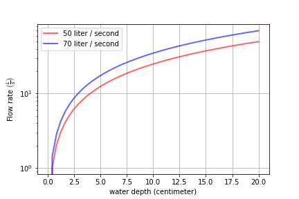

.. _title_Python_Tutorial:

***************
Python Tutorial
***************


.. _table_code_resources:

.. csv-table:: Code resources.
   :header: "Description", "Theme", "Example function", "Function call"
   :align: left

   "`Python functions <http://docs.python.org/3/library/functions.html>`_", "low level programming functions","open a file","open(file, mode='r')"
   "`Pint universal constants <https://github.com/hgrecco/pint/blob/master/pint/constants_en.txt>`_", "physical constants with units", "Avogadro's number", "u.avogadro_number"
   "`Pint units <https://github.com/hgrecco/pint/blob/master/pint/default_en.txt>`_", "units that can be attached to numbers and numpy arrays", " 5 m/s", "5* u.mm/u.s"
   "aguaclara.core.`physchem <https://github.com/AguaClara/aguaclara/blob/master/aguaclara/core/physchem.py>`_", "pipeflow, orifices, viscosity of water, weirs, manifolds, Kozeny equation", "total head loss in a straight pipe", "headloss(FlowRate, Diam, Length, Nu, PipeRough, KMinor)"
   "aguaclara.research.`floc_model <https://github.com/AguaClara/aguaclara/blob/master/aguaclara/research/floc_model.py>`_","AguaClara flocculation model, velocity gradients, Kolmogorov length scales","velocity gradient in a coiled tube", "g_coil(FlowPlant, IDTube, RadiusCoil, Temp)"
   aguaclara.research. `environmental_processes_analysis <https://github.com/AguaClara/aguaclara/blob/master/aguaclara/research/environmental_processes_analysis.py>`_," carbonate system, CMFR and advection dispersion reactor analysis ", "extract data from ProCoDA generated Gran analysis file", "Gran(data_file_path)"
   aguaclara.research. `procode_parser<https://github.com/AguaClara/aguaclara/blob/master/aguaclara/research/procoda_parser.py>`_,"Extracts data from multiple ProCoDA files based on the state and data column", extract a column of data from a ProCoDA data file, "column_of_data(data_file_path, start, column)"
   `SciPy<https://docs.scipy.org/doc/scipy/reference/>`_,"computing integrals numerically, solving differential equations, optimization, and sparse matrices", root finding, "root(func, 0.3)"
   `NumPy<https://docs.scipy.org/doc/numpy/user/quickstart.html>`_,"Array manipulation and math functions",create an array with linearly spaced elements,"np.`linspace<https://docs.scipy.org/doc/numpy/reference/generated/numpy.linspace.html#numpy.linspace>`_(start,stop,num)"
   `PyPlot<https://matplotlib.org/tutorials/index.html>`_, Graphs!,Create beautiful graphs,"see below"


Import statements
-----------------

.. code:: python

  import aguaclara
  import aguaclara.core.physchem as pc
  from aguaclara.core.units import unit_registry as u
  import aguaclara.core.constants as con
  import aguaclara.research.environmental_processes_analysis as epa
  import aguaclara.research.floc_model as fm

  import numpy as np
  import matplotlib.pyplot as plt
  import pandas as pd
  from scipy import constants, interpolate

  #function to force units to always simplify to SI.
  #u.auto_reduce_dimensions = False
   x = 5 * u.NTU


Hint: If you are typing a function name and want to know what the
options are for completing what you are typing, just hit the tab key for
a menu of options.

Hint: If you want to see the source code associated with a function, you
can do the following import inspect inspect.getsource(foo)

Where “foo” is the function that you’d like to learn about.

Markdown
--------

Markdown files allow you to mix code, beautiful Latex equations, nicely formatted text, figures, and tables. To create a markdown file in Atom simply create a new file (File menu) and give it a .md file extension. The .md file extension is critical so that atom knows how to interpret what you are typing!

Markdown allows you to create very nicely formatted text including Latex
equations which will show up in the preview pane of Atom (type control - shift - E to display the preview pane of a Markdown file).

.. math:: c = \sqrt{a^2 + b^2}

Markdown does not handle automatic numbering of equations, figures, and tables.

The Python Kernel remembers all definitions (functions and variables) as
they are defined based on execution. Thus if you fail to execute a line
of code, the parameters defined in that line won’t be available.
Similarly, if you define a parameter and then delete that line of code,
that parameter remains defined until you restart Atom.

Before submitting a file for others to use, you need to verify that all of the dependencies are defined and that you didn't accidently delete a definition that is required. You can do this by placing your cursor in a python code section and then clicking on the python 3|idle in the toolbar at the bottom of the Atom window. Select restart Python 3 kernel. Then execute all of the python code in your document from top to bottom and make sure that all of the code performs as expected.

Transitioning From Matlab To Python
-----------------------------------

**Indentation** - When writing functions or using statements, Python
recognizes code blocks from the way they are indented. A code block is a
group of statements that, together, perform a task. A block begins with
a header that is followed by one or more statements that are indented
with respect to the header. The indentation indicates to the Python
interpreter, and to programmers that are reading the code, that the
indented statements and the preceding header form a code block.

**Suppressing Statements** - Unlike Matlab, you do not need a semi-colon
to suppress a statement in Python;

**Indexing** - Matlab starts at index 1 whereas Python starts at index
0.

**Functions** - In Matlab, functions are written by invoking the keyword
“function”, the return parameter(s), the equal to sign, the function
name and the input parameters. A function is terminated with “end”.::

  function
    y = average(x)
    if ~isvector(x)
      error('Input must be a vector') end
      y = sum(x)/length(x);
      end

In Python, functions can be written by using the keyword “def”, followed
by the function name and then the input parameters in parenthesis
followed by a colon. A function is terminated with “return”.::

  def average(x):
    if ~isvector(x)
    raise VocationError("Input must be a vector")
    return sum(x)/length(x)

**Statements** - for loops and if statements do not require the keyword
“end” in Python. The loop header in Matlab varies from that of Python.
Check examples below:

Matlab code::

  s = 10;
  H = zeros(s);
    for c = 1:s
      for r = 1:s
      H(r,c) = 1/(r+c-1);
      end
    end

**Printing** - Use “print()” in Python instead of “disp” in Matlab.

**Helpful Documents**

`Numpy for Matlab
Users <https://docs.scipy.org/doc/numpy-dev/user/numpy-for-matlab-users.html>`__

`Stepping from Matlab to
Python <http://stsievert.com/blog/2015/09/01/matlab-to-python/>`__

`Python for Matlab Users, UC
Boulder <http://researchcomputing.github.io/meetup_fall_2014/pdfs/fall2014_meetup13_python_matlab.pdf>`__


Useful hotkeys for executing code
---------------------------------

Hydrogen hotkeys are listed under Packages->Hydrogen, and are also detailed here.
Ctrl+Enter runs the currently selected line of code.
Shift+Enter works as Ctrl+Enter and also moves the selection to the next line of code.
Adding an Alt to the sequence will run the entire code block instead of a single line:
  Alt+Ctrl+Enter runs the current code block.
  Alt+Shift+Enter runs the current code block and moves the selection to the next block.

Units
-----

Engineering requires calculations with units. Prior to modern computer languages engineers used paper and pencil, slide rules, calculators, and more recently spreadsheets to do calculations. All of these methods are prone to calculation errors because units aren't handled as an essential part of each value. Spreadsheets are especially notorious for calculation errors because unit conversions are buried in formulas that are hidden in the cells.

Operations on values with units follow very clear algebraic rules and thus units can be attached to numerical values and carried through math operations. This capability is implemented in Python using `Pint<https://pint.readthedocs.io/en/latest/>`_. The Pint package includes a host of units and prefixes (such as :math:`\mu` for :math:`10^{-6}`). As you master using Python and Pint you will say goodbye to mindless unit conversions forever!

Pint can be configured to either report the units as they were given to it or it can simplify the units to the SI base units. This behavior can be set with the command::
  u.auto_reduce_dimensions = True

The default setting for u.auto_reduce_dimensions is False. If you want to change this so that pint always simplifies the units, then set it to True.

Environmental engineers historically described surface loading rates for sedimentation tanks using units of gal/min per square foot. How fast is :math:`\frac{1 gpm}{ft^2}` in :math:`\frac{mm}{s}`?

.. code:: python
  V_surface_loading_rate = (1 * u.gal/(u.min * u.ft**2)).to(u.mm/u.s)
  print('The surface loading rate is', V_surface_loading_rate)
  aguaclara.core.units.set_sig_figs(3)
  print('The surface loading rate is', V_surface_loading_rate)

The surface loading rate is 0.6791 millimeter / second

After reducing the number of significant digits to 3 we obtain:
The surface loading rate is 0.679 millimeter / second

How long does it take to stop a car that is initially traveling at 60 mph if the coefficient of friction is 0.5?

.. code:: python
  v_0 = 60 * u.mile/u.hr
  friction_coefficient = 0.5
  deceleration = friction_coefficient * u.standard_gravity
  t_deceleration = v_0/deceleration
  print('The time to stop the car is',t_deceleration)
  print('The time to stop the car is',t_deceleration.to_base_units())

The time to stop the car is 120 mile / hour / standard_gravity
We add the .to_base_units() directive to force pint to simplify the units.
The time to stop the car is 5.47 second

Many functions written in Python do not yet handle units and thus it is sometimes necessary to remove the units. Examples include graphs (althougth units might be coming to matplotlib), SciPy functions, and the NumPy functions used to populate arrays. For these cases you can strip the units off a number using the .magnitude method. Be careful to make sure you know what the units are before you remove them otherwise you may be confused by the results!

.. code:: python

  Q = 5 * u.gal/u.min
  fill_time = 3*u.hr
  Volume = Q * fill_time
  print('The volume is',Volume)
  print('The magnitude of the Volume is', Volume.magnitude)
  print('The units of the flow are', Volume.units)
  #force pint to display in a selected set of Units
  print('The volume is',Volume.to(u.kL))

The volume is 15 gallon * hour / minute
The magnitude of the Volume is 15.0
The units of the flow are gallon * hour / minute
The volume is 3.41 kiloliter

It is useful to force pint to display the result in the units of your choice.


Arrays and units
----------------

Use Numpy arrays rather than Python lists to enable math with numbers and units.
When creating arrays with units remember that

 * Array elements don't have units!
 * Arrays can have units.

Therefore always attach units to the array after the array has been created. This means that array elements should be dimensionless and thus arrays must be created using dimensionless values.

We can use numpy linspace with a simple change to make it dimensionless. Usually linspace has start and stop elements that would logically have units: np.linspace(start, stop, num). But elements can't have units! We can make the inputs to linspace be dimensionless to create a dimensionless array and then multiplies it by the final value that includes the units to scale the array correctly. For evenly spaced arrays starting at the end of the first space we have either:

 * np.linspace(start/stop, 1, num) * stop
 * np.linspace(1 / num, 1, num) * stop

For evenly spaced arrays starting with zero we have:

 * np.linspace(0, 1, num+1) * stop!

The print function can't currently handle arrays with units. The array can be printed nicely in two steps as shown below.

.. code:: python

 n_rows = 10
 Flow = 20 * u.L/u.s
 Flow_array = (np.linspace(1 / n_rows, 1,n_rows) * Flow)
 print('The array of flow rates is',Flow_array.magnitude,Flow_array.units)

 Flow_array = (np.linspace(1 / n_rows, 1,n_rows) * Flow).to(u.L/u.s)
 print('The array of flow rates is',Flow_array.magnitude,Flow_array.units)

 Flow_array = (np.linspace(0, 1,n_rows+1) * Flow).to(u.L/u.s)
 print('The array of flow rates is',Flow_array.magnitude,Flow_array.units)


[  2.   4.   6.   8.  10.  12.  14.  16.  18.  20.] liter / second


Plotting
--------

We will use this `pyplot coding style`<https://matplotlib.org/tutorials/introductory/usage.html#coding-styles>._
fig is a Figure instance—like a blank canvas
ax is an AxesSubplot instance—think of a frame for plotting in

fig, ax = plt.subplots()
ax.plot(x, y, 'r-', linewidth=2, label='sine function', alpha=0.6)
ax.legend(loc='upper center')
plt.show()

Create a graph showing flow rate vs depth for a linear flow orifice meter that has a depth range of 20 cm and an flow range of 50 L/s.

`Legend location options<https://matplotlib.org/api/_as_gen/matplotlib.pyplot.legend.html>`_
`Colors<https://matplotlib.org/api/colors_api.html>`_
'b', 'g', 'r', 'c', 'm', 'y', 'k', 'w'
blue, green, red, cyan, magenta, yellow, black, white
`Data markers (if you are plotting data),https://matplotlib.org/api/markers_api.html#module-matplotlib.markers>`_


.. code:: python

  H_max = 20 * u.cm
  Q_max1 = 50 * u.L/u.s
  Q_max2 = 70 * u.L/u.s
  num = 50
  a = np.linspace(0, 1, num)
  x = a * H_max
  y1 = a * Q_max1
  y2 = a * Q_max2


  fig, ax = plt.subplots()
  ax.plot(x, y1, 'r-', linewidth=2, label=Q_max1, alpha=0.6)
  ax.plot(x, y2, 'b-', linewidth=2, label=Q_max2, alpha=0.6)

  ax.set(xlabel='water depth ('+str(x.units) +')')
  ax.set(ylabel='Flow rate ('+str(Q_max1.units)+')')
  #Below is the method for using latex to format the units
  ax.set(ylabel='Flow rate ' + r'$\left (\frac{L}{s}\right )$')

  # options: linear or log
  plt.yscale('linear')
  plt.xscale('linear')

  #Grids can be added with the code below.
  #plt.grid(b=True, which='major', color='k', linestyle='-', linewidth=1)
  #plt.grid(b=True, which='minor', color='k', linestyle='-', linewidth=0.5)
  ax.grid(True)

  #options:
  ax.legend(loc='best')

  fig.savefig('Introduction/Images/LFOM_flow_vs_height')
  plt.show()


.. _figure_LFOM_flow_vs_height:



   The flow through an LFOM is directly proportional to the height of the water above the bottom of the first row of orifices.


Indexing is done by row and then by column. To call all of the elements
in a row or column, use a colon. As you can see in the following
example, indexing in python begins at zero. So ``b[:,1]`` is calling all
rows in the second column

.. code:: python

    b[:,1]

[

.. raw:: latex

   \begin{pmatrix}1 & 4 & 7\end{pmatrix}

milliliter]

If you want a specific range of values in an array, you can also use a
colon to slice the array, with the number before the colon being the
index of the first element, and the number after the colon being **one
greater** than the index of the last element.

.. code:: python

    b[1:3,0]

[

.. raw:: latex

   \begin{pmatrix}3 & 6\end{pmatrix}

milliliter]

For lists and 1D arrays, the ``len()`` command can be used to determine
the length. Note that the length is NOT equal to the index of the last
element because the indexes are zero based. The len function can be used
with lists and arrays. For multiple dimension arrays the ``len()``
command returns the length of the first dimension.

.. code:: python

    len(a)

::

    4

.. code:: python

    len(b)

::

    3

For any higher dimension of array, ``numpy.size()`` can be used to find
the total number of elements and ``numpy.shape()`` can be used to learn
the dimensions of the array.

.. code:: python

    np.size(b)

::

    9

.. code:: python

    np.shape(b)

::

    (3, 3)

For a listing of the commands you can use to manipulate numpy arrays,
refer to the `scipy
documentation <https://docs.scipy.org/doc/numpy/reference/routines.array-manipulation.html>`__.


.. code:: python

    V_up = 1*u.mm/u.s
    D_reactor = 1*u.inch
    A_reactor = pc.area_circle(D_reactor)
    Q_reactor = V_up*A_reactor
    Q_reactor

0.0005067074790974977 meter2 millimeter/second

The result isn’t formatted very nicely. We can select the units we’d
like to display by using the ``.to`` method.

.. code:: python

    Q_reactor.to(u.mL/u.s)

0.5067074790974977 milliliter/second

We can also force the display to be in the metric base units

.. code:: python

    Q_reactor.to_base_units()

5.067074790974977e-07 meter3/second

If you need to strip units from a quantity (for example, for
calculations using funtions that don’t support units) you can use the
``.magnitude`` method. It is important that you force the quantity to be
in the correct units before stripping the units.

.. code:: python

    Q_reactor.to(u.mL/u.s).magnitude

::

    0.5067074790974977


Example problem and solution.
~~~~~~~~~~~~~~~~~~~~~~~~~~~~~

Calculate the number of moles of methane in a 20 L container at 15 psi
above atmospheric pressure with a temperature of 30 C.

.. code:: python

    # First assign the values given in the problem to variables.
    P = 15 * u.psi + 1 * u.atm
    T = u.Quantity(30,u.degC)
    V = 20 * u.L
    # Use the equation PV=nRT and solve for n, the number of moles.
    # The universal gas constant is available in pint.
    nmolesmethane = (P*V/(u.R*T.to(u.kelvin))).to_base_units()
    print(nmolesmethane)
    print('There are ', nmolesmethane ,' of methane in the container.')
    nmolesmethane

::

    There are 1.62 mol of methane in the container.

1.6246299433154001 mole

--------------

Functions
---------

When it becomes necessary to do the same calculation multiple times, it
is useful to create a function to facilitate the calculation in the
future.

-  Function blocks begin with the keyword def followed by the function
   name and parentheses ( ).
-  Any input parameters or arguments should be placed within these
   parentheses.
-  The code block within every function starts with a colon (:) and is
   indented.
-  The statement return [expression] exits a function and returns an
   expression to the user. A return statement with no arguments is the
   same as return None.
-  (Optional) The first statement of a function can the documentation
   string of the function or docstring, writeen with apostrophes .

Below is an example of a function that takes three inputs, pressure,
volume, and temperature, and returns the number of moles.

.. code:: python

    # Creating a function is easy in Python
    def nmoles(P,V,T):
        return (P*V/(u.R*T.to(u.kelvin))).to_base_units()

Try using the new function to solve the same problem as above. You can
reuse the variables. You can use the new function call inside the print
statement.

.. code:: python

    print('There are', nmoles(P,V,T),'of methane in the container.')

::

    There are 1.62 mol of methane in the container.

--------------

Density Function
----------------

We will create and graph functions describing density and viscosity of
water as a function of temperature. We will use the `scipy 1D
interpolate
function <https://docs.scipy.org/doc/scipy/reference/tutorial/interpolate.html#d-interpolation-interp1d>`__
to create smooth interpolation between the known data points to generate
a smooth function.

``density_water``, defined in
```physchem`` <https://github.com/AguaClara/AguaClara_design/blob/master/physchem.py>`__,
is a function that returns a fluid’s density at a given temperature. It
has one input parameter, temperature (in Celsius).

.. code:: python

    # Here is an example of how you could define the function yourself if you chose.

    # Below are corresponding arrays of temperature and water density with appropriate units attached.

    # The 1d interpolation function will use a cubic spline.
    Tarray = [0,5,10,20,30,40,50,60,70,80,90,100]*u.degC
    rhoarray = [999.9,1000,999.7,998.2,995.7,992.2,988.1,983.2,977.8,971.8,965.3,958.4]*u.kg/u.m**3
    def DensityWater(T):

        rhointerpolated=interpolate.interp1d(Tarray, rhoarray, kind='cubic')
        rho=rhointerpolated(T.to(u.degC))
        return rho*u.kg/u.m**3

    # You can get the density of water for any temperature using this function call.
    print('The density of water at ',20*u.degC ,'is',DensityWater(20*u.degC),'.')

::

    The density of water at 20.0 celsius is 998.2 kg/m³.

--------------

Pipe Database
-------------

The
```pipedatabase`` <https://github.com/AguaClara/AguaClara_design/blob/master/pipedatabase.py>`__
file in the ``AguaClara_design`` has many useful functions concerning
pipe sizing. It provides functions that calculate actual pipe inner and
outer diameters given the nominal diameter of the pipe. Note that
nominal diameter just means the diameter that it is called (hence the
discriptor “nominal”) and thus a 1 inch nominal diameter pipe might not
have any dimensions that are actually 1 inch!

.. code:: python

    # The OD function in pipedatabase returns the outer diameter of a pipe given the nominal diameter, ND.
    pipe.OD(6*u.inch)

6.625 inch

The ND_SDR_available function returns the nominal diameter of a pipe
that has an inner diameter equal to or greater than the requested inner
diameter `SDR, standard diameter
ratio <http://www.engineeringtoolbox.com/sdr-standard-dimension-ratio-d_318.html>`__.
Below we find the smallest available pipe that has an inner diameter of
at least 7 cm

.. code:: python

    IDmin = 7 * u.cm
    SDR = 26
    ND_my_pipe = pipe.ND_SDR_available(IDmin,SDR)
    ND_my_pipe

3.0 inch

The actual inner diameter of this pipe is

.. code:: python

    ID_my_pipe = pipe.ID_SDR(ND_my_pipe,SDR)
    print(ut.sig(ID_my_pipe.to(u.cm),2))

::

    8.2 cm

We can display the available nominal pipe sizes that are in our
database.

.. code:: python

    pipe.ND_all_available()

[

.. raw:: latex

   \begin{pmatrix}0.5 & 1.0 & 2.0 & 3.0 & 4.0 & 6.0 & 8.0 & 10.0 & 12.0 & 16.0 & 18.0 & 24.0 & 30.0 & 36.0 & 48.0 & 60.0 & 72.0\end{pmatrix}

inch]

--------------

Physchem
--------

The ‘AguaClara_design’
`physchem <https://github.com/AguaClara/AguaClara_design/blob/master/physchem.py>`__
has many useful fluids functions including Reynolds number, head loss
equation, orifice equations, viscosity etc.

--------------

Viscosity Functions
-------------------

.. code:: python

    #Define the temperature of the fluid so that we can calculate the kinematic viscosity
    temperature = 20 * u.degC
    #Calculate the kinematic viscosity using the function in physchem which we access using "pc"
    nu=pc.viscosity_kinematic(temperature)
    print('The kinematic viscosity of water at '+ut.sig(temperature,2)+' is '+ut.sig(nu,3))

::

    The kinematic viscosity of water at 20 celsius is 1.00e-6 m²/s

--------------

Our First Graph!
----------------

We will use `matplotlib <https://matplotlib.org/>`__ to create a graph
of water density as a function of temperature.
`Here <https://matplotlib.org/users/pyplot_tutorial.html>`__ is a quick
tutorial on graphing.

.. code:: python

    # Create a list of 100 numbers between 0 and 100 and then assign the units of degC to the array.
    # This array will be the x values of the graph.

    GraphTarray = u.Quantity(np.arange(100),u.degC)

    #Note the use of the .to method below to display the results in a particular set of units.
    plt.plot(GraphTarray, pc.viscosity_kinematic(GraphTarray).to(u.mm**2/u.s), '-')
    plt.xlabel('Temperature (degrees Celcius)')
    plt.ylabel('Viscosity (mm^2/s)')
    plt.show()

.. figure:: DC_Python_Tutorial_2_Solution_files/DC_Python_Tutorial_2_Solution_61_0.png
   :alt: png

   png

Reynolds number
~~~~~~~~~~~~~~~

We will use the physchem functions to calculate the Reynolds number for
flow through a pipe.

.. code:: python

    Q = 5*u.L/u.s
    D = pipe.ID_SDR(4*u.inch,26)

    Reynolds_pipe = pc.re_pipe(Q,D,nu)
    Reynolds_pipe

::

    60124.953167297012

Now use the sig function to display calulated values to a user specified
number of significant figures.

.. code:: python

    print('The Reynolds number is '+ut.sig(pc.re_pipe(Q,D,nu),3))

::

    The Reynolds number is 6.01e+4


.. code:: python

    # create a plot that shows both the original data values (plotted as points)
    # and the smooth curve that shows the density function.
    # Note that Tarray and rhoarray were defined much earlier in this tutorial.

    #We will plot the data points using circles 'o' and the smooth function using a line '-'.

    plt.plot(Tarray, rhoarray, 'o', GraphTarray, (DensityWater(GraphTarray)), '-')
    # For an x axis log scale use plt.semilogx(Tarray, rhoarray, 'o', xnew, f2(xnew), '-')
    # For a y axis log scale use plt.semilogy(Tarray, rhoarray, 'o', xnew, f2(xnew), '-')
    # For both axis log scale use plt.loglog(Tarray, rhoarray, 'o', xnew, f2(xnew), '-')


    #Below we create the legend and axis labels
    plt.legend(['data', 'cubic'], loc='best')
    plt.xlabel('Temperature (degrees Celcius)', fontsize=20)
    plt.ylabel('Density (kg/m^3)', fontsize=20)


    #Now we show the graph and we are done!
    plt.show()

.. figure:: DC_Python_Tutorial_2_Solution_files/DC_Python_Tutorial_2_Solution_68_0.png
   :alt: png

   png
