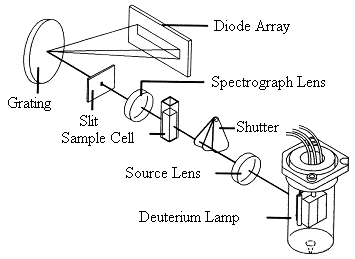
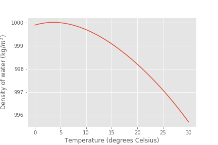

.. _title_Laboratory_Measurements_and_Procedures:

******************************************
Laboratory Measurements and Procedures
******************************************

.. _heading_Laboratory_Measurements_and_Procedures_Introduction:

Introduction
=============

Measurements of masses, volumes, and preparation of chemical solutions of known composition are essential laboratory skills. The goal of this exercise is to gain familiarity with these laboratory procedures. You will use these skills repeatedly throughout the semester.

.. _heading_Laboratory_Measurements_and_Procedures_Theory:

Theory
======

Many laboratory procedures require preparation of chemical solutions. Most chemical solutions are prepared on the basis of mass of solute per volume of solution (grams per liter or moles per liter). Preparation of these chemical solutions requires the ability to accurately measure both mass and volume.

Preparation of dilutions is also frequently required. Many analytical techniques require the preparation of known standards. Standards are generally prepared with concentrations similar to that of the samples being analyzed. In environmental work many of the analyses are for hazardous substances at very low concentrations (mg/L or �g/L levels). It is difficult to accurately weigh a few milligrams of a chemical with an analytical balance. Often dry chemicals are in crystalline or granular form with each crystal weighing several milligrams making it difficult to get close to the desired weight. Thus it is often easier to prepare a low concentration standard by diluting a higher concentration stock solution. For example, 100 mL of a 10 mg/L solution of NaCl could be obtained by first preparing a 1 g/L NaCl solution (100 mg in 100 mL). One mL of the 1 g/L stock solution would then be diluted to 100 mL to obtain a 10 mg/L solution.

Absorption spectroscopy is one analytical technique that can be used to measure the concentration of a compound. Solutions that are colored absorb light in the visible range. The resulting color of the solution is from the light that is transmitted. According to Beer's law the attenuation of light in a chemical solution is related to the concentration and the length of the path that the light passes through.

.. math::
    :label: eq_Fund_attenuation

    \log \left(\frac{P_o }{P} \right)=\varepsilon bc

where c is the concentration of the chemical species, b is the distance the light travels through the solution, :math:`\varepsilon` is a constant, :math:`P_o` is the intensity of the incident light, and :math:`P` is the intensity of the transmitted light. Absorption, A, is defined as:

.. math::
    :label: eq_Fund_Abs_of_attenuation

    A=\log \left(\frac{P_{o} }{P} \right)

In practice :math:`P_0` is the intensity of light through a reference sample (such as deionized water) and thus accounts for any losses in the walls of the sample chamber. From equation :eq:`eq_Fund_attenuation` and :eq:`eq_Fund_Abs_of_attenuation` it may be seen that absorption is directly proportional to the concentration of the chemical species.

.. math::
    :label: eq_Fund_Beer

    A=\varepsilon bc

.. _figure_Spectrophotometer:

    Diagram of light path in diode array spectrophotometer

One instrument you may use to measure absorbance is a Hewlett Packard (HP) model 8452A diode array spectrophotometer. The diode array spectrophotometer uses a broad-spectrum source of incident light from a deuterium lamp. The light passes through the sample, 1 cm path length, and is split by a grating into a spectrum of light that is measured by an array of diodes. Each diode measures a bandwidth of 2 nm with 316 diodes covering the range from 190 nm to 820 nm. The wavelengths of light and their colors are given in Table 2- #. The light path for the diode array spectrophotometer is shown in :numref:`figure_Spectrophotometer`.

The HP 8452A spectrophotometer has a photometric range of 0.002 - 3.3 absorbance units. In practice absorbance measurements greater than 2.5 are not very meaningful as they indicate that 99.7\% of the incident light at that wavelength was absorbed. Conversely, an absorbance of 0.002 means that 0.5\% of the incident light at that wavelength was absorbed.

.. _heading_Laboratory_Measurements_and_Procedures_Experimental_Objectives:

Experimental Objectives
=======================

To gain proficiency in:

 #. Calibrating and using electronic balances
 #. Using signal conditioning boxes and data acquisition software
 #. Digital pipetting
 #. Preparing a solution of known concentration
 #. Preparing dilutions
 #. Measuring concentrations using a UV-Vis spectrophotometer

.. _heading_Laboratory_Measurements_and_Procedures_Experimental_Methods:

Experimental Methods
====================

Mass Measurements
-----------------

Mass can be accurately measured with an electronic analytical balance. Perhaps because balances are so easy to use it is easy to forget that they should be calibrated on a regular basis. It is recommended that balances be calibrated once a week, after the balance has been moved, or if excessive temperature variations have occurred. In order for balances to operate correctly they also need to be level. Most balances come with a bubble level and adjustable feet. Before calibrating a balance verify that the balance is level.

The environmental laboratory is equipped with 200 g balances.  As part of this exercise, we will calibrate the 200 g as follows:

 #. Start with the balance off.
 #. Press and hold the ON/ZERO key until the screen reads 'MENU'.
 #. Releasing the ON/ZERO key will take you to calibration mode indicated by '.C.A.L.' on the screen.
 #. Press the ON/ZERO key to indicate 'Yes' to calibration.
 #. The balance will acquire the zero value (and read -- C -).
 #. Once the zero value is obtained, the balance screen will blink -- 200 g -- indicating that the 200 g mass will be used for the calibration.
 #. Place the 200 g calibration mass on the pan (handle the calibration mass using a cotton glove or tissue paper) and press ON/ZERO key.
 #. The balance will calibrate to the mass added. Remove the mass when the screen reads '200.00 g' indicating the calibration is complete.
 #. Measure the mass of a second calibration mass of different size (e.g., 100 g) to confirm calibration.
 #. Record relevant data in the attached spreadsheet.

Dry chemicals can be weighed in disposable plastic "weighing boats" or other suitable containers. It is often desirable to subtract the weight of the container in which the chemical is being weighed. The weight of the chemical can be obtained either by weighing the container first and then subtracting, or by "zeroing" the balance with the container on the balance.

Temperature Measurement and ProCoDA
-----------------------------------

We will use a data acquisition system designed and fabricated in CEE at Cornell University. Each group has their own ProCoDA box and associated power supply and USB cable. The power supply and USB cable must be plugged into the ProCoDA box and then into the AC power on your lab bench and a USB port on your lab bench computer, respectively.

Use a thermistor to measure the temperature of distilled water. The thermistors are usually hanging on the rack to the right of the fume hoods (you should have one on your bench today). The thermistor has a 4-mm diameter metallic probe. Plug the thermistor into the red signal-conditioning box. The conditioned signal is connected to the ProCoDA box using a red cable. Connect the red cable to one of the sensor ports on the top row of the ProCoDA box.

 #. Open ProCoDA II and :ref:`configure temperature monitoring <heading_ProCoDA_Temperature_Measurement>`
 #. Place the temperature probe in a 100-mL plastic beaker full of distilled water. Wait at least 15 seconds to allow the probe to equilibrate with the solution.
 #. Record this temperature in the attached spreadsheet.

Pipette Technique
-----------------

 #. Use Figure 2-2 to estimate the mass of 990 :math:`\mu L` of distilled water (at the measured temperature).
 #. Use a 100-1000 :math:`\mu L` digital pipette to transfer 990 :math:`\mu L` of distilled water to a tared weighing boat on either the AdventurerPro or Galaxy analytical balance. Record the mass of the water and compare with the expected value (Figure 2-2). Repeat this step if necessary until your pipetting error is less than 2\%, then measure the mass of 5 replicate 990 :math:`\mu L` pipette samples. Calculate the mean (:math:`\bar{x}`), standard deviation (s), and coefficient of variation, :math:`\frac{s}{\bar{x}}`, for your measurements. The coefficient of variation (c.v.) is a good measure of the precision of your technique. For this test a c.v. :math:`\mathrm{<}`1\% should be achievable.

Measure Density
---------------

.. code:: python

    """ importing """
    from aide_design.play import*
    Temp = np.linspace(0,30)*u.degC
    density = pc.density_water(Temp)
    fig, ax = plt.subplots()
    ax.plot(Temp,density)
    ax.set(xlabel='Temperature (degrees Celsius)', ylabel=r'Density of water (kg/$m^3$)')
    fig.savefig('Laboratory_Measurements/Images/Density_vs_T')
    plt.show()

.. _figure_Density_vs_T:

    Density of water vs. temperature.

 #. Weigh a 100 mL volumetric flask with its cap (use 200 g balance with resolution of 0.001 g}.
 #. Prepare 100 mL of a 1 M solution of sodium chloride in the weighed flask. You can also dissolve the NaCl in a clean beaker and transfer to the volumetric flask.  Make sure to mix the solution and then verify that you have **exactly 100 mL** of solution. Note that the combined **volume of NaCl and water decreases** as the salt dissolves.
 #. Weigh the flask (with its cap) plus the sodium chloride solution and calculate the density of the 1 M NaCl solution.

Prepare red dye standards of several concentrations
---------------------------------------------------

 #. A red dye stock solution of 1 g/L has been prepared. Use it to prepare 100 mL of each of the following concentrations: 1 mg/L, 2 mg/L, 3 mg/L, 4 mg/L, and 5 mg/L.  Record your calculations in the attached spreadsheet.
 #. Note any errors in transfer of mass as you prepare these dilutions (the color will make it easy to see).

Measure a standard curve and an unknown
---------------------------------------

 .. todo:: need to create a method here!

One method would be to connect a 50 mL syringe to the top outlet of the photometer and a 15 cm length of 1/4" OD tubing to the inlet of the photometer. Then use the syringe to pull a sample from a volumetric flask into the photometer.

.. _heading_Laboratory_Measurements_and_Procedures_Pre-Laboratory_Questions:

Pre-Laboratory Questions
========================

 #. You need 100 mL of a 1 :math:`\mu M` solution of zinc that you will use as a standard to calibrate an atomic adsorption spectrophotometer. Find a source of zinc ions combined either with chloride or nitrate (you can use the internet or any other source of information). What is the molecular formula of the compound that you found? Zinc disposal down the sanitary sewer is restricted at Cornell and the solutions you prepare may need to be disposed of as hazardous waste. As an environmental engineering student you strive to minimize waste production. How would you prepare this standard using techniques readily available in the environmental laboratory so that you minimize the production of solutions that you don't need? Note that we have pipettes that can dispense volumes between 10 :math:`\mu L` and 1 mL and that we have 100 mL and 1 L volumetric flasks. Include enough information so that you could prepare the standard without doing any additional calculations. Consider your ability to accurately weigh small masses. Explain your procedure for any dilutions. Note that the stock solution concentration should be an easy multiple of your desired solution concentration so you don't have to attempt to pipette a volume that the digital pipettes can't be set for such as 13.6 :math:`\mu L`.
 #. The density of sodium chloride solutions as a function of concentration is approximately :math:`0.6985C + \rho_{water}`. What is the density of a 1 M solution of sodium chloride?

.. _heading_Laboratory_Measurements_and_Procedures_Data_Analysis_and_Questions:

Data Analysis and Questions
===========================

Submit one spreadsheet containing the data sheet, exported absorbance data, graphs and answers to the questions.

 #. Fill out the Excel data sheet available from the course syllabus. Make sure that all calculated values are entered in the spreadsheet as equations. Failure to use the spreadsheet to do the calculations will not receive full credit. Note that this is likely the only assignment that we will do using Excel. All remaining analysis for the course will be done in Atom using Python!
 #. Create a graph of absorbance vs. concentration of red dye #40 in Atom using the exported data file. Does absorbance increase linearly with concentration of the red dye?
 #. What is the value of the extinction coefficient, :math:`\varepsilon`?
 #. Did you use interpolation or extrapolation to get the concentration of the unknown?
 #. What measurement controls the accuracy of the density measurement for the NaCl solution?
 #. What density did you expect (see prelab 2)?
 #. Approximately what should the accuracy be?
 #. Don't forget to write a brief paragraph on conclusions and on suggestions using Markdown.
 #. Verify that your report and graphs meet the requirements as outlined in the course materials.

.. _heading_Laboratory_Measurements_and_Procedures_Lab_Prep_Notes:

Lab Prep Notes
==============

.. _heading_Laboratory_Measurements_and_Procedures_Setup:

Setup
=====
 #. Prepare stock red dye #40 solution and distribute to student workstations in 20 mL vials.
 #. Prepare 1 L of unknown in concentration range of standards. Divide into six 150 mL bottles (one for each student bench (teams/2)).
 #. Verify that spectrophotometers are working (prepare a calibration curve as a test).
 #. Verify that balances calibrate easily.
 #. Disassemble, clean, and lubricate all pipettes.
