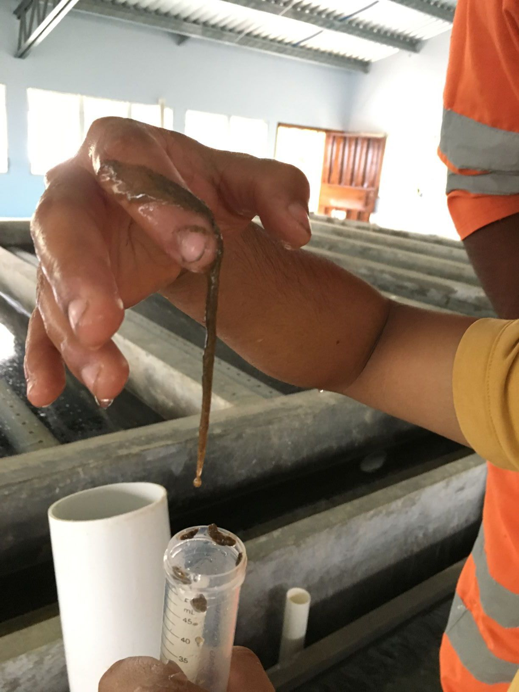

.. raw:: html

    <embed>
       <link rel="canonical" href="https://aguaclara.github.io/Textbook/Operation/Troubleshooting.html" />
       
    </embed>

.. _title_Flocculation_Model:

*****************************************
Plant Operation Troubleshooting
*****************************************

.. note:: Can we make some sort of a diagnostic guide based on symptoms? Make the following into a giant table.

Calcium from calcium hypochlorite combines with carbonate in the water to form low solubility calcium carbonate.

Drip chlorine into water rather than injecting it to eliminate formation of precipitate at the injection point

Use valves at the end of the pipeline to control transmission line flow rate rather than upstream control. Review the transmission line to ensure that all sections of the line have flow controlled by limiting available driving head. Air entrainment occurs when the available head exceeds the head required to transmit the target flow.

.. note:: create a troubleshooting guide that is hierarchical that covers multiple symptoms and then narrows down again to the potential solutions.

.. _table_Troubleshooting:

.. csv-table:: Table of symptoms, problems, and solutions for AguaClara plant operation.
   :header: "Observation", "Problem", "Solution"
   :align: left

   Air bubbles, Air entrainment in the transmission line and transport to a high pressure zone in the pipeline where the air is dissolved in the water, Use downstream head loss to prevent air entrainment in transmission line or add a unit process (TBD) that removes excess dissolved air
   Bubbles in clarifiers, Anaerobic production in methane in settled sludge, Clean clarifier and check design to eliminate all settled sludge
   Bubbles in EStaRS, Water entering the plant is supersaturated with air and EStaRS filters operate at very low pressure (compared with OStaRS), Eliminate air entrainment in transmission line
   Short filter runtimes, Poor performance of floc/sed system or clogged slotted pipes or air lock, Various solutions
   Gradual increase in post backwash head loss in filters, Slotted pipes are clogging, Acid flush by pouring HCl (need the concentration) into the outlet pipes OR disassemble filter and clean with a pressure washer
   Scale deposition in the distribution system, Increase in temperature from groundwater conditions causes supersaturation of calcium carbonate, Reduce the pH of the water slightly (perhaps 0.5 pH units) to eliminate the supersaturation
   Clogging of chlorination system tubes and formation of precipitate at the injection point, Dissolution of carbon dioxide from the atmosphere causes precipitation of calcium carbonate, Reduce exposure of the solution to the atmosphere OR drip the chlorine into the filtered water

High Head Loss After Backwash in EStaRS
=======================================

The 60 cm diameter EStaRS filters at El PODA had a very high head loss of 43 cm within a few minutes of ending backwash. The maximum available head is only 50 cm and thus filter runs lasted only a few hours. El PODA was the 2nd site where 60 cm diameter EStaRS filters were used. Given that the filter backwashed just fine without excess head required it appeared that the inlet system was performing as expected and did not have excessive head loss.

The key insight was that the top two layers of sand stopped producing filter water soon after beginning a filter run. A complete stoppage means that clogging ISN'T the issue! Clogging would decrease the flow rate, but it wouldn't stop flow because the clogging would have to be absolute to stop the flow.

The failure was that the water traveling horizontally in the branches and trunk carries air bubbles to the vertically downward flowing pipe (see a photo here). The air accumulates in that pipe and the water falls through the air losing energy like a waterfall. Water completely stops flowing through the layers of the filter that exit through that trunk line when the height of the air is equal to the available energy driving water through the StaRS filter.

There are two improvements required at El PODA. First, the transmission line must be operated with downstream flow control to prevent air entrapment and compression. That will likely be sufficient to solve the problem of air in the filters. The second improvement is to add manual air release valves to the top of each of the trunk lines so that operates can expel air during filtration. Note that these air vents must have a valve that is closed during backwash because the filter is under negative pressure during backwash and would suck air into the filter through those vents if they were open.

EStaRS with the wing inlets make a possible failure mode. At the end of the backwash if the operator closes the valve in the siphon quickly, the water pressure rises quickly inside the filter. When the water rises in the three entry passages it is possible that the water carries the sand inside the branches with wings. And once there is sand inside the pipes, this sand may hinder the flow of water during the filter run.

The solution is in the operation of the system and maybe a change in the design. If the operators are manipulating pipe stubs to do the backwash, then the first step is to remove the pipe stubs before closing the valve. The other way around the problem would be to close the valve slowly to ensure that the water rises very slowly in the inlets.

Encrustation of Filter Pipes at Las Vegas
=========================================

Remove the encrustation without disassembling the filter by pouring buckets of hydrochloric acid into pipes that are inserted into the couplings in the filtered water effluent box. The hydrochloric acid at Las Vegas is a 10% solution. Dilute that solution by a factor of 5 to produce a 2% HCl solution. Note that all of the acid and water injected into the filter will simply go into the filter box and increase the water level during this treatment. When diluting acid always add acid to water!
 #. Insert pipe stubs into the couplings in the filter inlet box to prevent any water from flowing through the filter
 #. Remove the drain pipe stub so that any effluent from the filter goes to drain
 #. Insert pipe stubs into the couplings in the filtered water effluent box
 #. Fill a 20 L bucket with 16 L of water (mark the bucket level!)
 #. Pour 4 L of 10% HCl into the bucket to reach a total of 20 L
 #. Mix the diluted acid with a PVC pipe for a couple of minutes
 #. Pour the 20 L of 2% HCl into the bottom outlet of the filter
 #. Wait 5 minutes
 #. Repeat previous 2 steps 5 times to pour a total of 100 L of acid into the bottom outlet pipe (note that the goal is for this total volume to exceed the outlet pipe, trunk, and branch pipes volume)
 #. Pour 20 L of water into the bottom outlet pipe
 #. Wait 5 minutes
 #. Repeat previous 2 steps 5 times to push all (or at least most) of the acid through the outlet pipes and into the sand bed

Repeat steps 3 to 12 for the middle outlet pipe and then for the top outlet pipe.

With each addition of acid or water there should be a fresh batch of carbon dioxide bubbles released from the filter.

Turn the filter back on and dump all water to waste for at least 5 minutes and until the turbidity is less than 1 NTU.

Slime at Las Vegas
==================
Iron bacteria slime showed up with application of hydrochloric acid at Las Vegas. The acid was needed to slightly reduce the pH to reduce the amount of encrustation in the distribution system. The addition of acid was correlated with the growth of a slime in the flocculator and clarifiers. It was hypothesized that this slime was iron oxidizing bacteria (see :numref:`figure_Las_Vegas_Slime`).

.. _figure_Las_Vegas_Slime:

   The slime at Las Vegas showed up in the flocculator and clarifiers.

Iron oxidizing bacteria need oxygen and reduced iron. The Las Vegas water source is a stream that is clearly groundwater given its propensity to deposit calcium carbonate on everything in the stream. Thus the stream water is likely poor in oxygen.

We are adding oxygen at the LFOM. That oxygen can chemically oxidize the iron, but the rate of oxidation is a function of pH (see :numref:`figure_Oxygenation_vs_time`). When we decrease the pH it slows the oxidation of iron and thus keeps a higher concentration of reduced iron available for bacteria to oxidize. Thus the LFOM adds oxygen needed by the iron oxidizing bacteria and the acid prevents the iron from being chemically oxidized.

`The rate of iron oxidation is strongly pH dependent <https://njaes.rutgers.edu/pubs/fs516/>`_
At pH 7.0, 90% Fe+2 oxidation requires 1 hour at 21°C and 10 hours at 5°C.
At pH 8.0, 90% Fe+2 oxidation occurs in 30 seconds.
At pH 6.0 it requires 100 hours.

.. _figure_Oxygenation_vs_time:

.. figure:: ../Images/Oxygenation_vs_time.png
   :width: 400px
   :align: center
   :alt: Oxygenation_vs_time

   The time required for oxidation is strongly dependent on pH. From `Lenntech <http://www.lenntech.com/iron-bacteria.htm>`_.

For several reasons, routine chemical disinfectants that effectively wipe out other bacteria are only modestly successful against iron bacteria. Iron bacteria build up in thick layers, each forming a slime around bacterial cells that keeps disinfectants from penetrating beyond the surface cells. Chemical reactions occur far slower at the cool temperatures common in wells, and bacterial cell need a long exposure to the chemical for the treatment to be effective. Even if chlorine kills all the bacterial cells in the water, those in the groundwater can be drawn in by pumping or drift back into the well. `Read more about chlorine and iron oxidizing bacteria <http://www.lenntech.com/iron-bacteria.htm#ixzz4ehUFJwO6>`_

Iron Oxidizing Slime Bacteria
-------------------------------------------------------------

The solutions all revolve around oxidizing the iron chemically before the bacteria have a chance to oxidize the iron biologically.
 - Move the acid addition point to the end of the plant. This will allow chemical oxidation and removal of the iron. Note that once the iron is oxidized it precipitates as :math:`Fe(OH)_3` and that is a wonderful coagulant. This is why the Las Vegas plant was shown to produce clean water even without addition of a coagulant!
 - It might be possible to move the acid addition point to the exit of the flocculator if the flocculation process provides enough time for iron oxidation
 - Create an aeration system upstream from the plant in the transmission line
 - Move chlorination to the rapid mix. This might work, but given the chlorine resistance of the slime and the disadvantages of prechlorination for production of disinfection by-products, we don't recommend this.

Floc Volcanoes
==============

Floc volcanoes occur when water and flocs rise preferentially in one part of the clarifier. At points of high velocity, flocs can rise to the surface of the water. Consider the following case: an AguaClara plant in San Nicolas, Honduras, was witnessing intermittent floc volcanoes in the clarifiers. During operation, the plant was treating raw water with 4 NTU with a PACl dose of 3.5 mg/L. The settled water turbidity varied between 0.5 and 4 NTU. What might explain the floc volcanoes and very poor plant performance? Try coming up with a hypothesis that matches the information given to us from the plant. We want to figure out what is causing this problem so we can design a solution. What questions would you want to ask the technicians or engineers in Honduras? This exercise emphasizes the idea that asking the right questions are sometimes the hardest first step to learning more information.

Some hypotheses and questions may include:

1) Is the problem related to dissolved air flotation? Dissolved air coming out of flocculation can cause flocs to float to the top.

After asking the operators, we are told that there are not any bubbles in the clarifier.

2) Is the problem regularly intermittent? Is there anything that we can correlate these fluctuations to?

After asking the operators, we are told that the floc volcanoes appear in the early afternoon each day.

.. _figure_temp_turbidity:

.. figure:: ../Images/temp_turbidity.png
    :height: 300px
    :align: center
    :alt: Turbidity as a function of time in San Nicolas, Honduras.

    Turbidity as a function of time in San Nicolas, Honduras.

Using this new information, we have to make another hypothesis about why the floc volcanoes are impacted daily. Perhaps it is related to the sun and daily temperature changes. We can ask the operators to measure the water temperatures so we can do some analysis. The operators measure temperature and we plot the results, providing the following graph.

We know that this plant brings water from a water source about 14 km away. The water is transported in a galvanized iron pipe that is placed on the surface of the ground because there is no concern about freezing pipes in Honduras (galvanized iron is not damaged by UV like PVC pipe is). The pipe functions as a 14 km water heater, raising the temperature of the water to the plant after noon.

But why does the temperature difference cause a problem for the plate settlers?
The problem is that there is warmer water entering the clarifier than what is in it. This temperature difference causes a density difference in the clarifier and plate settlers. The less dense, warmer water rises to the top of the plate settlers while the cold water drops to the bottom of the plate. This creates a current, allowing water to flow up on the top and settle on the bottom. The temperature gradient changes slowly over a few hours.

.. _figure_temp_tube_settler:

.. figure:: ../Images/temp_tube_settler.png
    :height: 300px
    :align: center
    :alt: Hot water rising and cold water settling in a tube settler.

    Hot water rising and cold water settling in a tube settler.

So, now that we think we know what the problem is, how would we try to solve it? One idea would be to paint the entire line to reflect heat, but this is not feasible due to cost. The town Water Board had been maintaining the distribution line by cleaning weeds and brush from the pipe. The solution ended up being to just let the weeds grow over the pipe to provide shade. We haven't yet come up with a real solution. A possible long-term solution could be to design a clarifier that has a really short residence time. The longer the residence time in the clarifier, the worse the problem is because there is a large variation between the water that entered it last night and the water that enters it this afternoon. A tank with a really short residence time, on the order of a few minutes, would ensure that the water coming in would be very close to the water already in the tank.
