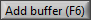
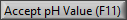
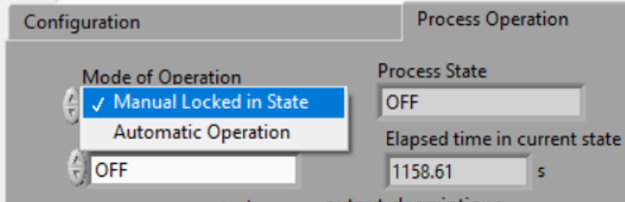

.. _title_ProCoDA:

*********************************************
ProCoDA: Process Control and Data Acquisition
*********************************************

.. |ProCoDA_ports| image:: Images/ProCoDA_ports.png

The hardware consists of box with a National Instruments data acquisition board that connects to the computer via a USB port. The box has 12 ports.
|ProCoDA_ports|

 #. pump 0 and 1: Ports that control on/off, direction, and speed of peristaltic pumps. The on/off and direction controls are based on digital outputs from the data acquisition board. The speed control uses an analog output from the data acquisition board that is converted into a 4-20 mA signal.
 #. sensor 0 to 3 measure voltages from sensors. The ports also contain +5V, -5V, +10V, +15V, -15V power supplies that are used to power sensors (pressure, photometer) or is used to power signal conditioning circuits that are required by some sensors (pH, dissolved oxygen, temperature, photometer).
 #. 24V 2 to 7 provide 24 volt outputs that can be used to power solenoid valves or relays that can then power larger electrical loads.

 It is critical that users of ProCoDA understand the distinction between inputs and outputs. The pump and 24V ports are all outputs. They control devices. The sensor ports are inputs that are used to measure. Don't plug sensors into outputs! Don't plug pumps into 24 volt ports or into sensors! Don't plug solenoid valves into pump or sensor ports! Easy right!

The software combines 3 elements: sensors (inputs from the real world), set points (inputs from the plant operator and calculated values based on sensors and other set points), and logic (rules that govern how the plant should operate given the sensor data and set points). The software contains a graphical user interface where you can edit, save, and open files containing sensor information and files containing the set point and logic information.

Configure
=========

.. |config_calibrate_pump| image:: Images/config_calibrate_pump.png

.. |config_edit_rules| image:: Images/config_edit_rules.png

.. |Config_open_save_export| image:: Images/Config_open_save_export.png

.. |config_select_daq| image:: Images/config_select_daq.png

The configure tap of ProCoDA is used to select the
|config_select_daq|
|config_DAQ|
|config_samples_per_read|

|config_calibrate_pump|
|config_data_state_log|
|config_edit_rules|
|config_Logging_data_short_exp|
|Config_open_save_export|
|config_share_data|

|config_sensors|

|config_calibrate_pump|

.. _heading_ProCoDA_Sensors:

Sensors
=======

.. |sensor_edit_calibration| image:: Images/sensor_edit_calibration.png
.. |sensor_insert| image:: Images/sensor_insert.png
.. |sensor_linear_offsets| image:: Images/sensor_linear_offsets.png
.. |sensor_no_range_error| image:: Images/sensor_no_range_error.png
.. |sensor_open_calibration_file| image:: Images/sensor_open_calibration_file.png
.. |sensor_pH| image:: Images/sensor_pH.png

.. |sensor_set_to_value| image:: Images/sensor_set_to_value.png
.. |sensor_set_to_zero| image:: Images/sensor_set_to_zero.png
.. |sensor_channels| image:: Images/sensor_channels.png

|sensor_copy| |sensor_delete| |sensor_insert|
|sensor_channels|

|sensor_linear_offsets|
|sensor_set_to_value|
|sensor_set_to_zero|
|sensor_clear_offsets|

|sensor_edit_calibration|

|sensor_no_range_error| |sensor_range_error|

|sensor_save_calibration_file|

|sensor_DO|

|sensor_photometer|
|sensor_position_system|

.. _heading_ProCoDA_Temperature_Measurement:

Temperature Measurement
-----------------------

Temperature measurements are made with a probe that produces a linear voltage response.

#. Navigate to the Configuration tab
#. Click the |config_sensors| button to select and configure your sensor (thermistor).
#. Click |sensor_insert| to add a sensor to your list.
#. Now you need to tell the software where your sensor is plugged in.  In the |sensor_channels| pull-down menu, select the address of your sensor.  All addresses begin with a Dev/ai prefix. The number in the address refers to the number on thd
#. Finally, you need to tell the software to convert the signal into temperature units.  This is done with a calibration file.  Click |sensor_open_calibration_file| and select the calibration file named thermistor.smc.
#. You should now be reading temperature in units of degrees Celsius. Verify that you are monitoring the correct temperature probe by holding the temperature probe in your hand and warming it up.  Does the temperature reading respond?

.. _heading_ProCoDA_pH_Measurement:

pH Measurement |sensor_pH|
--------------------------

.. |pH_clear_buffers| image:: Images/pH_clear_buffers.png
.. |pH_controls| image:: Images/pH_controls.png
.. |pH_edit_buffers| image:: Images/pH_edit_buffers.png

pH measurements require calibration in known buffers.

 #. Open the ProCoDA II software.
 #. Navigate to the Configuration tab and select the |config_sensors| button.
 #. Insert a new sensor at the bottom of the sensor list using the |sensor_insert| button.
 #. Select the appropriate channel based on in which sensor port you plugged you pH probe.
 #. Select |sensor_pH|.
 #. The pH probe should never be dry and is therefore stored with a small vial of pH 4.0 buffer screwed onto the tip.  Unscrew the storage vial cap and place the vial in a place where it will not be tipped over (the cap can stay on the probe).
 #. Rinse the pH probe with DI water (use a squeeze bottle) into a beaker.
 #. To calibrate the pH probe, we will use three pH buffer solutions with known pH (red=4.0, yellow=7.0, and blue=10.0).  After rinsing the pH probe, place it into the pH=4.0 buffer.  Stir gently and wait for the pH reading on the software to stabilize.  Once stabilized, press the |pH_add_buffer| button.  Rinse the pH probe with DI water and repeat for the pH=7.0 and pH=10.0 buffer solutions.
 #. When you have tested all calibration buffers, hit, OK. And OK again.

The |pH_add_buffer| option is used if you have additional buffers that you want to use to calibrate a pH probe. The list of buffers can also be cleared, |pH_clear_buffers|, and recreated by adding new buffers.

.. _heading_ProCoDA_Gran_Plot:

Gran Plot
---------

.. |Gran_change_increment| image:: Images/Gran_change_increment.png
.. |Gran_end_titration| image:: Images/Gran_end_titration.png
.. |Gran_get_titration_values| image:: Images/Gran_get_titration_values.png
.. |Gran_incremental_titrant| image:: Images/Gran_incremental_titrant.png

The Gran plot is used to measure the acid neutralizing capacity or the alkalinity of a water sample.

 #. Open the ProCoDA II software.
 #. navigate to configuration, select |config_sensors|, select |sensor_pH|, and click on |Gran_start|.
 #. You will be prompted for the normality of titrant and the volume of sample.  You can also choose to measure ANC (acid neutralizing capacity) or BNC (base neutralizing capacity). If you are measuring BNC you will need to titrate with a strong base. After entering the normality of acid (or base) and the sample volume the computer will suggest an incremental volume of titrant that will produce a good Gran plot. Smaller incremental titrant volumes can be used, but will require more time to titrate the sample. After entering the values, exit the dialog box by clicking on the OK button. It will look like this:
 |Get_titration_values|
 #. The Gran Plot analysis uses 3 controls: |Incremental_titrant|, |Accept_pH_value|, and |End_titration|. The "incremental titrant added" is the amount of acid added since the previous time the |Accept_pH_value| button was clicked. For the first data point if no titrant was added the "incremental titrant added" should be set to zero. For subsequent readings, change the incremental titrant added to the volume you are adding, add the titrant with a digital pipette, wait for the pH to stabilize and then click on |Accept_pH_value|. Any amount of titrant can be added at each step, but it is important that below pH 5 the titrant volumes be smaller than the recommended value so that sufficient data points are obtained in the linear region.
 #. There is no way to delete unwanted data points after they are accepted. Therefore, make sure you only press the enter button once after each addition of titrant.
 #. Continue adding titrant until a line is fit through the linear region of the data. When the line is drawn through the linear region press |End_titration|. Note that |End_titration| accepts the last data point and ends the titration. |End_titration| is pressed after the last addition of acid INSTEAD of pressing |Accept_pH_value|}!
 #. The equivalent volume (:math:`V_e`) is given in the same units as were used for the titrant and sample volumes. The equivalent volume is the abscissa intercept of the line fit to the data in the region of constant slope. The ANC is given in equivalents per liter.
 #. If desired the titration data can be saved in a format that can be read by spreadsheet programs by selecting  |Save_gran|. You will be prompted for a file name and location.

.. _heading_ProCoDA_Dissolved_Oxygen:

Dissolved Oxygen
----------------

.. |DO_controls| image:: Images/DO_controls.png

.. |DO_set_to_saturation| image:: Images/DO_set_to_saturation.png
.. |DO_zero| image:: Images/DO_zero.png

When using the DO probe make sure that there *aren't any air bubbles* on the probe membrane. If you are aerating the sample place the probe as far from the air bubbles as possible. Air bubbles on the membrane will cause inaccurate readings.

 #. Connect a DO probe to one of the sensor ports on the ProCoDA box using the gold signal conditioning box.
 #. Navigate to the ProCoDA Configuration tab and select \includegraphics*[width=0.34in, height=0.34in, keepaspectratio=false]{image3} to configure the dissolved oxygen channel(s). Select the DO probe from the sensor list and point the channel to the correct sensor port.
 #. Use the dissolved oxygen calibration VI \includegraphics*[width=0.34in, height=0.34in, keepaspectratio=false]{image4} to calibrate the DO probe.
 #. Enter the temperature of the sample. This can be measured by using a thermistor or a thermometer. A good estimate is :math:`22^\circ C`.
 #. If you have typed in your location in the Configuration Tab, you can get the actual barometric pressure for Ithaca, New York by selecting \includegraphics*[width=1.89in, height=0.21in, keepaspectratio=false]{image5}
 #. Place the probe in oxygen saturated water (use the air jet on your bench to bubble air into water in a 4L container).  The voltage from the DO probe should be between 0.17 and 0.23 volts if the probe is working correctly. If the voltage is lower than 0.17 it may be time to replace the membrane or the solution may not be saturated with oxygen.
 #. Select \includegraphics*[width=1.12in, height=0.21in, keepaspectratio=false]{image6}to calibrate the DO sensor.
 #. Select OK \includegraphics*[width=0.91in, height=0.25in, keepaspectratio=false]{image7}when you are satisfied with the calibration.
 #. If desired you may save the calibration for later use \includegraphics*[width=0.25in, height=0.24in, keepaspectratio=false]{image8}. However, it is not necessary to save the calibration to use the calibration in the current session.~~If you want to save the calibration, save it in your Group folder on the S:/ drive.~~

Photometer
----------

.. |photometer_open_save_export| image:: Images/photometer_open_save_export.png
.. |photometer_read_blank| image:: Images/photometer_read_blank.png

.. _heading_ProCoDA_Meters:

Meters
======

 Turbidimeters, electronic balances, etc. that communicate with ProCoDA through a USB or serial port.

.. _heading_ProCoDA_Logging_Data:

Logging Data
============

Logic, States, and Outputs
==========================

Rule Editor
-----------

.. |Rules_Filter_logic| image:: Images/Rules_Filter_logic.png

A word of caution. The sensors, set points, and states are used within the rule editor. If new sensors, set points or states are added in the middle of their respective lists or deleted from their lists any rules that were created previously may be incorrect. The software does not attempt to correct for changes in the lists of set points and states. It is your responsibility to verify that all rules are correct when making changes to the configuration. You can minimize this problem by adding states, set points, and sensors at the end of their respective lists.

Set Points
----------

.. |SetPoints_pump_code_inputs| image:: Images/SetPoints_pump_code_inputs.png

.. |SetPoints_select_HF_modbus_rtu| image:: Images/SetPoints_select_HF_modbus_rtu.png

.. |SetPoints_turbidimeter_com_port| image:: Images/SetPoints_turbidimeter_com_port.png
.. |SetPoints_filter_example| image:: Images/SetPoints_filter_example.png

The rule editor provides a graphical user interface where the operator can completely configure the control logic for the plant. Begin by creating the set points for the process. Set points can include time, parameters that can be compared with sensor values, parameters that are required inputs for external code, and parameters that are outputs of external code. Set points that are outputs of external code are designated as variables. The only constraint on developing the list of set points is that set points that are inputs to external code must be in the same order (although they don't have to be adjacent) in the list of set points as they are expected by the external code.

When adding a new set point the name, value and unit of the set point can be edited in the Set Points control. The list of the Current set points functions as the index to the array of Set Points, thus allowing the operator to select and edit any of the set points. The unit field is not used by the process controller, but is a reminder for the operator. It is imperative that the units of the set points be the same as the units of the sensor data that they will be compared with.

When configuring a set point as a variable calculated by external code first load the code by clicking on the folder icon. If the code fails to load it is either because the external code doesn't have the correct connector pane or because the external code has sub VIs that aren't in the same folder as the external code. If the code loads correctly it will display the list of needed inputs at the bottom of the dialog box.

States
------

The list of states is created by adding new states and then naming the states in the Rules control. The states don't necessarily have to be listed in the order of the cycle. The first state should be the default off state. This state is used by the software as the default when the process is first turned on. The off state is also used as an emergency shutdown in case of a data acquisition failure.

The control output settings for each state indicate which set point is used to control that state. All set points used for control should be in the range of 0 to 1. Fractional values for the outputs 0 to 5 will cause the output to cycle and thus control the duty cycle. Fractional values for the pump speed will control the pump speed.

Rules
-----

The list of rules is created by adding new rules and then naming each rule in the Rules control. The rules are the logical comparisons that determine if the process should change to a new state. The logic for changing process state can include a requirement of meeting several conditions simultaneously (conditions that are "anded"). There may also be more than one rule that can cause the process to change state. These two options are incorporated into the rule editor. The "anded" rules have multiple conditions and multiple rules can be created that are essentially "ored".
|Rules_filter|
Rules that have multiple conditions that must be fulfilled simultaneously are created by increasing the number of conditions. Each conditional test will have its own logical comparison. An example of a completed rule containing two conditions is if the effluent turbidity exceeds regulations AND the time in the filtration state is greater than a minimum amount of time, then switch to backwash. Each logical comparison consists of a measured value (either a sensor value or the elapsed time in the current state) that can be selected from the drop down menu. The measured value is compared with a set point that can also be selected from a drop down menu. The type of comparison can either be less than or greater than.

Each rule can select which state the process should go to next. Thus it is possible that within the same state different rules would cause the process to change to different states. In the example here the "shut down" rule will end filtration if the clearwell is full.

The rules are implemented in the order indicated by the Current Rule control. If two rules would cause a state change at the same time, the first rule is used.

Outputs
-------

.. |Outputs_filter_waste| image:: Images/Outputs_filter_waste.png

Process Operation
=================

.. code:: python

   import os
   x=os.listdir('C:/Users/mw24/github/EnvEngLabTextbook/ProCoDA/Images')
   x
