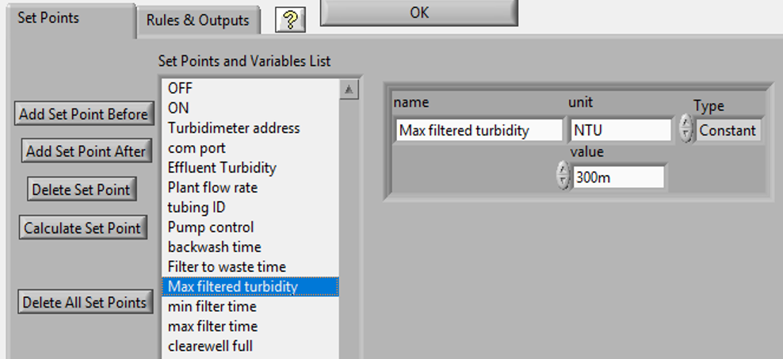

.. _title_ProCoDA:

*********************************************
ProCoDA: Process Control and Data Acquisition
*********************************************

The hardware consists of box with a National Instruments data acquisition board that connects to the computer via a USB port. The box has 12 ports.
|ProCoDA_ports|

 #. pump 0 and 1: Ports that control on/off, direction, and speed of peristaltic pumps. The on/off and direction controls are based on digital outputs from the data acquisition board. The speed control uses an analog output from the data acquisition board that is converted into a 4-20 mA signal.
 #. sensor 0 to 3 measure voltages from sensors. The ports also contain +5V, -5V, +10V, +15V, -15V power supplies that are used to power sensors (pressure, photometer) or is used to power signal conditioning circuits that are required by some sensors (pH, dissolved oxygen, temperature, photometer).
 #. 24V 2 to 7 provide 24 volt outputs that can be used to power solenoid valves or relays that can then power larger electrical loads.

 The distinction between **inputs and outputs** is **critical**. The pump and 24V ports are all outputs. They control devices. The sensor ports are inputs that are used to measure. Don't plug sensors into outputs! Don't plug pumps into 24 volt ports or into sensors! Don't plug solenoid valves into pump or sensor ports! Easy right!

The software combines 3 elements: sensors (inputs from the real world), set points (inputs from the plant operator and calculated values based on sensors and other set points), and logic (rules that govern how the plant should operate given the sensor data and set points). The software contains a graphical user interface where you can edit, save, and open files containing sensor information and files containing the set point and logic information.

.. _heading_ProCoDA_Configure:

Configure
=========

.. |config_DAQ| image:: Images/config_DAQ.png
.. |config_data_state_log| image:: Images/config_data_state_log.png

.. |config_Logging_data_short_exp| image:: Images/config_Logging_data_short_exp.png
.. |Config_open_save_export| image:: Images/Config_open_save_export.png
.. |config_samples_per_read| image:: Images/config_samples_per_read.png

.. |config_sensors| image:: Images/config_sensors.png
.. |config_share_data| image:: Images/config_share_data.png

The configure tab of ProCoDA is used to select the ProCoDA box that will be controlled by the software. It is possible to connect more than one ProCoDA box to a single computer and have multiple instances of the ProCoDA software running at the same time. But that is a capability that we haven't truly tested and most users want to control a single experiment with one ProCoDA box.

Select the |config_select_daq| to select the ProCoDA box and to configure the data acquisition.  |config_DAQ| The available analog input (AI) channels (for sensors) are displayed along with the maximum voltage that can be measured. Most of our sensors have an output voltage of less than 1 volt and thus the maximum voltage can be set to 1 volt. The exception is the photometer that has an output maximum voltage of 5 V.

ProCoDA keeps a small amount of data in memory at all time that can be used for making decisions. This is critical because sensors area always noisy and thus it is poor practice to make decisions based on instantaneous measurements. Instead we use an average of recent data and select the amount of averaging based on the requirements for the control system. The length (in seconds) of the data record that is available in the buffer is set by the size of the buffer and the rate of sampling. The highest rate of sampling is 2500 Hz. We recommend that sampling be as fast as possible and that data averaging be used to smooth the data.

Data averaging is implemented by pressing the spacebar and then editing the number of samples per read. In the example below we have set samples per read to 10. In this case the data is read at 250 Hz in 10 sample chunks. Each chunk of 10 samples is averaged on its way into the ProCoDA program. Thus the data is smoothed and results in less noisy signals.
|config_samples_per_read|

The ProCoDA circuitry that sets the peristaltic pump speed can be calibrated (in software) with |config_calibrate_pump|. This calibration ensures that the pump actually rotates at the speed set by ProCoDA. This calibration only needs to be done once for each pump that is controlled.

ProCoDA has the ability to access data from other ProCoDA software on other computers if there is a shared server where the data can be shared. This data sharing |config_share_data| makes it possible for multiple users to have access to data that is being logged at one location. In the AguaClara laboratory researchers can access the laboratory water temperature using this system. In the Environmental Engineering teaching laboratory this feature is used to enable all of the workstations to access the pressure of the air supply that is used for the gas transfer experiments.

.. _heading_ProCoDA_Methods:

Methods
-------

ProCoDA is highly configurable (it is after all, a friendly programming environment for laboratory automation) and those configurations or methods are saved in files. ProCoDA automatically saves ALL changes in configuration as they happen in C:\ProCoDA Data\ProCoDA 0.pcm where the integer refers to the instance of the ProCoDA software if multiple instances are being used. This method file is automatically loaded when ProCoDA is launched. Very occasionally ProCoDA crashes and creates a corrupted method file and thus refuses to launch properly. In that case simply delete this file.

Given that ProCoDA automatically saves the method file that means that any mistakes in editing are immediately saved as well. To safeguard against this ProCoDA also saves a copy of the method file in the folder location where the data is being logged. We recommend that copies of the ProCoDA method also be saved in a secure location by the researcher as a third level of safety. Use the |Config_open_save_export| buttons to save the current method, retrieve a method from file, or export the method in a tab delimited file in a human readable format.

.. _heading_ProCoDA_Sensors:

Sensors |config_sensors|
========================

.. |sensor_clear_offsets| image:: Images/sensor_clear_offsets.png
.. |sensor_copy| image:: Images/sensor_copy.png
.. |sensor_delete| image:: Images/sensor_delete.png
.. |sensor_DO| image:: Images/sensor_DO.png
.. |sensor_edit_calibration| image:: Images/sensor_edit_calibration.png

.. |sensor_linear_offsets| image:: Images/sensor_linear_offsets.png
.. |sensor_no_range_error| image:: Images/sensor_no_range_error.png
.. |sensor_open_calibration_file| image:: Images/sensor_open_calibration_file.png

.. |sensor_photometer| image:: Images/sensor_photometer.png
.. |sensor_position_system| image:: Images/sensor_position_system.png
.. |sensor_range_error| image:: Images/sensor_range_error.png
.. |sensor_save_calibration_file| image:: Images/sensor_save_calibration_file.png

.. |sensor_set_to_zero| image:: Images/sensor_set_to_zero.png

The sensor part of ProCoDA includes software that eliminates the need for pH meters, dissolved oxygen meters, temperature meters. A software interface for a single wavelength spectrophotometer is also included. Any sensor that has a voltage output can be monitored.

Add a sensor to the list of sensors by either inserting a new unconfigured sensor, |sensor_insert|, or by selecting a configured sensor that you want to duplicate, |sensor_copy|. The |sensor_copy| will automatically increment the channel that the sensors are connected to. You can always |sensor_delete| any channels that you don't want.

Each sensor must be connected to a sensor port |ProCoDA_ports| using
|sensor_channels|. Note that it is possible to monitor the same port more than once using ProCoDA. This would be useful if you wanted to simultaneously log both the raw voltage and a calibrated physical unit from the same sensor.

Sensor that have simple linear relationships between voltage and calibrated output can be easily adjusted |sensor_linear_offsets|. For example, a pressure sensor can be calibrated by setting its output to an independently measured value |sensor_set_to_value|. Or the pressure could be zeroed |sensor_set_to_zero| under conditions of no flow (if you are measuring head loss). The offsets can be cleared, |sensor_clear_offsets|, to return to the original uncalibrated sensor output.

The |sensor_edit_calibration| can be used to view how the voltage is being converted to a physical unit. This makes it possible to edit the conversion values and can be used to create conversion files for new sensors. New conversion files can be saved |sensor_save_calibration_file| for use later.

One of the failure modes with ProCoDA occurs when a sensor produces a voltage that is outside of the range |sensor_range_error| that was set when configuring the data acquisition board (see :ref:`<heading_ProCoDA_Configure>`). It is critical that the sensor voltage not be out of range. Sensors that are out of range provide useless data! Your goal is to see this |sensor_no_range_error|.

.. _heading_ProCoDA_Temperature_Measurement:

Temperature Measurement
-----------------------

Temperature measurements are made with a probe that produces a linear voltage response.

#. Navigate to the Configuration tab
#. Click the |config_sensors| button to select and configure your sensor (thermistor).
#. Click |sensor_insert| to add a sensor to your list.
#. Now you need to tell the software where your sensor is plugged in.  In the |sensor_channels| pull-down menu, select the address of your sensor.  All addresses begin with a Dev/ai prefix. The number in the address refers to the number on thd
#. Finally, you need to tell the software to convert the signal into temperature units.  This is done with a calibration file.  Click |sensor_open_calibration_file| and select the calibration file named thermistor.smc.
#. You should now be reading temperature in units of degrees Celsius. Verify that you are monitoring the correct temperature probe by holding the temperature probe in your hand and warming it up.  Does the temperature reading respond?

.. _heading_ProCoDA_pH_Measurement:

pH Measurement |sensor_pH|
--------------------------

.. |pH_add_buffer| image:: Images/pH_add_buffer.png
.. |pH_clear_buffers| image:: Images/pH_clear_buffers.png

pH measurements require calibration in known buffers.

 #. Open the ProCoDA II software.
 #. Navigate to the Configuration tab and select the |config_sensors| button.
 #. Insert a new sensor at the bottom of the sensor list using the |sensor_insert| button.
 #. Select the appropriate channel based on in which sensor port you plugged you pH probe.
 #. Select |sensor_pH|.
 #. The pH probe should never be dry and is therefore stored with a small vial of pH 4.0 buffer screwed onto the tip.  Unscrew the storage vial cap and place the vial in a place where it will not be tipped over (the cap can stay on the probe).
 #. Rinse the pH probe with DI water (use a squeeze bottle) into a beaker.
 #. To calibrate the pH probe, we will use three pH buffer solutions with known pH (red=4.0, yellow=7.0, and blue=10.0).  After rinsing the pH probe, place it into the pH=4.0 buffer.  Stir gently and wait for the pH reading on the software to stabilize.  Once stabilized, press the |pH_add_buffer| button.  Rinse the pH probe with DI water and repeat for the pH=7.0 and pH=10.0 buffer solutions.
 #. When you have tested all calibration buffers, click, OK to exit |sensor_pH|. Click OK again to exit |config_sensors|.

The |pH_add_buffer| option is used if you have additional buffers that you want to use to calibrate a pH probe. The list of buffers can also be cleared, |pH_clear_buffers|, and recreated by adding new buffers.

.. _heading_ProCoDA_Gran_Plot:

Gran Plot
---------

.. |Gran_accept_pH| image:: Images/Gran_accept_pH.png
.. |Gran_change_increment| image:: Images/Gran_change_increment.png
.. |Gran_end_titration| image:: Images/Gran_end_titration.png
.. |Gran_get_titration_values| image:: Images/Gran_get_titration_values.png

.. |Gran_save| image:: Images/Gran_save.png
.. |Gran_start| image:: Images/Gran_start.png

The Gran plot is used to measure the acid neutralizing capacity or the alkalinity of a water sample.

 #. Open the ProCoDA II software.
 #. navigate to configuration, select |config_sensors|, select |sensor_pH|, and click on |Gran_start|.
 #. You will be prompted for the normality of titrant and the volume of sample.  You can also choose to measure ANC (acid neutralizing capacity) or BNC (base neutralizing capacity). If you are measuring BNC you will need to titrate with a strong base. After entering the normality of acid (or base) and the sample volume the computer will suggest an incremental volume of titrant that will produce a good Gran plot. Smaller incremental titrant volumes can be used, but will require more time to titrate the sample. After entering the values, exit the dialog box by clicking on the OK button. It will look like this: |Gran_get_titration_values|
 #. The Gran Plot analysis uses 3 controls: |Gran_incremental_titrant|, |Gran_accept_pH|, and |Gran_end_titration|. The "incremental titrant added" |Gran_incremental_titrant| is the amount of acid added since the previous time the |Gran_accept_pH| button was clicked. For the first data point if no titrant was added the "incremental titrant added" should be set to zero. For subsequent readings, change the incremental titrant added to the volume you are adding, add the titrant with a digital pipette, wait for the pH to stabilize and then click on |Gran_accept_pH|. Any amount of titrant can be added at each step, but it is important that below pH 5 the titrant volumes be smaller than the recommended value so that sufficient data points are obtained in the linear region.
 #. There is no way to delete unwanted data points after they are accepted. Therefore, make sure you only press the enter button once after each addition of titrant.
 #. Continue adding titrant until a line is fit through the linear region of the data. When the line is drawn through the linear region press |Gran_end_titration|. Note that |Gran_end_titration| accepts the last data point and ends the titration. |Gran_end_titration| is pressed after the last addition of acid INSTEAD of pressing |Gran_accept_pH|!
 #. The equivalent volume (:math:`V_e`) is given in the same units as were used for the titrant and sample volumes. The equivalent volume is the abscissa intercept of the line fit to the data in the region of constant slope. The ANC is given in equivalents per liter.
 #. If desired the titration data can be saved in tab delimited format by selecting  |Gran_save|. You will be prompted for a file name and location.

.. _heading_ProCoDA_Dissolved_Oxygen:

Dissolved Oxygen |sensor_DO|
----------------------------

.. |DO_controls| image:: Images/DO_controls.png
.. |DO_set_barometric| image:: Images/DO_set_barometric.png

.. |DO_zero| image:: Images/DO_zero.png

When using the DO probe make sure that there *aren't any air bubbles* on the probe membrane. If you are aerating the sample place the probe as far from the air bubbles as possible. Air bubbles on the membrane will cause inaccurate readings.

 #. Connect a DO probe to one of the sensor ports on the ProCoDA box using the gold signal conditioning box.
 #. Navigate to the ProCoDA Configuration tab and select |config_sensors| to configure the dissolved oxygen channel(s).
 #. **Select the DO probe from the sensor list** (This is important! Otherwise you will turn a different sensor into a DO probe!) and point the channel to the correct sensor port.
 #. Click on |sensor_DO| to calibrate the DO probe.
 #. Enter the temperature of the sample. This can be measured by using a thermistor or a thermometer. A good estimate is :math:`22^\circ C`. If you have a thermistor connected to ProCoDA you can configure the oxygen probe to incorporate continuous temperature readings into the calculation of the dissolved oxygen concentration.
 #. Create a zero oxygen solution (50 mL is sufficient) by adding cobalt chloride as a catalyst and enough sodium sulfite to react with all of the dissolved oxygen.
 #. Wait for the oxygen level to drop to zero and for the probe readings to stabilize. Then click on |DO_zero|.
 #. The current atmospheric pressure is required so that ProCoDA can calculate the equilibrium concentration in saturated water. The local air pressure can be obtained from the `National Weather Service <https://www.weather.gov/>`_ Be careful with the units when you enter the value in |DO_set_barometric|. Atmospheric pressure is always close to 100 kPa.
 #. Place the probe in oxygen saturated water (use the air jet on your bench to bubble air into water in a small container).  The voltage from the DO probe should be between 0.17 V and 0.23 V if the probe is working correctly. If the voltage is lower than 0.17 V it may be time to replace the membrane or the solution may not be saturated with oxygen.
 #. Select |DO_set_to_saturation| to calibrate the DO sensor.
 #. Select OK when you are satisfied with the calibration.
 #. If desired you may save the calibration for later use |sensor_save_calibration_file|. However, it is not necessary to save the calibration to use the calibration because it is automatically saved as part of the ProCoDA method file..

.. _heading_ProCoDA_Photometer:

Photometer |sensor_photometer|
------------------------------

.. |photometer_open_save_export| image:: Images/photometer_open_save_export.png

.. |photometer_read_dark| image:: Images/photometer_read_dark.png

To calibrate the photometer, you will need to connect the peristaltic pump, a 1 L bottle, and the photometer in a closed loop. Use enough tubing so that the flow path of the photometer is oriented in the vertical direction with flow *up* through the photometer (this ensures that air bubbles are carried up and out of the photometer). Add 1 L (or a known volume) of tap water to the bottle and turn the pump on at 380 mL/min. The high flow rate is to speed up the response time when the concentration is changed. The goal is to have a known volume of solution circulating through the calibration system.

.. _figure_sensor_photometer_cal_schematic.png:

    Experimental setup for calibrating photometer. Flow must be up through the photometer to ensure that any air bubbles are removed. It may be necessary to lightly tap the photometer to help release any trapped air bubbles.

 #. Connect the photometer probe to one of the sensor ports of your ProCoDA box.
 #. The photometer will read out voltages in the range of +/- 5V, so we will need to let the software know to expect that range. On the Configuration Tab in the ProCoDA II software, find the section for the NI Input/Output device and hit the |config_select_daq| button. Set the maximum voltage for channel with the photometer to 5V.
 #. Navigate to the ProCoDA configuration tab and then select |config_sensors|.
 #. Select the sensor in the sensor list that you want to configure as a photometer.
 #. Make sure that the sensor channel is set correctly.
 #. Select |sensor_photometer|. You will see a voltage reading in the top right corner. When the LED light in the photometer is off (toggle switch in the middle) the voltage should read approximately -1.3 V. When the LED is light in the photometer is on (toggle switch to the left or right) the voltage should read approximately +3.5 V. Verify that this range is being measured and is stable in the off and on configuration. If the voltage is -1 V or +1 V, check to make sure that the voltage range for the sensor was set correctly (set step 2). If the voltage is zero, check the ProCoDA power supply. If the voltage with the LED on is less than +3.5 V, then pump water up through the photometer and tap it gently to release the air bubble that is reflecting light in the sample cell.
 #. Turn the LED off and when the voltage is stable and approximately -1.3 V click on |photometer_read_dark|.
 #. Turn the LED on with the blank solution in the photometer and click on |photometer_read_blank|. Remember the voltage should be approximately +3.5 V.

 An example calibration routine is given below. We suggest preparing a 40 g/L stock solution of Red Dye #40 to make a calibration curve for the photometer. Calculate the volume of red dye that will be needed to generate a calibration with points at 0, 1, 2, 5, 10, 20, 30, 40, and 50 mg/L. Remember that you will be adding the dye cumulatively and thus you need the incremental volumes. The first calibration point is 0 mg/L. This is the same as the blank.

  #. Click on read standard next to the 0 mg/L row before adding any red dye.
  #. Add red dye to make the concentration in the calibration system be 1 mg/L. If necessary, hit "Add Standard" and enter the concentration of the standard you are reading. This approach allows you to see how well the data is fitting to a straight line as you add the standards.
  #. Continue to add dye, add standard, equilibrate, read standard until you have a full calibration and all of the standards have been read. The R squared value should be greater than 0.99.
  #. When you are done, click on the save icon in |photometer_open_save_export| to save the calibration as a file. This calibration should be good for as long as the LED lasts, which should be a very long time!
  #. Use the export icon to create a tab delimited file containing all of the calibration data.

The photometer calibrator calculates the absorbance using the equation.

.. math::

  A = -log \frac{V_{Sample} - V_{Dark}}{V_{Blank} - V_{Dark}}

This equation can be used to convert raw voltage data into absorbance readings. The absorbance is converted into a concentration by using Beer's law.

.. math::

    A = \varepsilon bC

where
 | :math:`\varepsilon` is the extinction coefficient for that particular wavelength and that particular dissolved species
 | :math:`b` is the optical path length
 | :math:`C` is the concentration of the dissolved species

 Given that :math:`A` is dimensionless the extinction coefficient takes on whatever units are required.

.. _heading_ProCoDA_Logging_Data:

Logging Data
============

ProCoDA offers two distinct methods of logging data. The first method is accessed by selecting a folder (not a file!) where you would like to save data. |config_data_state_log| In that system ProCoDA automatically creates 3 different types of files (data log, state log, and method file) and saves them. This approach is ideal for long term experiments that span multiple days. Every day at midnight ProCoDA starts a new data log and state log file. The daily saving and closing of the files reduces the risk of data loss due to a power failure or file corruption. The "Datalog File Failure" indicator is the one (and only) red indicator light that can be safely ignored while use ProCoDA! The state logs are particularly useful when ProCoDA is used to cycle through a series of experiments or through a series of states and thus the data may only be of interest in one of those states.

The second method of saving data only creates a data log file. This can be most convenient for short duration experiments where the researcher is present during the experiment. Data is being logged when the data log icon is green. |config_Logging_data_short_exp|

The data interval can be set for both data logging methods. The data from the data buffer is averaged according to the user selected data log interval. It is important to recognize that the logged data is **not** the same as the data that is used by ProCoDA to make decisions. The averaging interval used to make decisions and the averaging interval used to log data are both user selected values and are independent.

.. _heading_ProCoDA_Logic:

Logic, States, and Outputs |config_edit_rules|
==============================================

ProCoDA's ability to quickly set up a state machine is all contained inside the rule editor.

.. _heading_ProCoDA_Rule_Editor:

Rule Editor
-----------

.. |Rules_Filter_logic| image:: Images/Rules_Filter_logic.png

A word of caution. The sensors, set points, and states are used within the rule editor. If new sensors, set points or states are added in the middle of their respective lists or deleted from their lists any rules that were created previously may be incorrect. The software does not attempt to correct for changes in the lists of set points and states. It is your responsibility to verify that all rules are correct when making changes to the configuration. You can minimize this problem by adding states, set points, and sensors at the end of their respective lists.

.. _heading_ProCoDA_Set_Points:

Set Points
----------

.. |SetPoints_code_inputs| image:: Images/SetPoints_code_inputs.png

.. |SetPoints_pump_flow_rate| image:: Images/SetPoints_pump_flow_rate.png
.. |SetPoints_pump_tubing_ID| image:: Images/SetPoints_pump_tubing_ID.png

.. |SetPoints_turbidimeter| image:: Images/SetPoints_turbidimeter.png
.. |SetPoints_turbidimeter_address| image:: Images/SetPoints_turbidimeter_address.png

|SetPoints_code_inputs|
|SetPoints_pump_code_inputs|
|SetPoints_pump_flow_rate|
|SetPoints_pump_tubing_ID|
|SetPoints_select_HF_modbus_rtu|
|SetPoints_turbidimeter|
|SetPoints_turbidimeter_address|
|SetPoints_turbidimeter_com_port|
|SetPoints_filter_example|
The rule editor provides a graphical user interface where the operator can completely configure the control logic for the plant. Begin by creating the set points for the process. Set points can include time, parameters that can be compared with sensor values, parameters that are required inputs for external code, and parameters that are outputs of external code. Set points that are outputs of external code are designated as variables. The only constraint on developing the list of set points is that set points that are inputs to external code must be in the same order (although they don't have to be adjacent) in the list of set points as they are expected by the external code.

When adding a new set point the name, value and unit of the set point can be edited in the Set Points control. The list of the Current set points functions as the index to the array of Set Points, thus allowing the operator to select and edit any of the set points. The unit field is not used by the process controller, but is a reminder for the operator. It is imperative that the units of the set points be the same as the units of the sensor data that they will be compared with.

When configuring a set point as a variable calculated by external code first load the code by clicking on the folder icon. If the code fails to load it is either because the external code doesn't have the correct connector pane or because the external code has sub VIs that aren't in the same folder as the external code. If the code loads correctly it will display the list of needed inputs at the bottom of the dialog box.

.. _heading_ProCoDA_Meters:

Meters
------

 Turbidimeters, electronic balances, etc. can communicate with ProCoDA through a USB or serial port. These devices are treated like functions and their data is accessed with an external function call in the set point list (Accessed through |config_edit_rules|).

.. _heading_ProCoDA_States:

States
------

The list of states is created by adding new states and then naming the states in the Rules control. The states don't necessarily have to be listed in the order of the cycle. The first state should be the default off state. This state is used by the software as the default when the process is first turned on. The off state is also used as an emergency shutdown in case of a data acquisition failure.

The control output settings for each state indicate which set point is used to control that state. All set points used for control should be in the range of 0 to 1. Fractional values for the outputs 0 to 5 will cause the output to cycle and thus control the duty cycle. Fractional values for the pump speed will control the pump speed.

.. _heading_ProCoDA_Rules:

Rules |config_edit_rules|
-------------------------

.. |Rules_filter| image:: Images/Rules_filter.png

The list of rules is created by adding new rules and then naming each rule in the Rules control. The rules are the logical comparisons that determine if the process should change to a new state. The logic for changing process state can include a requirement of meeting several conditions simultaneously (conditions that are "anded"). There may also be more than one rule that can cause the process to change state. These two options are incorporated into the rule editor. The "anded" rules have multiple conditions and multiple rules can be created that are essentially "ored".
|Rules_filter|
Rules that have multiple conditions that must be fulfilled simultaneously are created by increasing the number of conditions. Each conditional test will have its own logical comparison. An example of a completed rule containing two conditions is if the effluent turbidity exceeds regulations AND the time in the filtration state is greater than a minimum amount of time, then switch to backwash. Each logical comparison consists of a measured value (either a sensor value or the elapsed time in the current state) that can be selected from the drop down menu. The measured value is compared with a set point that can also be selected from a drop down menu. The type of comparison can either be less than or greater than.

Each rule can select which state the process should go to next. Thus it is possible that within the same state different rules would cause the process to change to different states. In the example here the "shut down" rule will end filtration if the clearwell is full.

The rules are implemented in the order indicated by the Current Rule control. If two rules would cause a state change at the same time, the first rule is used.

.. _heading_ProCoDA_Outputs:

Outputs
-------

.. _heading_ProCoDA_Process_Operation:

Process Operation
=================

.. |Mode_of_operation| image:: Images/Mode_of_operation.png

.. _heading_ProCoDA_Troubleshooting:

Troubleshooting
===============

This is complex software with lots of capabilities and thus there are many opportunities for failure. The goal is to recognize failure quickly and then fix it!

 #. Sensor out of range (change the voltage range on the :ref:`data acquisition system <heading_ProCoDA_Configure>`)
 #. Red LED indicators indicate failures. Make sure there are no red LEDs on the configuration tab.
 #. A red LED next to the |config_select_daq| on the configure tab indicates that the computer is not connected to a ProCoDA box. Check the USB connections. If this is the first time using ProCoDA on this computer, then make sure you have followed all of the `installation steps <https://github.com/monroews/LabVIEW/wiki/ProCoDA>`_ because data acquisition won't work without the data acquisition drivers.
 #. Sensors give zero or close to zero response. Check the 24 volt power supply for the ProCoDA box. Check to ensure that the power supply LED lights on the back end of the ProCoDA box are lit. ProCoDA boxes built in 2014 didn't have automatic overload protection and thus it is possible for an internal fuse to blow.
 #. Software is slow and data acquisition is slow. External code that uses serial port communication (turbidimeters, balances, etc.) may be incorrectly configured. If serial communication fails to these devices ProCoDA software waits until a serial port timeout occurs and during that wait everything slows down. Always switch external code that accesses meters back to constant from variable when the meter is no longer accessible by ProCoDA.
