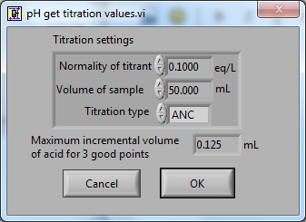

.. _title_ProCoDA:

*********************************************
ProCoDA: Process Control and Data Acquisition
*********************************************

.. |Save_gran| image:: Images/Save_gran.png

.. _heading_pH_Measurements:

pH Measurements
===============
1. Open the ProCoDA II software.
1. Navigate to the Configuration tab and select the volts button.
1. Insert a new sensor at the bottom of the sensor list using the insert sensor button.
1. Select the appropriate channel based on in which sensor port you plugged you pH probe.
1. Select pH Cal.
1. The pH probe should never be dry and is therefore stored with a small vial of pH 4.0 buffer screwed onto the tip.  Unscrew the storage vial cap and place the vial in a place where it will not be tipped over (the cap can stay on the probe).
1. Rinse the pH probe with DI water (use a squeeze bottle) into a beaker.
1. To calibrate the pH probe, we will use three pH buffer solutions with known pH (red=4.0, yellow=7.0, and blue=10.0).  After rinsing the pH probe, place it into the pH=4.0 buffer.  Stir gently and wait for the pH reading on the software to stabilize.  Once stabilized, press the add buffer button.  Rinse the pH probe with DI water and repeat for the pH=7.0 and pH=10.0 buffer solutions.
1. When you have tested all calibration buffers, hit, OK. And OK again.

.. _heading_Gran_Plot:

Gran Plot
=========

.. |Save_gran| image:: Images/Save_gran.png
.. |Launch_gran_plot| image:: Images/Launch_gran_plot.png

.. |Incremental_titrant| image:: Images/Incremental_titrant.png
.. |Accept_pH_value| image:: Images/Accept_pH_value.png
.. |End_titration| image:: Images/End_titration.png

1. Open the ProCoDA II software in the ProCoDA II folder on the desktop.
1. Connect and calibrate your pH probe as you did in the Acid Precipitation laboratory.
1. The Gran technique is used to measure acid or base neutralizing capacity.  To begin a Gran analysis, navigate to configuration, select volts, select pH cal, and click on |Launch_gran_plot|.
1. You will be prompted for the normality of titrant and the volume of sample.  You can also choose to measure ANC (acid neutralizing capacity) or BNC (base neutralizing capacity). If you are measuring BNC you will need to titrate with a strong base. After entering the normality of acid (or base) and the sample volume the computer will suggest an incremental volume of titrant that will produce a good Gran plot. Smaller incremental titrant volumes can be used, but will require more time to titrate the sample. After entering the values, exit the dialog box by clicking on the OK button. It will look like this:
 |Get_titration_values|
1. The Gran Plot analysis uses 3 controls: |Incremental_titrant|, |Accept_pH_value|, and |End_titration|. The "incremental titrant added" is the amount of acid added since the previous time the |Accept_pH_value| button was clicked. For the first data point if no titrant was added the "incremental titrant added" should be set to zero. For subsequent readings, change the incremental titrant added to the volume you are adding, add the titrant with a digital pipette, wait for the pH to stabilize and then click on |Accept_pH_value|. Any amount of titrant can be added at each step, but it is important that below pH 5 the titrant volumes be smaller than the recommended value so that sufficient data points are obtained in the linear region.
 1. There is no way to delete unwanted data points after they are accepted. Therefore, make sure you only press the enter button once after each addition of titrant.
 1. Continue adding titrant until a line is fit through the linear region of the data. When the line is drawn through the linear region press |End_titration|. Note that |End_titration| accepts the last data point and ends the titration. |End_titration| is pressed after the last addition of acid INSTEAD of pressing |Accept_pH_value|}!
 1. The equivalent volume (:math:`V_e`) is given in the same units as were used for the titrant and sample volumes. The equivalent volume is the abscissa intercept of the line fit to the data in the region of constant slope. The ANC is given in equivalents per liter.
 1. If desired the titration data can be saved in a format that can be read by spreadsheet programs by selecting  |Save_gran|. You will be prompted for a file name and location.
