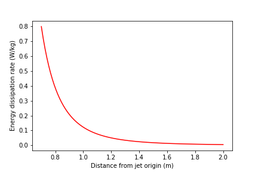

*************************
Rapid Mix Design Solution
*************************

.. code:: python

  import aguaclara.core.physchem as pc
  from aguaclara.core.units import unit_registry as u
  import aguaclara.core.constants as con
  import numpy as np
  import matplotlib.pyplot as plt

1)
~~~

Create a function to return maximum energy dissipation rate along the centerline of a free jet given inputs of distance downstream of the jet (along the centerline), jet velocity, and initial jet diameter. You will find the Rapid Mix powerpoint useful in finding a relationship between these variables.

Use your function to create a graph of the centerline (maximum) energy dissipation rate as a function of distance from jet origin. \* Use an initial diameter of DiamJet = 10 cm and a velocity of VelJet = 1 m/s. \* Use a range of 7 to 20 jet diameters when creating the graph. \* Use units of meters for the x-axis and W/kg for the y-axis. Make sure to label your axes correctly.

.. code:: python

    DiamJet = 10*u.cm
    VelJet = 1*(u.m/u.s)

    def energy_dissipation_rate(x, Diam, Velocity):

        dissipation = (50 * Diam**3 * Velocity**3 / ((x - (2 * Diam))**4))
        return dissipation.to(u.m**2/(u.s**3))

    DistanceDownstream = (np.array(np.linspace(7,20,100))*DiamJet).to(u.m)

    print(energy_dissipation_rate(DistanceDownstream, DiamJet, VelJet)[1])
    fig, ax = plt.subplots()
    ax.plot(DistanceDownstream, energy_dissipation_rate(DistanceDownstream, DiamJet, VelJet), 'r-')
    ax.set(xlabel='Distance from jet origin (m)')
    ax.set(ylabel='Energy dissipation rate (W/kg)')
    fig.savefig('Rapid_Mix/../Images/Energy_dissipation_rate_vs_Distance_from_jet_origin')
    plt.show()

0.7212 meter ** 2 / second ** 3

.. _figure_Energy_dissipation_rate_vs_Distance_from_jet_origin:

   Energy dissipation rate vs Distance from jet origin
