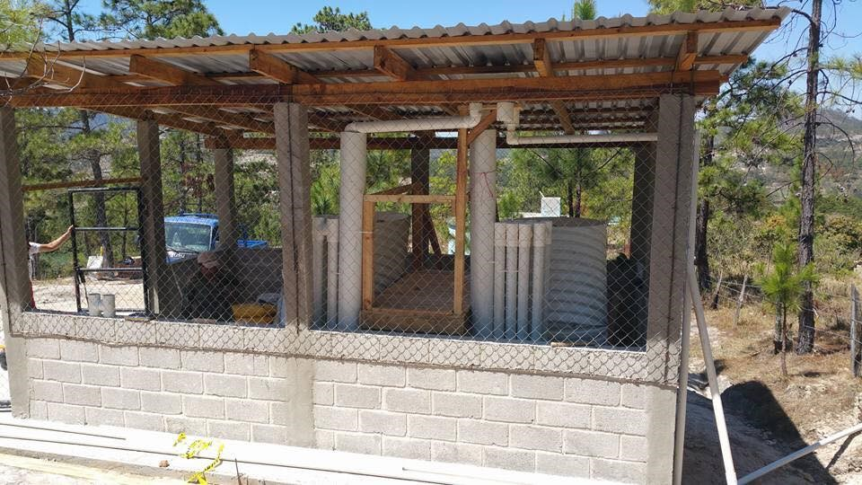
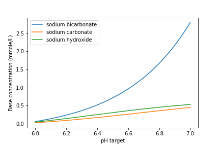

.. _title_rapid_mix_examples:

***************************************************
Rapid Mix: Examples
***************************************************

.. _heading_Example_pH_Adjustment:

Example: pH Adjustment
======================

Find the required dose of several bases to raise the pH at the Manzaragua Water Treatment Plant. The Manzaragua AguaClara plant consists of two 1 L/s plants operating in parallel. The plant is located in the municipality of Guinope, the department of El Paraiso, Honduras.

.. _figure_Manzaragua_WTP:

    Manzaragua water treatment plant using two of the AguaClara 1 L/s plants in parallel.

The plant performed very poorly from the first day of operation. The first attempted fix was to double the flocculator residence time by increasing the number of flocculator pipes (3 inch diameter by 1.5 m long) from 12 to 24. This improved performance, but the plant continued to perform poorly. A raw water sample was analyzed on May 30, 2018 and the following results were obtained.

.. _figure_Manzaragua_Water_Analysis:

.. figure::    ../Images/Manzaragua_Water_Analysis.jpg
   :width: 700px
   :align: center
   :alt: Manzaragua Water Analysis

   Water quality analysis for Manzaragua.

.. _Table_Manzaragua_water_quality_analysis:

.. csv-table:: Manzaragua water quality analysis
   :header: "Parameter", "Units", "Standard", "Results"
   :widths: 20, 20, 20, 20
   :align: center

   "Turbidity","NTU", "5", "71"
   "Color", "color units", "15", "150"
   "pH", "pH", "6.5 - 8.5", "5.91"
   "Conductivity", ":math:`\mu s/cm`", "400", "69.15"
   "Alkalinity", ":math:`mg/L` as :math:`CaCO_3`", "-", "24.5"
   "Bicarbonates",":math:`mg/L` as :math:`CaCO_3`", "-","24.5"
   "Carbonates", ":math:`mg/L` as :math:`CaCO_3`", "-", "0"
   "Hardness", ":math:`mg/L` as :math:`CaCO_3`", "400", "15.68"

This water has high color which suggests a high concentration of dissolved organic matter. The pH is a clear problem because the pH is too low for the coagulant nanoparticles to precipitate. As the water sample has a pH of 5.91 a significant fraction of the coagulant will remain soluble.

Our goal is to determine how much base will need to be added to raise the pH. We do not have data on the *optimal* pH for treating high color water with PACl and so we will use pH 7 as the target.

At circumneutral pH (pH close to 7) the buffering capacity of the water is dominated by carbonate chemistry and specifically by the equilibrium between :math:`{H_2}CO_3^{\star}` and :math:`HCO_3^-` . We will use the acid neutralizing capacity (reported as calcium carbonate alkalinity) and the pH from the sample analysis to estimate the total concentration of carbonates. We will not use the sample analysis carbonate concentrations because they can not be precisely correct.

We will find the amount of base that must be added using :eq:`Base_for_pH_Adjust`.

.. _Table_ANC_and_carbonate_values_for_several_bases_and_acids:

.. csv-table:: ANC and carbonate values for several bases and acids
   :header: "Base/Acid", ":math:`\Pi_{ANC}`", ":math:`\Pi_{CO_3^{-2}}`"
   :widths: 20, 20, 20
   :align: center

   ":math:`Na_2CO_3` or :math:`CaCO_3`", "2", "1"
   ":math:`NaHCO_3`", "1","1"
   ":math:`NaOH`", "1", "0"
   ":math:`HCl` or :math:`HNO_3`", "-1", "0"
   ":math:`H_2SO_4`", "-2", "0"

For :math:`Na_2CO_3` \* :math:`\Pi_{ANC}` = 2 we are adding
:math:`CO_3^{-2}` which is multiplied by two in the ANC equation because
:math:`CO_3^{-2}` can react with two protons. \* :math:`\Pi_{CO_3^{-2}}`
= 1 because there is one mole of :math:`CO_3` per mole of
:math:`Na_2CO_3`

Below is the code used to calculate the required base addition.

.. todo:: This code needs to move to aguaclara.research. Then the short code snippits can be doc tested.

.. code:: python

    from aguaclara.core.units import unit_registry as u
    import aguaclara.research.environmental_processes_analysis as epa
    import numpy as np
    import matplotlib.pyplot as plt
    import pandas as pd

    """define molecular weights"""
    m_Ca = 40.078*u.g/u.mol
    m_C = 12.011*u.g/u.mol
    m_O = 15.999*u.g/u.mol
    m_Na = 22.99*u.g/u.mol
    m_H = 1.008*u.g/u.mol
    m_CaCO3 = m_Ca+m_C+3*m_O
    m_Na2CO3 = 2*m_Na+m_C+3*m_O
    m_NaHCO3 = m_Na+m_H+m_C+3*m_O
    m_NaOH = m_Na+m_O+m_H

    """Raw water characteristics"""
    pH_0 = 5.91
    ANC_0 = (24.5 * u.mg/u.L/m_CaCO3).to(u.mmol/u.L)
    ANC_0

    def total_carbonates_closed(pH, ANC):
        """This function calculates total carbonates for a closed system given pH and ANC

        Parameters
        ----------
        pH : float
            pH of the sample
        ANC: float
            acid neutralizing capacity of the sample
        Returns
        -------
        The total carbonates of the sample
        Examples
        --------
        >>> total_carbonates_closed(1*u.mmol/u.L,8)
        1.017 mole/liter
        """
        return (ANC - epa.Kw/epa.invpH(pH) + epa.invpH(pH)) / (epa.alpha1_carbonate(pH) + 2 * epa.alpha2_carbonate(pH))

    CT_0 = total_carbonates_closed(pH_0,ANC_0)

    """ calculate the amount of base that must be added to reach a target pH"""

    def pH_adjust(pH_0,ANC_0,Pi_base,Pi_CO3,Pi_Al,C_Al,pH_target):
      """This function calculates the required base (or acid) to adjust the pH to a target value. The buffering capacity is assumed to be completely due to carbonate species. The initial carbonate concentration is calculated based on the initial pH and the initial ANC.

      Parameters
      ----------
      pH_0: float
          pH of the sample
      ANC_0: float
          acid neutralizing capacity (Alkalinity) of the sample in eq/L.
      Pi_base: float
        equivalents of ANC per mole of base (or acid)
      Pi_CO3: float
        mole of carbonate per mole of base (or acid)
      Pi_Al : float
        equivalents of ANC per mole of aluminum coagulant
      C_Al
        concentration of aluminum coagulant in moles/L
      pH_target: float
        pH goal
      Returns
      -------
      The required concentration of base (or acid) in millimoles/L
      Examples
      --------
      >>> pH_adjust(5.91,0.2*u.mmol/u.L,1,1,0,0,7)
      2.2892822041250924 millimole/liter
      >>> pH_adjust(7,0.2*u.mmol/u.L,1,1,0,0,0,0,7)
      0.0 millimole/liter
      >>> pH_adjust(7,0*u.mmol/u.L,1,0,-3,1*u.mmol/u.L,7)
      3.0 millimole/liter
      """
      CT_0 = total_carbonates_closed(pH_0,ANC_0)
      B_num = CT_0 * (epa.alpha1_carbonate(pH_target) + 2 * epa.alpha2_carbonate(pH_target)) + epa.Kw/epa.invpH(pH_target) - epa.invpH(pH_target) - ANC_0 - Pi_Al*C_Al
      B_den = Pi_base - Pi_CO3*(epa.alpha1_carbonate(pH_target) + 2 * epa.alpha2_carbonate(pH_target))
      return (B_num/B_den).to(u.mmol/u.L)

    """target pH"""
    pH_target = 7

    Pi_base_Na2CO3 = 2
    Pi_CO3_Na2CO3 = 1

    Pi_base_NaHCO3 = 1
    Pi_CO3_NaHCO3 = 1

    Pi_base_NaOH = 1
    Pi_CO3_NaOH = 0

    C_Na2CO3 = pH_adjust(pH_0,ANC_0,Pi_base_Na2CO3,Pi_CO3_Na2CO3,0,0,pH_target)

    C_NaHCO3 = pH_adjust(pH_0,ANC_0,Pi_base_NaHCO3,Pi_CO3_NaHCO3,0,0,pH_target)
    C_NaOH = pH_adjust(pH_0,ANC_0,Pi_base_NaOH,Pi_CO3_NaOH,0,0,pH_target)

    """Display results in a pandas table"""
    base = ["NaOH","NaHCO3","Na2CO3"]
    myindex = ["[mmoles/L]","[mg/L]"]
    row1 = [C_Na2CO3.magnitude,C_NaHCO3.magnitude,C_NaOH.magnitude]
    row2 = [(C_Na2CO3*m_Na2CO3).to(u.mg/u.L).magnitude,(C_NaHCO3*m_NaHCO3).to(u.mg/u.L).magnitude,(C_NaOH*m_NaOH).to(u.mg/u.L).magnitude]
    df = pd.DataFrame([row1,row2],index=myindex,columns=base)
    print(df.round(2))

    """Graph the base concentration required as a function of the target pH"""
    pH_graph = np.linspace(6,7,50)
    C_Na2CO3 = pH_adjust(pH_0,ANC_0,Pi_base_Na2CO3,Pi_CO3_Na2CO3,0,0,pH_graph)
    C_NaHCO3 = pH_adjust(pH_0,ANC_0,Pi_base_NaHCO3,Pi_CO3_NaHCO3,0,0,pH_graph)
    C_NaOH = pH_adjust(pH_0,ANC_0,Pi_base_NaOH,Pi_CO3_NaOH,0,0,pH_graph)

    fig, ax = plt.subplots()

    ax.plot(pH_graph,C_NaHCO3)
    ax.plot(pH_graph,C_Na2CO3)
    ax.plot(pH_graph,C_NaOH)
    imagepath = '../Images/'
    ax.set(xlabel='pH target', ylabel='Base concentration (mmole/L)')
    ax.legend(["sodium bicarbonate","sodium carbonate","sodium hydroxide"])
    fig.savefig(imagepath+'mole_base_for_target_pH')
    plt.show()

    fig, ax = plt.subplots()
    ax.plot(pH_graph,(C_Na2CO3*m_Na2CO3).to(u.mg/u.L))
    ax.plot(pH_graph,(C_NaOH*m_NaOH).to(u.mg/u.L))
    ax.set(xlabel='pH target', ylabel='Base concentration (mg/L)')
    ax.legend(["sodium carbonate","sodium hydroxide"])
    fig.savefig(imagepath+'mg_base_for_target_pH')
    plt.show()

The analysis reveals that the choice of base matters. The most efficient (on a mass or mole basis) base is :math:`NaOH` because it doesn't add any carbonates that don't fully react with the hydrogen ions. The decision about which base to use will be influenced by economics, operator safety, and by whether additional carbonate buffering simplifies plant operation with changing raw water quality.

.. _Table_Calcium_bases:

.. csv-table:: Calcium base.
   :header:  "Chemical Name",   "Common Name",  "Chemical Formula"
   :widths: 20, 20, 20

   "Calcium carbonate","Limestone or chalk",":math:`CaCO_3`"
   "Calcium hydroxide","Slaked lime or hydrated lime",":math:`Ca(OH)_2`"
   "Calcium oxide","Quicklime",":math:`CaO`"

The calcium bases are relatively inexpensive and have the disadvantage of lower solubility than sodium bases. Calcium carbonate has a low solubility, carbon dioxide is present in the atmosphere, and thus calcium carbonate precipitation limits the concentration that can be used for chemical feeds.

.. _figure_mole_base_for_target_pH:

    Dose of three bases (in mole/L) required to achieve a target pH for the Manzaragua water. Carbonates provide more buffering and less change in the pH compared with :math:`NaOH`.

.. _figure_mg_base_for_target_pH:

.. figure::    ../Images/mg_base_for_target_pH.png
    :width: 700px
    :align: center
    :alt: mg base for target pH

    Dose of two bases (in mg/L) required to achieve a target pH for the Manzaragua water. Carbonates provide more buffering and less change in the pH compared with :math:`NaOH`.

The required dose for each of the bases is summarized below.

.. _table_Base_table:

.. csv-table:: Dose of each base required to change the pH of the Manzaragua water to 7.
   :header: "Units", ":math:`NaOH`", ":math:`NaHCO_3`", ":math:`Na_2CO_3`"
   :widths: 20, 20, 20, 20

   "[mmoles/L]",  "0.45",     "2.8",    "0.53"
   "[mg/L]",     "47.21",   "235.0",   "21.19"

.. _heading_LFOM_and_Coag_Injection_sizing:

LFOM and Coagulant Injection Sizing
================================================

A water treatment plant that is treating 120 L/s of water injects the coagulant into the middle of the pipe that delivers the raw water to the plant and then splits the flow into 2 parallel treatment trains for subsequent flocculation. The pipe is PVC 24 inch nominal pipe diameter SDR 26. The water temperature is :math:`0^{\circ}C`. Estimate the minimum distance between the injection point and the flow split.

We will use a :ref:`linear flow orifice meter <heading_lfom>` with 20 cm of head loss. The first step is to determine the diameter of the LFOM.

.. todo:: This example needs to be updated once the LFOM OO code is fixed.

.. code:: python

 """ importing """

 from aguaclara.core.units import unit_registry as u
 import aguaclara.research.environmental_processes_analysis as epa
 import numpy as np
 import matplotlib.pyplot as plt
 import aguaclara.research.floc_model as fm

 #from matplotlib.ticker import FormatStrFormatter
 imagepath = 'AguaClara Water Treatment Plant Design/../Images/'

 Q_plant = 120 * u.L/u.s
 HL_LFOM = 20 * u.cm
 Pi_LFOM_safety = 1.2
 SDR_LFOM = 26

 from aguaclara.design import lfom as lfom
 ND_LFOM = lfom.nom_diam_lfom_pipe(Q_plant,HL_LFOM)
 print(ND_LFOM, '(',ND_LFOM.to(u.cm), ')')

 L_flow = pipe.ID_SDR(ND_LFOM,SDR_LFOM)
 L_flow

The LFOM requires a 24 inch diameter pipe.

Example Problem: Energy Dissipation Rate in a Straight Pipe
=============================================================

#. Calculate the friction factor.
#. Use :eq:`mixing_pipe_diameters` to estimate the mixing length in pipe diameters.
#. Convert to pipe length in meters.

.. code:: python

  import aguaclara.core.physchem as pc
  from aguaclara.core.units import unit_registry as u
  import aguaclara.core.materials as mat
  T_water=0*u.degC
  Pipe_roughness = mat.PVC_PIPE_ROUGH
  Pipe_roughness
  Nu_water = pc.viscosity_kinematic(T_water)
  Q_pipe = 120 * u.L/u.s
  ND_pipe = 24*u.inch
  SDR_pipe = 26
  ID_pipe = pipe.ID_SDR(ND_pipe,SDR_pipe)
  f_pipe = pc.fric(Q_pipe,ID_pipe,Nu_water,Pipe_roughness)
  N_pipe_diameters = (2/f_pipe)**(1/3)
  N_pipe_diameters
  """The minimum length for mixing is thus"""
  L_mixing = ID_pipe*N_pipe_diameters
  print('The minimum distance required for mixing across the diameter of the pipe is ',L_mixing.to_base_units())
  v_lfom = (Q_plant/pc.area_circle(pipe.ID_SDR(ND_LFOM,SDR_LFOM))).to_base_units()
  print(v_lfom)
  t_mixing = (L_mixing/v_lfom).to(u.s)
  t_mixing

The previous analysis provides a minimum distance for sufficient mixing so that equal mass flux of coagulant will end up in both treatment trains. This assumes that the coagulant was injected in the pipe centerline. Injection at the wall of the pipe is a poor practice and would require many more pipe diameters because it takes significant time for the coagulant to be mixed out of the slower fluid at the wall. The time required for mixing at the scale of the flow in the plant is thus accomplished in a few seconds. This ends up being the fastest part of the transport of the coagulant nanoparticles on their way to attachment to the clay particles.  Next we will determine a typical flow rate of coagulant. **Aluminum** concentrations for polyaluminum chloride (PACl) typically range from 1 to 10 mg/L. The maximum PACl stock solution concentration is about 70 g/L as **Al**.

.. code:: python

 C_PACl_stock = 70 *u.g/u.L
 C_PACl_dose_max = 10 * u.mg/u.L
 Q_PACl_max = (Q_plant*C_PACl_dose_max/C_PACl_stock).to(u.mL/u.s)
 print(Q_PACl_max)

We can estimate the diameter of the injection port by setting the kinetic energy loss where the coagulant is injected into the main flow to be large enough to exceed the pressure fluctuations downstream of the LFOM. The amount of energy we invest in injecting the coagulant into the raw water is a compromise between having to raise the entire chemical feed system including the stock tanks to increase the potential energy and a goal of not having pressure fluctuations inside the LFOM pipe cause flow oscillations in the chemical dosing tube. Thus our goal is to have the kinetic energy at the injection point be large compared with the expected pressure fluctuations in the LFOM. Given that the head loss through the LFOM is often 20 cm, we expect the pressure fluctuations from turbulence to be a small fraction of that head loss. Thus we set the kinetic energy to be equivalent to 2 cm.

.. code:: python

 HL_Coag_injection = 2 * u.cm
 v_Coag_injection = ((2 * u.gravity * HL_Coag_injection)**0.5).to(u.m/u.s)
 print(v_Coag_injection)
 D_Coag_injection_min = pc.diam_circle(Q_PACl_max/v_Coag_injection)
 print(D_Coag_injection_min.to(u.mm))
