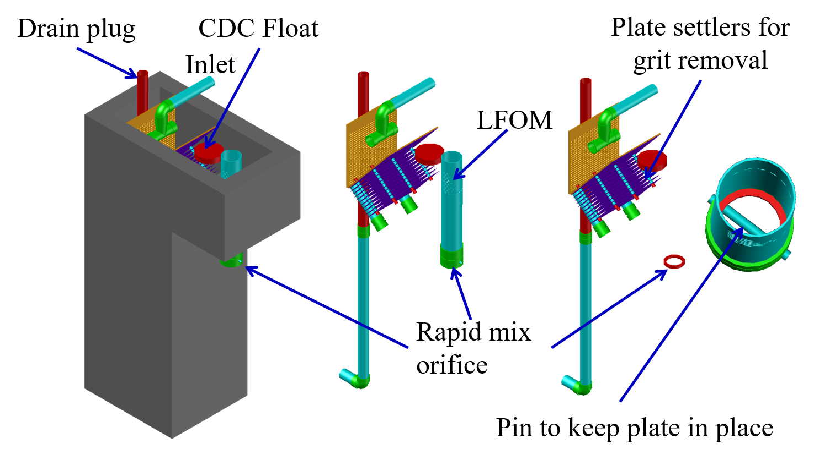
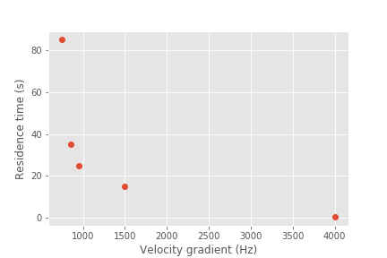

.. _title_Rapid_Mix_Introduction:

************************
Rapid Mix Introduction
************************

This chapter is currently home for the prerequisites of successful flocculation. Those prerequisites include:
 - ensuring that the pH is in the correct range for coagulant nanoparticle formation after the coagulant has been added to the raw water.
 - increasing the coagulant dose to account for the coagulant interactions with dissolved species that effectively cover some of the coagulant nanoparticle surfaces.
 - increasing the coagulant dose to account for the available surface area of suspended particles to achieve
 - If there are multiple treatment trains, mixing the coagulant with the raw water so that parallel treatment trains receive the same concentration of coagulant (perhaps the conventional role of rapid mix)
 - transporting the coagulant nanoparticles to attach to suspended particles

Rapid mix is the term commonly used to describe the processes that occur between the coagulant addition to the raw water and the flocculation process. The processes that occur are not well understood and thus design guidelines have been empirical.

“In summary, little is known about rapid mix, much less any sensitivity to scale. However, the models and data reviewed suggest the need to be on the lookout for certain effects. From what is presently known, it can be speculated that since coagulant precipitation is sensitive to both micro- and macro-mixing, scale-up must consider not only energy dissipation rate, but also the reaction injection point and the contacting method.” - `Mixing in Coagulation and Flocculation 1991 page 292 <https://books.google.com/books/about/Mixing_in_coagulation_and_flocculation.html?id=dkFSAAAAMAAJ>`_.

Although the processes have not been well characterized, the energy that is invested for rapid mix processes is significant. In many cases the amount of energy used isn't practical for gravity powered water treatment plants. The high energy consumption of rapid mix units has led some municipal water treatment plant operators to experiment with turning off rapid mix units. They have found that at least under some conditions there is no indication that the energy used in rapid mix improved plant performance. Thus there is a need to understand the physical and chemical processes that occur when a concentrated liquid coagulant is added to water.

Rapid mix sets the stage for aggregation of both suspended particles and dissolved substances. Particle and dissolve substance aggregation is mediated by coagulant nanoparticles. The nanoparticles attach to raw water particles as well as to some dissolved species. After the nanoparticles have been mixed with the raw water and have attached to raw water particles the next process, flocculation, can begin.  :ref:`Flocculation <title_Flocculation_Introduction>` is the process of producing collisions between particles to create flocs (aggregates of particles).

Coagulant nanoparticle application includes multiple steps that must occur before the raw water particles can begin to aggregate. The sticky nanoparticles can be aluminum :math:`(Al^{+3})` or iron :math:`(Fe^{+3})` based and in either case the nanoparticles are formed from precipitated hydroxide species (:math:`Al(OH)_3` or :math:`Fe(OH)_3`). The series of events that are contained in the broad designation of “rapid mix” are:

  #. Liquid coagulant stock solution with a low pH is injected into the raw water
  #. Fluid Mixing: Turbulent eddies randomize the fluids (but don’t blend them)

     #. Large scale eddies mix the coagulant with the raw water by creating large fluid deformations. This stretching and turning of the raw water and coagulant is analogous to shuffling a deck of cards. The cards are randomized, but the cards maintain their identity. The original liquids retain their chemical composition. This step must be completed before any flow splitting for parallel treatment trains.
     #. Turbulent eddies disintegrate into smaller and smaller eddies.
     #. At a very small scale (Inner viscous length scale) viscosity becomes significant and the kinetic energy of the eddies begins to be converted to heat by viscosity.

  #. The coagulant is blended with the raw water by molecular diffusion
  #. The higher pH of the raw water causes the coagulant to begin to precipitate as :math:`Al_{12}AlO_4(OH)_{24}(H_2O)_{12}^{7+}`, an aluminum, Al, nanoparticle.
  #. The precipitating :math:`Al_{13}` molecules aggregates with other nearby :math:`Al_{13}` molecules to form aluminum hydroxide nanoparticles. It is also possible that the nanoparticles are already formed in the coagulant stock suspension. Polyaluminum chloride stock solutions turn white in about a year at room temperature and this suggests that nanoparticles form in the stock solution.
  #. The Al nanoparticles attach to other dissolved species and suspended particles.
  #. Molecular diffusion causes some dissolved species and Al nanoparticles to aggregate.
  #. Fluid shear and molecular diffusion cause Al nanoparticles with attached formerly dissolved species to collide with inorganic particles (such as clay) and organic particles (such as viruses, bacteria, and protozoans).

These multiple steps cover a wide range of length scales and it is not clear at the onset which processes might be the rate limiting steps. We will develop time scale estimates for several of these steps to help identify which processes will likely require the most attention to design. Many of these transport processes are presumed to occur in parallel. :numref:`figure_transport_length_scales` shows the range of length scales.

.. _figure_transport_length_scales:

.. figure::    Images/rapid_mix_macro_to_nano_scale.png
    :width: 700px
    :align: center
    :alt: rapid mix macro to nano scale

    Transport of coagulant nanoparticles occurs over length scales ranging from meter to a fraction of a nanometer.

.. _Fluid_Mixing:

Fluid Mixing
========================================

Fluid mixing is the process by which large scale eddies distribute packets of the coagulant stock throughout the raw water. The term “Rapid mix” is probably best used to describe this process. Traditional methods of achieving this fluid mixing include various methods of generating intense turbulence. Fluid mixing is able to rapidly blend the coagulant with the raw water in a matter of a few seconds. The equations describing the fluid mixing process are presented in the section on :ref:`heading_Estimates_of_time_required_for_mixing_processes`.

.. _figure_Backmix:

.. figure:: Images/Backmix.jpg
    :width: 200px
    :align: center
    :alt: Backmix

    Backmix: a mechanical rapid mixer that has a relatively long residence time in a completely mixed flow reactor.

.. _figure_Inline:

.. figure:: Images/Inline.jpg
    :width: 400px
    :align: center
    :alt: Inline

    Inline: a mechanical rapid mixer that has a short residence time in a completely mixed flow reactor that is often built into a pipe.

.. _figure_hydraulic_jump:

.. figure:: Images/hydraulic_jump.jpg
    :width: 200px
    :align: center
    :alt: hydraulic jump

    Hydraulic jump: a hydraulic rapid mixer uses the flow expansion downstream from supercritical open channel flow.

The hydraulic jump in :numref:`figure_hydraulic_jump` uses a flow expansion to generate mixing in an open channel and that suggests that a flow expansion could also be used to generate mixing in a closed conduit. AguaClara rapid mix units consist of an orifice in the bottom of the :ref:`heading_lfom` where the water enters the flocculator (see :numref:`figure_Rapid_mix_orifice`). However, given that fluid mixing is so easy to attain it is unclear if the energy used in the rapid mix orifice is necessary.

.. _figure_Rapid_mix_orifice:

    The orifice creates a high velocity jet that generates mixing as it expands in the contact chamber prior to flocculation.

.. _heading_Conventional_Mechanical_Rapid_Mix:

Conventional Mechanical Rapid Mix
---------------------------------

.. _heading_Conventional_Maximum_Velocity_Gradients:

Maximum Velocity Gradients
--------------------------

.. code:: python

  import numpy as np
  import matplotlib.pyplot as plt
  from aguaclara.core.units import unit_registry as u
  import aguaclara as ac

  Mix_HRT = np.array([0.5,15,25,35,85])*u.s
  Mix_G = np.array([4000,1500,950,850,750])/u.s
  Mix_CP = np.multiply(Mix_HRT, np.sqrt(Mix_G))
  Mix_Gt = np.multiply(Mix_HRT, Mix_G)
  Mix_EDR = (Mix_G**2*ac.viscosity_kinematic(Temperature))

  fig, ax = plt.subplots()
  ax.plot(Mix_G.to(1/u.s),Mix_HRT.to(u.s),'o')
  ax.yaxis.set_major_formatter(FormatStrFormatter('%.f'))
  ax.xaxis.set_major_formatter(FormatStrFormatter('%.f'))
  ax.set(xlabel='Velocity gradient (Hz)', ylabel='Residence time (s)')
  fig.savefig(imagepath+'Mechanical_RM_Gt')
  plt.show()

.. _figure_Mechanical_RM_Gt:

    Mechanical rapid mix units use a wide range of velocity gradients and residence times.

Conventional rapid mix units use mechanical or potential energy to generate intense turbulence to begin the mixing process. Conventional design is based on the use of :math:`\bar G` (an average velocity gradient) as a design parameter. We don’t yet know what the design objective is for rapid mix and thus it isn’t clear which parameters matter. We hypothesize that both velocity gradients that cause deformation of the fluid and time for molecular diffusion are required to ultimately transport coagulant nanoparticles to the surfaces of clay particles.

The velocity gradient can be obtained from the rate at which mechanical energy is being dissipated and converted to heat by viscosity.

.. math::  \varepsilon = G^2 \nu

where :math:`\varepsilon` is the energy dissipation rate, :math:`G` is the velocity gradient, and :math:`\nu` is the kinematic viscosity of water. We can estimate the power input required to create a target energy dissipation rate for a conventional design by noting that power is simple the energy dissipation rate times the mass of water in the rapid mix unit.

.. math:: P = \bar\varepsilon \rlap{-} V \rho

.. math::  P = \bar G^2 \nu \rlap{-} V \rho

We can relate reactor volume to a hydraulic residence time, :math:`\theta`, and volumetric flow rate, Q.

.. math::  P = \rho \bar G^2 \nu Q \theta

This equation is perfectly useful for estimating electrical motor sizing requirements for mechanical rapid mix units. For gravity powered hydraulic rapid mix units it would be more intuitive to use the change in water surface elevation, :math:`\Delta h` instead of power input.

.. math:: P = \rho g Q \Delta h

Combining the two equations we obtain.

.. math::  \Delta h =  \frac{G^2 \nu \theta}{g}

.. _Table_Conventional_Rapid_Mix_Design_Values:

.. csv-table:: Typical values for conventional rapid mix residence time and average velocity gradients
   :header:  "Residence Time (s)","Velocity gradient G (1/s)","Energy dissipation rate (W/kg)","Equivalent height (m)"

   "0.5","4000","16","0.8"
   "10 - 20","1500","2.25","2.3 - 4.6"
   "20 - 30","950","0.9","1.8 - 2.8"
   "30 - 40","850","0.72","2.2 - 2.9"
   "40 - 130","750","0.56","2.3 - 7.5"

From Environmental Engineering: A Design Approach by Sincero and
Sincero. 1996. page 267.

Rotating propellers can either be installed in open tanks or enclosed in pipes. From a mixing and fluids perspective it doesn’t make any difference whether the tank is open to the atmosphere or not. The parameters of interest are the rate of fluid deformation and the residence time in the mixing zone.

.. _heading_Mixing_time:

Mixing time
-----------

The time required for mixing in a turbulent environment is a function of the rate that kinetic energy is being dissipated as heat (the energy dissipation rate) and the length scale of the eddies. Given that turbulent energy is passed from large eddies to smaller and smaller eddies, the amount of energy that is being transferred at any given length scale is independent of scale. The result (see Equation :eq:`eq_t_eddy`) is that the time required for mixing is dominated by the time required for the largest eddies to turn over (:numref:`figure_Eddy_turnover_times`).

.. _figure_Eddy_turnover_times:

.. figure:: Images/Eddy_turnover_time.png
    :width: 400px
    :align: center
    :alt: Eddy turnover time

    Eddy turnover times as a function of length scale for a range of energy dissipation rates.

The eddy turnover times are longest for the largest eddies and this analysis suggests that it only takes a few seconds for turbulent eddies to mix from the scale of the flow down to the inner viscous length scale.

The large scale mixing time is critical for the design of water treatment plants for the case where the flow is split into multiple treatment trains after coagulant addition. In this case it is critical that the coagulant be mixed equally between all of the treatment trains and thus the mixing times shown in the previous graph represent a minimum time between where the coagulant is added and where the flow is divided into the parallel treatment trains.

It is possible that this process of mixing from the scale of the flow down to the inner viscous length scale is referred to as “rapid mix.” Here we showed that this mixing is indeed rapid and is really only a concern in the case where the coagulant injection point is very close to the location where the flow is split into multiple treatment trains.

The time required for mixing the coagulant nanoparticles with the fluid is typically only a few seconds, and will be accomplished whether or not the rapid mix unit is turned on. The turbulent eddies created either from the water flowing in the channel or from the water flowing through the pipe between the coagulant injection point and the flocculator will achieve the required fluid mixing in most cases. However, the step of the :ref:`coagulant nanoparticles attaching to the suspended particles<heading_Diffusion_and_Shear_Transport_Coagulant_Nanoparticles_to_Clay>` may be aided by the high energy of the rapid mix unit.

.. _heading__Coagulant_Nanoparticle_Interactions:

Coagulant Nanoparticle Interactions
========================================

Coagulant nanoparticles are sticky and can attach to suspended particles as well as to each other. Some dissolved substances also adsorb to coagulant nanoparticles. The development of models to describe these interactions has been impeded by the widespread acceptance of the `charge neutralization hypothesis <https://projects.ncsu.edu/project/hubbepaperchem/Defnitns/Neutrlzn.htm>`_ as the mechanism that governs these interactions. However, this hypothesis fails to account for the size of  coagulant nanoparticles and the various contaminants in the raw water influent. Instead, a simplified the model describing removal of these differently sized contaminants is proposed below; this simplified model posits that it is possible to separate fast and slow processes, which allows for a sequential model.

Interactions between the various suspended and dissolved substances (see :numref:`figure_Particle_sizes`) can occur simultaneously as soon as the coagulant is blended with the raw water. The rates of these interactions are controlled by the transport processes of fluid deformation and molecular diffusion. Molecular diffusion is fastest for small particles and fluid deformation is most effective for larger particles. Thus the fastest process is hypothesized to be the diffusion of low mass molecules to the coagulant nanoparticles. Transport of the coagulant nanoparticles to attach to suspended solids is expected to be a slower process. Transport of suspended particles to collide with other suspended particles (flocculation) is even slower.

.. _figure_Particle_sizes:

.. figure:: Images/Particle_sizes.png
    :width: 400px
    :align: center
    :alt: Particle sizes

    The size range of particles and nanoparticles that are important in drinking water treatment ranges from approximately a nanometer (for example arsenic :math:`HAsO_4^{2-}`) to thousands of nanometers for clay and protozoa.

.. _heading_Dissolved_Organic_Matter_and_Coagulant:

Dissolved Organic Matter
----------------------------------------

Dissolved organic matter (DOM) includes humic substances, fulvic acids, and other organic molecules. The distinction between dissolved and particulate organic matter is somewhat arbitrary and often 450 nm is used as the transition.  The dissolved organic matter could also be referred to as macromolecules or as nanoparticles.

Because of its small size the DOM has a large surface per unit mass. Water that contains high DOM concentrations requires much higher coagulant dosages to achieve effective flocculation. Removal of DOM is a high priority for drinking water treatment plants because DOM both interferes with disinfection processes and produces disinfection by products. A significant fraction of DOM can be removed by coagulant nanoparticles.

.. todo:: cite William's paper with model for flocculation of humic acid and clay suspension.

.. _heading_Suspended_Solids_and_Coagulant:

Suspended Solids
----------------------------------------

Suspended solids include both organic and inorganic particles. Organic particles of concern include virus, bacteria, and protozoa. Inorganic particles include clay and other minerals. Naturally occurring suspended solids tend to have negative surface charge at neutral pH. The negative surface charge effectively prevents particle aggregation and thus these particles can remain suspended for a very long time.

.. _heading_Pathogens_and_Coagulant:

Pathogens
---------

Virus particles readily attach to coagulant nanoparticles (see `"Effects of Floc-Virus Association on Chlorine Disinfection Efficiency by Shinichiro Ohgaki and Prasang Mongkonsiri <https://link-springer-com.proxy.library.cornell.edu/chapter/10.1007/978-3-642-76093-8_5>`_) and this attachment makes it possible to efficiently remove virus particles by flocculation followed by sedimentation. Bacteria (cite Yolanda Brook paper when it is published) and protozoans (need reference) are also removed by flocculation by coagulant nanoparticles.

.. _heading_Rate_Estimates_for_Coagulant_Nanoparticle_Transport_to_Suspended_Solids:

Rate Estimates for Coagulant Nanoparticle Transport to Suspended Solids
------------------------------------------------------------------------

Coagulant nanoparticles require significant time to attach to the surfaces of suspended solids. The time required is estimated in :ref:`heading_Diffusion_and_Shear_Transport_Coagulant_Nanoparticles_to_Clay`. It is quite possible that this stage of the rapid mix/flocculation process has been overlooked in the past. Transport of the nanoparticles to the suspended solids is accomplished by a combination of fluid deformation and diffusion.
