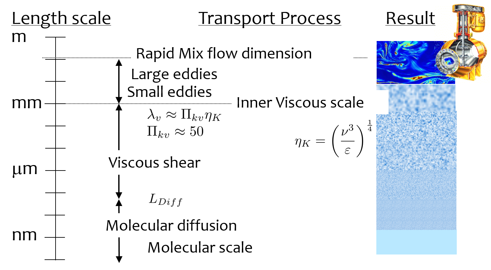

.. _title_Rapid_Mix_Designtroduction:

************************
Rapid Mix Introduction
************************

Before we introduce rapid mix, we need to first discuss our strategy for taking a water source that is contaminated with dissolved or suspended contaminants and

Rapid mix is the term commonly used to describe the processes that occur between the coagulant addition to the raw water and the flocculation process. The processes that occur are not well understood and thus design guidelines have been empirical.

“In summary, little is known about rapid mix, much less any sensitivity to scale. However, the models and data reviewed suggest the need to be on the lookout for certain effects. From what is presently known, it can be speculated that since coagulant precipitation is sensitive to both micro- and macro-mixing, scale-up must consider not only energy dissipation rate, but also the reaction injection point and the contacting method.” - `Mixing in Coagulation and Flocculation 1991 page 292 <https://books.google.com/books/about/Mixing_in_coagulation_and_flocculation.html?id=dkFSAAAAMAAJ>`_.

Although the processes have not been well characterized, the energy that is invested for rapid miz processes is significant. In many cases the amount of energy used isn't practical for gravity powered water treatment plants. The high energy consumption of rapid mix units has led some municipal water treatment plant operators to experiment with turning off rapid mix units. They have found that at least under some conditions there is no indication that the energy used in rapid mix improved plant performance. Thus there is a need to understand the physical and chemical processes that occur when a concentrated liquid coagulant is added to water.

Rapid mix sets the stage for aggregation of both suspended particles and dissolved substances. Particle and dissolve substance aggregation is mediated by coagulant nanoparticles. The nanoparticles attach to raw water particles as well as to some dissolved species. After the nanoparticles have been mixed with the raw water and have attached to raw water particles the next process, flocculation, can begin. Flocculation is the process of producing collisions between particles to create flocs (aggregates of particles).

Nanoparticle application includes multiple steps that must occur before the raw water particles can begin to aggregate. The sticky nanoparticles can be aluminum :math:`(Al^{+3})` or iron :math:`(Fe^{+3})` based and in either case the nanoparticles are formed from precipitated hydroxide species :math:`(Al(OH)_3)` or :math:`(Fe(OH)_3)`. The series of events that are contained in the broad designation of “rapid mix” are:

  1. Liquid coagulant stock solution with a low pH is injected into the raw water
  2. Fluid Mixing: Turbulent eddies randomize the fluids (but don’t blend them)

     1. Large scale eddies mix the coagulant with the raw water by creating large fluid deformations. This stretching and turning of the raw water and coagulant is analogous to shuffling a deck of cards. The cards are randomized, but the cards maintain their identity. The original liquids retain their chemical composition. This step must be completed before any flow splitting for parallel treatment trains.
     2. Turbulent eddies disintegrate into smaller and smaller eddies.
     3. At a very small scale (Inner viscous length scale) viscosity becomes significant and the kinetic energy of the eddies begins to be converted to heat by viscosity.

  3. The coagulant is blended with the raw water by molecular diffusion
  4. The higher pH of the raw water causes the coagulant to begin to precipitate as :math:`Al_{12}AlO_4(OH)_{24}(H_2O)_{12}^{7+}`, an aluminum, Al, nanoparticle.
  5. The precipitating :math:`Al_{13}` molecules aggregates with other nearby :math:`Al_{13}` molecules to form aluminum hydroxide nanoparticles. It is also possible that the nanoparticles are already formed in the coagulant stock suspension. Polyaluminum chloride stock solutions turn white in about a year at room temperature and this suggests that nanoparticles form in the stock solution.
  6. The Al nanoparticles attach to other dissolved species and suspended particles.
  7. Molecular diffusion causes some dissolved species and Al nanoparticles to aggregate.
  8. Fluid shear and molecular diffusion cause Al nanoparticles with attached formerly dissolved species to collide with inorganic particles (such as clay) and organic particles (such as viruses, bacteria, and protozoans).

These multiple steps cover a wide range of length scales and it is not clear at the onset which processes might be the rate limiting steps. We will develop time scale estimates for several of these steps to help identify which processes will likely require the most attention to design. Many of these transport processes are presumed to occur in parallel. :numref:`_figure_transport_length_scales` shows the range of length scales

.. _figure_transport_length_scales:

    Transport of coagulant nanoparticles occurs over length scales ranging from meter to a fraction of a nanometer.

Fluid mixing
========================================

Fluid mixing is the process by which large scale eddies distribute packets of the coagulant stock throughout the raw water. The term “Rapid mix” is probably best used to describe this process. Traditional methods of achieving this fluid mixing include

.. _figure_Backmix:

.. figure:: Images/Backmix.jpg
    :width: 200px
    :align: center
    :alt: Backmix

    Backmix: a mechanical rapid mixer that has a relatively long residence time in a completely mixed flow reactor.

.. _figure_Inline:

.. figure:: Images/Inline.jpg
    :width: 400px
    :align: center
    :alt: Inline

    Inline: a mechanical rapid mixer that has a short residence time in a completely mixed flow reactor that is often built into a pipe.

.. _figure_hydraulic_jump:

.. figure:: Images/hydraulic_jump.jpg
    :width: 200px
    :align: center
    :alt: hydraulic jump

    Hydraulic jump: a hydraulic rapid mixer uses the flow expansion downstream from supercritical open channel flow.

The hydraulic jump in :numref:`figure_hydraulic_jump` uses a flow expanion to generate mixing in an open channel and that suggests that a flow expansion could also be used to generate mixing in a closed conduit. AguaClara rapid mix units consiste of an orifice in the bottom of the Linear Flow Orifice Meter where the water enters the flocculator.

.. _heading_Chemistry_of_Coagulant_Nanoparticles:

Chemistry of coagulant nanoparticles
========================================

.. _heading_pH_Effects_of_Adding_Coagulant:

pH Effects of Adding Coagulant
----------------------------------------

.. _heading_Buffering_Capacity_of_Natural_Waters:

Buffering Capacity of Natural Waters
----------------------------------------

.. _heading_pH_Range_for_Precipitation_of_Coagulant_Nanoparticles:

pH Range for Precipitation of Coagulant Nanoparticles
------------------------------------------------------

.. _heading_pH_Adjustment_in_Water_Treatment_Plants:

pH Adjustment in Water Treatment Plants
----------------------------------------

.. _heading__Coagulant_Nanoparticle_Interactions:

Coagulant Nanoparticle Interactions
========================================

.. _heading_Dissolved_Organic_Matter:

Dissolved Organic Matter
----------------------------------------

.. _heading_Suspended_Solids:

Suspended Solids
----------------------------------------

.. _heading_Rate_Estimates_for_Coagulant_Nanoparticle_Transport_to_Suspended_Solids:

Rate Estimates for Coagulant Nanoparticle Transport to Suspended Solids
------------------------------------------------------------------------

.. _heading_EDR_G_and_mixing:

Energy Dissipation Rate, Velocity Gradient, and Mixing
======================================================

In addition to the general fluids review in the previous chapter, there are a few extra fluid dynamics concepts that are important to know in order to understand drinking water treatment and AguaClara’s approach to it. These concepts are primarily focused on the relationships between: \* Turbulence \* Viscosity \* Shear \* Velocity Gradients (:math:`G`), which serve as a measure of fluid deformation \* Energy Dissipation Rate (EDR, :math:`\varepsilon`)

Knowledge of these concepts and how they interact is critical to understand rapid mix, flocculation, and disinfection. These concepts and their interactions first become relevant in rapid mix, the step in which the coagulant gets added to the raw water.

The two concepts that were not covered in the previous chapter, `title_review_fluid_mechanics`_, are velocity gradient :math:`G` and energy dissipation rate :math:`\varepsilon`. While these will be very thoroughly described over the course of this introduction, a brief and simple explanation is included to help get the ball rolling.

Understanding :math:`G` and :math:`\varepsilon`
-----------------------------------------------

:math:`G`, or velocity gradient, is a measure of fluid deformation. It is defined by how quickly one point of water along one streamline moves in comparison to another point on another streamline (:math:`v_A` compared to :math:`v_B`, for example), taking into account the distance between the streamlines, :math:`\Delta h`. A visual example of a velocity gradient is shown in the image below:

.. _figure_Velocity_gradient_image:

.. figure:: Images/Velocity_gradient_image.jpg
    :width: 700px
    :align: center
    :alt: Velocity gradient image

    Velocity gradients cause relative velocities of fluid elements. Those relative velocities form the basis of particle collisions that are essential for the flocculation process.

**Note on terminology:** “Fluid deformation” is equivalent to “velocity gradient,” and the two terms can be used interchangeably. They are different ways of thinking about the same concept. Thus, :math:`G` is the measure of both terms.

:math:`\varepsilon`, or energy dissipation rate, is the rate that the kinetic energy of the fluid is being converted to heat. EDR is a very useful concept because the last step of converting kinetic energy into heat is accomplished by viscosity (:math:`\nu`). This kinetic energy being dissipated by viscosity is the energy associated with velocity gradients (:math:`G`). Thus, through EDR there is a direct connection between :math:`\nu` and :math:`G`. This connection will be further covered later on in this introduction.

As mentioned above, EDR and velocity gradients play an important role in mixing and in causing suspended particles to collide with each other, both of which are important topics in flocculation. Their use is not limited to flocculation, they are also helpful in understanding failure modes of plate settlers and terminal head loss of sand filters

.. todo:: Add links to textbook sections for plate settlers and filtration

We will begin by defining the concept of energy dissipation rate for a control volume. In a control volume that does not include pumps, turbines or other external energy sources or sinks, the mechanical energy lost is indicated by a change in elevation and quantified as :math:`g h_L`. That mechanical energy is lost in the time that the fluid is in the control volume, :math:`\theta`.

.. math::  \bar\varepsilon \theta = g h_L

This equation simply states that the average rate of energy dissipation times the time over which that dissipation occurs is equal to the total lost mechanical energy. The dimensions of :math:`\varepsilon` are:

.. math::  \varepsilon = \frac{[m^3]}{[s^3]} = {\rm \frac{W}{kg}}

These dimensions can be understood as a velocity squared per time, otherwise known as a rate of kinetic energy loss (recall that kinetic energy is :math:`{\rm Ke} = \frac{\bar v^2}{2g}`, or :math:`{\rm Ke} \propto \bar v^2`), or as power per unit mass, which would be :math:`{\rm  \frac{W}{kg}}`.

Velocity gradients are central to flocculation because they cause the deformation of the fluid, and this results in particle collisions. Consider a real-world example via the image below: if everyone on a sidewalk is walking in the same direction at exactly the same velocity, then there will never be any collisions between people (top). If, however, people at one side of the sidewalk stand still and people walk progressively faster as a function of how far they are away from the zero velocity side of the sidewalk, then there will be many collisions between the pedestrians. Indeed, the rate of collisions is proportional to the velocity gradient.

.. _figure_Pedestrians_on_sidewalk:

.. figure:: Images/Pedestrians_on_sidewalk.jpg
    :width: 700px
    :align: center
    :alt: Pedestrians on sidewalk

    Pedestrians walking on a sidewalk serve as a model for velocity gradients.

Common Flow Geometries that Dissipate Energy
============================================

Water treatment plants at research and municipal scales deploy a wide range of flow geometries. The following list includes the flow geometries that are commonly used for mixing processes.

  -  Straight pipe (wall shear) - [uncommon, but included for completeness]
  -  Coiled tube (wall shear and expansions) - [research scale mixing]
  -  Series of expansions (expansions) - [hydraulic flocculators]
  -  Mechanical mixing - [mechanical rapid mix and flocculators]
  -  Between flat plates (wall shear) - [plate settlers]
  -  Round jet - (expansion) - [hydraulic rapid mix]
  -  Plane jet - (expansion) - [inlet into sedimentation tank]
  -  Behind a flat plate - (expansion) - [mechanical mixers]

The following tables can serve as a convenient reference to the equations describing head loss, energy dissipation rates, and velocity gradients in various flow geometries that are commonly encountered in water treatment plants. The :ref:`title_rapid_mix_derivations` are available as a reference.

.. _table_Control_volume_equations:

.. csv-table:: Table of equations for control volume averaged values of head loss, energy dissipation rate, and the Camp-Stein velocity gradient.
   :header: "Geometry", ":math:`h_L`", "Energy dissipation rate",":math:`G_{CS}(\bar v)`",":math:`G_{CS}(Q)`"
   :align: left

   "Straight pipe",":math:`h_{{\rm f}} = {{\rm f}} \frac{L}{D} \frac{\bar v^2}{2g}`", ":math:`\bar\varepsilon = \frac{{\rm f}}{2} \frac{\bar v^3}{D}`",":math:`G_{CS} = \left(\frac{{\rm f}}{2\nu} \frac{\bar v^3}{D} \right)^\frac{1}{2}`",":math:`G_{CS} = \left(\frac{\rm{32f}}{ \pi^3\nu} \frac{Q^3}{D^7} \right)^\frac{1}{2}`"
   "Straight pipe laminar",":math:`h_{{\rm f}} = \frac{32\nu L\bar v}{ g D^2}`",":math:`\bar\varepsilon =32\nu \left( \frac{\bar v}{D} \right)^2`",":math:`G_{CS} =4\sqrt2 \frac{\bar v}{D}`",":math:`G_{CS} =\frac{16\sqrt2}{\pi} \frac{Q}{D^3}`"
   "Parallel plates laminar",":math:`h_{{\rm f}} = 12\frac{ \nu L \bar v }{gS^2}`",":math:`\bar\varepsilon = 12 \nu \left(\frac{ \bar v}{S} \right)^2`",":math:`G_{CS} = 2\sqrt{3}\frac{ \bar v}{S}`","-"
   "Coiled tube laminar",":math:`h_{L_{coil}} = \frac{32\nu L\bar v}{ g D^2} \left[ 1 + 0.033\left(log_{10}De\right)^4 \right]`",":math:`\bar\varepsilon = 32\nu \left( \frac{\bar v}{D} \right)^2 \left[ 1 + 0.033\left(log_{10}De\right)^4 \right]`",":math:`G_{CS_{coil}} = 4\sqrt2 \frac{\bar v}{D}\left[ 1 + 0.033\left(log_{10}De\right)^4 \right]^\frac{1}{2}`","-"
   "Expansions",":math:`h_e = K\frac{\bar v_{out}^2}{2g}`",":math:`\bar\varepsilon = K\frac{\bar v_{out}^3}{2H}`",":math:`G_{CS} = \bar v_{out}\sqrt{\frac{K\bar v_{out}}{2H\nu}}`","-"

The equations used to convert between columns in the table above are:

.. math::

   \bar\varepsilon = \frac{gh_{\rm{L}}}{\theta} \qquad\qquad
   G_{CS} = \sqrt{\frac{\bar \varepsilon}{\nu}} \qquad\qquad
   \bar v=\frac{4Q}{\pi D}

Note that the velocity gradient is independent of viscosity (and hence temperature) for laminar flow. This is because the total amount of fluid deformation is simply based on geometry. The no slip condition, the diameter, and the length of the flow passage set the total fluid deformation. Of course, if temperature decreases and viscosity increases the amount of energy required to push the fluid through the flow passage will increase (head loss is proportional to viscosity for laminar flow).

For turbulent flow and for flow expansions the amount of fluid deformation decreases as the viscosity increases and the total energy required to send the flow through the reactor is almost independent of the viscosity. The “almost” is because for wall shear under turbulent conditions there is a small effect of viscosity that is buried inside the friction factor.

.. _table_EDR_G_max_equations:

.. csv-table:: Table of equations for maximum (wall) energy dissipation rates and wall velocity gradients.
   :header: "Geometry", "Energy dissipation rate at the wall", "Velocity gradient at the wall"
   :align: left

   "Straight pipe", ":math:`\varepsilon_{wall} = \frac{1}{\nu}\left({\rm f}  \frac{\bar v^2}{8} \right)^2`", ":math:`G_{wall} ={\rm f}  \frac{\bar v^2}{8\nu}`"
   "Straight pipe laminar", ":math:`\varepsilon_{wall} = \left(\frac{8\bar v}{D} \right)^2 \nu`", ":math:`G_{wall} =  \frac{8\bar v}{D}`"
   "parallel plates", ":math:`\varepsilon_{wall} = 36\left( \frac{\bar v}{S}\right)^2 \nu`", ":math:`G_{wall} = \frac{6 \bar v}{S}`"
   "Coiled pipe", "-", ":math:`G_{CS_{wall_{coil}}} ={\rm f} \left[ 1 + 0.033\left(log_{10}De\right)^4 \right]\frac{\bar v^2}{8\nu}`"

.. _table_EDR_G_equations:

.. csv-table:: Equations for maximum energy dissipation rates and velocity gradients for flow expansions.
   :header: "Geometry", ":math:`\Pi_{Jet}`", "Maximum energy dissipation rate", "Maximum velocity gradient"
   :align: left

   "Round jet", "0.08", ":math:`\varepsilon_{Max} = \Pi_{JetRound}\frac{   \bar v_{Jet} ^3}{D_{Jet}}`", ":math:`G_{Max} = \bar v_{Jet} \sqrt{\frac{\Pi_{RoundJet} \bar v_{Jet} }{\nu D_{Jet}}}`"
   "Plane jet", "0.0124", ":math:`\varepsilon_{Max} = \Pi_{JetPlane} \frac{  \bar v_{Jet} ^3}{S_{Jet}}`", ":math:`G_{Max} = \bar v_{Jet}\sqrt{\frac{\Pi_{JetPlane} \bar v_{Jet}}{\nu S_{Jet}}}`"
   "Behind a flat plate", "0.04", ":math:`\varepsilon _{Max} = \Pi_{Plate}\frac{\bar v^3}{W_{Plate}}`", ":math:`G_{Max} = \bar v\sqrt{\frac{\Pi_{Plate} \bar v}{\nu W_{Plate}}}`"

For mechanical mixing where an impeller or other stirring device is adding shaft work to a control volume we have

.. math::  \bar\varepsilon = \frac{P}{m} = \frac{P}{\rho \rlap{-}V}

| where
| :math:`P` = power input into the control volume
| :math:`m` = mass of fluid in the control volume
| :math:`\rlap{-}V` = volume of the control volume
| :math:`\rho` = density of the fluid

The Camp-Stein velocity gradient for a mechanically mixed reactor is

.. math::  G_{CS} = \sqrt{\frac{P}{\rho \nu \rlap{-}V}}
