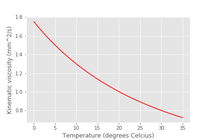

.. raw:: html

    <embed>
       <link rel="canonical" href="https://aguaclara.github.io/Textbook/Rapid_Mix/RM_Mechanical_Solution.html" />
       
    </embed>

******************************
Rapid Mix Mechanical Solution
******************************

The Numpy command, fortunately, understands how to do matrix/array operations index by index. So if you have two length 5 arrays that you want to multiply index by index, you can simply multiply them! This will allow you to focus more on the rest of the code rather than frustrating indexing errors.

``array3 = array1*array2``

This is more elegant and easier to troubleshoot than:

``array3 = np.empty_like(array1) for i in range (0,len(array1)): array3[i] = array1[i]*array2[i]``

Numpy can handle addition, subtraction, multiplication, and division between arrays.

This design challenge contains two parts: - In the first section, we will explore the energy requirements and operating costs for conventional mechanized rapid mix. This provides an opportunity to learn about the consequences of failing to design for sustainability. Rapid mix is both poorly understood and potentially very important in determining the successful operation of a water treatment plant. - In the second section, we will explore the energy dissipation rate in a free jet.

Part 1: Temperature effects, energy use, and operating costs
============================================================

**1) Create a graph** of the kinematic viscosity of water as a function of temperature. Use the ``pc.viscosity_kinematic`` function.

  #. Create an array of temperatures (0 to 35) using ``np.linspace`` to create a dimensionless array. Then, attach appropriate temperature dimensions to the array by multiplying by the units. You can do this in one line!
  #. Pass the entire array of temperatures to the kinematic viscosity function in aguaclara.core.pc to obtain an array of corresponding viscosities.
  #. Plot viscosity (mm^2/s) as a function of temperature (Celsius).

`Colab worksheet plotting viscosity as a function temperature <https://colab.research.google.com/drive/1tq6eHiIw47JGIPd4P_16AsewbC5GsEMk#scrollTo=KrQbKPFS9Trz&line=1&uniqifier=1>`_

.. _figure_Kinematic_vs_T:

   Kinematic viscosity decreases rapidly with temperature. This will influence the amount of fluid deformation obtained given an input of energy. It will also influence the flow rate in the AguaClara chemical dosing system.

We will design a mechanized rapid mix unit and then analyze the energy costs of mixing for a conventional water treatment plant. Below is a table of conventional design parameters.

+--------------------+-----------------------------+-----------------------+
| Residence Time (s) | Velocity Gradient (G) (1/s) | Equivalent Height (m) |
+====================+=============================+=======================+
| 0.5                | 4000                        | 0.8                   |
+--------------------+-----------------------------+-----------------------+
| 10 - 20            | 1500                        | 2.3 - 4.6             |
+--------------------+-----------------------------+-----------------------+
| 20 - 30            | 950                         | 1.8 - 2.8             |
+--------------------+-----------------------------+-----------------------+
| 30 - 40            | 850                         | 2.2 - 2.9             |
+--------------------+-----------------------------+-----------------------+
| 40 - 130           | 750                         | 2.3 - 7.5             |
+--------------------+-----------------------------+-----------------------+

**2) Define a function** for the power required to run a rapid mix unit. The rapid mix shaft power function should have flow, velocity gradient, residence time (which can be described with t or :math:`\theta`, as in the equation below), and temperature as its only inputs.

.. math:: P = G^2Q \theta \nu \rho

Using your function, plot the shaft power (kW) required for a conventional rapid mix unit that has a residence time of t = 15s, a velocity gradient of G = 1500/s, and a flow rate of 50 L/s as a function of temperature (Celsius).

<Colab worksheet to plot the shaft power <https://colab.research.google.com/drive/1tq6eHiIw47JGIPd4P_16AsewbC5GsEMk#scrollTo=o25pKAfQ9dPu&line=2&uniqifier=1>`_

.. _figure_Shaft_Power:

.. figure:: ../Images/Shaft_Power.png
   :width: 400px
   :align: center
   :alt: Rapid Mix shaft power

   Rapid mix shaft power required as a function of temperature. Significantly more power is required at low temperatures to overcome the effects of viscosity. This does assume that the goal for rapid mix is to achieve a target

**3) Calculate the shaft power.** How would the shaft power for a conventional design be selected? You must consider the fact that temperature changes throughout the year, and temperature impacts the shaft power requirements as defined in your function above. Presumably, you should use the lowest water temperature that you expect to have to treat to make your design because low temperatures require the highest shaft power input (as shown in your graph above) and we want to design for the most conservative option.

Imagine you are designing a rapid mix unit for a water treatment plant in upstate NY. Water freezes in the winter, so the power requirements to run a rapid mix must be based on TempDesign = 0 °C.

What is the required shaft power **in horsepower** for your water treatment plant in upstate NY? Calculate the shaft power using the design temperature, and take other necessary parameters from Problem 2.

You can `find pint’s unit registry
here. <https://github.com/hgrecco/pint/blob/c5925bfdab09c75a26bb70cd29fb3d34eed56a5f/pint/default_en_0.6.txt>`__. We recommend bookmarking this page!

`Colab worksheet calculating the required power <https://colab.research.google.com/drive/1tq6eHiIw47JGIPd4P_16AsewbC5GsEMk#scrollTo=IAoPyhsK9tRB&line=3&uniqifier=1>`_

The required shaft power is 4.0 hp.

**4) Find the equivalent height** in meters that this much shaft power could elevate the water in a pump, assuming the pump is 100% efficient? Dimensional analysis of units is useful for this question. How do you get from units of power to units of length, and what constants will get you there?

You may assume 100% efficiency in conversion of shaft power to increased potential energy. For comparison, the difference in water level between the entrance tank and flocculator for an AguaClara plant is less than 40 cm, and 20 cm of that elevation drop is used for flow measurement in the LFOM.

`Colab worksheet calculating the equivalent height <https://colab.research.google.com/drive/1tq6eHiIw47JGIPd4P_16AsewbC5GsEMk#scrollTo=iccuk41t91Fz&line=1&uniqifier=1>`_

The equivalent height is 6.034 m

**5a) Select a motor** that can provide the required shaft power, as calculated in Problem 3.

-  First, bring in the ``motor_efficiency.xlsx`` file provided for this design challenge. You imported a similar file in Problem 13 of DC Python Tutorial 2, but this time you will use ``pd.read_excel('filename.xlsx')`` since the file is .xlsx instead of .csv.
-  Display the extracted excel data, ``motor_efficiency.xlsx``.
-  Extract the column of available horsepower and the column of premium efficiencies from the excel file and place them within their own 1D numpy arrays.
-  Apply appropriate units to the two extracted numpy arrays.

**NOTE:** The variable to which you assign the extracted excel document is a special type of data structure called a `dataframe <https://pandas.pydata.org/pandas-docs/stable/dsintro.html#dataframe>`__. You can call a column of data from a dataframe by ‘indexing’ by the columns title in the original file, like ``dataframe['Horsepower']``. Make sure the column header is input as a string!

`Colab worksheet creating the correct array <https://colab.research.google.com/drive/1tq6eHiIw47JGIPd4P_16AsewbC5GsEMk#scrollTo=nhp0DVic-B3K&line=8&uniqifier=1>`_

**5b) Find a motor that is large enough to drive the rapid mix impeller.**
It is common in engineering design to have target design value that must be rounded up to the next available manufactured value. In the Flow Control and Measurement Design Challenge, we used this method to take a minimum pipe size required to deliver a target flow rate and then we rounded up to the nearest commonly available pipe size. We wrote a function, ``ceil_nearest`` in aguaclara.core.utility, that we used to select pipe sizes. Use that function to find a motor that is large enough to drive the rapid mix impeller (`What’s an impeller? <https://en.wikipedia.org/wiki/Impeller#In_pumps>`__).

`See how the choose the correct motor <https://colab.research.google.com/drive/1tq6eHiIw47JGIPd4P_16AsewbC5GsEMk#scrollTo=UEXCZ31D_hHl&line=1&uniqifier=1>`_

The rapid mix motor has 5 hp.

**6) Find the efficiency of this motor.**

6a) One way to do this is to find the index (row number) of this motor horsepower in the original dataframe (or in your created array) and then use that index to find its corresponding efficiency. Use the ``np.where`` function to find the index of the motor horsepower. The ``where`` function will return an array, so you will need to use indexes on the returned array to extract the index of the motor. If you display the returned results, it will help you figure out how to use indexes to get the desired element.

The input in ``np.where(input)`` is ‘number you’re looking to match == array you’re looking to match it to’. Example: ``np.where(variable == array)``

It is likely you will get the following output:
``(array([8], dtype=int64),)``

How to make sense of this? The parentheses around the entire output specify an array (note the comma before the final parentheses, specifying a blank second index). So you can index with square brackets to call the value within the array (Perhaps try index 0?). You should then get another array. How do you extract the value within this new array?

`Find the index of the motor <https://colab.research.google.com/drive/1tq6eHiIw47JGIPd4P_16AsewbC5GsEMk#scrollTo=7bB7njbF_j1y&line=1&uniqifier=1>`_

6b) You will now use the index of the motor horsepower that you just found to extract the efficiency of the motor. This can be done by calling the index on the array of efficiencies you created or by calling on data from the original dataframe. Dataframes have a method called `get_value <https://pandas.pydata.org/pandas-docs/stable/generated/pandas.DataFrame.get_value.html>`__ that can return an element in a dataframe given a row index and a column heading. This is done for you as an example.

For this problem, **extract the efficiency of the motor by calling the index on the array you created in Problem 5a. Return the motor efficiency as a fraction rather than as a percent**.

Note: it would have been much easier to simply define a variable and type in the efficiency. However, if we did that, it would have broken dependency; the notebook wouldn’t update correctly when you change the flow rate. Our goal is to create designs that scale correctly when the flow rate is changed.

 `Get the motor efficiency <https://colab.research.google.com/drive/1tq6eHiIw47JGIPd4P_16AsewbC5GsEMk#scrollTo=D5Xan45W_oHX&line=1&uniqifier=1>`_

    The motor efficiency is 0.896.

You might think that the rapid mix unit will take less electrical power when the water is warmer. But that isn’t the case because the Reynolds number for the rapid mix propeller is quite high and thus the drag coefficient is independent of Re. This means that the torque required to spin the propeller doesn’t change as the viscosity of the water changes. It would be possible to run the propeller slower when the water is warmer because the required energy dissipation rate is lower, but that would require a variable speed drive. You could add a variable speed motor controller to take advantage of this. However, the bigger problem is that we don’t yet have a good model explaining what rapid mix does.

**7) Find a sufficient motor** and link to its specifications

Now, we want to find a 3 phase, 1800 rpm (approximately!) electric motor that is totally enclosed and fan cooled (TEFC), and that has enough power to operate your rapid mixer at `McMaster Carr <https://www.mcmaster.com/>`__. You can find the link to the CAD drawing if you pretend you are going to select the motor for purchase. This part of the design challenge breaks dependency.

Once you find a sufficient motor, **display the CAD drawing of the motor and create a hyperlink to the motor specifications**.

Notes: we don’t currently know how to select and link to the correct motor using python, which is why you need to go to the McMaster Carr website to find the correct motor. If you know of an easy way to do this, please let us know!

The motor specifications are given below.

The `motor specifications <https://www.mcmaster.com/#5990k314/=19d4hod>`__ indicate that the efficiency is 89.5% which is very close to the premium efficiency standard.

**8) Find the cost** of the motor.

How much does the motor cost? Create a variable showing the cost of the motor in USD. We have added USD to pint, so you will not find it in the original registry linked in Problem 3. The abbreviation for US Dollars is ``u.USD``.

`Get the cost of the motor <https://colab.research.google.com/drive/1tq6eHiIw47JGIPd4P_16AsewbC5GsEMk#scrollTo=Wyub0oW6BFHt&line=1&uniqifier=1>`_

The cost of the motor is 714.6 dollars.

**9) Determine the cost of electricity** to operate the rapid mix unit you sized for your water treatment plant in NY.

9a) Find the commercial rate for electricity in NY state at the `U.S. Energy Administration Website <https://www.eia.gov/electricity/data/browser/#/topic/7?agg=0,1&geo=0002&endsec=vg&linechart=ELEC.PRICE.NY-ALL.M~ELEC.PRICE.NY-RES.M~ELEC.PRICE.NY-COM.M~ELEC.PRICE.NY-IND.M~ELEC.PRICE.NY-TRA.M&columnchart=ELEC.PRICE.NY-ALL.M&map=ELEC.PRICE.NY-ALL.M&freq=M&start=200101&end=201706&chartindexed=0&ctype=linechart&ltype=pin&rtype=s&maptype=0&rse=0&pin=>`__. Download the data file for NY and then import the data file using pandas (``read_csv``). There are two versions of the csv data file on this page. The one you should use in this problem is titled ``Average_retail_price_of_electricity_monthly.csv``.

For this step, simply **display the resulting data table showing the most recent 12 months of electricity costs in NY**.

Note that this data file has meta information about the data in the first rows. You can `delete those rows by setting header = 4 <https://pandas.pydata.org/pandas-docs/stable/generated/pandas.read_csv.html>`__ in the function call to the ``pd.read_csv``. You can read exactly one year of data by setting nrows = 12. This will make it easy to calculate the average cost for the past year.

`Import the Electricity cost data <https://colab.research.google.com/drive/1tq6eHiIw47JGIPd4P_16AsewbC5GsEMk#scrollTo=YkUI7CpyBIkC&line=4&uniqifier=1>`_

9b) Calculate the average commercial electricity cost for the most recent 12 months. Include the appropriate units. Don’t forget to correct for the fact that the prices are given in cents and not dollars.

`Get the New York State energy rate <https://colab.research.google.com/drive/1tq6eHiIw47JGIPd4P_16AsewbC5GsEMk#scrollTo=nncam7WwEYcV&line=2&uniqifier=1>`_

The New York State commercial electricity cost for the past year was 0.14622 USD/kWh.

9c) I think that we should buy electricity in giga Joules. KiloWatt-hr is what you get when someone who loves English units decides they don’t like seconds as the base unit of time that is the standard in the metric system.

How much would a giga Joule cost for the most recent 12 months? All you have to do is change the displayed units!

Look through the pint unit registry. To add orders of magnitude (like kilo, micro, giga, yotta), simply place the appropriate prefix before the usual unit abbreviation. A yotta-meter is ``u.Ym``, for example, as ‘``Y``’ represents yotta- in pint.

`See the unit change <https://colab.research.google.com/drive/1tq6eHiIw47JGIPd4P_16AsewbC5GsEMk#scrollTo=boIVOsdOEZcy&line=1&uniqifier=1>`_

The price of electricity is 40.62 USD/GJ.

9d) Let’s look back to our design of a rapid mix unit for a water treatment plant in New York. Estimate the electricity demand \* **in kilowatts** \* for the rapid mix by taking the shaft power required and adjust for the efficiency of the motor that you have selected. Note that when a motor is running it does not necessarily operate at full load and hence at full power. Electric motors maintain their efficiency over a wide range of loads. To calculate the electricity consumption, use the actual shaft power required by the rapid mix and the motor efficiency. Calculate the electrical power required by the motor when the water is at its coldest.

`Determine the power required <https://colab.research.google.com/drive/1tq6eHiIw47JGIPd4P_16AsewbC5GsEMk#scrollTo=3JdNPmgiEbvG&line=2&uniqifier=1>`_

The power required by the motor is 3.30 kW.

`Determine the power in horsepower <https://colab.research.google.com/drive/1tq6eHiIw47JGIPd4P_16AsewbC5GsEMk#scrollTo=VFULuIx_EfHm&line=1&uniqifier=1>`_

3.967125458280934 horsepower.

9e) Calculate the annual cost of electricity in dollars required to operate the rapid mix unit. `Colab worksheet calculating annual electricity cost <https://colab.research.google.com/drive/1tq6eHiIw47JGIPd4P_16AsewbC5GsEMk#scrollTo=H62VQXODEjyn&line=2&uniqifier=1>`_

The cost of electricity to operate the rapid mix unit is 4232 USD/year per 3.302 kilowatts, or 0.1462 USD/kilowatt_hour.

9f) What is the total cumulative energy costs for the rapid mix unit over a period of 25 years? Note that we are not including the projected increase in electricity costs over the next 25 years. That would be a nice addition to this analysis that would make the need for energy efficiency all the more apparent, but we are ignoring that complexity for this problem.

`Colab worksheet calculating the cumulative energy cost <https://colab.research.google.com/drive/1tq6eHiIw47JGIPd4P_16AsewbC5GsEMk#scrollTo=TFup2VQLEp1K&line=2&uniqifier=1>`_

The cumulative energy costs for a period of 25 years is 105794.0 USD.

**10) Write a paragraph** describing what you learned from this design challenge. Include reflections on the temptation to use a standard design, the low capital cost of energy wasting designs, and the long term implications of engineering that isn’t guided by a goal of sustainability.
