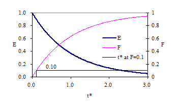

.. _title_Reactor_Characteristics:

***********************
Reactor Characteristics
***********************

.. _heading_Reactor_Introduction:

Introduction
============

Chemical, biological, and physical processes in nature and in engineered systems usually take place in what we call "reactors." Reactors are defined by a real or imaginary boundary that physically confines the processes. Lakes, segments of a river, and settling tanks in treatment plants are examples of reactors. Most, but not all, reactors experience continuous flow (in and out). Sequencing batch reactors have a sequence of states including fill, react, and empty. It is important to know the mixing level and residence time in reactors, since they both affect the degree of process reaction that occurs while the fluid (usually water) and its components (often pollutants) pass through the reactor.

Chlorine contactor tanks are designed to maximize the contact time between chlorine and pathogens before the water is delivered to consumers. Thus the design objective is to maximize the time that it takes for water to travel from the tank influent to the effluent. Tracer studies can be used to determine the hydraulic characteristics of a reactor such as the disinfection contact tanks at water treatment plants. The results from tracer studies are used to obtain accurate estimates of the effective contact time. In this laboratory students will experiment with different reactor designs with the goal of maximizing the contact time.

.. _heading_Reactor_Classifications:

Classifications
===============

Dispersion
----------

Mixing levels give rise to three categories of reactors; completely mixed flow reactors (CMFR), plug flow reactors (PFR) and flow with dispersion reactors (FDR). The plug flow reactor is an idealized extreme not attainable in practice. All real reactors fall under the category of FDR or CMFR.

Boundary Conditions
-------------------

The reactor inlet and outlet boundary conditions significantly affect the reactor response to the addition of a pulse of tracer. If dispersion is possible across a boundary, then the boundary is open. An example of a reactor with open boundaries is a section of a river. If a tracer is added to a section of a river it is possible for some of the tracer to move upstream, illustrating that an arbitrary section of a river is an open reactor (:numref:`figure_open_boundaries`). This is equivalent to letting the reactor be defined as a section of a long reactor. One of the characteristics of open boundaries is that some of the tracer introduced at the reactor inlet can be carried upstream and thus the residence time for a conservative tracer can be greater than the hydraulic residence time!

.. _figure_open_boundaries:

    Schematic of a reactor with open boundary conditions.

A closed reactor is one where the reactor has a diffusion or dispersion coefficient different than those of the entrance or exit (:numref:`figure_closed_boundaries`).  Typically exit and entrance diffusion/dispersion are much less than the diffusion/dispersion in the reactor. An example of a reactor with closed boundaries is a tank with small inlet and outlet pipes.

.. _figure_closed_boundaries:

    Schematic of a reactor with closed boundary conditions.

.. _heading_Reactor_Modeling:

Modeling
--------

Reactors can be studied by measuring the effluent concentration after the addition of a spike or pulse of a tracer in the influent or after a step function change in input concentration. The resulting response curves can be made non-dimensional by plotting :math:`\frac{C_{\left({t\mathord{\left/ {\vphantom {t \theta }} \right. \kern-\nulldelimiterspace} \theta } \right)} \rlap{-} V _{r} }{C_{tr} \rlap{-} V _{tr} }` as a function of :math:`{t\mathord{\left/ {\vphantom {t \theta }} \right. \kern-\nulldelimiterspace} \theta }` where :math:`\theta` is the hydraulic residence time. The term :math:`{t\mathord{\left/ {\vphantom {t \theta }} \right. \kern-\nulldelimiterspace} \theta }` will be defined as :math:`t^{\star}`. The non-dimensional response curves from pulse inputs and step inputs are known as E curves and F curves, respectively. The E curve is the exit age distribution and represents the actual output of tracer from a reactor.  The F curve is the cumulative age distribution and represents the cumulative fraction of tracer that has exited a reactor at time $t^{\star} $. The E and F curves are related by

.. math::

    F_{\left(t^{\star} \right)} =\int _{0}^{t^{\star} }E_{\left(t^{\star} \right)} dt^{\star}

The :math:`F_{\left(t^{\star} \right)}` curve can either be obtained by integrating :math:`E_{\left(t^{\star} \right)}` or by applying a step function change in influent concentration to a reactor and monitoring the effluent concentration. In that case :math:`F_{\left(t^{\star} \right)}` is defined as

.. math::

    F_{\left(t^\star\right)}=\frac{C_{\left(t^\star\right)}}{C_{in}}

The following sections will include typical E and F curves for different reactor types.

Completely Mixed Flow Reactor
-----------------------------

Completely mixed flow regimes can be approximated quite closely in practice. In the case of CMFRs, there is not an analytical solution to the advection-dispersion equation so we revert to a simple mass balance. For a completely mixed reactor a mass balance on a conservative tracer yields the following differential equation:

.. math::
    :label: eq_Reactor_mass_balance

    \rlap{-} V _{r} \frac{dC}{dt} =\left(C_{in} -C\right)Q

where Q is the volumetric flow rate and :math:`\rlap{-} V_r` is the volume of the reactor.

Equation :eq:`eq_Reactor_mass_balance` can be used to predict a variety of effluent responses to tracer inputs. If a pulse of tracer is discharged directly into a reactor so that the initial concentration of tracer in the reactor is :math:`C_{0} =\frac{C_{tr} \rlap{-} V _{tr} }{\rlap{-} V _{r} }` and the input concentration is zero (:math:`C_{in} = 0`) the solution to the differential equation is:

.. math::

    E_{\left(t\right)}=\frac{C_t{\rlap{-} V }_r}{C_{tr}{\rlap{-} V }_{tr}}=e^{\left(-t/\theta \right)}

or in the dimensionless form

.. math::

    E_{\left(t^{\star} \right)} =\frac{C_{\left(t^{\star} \right)} \rlap{-} V _{r} }{C_{tr} \rlap{-} V _{tr} } ={\mathop{e}\nolimits^{\left(-t^{\star} \right)}}

where :math:`E_{\left(t^{\star} \right)}` is the exit age or residence time distribution curve, :math:`\rlap{-} V _{r}` is the reactor volume, :math:`\rlap{-} V _{tr}` is the tracer volume, and :math:`C_{tr}` is the tracer concentration.  If a reactor has a completely mixed flow regime its response, :math:`E_{\left(t^{\star} \right)}`, to a pulse input should plot as a straight line on a semi-logarithmic plot. Response curves for a CMFR are shown in :numref:`figure_CMFR_E_and_F`.

.. _figure_CMFR_E_and_F:

    Exit age (E) and Cumulative exit age (F) curves for completely mixed flow reactors.

The time for 10\% of the pulse to arrive at the effluent of a CMFR is approximately 0.1 :math:`t^{\star}`.

Plug Flow Reactor
-----------------

Plug flow regimes are impossible to attain because mass transport must be by advection alone. There can be no differential displacement of tracer relative to the average advective velocity. In practice some mixing will occur due to molecular diffusion, turbulent dispersion, and/or fluid shear. For the case of the plug flow reactor the advection-dispersion equation in 1.7 reduces to:

.. math::

\frac{\partial C}{\partial t} =-U\frac{\partial C}{\partial x}

The velocity, U, serves to transform the directional concentration gradient into a temporal concentration gradient. In other words, a conservative substance moves with the advective flow of the fluid. The solutions to this differential equation for a pulse input and for a step input are shown graphically in :numref:`figure_PFR_pulse_step`. The time for 10\% of the pulse to arrive at the effluent of a PFR is :math:`t^{\star}` since all of the pulse arrives at the same time.

.. _figure_PFR_pulse_step:

    Pulse and step input in a plug flow reactor.

Flow with Dispersion
--------------------

Real flow reactors that aren't completely mixed exhibit behavior that is between plug flow and completely mixed. The reactor flow behavior is a function of the relative strength of the mixing process (or dispersion) compared to the advective flow. Analytical solutions that describe these real reactors are more difficult and in most cases a parameter describing the dispersion is fit to the data rather than predicted *a priori*. Two models for arbitrary mixing levels are described below.

Open Boundary conditions: One Dimensional Advection-Dispersion Equation
-----------------------------------------------------------------------

The governing differential equation for a conservative (i.e., non-reactive) substance in a reactor that has advective transport (i.e., flow) and some mixing (dispersion) in the direction of flow (x - dimension) is given in equation :eq:`eq_Reactor_diff_advect_disperse`.

.. math::
    :label: eq_Reactor_diff_advect_disperse

    \frac{\partial C}{\partial t} ={\rm \; -U}\frac{\partial C}{\partial x} +{\rm \; D}_{{\rm d}} \frac{\partial ^{2} C}{\partial x^{2}}

 | C = concentration of a conservative substance
 | U = average fluid velocity in the x direction
 | Dd = longitudinal dispersion coefficient
 | t = time

The dispersion is described by a single parameter that is the same in the reactor as it is at the inlet and outlet for open boundary conditions. The solution to :eq:`eq_Reactor_diff_advect_disperse` for the case of complete mixing in the y-z plane and advective and dispersive transport only in the x direction for any x and t (after t=0) gives:

.. math::
    :label: eq_Reactor_advect_disperse

    {\rm C(x,t)\; }={\rm \; }\frac{M}{A\sqrt{4\pi D_{d} t} } \exp \left[\frac{-x'^{2} }{4D_{d} t} \right]

 | M = mass of conservative material in the spike
 | :math:`D_{d}` = axial dispersion coefficient [L2/T],
 | x' = x - Ut, U = longitudinal advective velocity in the reactor,
 | A is the cross-sectional area of the reactor.

A measure of dispersion can be obtained directly from equation :eq:`eq_Reactor_advect_disperse`. From this equation we expect a maximum value of C at t = x/U. At this time :math:`{\rm C(x,t)\; }={\rm \; }\frac{M}{A\sqrt{4\pi D_{d} t} }` . If the mass of the tracer input (M) and reactor cross-sectional area (A) are known, then :math:`D_{d}` can be estimated. Equation :eq:`eq_Reactor_advect_disperse` can be made dimensionless to more clearly reveal the important parameters. The dispersion coefficient can be made dimensionless by dividing into a velocity and a length.

.. math::
    :label: eq_Reactor_Pe

    Pe=\frac{UL}{D_{d}}

where L is the length of the reactor and U is the mean advective velocity. The dimensionless parameter Pe (Peclet number) is used to characterize the level of dispersion in a reactor. The Peclet number is the ratio of advective to dispersive transport. In the limiting cases when Pe = 0 (very high dispersion) we have a completely mixed regime (CMFR) and when :math:`Pe = $\mathrm{\infty}`, :math:`D_{d}` = 0, no dispersion) we have a plug flow reactor (PFR).

The time can be normalized by dividing by the hydraulic residence time.

.. math::
    :label: eq_Reactor_tstar

    t^{\star} =\frac{tU}{L}

Combining Equations :eq:`eq_Reactor_Pe` and :eq:`eq_Reactor_tstar` we obtain :math:`$D_{d} t=t^{\star} PeL^{2}` for substitution into Equation :eq:`eq_Reactor_advect_disperse`. The concentration can be normalized by the mass of the tracer and the volume, :math:`\rlap{-} V`, of the reactor.

.. math::

    \rlap{-} V =AL

.. math::

    E_{\left(t^{\star} \right)} =\frac{{\rm C(x,t)}\rlap{-} V }{{\rm M}}

The position in the reactor where the concentration measurements are made can be changed to the reactor effluent by substituting L for x. Substituting Equation :eq:`eq_Reactor_tstar` into the definition of :math:`x'^{2}` we obtain:

.. math::

    x'^{2} =\left(L-Ut\right)^{2} =\left(1-t^{\star} \right)^{2} L^{2}

The resulting dimensionless form of Equation :eq:`eq_Reactor_advect_disperse` is given in Equation :eq:`eq_Reactor_E_AD`.

.. math::
    :label: eq_Reactor_E_AD

    E_{\left(t^{\star} \right)} =\sqrt{\frac{Pe}{4\pi t^{\star} } } \exp \left[\frac{-\left(1-t^{\star} \right)^{2} Pe}{4t^{\star} } \right]

Response curves for the advection-dispersion equation are shown in :numref:`figure_E_F_Pe_100` and :numref:`figure_E_F_Pe_4.png`. The exit age curve is highly skewed for low Pe because tracer that is in the reactor longer has more time for dispersion. As the Peclet number increases the dispersion decreases and the response becomes closer to plug flow.

.. _figure_E_F_Pe_100:

    Exit age (E) and cumulative exit age (F) curves for the advection-dispersion equation with Pe of 100.

.. _figure_E_F_Pe_4:

    Exit age (E) and cumulative exit age (F) curves for the advection-dispersion equation with Pe of 4.

Flow through porous media (such as groundwater through soil) is a type of flow with dispersion. The above equations can be applied by recognizing that the relevant water velocity is the pore water velocity. The pore water velocity is :math:`U = \frac{Q}{A\phi }` where A is the cross sectional area of the porous media and :math:`\phi` (volume of voids/total volume) is the porosity of the porous media.

The form of equation :eq:`eq_Reactor_advect_disperse` is exactly like the normal distribution curve:

.. math::

    \frac{CA}{M} ={\rm \; }\frac{1}{\sigma _{x} \sqrt{2\pi } } \exp \left[\frac{-x^{2} }{4\sigma _{x}^{2} } \right]

where

.. math::
    :label: eq_Reactor_sigma

    \sigma _{x}^{2} =2D_{d} t

Or in dimensionless form:

.. math::

    \frac{\sigma _{x}^{2} }{L^{2} } =2t^{\star} Pe

The variance in concentration over space (:math:`\sigma _{x}^{2}`) is the variance in concentrations taken from many different positions in the reactor at some single moment in time, t. The variance in x (:math:`\sigma _{x}^{2}`) has dimensions of length squared.

Closed Boundary Conditions: Completely Mixed Flow Reactor in Series
-------------------------------------------------------------------

Completely mixed flow reactors are sometimes connected in series to create a reactor system with flow characteristics in between CMFR and PFR. CMFRs in series increase overall process efficiency because the reactants are at higher concentrations in the first reactors than they would be in a single large CMFR. Thus the total reactor volume can be smaller with a series of CMFRs. Similarly the reaction process can be made more efficient given the same reactor volume if it is divided into a series of CMFRs.

Non ideal reactors with mixing levels between that of CMFRs and PFRs and reactors containing baffles can also be modeled as a series of CMFRs. In this case the mixing level for the system is represented by the number of CMFRs that are used to represent the non-ideal reactor. The equation describing the concentration of a conservative tracer in the :math:`N^{th}` reactor is given in equation :eq:`eq_Reactor_C_N_CMFR`.

.. math::
    :label: eq_Reactor_C_N_CMFR

    \frac{C_{N} \left(t\right)\rlap{-} V }{M} =\frac{N^N}{\left(N-1\right)!} \left(\frac{t}{\theta} \right)^{N-1} {\mathop{e}\nolimits^{{}^{\left(\frac{-Nt}{\theta} \right)} }}

The non-dimensional form of equation :eq:`eq_Reactor_C_N_CMFR` is given in equation :eq:`eq_Reactor_E_N_CMFR`

.. math::
    :label: eq_Reactor_E_N_CMFR

    {E_{N}}_{\left(t^{\star} \right)} = \frac{N^N}{\left(N-1\right)!} \left(t^{\star} \right)^{N-1} {\mathop{e}\nolimits^{{}^{\left(-Nt^{\star} \right)} }}

It can be shown that equations :eq:`eq_Reactor_E_AD` and :eq:`eq_Reactor_E_N_CMFR` converge for large N when

.. math::

    Pe=2N

Equation :eq:`eq_Reactor_C_N_CMFR` is limited to integer values of N. The model can be extended to include non-integer values of N if the factorial function (i.e., (N-1)!) were replaced with the :math:`\Gamma` function. This extension is particularly beneficial when fitting data to the models because the :math:`\Gamma` function is continuous.

Response curves for the advection-dispersion equation are shown in :numref:`figure_E_F_N_2`. Notice that the effluent concentration begins to rise much more quickly in series CMFRs than in the advection-dispersion model for a single CMFR. This distinction between the two models lessens as the number of reactors increases and the *Pe* increases.

.. _figure_E_F_N_2:

.. figure:: Images/E_F_N_2.png
    :width: 300px
    :align: center
    :alt: E_F_N_2

    Exit age (E) and cumulative exit age (F) curves for series CMFR with N of 2.

.. _heading_Reactor_Studies:

Reactor Studies
===============

One of the easiest methods to determine the mixing (dispersion) characteristics of a reactor is to add a spike input of a conservative material and then monitor the concentration of the material in the reactor effluent. The variance of tracer concentration versus time (:math:`\sigma _{t}^{2}`, with dimensions of time squared) can be measured by sampling at a single point in the reactor at many different times and can be computed using the following equations.

.. math::

    \sigma _{t}^{2} \; =\; \frac{\int _{0}^{\infty }C(t)(t-\bar{t})^{2}  dt}{\int _{0}^{\infty }C(t) dt} =\; \frac{\int _{0}^{\infty }t^{2} \cdot C(t) dt}{\int _{0}^{\infty }C(t) dt} -\; \bar{t}^{2}

where
.. math::

    \bar{t}{\rm \; }={\rm \; }\frac{\int _{0}^{\infty }t\; C(t)dt }{\int _{0}^{\infty }C(t)dt }

For discrete data points:

.. math::
    :label: eq_Reactor_sigma

    \sigma _{t}^{2} =\; \frac{\sum _{i=0}^{n}t_{i}^{2} \cdot C_{i}  \Delta t}{\sum _{i=0}^{n}C_{i}  \Delta t} -\; \bar{t}^{2}

and

.. math::
    :label: eq_Reactor_tbar

    \bar{t}=\; \frac{\sum _{i=0}^{n}t_{i} \cdot C_{i}  \Delta t}{\sum _{i=0}^{n}C_{i}  \Delta t}

Inlet and outlet boundary conditions affect the response obtained from a reactor. Closed reactors have little dispersion across their inlet and outlet boundaries whereas open reactors can have significant dispersion across their inlet and outlet boundaries. Typically open systems have no physical boundaries in the direction of flow. An example of an open system would be a river segment. Closed systems have small inlets and outlets that minimize dispersion across the inlet and outlet regions. An example of a closed system is a tank (or a lake) with a small inlet and outlet. The reactor used in the lab is closed. The $\bar{t}$ in equation :eq:`eq_Reactor_tbar` is the measured average residence time for the tracer in the reactor. For ideal closed reactors the measured residence time, $\bar{t}$, is equal to the theoretical hydraulic residence time (? = reactor volume/flow rate). For open reactors $\bar{t}$ can exceed the hydraulic residence time. If $\bar{t}$ is less than the hydraulic residence time it may indicate that the reactor contains "dead volume" or "short circuiting" such that some volume of the reactor is effectively unused.

The above equations suggest that from the reactor response to a spike input we can compute the dispersion coefficient for the reactor. We have two options for measuring reactor response:

 #. synoptic measurements: at a fixed time sampling many points along the axis of the reactor will yield a Gaussian curve of concentration vs. distance. In practice synoptic measurements are difficult because it requires sampling devices that are time-coordinated. By combining equations :eq:`eq_Reactor_sigma`, :eq:`eq_Reactor_sigma`, and :eq:`eq_Reactor_tbar` it is possible to estimate the dispersion coefficient from synoptic measurements.
 #. single point sampling: measure the concentration at a fixed position along the x axis of the reactor for many times. If the reactor length is fixed at L and measurements are made at the effluent of the reactor (observe the concentration of a tracer at x = L as a function of time) then x is no longer a variable and C(x,t) becomes C(t) only. The response curve obtained through single point sampling is skewed. The curve spread changes during the sampling period and the response curve is skewed.

Peclet Number Estimation
------------------------

For single point sampling of the effluent response curve, skew increases as the dispersion level in the reactor increases. The degree of skew depends on the dispersion coefficient, the velocity in the x-direction, and the length of the reactor. Peclet values in the range :math:`100\mathrm{<}$Pe$\mathrm{<}$$\mathrm{\infty}` result in a symmetric response curve.

Response curve skew makes the assumption of a symmetrical normal distribution curve inappropriate and a new relationship between the variance and the dispersion coefficient (or \textit{Pe}) has to be determined. Boundary conditions affect the determination of the dispersion coefficient. The relationship between the Peclet number and variance for open systems is given by

.. math::
    :label: eq_Reactor_sigma_open

    \sigma _{t}^{2} =\left(\frac{2}{Pe} +\frac{8}{Pe^{2} } \right)\cdot \theta ^{2}

 For closed systems the relationship is:

.. math::
    :label: eq_Reactor_sigma_closed

    \sigma _{t}^{2} =\left[\frac{2}{Pe} -\frac{2}{Pe^{2} } \cdot \left(1-{\mathop{e}\nolimits^{-Pe}} \right)\right]\cdot \theta ^{2}

The term :math:`\frac{2}{Pe}` in equations :eq:`eq_Reactor_sigma_open` and :eq:`eq_Reactor_sigma_open` is dominant for Peclet numbers much greater than 10 as is shown in :numref:`Pe_open_and_closed`. The additional terms in equations :eq:`eq_Reactor_sigma_open` and :eq:`eq_Reactor_sigma_open` are corrections for skewedness in the response curve. These skewedness corrections are not very significant for Peclet numbers greater than 10. Thus for Peclet numbers greater than 10 the Peclet number can be determined using equation :eq:`eq_Reactor_sigma_approx` for both open and closed systems.

.. _figure_Pe_open_and_closed:

.. figure:: Images/Pe_open_and_closed.png
    :width: 300px
    :align: center
    :alt: Pe_open_and_closed

    Relationship between equations :eq:`eq_Reactor_sigma_open` through :eq:`eq_Reactor_sigma_open`.

.. math::
    :label: eq_Reactor_sigma_approx
    Pe=\frac{2\theta ^{2} }{\sigma _{t}^{2} }

Mass Conservation
-----------------

When a pulse of conservative tracer is added to a continuous flow reactor, all of the tracer is expected to leave the reactor eventually. The mass of a substance that has left the reactor is given in equation :eq:`eq_Reactor_Mout`.

.. math::
    :label: eq_Reactor_Mout

    M_{out} =\sum _{i=0}^{n}QC_{i} \Delta t_{i}

where Q is the flow rate and M is the mass of any substance whose concentration is given by C. If Q and :math:`\mathrm{\Delta}t` are constant, then equation :eq:`eq_Reactor_Mout` can be rewritten as

.. math::
    :label: eq_Reactor_Mout_constantQ

    M_{out} =Q\Delta t\sum _{i=0}^{n}C_{i}

Equation :eq:`eq_Reactor_Mout_constantQ` can be used to determine if all of the tracer was measured in the reactor effluent. Alternately, mass conservation can be checked by plotting the F curve and checking if the plot approaches #. If some of the tracer is in the reactor at the end of the experiment then the following equation can be used to test for mass closure.

.. math::

    M_{in} =M_{out} +\Delta M_{stored}

.. _heading_Reactor_Tracers:

Tracers
=======

A conservative tracer will be used to characterize your reactors. Typical tracers include salt and various dyes. For this experiment we will use \#40 Red Dye as the conservative tracer. The red dye concentration will be measured using an optical spectrophotometric probe. The linear range of operation for the probes is from about 0.01 mg/L to 30 mg/L. We will add an amount of red dye near the high end of this range to acquire a dataset that spans multiple orders of magnitude.

Additional constraints for the tracer are that if a highly concentrated tracer is used, then there will be a significant density difference between the tracer and the water in the reactor. If a very dilute tracer is used then a large volume of tracer will need to be added and the volume of tracer could become a large fraction of the reactor volume and thus the pulse could no longer be modeled as having negligible volume.

The reactors are 30 cm long and 15 cm wide. If the depth is limited to (a maximum of) 5 cm, then the total volume is 2.25 L and with a peristaltic pumping rate of approximately 380 mL/min, the residence time is approximately 6 minutes.

The tracer should be added directly into the first chamber of your reactor. The red dye will also make it possible to qualitatively observe the advective and dispersive transport in the reactors.

Mass balance
------------

Collect data that makes it possible to perform a mass balance on red dye. Note that if it is expedient to shorten an experimental run such that there is a significant quantity of the tracer residual in the reactor, that the mass of the residual (stored) tracer can be measured by pouring the reactor contents into a container and measuring the mass or volume of the mixture. The concentration of red dye in the mixture can be measured be connecting back to the optical probe.

.. _heading_Reactor_Setting_up_the_reactor_for_experiments:

Setting up the reactor for experiments
======================================

See the section on :ref:`calibrate photometer <heading_ProCoDA_Photometer>` to set up the photometer

In these experiments, we will be pumping tap water from a 20 L Jerrican to the influent of your reactor. Place your reactor on a stir plate and make sure that the 3/8'' push-connect fitting is on the effluent side of your reactor (some may have 3/8'' holes on both sides). The effluent of the reactor should be a straight short tube to the drain.

Use a second pump head with \#17 tubing to pull a sample from near the effluent weir through the photometer and then to the drain.

Before running an experiment, it is important to determine whether your setup works. Turn the pump to approximately 380 mL/min and get water flowing through the system and off to waste. Two important things to check:

 #. Is your sensor reading a stable voltage of approximately +3.5V? If not, you might have some air bubbles trapped in the sensor cell. Tap it gently to release the air.
 #. Is the effluent weir working properly or is the reactor gaining volume? We want to maintain a constant volume throughout the experiment, so let the pump run for ten minutes or so and confirm that the volume is stable (put a line or a piece of tape to mark the water level).

.. todo:: Did we switch to a two pump head system with the second pump head using a larger size tubing and removing excess flow from the reactor?

.. _heading_Reactor_Testing_protocol:

Testing protocol
================

To ensure that everything is working properly I recommend that you begin by first testing a CMFR. Use the CMFR data to verify that you obtain mass balance and that you obtain the expected exit age response.

For each test make sure that you accurately measure the reactor volume, residual reactor red dye concentration, and the flow rate. The reactor volume can be approximated by taking the mass of the reactor, as you did to estimate the volume of your lakes.  Measure the residual concentration of red dye in the reactor by measuring the completely mixed concentration (this is just the concentration at the end of the experiment for the CMFR, but you will have to remove the baffles and mix for the baffled reactors). The flow rate can be accurately determined by measuring the volume of a timed sample from the pump.

 #. Log data to file so that you have a record of the red dye concentration in the effluent of the reactor as a function of time.
 #. Prepare to save a text note into the data file indicating the exact moment when you will actually start the experiment.
 #. Add a volume of red dye \#40 stock that will give a maximum concentration of \textbf{approximately} 30 mg/L near the influent of the reactor. Immediately enter the text note to record when the experiment began. For the CMFR you can easily calculate this. For other reactors you may need to try and if necessary repeat the experiment if the tracer concentration goes above the 50 mg/L or if the maximum tracer concentration is below 10 mg/L.
 #. Collect data until the majority of the tracer has exited.
 #. Stop the experiment and pour the contents of the reactor into a container. Weigh the container to determine the exact volume of the reactor.
 #. Sample the contents of the mixed reactor with the photometer to obtain the average concentration in the reactor at the end of your experiment. This will enable you to do a mass balance on the red dye.

Reactor_photo

\includegraphics*[width=3.98in, height=2.98in, keepaspectratio=false]{image14}

\includegraphics*[width=2.83in, height=2.12in, keepaspectratio=false]{image15} \includegraphics*[width=2.84in, height=2.11in, keepaspectratio=false]{image16}

.. _heading_Reactor_Design:

Reactor Design
==============

Baffle Design
-------------

Baffles can be added to tanks to decrease the ability of the solution to travel quickly from the tank inlet to the tank outlet. The goal of the baffle design depends on whether the tank is designed for a reaction or for separation. The baffles in reactors should generally be designed to achieve mixing in each of the baffled zones. The baffles in tanks designed for separation (clarifiers) should be designed to achieve uniform flow (a much more difficult goal to achieve). Mixing within each baffled zone could be achieved with a propeller mixer or by appropriately sized pores in the baffles. If pore mixing is desired the energy for mixing is provided by the kinetic energy of the fluid flowing through the pores.

The flow characteristics of a baffled tank are complex and would require computational fluid dynamics (CFD) to model. In lieu of developing a CFD model we will turn to dimensional analysis to help us characterize the mixing efficiency of a baffled reactor segment. The independent parameter that we will measure to characterize the reactor is its Peclet number or the number of N CMFRs in series.

The design goal is to determine the diameter and spacing of the pores required to achieve adequate mixing. The fluid flow out of the pores is jet flow. The jets entrain and mix with the surrounding fluid. To develop effective mixing the jet should be turbulent. The transition between turbulent and laminar behavior for jets occurs at a jet Reynolds number of a few hundred\footnote{Personal\ communication\ with\ Dr.\ Cowen.}.

.. math::

    Re_{jet} =\frac{V_{jet} d_{jet} }{\nu } $ or $Re_{jet} =\frac{4Q_{jet} }{\pi d_{jet} \nu } $ or $Re_{jet} =\frac{4Q_{reactor} }{n_{ports} \pi d_{jet} \nu } $

The optimal pore spacing for maximum mixing could be based on the spread of the jet in the distance to the next baffle.  Jets expand in the radial direction at a rate of approximately 10\% of the distance the jet travels axially. Thus the pore spacing could be in a rectangular grid with the distance between pores equal to 10\% of the distance between baffles. This spacing may be smaller than practical since it will require a large number of pores.

An additional constraint on pore design is that the head loss through the pores not be excessive. The hydraulic grade line (and thus depth of each baffled reactor) will drop by a distance equal to the head loss through the pores. The head loss through the pores is given by the orifice equation

.. math::

    Q_{orifice} =K_{orifice} A_{orifice} \sqrt{2g\Delta h}

where the orifice coefficient, :math:`K_{orifice}`, has a value of approximately 0.6, the area of the orifice is :math:`A_{orifice}`, and the head loss through the orifice is :math:`\Delta h`.

.. math::

    Q_{orifice} =K_{orifice} \frac{\pi d_{orifice}^{2} }{4} \sqrt{2g\Delta h}

.. math::

    Q_{reactor} =n_{orifice} K_{orifice} \frac{\pi d_{orifice}^{2} }{4} \sqrt{2g\Delta h}

where :math:`n_{orifice}` is the number of pores. Solving for the pore diameter we obtain.

.. math::

    d_{orifice} =\sqrt{\frac{4Q_{reactor} }{\pi n_{orifice} K_{orifice} \sqrt{2g\Delta h} } }

Chlorine Contact Tank Design
----------------------------

The design objective for chlorine contact tanks is to maximize the inactivation of pathogens by maximizing the contact time between the chlorine and the pathogens before the water is sent to the distribution system. This objective has been codified by the EPA with the contact time for a tank defined as the time for the effluent of the tank to reach 10\% of the influent value after a step change in the influent.

\begin{tabular}{|p{0.8in}|p{0.8in}|p{2.4in}|} \hline
\multicolumn{3}{|p{1in}|}{Table \label{1}. Comparison of $t^{\star} \; at\; F=0.1$ for non-ideal reactors (Malcolm Pirnie, 1991)} \\ \hline
Baffling Condition  & Guidance manual value of $t^{\star} \; at\; F=0.1$ & Extent of Baffles \\ \hline
Unbaffled (CMFR) & 0.1 & No baffles, agitated basin with low length to width ratio, high inlet and outlet flow velocities \\ \hline
Poorly baffled & 0.3 & Single or multiple unbaffled inlets and outlets, no intrabasin baffles \\ \hline
Average & 0.5 & Baffled inlet or outlet with some intrabasin baffles \\ \hline
Superior & 0.7 & Perforated inlet baffles, serpentine or perforated intrabasin baffles, outlet weir or perforated launders \\ \hline
Perfect (PFR) & 1.0 & Very high length to width ratio (pipeline flow), perforated inlet, outlet and intrabasin baffles \\ \hline
\end{tabular}

.. _heading_Reactor_Procedures:

Procedures
==========

The reactor you will be working with can be easily modified by installing various configurations of perforated or staggered baffles. Your objectives are

 #. to modify the reactor to obtain a maximum value of :math:`t^{\star}` at F = 0.1.
 #. to document your progress toward this goal by obtaining appropriate experimental data
 #. to compare your experimental data with appropriate models

Note that you are allowed to collaborate with other teams to obtain the results from additional tests. All data sharing must be documented in your report.

Baffle installation
-------------------

The baffles can be installed by rolling a 3 mm diameter roll of putty and applying the putty to the bottom and one side of the baffle. Carefully install the baffle by rotating it into place (so the putty on the one side doesn't have to slide) and then pressing it down (so the putty on the bottom doesn't have to slide). Install the two bolts with wing nuts to hold the baffle in place. Add a roll of putty to the corner formed at the unsealed side of the baffle and press the putty into place.

.. _heading_Reactor_Pre-Laboratory_Questions:

Pre-Laboratory Questions
========================

 #. Calculate the **incremental** volume of a 100 g/L red dye stock that would need to be added to 1 L of water to produce 0, 1, 2, 5, 10, 20, 30, 40, and 50 mg/L calibration points. Calculate a numpy array containing the **cumulative** volume of red dye required. Strip the units from the array using .magnitude. Then create a copy of the array with a zero appended (np.append) in front and the last element deleted (np.delete). Then use numpy subtract to get the different between the two arrays to calculate the incremental volume that you need to add.
 #. Calculate the change in hydraulic grade line between baffled sections of a reactor with a flow rate of 380 mL/min. The reactor baffles are perforated with 6 holes 1 mm in diameter. Is the flow through these orifices in series or in parallel? Do you multiply the head loss for one orifice by the number of orifices to get the total head loss? Use the pc.head\_orifice function to calculate the head loss through an orifice. The *vena contracta* for the orifice can be found at exp.RATIO\_VC\_ORIFICE. Why would 6 holes 1 mm in diameter not be a good design for this reactor?
 #. On a single graph plot the exit age distribution (:math:`E_{(t\star)}`) for a reactor that operates as a 1-dimensional advection-dispersion reactor with Peclet numbers of 1, 10, and 100 (there will be three plots on the graph and thus a legend is required). The x-axis should be :math:`t^\star` from 0.0 to 3.0. Comment on the shapes of the curves as a function of the Peclet number.

.. _heading_Reactor_Data_Analysis:

Data Analysis
=============

You will analyze all of the datasets in the same way. Use a consistent set of units throughout your data analysis and include the units in your python code and discussion!

 #. Use multivariable nonlinear regression to obtain the best fit between the experimental data and the two models by minimizing the sum of the squared errors. Use EPA.Solver\_AD\_Pe and EPA.Solver\_CMFR\_N. These functions will minimize the error by varying the values of average residence time, (mass of tracer/reactor volume), and either the number of CMFR in series or the Peclet number.
 #. Generate a plot showing the experimental data as points and the model results as thin lines for each of your experiments. Explain which model fits best and discuss those results based on your expectations.
 #. Compare the trends in the estimated values of N and Pe across your set of experiments. How did your chosen reactor modifications effect dispersion?
 #. Report the values of :math:`t^{\star}` at F = 0.1 for each of your experiments. Do they meet your expectations?
 #. Evaluate whether there is any evidence of "dead volumes" or "short circuiting" in your reactor.
 #. Make a recommendation for the design of a full scale chlorine contact tank. As part of your recommendation discuss the parameter you chose to vary as part of your experimentation and what the optimal value was determined to be.

.. _heading_Reactor_References:

References
==========

Weber, W. J. J. and F. A. Digiano. 1996. Process Dynamics in Environmental Systems. New York, John Wiley \& Sons, Inc.

Malcolm Pirnie, Inc., and HDR Engineering, Inc. Guidance Manual for Compliance with the Filtration and Disinfection Requirements for Public Water Systems Using Surface Water Sources. AWWA, Denver CO, 1991.

.. _heading_Reactor_Lab_Prep_Notes:

Lab Prep Notes
==============

 Table \label{2}. Equipment list

\begin{tabular}{|p{0.7in}|p{0.7in}|p{0.7in}|} \hline
\textbf{Description} & \textbf{Supplier} & \textbf{Catalog number} \\ \hline
 reactor with baffles & CEE shop &  \\ \hline
variable flow digital drive & Cole Parmer & H-07523-30 \\ \hline
Easy-Load pump head & Cole Parmer & H-07518-00 \\ \hline
PharMed tubing size 18 & Cole Parmer & H-06485-18 \\ \hline
20 liter HDPE Jerrican & Fisher Scientific & 02-961-50C \\ \hline
\end{tabular}

Table \label{3}. Reagent list

\begin{tabular}{|p{0.7in}|p{0.8in}|p{0.7in}|} \hline
\textbf{Description} & \textbf{Supplier/Source} & \textbf{Catalog number} \\ \hline
 &  &  \\ \hline
red dye \#40 & MG Newell & 07704-1 \\ \hline
\end{tabular}

 #. Create 100 mL of 100 g/L red dye stock (thus use 10 g of red dye) and distribute in small vials to each lab bench.
 #. Use \# 18 tubing for inlet and \#17 for photometer sampling.
 #. The maximum concentration of red dye that the photometer can measure accurately is 50 mg/L.
 #. Organize team research so they don't use the same materials and so they answer different questions.
