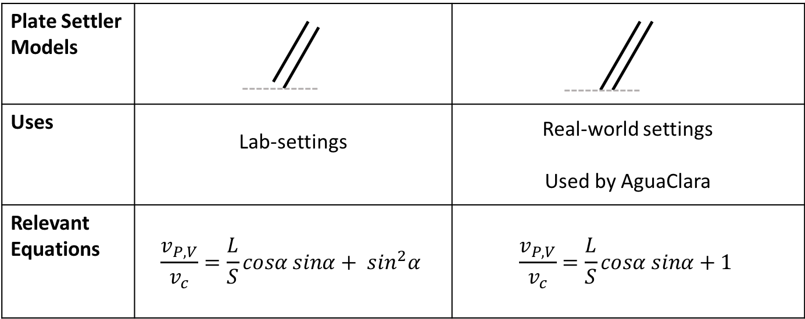

.. _title_Sed_Derivations:

***********************************************
Design of an AguaClara Sedimentation Tank
***********************************************
In the next section, we will develop the mathematical models that help us explain the design.

Note: this section will build off of the conceptual understanding established in the previous section and will explain how the tank works with derivations and mathematical models.

.. _heading_Sed_Tank_Velocity_Flow:

Comparison of velocities and flow in sedimentation tank
========================================================

To understand how water flows in the sedimentation tank, we must understand how the water velocity changes with the geometry. There are four distinct zones in the sedimentation tank: 1) the velocity of water exiting the diffusers, 2) the velocity of water moving through the floc blanket, 3) the velocity of water that enters the plate settlers, and 4) the velocity of water through the plate settlers. The geometry of the sedimentation tank changes in these four zones, so we will follow these changes to make sure that we understand the conservation of flow. The flow going through the sedimentation tank is the same everywhere, but average velocities are different. The fact that flow rate is velocity multiplied by area, :math:`Q = v * A`, will be our guiding principle. In all cases,

| :math:`Q_{Sed} =` flow rate through each sedimentation tank
| :math:`W_{Sed} =` width of each sedimentation tank

.. _figure_sed_tank_flow_conserve:

.. figure:: Images/sed_tank_flow_conserve.png
    :height: 300px
    :align: center
    :alt: AguaClara sedimentation tank showing "lost triangle" and its impact on relevant lengths.

    AguaClara sedimentation tank showing "lost triangle" and its impact on relevant lengths.

1) Velocity and flow exiting the diffusers
------------------------------------------------------------

This is discussed specifically in the section on :ref:` diffuser design <_heading_Sed_Tank_Diffuser_Design>`.

2) Velocity and flow in the floc blanket
----------------------------------------

After the water exits the diffusers and jet reverser, it flows through the expanded floc blanket region where:

| :math:`L_{SedFloc} =` length of the sedimentation tank that has a floc blanket
| :math:`v_{S,V} =` upflow velocity of the water through the floc blanket

Thus, :math:`Q_{Sed} = W_{Sed}*L_{SedFloc}*v_{S,V}`

3) Velocity and flow entering the plate settlers
------------------------------------------------------------

The 'active' sedimentation zone refers to the area of the tank in which water can flow through the plate settlers where:

| :math:`L_{SedActive} =` length of the sedimentation tank that includes entrance to a plate settlers
| :math:`v_{A,V} =` upflow velocity of the water entering the plate settlers; vertical velocity in 'active' region

The only reason that there is a distinction between this area and the floc blanket area is because plate settlers are built at an angle. This angle creates a "lost triangle" because there is a space in which the plate settlers are not effective and water does not flow through them. Because the active length is less than the floc blanket length, :math:`L_{SedActive} < L_{SedFloc}`, and because flow must be conserved, the average active velocity must be greater than the average upflow velocity through the floc blanket, :math:`v_{A,V} > v_{S,V}`. The same flow going through less area means that the velocity must increase.

Thus, :math:`Q_{Sed} = W_{Sed}*L_{SedActive}*v_{A,V}`, and :math:`v_{A,V} > v_{S,V}`.

4) Velocity and flow in the plate settlers
-------------------------------------------

Now, we will discuss flow through plate settlers where:

| :math:`v_{P,V} =` upflow velocity of the water in the plate settlers; vertical velocity component between the plate settlers
| :math:`S =` spacing between plate settlers
| :math:`B =` center-to-center distance between plate settlers
| :math:`T =` thickness of plate settlers
| :math:`L =` length of plate settlers

We know that plate settlers have a certain thickness and take up area, which means that once we reach the plate settler zone, there is less area for water to travel through. Because flow is conserved and there is a decrease in area, we know that the upflow velocity of water through the plate settlers must increase compared to the upflow velocity of water below the plate settlers, :math:`v_{P,V} > v_{A,V}`.

Thus, :math:`v_{P,V} > v_{A,V} > v_{S,V}`

In addition to the vertical velocity component increasing between the plates, the resultant velocity of water between the plates increases compared to :math:`v_{A,V}`. What are the two reasons that this is true?

- the first reason, as already discussed, is that the vertical velocity component needs to increase to ensure conservation of flow.

- the second reason has to do with the fact that the resultant velocity of water between the plates is at an angle. This means that there is a horizontal component introduced. Because we know that the vertical velocity increases, and there is a new positive horizontal velocity component, the resultant velocity must also increase.

Now, consider a tube settler used in a lab setting instead of a plate settler. If a tube settler was designed with an angle to mimic a plate settler, would the water change vertical velocity after the angle? How does this compare to the plate settler scenario? In the case of the tube settler, the vertical velocity does not increase because there is no change in flow area; the diameter of the tube is constant throughout, meaning that for the flow to remain constant, the velocity does not change.

For another example of flow conservation, let's consider the relationship between :math:`v_{P,V}*S` and :math:`v_{A,V}*B`. :math:`B` is the center-to-center distance between plate settlers, and does not take into account the thickness of plate settlers. Considering only the center-to-center distance means that the area for water to travel through does to change from before the plate settlers to within the plate settlers because we are not accounting for any thickness. If the area does not change, then velocity should also not change to keep flow conserved. However, if we are to account for thickness, we must discuss :math:`S` which is the spacing between plate settlers. This does take into account the change in area,  which means that the velocity would need to increase through the lesser area. So if we look at the flow through plate settlers, we can confirm that :math:`v_{P,V}*S = v_{A,V}*B`.

By using flow conservation and plate settler geometry, we can begin to understand the mathematical relationships that drive design.

.. _heading_Sed_Tank_Plate_Settler_Design:

Plate Settler Design
========================================================
Plate Settler Parameters
-------------------------

From the relationship that :math:`v_{P,V}*S = v_{A,V}*B`, we can solve for :math:`B` or :math:`L` in terms of their related parameters.

Let's start with the relationships that we already know:

.. math::

  v_{P,V}*S = v_{A,V}*B

and

.. math::

  B = S+T

.. _figure_SvsBplatesettlers:

.. figure:: Images/SvsBplatesettlers.png
    :height: 300px
    :align: center
    :alt: Thick plate settlers.

    Thick plate settlers.

.. _figure_plate_settler_base:

.. figure:: Images/plate_settler_base.png
    :height: 300px
    :align: center
    :alt: Plate settlers.

    Plate settlers.

Solving for :math:`v_{P,V}`, we rearrange and substitute by,

.. math::

  v_{P,V}*S = v_{A,V}*(S+T)

.. math::

  v_{P,V} = \frac{v_{A,V}*(S+T)}{S}

We also already know from our :ref:`discussion of plate settlers <heading_Sed_Tank_Plate_Settlers>` that we can relate capture velocity, :math:`v_c`, to :math:`S, L, \alpha`, and :math:`v_{P,V}` by,

.. math::

  v_c = \frac{S*v_{P,V}}{Lsin\alpha cos\alpha + S}

Substitute for :math:`v_{P,V} = \frac{v_{A,V}*(S+T)}{S}` by,

.. math::

  v_c = (\frac{S}{Lsin\alpha cos\alpha + S})(\frac{v_{A,V}*(S+T)}{S})

Now, we can use this form of the capture velocity equation to solve for :math:`B` or :math:`L`, as shown by,

.. math::

  B = \frac{Lsin\alpha cos\alpha - T}{\frac{v_{P,V}}{v_c}-1}

.. math::

  L = \frac{B(\frac{v_{P,V}}{v_c}-1) + T}{sin\alpha cos\alpha}

.. math::

  L = \frac{S(\frac{v_{P,V}}{v_c}-1) + T(\frac{v_{P,V}}{v_c})}{sin\alpha cos\alpha}

.. _heading_Sed_Tank_Plate_Settler_Design_Review:

The AguaClara plate settler design approach is summarized in the following table:

+----------------------+----------------------+-----------------------------------+----------------------------+--------------------------+
| Parameter            | Variable             | Determined by:                    | Determines:                | Value                    |
+======================+======================+===================================+============================+==========================+
| Upflow velocity      | :math:`v_{S,V}`      | floc blanket                      | size of tank               | 1 :math:`\frac{mm}{s}`   |
|                      |                      | upflow requirements               |                            |                          |
+----------------------+----------------------+-----------------------------------+----------------------------+--------------------------+
| Capture velocity     | :math:`v_c`          | target turbidity                  | particle size distribution | 0.12 :math:`\frac{mm}{s}`|
|                      |                      |                                   | after floc blanket         |  **needs research**      |
+----------------------+----------------------+-----------------------------------+----------------------------+--------------------------+
| Plate angle          | :math:`\alpha`       | self-cleaning requirements        | :math:`L`                  | 60 deg                   |
+----------------------+----------------------+-----------------------------------+----------------------------+--------------------------+
| Spacing              | :math:`S`            | clogging and floc                 | :math:`L`                  | 2.5 cm                   |
|                      |                      | rollup constraints                |                            |                          |
+----------------------+----------------------+-----------------------------------+----------------------------+--------------------------+
| Plate settler length | :math:`L`            | :math:`v_{S,V},v_c,\alpha,S`      | tank depth                 | Calculated for each plant|
+----------------------+----------------------+-----------------------------------+----------------------------+--------------------------+

.. _figure_plate_settler_model_table:

    Plate settler models and relevant equations.

.. _heading_Floc_Rollup_Slide_Velocity_Derivation:

Floc Rollup and Slide Velocity
------------------------------

As has been discussed, :ref:`floc rollup <_heading_Floc_Rollup>` is a failure mode of plate settler performance. To determine the appropriate spacing between plate settlers, we must consider the potential for flocs to rollup because we want to minimize rollup and promote settling. We will determine this by calculating the floc sedimentation velocity, :math:`v_{Slide}`, that can be captured given a plate spacing. The steps to calculate this are:

1) find the velocity gradient next to the plate

2) find the fluid velocity at the center of the floc

3) find terminal velocity of the floc down the plate (for the case of zero velocity fluid)

4) set those two velocities equal for the critical case of no movement, and the required plate spacing

5) find the floc sedimentation velocity, :math:`v_{Slide}`

We will solve for both the plate settler and tube settler conditions.

1) Find the velocity gradient next to the plate:
^^^^^^^^^^^^^^^^^^^^^^^^^^^^^^^^^^^^^^^^^^^^^^^^^^^^

Plate Settler
"""""""""""""

.. _figure_plate_settler_boundary_conditions:

.. figure:: Images/plate_settler_boundary_conditions.png
    :height: 300px
    :align: center
    :alt: Boundary conditions in plate settlers.

    Boundary conditions in plate settlers.

.. _figure_floc_rollup_base:

.. figure:: Images/floc_rollup_base.png
    :height: 300px
    :align: center
    :alt: Velocity profile between plate settlers.

    Velocity profile between plate settlers.

We begin by describing the conditions of infinite horizontal plates.

.. math::

  \frac{y^2}{2}\frac{dp}{dx} + Ay + B = \mu u

We employ the no-slip condition to solve for the constants A and B. The no-slip condition is that :math:`u = 0` at :math:`y = 0` and :math:`y = S`, where :math:`u` is the horizontal velocity component, :math:`y` is the location in the y-axis direction between plates, and :math:`S` is the spacing between plates.

at :math:`u = 0` and :math:`y = 0`:

.. math::

  \frac{0}{2}\frac{dp}{dx} + A*0 + B = \mu *0

.. math::

  B = 0

at :math:`u = 0` and :math:`y = S`, the solving for A:

.. math::

  \frac{S^2}{2}\frac{dp}{dx} + AS + 0 = \mu *0

.. math::

  \frac{S^2}{2}\frac{dp}{dx} + AS = 0

.. math::

  A = \frac{-S}{2}\frac{dp}{dx}

Our initial equation can be updated as,

.. math::

  \frac{y^2}{2}\frac{dp}{dx} + \frac{-S}{2}\frac{dp}{dx}y + B = \mu u

If we let :math:`\frac{dp}{dx}` be negative, then we can solve for :math:`\tau`.

.. math::

  \mu(\frac{du}{dy}) = y \frac{dp}{dx} + A

.. math::

  \tau = (y - \frac{S}{2}) \frac{dp}{dx}

Determining the average velocity between plates, :math:` v_{\alpha}`,

.. math::

  u = \frac{y(y-S)}{2\mu} \frac{dp}{dx}

.. math::

  v_{\alpha} = \frac{q}{S} = \frac{1}{S} \int_{0}^{S}udy = \frac{1}{S} \int_{0}^{S} (\frac{y^2 - Sy}{2\mu} (\frac{dp}{dx}))dy

Integrating to get average velocity, then solving for :math:`\frac{dp}{dx}`,

.. math::

  v_{\alpha} = \frac{S^2}{12\mu} \frac{dp}{dx}

.. math::

  \frac{dp}{dx} = \frac{12\mu v_{\alpha} }{S^2}

Using Navier-Stokes to model the flow between the plates, and substituting our equation for :math:` \frac{dp}{dx}`, 

.. math::

  (\frac{du}{dy})_{y=0} = \frac{-S}{2\mu} \frac{dp}{dx}

.. math::

  (\frac{du}{dy})_{y=0} = \frac{-S}{2\mu} \frac{12\mu v_{\alpha} }{S^2}

Simplifying the :math:`(\frac{du}{dy})_{y=0}`, we have the velocity gradient as function of average velocity for plate geometry as,

.. math::

  (\frac{du}{dy})_{y=0} = \frac{6 v_{\alpha}}{S}

.. math::

  \frac{ dv_{\alpha} }{ dy_{y=0} } = \frac{6 v_{\alpha}}{S}

.. _figure_floc_rollup_step1:

.. figure:: Images/floc_rollup_step1.png
   :height: 300px
   :align: center
   :alt: Velocity gradient next to the plate.

   Velocity gradient next to the plate.

Tube Settler
"""""""""""""
For tube settlers, we will assume laminar flow through circular tubes. :math:`R` is the radius of the tube, and we assume that the maximum velocity is when :math:`r = 0`. The velocity distribution is paraboloid of revolution, therefore average velocity, :math:`v`, is half of the maximum velocity, :math:`v_{max}`. So, :math:`v = \frac{1}{2}v_{max}`. We also know that :math:`Q = vA` and :math:`Q = v \pi R^2`. In the case of the tube settler, :math:`\frac{dp}{dx}` is the pressure gradient in the direction of flow, not the pressure gradient due to changes in elevation.

.. math::

  v_{\alpha} = \frac{r^2 - R^2}{4\mu} \frac{dp}{dx}

.. math::

  `v_{max} = - \frac{R^2}{4\mu} \frac{dp}{dx}

.. math::

  v = - \frac{R^2}{8\mu} \frac{dp}{dx}

.. math::

  Q = - \frac{\pi R^4}{8\mu} \frac{dp}{dx}

Rearranging the flow equation :math:`Q` to solve for :math:`\frac{dp}{dx}`,

.. math::

  \frac{dp}{dx} = - \frac{8 \mu Q}{\pi R^4}

Plugging :math:`\frac{dp}{dx}` into the original equation fo :math:`v_{\alpha}`,

.. math::

  v_{\alpha} = -2Q \frac{r^2 - R^2}{\pi R^4}

.. math::

  \frac{ dv_{\alpha} }{ dr_{r=R} } = \frac{-4Q}{\pi R^3}

The resulting velocity gradient as function of average velocity for tube geometry is,

.. math::

  \frac{ dv_{\alpha} }{ dy_{y=0} } = \frac{8v_{\alpha}}{D}

2) Find the fluid velocity at the center of the floc:
^^^^^^^^^^^^^^^^^^^^^^^^^^^^^^^^^^^^^^^^^^^^^^^^^^^^^^
Now, we want to determine the velocity at the center of the floc. For linearized plates, the plate geometry condition, we determined that,

.. math::

  \frac{ dv_{\alpha} }{ dy_{y=0} } = \frac{6 v_{\alpha}}{S}

The center of the floc is approximately half of the floc diameter, :math:`D`. So, to find the fluid velocity at the center of the floc, we linearize the differential and plug in :math:`\frac{D}{2}` to yield,

.. math::

  v_{\alpha} \approx (\frac{6 v_{\alpha}}{S}) (\frac{D}{2})

Substituting by the trigonometric relationship :math:`v_{\alpha} = (\frac{v_{P,V}}{sin\alpha})`, we find the fluid velocity at the center of the floc as,

.. math::

  v_{\alpha} \approx \frac{3 v_{P,V} D}{Ssin\alpha}

.. _figure_floc_rollup_step2:

.. figure:: Images/floc_rollup_step2.png
   :height: 300px
   :align: center
   :alt: Fluid velocity at the center of the floc.

   Fluid velocity at the center of the floc.

3) Find terminal velocity of the floc down the plate (for the case of zero velocity fluid):
^^^^^^^^^^^^^^^^^^^^^^^^^^^^^^^^^^^^^^^^^^^^^^^^^^^^^^^^^^^^^^^^^^^^^^^^^^^^^^^^^^^^^^^^^^^^^^
Recall from our :ref:`previous explanation of terminal velocity <_heading_terminal_velocity_equation` that the terminal velocity, :math:`v_t`, of the floc can be calculated by,

.. math::

  v_t = \frac{D_0^2g}{18\phi\nu}\frac{\rho_{floc} -\rho_{H2O}}{\rho_{H2O}} \left( \frac{D}{D_0} \right) ^{D_{fractal}-1}

We can rearrange this equation to solve for :math:`D` by

.. math::

  D = D_0 ( \frac{18 v_t \phi \nu }{D_0^2g} \frac{ \rho_{H2O}}{ \rho_{floc} - \rho_{H2O}}) ^{\frac{1}{ D_{fractal} - 1}}

We will need this equation for :math:`D` in the next step.

.. _figure_floc_rollup_step3:

.. figure:: Images/floc_rollup_step3.png
   :height: 300px
   :align: center
   :alt: Terminal velocity of the floc down the plate (for the case of zero velocity fluid).

   Terminal velocity of the floc down the plate (for the case of zero velocity fluid).

4) Set the fluid velocity at the center of the floc equal to the terminal velocity of the floc to find the critical case of no movement, and the required plate spacing:
^^^^^^^^^^^^^^^^^^^^^^^^^^^^^^^^^^^^^^^^^^^^^^^^^^^^^^^^^^^^^^^^^^^^^^^^^^^^^^^^^^^^^^^^^^^^^^^^^^^^^^^^^^^^^^^^^^^^^^^^^^^^^^^^^^^^^^^^^^^^^^^^^^^^^^^^^^^^^^^^^^^^^^^^^^^^
The floc settles due to gravitational forces. First, the :math:`\alpha` component of the gravitational settling force, :math:`v_{t,\alpha}`, must be found by trigonometric relationships.

.. math::

  v_{t,\alpha} = v_t sin\alpha

Setting :math:`v_{\alpha} = v_{t,\alpha}` yields,

.. math::

  \frac{3 v_{P,V} D}{Ssin\alpha} \approx v_t sin\alpha

Solving for :math:`S` to determine plate spacing,

.. math::

  S \approx \frac{3 v_{P,V} D}{v_t sin^2\alpha}

In this equation, we have both :math:`v_t` and :math:`D`, but we can simplify further because we know that :math:`v_t` and :math:`D` are related by the relationship shown in step 3. Therefore,

.. math::

  S \approx \frac{3}{sin^2\alpha} \frac{v_{P,V}}{v_t} D_0 \left( \frac{18 v_t \phi \nu }{D_0^2g} \frac{ \rho_{H2O}}{ \rho_{floc} - \rho_{H2O}} \right) ^{\frac{1}{ D_{fractal} - 1}}

:math:`S` is the smallest spacing that will allow a floc with a given settling velocity to remain stationary on the slope and not be carried upward by rollup.

5) Find the floc sedimentation velocity, :math:`v_{Slide}`:
^^^^^^^^^^^^^^^^^^^^^^^^^^^^^^^^^^^^^^^^^^^^^^^^^^^^^^^^^^^^^^^^^^^^^
Finally, we can determine :math:`v_{Slide}` by,

.. math::

  v_{Slide} = v_{P,V} \left[ \left( \frac{3D_0}{Ssin^2\alpha} \right)^{D_{fractal} - 1} \left( \frac{18 v_{P,V} \phi \nu }{D_0^2g} \frac{\rho_{H2O}}{\rho_{floc} - \rho_{H2O}} \right) \right] ^ {\frac{1}{ D_{fractal} - 2}}

:math:`v_{Slide}` is the terminal sedimentation velocity of the slowest-settling floc that can slide down an incline. Flocs with with terminal velocity (the slide velocity) will be held stationary on the incline because of a balance between gravitational forces and fluid drag. Flocs with a terminal velocity lower than :math:`v_{Slide}` will be carried out of the top of the settler (i.e., they will rollup) even if they settle onto the settler wall. Thus, the slide terminal velocity represents a constraint on the ability of plate settlers to capture flocs.

What happens if the primary particles are less dense?
:math:`v_{Slide}` will increase because the particles need to be able to settle faster in order to not experience rollup.

.. _figure_vsettle_vslide:

.. figure:: Images/vsettle_vslide.png
   :height: 300px
   :align: center
   :alt: Relationship between :math:`v_{Settle}` and :math:`v_{Slide}`.

   Tube settler performance as a function of capture velocity ratio.

.. _heading_Sed_Tank_Hl_thru_Plate_Settlers:

Head Loss through Plate Settlers
--------------------------------

Flow through the sedimentation tank is controlled by head loss in an attempt to achieve flow uniformity. We have already explained that :ref:`plate settler spacing impacts head loss <heading_Sed_Tank_Plate_Settlers_Head_Loss_Intro>`, but by what mathematical relationship? Will putting plate settlers closer together result in more or less head loss? This question is complicated because closer plate settlers would create more shear and head loss, but shorter plate settlers also mean that they become shorter which would decrease shear and head loss.

Let's start with a force balance. Assume that there is a fully established velocity profile that is parabolic with laminar flow. The forces that we care about are shear forces on the walls of the plate settlers and the differential pressure from flow in the direction of the velocity.

.. _figure_plate_settler_headloss_diag:

   Velocity, shear forces, and pressure loss through plate settlers.

The shear forces act over the area of the two plates, resulting in :math:`F_{shear} = 2 \tau L W` where :math:`\tau` is the viscous shear component.

The pressure force is exerted over the entire width of the plate and the plate spacing. Pressure at the entrance of the plate settlers is different from the exit of the plate settlers by :math:`\Delta P`. The resulting pressure force is :math:`F_{pressure} = \Delta P W S`. So,

.. math::

  F_{shear} = F_{pressure}

.. math::

  2 \tau L W = \Delta P W S

Dividing both sides by width, :math:`W`, and solving for :math:`\Delta P` yields,

.. math::

  \Delta P = \frac{2 \tau L}{S}

We need to figure out what each of the terms on the right side of the equation is equal to so we can calculate :math:`\Delta P`. Ultimlately, we need :math:`\Delta P` to calculate head loss because :math:`h_L = \frac{\Delta P}{\rho g}`.

:math:`\tau =\mu \frac{du}{dy}`, where :math:`\tau` is shear, :math:`\mu` is the viscosity, and :math:`\frac{du}{dy}` is the velocity gradient. Using the Navier-Stokes equation, we can find the velocity gradient as a function of the average velocity between the plates, yielding shear based on the vertical velocity entering the plates as,

.. math::

  \tau = \mu \frac{6 v_{P,V}}{S sin\alpha}

:math:`L` is found using the equation for capture velocity, :math:`v_c = \frac{S*v_{P,V}}{Lsin\alpha cos\alpha + S}`. Capture velocity is kept constant so we solve for :math:`L`,

.. math::

  L = \frac{S \left( \frac{v_{P,V}}{v_c} -1 \right)}{sin\alpha cos\alpha}

Substituting :math:`\tau` and :math:`L` into the equation for :math:`\Delta P`,

.. math::

  \Delta P = 2\mu \left( \frac{6v_{P,V}}{S sin^2 \alpha cos\alpha} \right) \left( \frac{v_{P,V}}{v_c} -1 \right)

Now that we have an equation for :math:`\Delta P`, we can solve for head loss.

.. math::

  h_L = \frac{\Delta P}{\rho g}

.. math::

  h_L = 2 \frac{\mu}{\rho g} \left( \frac{6v_{P,V}}{S sin^2 \alpha cos\alpha} \right) \left( \frac{v_{P,V}}{v_c} -1 \right)

Recall that head loss through plate settlers is really small, on the order of micrometers, :math:`\mu m`. We are interested in understanding how the head loss relates to velocity, through the relation :math:`v = \sqrt{2gh}`. The resulting two plots show how head loss and velocity relate to plate settlers.

.. _figure_plate_settler_headloss_spacing:

.. figure:: Images/plate_settler_headloss_spacing.png
   :height: 300px
   :align: center
   :alt: Head loss as a function of plate settler spacing.

   Head loss as a function of plate settler spacing.

.. _heading_Sed_Tank_Floc_Blanket_Design:

Floc Blanket Design
========================================================

Floc Blanket Collision Potential
--------------------------------
We have learned that growing a floc blanket leads to better sedimentation tank performance. One explanation for the improved performance is that the floc blanket acts like an additional flocculator because there are additional collisions between particles. To understand the nature and significance of these additional collisions, we can calculate the floc blanket velocity gradients and residence time to find collision potential, :math:`G\theta`. In a floc blanket, we expect that :math:`G` is small; however, :math:`\theta` is large, which means that :math:`G\theta` in the floc blanket may be significant.

First, we will find :math:`\theta`. If we simplify the bottom of the sedimentation tank and approximate it as a simple rectangle, we can easily determine the residence time. If the depth of the floc blanket is 1 m and the upflow velocity is 1 mm/s, we determine that

.. math::

  \theta = 1000 s

Next, we will find :math:`G`. Before we begin, consider why there is a velocity gradient in the floc blanket. What causes it? Water is flowing up through the floc blanket while the flocs in the floc blanket are being pulled down by gravity. The differential velocities are caused by particles settling and rising at different velocities relative to the fluid due to drag, gravity, and fluid flow. In the fluid around each particle, there is a velocity gradient and shear between the particles and the surrounding fluid.

Entering the sedimentation tank, there is a large range of particle sizes in the water. The range exists from big flocs made up with hundreds of millions of clay particles to primary particles that made it through flocculation without successful collision. These differentially sized particles create velocity gradients as the particles and flocs are acted on by both settling forces and upward fluid flow forces.

Large flocs provide velocity gradients that can potentially cause collisions between other small particles that we are still trying to capture. Through our derivation to determine :math:`G` in a floc blanket, we will also test an assumption. We will assume that primary particles coming into the floc blanket are not interacting with large flocs. Instead,  we will assume that the the fluid shear and differential velocities promote interactions between two primary particles.

So, how can we calculate the velocity gradient? In flocculators, we determined :math:`G` from head loss and residence time. In sedimentation tanks, we determine :math:`G` the same way. Let's calculate the head loss through the floc blanket. To do this, we need to know the density of the floc blanket and we need to know the relationship between head loss a fluidized bed and density of the bed.

Floc blanket density
^^^^^^^^^^^^^^^^^^^^
To calculate the density of the floc blanket at steady-state, we will use principles of mass and volume conservation.

.. math::

  C_{clay} = \frac{m_{clay}}{\rlap{-}V_{fb}}

.. math::

  \rho = \frac{m_{TOT}}{\rlap{-}V}

We will start by finding the mass of clay and the mass of water in the floc blanket, where:

| :math:`C_{clay} =` concentration of clay in the floc blanket
| :math:`\rlap{-}V_{fb} =` volume of floc blanket
| :math:`\rho_{clay} =` density of clay
| :math:`\rho_{H_2O} =` density of water
| :math:`\rho_{fb} =` density of floc blanket

The mass of clay in the floc blanket is concentration multiplied by volume, shown by :math:`m_{clay} = C_{clay}\rlap{-}V_{fb}`

The mass of water in the floc blanket is related to the volume fraction of the floc blanket that is occupied by clay, :math:`\frac{C_{clay}}{\rho_{clay}}`, whic is a very small number. :math:`\left( 1 - \frac{C_{clay}}{\rho_{clay}} \right)` is the fraction of the floc blanket that is occupied by water, also called the water volume fraction. So, :math:`m_{H_2O} = \left( 1 - \frac{C_{clay}}{\rho_{clay}} \right) \rho_{H_2O} \rlap{-}V_{fb}`.

Now, we know how much clay and water is in our system. The density of the system, neglecting the addition of coagulant, is,

.. math::

  \rho_{fb} = \frac{m_{clay} + m_{H_2O}}{\rlap{-}V_{fb}}

Substituting for :math:`m_{clay}` and :math:`m_{H_2O}`,

.. math::

  \rho_{fb} = \left( 1 - \frac{C_{clay}}{\rho_{clay}} \right)\rho_{H_2O} + C_{clay}

This can be rearranged to yield the following equation derived from first principles,

.. math::

  \rho_{fb} = \left( 1 - \frac{\rho_{H_2O}}{\rho_{clay}} \right)C_{clay} + \rho_{H_2O}

AguaClara researchers in the lab developed an empirical equation through experimental studies to calculate floc blanket density. They determined that,

.. math::
  \rho_{fb} = 0.687C_{clay} + \rho_{H_2O}

Comparing the empirical equation to the one determined by first principles, it is clear that the coefficient,

.. math::

  \left( 1 - \frac{\rho_{H_2O}}{\rho_{clay}} \right) = 0.687

Floc blanket head loss
^^^^^^^^^^^^^^^^^^^^^^^

Now that we can calculate the density of the floc blanket, we can calculate the head loss through the floc blanket. This topic will be discussed further in the chapter on filtration. For now, all you need to know is that density can be related to head loss in the floc blanket through the height of the floc blanket, :math:`H_{fb}`, and the densities of the floc blanket and water.

.. math::

  \frac{h_L}{H_{fb}} = \frac{\rho_{fb} - \rho_{H_2O}}{\rho_{H_2O}}

There will be a small amount of head loss through the floc blanket because the density of the floc blanket is greater than the density of water by only a little bit. Remember that :math:`\frac{C_{clay}}{\rho_{clay}}` is really just the fraction of the floc blanket that is occupied by clay.

Plugging in the equation for :math:`\rho_{fb}` and solving for :math:`h_L`,

.. math::

  h_L = H_{fb} \left( \frac{\rho_{clay}}{\rho_{H_2O}} - 1 \right) \frac{C_{clay}}{\rho_{clay}}

Floc blanket velocity gradient and collision potential
^^^^^^^^^^^^^^^^^^^^^^^^^^^^^^^^^^^^^^^^^^^^^^^^^^^^^^^^

With the equation for :math:`h_L`, we can calculate :math:`G`. We will also use the other equations we developed in the :ref:`chapter on flocculation <_heading_Hydraulic_Flocculation_Design>`.

.. math::

  G = \sqrt{\frac{\epsilon}{\nu}}

.. math::

 \epsilon = \frac{gh_L}{\theta}

We will start by determining :math:`\epsilon ` by calculating :math:`\theta` using the porosity of the floc blanket, :math:`\phi_{fb}`,

.. math::

  \theta = \frac{H_{fb} \phi_{fb}}{v_{S,V}}

Plugging :math:`\theta` into :math:`\epsilon` yields

.. math::

  \epsilon = \frac{gv_{S,V}}{\phi_{fb}} \frac{h_L}{H_{fb}}

Substituting into our equation for :math:`G`,

.. math::

  G =  \sqrt{\frac{gv_{S,V}}{\nu \phi_{fb}} \frac{h_L}{H_{fb}}}

Using our equation for :math:`h_L`,

.. math::

  G =  \sqrt{\frac{gv_{S,V}}{\nu \phi_{fb}} \left( \frac{1}{\rho_{H_2O}} - \frac{1}{\rho_{clay}} \right) C_{clay} }

.. math::

  \phi_{fb} \approx 1` and is a function of :math:`C_{clay}

We can plot our results for :math:`G` over a range of typical floc blanket concentrations, which is around 1 - 5 g/L. We find that :math:`G` ranges from 2 to 6 Hz. Recall that for flocculator design, we get anywhere from 70 to several hundred Hz. The :math:`G` provided by the floc blanket is much smaller than :math:`G` provided by the flocculator. This is an important point because in the low :math:`G` environment of the floc blanket where there are low levels of energy dissipation, we can grow larger flocs. The flocs are experiencing less shear so they can grow close to millimeter size.

We can plot our results for :math:`G\theta` by multiplying :math:`G` by the residence time we found earlier, :math:`\theta = 1000 s`. The result is that :math:`G\theta` ranges from 2,000 to 6,000. Compare this to the :math:`G\theta = 20,000` for the flocculator used in experiments (`Garland et al., 2017<https://www.liebertpub.com/doi/10.1089/ees.2016.0174>`_).

.. _figure_lab_setup:

.. figure:: Images/lab_setup.png
   :height: 300px
   :align: center
   :alt: Lab setup for flocculator, half-sedimentation tank, and plate settler testing.

   Lab setup for flocculator, half-sedimentation tank, and plate settler testing.

.. _figure_floc_conc_G:

.. figure:: Images/floc_conc_G.png
   :height: 300px
   :align: center
   :alt: Velocity gradient and collision potential as a function of floc blanket concentration.

   Velocity gradient and collision potential as a function of floc blanket concentration.

How does such a small :math:`G\theta` cause such a large reduction in turbidity? The question we are really asking is, is there anything special about the :math:`G\theta` provided by the floc blanket compared to the :math:`G\theta` provided by the flocculator? If so, what is the difference and why is it so beneficial?

Experimental data helps explain this. Two systems were set up: one had a flocculator where :math:`G\theta = 20,000` with a floc blanket where :math:`G\theta = 4,000`; the other just had a flocculator where :math:`G\theta = 24,000`. Using the same influent water quality and coagulant dosing, we find that the first system with the flocculator and floc blanket performed better than the second system, even though the overall :math:`G\theta` values were the same.

To understand this, we have to review assumptions in the derivation for :math:`G`. Recall our assumption that fluid shear promotes the collision of two primary particles instead of the collision of primary particles with existing, large flocs. If our assumption was true, we would expect to see no difference between our two experimental setups. However, because we know that the two experimental setups did have different results, our assumption must be false because the assumption does not explain or account for these differences. There must be another mechanism occurring to explain why the floc blanket greatly improves treatment quality. This leads us to believe that the flocs in the floc blanket must be more involved than simply providing shear and velocity gradients; they must be involved in some collisions with the small particles coming through the floc blanket.

This highlights an important distinction:

#. The model created by the original derivation assumption would suggests that flocs in the floc blanket are inert - simply occupying space and causing there to be head loss in the floc blanket - without being involved in any collisions. This model is disproved through the experimental analysis of the two experimental setups.
#. The model created after the analysis of experimental results suggests that flocs in the floc blanket are not inert - they are involved in collisions with small particles entering the floc blanket - and are growing in size. The model is supported through the experimental analysis.

.. _heading_Flocculator_Floc_Blanket_Paradox:

Flocculator and Floc Blanket Paradox
====================================

We now have a very interesting apparent contradiction between our conclusions about flocculation and floc blankets. We previously concluded that primary particles do not collide with and attach to flocs in flocculators. This assumption is required to explain experimental observations. Indeed, if primary particles could attach to flocs in a flocculator, then high turbidity events with appropriate coagulant dosages should result in super performance because there would be so many opportunities for collisions between large flocs and primary particles. This is not what we observe.

The contradiction is that now we conclude that primary particles must be attaching to flocs in the floc blanket! Both of these conclusions are based on a combination of experimental measurements and careful application of models. If these apparently contradictory conclusions are both correct, then there must be some fundamental difference between the particle interactions in flocculators and floc blankets.

In both environments the flow around the flocs is dominated by viscous forces. The source of the fluid deformation is different in these two flows. In the flocculator the source of the fluid deformation is from turbulent kinetic energy that is dissipating by deforming (shearing) the fluid. In the floc blanket the source of fluid deformation is from the gravitational pull on the flocs. The flocs are moving relative to the fluid and the fluid is being deformed as the flocs move through the fluid.

.. _table_flocculator_vs_floc_blanket:

.. csv-table:: Comparison between flocculator and floc blanket.
   :header: "Property", "Flocculator", "Floc blanket"
   :align: center

   Velocity gradient, ~100 Hz, x Hz
   :math:`G\theta`, "20,000 - 40,000", "x,000 to y,000"
   energy source for fluid deformation, turbulence, floc drag
   flow regime at floc length scale, shear flow, velocity field is perturbed by falling flocs
   flocs are..., rotating from fluid shear, falling due to gravity
   flocs have a stagnation point, no, yes

Flocs that are rotating in a shear flow drag a boundary layer of fluid with them as they rotate. This boundary layer of fluid prevents any approaching fluid from penetrating to the surface of the floc. There is no stagnation point on the floc! This means that approaching particles are swept around the floc due to the presence of the boundary layer. The only way for a particle to collide with a large floc is for the particle to be large enough that it can penetrate through the boundary layer even though the center of the particle continues to follow the streamline around the boundary layer of the floc.

Flocs that are falling through a fluid that is not undergoing significant shear have stagnation points on the upstream side of the flocs and thus there exists a small amount of fluid that gets close enough to the floc near the stagnation point for small particles to collide with the floc.

.. _heading_Sed_Tank_Diffuser_Design:

Diffuser Design
======================

Diffusers are shaped so that they remain a circular pipe in one end that fits into the influent manifold orifice, and the other end is deformed to the shape of a thin rectangle. Recall that this deformation is done to create a line jet entering the jet reverser in the bottom of the sedimentation tank. Diffusers are shaped by dipping the pipe stubs in hot oil, and then pushing the maleable and heated pipe onto a metal form. This metal form is sized so that the target shape is achieved.

.. _figure_BvsS_diffuser:

.. figure:: Images/BvsS_diffuser.png
    :height: 300px
    :align: center
    :alt: Diagram of diffuser exit.

    Diagram of diffuser exit.

| :math:`T_{diff} =` thickness of diffuser wall
| :math:`S_{diff} =` internal width of diffuser
| :math:`B_{diff} =` center-to-center spacing between diffusers; external width of diffuser
| :math:`W_{diff} =` internal width of diffuser
| :math:`v_{jet} =` velocity of the jet exiting the diffuser
| :math:`Q_{diff} =` flow rate through each diffuser
| :math:`h_{L,jet} =` head loss in jet leaving the jet reverser

Determining flow through a diffuser
-----------------------------------

What is the flow rate of a single diffuser in the bottom of the sedimentation tank? Consider a sedimentation tank that is 6 m long, 1 m wide and 2 m deep, with an upflow velocity of 1 mm/s and a diffuser spacing of 5 cm.

 What is this question really asking? This question is asking us to understand that each diffuser "serves" a specific cross-sectional area of the sedimentation tank; all of the diffusers together serve the entire area of the sedimentation tank. So, let's imagine a single diffuser serving a slice of a sedimentation tank. With this in mind, we can easily solve this using :math:`Q = vA`. The area, :math:`A`, is the slice of the sedimentation tank that we are serving. We are told that the tank is 1 m wide, so :math:`W_{tank} = 1` m. The length of the slice is dictated by the spacing of the diffusers, :math:`B_{diff}`, so :math:`B_{diff} = 5` cm.

.. math::

  A = B_{diff}W_{tank}

.. math::

  A = 5cm * 1m

.. math::

  A = 50,000mm^2

 The problem statement includes that :math:`v_{S,V} = 1` mm/s. Plugging into our flow equation,

.. math::

  Q_{diff} = v_{S,V}A

.. math::

  Q_{diff} = (1 \frac{mm}{s})(50,000mm^2)

.. math::

  Q_{diff} = 50,000 \frac{mm^3}{s}

.. math::

  Q_{diff} = 50 \frac{mL}{s}

 The flow rate of each diffuser is :math:`50 \frac{mL}{s}`.

Properties of :math:`v_{jet}`
-------------------------------
:math:`v_{jet}` is defined as the velocity of the water jet exiting the diffuser. After exiting the diffuser, this water jet is sent into the jet reverser to make a 180 degree turn. Does the water jet change pressure or velocity as it exits the jet reverser? Do we need to consider the effects of a *vena contracta*?

Recall that a :ref:`*vena contracta* <heading_what_is_a_vena_contracta>` is associated with a change in pressure that causes a contraction and subsequent acceleration of the fluid. Water exiting the diffuser is pointed directly down and the streamlines are straight and parallel, which means that the pressure across the streamlines is constant. Water exiting the jet reverser is pointed directly up and the streamlines are straight and parallel, which again means that the pressure across the streamlines is constant. Because the pressure is constant at the exit of the diffuser and at the exit of the jet reverser, we assume that the pressure of the water in the space between those two points is also constant because there is no physical barrier. If the pressure in this bottom section of the sedimentation tank is constant from the exit of the diffuser to the exit of the jet reverser, we can infer that they are equal.

By Bernoulli, if the pressures between the exit of the diffuser to the exit of the jet reverser are equal then the velocities must also be equal. Bernoulli is applicable here because there is no flow expansion yet. The shear along the wall of the jet reverser is insignificant due to the short flow path. The water accelerates to account for the directional change but the absolute velocity does not change as it goes around the jet reverser.

.. _figure_Wdiff_Wjet:

.. figure:: Images/Wdiff_Wjet.png
    :height: 600px
    :align: center
    :alt: Diagram of diffuser exit and jet.

    Diagram of diffuser exit and jet.

Therefore, the velocity at the exit of the diffuser is equal to the velocity at the exit of the jet reverser.

Diffuser Design
---------------------

What is the target shape of the diffuser? We know that the diffuser must be sized so that our velocity constraints will be achieved. The minimum velocity constraint comes from the need to keep flocs resuspended. We also know that in the active region of our sedimentation tank, we want an upflow velocity of 1 mm/s. Additionally, because diffusers are a key component of our "sedimentation tank as a circuit", we want to precisely control head loss in the jet leaving the jet reverser because that will help us achieve uniform flow within and between sedimentation tanks. AguaClara designs set head loss in the jet constant at 1 cm.

Let's begin by finding the internal width of a single diffuser. Using conservation of flow, we know that,

.. math::

  Q_{diff} = v_{jet}W_{diff}S_{diff} = v_{S,V}W_{Sed}B_{diff}

Solving for :math:`W_{diff}`,

.. math::

  W_{diff} = \frac{v_{S,V}W_{Sed}B_{diff}}{v_{jet}S_{diff}}

Using the constraint of head loss in the jet and solving for :math:`v_{jet}`,

.. math::

  h_{L,jet} = \frac{v_{jet}^2}{2g}

.. math::

  v_{jet} = \sqrt{2gh_{L,jet}}

Substituting back into the equation for :math:`W_{diff}`, we can find the minimum diffuser width required to not exceed target head loss as,

.. math::

  W_{diff,min} = \frac{v_{S,V}W_{Sed}B_{diff}}{(\sqrt{2gh_{L,jet}})S_{diff}}

Now that we have determined the minimum width, we can use known parameters and constraints to find a precise value for :math:`W_{diff}` and :math:`v_{jet}`.

Using known constants for :math:`v_{S,V} = 1 \frac{mm}{s}`, :math:`h_{L,jet} = 1 cm`, and :math:`W_{Sed} = 1m`, we can find that :math:`W_{diff,min} = 2.7mm`. The mold used to create diffusers in Honduras comes in sizes of 1/8 in, or 3.175 mm, so to find :math:`W_{diff}` we round up to 3.175 mm.

.. math::

  W_{diff} = 3.175 mm

Solving for :math:`v_{jet}` from our earlier equations yields,

.. math::

  v_{jet} = \frac{v_{S,V}W_{Sed}B_{diff}}{W_{diff}S_{diff}}

Using known constants,

.. math::

  v_{jet} \approx 380 \frac{mm}{s}

References
===========

Garland, Casey, et al. “Revisiting Hydraulic Flocculator Design for Use in Water Treatment Systems with Fluidized Floc Beds.” Environmental Engineering Science, vol. 34, no. 2, 1 Feb. 2017, pp. 122–129., doi:10.1089/ees.2016.0174.
