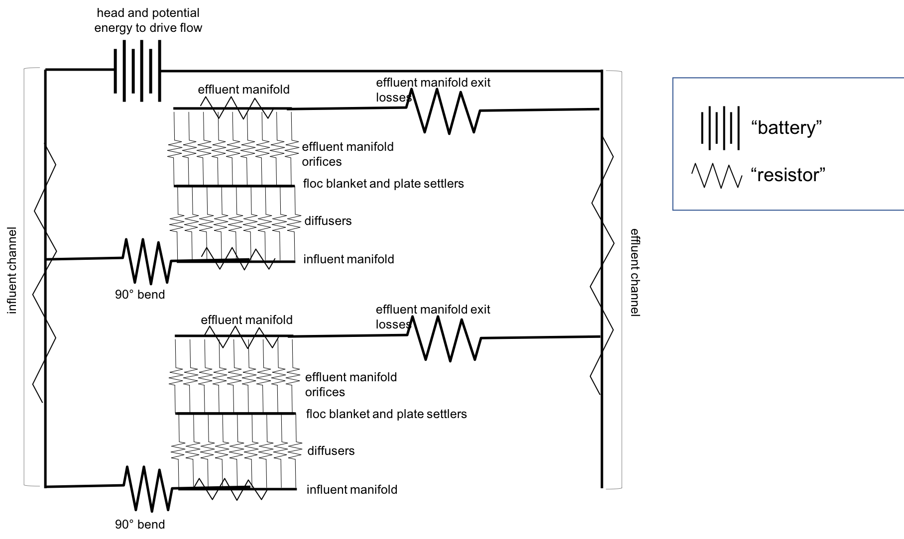
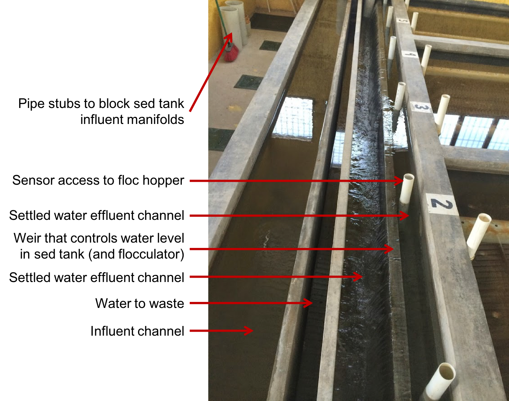

.. raw:: html

    <embed>
       <link rel="canonical" href="https://aguaclara.github.io/Textbook" />
       
    </embed>

.. _title_Sed_Design:

*************************
Sedimentation Tank Design
*************************

.. _heading_Sed_Design:

The AguaClara sedimentation tank is a high-rate vertical flow sedimentation tank that is designed with the following goals:

#. To minimize secondary currents that could send high velocity flow through some of the plate settlers
#. To prevent accumulation of sludge that would tend to become anaerobic and release both dissolved organics (taste and order issues) and methane bubbles that would carry flocs to the top of the sedimentation tank
#. To include a stable floc filter that reduces the settled water turbidity
#. To remove the solids without requiring power or moving mechanical parts
#. To provide a mechanism for the operator to dump poorly flocculated water before it enters the sedimentation tank. This is important to reduce the recovery time when there is a flocculation failure.
#. To ensure easy operation and maintenance.

Components and Flow Paths
==========================

In this section, we will develop a conceptual understanding of the sedimentation tank using figures and images. We will be using a mixture of terminology typically found in water treatment settings and AguaClara-specific terminology. We will discuss the different parts of the sedimentation tank in the sequence that a parcel of water would encounter it, from the beginning of the unit process to the end. The three main sections are:

#. How water enters the sedimentation tank.
#. How water moves through the sedimentation tank.
#. How water leaves the sedimentation tank.

.. _figure_sed_tank_overview:

.. figure:: ../Images/sed_tank_overview.png
    :target: https://youtu.be/ca3xVntxEzw
    :height: 300px
    :align: center
    :alt: Overview of an AguaClara Sedimentation tank (click to be sent to video).

Overview of an AguaClara Sedimentation tank (click image to be sent to video).

.. _heading_Sed_Tank_As_Circuit:

Entering the Tank
==================

To understand how we will use flow distribution as a primary design constraint, we will develop a concept called the "sedimentation tank as a circuit". This concept will be elaborated on as you learn about the sedimentation tank components and design, but we will introduce it now because it is a driving principle for flow distribution in AguaClara sedimentation tanks. The chapter on Manifold design (still needs to be written) will be very useful to understand some of these fluids concepts.

An electrical circuit is a path in which electrons flow from a voltage or current source. Electrical circuits frequently have resistors, which are passive electrical components to create resistance in the flow of electric current. What does this have to do with sedimentation tanks? In our "sedimentation tank as a circuit" concept, we will draw parallels between how electrons flow through a circuit to how water flows through the sedimentation tank.

The AguaClara treatment train is designed so that flow is driven by potential energy. The entrance of the sedimentation tank, where water comes from the flocculator, is the source of the flow. Water then moves through the sedimentation tank and exits to the filter. At different points throughout the flow of water in the sedimentation tank, there are changes in piezometric head from fluid acceleration/deceleration and head loss. In the development of our circuit concept, piezometric head is like electrical resistance.

In electrical circuits, electrons will travel the path of least resistance in a parallel path system. Water is similar in that it will flow in the path of least resistance.

.. _figure_circuit_base:

    Sedimentation tank as a circuit.

:numref:`figure_circuit_base` shows flow through a sedimentation system in which there are two sedimentation bays working in parallel. Each bay has multiple components through which piezometric head changes; wherever a resistor symbol is shown, it means that there is a difference in piezometric head in that section of pipe. We want to understand what is going on between the influent channel and the effluent channel so that we can design to control head loss and fluid flow.

Remember, the goal is to have even flow distribution. It is bad if different flow paths have different head losses or changes in piezometric head. We must consider this between sedimentation bays (comparing each bay to each other) and within a single sedimentation bay (comparing the flows at different points within the sedimentation bay). We want to limit differences in "resistance" to ensure equal flow distribution. Therefore, we define

.. _heading_Good_v_Bad_Hl:

- Anything that makes parallel flow paths different is "bad" head loss.
- Anything that increases head loss through all of the paths, to make differences between the paths less significant, is "good" head loss.

We can artificially introduce the second form of head loss to dominate the resistance and render small variations due to pressure recovery insignificant. We will go through each part of the sedimentation tank to understand how these goals drive AguaClara designs. As we learn about each component, we will attempt to categorize its contribution into creating "good" or "bad" head loss.

.. _heading_Sed_Tank_Influent_Channel:

Influent Channel
--------------------

After water exits the flocculator, it is ready for sedimentation. In AguaClara plants, there is one flocculator per treatment train. However, depending on the plant flow rate, one plant may have multiple sedimentation units operating in parallel; we call each of these sedimentation units a 'bay' or a 'tank'. Because there may be multiple sedimentation bays, we have to distribute flocculated water between the bays. To do this, we have an **influent channel** shown in :numref:`figure_influent_channel_bays`, which receives water from the flocculator and passes it to the sedimentation bays. The channel is long, concrete, and relatively shallow. The objective of the channel is to distribute water and flocs to the sedimentation bays without allowing any settling of flocs in the influent channel. The minimum velocity in the influent channel is about 0.15 mm/s to prevent flocs from settling. In the bottom of the channel, there are pipes that lead to the bottom of each sedimentation bay.

.. _figure_influent_channel_bays:

.. figure:: ../Images/influent_channel_bays.png
    :height: 300px
    :align: center
    :alt: Influent channel with pipes leading to different sedimentation bays.

    Influent channel with pipes leading to different sedimentation bays.

An important question is consider is whether or not the water in the influent channel gets evenly distributed between the different bays. If it does not get evenly distributed, which bay will receive the most water? We know from our understanding of fluids and flow distribution that in a pipe (or channel) with multiple orifices that is closed at one end, the distribution of flow is nonuniform along the length of the pipe; it is decelerating. This nonuniformity is due to conversion of kinetic energy into potential energy as the flow decelerates. This deceleration results in an increase in the piezometric head in the direction of flow.

Where else in fluids have we discussed decelerating flow? We have discussed this in flow expansions. We know that in flow expansions, there are higher pressures and slower velocities downstream. At the end of the pipe, there is low velocity and thus high pressure, driving the flow through the orifices at the end. For this same reason, a channel with multiple exits will have greatest flow thru the last exit.

So, is this type of head loss "good" or "bad"? In our :ref:`definition of "good" and "bad" <heading_Good_v_Bad_Hl>`, we stated that "bad" head loss creates unequal flow in parallel flow paths. The head loss in the influent channel is therefore "bad" head loss because it can lead to different bays in parallel receiving different flows.

Sedimentation units have multiple bays for a few different reasons. Plants with higher flow rates require more sedimentation bays because the flow through each bay is limited by other design constraints, namely upflow velocity, which will be discussed later. Additionally, it is good to have more than one bay for maintenance purposes; if one bay needs to be cleaned, we want to always have another that can be working. Pipe stubs can be used to plug the entrance hole to a sedimentation bay to shut it down for maintenance.

Of note is that the sedimentation tank influent channel is located directly next to a drain channel. This drain channel was built to remove poorly flocculated water from the treatment train. If an operator observes poor flocculation, they can change the chemical dosing in an attempt to improve flocculation. In the meantime, they will want to dump the poorly flocculated water to avoid poor effluent quality. Operators can plug the entrance hole to the sedimentation bays, allowing the influent channel to fill with water. Once water reaches the height of the wall separating it from the drain channel, the water will pour over from the influent channel into the drain channel. This allows operators to easily dump poorly treated water and then easily restart sedimentation once flocculation performance improves.

.. _heading_Sed_Tank_Bottom_Geometry:

Bottom Geometry
-----------------

Now, we will focus on a single bay of the sedimentation system. Flocculated water enters a pipe in the bottom of the influent channel and travels down a few feet. The pipe then has a 90 degree bend and extends along the bottom of the entire length of the sedimentation bay. This section of pipe that distributes water at the bottom of the sedimentation bay is referred to as the **influent manifold** shown in :numref:`figure_influent_channel_manifold`.

.. _figure_influent_channel_manifold:

    Influent channel with pipe leading to one inlet manifold.

.. _heading_sedimentation_tank_inlet_manifold:

Sedimentation Tank Inlet Manifold
---------------------------------

The port velocity for inlet manifold diffusers is set by the slot width, the width of the sedimentation tank, and the upflow velocity in the sedimentation tank. From mass conservation we have

.. math::
  :label: Sed_diffuser_mass_conserve

   Q_{Diffuser} = \bar v_{Jet} W_{Diffuser} S_{Diffuser} = \bar v_{FB} W_{Sed} B_{Diffuser}

Solve for the jet velocity, :math:`\bar v_{Jet}`.

.. math::
  :label: Sed_diffuser_jet_velocity

  \bar v_{Jet}  = \frac{\bar v_{FB} W_{Sed} B_{Diffuser}}{W_{Diffuser} S_{Diffuser}}

For sedimentation tanks that are 1.07 m wide, an upflow velocity of 1 mm/s, with diffusers that are 3.175 mm wide, and assuming that the diffuser wall thickness is small we have a jet velocity of 0.34 m/s.

The maximum inlet manifold velocity can now be determined from Equation :eq:`Manifold_max_v_no_hl_series`. Given a port flow ratio of 85% the maximum manifold velocity is about 0.6 m/s.

`Design the inlet manifold based on a simple manifold analysis <https://colab.research.google.com/drive/1znzBGYHV1RXGqRz3Xm8Oyp7NQmAmkat6#scrollTo=ndlvydp8UMFJ&line=7&uniqifier=1>`_

Water exits the influent manifold through a series of orifices and **diffusers** in the bottom of the pipe shown in :numref:`figure_influent_manifold_diffuser_base`. Orifices refer to the holes that are drilled into the underside of the manifold while diffusers are what we call short stubs of pipe that extend down from the orifice, perpendicular to the influent manifold. The orifices and diffusers point down to the bottom of the sedimentation bay and extend along the length of the pipe at regular intervals to ensure that water is evenly distributed within the bay. The ends of the diffuser tubes are flattened so that they are thin rectangles and when placed side-by-side achieve a line-jet effect. The end of the influent manifold is capped.

.. _figure_influent_manifold_diffuser_base:

.. figure:: ../Images/influent_manifold_diffuser_base.png
    :height: 300px
    :align: center
    :alt: Influent manifold with diffusers.

    Influent manifold with diffusers.

.. _figure_influent_manifold_diffuser_flow:

.. figure:: ../Images/influent_manifold_diffuser_flow.png
    :height: 300px
    :align: center
    :alt: Influent manifold and diffuser flow paths.

    Influent manifold and diffuser flow paths.

Recall the discussion about flow distribution in the influent channel. We know that the sedimentation bay furthest away from the flocculator would receive the most flow from the influent channel due to fluids principles. For the same reasons, the orifice at the end of the influent manifold would receive the most flow in the pipe. Is the type of head loss introduced by the 90 degree bend "good" or "bad"? This head loss is "good" because it increases head loss through all paths equally.

Is the type of head loss in the influent manifold "good" or "bad"? Like the influent channel, it would be "bad" head loss because it can lead to different flow along the length of the sedimentation tank; the end of the sedimentation tank would receive more flow than the beginning.

However, the diffuser system was designed to greatly impact the overall flow distribution in an attempt to make the flow more equal in all parts of the system. Diffusers are designed to introduce 1 cm of head loss (see the section on :ref:`diffuser design <heading_Sed_Tank_Diffuser_Design>` for more information). This is "good" head loss because it uniformly increases the head loss through all flow paths. The "good" head loss from the diffusers dominate the "bad" head loss from the influent channel and manifold, making differences between the paths less significant.

The influent manifold diffuser system straightens the fluid jets that are exiting the manifold so that they have no horizontal velocity component as shown in :numref:`figure_flow_straightening`. This is critical because even a small horizontal velocity causes a large scale circulation that transports flocs directly to the top of the sedimentation tank as shown in :numref:`figure_flow_circulation`. Influent manifolds without flow straightening diffusers are commonly used in vertical flow sedimentation tanks including designs by leading manufacturers.

.. _figure_flow_circulation:

.. figure:: ../Images/flow_circulation.png
    :height: 300px
    :align: center
    :alt: Flow with a horizontal velocity component that causes problematic flow circulation.

    Flow with a horizontal velocity component that causes problematic flow circulation.

The horizontal flow created by the direction of flow inside the manifold results in preferential flow through the plate settlers at the terminal end of the manifold. This is a common problem in conventional sedimentation tanks that don't have flow straightening diffusers or that have horizontal flow in the tank.

The underlying cause of the poor flow distribution between plate settlers (shown in :numref:`figure_flow_circulation`) is because the head loss through the plate settlers is inconsequential and thus there can't be **any** significant horizontal velocity below the plate settlers. It is possible that some plate settler manufactures address this issue by adding flow control orifices at the top of the plate settlers that add sufficient head loss to the flow through every plate settler to minimize the impact of velocity differences below the plates.

The AguaClara solution is to use flow diffusers that simultaneously eliminate horizontal flow and create a line jet that resuspends settled flocs to maintain the floc filter in suspension.

.. _figure_flow_straightening:

.. figure:: ../Images/flow_straightening.png
    :height: 300px
    :align: center
    :alt: Flow with the diffusers to remove horizontal velocity component to prevent problematic flow circulation.

    Flow with the diffusers to remove horizontal velocity component to prevent problematic flow circulation.

The diffusers create a line jet that spans the entire length of the sedimentation tank. This line jet enters the bay going down, but we want the water to ultimately flow up to make our vertical flow sedimentation tank. To get the flow to redirect upwards, we use a **jet reverser**, which is half of a pipe that is laid in the bottom of the bay.

.. _figure_bottom_of_sed_tank_detail:

.. figure:: ../Images/bottom_of_sed_tank_detail.png
    :height: 300px
    :align: center
    :alt: Detail of the bottom of the sedimentation tank.

    Cross-section of the bottom of the sedimentation tank.

You may be wondering, why do we need a jet reverser in the first place? Why don't we just have the diffusers point up to avoid having to change the flow in the first place? The answer has multiple components.

- If the diffusers were to point up, that would mean that any sedimentation that happens near the terminal end of the manifold would accumulate and have no way of being removed.
- If flow were just to point directly up, it would not have an opportunity to sufficiently spread into the width of the sedimentation bay, which could lead to "short-circuiting" and poor flow distribution overall.
- The jet reverser functions as a way to keep flocs suspended by ensuring that anything that settles will be propelled back up from the force of the diffuser jet. Because the diffusers and jet reverser are responsible for resuspension, their design must meet minimum velocity requirements, as derived in the section on :ref:`diffuser design <heading_Sed_Tank_Diffuser_Design>`. The jet reverser and diffuser alignment is not symmetrical; the diffusers are directed to one side of the jet reverser (either by slight rotation of the inlet manifold or by an offset). This is intentionally done to ensure that the diffuser jet never collapses to promote a floc filter, which will be discussed next. :numref:`figure_jet_placement` shows that flat bottomed and centered jets do not create a floc filter while offset jets are stable.

.. _figure_jet_placement:

.. figure:: ../Images/jet_placement.png
    :height: 300px
    :align: center
    :alt: The jet reverser and diffuser alignments; the offset jet is the most successful.

    The jet reverser and diffuser alignments; the offset jet is the most successful.

There is a lot of research interest in determining the optimal upflow velocity for floc filters considering that high velocity is better for resuspension but breaks more flocs. Currently, AguaClara plants use an upflow velocity of 1 mm/s.

.. _figure_flat_bottomed_tank:

   Flat bottomed tank with settled flocs (click to be sent to video).

As shown in :numref:`figure_flat_bottomed_tank` and the linked video, in a flat bottom geometry, flocs settle in the corners of the tank because there is no direct flow of water to resuspend it. Flocs fall in such a way that the corners of the tank will fill first, with more and more flocs settling until the angle of repose is created. This angle that is occupied by flocs suggests that if we want to avoid having flocs settle, we should fill the sides of the tank in with concrete and create a sloped bottom so that there are no surfaces for settling.

The influent manifold, diffusers, and jet reverser work with a **sloped bottom geometry** in an AguaClara plant. The slope on either side of the diffusers is at a 50 degree angle. The bottom geometry allows for smooth flow expansion to the entire plan view area of the bay, and ensures that all flocs that settle are transported to the jet reverser. The diffusers do not touch the bottom of the tank so that flocs on both sides of the diffuser can fall into the jet reverser for resuspension. Thus, there is no accumulation of settled flocs in the main sedimentation basin. Sludge that is allowed to accumulate in the bottom of sedimentation tanks in tropical and temperate climates decomposes anaerobically and generates methane. The methane forms gas bubbles that carry suspended solids to the top of the sedimentation tank and cause a reduction in particle removal efficiency. The AguaClara sedimentation tank bottom geometry prevents sludge accumulation while also ensuring good flow distribution.

.. _figure_sed_cross_section:

    Cross-section of the bottom of the sedimentation tank.

.. _figure_Floc_Filter_Floc_Hopper:

.. figure:: ../Images/Floc_Filter_Floc_Hopper.png
   :target: https://www.youtube.com/watch?v=2x12wGb7xZE
   :width: 400px
   :align: center
   :alt: Sloped bottom tank with fully suspended flocs (click to be sent to video).

   Sloped bottom tank with fully suspended flocs (click to be sent to video).

So we know that the diffusers, jet reverser, and sloped bottom ensure that no sludge accumulates in the bay by creating a system to resuspend any settled flocs.

.. _figure_diffuser_jetreverser:

.. figure:: ../Images/diffuser_jetreverser.png
    :target: https://youtu.be/yJ-8g7vQTSM
    :height: 300px
    :align: center
    :alt: Distribution of flocculated water and resuspension of settling flocs (click to be sent to video).

    Distribution of flocculated water and resuspension of settling flocs (click to be sent to video).

What are the failure modes for this system? For one, we need to ensure that the jet of water exiting the diffuser is able to maintain its upward direction after the jet reverser. The jet is influenced by the flows that are coming down the sloped sides of the tank. Thus, the jet must have enough momentum to remain upwards even with the momentum from other flows downwards. We can control the momentum of the jet by controlling the cross-sectional area of the diffuser slot. A smaller cross-sectional area will increase the velocity of the jet but the mass is the same because the flow rate for the plant is the same, thus increasing the momentum.

 `Garland, 2016 <https://doi.org/10.1089/ees.2015.0314>`_ showed that the jet was unable to resuspend the flocs when the jet velocity was 57 mm/s and was successful for all velocities greater than 75 mm/s. The momentum of the floc density current will increase with the concentration of flocs in the primary filter which is in turn a function of the density and size of the core particles. The primary filter floc concentration will decrease at lower temperatures and thus failure of the jet reverser will occur at high temperatures. Given that Dr. Garland did the research at room temperature using a kaolin suspension it is likely that the 75 mm/s guidelines is sufficiently conservative for all designs that have a 1 mm/s upflow velocity. The jet reverser will fail at some point as the flow rate through the sedimentation tank is decreased. The solution for that case would be to take a fraction of the sedimentation tanks off line to maintain a higher jet velocity.

.. _figure_jet_angle:

.. figure:: ../Images/jet_angle.png
    :height: 300px
    :align: center
    :alt: Jet diameter and current of settled flocs.

    Jet diameter and current of settled flocs.

.. _figure_diffuser_jet_reverser:

.. figure:: ../Images/diffuser_jet_reverser.png
    :target: https://youtu.be/WEM-YyGITlQ
    :width: 400px
    :align: center
    :alt: Jet reverser resuspending flocs (click to be sent to video).

    Jet reverser resuspending flocs (click to be sent to video).

Jet Reverser
-------------

The jet reverser is an AguaClara invention for producing stable floc filters. The jet reverser includes a plane jet that is thin and has a high velocity. The momentum of that jet is important because it must counteract the momentum of the density current of the settled flocs. The thin, high velocity jet has a high energy dissipation rate (see Equation :eq:`EDR_JetPlane`) and a high energy dissipation rate undoubtedly breaks up flocs. If the jet breaks flocs into fragments that have a terminal velocity that is less than the capture velocity of the plate settlers, then the sedimentation tank performance will deteriorate.

Conventional wisdom suggests that breaking up flocs on the way to the sedimentation tank is counter productive. The traditional goal of not breaking flocs led to design of tapered flocculators and guidelines suggesting maximum velocities for transport of those flocs to the sedimentation tank. Dimensional analysis provides the insight that if the constraint for not breaking flocs is actually a velocity, that there must be some way to make that velocity dimensionless if that constraint is rational. In order to identify and characterize the constraint related to floc break up we need to understand the physics of the processes and clearly identify the failure mode.

The maximum shear stress that should be used for design of jet reversers requires further analysis. Flocs composed of less clay and more organic matter or more coagulant nanoparticles will have a lower density and would still be sheared to the same diameter by the fluid shear stress. These flocs would have a lower sedimentation velocity than clay based flocs and thus they would not be captured by the plate settlers. Thus the design constraint for the fluid shear stress should be based on the lowest density floc that is to be captured by the plate settlers.

Different coagulants may well have different bond strengths and flocculant aids that increase the bond strength all merit study with the jet reverser experiment to determine an appropriate fluid shear stress. The shear stress of 0.55 Pa is likely an upper limit for operation without using flocculant aids.

The maximum fluid shear stress for conservative basis of design should be calculated based on minimum water temperature, plate settler capture velocity, and minimum floc density. The solution path is

#. Calculate the diameter of the lowest density floc that has a terminal velocity equal to the capture velocity of the plate settlers.
#. Solve Equation :eq:`d_floc_shear_stress` for the shear stress given the floc diameter.

The jet reverser can be designed given a maximum fluid shear stress that is calculated based on minimum operating temperature, plate settler capture velocity, and floc density. We do not yet have a comprehensive model for floc properties and thus we are not yet able to calculate floc terminal velocity as a function of composition. We do anticipate that floc density decreases dramatically for flocs that consist primarily of dissolved organics and coagulant.

The goal is to derive an equation that will calculate the maximum jet velocity given the upflow velocity, :math:`v_{z_{ff}}`, and width, :math:`W_{Sed}`, of the sedimentation tank. Begin by eliminating the energy dissipation rate from the fluid shear stress, Equation :eq:`fluid_shear_stress`, by substituting the plane jet energy dissipation rate, Equation :eq:`EDR_JetPlane`.

.. math::
  :label: shear_stress_plane_jet

  \tau_{max} = \rho \sqrt{\nu \Pi_{JetPlane} \frac{  \bar v_{Jet} ^3}{W_{Jet}}}

The volumetric flow rate of the plane jet is the same as the volumetric flow rate through the sedimentation tank.

.. math::
  :label: jet_sed_tank_continuity

  \bar v_{Jet} W_{Jet} = \bar v_{z_{ff}} W_{Sed}

Use Equation :eq:`jet_sed_tank_continuity` to eliminate the thickness of the jet, :math:`W_{Jet}` in Equation :eq:`shear_stress_plane_jet`

.. math::
  :label: shear_stress_jet_sed_tank

  \tau_{max} = \rho \bar v_{Jet} ^2 \sqrt{ \frac{\nu \Pi_{JetPlane}}{\bar v_{z_{ff}} W_{Sed}}}

Solve for the maximum permissible jet velocity, :math:`\bar v_{Jet_{max}}`.

.. math::
  :label: max_sed_tank_jet_velocity_of_tau

  \bar v_{Jet_{max}} = \left(\frac{\tau_{max}}{\rho}\right)^\frac{1}{2} \left( \frac{\bar v_{z_{ff}} W_{Sed}}{\nu \Pi_{JetPlane}}\right)^\frac{1}{4}

Given that the velocity gradient governs the design of the flocculator and the entrance to the floc filter we can substitute Equation :eq:`tau_of_mu_G` to obtain

.. math::
  :label: max_sed_tank_jet_velocity_of_G

  \bar v_{Jet_{max}} =  \left( \frac{G_{max}^2 \nu \bar v_{z_{ff}} W_{Sed}}{ \Pi_{JetPlane}}\right)^\frac{1}{4}

The maximum jet velocity increases with width of the sedimentation tank valley because the jet thickness is proportional to valley width and the energy is dissipated more slowly as the jet width increases.

Sedimentation tank design is strongly influenced by the goal of not breaking flocs down to a size that can't be captured by the plate settlers. The maximum combination of velocity gradient, viscosity, and capture velocity is given by Equation :eq:`G_of_vc_and_floc_props`. Our goal is to eventually provide clear guidance on setting :math:`G_{max}`. In the meantime, given a maximum velocity gradient for the inlet to the sedimentation tank, Equation :eq:`max_sed_tank_jet_velocity_of_G` provides the maximum jet reverser velocity.

The ratio of manifold velocity to port velocity can be obtained as the inverse of Equation :eq:`Manifold_max_v_no_hl_series`.

.. math::
  :label: max_sed_tank_manifold_velocity

  \frac{\bar v_{M_1}}{\bar v_{P}} = \sqrt{\frac{2(1 - \Pi_{Q}^2)}{\Pi_{Q}^2 + 1}}

where the port velocity, :math:`\bar v_{P}`, is equal to the jet velocity, :math:`v_{Jet_{max}}`, from Equation :eq:`max_sed_tank_jet_velocity_of_G`. Given a flow uniformity goal, :math:`\Pi_Q`, of 0.85 the manifold velocity must be less than 0.57 of the jet velocity. This constraint ends up being rather severe. Given a maximum velocity gradient of 100 Hz, the maximum jet velocity for a 1 m wide floc filter operating at 5°C and 1 mm/s upflow velocity is 170 mm/s. Equation :eq:`max_sed_tank_manifold_velocity` sets the maximum manifold velocity at 97 mm/s. This low velocity results in large diameter manifold pipes and can significantly increase the cost of the unit process.

The big unknown is the required design value for :math:`\zeta_{breakup}` as defined in Equation :eq:`G_of_vc_and_floc_props`. The expectation is that raw waters with high concentrations of organic matter will have lower density core particles and thus will require a smaller :math:`\zeta_{breakup}` for successful capture of the lower density flocs.

The maximum velocity that could be carried by the inlet manifold given the flow expansion corresponding to the inlet can be calculated using Equation :eq:`D_pipe_min_of_K_and_jet_G_max`. This constraint would allow the use of a smaller diameter inlet manifold than the velocity constraint required by Equation :eq:`max_sed_tank_manifold_velocity`.

The result of the requirement for a low velocity jet to prevent floc break up is that the inlet manifold has to be large in diameter to obtain reasonably uniform flow distribution between the diffusers. This constraint is fairly severe and results in large diameter (and hence expensive) inlet manifold pipes.

The fundamental problem of the inlet manifold is that the diffusers exit perpendicular to the flow of the water in the inlet manifold and thus the flow into the diffusers is set by the difference in piezometric head between the manifold and the floc filter. The kinetic energy at the inlet of the manifold is converted to increased pressure at the end of the manifold. That results in more flow out of the last diffuser ports.

An alternative design would be to have each of the diffuser pipes end inside the manifold with an elbow so that the inlet to the diffuser would face upstream. This change would potentially improve the flow distribution between diffuser pipes, but the large number of diffuser pipes makes this impossible to fabricate without introducing significant additional head loss in the manifold pipe from drag around all of the diffuser inlets.

To overcome the impossibility of having higher velocity in the inlet manifold and directly connecting that to the diffusers we propose to use a two stage manifold system. The manifold pipe will be split into two chambers with the top chamber being the inlet manifold and the bottom section being a new equalization chamber (see :numref:`figure_2stageInletManifold`).

.. _figure_2stageInletManifold:

.. figure:: ../Images/2stageInletManifold.png
    :width: 400px
    :align: center
    :alt: two stage inlet manifold

    The two stage inlet manifold with upper chamber acting as the inlet manifold and the lower chamber acting to equalize the flow from the diffusers (not shown).

The inlet manifold flow is transferred to the equalization chamber through half-pipe ports that are tapered (see :numref:`figure_2stageInletManifoldfromUpstream`) to guide flow into the equalization chamber. The taper is designed to be less than the rate of the flow expansion as given by Equation :eq:`PlaneJet_expansion`.

.. _figure_2stageInletManifoldfromUpstream:

.. figure:: ../Images/2stageInletManifoldfromUpstream.png
    :width: 400px
    :align: center
    :alt: two stage inlet manifold from upstream

    The half-pipe ports face upstream and slope at a rate that is slower than the rate at which the flow expands to ensure that the flow is fully expanded before the entrance into the next half-pipe port.

The manifold system must be designed so that the velocity gradient in all flow expansions is less than the maximum allowed velocity gradient. The minimum diameter of the inlet manifold is set by the largest minor loss coefficient (see Equation :eq:`D_pipe_min_of_K_and_jet_G_max`) which is created by the 90° elbow.

.. _heading_sedimentation_tank_outlet_manifold:

Sedimentation Tank Outlet Manifold
----------------------------------

The sedimentation tank outlet manifold collects the clarified water from the top of the plate setters. The outlet manifold is required to help ensure uniform flow up through the plate settlers.  The outlet manifold has orifices and it is these orifices that provide the majority of the head loss through the sedimentation tank. The target head loss for the outlet manifold is about 5 cm. This head loss helps ensure that flow divides evenly between sedimentation tanks and divides evenly between the plate settlers.

The outlet head loss is dominated by the orifice loss and by the exit loss where the manifold exits the sedimentation tank and enters a channel. The total head loss through the outlet manifold, :math:`h_{e_{T}}`, is thus the sum of those two losses. If pipes were made of all possible diameters, then the ratio of orifice to manifold velocity would be exactly given by Equation :eq:`Manifold_max_v_no_hl_series` and that relationship can be used to eliminate the port velocity.

.. math::
  :label: Outlet_manifold_hl

   h_{e_{T}} = h_{e_{P}} + h_{e_{M}} = \frac{\bar v_{P}^2}{2g} + \frac{\bar v_{M}^2}{2g} =\frac{\bar v_{M}^2}{2g} \left(\frac{1}{\sqrt{{\Pi_{\Psi}}}} + 1 \right)

The maximum manifold velocity can be obtained by solving Equation :eq:`Outlet_manifold_hl` for the manifold velocity.

.. math::
  :label: Outlet_manifold_hl

  \bar v_{M_{max}} = \sqrt{\frac{2 g h_{e_{T}}\sqrt{{\Pi_{\Psi}}}}{\sqrt{{\Pi_{\Psi}}} + 1}}

The solution steps are as follows:

1) Calculate the minimum manifold diameter from continuity and the maximum allowable manifold velocity, :math:`\bar v_{M_{max}}`.
1) Calculate the manifold inner diameter from the next available pipe size.
1) Calculate the actual manifold velocity.
1) Calculate the manifold exit head loss.
1) Calculate the required orifice head loss by subtracting the manifold exit head loss from the desired total head loss.
1) Calculate the orifice diameter from the orifice head loss and the orifice flow rate given the number of orifices.

The head loss through the sedimentation tank is due to:

* entrance and elbow in influent manifold
* major losses in influent manifold (negligible)
* diffuser exit loss
* floc filter (negligible)
* plate settlers (negligible)
* effluent manifold orifices
* effluent manifold major loss (negligible)
* effluent manifold exit

It is convenient to set the total head loss through the sedimentation tank to be equal to exactly 5 cm so that influent and effluent weirs always have the same elevation difference. The effluent manifold orifices are be designed for whatever head loss is required to meet that target.

.. _heading_sedimentor_inlet_channel:

Sedimentor Inlet Channel
========================

The sedimentor inlet channel is designed to distribute the flow uniformly between the sedimentation tanks. The flow paths through the various sedimentation tanks are identical except for the difference in the length of the path in the sedimentor inlet channel. Thus the difference in piezometric head in the sedimentor inlet channel must be small compared with the head loss through a sedimentation tank. The head loss through a sedimentation tank is dominated by the outlet manifold which is designed to have a head loss of 5 cm. This 5 cm of head loss is in turn dominated by the orifice head loss as required to achieve uniform flow distribution between the orifices (see :ref:`sedimentation tank outlet manifold <heading_sedimentation_tank_outlet_manifold>`)

For a simple conservative design we calculate the maximum channel velocity assuming that the channel cross section is constant. In our designs we slope the bottom of this channel to maintain a constant velocity to ensure that flocs are scoured and don't accumulate at the end of this channel where the velocities would be lower if the cross section were constant.

We can use :eq:`Energy_and_Pi_Q_no_manifold_hl` to calculate maximum velocity in the sedimentor inlet channel. In this case the average manifold piezometric head, :math:`\bar \Psi_M` ,is measured relative to the water level in the sedimentor that is above the sedimentor exit weir. This difference in elevation is dominated by the 5 cm of head loss created by the orifices in the sedimentor outlet manifold. Solving for the maximum channel velocity we obtain

.. math::
  :label: vM_Energy_and_Pi_Q_no_manifold_hl

  \bar v_{M_1} = 2\sqrt{g\bar \Psi_{Sed}\frac{1 - \Pi_{Q}^2}{\Pi_{Q}^2 + 1}}

where :math:`\Pi_{Q}` represents the uniformity of flow distribution taken as the minimum sedimentation tank flow divided by the maximum sedimentation tank flow.

The Ten State Standards states, "The velocity of flocculated water through conduits to settling basins shall not be less than 0.15 m/s nor greater than 0.45 m/s." The lower velocity matches the constraint of ensuring that the velocity is high enough to scour flocs along the bottom of the channel and thus prevent sedimentation. The maximum velocity was presumably set to achieve reasonable flow distribution, but that value is dependent on the head loss through the sedimentation tanks.

`Here we calculate the maximum sedimentor inlet channel velocity as a function of the flow distribution uniformity. <https://colab.research.google.com/drive/1znzBGYHV1RXGqRz3Xm8Oyp7NQmAmkat6#scrollTo=8DRdoLVGUmWS&line=3&uniqifier=1>`_

.. _figure_Sedimentor_channel_max_v:

.. figure:: ../Images/Sedimentor_channel_max_v.png
    :width: 400px
    :align: center
    :alt: Sedimentor inlet channel velocity constraints

    The ratio of port velocity to manifold velocity must increase to obtain more uniform flow from the ports.

The channel velocity must be less than 0.45 m/s to obtain a flow distribution uniformity above 0.9 given that the sedimentor head loss is 5 cm.

.. _heading_Sed_Tank_Velocity_Flow:

Comparison of Velocities and Flow in Sedimentation Tank
========================================================

To understand how water flows in the sedimentation tank, we must understand how the water velocity changes with the geometry. There are four distinct zones in the sedimentation tank:

#. The velocity of water exiting the diffusers.
#. The velocity of water moving through the floc filter.
#. The velocity of water that enters the plate settlers.
#. The velocity of water through the plate settlers.

The geometry of the sedimentation tank changes in these four zones, so we will follow these changes to make sure that we understand the conservation of flow. The flow going through the sedimentation tank is the same everywhere, but average velocities are different. The fact that flow rate is velocity multiplied by area, :math:`Q = \bar v A`, will be our guiding principle. In all cases,

| :math:`Q_{Sed} =` flow rate through each sedimentation tank
| :math:`W_{Sed} =` width of each sedimentation tank

.. _figure_sed_tank_flow_conserve:

.. figure:: ../Images/sed_tank_flow_conserve.png
    :height: 300px
    :align: center
    :alt: AguaClara sedimentation tank showing "lost triangle" and its impact on relevant lengths.

    AguaClara sedimentation tank showing "lost triangle" and its impact on relevant lengths.

.. _heading_Sed_Tank_Floc_Filter:

Floc Filter
-------------

After the water exits the diffusers and jet reverser, it flows through the expanded floc filter region where:

| :math:`L_{SedFloc} =` length of the sedimentation tank that has a floc filter
| :math:`\bar v_{z_{ff}} =` upflow velocity of the water through the floc filter

Thus, :math:`Q_{Sed} = W_{Sed}*L_{SedFloc}* \bar v_{z_{ff}}`

The line jet from the diffusers enters the jet reverser to force flow up through the sedimentation bay. The vertical upward jet momentum is used to resuspend flocs that have settled to the bottom of the sedimentation tank. The resuspended flocs form a fluidized bed which is called a **floc filter**. The bed is fluidized because flocs are kept in suspension by the upflowing water.

For a floc filter to form, a sedimentation system requires that 1) all flocs be returned to the bottom of the sedimentation tank and 2) all settled flocs be resuspended by incoming water. As will be discussed soon, plate settlers are used to return flocs to the bottom of the bay, while the jet reverser and sloped bottom geometry allow for floc resuspension. Any surface with a horizontal component in a sedimentation tank must be sloped to allow settled flocs to return to the resuspension zone. A flat bottom geometry does not allow for the formation of a floc filter, as discussed previously.

.. _figure_floc_filter_experiment:

.. figure:: ../Images/floc_filter_experiment.png
   :target: https://www.youtube.com/watch?v=w8ZFCz54IBs
   :width: 400px
   :align: center
   :alt: Floc filter formation over time (click to be sent to video).

   Floc filter formation over time (click to be sent to video).

Studies by AguaClara researchers have found that floc filters improve the performance of a sedimentation tank and reduce settled water turbidity by a factor of 10 for multiple reasons (`Garland et al., 2017 <https://www.liebertpub.com/doi/10.1089/ees.2016.0174>`_):

- By providing additional collision potential. The high concentration of particles, with a suspended solids concentrations of approximately 1-5 g/L, leads to an increase in collisions and particle aggregation. As discussed for vertical flow sedimentation tanks, flocculation can occur in a floc filter due to shear from suspended flocs which are colliding and growing. Fluidized flocs provide a collision potential of a few thousand. This collision potential is small compared to the collision potential from the flocculator. So how does a small :math:`G_{CS} \theta` cause a large reduction in turbidity? The two-fold answer may be that the lower :math:`G_{CS}` value provides an opportunity for all flocs to grow larger without floc breakup. The high concentration of flocs provides many opportunities for clay particles to collide with big flocs, but it is not clear if or when those collisions are successful. We also want to know which flocs are active or inactive in collisions in the floc filter. See the section on :ref:`floc filter design <heading_Sed_Tank_Floc_Filter_Design>` for more information.

- By creating a uniform vertical velocity of water entering the plate settlers.

- By transporting excess floc consolidation pipe with a drain port, called the floc hopper. The floc hopper is discussed in the next section.

While we have just explained three reasons that the floc filter improves sedimentation effluent quality, we do not yet have a model for floc filter performance. Additional research is needed to create this model, and to determine optimal upflow velocity.

Consider the requirements that we have stated for the creation of the floc filter. Could we design for a floc filter in a treatment plant that experiences flow variability? There are some plants that only run for certain hours of the day. While this intermittent flow would impact many parts of the plant, how would it impact the floc filter specifically? Can a settled floc filter be resuspended?

We do not yet have a way to design for variable or intermittent flow rates in a sedimentation tank. The ability of a settled floc filter to resuspend is dependent on the characteristics of the flocs themselves. For example, sticky and clumpy flocs would have a more difficult time resuspending because they tend to settle into hard masses in the absence of sufficient upflow velocities. The capacity for resuspension may require site-specific analysis. The AguaClara pilot PF300 in testing at the Cornell Water Treatment Plant is going to determine whether the floc filter at that site will be able to intermittent flow; the pilot plant and the Cornell Water Treatment Plant will be offline from around 10pm - 5am daily.

It is of interesting note that the suspended solids concentration in the floc filter is approximately 1-5 g/L. This concentration corresponds to measurements of thousands of NTU, which is remarkably turbid water. A water treatment plant could have 5 NTU water entering the plant, and water in the bottom of the sedimentation tank could have 1000 NTU. This is one clue that there are interesting things happening in the floc filter; the bottom of the sedimentation tank can be a completely different world from the rest of the treatment process.

An understanding of the bottom of a sedimentation tank is important to understand how sedimentation tanks work. However, most sedimentation tanks do not allow the operator to observe what is happening. Without being able to observe the bottom of the sedimentation tank, an operator would not know what is happening or if a floc filter is forming successfully. AguaClara research teams are working to develop a probe to get data on floc filter performance. Until then, there are two ways to learn about the floc filter. The AguaClara plant at the University of Zamorano in Honduras was built with a translucent wall on one end of a sedimentation bay. This allows students and operators to observe the floc filter. The AguaClara pilot PF300 in testing at the Cornell Water Treatment Plant has small sample ports installed into the side of the reactor. Drawing a sample of water at different heights of the reactor will indicate if a floc filter has grown, and how deep it is.

Let's recap some important conclusions from this section on the floc filter.

- The low G flocculation in the floc filter may allow for the rapid growth of the flocs coming from the flocculator.
- The floc filter reduces the effluent turbidity from the sedimentation tank.
- The floc filter requires a mechanism to keep the flocs resuspended:
  - An upflow velocity of approximately 1 mm/s is the current AguaClara design parameter;
  - Sloped surfaces to return flocs to the resuspension point is necessary to prevent floc build-up.
- We do not have a model for floc filter performance, meaning that we don't know the optimal floc filter depth or optimal upflow velocity.
- We do not yet have a consistent way for operators to observe the floc filter.
- We do not know what exactly contributes to the ability of a floc filter to resuspend or survive variable flow.

.. _heading_Sed_Tank_Floc_Hopper:

Floc Hopper
-----------

The **floc hopper** provides an opportunity for floc consolidation. The floc weir controls the depth of the floc filter because as the floc filter grows, it will eventually reach the top of the floc weir. Because flocs are more dense than water, the flocs "spill" over the edge of the floc weir which allows the floc filter to stay a constant height while sludge accumulates and consolidates in the floc hopper.

.. _figure_floc_hopper_highlight:

.. figure:: ../Images/floc_hopper_highlight.png
   :target: https://youtu.be/xh9dTjWRoto
   :width: 400px
   :align: center
   :alt: Floc hopper detail with flocs "spilling" over the wall (click to be sent to video).

   Floc hopper detail with flocs "spilling" over the wall (click to be sent to video).

Consolidated sludge in the bottom of the floc hopper is then removed from the sedimentation tank through small drain valve controlled by the operator. Floc hoppers in the lab-scale and PF300 setting are currently set at a 45 degree angle, but further optimization is needed.

.. _figure_benchtop_sed:

.. figure:: ../Images/benchtop_sed.png
    :height: 300px
    :align: center
    :alt: Benchtop sedimentation tank setup, highlighting the floc filter and floc hopper.

    Benchtop sedimentation tank setup, highlighting the floc filter and floc hopper.

The floc hopper allows for a self-cleaning sedimentation tank. By gravity, flocs are sent over to a floc hopper. This means that operators only have to clean the sedimentation tank once every three to six months because there is no stagnant accumulation of anoxic sludge. When operators do clean the sedimentation tank, they are primarily cleaning plate settlers. Under normal operation, operators can open the floc hopper drain valve whenever they want to easily drain the sludge. We don't yet have a method to guide the operation of the floc hopper, so operators determine how frequently to drain the floc hopper from experimental and operational experience. Without the floc filter transport system, other methods would be required to remove accumulated sludge in the bay. Mechanical sludge removal systems are common alternatives but are well known to be costly to install and a challenge to maintain.

We've stated that a benefit of the floc filter is that flocs can be removed without mechanical assistance, but why do we need the floc hopper at all? Why can't we just install drain holes in the bottom of the sedimentation tank so that any accumulated sludge is removed? This is a question that plagued AguaClara in its early years. At first, before we were able to successfully build and operate a floc filter, we had sludge accumulate in the bottom of the sedimentation bay. Therefore, we needed to remove the sludge with drain holes at the bottom. However, to have those drain holes where the sludge was accumulating in the tank, designers made a flat bottom tank. But as we now know, the flat bottom tank is part of the reason that there wasn't any floc filter forming. As soon as we realized that we could grow a floc filter with a sloped bottom tank and a jet reverser, we could not use drain holes in the bottom of the tank. Why? Because in the bottom of tanks with floc filters created by jet reversers, there is no settling. Drain holes at the bottom of a sloped tank would be draining a combination of flocculated water and floc filter water, neither of which are consolidated thus making the draining ineffective and inefficient. A benefit of the floc hopper is that there is no upflow velocity, which means that the sludge is able to settle and become more dense, allowing for less water waste from draining sludge.

Floc filter flow into the floc hopper is a function of the mass flux of particles into the sedimentation tank. In order to optimize the floc hopper design, we need to characterize the consolidation rate of the flocs. We do not have a good model for this yet; developing one would allow us to optimize design and guide operators for how much and how frequently the floc hopper should be drained.

.. _heading_Sed_Tank_Plate_Settlers:

Plate Settlers
--------------------

After flowing through the floc filter, flocs reach the **plate settlers**. Plate settlers are sloped surfaces that provide additional settling area for flocs, thereby increasing the effective settling area of the sedimentation unit without increasing the plan view area. AguaClara plate settlers are sloped at 60 degrees. In our discussion of horizontal and vertical flow sedimentation tanks, an important design parameter was capture velocity which was set by flow rate and plan view area of the sedimentation tank. With the introduction of plate settlers, the important design parameter changes. What matters is not just the plan view area of the sedimentation tank, but instead the projected area of all of the surfaces where particles can settle out, which we call the effective settling area. Without plate settlers, the only way we could improve performance and impact the capture velocity was by increasing the plan view area of the sedimentation tank. With plate settlers, we can improve performance by adding additional settling area without increasing the plan view area. This allows for greater treatment efficiency at low cost because we can maintain a small footprint. Note that plate settlers can also be referred to as lamella settlers, or lamellas.

The first thing that we will discuss is how flocs can settle on plates. To understand this, we will ask a few questions about how particles and flocs will flow between two plate settlers.

1) What is the critical path?

We need particles to settle on the bottom plate for it to be effectively captured. Thus, the critical path can be shown by a floc that enters the plate settlers closest to the upper plate, because it will have the greatest distance to settle.

.. _figure_plate_settler_critpath:

.. figure:: ../Images/plate_settler_critpath.png
    :height: 300px
    :align: center
    :alt: Critical path between two plate settlers.

    Critical path between two plate settlers.

2) How far must the particle settle to reach the lower plate?

Let's make a simplification and assume that water is flowing with uniform velocity between the plates, represented by a "top hat" velocity profile. This is a significant assumption, but it is used to help us understand the critical path. The fluid is carrying the floc between the inclined plates while gravity is pulling the floc down. Therefore, a particle must fall the vertical distance between the plates, which is the critical height, :math:`H_c`. The plates are positioned at an angle, :math:`\alpha`, to ensure that settling flocs slide down to the floc filter. The critical height :math:`H_c` can be expressed in terms of plate settler length, :math:`L`, and plate settler angle, :math:`\alpha`, by :math:`H_c=\frac{S}{cos\alpha}`.

.. _figure_plate_settler_critheight:

.. figure:: ../Images/plate_settler_critheight.png
    :height: 300px
    :align: center
    :alt: Critical height between two plate settlers.

    Critical height between two plate settlers.

3) What is the total vertical distance that the critical particle will travel?

Taking the vertical component of the critical path, we see that the total vertical distance is :math:`H` where :math:`H =L sin\alpha`.

4) What is the net vertical velocity of a floc between the plate settlers?

The fluid carries the floc between the plate settlers while gravity pulls the floc down. The velocity through the plate settlers has both a horizontal component, :math:`\bar v_{x_{Plate}}`, and vertical component, :math:`\bar v_{z_{Plate}}`, with a resultant velocity we call :math:`\bar v_{\alpha_{Plate}}`.

.. _figure_plate_settler_valpha:

.. figure:: ../Images/plate_settler_base.png
    :height: 300px
    :align: center
    :alt: Velocity components between two plate settlers.

    Velocity components between two plate settlers.

This means that the net vertical velocity :math:`v_{z_{net}}` is the vertical component of flow minus the settling velocity of the floc. Recall our previous discussion of terminal velocity and capture velocity; in this case, because we are designing a plate settler specifically to capture the critical particle, the terminal velocity equals the capture velocity. The terminal velocity is a function of the velocity that the critical particle settles at and the capture velocity is a function of the reactor geometry which we are designing to capture the critical particle. Thus, :math:`\bar v_{z_{net}} = \bar v_{z_{Plate}} - \bar v_{c}`.

.. _figure_plate_settler_vnet:

.. figure:: ../Images/plate_settler_vnet.png
    :height: 300px
    :align: center
    :alt: Net velocity between two plate settlers.

    Net velocity between two plate settlers.

From answering the questions above, we know that the particle must fall the distance :math:`H_c` at its terminal velocity in the same amount of time that it rises a distance :math:`H` at its net upward velocity, because otherwise it would not be captured; time to travel :math:`H_c` = time to travel :math:`H`

Finding time by dividing by distance by velocity for each travel,

.. math::

  Time = \frac{H_c}{\bar v_c} = \frac{H}{\bar v_{z_{net}}}

Substituting for :math:`\bar v_{z_{net}} = \bar v_{z_{Plate}}-v_{c}`,

.. math::

  Time = \frac{H_c}{\bar v_c} = \frac{H}{\bar v_{z_{Plate}}- \bar v_{c}}

Using trigonometric substitutions for :math:`H_c` and :math:`H`,

.. math::

  Time = \frac{S}{\bar v_c cos\alpha} = \frac{L sin\alpha}{\bar v_{z_{Plate}} - \bar v_{c}}

Rearranging to solve for :math:`\bar v_{c}`,

.. math::

  \bar v_c = \frac{S \bar v_{z_{Plate}}}{Lsin\alpha cos\alpha + S}

Rearranging to solve for :math:`\frac{\bar v_{z_{Plate}}}{\bar v_{c}}`,

.. math::

  \frac{\bar v_{z_{Plate}}}{\bar v_{c}} = 1+\frac{L}{S}cos\alpha sin\alpha

The equation that we determined for critical velocity, :math:`\bar v_c`, shows its dependence on plate settler geometry. Through another derivation, we can prove that by considering the total projected area over which particles can settle, we determine the same critical velocity.

Beginning with :math:`Q = \bar vA`, we can modify the equation to fit the specific flow through a plate settler, :math:`Q = \bar v_{\alpha_{Plate}}SW`.

Using trigonometric substitutions, we know that :math:`\frac{\bar v_{z_{Plate}}}{\bar v_{\alpha_{Plate}}} = sin\alpha` and :math:`\frac{\bar v_{z_{Plate}}}{sin\alpha} = v_{\alpha}`. So,

.. math::

  Q = \frac{\bar v_{z_{Plate}}SW}{sin\alpha}

Determining the horizontal projection of the plate settlers,

.. math::

  S = Lcos\alpha + \frac{S}{sin\alpha}

Substituting for area, :math:`A`,

.. math::

  A = (Lcos\alpha + \frac{S}{sin\alpha})W

Solving for :math:`\bar v_c = \frac{Q}{A}`

.. math::

  \bar v_c = \frac{S \bar v_{z_{Plate}}}{Lsin\alpha cos\alpha + S}

We can see that there are five parameters which will impact each other in our design :math:`\bar v_{z_{Plate}}, \bar v_{c}, L, S`, and :math:`\alpha`. AguaClara plants typically use constants for :math:`\bar v_{z_{Plate}}, \bar v_{c}, S`, and :math:`\alpha`, leaving :math:`L` to be calculated. More information is found in the section on :ref:`plate settler design <heading_Sed_Tank_Plate_Settler_Design>`.

The 'active' sedimentation zone refers to the area of the tank in which water can flow through the plate settlers where:

| :math:`L_{SedActive} =` length of the sedimentation tank that includes entrance to a plate settlers
| :math:`\bar v_{z_{Active}} =` upflow velocity of the water entering the plate settlers; vertical velocity in 'active' region

The only reason that there is a distinction between this area and the floc filter area is because plate settlers are built at an angle. This angle creates a "lost triangle" because there is a space in which the plate settlers are not effective and water does not flow through them. Because the active length is less than the floc filter length, :math:`L_{SedActive} < L_{SedFloc}`, and because flow must be conserved, the average active velocity must be greater than the average upflow velocity through the floc filter, :math:`\bar v_{z_{Active}} > \bar v_{z_{ff}}`. The same flow going through less area means that the velocity must increase.

Thus, :math:`Q_{Sed} = W_{Sed} L_{SedActive} \bar v_{z_{Active}}`, and :math:`\bar v_{z_{Active}} > \bar v_{z_{ff}}`.

Now, we will discuss flow through plate settlers where:

| :math:`\bar v_{z_{Plate}} =` upflow velocity of the water in the plate settlers; vertical velocity component between the plate settlers
| :math:`S =` spacing between plate settlers
| :math:`B =` center-to-center distance between plate settlers
| :math:`T =` thickness of plate settlers
| :math:`L =` length of plate settlers

We know that plate settlers have a certain thickness and take up area, which means that once we reach the plate settler zone, there is less area for water to travel through. Because flow is conserved and there is a decrease in area, we know that the upflow velocity of water through the plate settlers must increase compared to the upflow velocity of water below the plate settlers, :math:`\bar v_{z_{Plate}} > \bar v_{z_{Active}}`.

Thus, :math:`\bar v_{z_{Plate}} > \bar v_{z_{Active}} > \bar v_{z_{ff}}`

In addition to the vertical velocity component increasing between the plates, the resultant velocity of water between the plates increases compared to :math:`\bar v_{z_{Active}}`. What are the two reasons that this is true?

- The first reason, as already discussed, is that the vertical velocity component needs to increase to ensure conservation of flow.

- The second reason has to do with the fact that the resultant velocity of water between the plates is at an angle. This means that there is a horizontal component introduced. Because we know that the vertical velocity increases, and there is a new positive horizontal velocity component, the resultant velocity must also increase.

Now, consider a tube settler used in a lab setting instead of a plate settler. If a tube settler was designed with an angle to mimic a plate settler, would the water change vertical velocity after the angle? How does this compare to the plate settler scenario? In the case of the tube settler, the vertical velocity does not increase because there is no change in flow area; the diameter of the tube is constant throughout, meaning that for the flow to remain constant, the velocity does not change.

For another example of flow conservation, let's consider the relationship between :math:`\bar v_{z_{Plate}}*S` and :math:`\bar v_{z_{Active}}*B`. :math:`B` is the center-to-center distance between plate settlers, and does not take into account the thickness of plate settlers. Considering only the center-to-center distance means that the area for water to travel through does to change from before the plate settlers to within the plate settlers because we are not accounting for any thickness. If the area does not change, then velocity should also not change to keep flow conserved. However, if we are to account for thickness, we must discuss :math:`S` which is the spacing between plate settlers. This does take into account the change in area,  which means that the velocity would need to increase through the lesser area. So if we look at the flow through plate settlers, we can confirm that :math:`\bar v_{z_{Plate}}*S = \bar v_{z_{Active}}*B`.

By using flow conservation and plate settler geometry, we can begin to understand the mathematical relationships that drive design.

Now that we have established how flocs settle on the plate and the increase in plan view area that plate settlers offer, we need to discuss how flocs will act once they are on the plates. We want particles and flocs that settle to agglomerate and slide down the plate settlers to be returned to the floc filter. We will explore this concept by first considering the desired spacing between plate settlers.

Let's start with a basic question. If we know that adding plate settlers improves performance, why don't we just keep adding more and more plate settlers to our system? Is there any impact of placing plates closer together?

We know that more plates means more effective settling area which means that we could remover more particles and make our tank smaller to save money and limit the use of concrete. But how close can those plates be?

The Ten State Standards report that plate settlers should have a separation of two inches, with very long plate settlers, which means very deep tanks. Sedimentation tanks are usually 4 meters deep, maybe because filters are also deep. This is a result of the engineering context rather than the basic design principles. The Ten State Standards are primarily based off the modification of existing sedimentation tanks which were usually built deep and then plate settlers were added. This means that there wasn't added incentive to optimize the entire plate settler and tank process because the tanks were already built. However, AguaClara designs are made to use all of the AguaClara innovations in a green field, meaning that we are incentivized to optimize every part of this design process.

AguaClara plants can design for changes in the depth and/or plan view area of the tank for optimal plate settler efficiency. We want to have the smallest and shallowest tanks possible for low cost and ease of construction. We know that in the plate settler design, there is a dimensionless parameter of plate spacing to length, :math:`\frac{S}{L}`. The ratio is close to constant, which means that if we double the length of the plate settler, we can double the spacing between the plate settler and get the same performance as when we started. Conversely, if we halve the distance between the plate settlers, we can halve the length of the plate settlers. But how far can we push this? Can we make really compact plate settlers?

What we really want to know is: what is the connection between spacing of plate settlers and performance?

.. _figure_plate_settler_depth:

    Relationship between plate settler spacing and sedimentation tank depth.

When we were discussed how plate settlers promote settling, we assumed a uniform velocity profile between the plates. However, we know from fluid mechanics and boundary layer rules that in reality, there is a nonuniform velocity profile. The flow between the plates, as determined by the Reynolds number, is laminar which means that there is a parabolic velocity profile between the plates and the shape of the parabola is affected by the distance between the plates.

.. _heading_Floc_Rollup:

There are some cases in which the plates are so close that even if flocs settle on the plate, they do not slide down. This is called **floc rollup**. Consider the following questions:

1) Why would flocs roll up?

It is a force balance! There is a force of gravity pulling the particle down, balanced with the force that the fluid flow exerts through drag related to viscosity. But why does it matter if plates are close together for floc roll up? The average velocity between plates is about 1 mm/s and is the same for any spacing. However, when plates are closer together the velocity profile is much steeper. Compared with plates with greater spacing, the closer plates cause there to be a higher velocity closer to the surface of the plate. This means that flocs between closely spaced plates will see a greater velocity closer to the plate settler, which will impact the force balance. The derivation of the force balance is found in the section on :ref:`plate settler design <heading_Floc_Rollup_Slide_Velocity_Derivation>`. The velocity that the flocs slide down the plate is called :math:`v_{Slide}`.

2) How would you define the transition between floc rollup and slide down? What would describe the case for a floc that is stationary on the plate settler (not rolling up or sliding down?)

The transition is defined as when the gravitational forces and the fluid drag forces match.

3) Will little flocs or big flocs be most vulnerable to floc rollup?

This is a very complicated question. We would expect big flocs to slide down because they are heavier and have a greater gravitational force. However, bigger flocs also have a greater drag force and are out further into the flow. Because of the velocity profile, they will feel a higher velocity than smaller flocs. This means that the answer to this question should be determine mathematically, which it is in the next section.

4) Will large or small spacing between plates cause more floc rollup?

As we have already suggested, small spacing between plates will cause more floc rollup due to the steeper resulting velocity profile between the plates.

.. _figure_floc_rollup:

    Floc rollup between two plates (click to be sent to video).

So what does this mean for plate settler spacing? Let's review some results from lab experiments. The following graph shows minimum plate settler spacing (mm) as a function of floc terminal velocity (mm/s). Some important things to note are that AguaClara plate settlers are designed for a capture velocity of 0.12 mm/s (recall that this capture velocity means that we want to capture flocs that are settling at 0.12 mm/s and faster). Before AguaClara filters were designed and deployed, AguaClara adopted the 0.12 mm/s capture velocity in an effort to reduce effluent turbidity as much as possible.

A plot of Equation :eq:`Plate_S_min_of_fractal_of_2` reveals that the minimum spacing is strongly influenced by the density of the core particle and by the temperature. The minimum spacing increases as the size of the primary particle, :math:`D_{cp}`, decreases. This is an important insight because flocs that are made of coagulant nanoparticles and dissolved organics are the most difficult flocs to capture. Flocs made of coagulant nanoparticles are less dense than flocs made of clay. Coagulant nanoparticle flocs are produced when water treatment plants are used to remove dissolved organics or arsenic or when high coagulant dosages are used.

.. _figure_SofRollupwithfractal2:

.. figure:: ../Images/SofRollupwithfractal2.png
   :height: 300px
   :align: center
   :alt: Floc roll up as a function of core particle density and temperatures

   Plate settler spacing must increase to capture low density flocs.

Given that AguaClara uses a lower upflow velocity, :math:`\bar v_{z_{Plate}}`, than many plate settler designs it is reasonable for us to use more closely spaced plates. More work is required to characterize the density and size of the core particles as a function of raw water constituents to provide guidance on the required plate spacing.

AguaClara plate settlers are currently using separations of 2.5 cm, which is far above the constraint of floc roll up except for very low density flocs. As floc density decreases, as we expect for organic matter, minimum spacing increases. However, we don't yet know what that spacing is or where the boundary is because we don't know the properties of the humic acid-coagulant flocs. Further research is required here to determine the floc properties of flocs that are dominated by dissolved organic matter.

Why does the plate settling distance matter so much? How much does it impact the rest of the sedimentation tank and its design?

One impact of plate settler spacing is on sedimentation tank depth. We know that the spacing between plate settlers has a strong influence on sedimentation tank depth and closer plate settlers allows for shallower tanks. There is a diminishing effect for small spacings, meaning that the difference in depth between 5 and 2.5 cm spacing is greater than the different in depth between 2.5 and 1 cm spacing. Because AguaClara does not yet have a good model for non-clay flocs, we cannot optimize our plate settler spacing and thus cannot optimize for the shallowest tanks possible.

.. _heading_Sed_Tank_Plate_Settlers_Head_Loss_Intro:

Another impact of plate settler spacing is on flow distribution in the tank. This is related to our previous discussion of pressure recovery and flow distribution. Reduced spacing between plates leads to an increased pressure drop through the plate settlers due to higher head loss as shown in Equation :eq:`plate_settler_headloss`. Therefore, plate settlers with small spacing will have more uniform flow distributions because head loss will dominate. This use of head loss can potentially get us better flow distribution. When the plates are brought closer together, there is more shear between the plates because the average velocity remains the same. The velocity gradient is higher between closer plates, which leads to higher shear, and thus higher head loss.

However, if the plates are closer together, then they will be shorter in length to keep the capture velocity constant. The decrease in length decreases the total amount of shear. The head loss from the competing impacts to shear can be determined through a force balance and the Navier-Stokes equation, as shown in the derivation of :ref:`head loss through a plate settler <heading_Sed_Tank_Hl_thru_Plate_Settlers>`.

.. _figure_plate_settler_headloss_spacing:

.. figure:: ../Images/plate_settler_headloss_spacing.png
   :height: 300px
   :align: center
   :alt: Head loss as a function of plate settler spacing.

   Head loss as a function of plate settler spacing.

The important thing to note is that after determining head loss as a function of plate settler spacing, we realize that the plate settlers do not provide much head loss at the design separation of 2.5 cm. Head loss through plate settlers is really small, which means that they do not contribute much to equalizing flow distribution.

The velocities of any eddies or mean flow need to be less than 4 mm/s to achieve uniform flow through plate settlers. This means that if there is any flow entering the plate settlers at greater than 4 mm/s, the head loss provided by the plate settlers will not be sufficient to dampen the nonuniformity and there will not be adequate flow distribution. Luckily for us, the upflow velocity through the sedimentation tank is on average 1 mm/s, which fulfills the requirement of less than 4 mm/s. The floc filter plays a very important role here in providing uniform vertical flow of 1 mm/s so that the flow between the plate settlers can be close to uniform.

However, remember the diffusers that distribute water into the sedimentation tank? They create velocities on the order of 100 mm/s. Those high initial velocities are damped out by the floc filter which helps to distribute the flow. If we weren't able to use the floc filter to dampen the flow to be less than 4 mm/s, then the plate settlers would not provide any head loss to help with uniform flow distribution. This point about uniform flow is really important.

.. _heading_Floc_Volcano_Intro:

Floc Volcanoes
==============

Now, lets discuss a plate settler problem that has not yet been solved: **floc volcanoes**. Floc volcanoes occur when water and flocs rise preferentially in one part of the sedimentation tank. At points of high velocity, flocs can rise to the surface of the water. Consider the following case: an AguaClara plant in San Nicolas, Honduras, was witnessing intermittent floc volcanoes in the sedimentation tanks. During operation, the plant was treating raw water with 4 NTU with a PACl dose of 3.5 mg/L. The settled water turbidity varied between 0.5 and 4 NTU. What might explain the floc volcanoes and very poor plant performance? Try coming up with a hypothesis that matches the information given to us from the plant. We want to figure out what is causing this problem so we can design a solution. What questions would you want to ask the technicians or engineers in Honduras? This exercise emphasizes the idea that asking the right questions are sometimes the hardest first step to learning more information.

Some hypotheses and questions may include:

1) Is the problem related to dissolved air flotation? Dissolved air coming out of flocculation can cause flocs to float to the top.

After asking the operators, we are told that there are not any bubbles in the sedimentation tank.

2) Is the problem regularly intermittent? Is there anything that we can correlate these fluctuations to?

After asking the operators, we are told that the floc volcanoes appear in the early afternoon each day.

.. _figure_temp_turbidity:

.. figure:: ../Images/temp_turbidity.png
    :height: 300px
    :align: center
    :alt: Turbidity as a function of time in San Nicolas, Honduras.

    Turbidity as a function of time in San Nicolas, Honduras.

Using this new information, we have to make another hypothesis about why the floc volcanoes are impacted daily. Perhaps it is related to the sun and daily temperature changes. We can ask the operators to measure the water temperatures so we can do some analysis. The operators measure temperature and we plot the results, providing the following graph.

We know that this plant brings water from a water source about 14 km away. The water is transported in a galvanized iron pipe that is placed on the surface of the ground because there is no concern about freezing pipes in Honduras (galvanized iron is not damaged by UV like PVC pipe is). The pipe functions as a 14 km water heater, raising the temperature of the water to the plant after noon.

But why does the temperature difference cause a problem for the plate settlers?
The problem is that there is warmer water entering the sedimentation tank than what is in it. This temperature difference causes a density difference in the sedimentation tank and plate settlers. The less dense, warmer water rises to the top of the plate settlers while the cold water drops to the bottom of the plate. This creates a current, allowing water to flow up on the top and settle on the bottom. The temperature gradient changes slowly over a few hours.

.. _figure_temp_tube_settler:

.. figure:: ../Images/temp_tube_settler.png
    :height: 300px
    :align: center
    :alt: Hot water rising and cold water settling in a tube settler.

    Hot water rising and cold water settling in a tube settler.

So, now that we think we know what the problem is, how would we try to solve it? One idea would be to paint the entire line to reflect heat, but this is not feasible due to cost. The town Water Board had been maintaining the distribution line by cleaning weeds and brush from the pipe. The solution ended up being to just let the weeds grow over the pipe to provide shade. We haven't yet come up with a real solution. A possible long-term solution could be to design a sedimentation tank that has a really short residence time. The longer the residence time in the sedimentation tank, the worse the problem is because there is a large variation between the water that entered it last night and the water that enters it this afternoon. A tank with a really short residence time, on the order of a few minutes, would ensure that the water coming in would be very close to the water already in the tank.

Let's recap some important conclusions from this section on plate settlers.

#. Reynolds number calculations of flow through plate settlers prove that there is laminar flow between plate settlers. This is important because it allows us to assume that a parabolic velocity profile is established.
#. There is very low head loss between plate settlers so they will not do a good job of helping to achieve uniform flow between the plate settlers.
#. The plate settlers are designed to capture flocs with sedimentation velocities greater than the settle capture velocity. AguaClara currently uses :math:`\bar v_c = 0.12` mm/s but this value needs to be further optimized; we would like to know how settled water turbidity changes with capture velocity. Future work includes choosing a settle capture velocity based on overall plate performance.
#. Plate settler spacing:

   a. Plate settler spacing determines the ability of flocs to roll down the incline.
   b. Smaller spacings between plate setters have diminishing returns in terms of sedimentation tank depth. The current AguaClara spacing is 2.5 cm but there is room for further optimization.
   c. Flocs made from natural organic matter (NOM) may be less dense, more prone to floc rollup, and may require larger spacing between plate settlers.

.. _heading_Sed_Tank_Exit:

Exiting the Tank
=================

Now that we have passed through the plate settlers, we are ready to leave the sedimentation tank.

.. _heading_Sed_Tank_Effluent_Manifold:

Submerged Effluent Manifold
------------------------------

The **submerged effluent manifold**, sometimes called a launder, collects settled water from the sedimentation tank. It is a horizontal pipe that extends along the length of the tank and is located above the plate settlers but below the surface of the water. The submerged pipe has orifices drilled into its top; water enters the pipe through the orifices and the pipe leads out of the sedimentation tank. Recall that the influent manifold also uses a submerged pipe and orifice design to distribute flow. However, unlike the influent manifold, the effluent manifold does not include diffusers because we do not need to precisely control velocity and flow direction.

.. _figure_effluent_manifold:

.. figure:: ../Images/effluent_manifold.png
    :height: 300px
    :align: center
    :alt: Effluent manifold from the side- and top-view.

    Effluent manifold from the side- and top-view.

The orifices in the pipe are evenly distributed along the length of the pipe to promote even flow collection from the tank. The orifices are designed create uniform head loss. Is this head loss "good" or "bad"? Like the diffusers, the orifices in the effluent manifold create "good" head loss because they increase head loss through all flow paths. This is critical because there is pressure recovery within the effluent manifold that creates "bad" head loss.

Are there effluent manifold exit losses? What type of head loss would it be? This head loss is a result of exit loss into its receiving channel. Is it "good" or "bad"? This head loss is also "good" head loss because it impacts all flow paths the same; each sedimentation tank bay and all water within a single bay is subject to the same amount of exit loss.

Why did AguaClara design the effluent manifold to be submerged? There are 3 main reasons.

#. It is designed to be submerged because sometimes there are particles or substances that rise to the top of sedimentation tanks and float on the water surface. These particles or substances may be flocs that escaped capture and remain buoyant, or may be foam or scum that results from organic matter in the water. No matter what it is that is rising to the water surface, we want to avoid it entering the settled water effluent pipe. Placing the effluent manifold below the surface allows particles or substances floating on the surface to remain separate from the effluent water headed towards filtration. Operators can then skim the water surface to remove and dispose of anything that floats.

#. The launders were also designed to be submerged to simplify construction. Effluent launders that also act as weirs must be installed perfectly level. This is difficult to ensure during construction and thus we have elected to use a single weir to regulate the water level in all of the sedimentation tanks. The water from all of the sedimentation tanks in one treatment train joins together in a common channel before flowing over the exit weir.

#. The submerged launder and exit weir system also make it possible to refill and empty a sedimentation tank with clean water, as shown in the following video.

.. _figure_sed_fill_empty:

    Sedimentation tank filling and emptying with clean water (click to be sent to video).

Why are the orifices in the effluent manifold located at the top of the pipe?
They are located on the top to promote even flow collection and for ease of operation and maintenance. The orifices need to be either located on the top or bottom so that they are symmetrical about the tank because if the orifices were put on the sides, then they might not draw water evenly from the entire tank. So, we are to choose between the top or the bottom; which would be better for operation and maintenance? The top is better because orifices located on the top of the pipe can be easily observed and maintained by operators in case any clogging occurs. We also want to limit the number of flocs that rise through the plate settlers and enter the effluent manifold. Locating the orifices on the top discourages that from happening by not drawing up directly from the top of plate settlers and by giving more time for flocs to potentially settle.

.. _heading_Sed_Tank_Exit_Weir_Channel:

Exit Weir and Effluent Channel
----------------------------------------

The submerged effluent manifold transports water from the sedimentation tank to a channel that runs perpendicular to the sedimentation bays. The channel collects water from all of the sedimentation bays. Water leaves this channel by flowing over a small wall, called the **exit weir**. The sedimentation tank exit weir controls water levels all the way upstream to the previous free-fall, which was the LFOM. So, the height of the exit weir is critical to ensuring appropriate water levels in the flocculator and sedimentation tank. In construction, great care is taken to ensure that this weir is at the right elevation and is level. After the water flows over the exit weir, it is collected in the **effluent channel**. The effluent channel has pipes embedded in the bottom of it which lead the settled water to the filter inlet box.

.. _figure_channel_labeled:

    Image of sedimentation channels.

.. _figure_channel_labeled_cad:

.. figure:: ../Images/channel_labeled_cad.png
    :height: 300px
    :align: center
    :alt: Figure of sedimentation channels.

    Figure of sedimentation channels.

.. _heading_Sed_Tank_Conclusions:

Sedimentation Tank Summary
============================

You have now been introduced to the AguaClara sedimentation tank in three parts:

#. How water enters the sedimentation tank;
#. How water moves through the sedimentation tank, and;
#. How water leaves the sedimentation tank.

This introduction should allow you to understand the components of the sedimentation unit process, the purpose of each component, and AguaClara-specific innovations.

Let's recap some important points about the sedimentation tank.

- The AguaClara sedimentation tank includes three process in one tank: filtration, sedimentation, and consolidation.
- Floc filters improve sedimentation tank performance.
- The floc filter and floc hopper design eliminate the need for mechanized sludge removal by using hydraulic sludge removal.
- Plate settlers make it possible to significantly reduce the plan-view area of the sedimentation tank.
- Reduced plate settler spacing allows for shallower, and therefore cheaper, tanks.
- Flow distribution is very important in sedimentation tank design.
- Hydraulic residence times can be greatly decreased using AguaClara innovations. While some standards suggest a minimum of four hours for sedimentation processes, AguaClara plants have shown that a hydraulic residence time of 24 minutes is sufficient for efficient sedimentation.
- The AguaClara sedimentation tank design is driven by the need for high treatment capability coupled with easy operation and maintenance.
- There is "good" head loss introduced by the influent manifold entrance, diffusers, effluent manifold orifices, and effluent manifold exit. There is "bad" head loss introduced by pressure recovery in the influent channel, influent manifold, and effluent manifold. Even flow distribution is achieved by ensuring that "good" head loss dominates through intentional design.

.. _figure_circuit_full:

.. figure:: ../Images/circuit_full.png
    :height: 300px
    :align: center
    :alt: Sedimentation tank as a circuit, showing "good" and "bad" head loss.

    Sedimentation tank as a circuit, showing "good" and "bad" head loss.

.. _heading_Sed_Tank_Review:

Review
--------------------------------
You can review your understanding of AguaClara sedimentation tanks by asking yourself the following questions:

#. Why do horizontal flow sedimentation tanks perform must worse than theory predicts?
#. How does the floc filter improve sedimentation tank performance?
#. What is the purpose of the floc hopper?
#. Why do we use plate settlers?
#. What is the failure mechanism for small spacing between plate settlers?
#. What helps the flow divide evenly between and within the sedimentation tanks?

The hydraulic self cleaning sedimentation tank with a high performing floc filter, zero sludge accumulation, and with no moving parts outperforms conventional sedimentation tanks on capital cost, performance, and maintenance costs. We will now transition to the mathematical models which explain how we make these advancements possible.

References
===========

Garland, Casey, et al. “Revisiting Hydraulic Flocculator Design for Use in Water Treatment Systems with Fluidized Floc Beds.” Environmental Engineering Science, vol. 34, no. 2, 1 Feb. 2017, pp. 122–129., doi:10.1089/ees.2016.0174.
